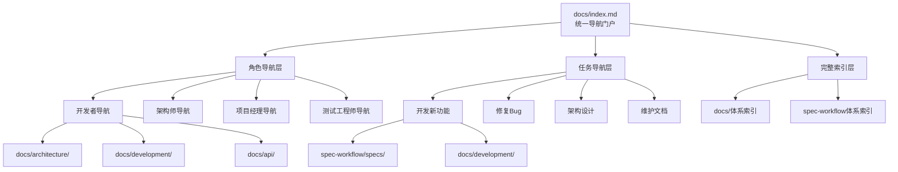

# 统一文档导航门户技术设计文档

## 概述

本设计文档详细说明如何实现统一文档导航门户，以docs/index.md为唯一入口，提供角色化和任务类型的文档导航，解决开发者面临的多体系文档查找困难问题。

### 项目背景
- **核心问题**：docs/和spec-workflow/两套文档体系并存，开发者查找信息时面临选择困难
- **解决方案**：建立统一导航门户，保持两个体系分工，提供清晰的信息查找路径
- **用户价值**：消除"标准错乱"问题，提升文档查找效率60%以上

## Steering文档对齐

### 技术标准 (tech.md)
本设计严格遵循项目的技术标准：
- **模块化设计**：每个导航组件职责单一，可独立维护
- **接口清晰**：定义明确的文档分类和链接管理接口
- **依赖最小化**：不引入额外技术依赖，基于现有Markdown结构
- **标准化流程**：遵循项目的文档更新和维护规范

### 项目结构 (structure.md)
实现方案完全符合项目组织规范：
- **文档归档**：统一使用docs/作为入口目录，spec-workflow/保持独立
- **文件组织**：导航结构按功能模块分类，便于维护和扩展
- **命名规范**：遵循项目的文件命名和组织约定
- **版本控制**：所有文档变更通过Git进行版本管理

## 代码复用分析

### 现有组件利用
- **docs/index.md现有结构**：复用现有的文档分类和导航基础，进行扩展优化
- **CLAUDE.md中的工作流定义**：利用现有的双轨工作流说明，指导导航分类
- **.spec-workflow/templates/**：参考现有的模板结构，设计导航模板
- **现有交叉引用模式**：复用项目中的文档链接和引用模式

### 集成点
- **Git版本控制**：文档更新通过Git进行版本管理和协作
- **MCP工具链**：集成现有的文档编辑和管理工具
- **Dashboard系统**：与spec-workflow的审批流程保持集成
- **搜索功能**：利用现有文件搜索能力，不引入新的搜索系统

## 架构设计

### 整体架构原则
采用**分层信息架构**模式，通过统一的入口层解决多体系导航问题：



### 模块化设计原则
- **单一文件职责**：docs/index.md专门负责导航和入口功能
- **组件隔离**：角色导航、任务导航、索引功能各自独立模块
- **服务层分离**：导航展示、链接管理、搜索功能分层设计
- **工具模块化**：导航维护工具、链接检查工具各自独立

## 组件和接口设计

### 组件1：统一导航门户 (docs/index.md)
- **目的**：作为项目的唯一文档入口，提供全面的导航功能
- **接口**：
  - 角色选择导航界面
  - 任务类型快速导航
  - 完整文档分类索引
  - 搜索和帮助功能
- **依赖**：docs/目录结构、spec-workflow目录结构、现有文档链接
- **复用**：现有的docs/index.md基础结构、项目导航模式

### 组件2：角色化导航模块
- **目的**：根据用户角色提供个性化的文档导航
- **接口**：
  - 开发者角色导航（架构标准、开发规范、API文档）
  - 架构师角色导航（技术决策、设计文档、架构规范）
  - 项目经理角色导航（项目状态、需求文档、完成报告）
  - 测试工程师角色导航（测试标准、测试工具、质量报告）
- **依赖**：各角色的核心文档集合、现有的文档分类体系
- **复用**：现有的角色定义、文档分类标准

### 组件3：任务类型导航模块
- **目的**：根据具体任务提供相关的文档和指导
- **接口**：
  - 开发新功能导航（spec-workflow流程 + docs/技术标准）
  - 修复Bug导航（docs/规范 + 问题排查指南）
  - 架构设计导航（docs/架构标准 + 设计决策流程）
  - 维护文档导航（各体系的更新流程）
- **依赖**：现有的工作流程定义、各任务类型的相关文档
- **复用**：CLAUDE.md中的工作流定义、现有的操作指南

### 组件4：交叉引用系统
- **目的**：在相关文档间建立自动化的链接关系
- **接口**：
  - 架构标准 ↔ 设计决策的双向链接
  - 项目需求 ↔ 技术标准的关联链接
  - 归档文档的位置说明和重定向
  - 相关文档的自动推荐
- **依赖**：文档间的关联关系、现有的链接管理机制
- **复用**：项目中的文档引用模式、链接检查工具

## 数据模型设计

### 导航条目模型
```
NavigationEntry {
  title: string           // 导航标题
  description: string     // 简要描述
  path: string           // 文档路径
  category: string       // 分类（角色/任务/标准）
  system: string         // 体系（docs/spec-workflow）
  tags: string[]         // 标签数组
  relatedEntries: string[] // 相关导航条目
  lastUpdated: datetime  // 最后更新时间
  isActive: boolean      // 是否激活
}
```

### 角色导航配置模型
```
RoleNavigation {
  roleName: string       // 角色名称
  description: string    // 角色描述
  primaryCategories: NavigationEntry[]  // 主要导航分类
  quickLinks: NavigationEntry[]         // 快速链接
  relatedTasks: TaskNavigation[]        // 相关任务导航
  system: string         // 主要使用的文档体系
}
```

### 任务导航配置模型
```
TaskNavigation {
  taskType: string       // 任务类型
  description: string    // 任务描述
  workflow: NavigationEntry[]           // 工作流程导航
  standards: NavigationEntry[]          // 相关标准文档
  tools: NavigationEntry[]              // 工具和资源
  examples: NavigationEntry[]           // 示例和参考
}
```

## 错误处理策略

### 错误场景1：文档链接失效
- **场景**：用户点击导航链接但目标文档不存在或路径错误
- **处理方式**：
  - 提供友好的404错误提示
  - 建议可能的替代文档
  - 记录失效链接用于后续修复
- **用户影响**：看到错误提示和替代建议，不会中断导航体验

### 错误场景2：跨体系文档访问权限问题
- **场景**：用户尝试访问spec-workflow中的文档但权限不足
- **处理方式**：
  - 提供权限说明和申请流程
  - 显示可公开访问的替代信息
  - 引导至相关公开文档
- **用户影响**：了解访问限制并获得替代方案

### 错误场景3：导航配置错误
- **场景**：导航配置文件格式错误或数据不一致
- **处理方式**：
  - 启用默认的简化导航模式
  - 显示基本的文档分类索引
  - 记录错误信息用于维护
- **用户影响**：使用简化导航，基本功能不受影响

### 错误场景4：文档内容过时
- **场景**：导航指向的文档内容长时间未更新
- **处理方式**：
  - 显示文档最后更新时间
  - 提醒内容可能过时
  - 建议联系维护人员
- **用户影响**：了解文档状态，做出相应判断

## 测试策略

### 单元测试
- **导航条目验证**：测试每个导航条目的路径有效性和分类正确性
- **角色导航测试**：验证各角色导航的文档相关性和完整性
- **任务导航测试**：确认任务类型导航的工作流程和标准文档覆盖度
- **链接有效性测试**：自动化检查所有导航链接的可访问性

### 集成测试
- **跨体系导航流程**：测试从docs/入口到spec-workflow文档的完整导航流程
- **角色切换测试**：验证不同角色导航的切换和数据一致性
- **搜索集成测试**：测试导航与现有搜索功能的集成效果
- **权限控制测试**：验证不同权限用户对导航功能的访问控制

### 端到端测试
- **开发者完整工作流**：模拟开发者查找架构标准、开发规范、API文档的完整流程
- **项目经理工作流**：测试项目经理查看项目状态、需求文档、完成报告的导航体验
- **新用户引导流程**：验证新用户通过统一门户快速了解项目文档结构的效果
- **文档维护流程**：测试文档更新后导航自动更新的完整流程

## 实施计划和里程碑

### 阶段1：基础导航门户搭建（第1周）
- 重构docs/index.md为统一导航门户
- 建立基础的文档分类和索引
- 创建角色导航的初始结构

### 阶段2：角色化导航完善（第2周）
- 完善各角色的详细导航内容
- 建立任务类型导航机制
- 添加交叉引用和快速链接

### 阶段3：优化和测试（第3周）
- 进行全面的用户体验测试
- 修复链接和导航问题
- 优化导航性能和易用性

### 阶段4：部署和监控（第4周）
- 正式部署统一导航门户
- 监控使用情况和用户反馈
- 建立持续优化机制