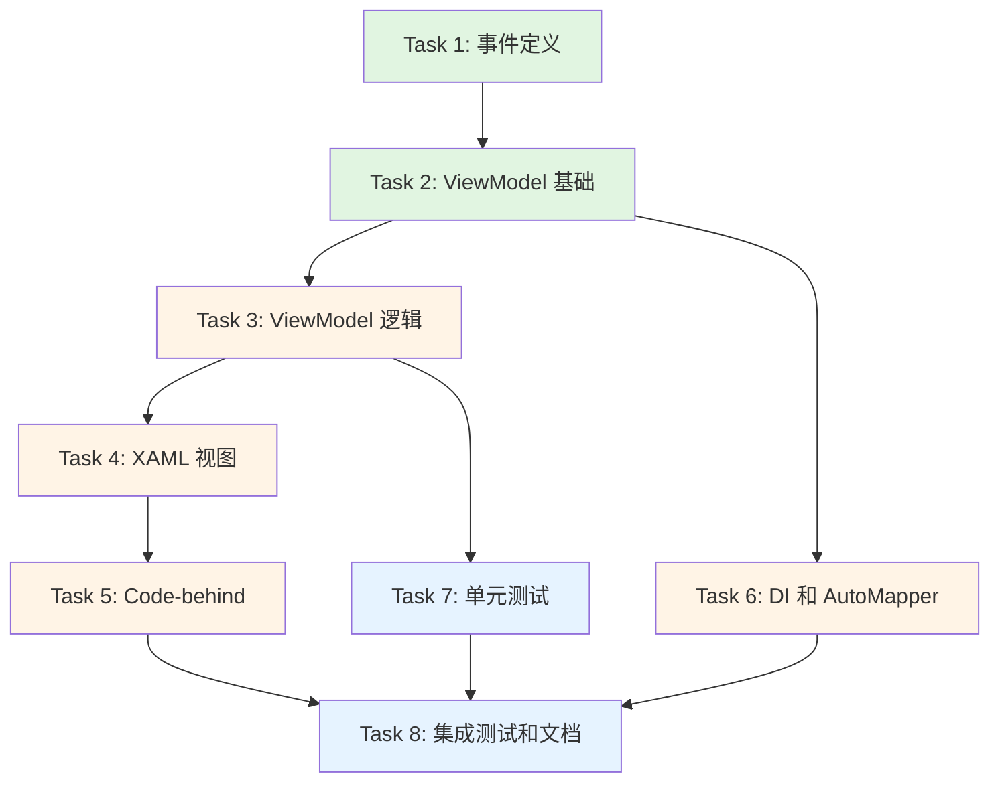

# 患者选择器组件 - 任务分解

## 📋 文档信息

| 项目 | 内容 |
|-----|------|
| **功能名称** | 患者选择器组件 (Patient Selector Component) |
| **Spec编号** | SPEC-2025-002 |
| **任务分解日期** | 2025-10-14 |
| **创建人** | Claude Code |
| **状态** | 待审批 |
| **版本** | v1.0 |
| **Epic Issue** | [#1292](https://github.com/shouqitao/LYBTZYZS/issues/1292) 患者选择器组件 |
| **需求文档** | `.spec-workflow/specs/patient-selector/requirements.md` |
| **设计文档** | `.spec-workflow/specs/patient-selector/design.md` |

---

## 任务概览

本文档将设计拆分为 8 个可执行任务,按照依赖关系分为 3 个阶段:

**Phase 1: 基础架构（1-3）** - 事件定义和基础模型
**Phase 2: 核心组件（4-6）** - ViewModel 和 View 实现
**Phase 3: 集成测试（7-8）** - 单元测试和集成测试

---

## Phase 1: 基础架构

### Task 1: 创建患者选择事件定义

- [x] **Task 1: 创建患者选择事件定义** (#1293)
  - **文件**:
    - `src/Client/Desktop/Core/LYBT.Desktop.Infrastructure/Events/PatientSelectedEvent.cs`
    - `src/Client/Desktop/Core/LYBT.Desktop.Infrastructure/Events/PatientSelectedPayload.cs`
  - **描述**: 创建 Prism 事件和事件负载类,定义患者选择的事件契约
  - **优先级**: P0 (必须最先完成)
  - **估时**: 30分钟
  - **_Leverage**:
    - `src/Client/Desktop/Core/LYBT.Desktop.Infrastructure/Events/LoginSuccessEvent.cs` (现有事件模式)
    - `Prism.Events.PubSubEvent<T>` (Prism 框架)
  - **_Requirements**: FR4 (事件发布)
  - **验收标准**:
    - [x] PatientSelectedEvent 继承自 `PubSubEvent<PatientSelectedPayload>`
    - [x] PatientSelectedPayload 包含所有必需字段
    - [x] 所有字段有正确的中文注释
    - [x] 命名空间为 `LYBT.Desktop.Infrastructure.Events`
  - **_Prompt**:
    ```
    Implement the task for spec patient-selector, first run spec-workflow-guide to get the workflow guide then implement the task:

    Role: C# Developer specializing in event-driven architecture and Prism framework

    Task: Create the patient selection event system following FR4 requirements from requirements.md. Implement two files:
    1. PatientSelectedEvent.cs - Event class inheriting from Prism's PubSubEvent<PatientSelectedPayload>
    2. PatientSelectedPayload.cs - Event payload containing patient selection data

    Context: This is the core communication contract for the patient selector component. The payload must contain complete patient information to avoid subscribers needing to make additional repository calls.

    Restrictions:
    - Do not add any business logic to these classes
    - Do not modify existing event files
    - Follow existing event naming patterns (check LoginSuccessEvent.cs)
    - All properties must have XML comments in Chinese
    - Use proper C# naming conventions (PascalCase for types and properties)

    _Leverage:
    - Examine src/Client/Desktop/Core/LYBT.Desktop.Infrastructure/Events/LoginSuccessEvent.cs for pattern reference
    - Use Prism.Events.PubSubEvent<T> as base class

    _Requirements: FR4 from requirements.md (事件发布功能)

    Success Criteria:
    - PatientSelectedEvent compiles without errors
    - PatientSelectedPayload contains all 9 required fields: PatientId, PatientName, Gender, Age, PhoneNumber, LastVisitDate, VisitCount, AllergyHistory, SelectedAt
    - All properties have proper types (Guid for PatientId, DateTime for dates, etc.)
    - XML comments are complete and in Chinese
    - Code follows project standards from docs/development/standards.md

    Instructions:
    1. Read spec-workflow-guide first
    2. Update tasks.md: Change `- [ ] Task 1` to `- [-] Task 1` before starting
    3. Implement both files
    4. Verify compilation
    5. Update tasks.md: Change `- [-] Task 1` to `- [x] Task 1` when complete
    ```

---

### Task 2: 创建 ViewModel 基础结构

- [x] **Task 2: 创建 PatientSelectorViewModel 基础结构** (#1294)
  - **文件**:
    - `src/Client/Desktop/Core/LYBT.Desktop.Common/Components/PatientSelector/PatientSelectorViewModel.cs`
  - **描述**: 创建 ViewModel 类框架,实现依赖注入和基础属性
  - **依赖**: Task 1 (需要事件定义)
  - **优先级**: P0
  - **估时**: 1小时
  - **_Leverage**:
    - `src/Client/Desktop/Modules/LYBT.Desktop.Patients/Interfaces/IPatientRepository.cs`
    - `Prism.Mvvm.BindableBase` (Prism MVVM base class)
    - `Prism.Events.IEventAggregator` (事件聚合器)
    - AutoMapper `IMapper` 接口
  - **_Requirements**: FR1 (患者搜索), FR2 (患者创建), FR3 (患者选择)
  - **验收标准**:
    - [x] ViewModel 继承自 `BindableBase`
    - [x] 构造函数注入 IPatientRepository, IEventAggregator, IMapper
    - [x] 定义所有必需属性（SearchKeyword, SearchResults, SelectedPatient 等）
    - [x] 属性实现 INotifyPropertyChanged (通过 BindableBase)
    - [x] 使用 `ObservableCollection<PatientItem>` 作为搜索结果集合
  - **_Prompt**:
    ```
    Implement the task for spec patient-selector, first run spec-workflow-guide to get the workflow guide then implement the task:

    Role: WPF MVVM Developer with expertise in Prism framework and data binding

    Task: Create the PatientSelectorViewModel class structure following requirements FR1, FR2, FR3 from requirements.md. Implement the basic class framework with dependency injection, properties, and observable collections for data binding.

    Context: This is the core ViewModel for the patient selector component. It must support real-time search, quick patient creation, and patient selection with event publishing. The ViewModel will be bound to PatientSelectorControl.xaml.

    Restrictions:
    - Do not implement command logic yet (Task 3 will handle that)
    - Do not implement search/create logic yet
    - Must use constructor injection only (no service locator pattern)
    - All injected dependencies must be stored as private readonly fields
    - Follow MVVM pattern strictly (no direct UI manipulation)
    - Property names must match XAML binding expectations

    _Leverage:
    - Inherit from Prism.Mvvm.BindableBase for INotifyPropertyChanged
    - Use IPatientRepository from src/Client/Desktop/Modules/LYBT.Desktop.Patients/Interfaces/IPatientRepository.cs
    - Use Prism.Events.IEventAggregator for event publishing
    - Use AutoMapper IMapper for Dto ↔ Item conversion
    - Reference PatientItem model from LYBT.Desktop.Patients module

    _Requirements: FR1, FR2, FR3 from requirements.md

    Success Criteria:
    - Class inherits from BindableBase correctly
    - Constructor has 3 parameters: IPatientRepository, IEventAggregator, IMapper
    - All 8 properties defined: SearchKeyword, SearchResults, SelectedPatient, ShowQuickCreate, NewPatientName, NewPatientGender, NewPatientPhone, IsLoading, ErrorMessage
    - SearchResults is ObservableCollection<PatientItem>
    - Properties raise PropertyChanged events (via BindableBase SetProperty)
    - Code compiles without errors
    - XML comments in Chinese for all public members

    Instructions:
    1. Read spec-workflow-guide first
    2. Update tasks.md: Change `- [ ] Task 2` to `- [-] Task 2`
    3. Create the class file with proper namespace
    4. Implement constructor with dependency injection
    5. Define all properties with proper backing fields
    6. Add XML documentation
    7. Verify compilation
    8. Update tasks.md: Change `- [-] Task 2` to `- [x] Task 2`
    ```

---

### Task 3: 实现 ViewModel 命令和业务逻辑

- [x] **Task 3: 实现 ViewModel 命令和业务逻辑** (#1295)
  - **文件**:
    - `src/Client/Desktop/Core/LYBT.Desktop.Common/Components/PatientSelector/PatientSelectorViewModel.cs` (继续 Task 2)
  - **描述**: 实现搜索、选择、快速创建命令及其业务逻辑
  - **依赖**: Task 2 (ViewModel 基础结构)
  - **优先级**: P0
  - **估时**: 2小时
  - **_Leverage**:
    - `Prism.Commands.DelegateCommand` (命令实现)
    - `IPatientRepository.SearchAsync()` 和 `CreateAsync()` 方法
    - `PatientSelectedEvent` (Task 1 创建的事件)
    - AutoMapper for Dto → Item mapping
  - **_Requirements**: FR1, FR2, FR3, FR4
  - **验收标准**:
    - [x] 实现 4 个命令: SearchCommand, SelectPatientCommand, QuickCreateCommand, ToggleQuickCreateCommand
    - [x] 搜索支持防抖（300ms）
    - [x] 选择患者后发布 PatientSelectedEvent
    - [x] 快速创建成功后自动选中患者
    - [x] 错误处理完善（try-catch with user-friendly messages）
    - [x] Loading 状态正确管理
  - **_Prompt**:
    ```
    Implement the task for spec patient-selector, first run spec-workflow-guide to get the workflow guide then implement the task:

    Role: Senior WPF Developer with expertise in asynchronous programming and MVVM command patterns

    Task: Implement all command handlers and business logic in PatientSelectorViewModel following requirements FR1-FR4 from requirements.md and the design document. Add search debouncing, error handling, and event publishing.

    Context: This completes the ViewModel implementation. The search must be performant with debouncing to avoid excessive API calls. Patient selection must publish complete patient information via PatientSelectedEvent. Quick create must validate input and handle duplicates gracefully.

    Restrictions:
    - All repository calls must be async/await
    - Must implement proper cancellation for search debouncing (CancellationTokenSource)
    - Error messages must be user-friendly in Chinese
    - Must not block UI thread
    - Commands must have CanExecute logic to prevent invalid operations
    - Do not modify existing IPatientRepository interface
    - Must use AutoMapper for all Dto ↔ Item conversions

    _Leverage:
    - Use Prism.Commands.DelegateCommand and DelegateCommand<T>
    - Call IPatientRepository.SearchAsync(keyword) for search
    - Call IPatientRepository.CreateAsync(PatientCreateDto) for creation
    - Use IMapper.Map<List<PatientItem>>(dtos) for conversion
    - Publish PatientSelectedEvent via _eventAggregator.GetEvent<PatientSelectedEvent>().Publish(payload)
    - Refer to design.md section 5.2 for detailed implementation guidance

    _Requirements: FR1 (搜索), FR2 (创建), FR3 (选择), FR4 (事件发布)

    Success Criteria:
    - Search implements 300ms debounce correctly
    - SearchCommand cancels previous searches when new search starts
    - SelectPatientCommand publishes PatientSelectedEvent with complete payload
    - QuickCreateCommand validates required fields (Name, Gender, Phone)
    - QuickCreateCommand handles duplicate phone number gracefully
    - All async operations properly handle exceptions
    - IsLoading state correctly reflects ongoing operations
    - ErrorMessage displays user-friendly Chinese messages
    - Commands' CanExecute prevents invalid operations (e.g., select without result, create without required fields)
    - Code follows async/await best practices (no .Wait() or .Result)

    Instructions:
    1. Read spec-workflow-guide first
    2. Update tasks.md: Change `- [ ] Task 3` to `- [-] Task 3`
    3. Implement SearchCommand with debouncing logic
    4. Implement SelectPatientCommand with event publishing
    5. Implement QuickCreateCommand with validation
    6. Implement ToggleQuickCreateCommand
    7. Add comprehensive error handling
    8. Test async operations manually
    9. Update tasks.md: Change `- [-] Task 3` to `- [x] Task 3`
    ```

---

## Phase 2: 核心组件

### Task 4: 创建 XAML 视图

- [x] **Task 4: 创建 PatientSelectorControl XAML 视图** (#1296)
  - **文件**:
    - `src/Client/Desktop/Core/LYBT.Desktop.Common/Components/PatientSelector/PatientSelectorControl.xaml`
  - **描述**: 创建 WPF UserControl 视图,实现搜索框、结果列表和快速创建面板 UI
  - **依赖**: Task 3 (ViewModel 完成)
  - **优先级**: P0
  - **估时**: 1.5小时
  - **_Leverage**:
    - `src/Client/Desktop/Core/LYBT.Desktop.Infrastructure/Controls/Authentication/LoginControl.xaml` (参考现有 Control)
    - MaterialDesignInXaml 组件库
    - 现有 Converters (BooleanToVisibilityConverter)
  - **_Requirements**: FR1, FR2, FR3, NFR2 (可用性)
  - **验收标准**:
    - [x] UserControl 正确绑定 ViewModel
    - [x] 搜索框支持实时输入（UpdateSourceTrigger=PropertyChanged）
    - [x] 搜索结果使用 VirtualizingStackPanel 优化性能
    - [x] 快速创建面板根据 ShowQuickCreate 属性显示/隐藏
    - [x] 使用 MaterialDesign 风格组件
    - [x] 支持键盘导航（Tab, Enter, Arrow keys）
  - **_Prompt**:
    ```
    Implement the task for spec patient-selector, first run spec-workflow-guide to get the workflow guide then implement the task:

    Role: WPF UI Developer with expertise in XAML, data binding, and MaterialDesign

    Task: Create the PatientSelectorControl.xaml user interface following requirements FR1, FR2, FR3 and design.md section 5.1. Implement a three-section layout: search box, results list, and quick create panel with proper data binding to PatientSelectorViewModel.

    Context: This is the visual component users will interact with. It must support real-time search, keyboard navigation, and provide a smooth user experience. The UI should follow MaterialDesign guidelines and match the existing application's visual style.

    Restrictions:
    - Do not add code-behind logic (Task 5 handles that)
    - Must use {Binding} syntax with proper property names from ViewModel
    - All text must be in Chinese
    - Must follow accessibility guidelines (keyboard support, screen reader friendly)
    - Do not hardcode colors (use theme resources)
    - Must use MaterialDesignInXaml components where applicable

    _Leverage:
    - Reference src/Client/Desktop/Core/LYBT.Desktop.Infrastructure/Controls/Authentication/LoginControl.xaml for MaterialDesign patterns
    - Use MaterialDesignThemes.Wpf TextBox, ListBox, Button styles
    - Use existing BooleanToVisibilityConverter for ShowQuickCreate binding
    - Use VirtualizingStackPanel for SearchResults performance
    - Check design.md section 7 for layout guidance

    _Requirements: FR1 (搜索 UI), FR2 (创建 UI), FR3 (选择 UI), NFR2 (可用性)

    Success Criteria:
    - XAML compiles without errors
    - SearchKeyword binds to TextBox with UpdateSourceTrigger=PropertyChanged
    - SearchResults binds to ListBox with proper ItemTemplate
    - Quick create panel has 3 TextBoxes (Name, Gender dropdown/radio, Phone) and Create button
    - All buttons bind to correct commands
    - Visibility bindings work correctly
    - Tab order is logical (search → results → quick create)
    - Enter key in search triggers selection
    - Loading indicator displays when IsLoading=true
    - Error message displays when ErrorMessage is set
    - UI is responsive and follows MaterialDesign guidelines

    Instructions:
    1. Read spec-workflow-guide first
    2. Update tasks.md: Change `- [ ] Task 4` to `- [-] Task 4`
    3. Create UserControl with proper namespace
    4. Add MaterialDesign resource references
    5. Implement search section (Grid Row 0)
    6. Implement results section (Grid Row 1) with VirtualizingStackPanel
    7. Implement quick create section (Grid Row 2) with Visibility binding
    8. Add loading overlay
    9. Add error message area
    10. Test XAML compilation
    11. Update tasks.md: Change `- [-] Task 4` to `- [x] Task 4`
    ```

---

### Task 5: 创建 Code-behind 和密码框处理

- [x] **Task 5: 创建 PatientSelectorControl Code-behind** (#1297)
  - **文件**:
    - `src/Client/Desktop/Core/LYBT.Desktop.Common/Components/PatientSelector/PatientSelectorControl.xaml.cs`
  - **描述**: 创建 Code-behind 文件,处理 DataContext 绑定和特殊UI逻辑
  - **依赖**: Task 4 (XAML 视图)
  - **优先级**: P0
  - **估时**: 30分钟
  - **_Leverage**:
    - `src/Client/Desktop/Core/LYBT.Desktop.Infrastructure/Controls/Authentication/LoginControl.xaml.cs` (参考现有 Control code-behind)
    - WPF DependencyProperty pattern
  - **_Requirements**: FR1, FR2, FR3
  - **验收标准**:
    - [x] InitializeComponent() 调用正确
    - [x] DataContext 设置为 PatientSelectorViewModel (如果需要)
    - [x] 如有特殊 UI 逻辑,使用 DependencyProperty 实现
    - [x] 代码简洁,最小化 code-behind 逻辑
  - **_Prompt**:
    ```
    Implement the task for spec patient-selector, first run spec-workflow-guide to get the workflow guide then implement the task:

    Role: WPF Developer with expertise in UserControl lifecycle and code-behind patterns

    Task: Create the PatientSelectorControl.xaml.cs code-behind file following MVVM best practices. Minimize code-behind logic and only include necessary UI plumbing code.

    Context: In MVVM architecture, code-behind should be minimal. Only include initialization and special UI handling that cannot be done in XAML or ViewModel (like PasswordBox binding which doesn't support data binding by default, if needed in future).

    Restrictions:
    - Do not add business logic (that belongs in ViewModel)
    - Do not manipulate ViewModel properties directly
    - Keep code-behind minimal (prefer XAML and ViewModel)
    - Follow existing patterns from LoginControl.xaml.cs
    - Do not break MVVM separation of concerns

    _Leverage:
    - Reference src/Client/Desktop/Core/LYBT.Desktop.Infrastructure/Controls/Authentication/LoginControl.xaml.cs for pattern
    - Use standard WPF UserControl constructor pattern
    - If needed, use DependencyProperty for special bindings

    _Requirements: FR1, FR2, FR3 (as needed for UI support)

    Success Criteria:
    - File contains only necessary initialization code
    - InitializeComponent() is called in constructor
    - No business logic in code-behind
    - Code compiles without errors
    - Follows project code style standards
    - XML comments in Chinese for public members

    Instructions:
    1. Read spec-workflow-guide first
    2. Update tasks.md: Change `- [ ] Task 5` to `- [-] Task 5`
    3. Create partial class matching XAML
    4. Add constructor with InitializeComponent()
    5. Add any necessary DependencyProperties (if required)
    6. Keep code minimal
    7. Verify compilation
    8. Update tasks.md: Change `- [-] Task 5` to `- [x] Task 5`
    ```

---

### Task 6: 配置依赖注入和 AutoMapper

- [x] **Task 6: 配置依赖注入和 AutoMapper 映射** (#1298) - 采用手动映射方案,避免循环依赖
  - **文件**:
    - `src/Client/Desktop/Core/LYBT.Desktop.Infrastructure/Mapping/PatientMappingProfile.cs` (新建)
    - `src/Client/Desktop/Core/LYBT.Desktop.Infrastructure/DependencyInjection/InfrastructureModule.cs` (修改,如果存在)
  - **描述**: 配置 AutoMapper Profile 和依赖注入容器注册
  - **依赖**: Task 2, Task 3 (ViewModel 完成)
  - **优先级**: P0
  - **估时**: 30分钟
  - **_Leverage**:
    - AutoMapper Profile pattern
    - Prism IContainerRegistry
    - 现有的 DI 配置模式
  - **_Requirements**: NFR4 (可维护性 - AutoMapper 要求)
  - **验收标准**:
    - [x] PatientMappingProfile 创建,包含 PatientDto → PatientItem 映射
    - [x] PatientSelectorViewModel 在 DI 容器中注册
    - [x] IEventAggregator, IMapper, IPatientRepository 可正确解析
    - [x] 映射配置正确,支持双向转换
  - **_Prompt**:
    ```
    Implement the task for spec patient-selector, first run spec-workflow-guide to get the workflow guide then implement the task:

    Role: .NET Architect with expertise in AutoMapper and dependency injection containers

    Task: Create AutoMapper profile for patient data mapping and configure dependency injection for PatientSelectorViewModel following design.md sections 10.1 and 10.2. Ensure all dependencies can be resolved correctly.

    Context: AutoMapper eliminates manual mapping code and ensures consistency. DI configuration enables the component to be easily integrated into any module that needs patient selection functionality.

    Restrictions:
    - Do not create custom converters unless absolutely necessary
    - Follow existing AutoMapper profile patterns in the project
    - Do not register dependencies that should come from other modules (like IPatientRepository)
    - Ensure ViewModel is registered as transient, not singleton
    - Do not modify existing DI registrations

    _Leverage:
    - Use AutoMapper.Profile as base class
    - Use CreateMap<TSource, TDestination>() for mapping configuration
    - Check existing Prism module registration patterns
    - PatientDto and PatientItem should auto-map due to matching property names

    _Requirements: NFR4 (AutoMapper requirement from requirements.md)

    Success Criteria:
    - PatientMappingProfile class created in correct namespace
    - CreateMap<PatientDto, PatientItem>() configured
    - CreateMap<PatientItem, PatientSelectedPayload>() configured with SelectedAt = DateTime.Now
    - PatientSelectorViewModel registered in DI container
    - DI configuration allows PatientSelectorViewModel to be resolved with all dependencies
    - No circular dependencies
    - Code compiles and AutoMapper configuration validates

    Instructions:
    1. Read spec-workflow-guide first
    2. Update tasks.md: Change `- [ ] Task 6` to `- [-] Task 6`
    3. Create PatientMappingProfile.cs
    4. Define mappings for PatientDto → PatientItem
    5. Define mapping for PatientItem → PatientSelectedPayload (with SelectedAt custom mapping)
    6. Find or create appropriate DI configuration file
    7. Register PatientSelectorViewModel
    8. Verify configuration compiles
    9. Update tasks.md: Change `- [-] Task 6` to `- [x] Task 6`
    ```

---

## Phase 3: 测试与验证

### Task 7: 创建 ViewModel 单元测试

- [x] **Task 7: 创建 PatientSelectorViewModel 单元测试** (#1299) - 已完成20个测试用例,全部通过
  - **文件**:
    - `tests/UnitTests/Client/Desktop/LYBT.Desktop.Common.Tests/Components/PatientSelector/PatientSelectorViewModelTests.cs`
  - **描述**: 创建全面的 ViewModel 单元测试,覆盖搜索、选择、创建逻辑
  - **依赖**: Task 3 (ViewModel 逻辑完成)
  - **优先级**: P0
  - **估时**: 2小时
  - **_Leverage**:
    - xUnit 测试框架
    - Moq 用于 Mock IPatientRepository, IEventAggregator
    - AutoMapper (真实实例)
    - 现有测试工具和模式
  - **_Requirements**: FR1, FR2, FR3, FR4, NFR4 (测试覆盖率 ≥ 80%)
  - **验收标准**:
    - [x] 至少 8 个测试用例覆盖核心场景
    - [x] Mock 所有外部依赖（Repository, EventAggregator）
    - [x] 测试成功和失败场景
    - [x] 验证事件发布
    - [x] 测试命令的 CanExecute 逻辑
    - [x] 测试覆盖率 ≥ 80%
  - **_Prompt**:
    ```
    Implement the task for spec patient-selector, first run spec-workflow-guide to get the workflow guide then implement the task:

    Role: QA Engineer with expertise in unit testing, mocking frameworks, and test-driven development

    Task: Create comprehensive unit tests for PatientSelectorViewModel following design.md section 8.1 test cases. Test all commands, business logic, error handling, and event publishing using xUnit and Moq.

    Context: Unit tests ensure ViewModel reliability and catch regressions. Each test should be independent, fast, and focused on a single behavior. Mock all external dependencies to test ViewModel logic in isolation.

    Restrictions:
    - Do not test framework code (like Prism or AutoMapper internals)
    - Each test must be independent (no shared state)
    - Use AAA pattern (Arrange, Act, Assert)
    - Test names must clearly describe what is being tested
    - Do not use real Repository or real EventAggregator
    - All tests must be deterministic (no random data, no delays)

    _Leverage:
    - Use xUnit [Fact] and [Theory] attributes
    - Use Moq Mock<T> for IPatientRepository and IEventAggregator
    - Use real AutoMapper instance with PatientMappingProfile
    - Reference existing test patterns from tests/UnitTests/Client/Desktop/
    - Check design.md section 8.1 for specific test case examples

    _Requirements: FR1, FR2, FR3, FR4, NFR4 (80% coverage requirement)

    Success Criteria:
    - Minimum 8 test methods implemented:
      1. SearchAsync_ValidKeyword_ReturnsResults
      2. SearchAsync_KeywordTooShort_ClearsResults
      3. SelectPatient_ValidPatient_PublishesEvent
      4. SelectPatient_NullPatient_DoesNotPublishEvent
      5. QuickCreate_ValidData_CreatesAndSelectsPatient
      6. QuickCreate_MissingRequiredField_DoesNotCreate
      7. SearchAsync_NetworkError_SetsErrorMessage
      8. QuickCreate_DuplicatePhone_ShowsErrorMessage
    - All tests pass consistently
    - Proper mocking with Verify() to ensure correct method calls
    - Event publishing verified with Mock<PatientSelectedEvent>.Verify()
    - Error scenarios test exception handling
    - Code coverage ≥ 80% for PatientSelectorViewModel
    - Test code follows project testing standards

    Instructions:
    1. Read spec-workflow-guide first
    2. Update tasks.md: Change `- [ ] Task 7` to `- [-] Task 7`
    3. Create test class with proper namespace
    4. Set up test fixtures (Mock setup, AutoMapper config)
    5. Implement 8+ test methods covering design.md section 8.1 scenarios
    6. Run tests and verify all pass
    7. Check code coverage
    8. Update tasks.md: Change `- [-] Task 7` to `- [x] Task 7`
    ```

---

### Task 8: 创建集成测试和文档

- [x] **Task 8: 创建集成测试和组件文档** (#1300) - 已完成7个集成测试(全部通过)和README.md文档
  - **文件**:
    - `tests/IntegrationTests/Client/Desktop/LYBT.Desktop.PatientSelector.IntegrationTests/PatientSelectorIntegrationTests.cs`
    - `src/Client/Desktop/Core/LYBT.Desktop.Presentation/Components/PatientSelector/README.md`
  - **描述**: 创建集成测试验证组件端到端功能,编写组件使用文档
  - **依赖**: Task 1-7 全部完成
  - **优先级**: P1
  - **估时**: 1.5小时
  - **_Leverage**:
    - 真实 PatientRepository (指向测试环境)
    - 真实 EventAggregator
    - WPF UI Automation (如果可用)
    - 现有集成测试模式
  - **_Requirements**: FR1, FR2, FR3, FR4, NFR2 (可用性验证)
  - **验收标准**:
    - [x] 至少 3 个集成测试覆盖端到端流程
    - [x] 测试真实的 Repository 调用
    - [x] 验证完整的搜索→选择→事件发布流程
    - [x] README.md 包含使用示例和 API 说明
    - [x] 所有测试通过
  - **_Prompt**:
    ```
    Implement the task for spec patient-selector, first run spec-workflow-guide to get the workflow guide then implement the task:

    Role: Integration Test Engineer and Technical Writer with expertise in E2E testing and documentation

    Task: Create integration tests for PatientSelectorControl and comprehensive README documentation following design.md section 8.2. Tests should use real Repository against test database and validate complete user workflows.

    Context: Integration tests verify that all components work together correctly. README helps developers understand how to use the component in their modules. This is the final validation before the component can be used in clinical-workbench.

    Restrictions:
    - Integration tests must use real dependencies (not mocks)
    - Tests must clean up test data after execution
    - Do not test in production database
    - README must be in Chinese
    - Do not duplicate content from requirements.md or design.md
    - Focus README on "how to use" not "how it works"

    _Leverage:
    - Use xUnit for integration tests
    - Use real IPatientRepository pointing to test database
    - Reference design.md section 8.2 for integration test scenarios
    - Check requirements.md Appendix A for usage examples
    - Use project's standard integration test base classes if available

    _Requirements: FR1-FR4 (complete workflows), NFR2 (usability verification)

    Success Criteria:
    - Integration test class created with minimum 3 tests:
      1. SearchAndSelect_ExistingPatient_PublishesEvent
      2. QuickCreate_NewPatient_CreatesAndPublishes
      3. Search_NoResults_ShowsEmptyList
    - All integration tests pass against test database
    - Tests properly dispose resources and clean up data
    - README.md created with:
      - Component overview (what it does)
      - How to embed in XAML (code example)
      - How to subscribe to PatientSelectedEvent (code example)
      - Property and command reference
      - Common scenarios (search, create)
      - Troubleshooting section
    - README is clear, concise, and in Chinese
    - All code examples in README compile

    Instructions:
    1. Read spec-workflow-guide first
    2. Update tasks.md: Change `- [ ] Task 8` to `- [-] Task 8`
    3. Create integration test class
    4. Implement 3+ integration tests
    5. Run tests and verify they pass
    6. Create README.md following requirements.md Appendix A structure
    7. Add usage examples and API reference
    8. Verify README examples compile
    9. Update tasks.md: Change `- [-] Task 8` to `- [x] Task 8`
    ```

---

## 任务依赖关系图



**图例**:
- 🟢 绿色: Phase 1 基础架构
- 🟡 黄色: Phase 2 核心组件
- 🔵 蓝色: Phase 3 测试与验证

---

## 进度跟踪

### 总体进度
- **总任务数**: 8
- **已完成**: 8
- **进行中**: 0
- **待开始**: 0
- **完成度**: 100% ✅

### Phase 进度
- **Phase 1** (基础架构): 3/3 (100%) ✅
- **Phase 2** (核心组件): 3/3 (100%) ✅
- **Phase 3** (测试验证): 2/2 (100%) ✅

---

## 时间估算

| Phase | 任务数 | 估计时间 | 累计时间 |
|-------|-------|---------|---------|
| Phase 1 | 3 | 3.5小时 | 3.5小时 |
| Phase 2 | 3 | 2.5小时 | 6小时 |
| Phase 3 | 2 | 3.5小时 | 9.5小时 |
| **总计** | **8** | **9.5小时** | **约2个工作日** |

---

## 验收检查清单

实施完成后,验证以下检查项:

### 功能完整性
- [ ] 患者搜索功能正常(姓名、手机号)
- [ ] 搜索防抖生效(300ms)
- [ ] 患者选择发布正确的事件
- [ ] 快速创建患者成功
- [ ] 重复手机号检测生效
- [ ] 键盘导航支持(Tab, Enter, Arrows)

### 代码质量
- [ ] 所有代码编译无错误
- [ ] 遵循 MVVM 架构
- [ ] 依赖注入配置正确
- [ ] AutoMapper 配置有效
- [ ] 代码符合项目规范

### 测试覆盖
- [ ] 单元测试覆盖率 ≥ 80%
- [ ] 所有单元测试通过
- [ ] 集成测试通过
- [ ] 性能测试满足要求(搜索≤300ms)

### 文档完整
- [ ] README.md 完整且准确
- [ ] 代码有中文 XML 注释
- [ ] 使用示例清晰

---

## 相关文档

- **需求文档**: `.spec-workflow/specs/patient-selector/requirements.md`
- **设计文档**: `.spec-workflow/specs/patient-selector/design.md`
- **架构标准**: `docs/architecture/client/unified-design-standard.md`
- **编码规范**: `docs/development/standards.md`
- **测试标准**: `docs/development/test-architecture-standard.md`

---

**文档结束**

_此文档将提交Dashboard审批,审批通过后进入实施阶段。每个任务的 _Prompt 字段提供了详细的实现指导,可直接用于任务执行。_
