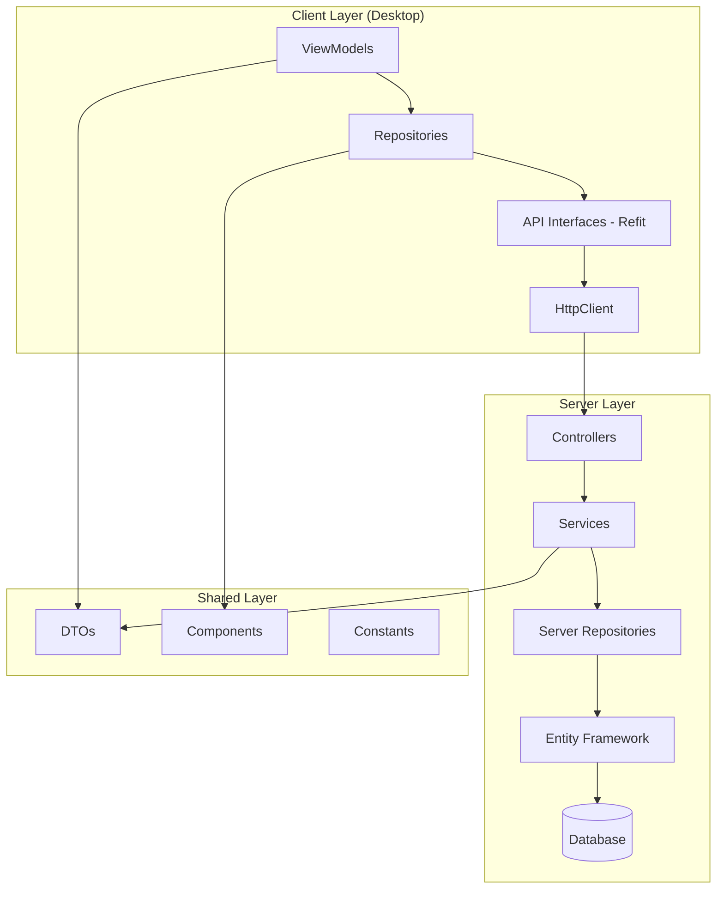
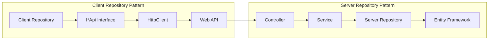

# Project Standardization 3.0 Design Document

## Overview

Project Standardization 3.0是一个全面的三端架构标准化项目，基于实际代码分析发现Repository架构的合理性，旨在消除技术债务、统一设计模式、提升代码质量。本设计将系统性地解决Repository实现标准化、ViewModel基类统一、测试架构整合、配置管理统一、DTO模型规范和代码质量工具集成六个核心领域的问题。

**关键发现**: Client端Repository实际上是正确的Service层抽象，包装HTTP客户端调用Server API，而非错误的数据库访问层。

## Steering Document Alignment

### Technical Standards (tech.md)
本设计严格遵循现有的技术标准和架构模式：
- **MVVM模式**: Desktop端继续使用Prism框架的MVVM模式
- **Repository模式**: 保持Client端Repository作为Service层抽象，Server端Repository作为数据访问层
- **依赖注入**: 统一使用DryIoc容器，标准化服务注册
- **分层架构**: Client(Repository/ViewModel/View) → Server(Controller/Service/Repository) → Shared(DTO/Components)

### Project Structure (structure.md)
实现将遵循现有的项目组织约定：
- **模块化设计**: 每个业务模块独立的Repository、ViewModel、Service层
- **Shared层统一**: 所有DTO、接口、通用组件放置在Shared层
- **测试分离**: 单元测试、集成测试、架构测试分别组织
- **配置集中**: 统一配置文件管理和环境配置

## Code Reuse Analysis

### Existing Components to Leverage

#### BaseRepository<TEntity> (Server端)
- **位置**: `src/Server/Core/LYBT.Infrastructure/Repositories/BaseRepository.cs`
- **用途**: 作为Server端Repository的基类，提供标准CRUD操作
- **扩展**: 将优化其泛型设计和性能特征

#### ConsultationRepository (Client端示例)
- **位置**: `src/Client/Desktop/Modules/LYBT.Desktop.Consultation/Repositories/ConsultationRepository.cs`
- **用途**: 作为Client端Repository的正确实现模式
- **扩展**: 将基于此模式创建统一的Client端Repository基类

#### UnifiedViewModelBase (Desktop端)
- **位置**: `src/Client/Desktop/Core/LYBT.Desktop.Models/ViewModels/Base/`
- **用途**: 作为Desktop端ViewModel的核心基类
- **整合**: 将统一所有ViewModel基类到此体系

#### Refit API接口体系
- **位置**: `src/Client/Desktop/Core/LYBT.Desktop.Contracts/Api/`
- **用途**: 提供类型安全的HTTP客户端接口
- **标准化**: 将统一API接口设计和注册模式

### Integration Points

#### 现有测试框架
- **xUnit**: 作为主要测试框架
- **Moq**: 用于Mock依赖项
- **FluentAssertions**: 用于断言
- **集成**: 将统一测试基类和工具类

#### 现有配置系统
- **appsettings.json**: 标准配置文件格式
- **IConfiguration**: .NET配置系统
- **环境变量**: 多环境配置支持

## Architecture

### 整体架构设计



### Repository架构设计



## Components and Interfaces

### 1. Client端Repository标准化组件

#### RepositoryBase<TDto, TCreateDto, TUpdateDto>
- **Purpose**: 提供Client端Repository的统一基类，包装HTTP API调用
- **Interfaces**:
  - `Task<TDto> GetByIdAsync(Guid id)`
  - `Task<PagedResult<TDto>> GetPagedAsync(int page, int pageSize, string? keyword)`
  - `Task<TDto> CreateAsync(TCreateDto dto)`
  - `Task<TDto> UpdateAsync(TUpdateDto dto)`
  - `Task<bool> DeleteAsync(Guid id)`
- **Dependencies**: `ILogger`, `IApi` (对应的Refit接口)
- **Reuses**: 基于ConsultationRepository的成功实现模式

#### 具体Repository实现
- **ConsultationRepository**: 继承RepositoryBase，实现诊疗相关业务逻辑
- **PatientRepository**: 继承RepositoryBase，实现患者管理逻辑
- **PrescriptionRepository**: 继承RepositoryBase，实现处方管理逻辑
- **其他5个模块Repository**: 按相同模式实现

### 2. Server端Repository优化组件

#### BaseRepository<TEntity> (优化版)
- **Purpose**: 提供Server端Repository的高性能基类，封装Entity Framework操作
- **Interfaces**:
  - `Task<TEntity?> GetByIdAsync(Guid id, params Expression<Func<TEntity, object>>[] includes)`
  - `Task<PagedResult<TEntity>> GetPagedAsync(ISpecification<TEntity> spec)`
  - `Task<TEntity> AddAsync(TEntity entity)`
  - `Task<TEntity> UpdateAsync(TEntity entity)`
  - `Task<bool> DeleteAsync(Guid id)`
- **Dependencies**: `DbContext`, `ILogger`
- **Reuses**: 现有BaseRepository基础，优化性能和类型安全

### 3. ViewModel基类统一组件

#### UnifiedViewModelBase (最终基类)
- **Purpose**: 提供所有ViewModel的统一基础功能
- **Interfaces**:
  - 属性变更通知 (`INotifyPropertyChanged`)
  - 导航服务 (`INavigationService`)
  - 对话框服务 (`IDialogService`)
  - 异步操作支持 (`IAsyncRelayCommand`)
- **Dependencies**: Prism框架服务
- **Reuses**: 现有UnifiedViewModelBase功能，整合其他基类的有用特性

#### UnifiedListViewModelBase<TItem> (列表基类)
- **Purpose**: 提供列表ViewModel的统一功能
- **Interfaces**:
  - 分页数据加载
  - 搜索和过滤
  - 选择和批量操作
- **Dependencies**: UnifiedViewModelBase
- **Reuses**: 现有列表ViewModel模式

### 4. 配置管理统一组件

#### ConfigurationService
- **Purpose**: 提供三端统一的配置管理服务
- **Interfaces**:
  - `T GetValue<T>(string key, T defaultValue)`
  - `void SetValue<T>(string key, T value)`
  - `bool HasValue(string key)`
- **Dependencies**: `IConfiguration`
- **Reuses**: .NET配置系统

### 5. 测试架构统一组件

#### TestBase (单元测试基类)
- **Purpose**: 提供统一的单元测试基础设施
- **Interfaces**:
  - Mock对象创建和管理
  - 测试数据设置
  - 断言辅助方法
- **Dependencies**: xUnit, Moq
- **Reuses**: 现有测试模式

#### IntegrationTestBase (集成测试基类)
- **Purpose**: 提供统一的集成测试基础设施
- **Interfaces**:
  - 测试环境设置
  - 数据库初始化
  - HTTP客户端配置
- **Dependencies**: WebApplicationFactory, TestContainers
- **Reuses**: 现有集成测试模式

## Data Models

### 统一的DTO层次结构

#### BaseDto
```csharp
public abstract class BaseDto
{
    public Guid Id { get; set; }
    public DateTime CreatedAt { get; set; }
    public DateTime UpdatedAt { get; set; }
    public string? CreatedBy { get; set; }
    public string? UpdatedBy { get; set; }
}
```

#### PagedResult<T>
```csharp
public class PagedResult<T>
{
    public List<T> Items { get; set; } = new();
    public int TotalCount { get; set; }
    public int CurrentPage { get; set; }
    public int PageSize { get; set; }
    public int TotalPages => (int)Math.Ceiling((double)TotalCount / PageSize);
    public bool HasPreviousPage => CurrentPage > 1;
    public bool HasNextPage => CurrentPage < TotalPages;
}
```

#### ApiResponse<T>
```csharp
public class ApiResponse<T>
{
    public bool Success { get; set; }
    public T? Data { get; set; }
    public string? Message { get; set; }
    public List<string> Errors { get; set; } = new();
}
```

## Error Handling

### Repository层错误处理

#### Client端Repository错误场景
1. **网络连接失败**:
   - **Handling**: 重试机制 + 用户友好的错误消息
   - **User Impact**: 显示"网络连接失败，请检查网络设置"
2. **API返回错误状态码**:
   - **Handling**: 解析错误响应，显示具体错误信息
   - **User Impact**: 显示服务器返回的具体错误消息
3. **数据反序列化失败**:
   - **Handling**: 记录详细日志，使用默认值
   - **User Impact**: 显示"数据格式错误，请联系技术支持"

#### Server端Repository错误场景
1. **数据库连接失败**:
   - **Handling**: 连接池重试 + 降级处理
   - **User Impact**: 返回"服务暂时不可用，请稍后重试"
2. **并发冲突**:
   - **Handling**: 乐观并发重试机制
   - **User Impact**: 提示"数据已被其他用户修改，请刷新后重试"
3. **数据验证失败**:
   - **Handling**: 验证错误详细收集
   - **User Impact**: 返回具体的验证错误信息

### ViewModel层错误处理
1. **命令执行失败**:
   - **Handling**: 异常捕获 + 用户通知
   - **User Impact**: 显示操作失败的具体原因
2. **数据加载失败**:
   - **Handling**: 错误状态显示 + 重试选项
   - **User Impact**: 显示加载失败状态，提供重试按钮

## Testing Strategy

### 单元测试策略

#### Repository层测试
- **Client端Repository**: Mock Refit API接口，测试HTTP调用逻辑
- **Server端Repository**: 使用内存数据库，测试CRUD操作
- **覆盖率目标**: 90%以上

#### ViewModel层测试
- **命令测试**: 测试所有ICommand的执行逻辑
- **属性测试**: 测试属性变更通知和数据绑定
- **导航测试**: 测试页面跳转和参数传递
- **覆盖率目标**: 85%以上

### 集成测试策略

#### API集成测试
- **端到端API测试**: 从Controller到Database的完整流程
- **契约测试**: 验证API接口契约的一致性
- **性能测试**: API响应时间和并发性能测试

#### 数据库集成测试
- **Repository集成测试**: 真实数据库环境下的Repository测试
- **事务测试**: 测试复杂业务场景的事务一致性
- **迁移测试**: 数据库迁移脚本测试

### 架构测试策略

#### 依赖规则测试
- **分层依赖测试**: 验证依赖方向正确性
- **循环依赖检测**: 自动检测和防止循环依赖
- **接口一致性测试**: 验证相似接口的设计一致性

#### 代码质量测试
- **代码覆盖率**: 维持在80%以上
- **复杂度检测**: 圈复杂度不超过10
- **代码重复率**: 重复代码不超过3%

### 性能测试策略

#### 内存性能测试
- **内存泄漏检测**: 长时间运行的内存使用监控
- **GC压力测试**: 垃圾回收性能测试
- **对象池效率测试**: 对象重用效率验证

#### 响应性能测试
- **UI响应测试**: UI操作响应时间<200ms
- **API响应测试**: API调用响应时间<500ms
- **数据库查询测试**: 查询性能优化验证

---

*本设计文档基于实际代码分析，确保技术方案的可行性和实用性。所有组件设计都考虑了现有代码基础和渐进式改进策略。*