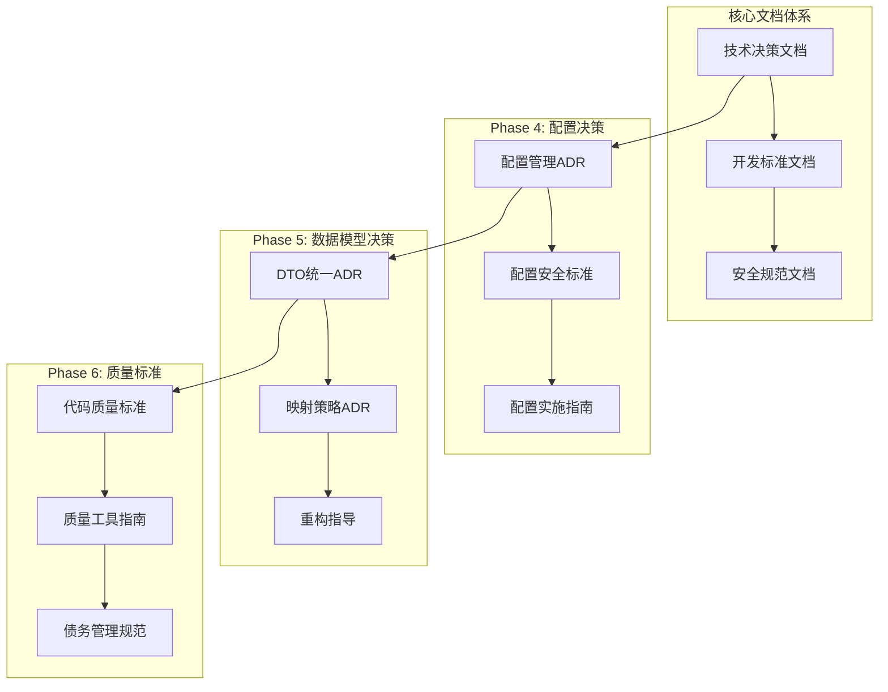

# Design Document - Project Standardization 3.0 Phase 4-6 Documentation Standards

## Overview

本设计文档详细说明Project Standardization 3.0 Phase 4-6的文档标准化实施方案。基于MVP原则，专注于建立最关键的技术决策文档，用文档约束开发方向，避免为技术而技术。设计将充分利用现有项目基础，建立精简而有效的技术文档体系。

## Steering Document Alignment

### Technical Standards (tech.md)
设计严格遵循项目技术标准：
- **文档优先**: 技术决策必须有文档依据
- **实用导向**: 文档内容直接服务于开发实践
- **渐进完善**: 文档随项目发展逐步完善
- **团队共识**: 重要决策通过文档达成共识

### Project Structure (structure.md)
文档结构遵循现有项目组织：
- **架构决策**: `docs/architecture/decisions/` - 核心技术决策记录
- **开发指南**: `docs/development/` - 开发流程和规范
- **安全标准**: `docs/security/` - 安全相关规范
- **最佳实践**: `docs/development/` - 实用指导文档

## Code Reuse Analysis

### Existing Documentation Assets
- **ADR-001**: 现有架构决策记录模板和流程
- **项目文档**: 现有项目文档结构和导航体系
- **开发标准**: 现有编码规范和开发流程
- **评审机制**: 现有文档评审和质量控制流程

### Integration Strategy
- **增量更新**: 在现有文档基础上增量添加
- **模板复用**: 复用现有文档模板和格式
- **流程集成**: 将文档标准集成到现有开发流程
- **团队培训**: 利用现有培训机制推广使用

## Architecture

### 文档标准化架构



### 设计原则

#### 最小化原则
- **精简有效**: 每个文档解决1-2个核心问题
- **避免冗余**: 不重复现有文档内容
- **实用优先**: 重点关注开发实际需要的文档
- **快速交付**: 2-3周内完成核心文档

#### 实用性原则
- **问题导向**: 每个文档都针对具体技术问题
- **可操作性**: 提供具体的实施步骤和代码示例
- **可执行性**: 团队成员能够直接按照文档操作
- **可维护性**: 建立简单的文档更新机制

## Components and Design

### Phase 4: 配置管理文档 (1周)

#### 组件1: 配置管理技术决策
- **文件**: `docs/architecture/decisions/ADR-004-configuration-management.md`
- **目的**: 记录配置管理架构决策
- **核心内容**:
  - 配置文件结构标准化决策
  - 多环境配置管理策略
  - 配置安全和管理原则
- **设计要点**: 基于现有配置文件结构，制定标准化决策

#### 组件2: 配置安全实施指南
- **文件**: `docs/development/configuration-security-implementation.md`
- **目的**: 提供配置安全的具体实施指导
- **核心内容**:
  - 敏感配置识别和处理
  - User Secrets使用步骤
  - 环境变量配置方法
- **设计要点**: 重点关注实际操作步骤，避免理论阐述

#### 组件3: 配置问题解决方案
- **文件**: `docs/development/configuration-troubleshooting.md`
- **目的**: 解决常见的配置问题
- **核心内容**:
  - 配置加载失败排查
  - 配置冲突解决
  - 配置验证错误处理
- **设计要点**: 基于团队经验，总结常见问题和解决方案

### Phase 5: 数据模型文档 (1周)

#### 组件1: DTO/Model统一技术决策
- **文件**: `docs/architecture/decisions/ADR-005-dto-model-unification.md`
- **目的**: 记录数据模型统一的技术决策
- **核心内容**:
  - 当前DTO/Model问题分析
  - 统一到Shared层的决策
  - 版本兼容性策略
- **设计要点**: 基于深度研究报告，做出明确技术决策

#### 组件2: 数据映射策略决策
- **文件**: `docs/architecture/decisions/ADR-006-data-mapping-strategy.md`
- **目的**: 记录数据映射技术选型决策
- **核心内容**:
  - AutoMapper使用成本分析
  - DTO扩展方法选型理由
  - 映射性能优化策略
- **设计要点**: 基于现有代码分析，做出技术选型决策

#### 组件3: 重复定义清理指南
- **文件**: `docs/development/model-duplication-cleanup.md`
- **目的**: 提供重复定义清理的具体指导
- **核心内容**:
  - 重复定义识别方法
  - 清理步骤和风险控制
  - 验证和测试方法
- **设计要点**: 提供可操作的清理指导，包含代码示例

### Phase 6: 代码质量文档 (1周)

#### 组件1: 代码质量核心标准
- **文件**: `docs/development/code-quality-core-standards.md`
- **目的**: 定义最核心的代码质量标准
- **核心内容**:
  - 命名规范和代码格式
  - 复杂度限制标准
  - 关键代码质量要求
- **设计要点**: 重点关注最核心的质量要求，避免过度规范

#### 组件2: 质量工具配置指南
- **文件**: `docs/development/quality-tools-setup.md`
- **目的**: 提供质量工具的配置指导
- **核心内容**:
  - StyleCop基础配置
  - 编辑器配置模板
  - 本地质量检查设置
- **设计要点**: 提供开箱即用的配置模板

#### 组件3: 技术债务管理实践
- **文件**: `docs/development/technical-debt-practices.md`
- **目的**: 建立技术债务管理实践
- **核心内容**:
  - 技术债务识别方法
  - 债务优先级评估
  - 还债策略和计划
- **设计要点**: 建立简单实用的债务管理流程

## Document Templates

### ADR模板 (简化版)
```markdown
# ADR-XXX: [决策标题]

## Status
[提议/接受/已弃用]

## Context
[背景和问题]

## Decision
[决策内容]

## Consequences
[决策影响]

## Implementation
[实施要点]
```

### 技术标准模板
```markdown
# [标准标题]

## 目标
[标准目标]

## 要求
[具体要求]

## 实施步骤
[实施步骤]

## 验证方法
[验证方法]
```

### 操作指南模板
```markdown
# [指南标题]

## 问题描述
[解决的问题]

## 解决步骤
[详细步骤]

## 代码示例
[代码示例]

## 注意事项
[注意事项]
```

## Implementation Plan

### Week 1: 配置管理文档
1. **Day 1-2**: 编写配置管理ADR
   - 分析现有配置结构
   - 制定标准化决策
   - 编写ADR文档
2. **Day 3-4**: 编写配置安全指南
   - 整理安全实践
   - 编写操作步骤
   - 提供代码示例
3. **Day 5**: 编写配置问题解决方案
   - 收集常见问题
   - 编写排查指南
   - 提供解决方案

### Week 2: 数据模型文档
1. **Day 1-2**: 编写DTO/Model统一ADR
   - 分析现有问题
   - 制定统一策略
   - 编写决策文档
2. **Day 3-4**: 编写数据映射ADR
   - 分析映射现状
   - 制定映射策略
   - 编写决策文档
3. **Day 5**: 编写重复定义清理指南
   - 制定清理计划
   - 编写操作指导
   - 提供验证方法

### Week 3: 代码质量文档
1. **Day 1-2**: 编写代码质量标准
   - 整理核心标准
   - 编写规范文档
   - 提供检查清单
2. **Day 3-4**: 编写质量工具配置指南
   - 准备配置模板
   - 编写设置指导
   - 提供配置文件
3. **Day 5**: 编写技术债务管理实践
   - 建立管理流程
   - 编写实践指南
   - 提供评估模板

## Quality Assurance

### 文档质量标准
- **内容准确**: 确保技术信息准确无误
- **结构清晰**: 文档结构逻辑清晰，易于阅读
- **实用有效**: 文档内容对开发有实际指导价值
- **格式统一**: 使用统一的格式和模板

### 评审流程
1. **作者自审**: 作者完成初稿后自审
2. **技术评审**: 技术负责人进行技术评审
3. **团队评审**: 团队成员进行使用性评审
4. **最终确认**: 项目负责人最终确认

### 维护机制
- **定期检查**: 每月检查文档内容和准确性
- **及时更新**: 发现问题及时更新文档
- **版本控制**: 所有文档变更都有版本记录
- **反馈收集**: 收集团队使用反馈并持续改进

## Success Metrics

### 文档完整性
- 所有核心技术决策都有文档记录
- 文档覆盖主要开发场景和问题
- 团队成员能够快速找到需要的文档

### 文档实用性
- 文档内容被团队实际使用
- 减少重复的技术讨论和决策
- 提高开发效率和代码质量

### 文档质量
- 文档内容准确、清晰、易懂
- 文档格式统一，符合标准
- 文档更新及时，保持最新状态

---

*本设计文档专注于MVP阶段的文档标准化工作，建立精简而有效的技术文档体系，用文档约束开发方向，避免为技术而技术。*