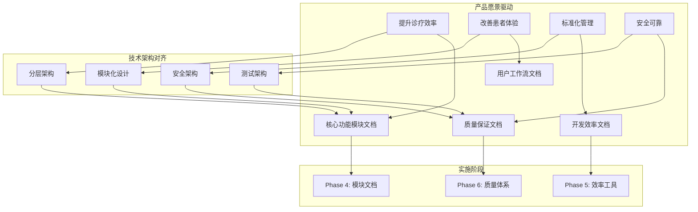

# Design Document - Project Standardization 3.0 Phase 4-6

> **版本**: 2.0  
> **创建日期**: 2025-10-15  
> **基于**: [Steering文档](../../../steering/) + [新需求文档](requirements.md)  
> **设计原则**: 产品价值驱动，充分利用现有架构，避免重复建设

## 🎯 Executive Summary

本设计基于全新的Steering文档体系和重新定义的需求，专注于**产品级文档标准化**，直接支撑**凌隐宝堂中医诊所管理系统**的产品愿景。设计充分利用Phase 1-3的标准化成果和现有技术架构，通过最小化的投入实现最大化的业务价值。

## 📋 Steering Document Alignment

### Product Vision (product.md) 对齐
设计直接支撑产品愿景的核心目标：

1. **提升诊疗效率** → 建立模块文档和工作流文档
2. **改善患者体验** → 确保系统稳定性和一致性文档
3. **标准化管理** → 创建符合医疗规范的文档体系
4. **安全可靠** → 建立安全和质量保证文档

### Technical Decisions (tech.md) 对齐
设计严格遵循技术决策：

1. **架构原则** → 文档结构支持分层架构和模块化设计
2. **技术栈** → 基于现有.NET 8 + WPF + Prism技术栈
3. **ADR决策** → 符合禁止CQRS、Repository标准化等约束
4. **安全架构** → 支持JWT认证和RBAC授权的文档标准

### Project Structure (structure.md) 对齐
设计遵循项目组织标准：

1. **目录结构** → 符合现有的docs/目录组织
2. **模块标准** → 基于Server端和Client端模块结构
3. **命名规范** → 遵循现有的文件和类命名约定
4. **依赖关系** → 支持模块间的依赖管理

## 🏗 Architecture Design

### 文档标准化架构



### 设计原则

#### 1. 产品价值导向
- **用户价值优先**: 每个文档都明确对应的用户价值
- **业务目标对齐**: 文档内容直接支撑业务目标
- **ROI最大化**: 以最小投入获取最大业务价值

#### 2. 现有资产利用
- **Phase 1-3成果**: 充分利用已有的标准化成果
- **技术架构**: 基于现有技术架构和设计模式
- **团队知识**: 整合团队已有的经验和最佳实践

#### 3. 渐进式实施
- **MVP原则**: 先实现核心功能，后续逐步完善
- **快速交付**: 2-3周内完成核心文档
- **持续改进**: 建立文档更新和维护机制

## 🎯 Component Design

### Phase 4: 核心功能模块文档 (2周)

#### 组件4.1: 模块文档标准模板
**文件**: `docs/modules/template/module-document-template.md`

**设计要点**:
- 基于Steering文档中的模块标准结构
- 支持Server端和Client端模块文档
- 包含用户角色、核心工作流、技术架构

**模板结构**:
```markdown
# {ModuleName} 模块文档

## 模块概述
- 功能描述
- 用户角色
- 业务价值

## 核心工作流
- 用户操作流程
- 系统交互步骤
- 数据流向图

## 技术架构
- 模块结构图
- 依赖关系
- 接口定义

## 使用指南
- 配置说明
- 常见问题
- 故障排查
```

#### 组件4.2: 核心模块文档实施
**基于Steering文档中的模块列表**:

1. **高优先级模块** (Week 1):
   - `docs/modules/patients/README.md` - 患者管理模块
   - `docs/modules/medical-case/README.md` - 病案管理模块
   - `docs/modules/consultation/README.md` - 辨证管理模块
   - `docs/modules/prescriptions/README.md` - 处方管理模块

2. **中优先级模块** (Week 2):
   - `docs/modules/users/README.md` - 用户管理模块
   - `docs/modules/herbs/README.md` - 药材管理模块
   - `docs/modules/formula/README.md` - 方剂管理模块

3. **低优先级模块** (Week 2):
   - `docs/modules/auth/README.md` - 认证模块

#### 组件4.3: 用户工作流文档
**文件**: `docs/modules/user-workflows/{workflow-name}.md`

**设计要点**:
- 基于产品愿景中的用户角色
- 从用户视角描述完整工作流程
- 支持培训和用户指导

**核心工作流**:
- `clinical-workflow.md` - 临床工作流程
- `admin-workflow.md` - 管理员工作流程
- `common-tasks.md` - 常见任务操作指南

#### 组件4.4: 模块间集成文档
**文件**: `docs/modules/integration/{integration-name}.md`

**设计要点**:
- 基于Steering文档中的依赖关系图
- 支持模块独立开发和测试
- 明确API接口和数据格式

**集成文档**:
- `module-integration-guide.md` - 模块集成指南
- `api-integration-specifications.md` - API集成规范
- `data-flow-diagrams.md` - 数据流图

### Phase 5: 开发效率提升 (1周)

#### 组件5.1: 快速开发指南
**文件**: `docs/development/rapid-development-guide.md`

**设计要点**:
- 基于Phase 1-3的标准化成果
- 利用现有模块结构和代码模板
- 支持新模块的快速创建

**核心内容**:
- 新模块创建步骤
- 代码生成工具使用
- 依赖注入配置模式
- 单元测试模板使用

#### 组件5.2: 配置管理优化
**文件**: `docs/development/configuration-optimization.md`

**设计要点**:
- 对齐Steering文档中的安全架构要求
- 支持多环境配置管理
- 简化配置流程

**核心内容**:
- 环境配置标准
- 敏感信息处理
- 配置验证机制
- 部署配置管理

#### 组件5.3: 代码生成工具文档
**文件**: `docs/development/code-generation-tools.md`

**设计要点**:
- 基于现有模块模板
- 符合Steering文档中的技术约束
- 提升开发效率

**核心工具**:
- CRUD代码生成器
- API代码生成器
- 测试代码生成器
- 文档生成器

### Phase 6: 质量保证体系 (1周)

#### 组件6.1: 医疗数据安全标准
**文件**: `docs/security/medical-data-security-standard.md`

**设计要点**:
- 符合Steering文档中的安全架构
- 支持医疗行业合规要求
- 保护患者隐私数据

**核心标准**:
- 数据分类和保护
- 访问控制实施
- 加密存储和传输
- 审计日志管理

#### 组件6.2: 代码质量自动化
**文件**: `docs/quality/automated-quality-checks.md`

**设计要点**:
- 基于Steering文档中的测试架构
- 集成CI/CD质量检查
- 符合架构约束

**核心功能**:
- 代码质量检查
- 架构合规验证
- 自动化测试集成
- 质量报告生成

#### 组件6.3: 运维监控文档
**文件**: `docs/operations/monitoring-guide.md`

**设计要点**:
- 支持产品愿景中的"稳定可靠"要求
- 基于Steering文档中的部署架构
- 提供系统监控能力

**核心内容**:
- 健康检查配置
- 性能监控设置
- 告警规则配置
- 故障排查指南

## 🔧 Implementation Strategy

### 开发资源分配

#### 人员配置
- **文档编写**: 1名专职人员，4周时间
- **技术审查**: 1名架构师，1周时间
- **用户测试**: 2名开发人员，1周时间
- **工具开发**: 1名开发人员，2周时间

#### 时间分配
- **Phase 4 (2周)**: 核心模块文档
  - Week 1: 高优先级模块文档
  - Week 2: 中低优先级模块文档
- **Phase 5 (1周)**: 开发效率工具
- **Phase 6 (1周)**: 质量保证体系

### 技术实施

#### 文档生成工具
- 基于现有模块模板开发文档生成器
- 自动生成模块文档的标准结构
- 集成到开发工具链中

#### 质量检查工具
- 集成到CI/CD流程中
- 自动检查文档完整性和准确性
- 生成质量报告

#### 维护机制
- 建立文档更新触发机制
- 集成代码变更和文档同步
- 提供文档反馈和改进渠道

## 📊 Quality Assurance

### 文档质量标准

#### 内容质量
- **准确性**: 技术信息准确无误
- **完整性**: 覆盖所有必要信息
- **实用性**: 对开发有实际指导价值
- **时效性**: 及时更新，保持最新

#### 结构质量
- **逻辑清晰**: 文档结构逻辑清晰
- **格式统一**: 使用统一的格式和模板
- **导航友好**: 易于查找和导航
- **交叉引用**: 相关文档间有明确引用

#### 语言质量
- **表达清晰**: 用词准确，表达清晰
- **术语统一**: 使用统一的术语和定义
- **语言简洁**: 避免冗余和复杂的表达
- **中文表达**: 符合中文表达习惯

### 评审流程

#### 技术评审
1. **作者自审**: 完成初稿后进行自我审查
2. **架构师评审**: 技术架构师进行技术评审
3. **同行评审**: 开发团队进行同行评审
4. **用户评审**: 实际用户进行可用性评审

#### 评审标准
- **技术准确性**: 技术内容是否准确
- **实用性**: 是否对实际工作有帮助
- **完整性**: 是否覆盖所有必要内容
- **可操作性**: 是否能够按照文档操作

### 维护机制

#### 定期维护
- **月度检查**: 每月检查文档内容准确性
- **季度评审**: 每季度评审文档完整性
- **年度更新**: 每年更新文档结构和内容

#### 动态维护
- **变更触发**: 代码变更时自动触发文档更新
- **反馈驱动**: 基于用户反馈及时更新文档
- **问题修复**: 发现问题时立即修复文档

## 🎯 Success Metrics

### 业务价值指标

#### 开发效率提升
- **新模块开发时间**: 减少30%
- **技术争论时间**: 减少60%
- **代码问题修复时间**: 减少40%
- **新人上手时间**: 减少50%

#### 代码质量提升
- **代码质量问题**: 减少50%
- **架构违规问题**: 减少70%
- **重复代码问题**: 减少40%
- **安全问题**: 减少80%

#### 团队协作效率
- **文档查找时间**: 减少70%
- **技术决策时间**: 减少50%
- **代码审查时间**: 减少30%
- **知识传递时间**: 减少60%

### 文档质量指标

#### 完整性指标
- **模块文档覆盖率**: 100%
- **核心功能文档覆盖率**: 100%
- **API文档覆盖率**: 95%
- **工作流文档覆盖率**: 90%

#### 可用性指标
- **文档查找成功率**: 95%
- **文档理解准确率**: 90%
- **文档使用满意度**: 85%
- **文档更新及时率**: 95%

#### 维护性指标
- **文档更新频率**: 每月至少1次
- **文档问题修复时间**: 平均24小时
- **文档准确性检查**: 每月1次
- **文档用户反馈率**: 每月至少5条

## 🔄 Continuous Improvement

### 反馈收集
- **用户调研**: 定期收集用户使用反馈
- **使用统计**: 跟踪文档使用情况
- **问题收集**: 收集文档问题和建议
- **团队讨论**: 定期讨论文档改进方向

### 改进计划
- **短期改进**: 基于反馈快速改进文档内容
- **中期改进**: 优化文档结构和组织方式
- **长期改进**: 完善文档体系和管理机制
- **持续优化**: 建立持续改进的循环机制

---

*本设计基于Steering文档指导，以产品价值为导向，充分利用现有架构和成果，通过最小化投入实现最大化业务价值的文档标准化方案。*