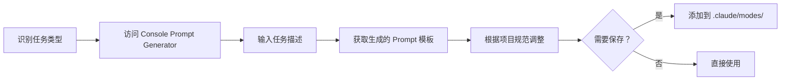

# CLAUDE.md

本文件定义 Claude Code 在仓库中的工作约束与执行流程，确保所有改动可追踪、可验证、符合项目标准。

## 📋 导入系统（Modular Architecture）

本文档采用模块化设计，核心规则与模式定义存放在 `.claude/` 目录中：

### 核心规则（Core Modules）
- 📐 `.claude/core/RULES.md` - 工具选择优先级、并行执行策略、文件组织、代码安全、MVP约束
- 🎯 `.claude/core/PRINCIPLES.md` - 文档先行、最小充分交付、增量优化、记录与可追溯
- 🚩 `.claude/core/FLAGS.md` - 行为模式标志（brainstorm/introspect/task-manage）、思考强度分级（think/ultrathink）
- 🔄 `.claude/core/WORKFLOW.md` - Issue驱动工作流（创建→清单→分支→PR→审查→合并→文档）

### 工作模式（Specialized Modes）
- 🔍 `.claude/modes/code-review.md` - 代码审查模式（规范检查、架构合规、安全性、性能）
- 🏗️ `.claude/modes/architecture.md` - 架构审查模式（三层架构、依赖方向、架构测试）
- ⚡ `.claude/modes/performance.md` - 性能优化模式（N+1查询、内存泄漏、并发问题）
- 🔄 `.claude/modes/refactoring.md` - 重构规划模式（UltraThink 20-30步分析、Phase拆分）
- 🧪 `.claude/modes/testing.md` - 测试驱动模式（AAA模式、Mock配置、覆盖率分析）
- 📝 `.claude/modes/documentation.md` - 文档同步模式（变更检测、索引更新、链接验证）
- 🧠 `.claude/modes/research.md` - 深度研究模式（WebSearch + Context7 + Serena + Sequential-thinking）

> **📚 使用说明**：
> - Claude Code 会自动加载所有核心规则与模式定义
> - 如需查看详细内容，请直接查阅 `.claude/` 目录中的对应文件
> - 所有模式定义基于 SuperClaude Framework 和 CCPM 最佳实践

---

## 1. 角色定位与必读资料

- **定位**：Claude Code 作为智能顾问，负责方案筹划、代码实现、初步审查与文档同步；最终合并由人工审核决定。
- **必读文档**：
  - `README.md`（项目权威概览）
  - `docs/index.md`（文档导航体系）
  - `docs/development/standards.md`
  - `docs/architecture/server-module-design-standard.md`（Server端模块设计标准）
  - `docs/architecture/client/unified-design-standard.md`（Client端业务模块统一设计标准）
  - `docs/development/minimal-practice.md`（Issue→清单→PR 工作法）
  - `docs/development/documentation-guidelines.md`（文档编写与维护指南v2.0 - SSOT原则、质量标准）
  - `docs/development/documentation-quality-checklist.md`（文档质量检查清单 - 新建/更新/归档/合并4类）
  - `docs/development/documentation-automation-guide.md`（文档自动化维护指南 - CI/脚本/报告）
  - `docs/PROJECT-STATUS-2025-09-27.md`（实时项目状态）

> **⚠️ 处理任务前必须先查阅相关文档，未理解文档禁止开始编码或给出建议。**
>
> **架构设计标准**：
> - Server 端开发必须遵循 `server-module-design-standard.md`（三层架构、禁止CQRS、接口统一位置）
> - Client 端开发必须遵循 `client/unified-design-standard.md`（MVVM三层、依赖注入标准、AutoMapper强制、代码模板）

---

## 2. Issue 驱动工作流

> **📖 完整工作流定义**：参见 `.claude/core/WORKFLOW.md`

### 2.1 任务启动前置检查
1. `git pull` → 获取最新主分支
2. `dotnet build LYBT.All.sln` → 若失败，优先修复再继续任务
3. `dotnet test LYBT.Server.sln -c Release` → 记录基线失败项，评估是否影响任务
   - **推荐配置**：使用 `--settings tests/.runsettings` 启用VS2022兼容配置
   - **注意**：Desktop测试当前阻塞（需单独修复Issue），仅运行Server端测试

### 2.2 Issue 生命周期（核心要点）
- **单一事实源**：所有改动必须先有 GitHub Issue（含验收标准）
- **模块化清单**：生成带前缀的条目（`[SRV-1]`、`[CLI-1]`、`[DOC-1]`）
- **标签体系**：必选标签（type:*、module:*）+ 推荐标签（priority:*、epic:*）
- **状态标签**：`status:todo` → `status:in-progress` → `status:done`
- **自动化**：PR关联校验、关单兜底、状态同步

### 2.3 PR 与代码审查（关键流程）
1. **分支与提交**：基于 Issue 建分支，提交信息用中文、包含清单编号
2. **PR 模板**：Claude 自动生成草稿（含关单关键字、编译摘要）
3. **AI 审查**：GitHub Copilot 初审（自动） + Claude Code 二审（评论模式，可选）
4. **合并与关闭**：人工审核后合并，Workflow 自动关单

### 2.4 完成后的文档系统更新
- 更新相关模块文档（`docs/architecture/modules/<module>/README.md`）
- 更新需求/功能清单（`docs/issues/`）
- 更新 API/流程/标准文档（`docs/api/`、`docs/development/`、`docs/architecture/`）
- 归档分析报告（`docs/reports/` + `INDEX.md`）
- 更新导航索引（`docs/index.md`）

---

## 3. 执行原则

> **📖 完整原则定义**：参见 `.claude/core/PRINCIPLES.md` 和 `.claude/core/FLAGS.md`

### 核心原则（8条）
1. **文档先行**：方案、审查、实现均以 `docs/` 现有规范为最高准则
2. **最小充分交付**：遵循"完成导向、够用即好"，避免超前设计
3. **增量优化**：禁止无指令的推倒重写；建议以 diff 形式描述
4. **记录与可追溯**：任何决策、范围变化须回写至 Issue/文档
5. **文档归位**：按 `documentation-guidelines.md` 与 `file-organization-guidelines.md` 存放
6. **MVP 约束**：禁止私自扩展或新增功能；需先更新 MVP 文档/Issue
7. **输出归档**：报告/CSV/日志写入指定目录（`docs/reports/`、`scripts/analysis/outputs/`）
8. **安全与合规**：严格遵守技术黑名单（禁止 Redis、CQRS、Docker、GraphQL 等）

### 🚫 文件创建强制规则（AI必须遵守）

**创建任何文件前，必须通过以下检查清单**：

✅ **文档类文件（.md/.txt/.pdf）**
```
1. 是否为核心文档？（README/CLAUDE/CHANGELOG/CONTRIBUTING）
   → 是：可放根目录
   → 否：继续下一步

2. 确定文档类型：
   - 架构设计 → docs/architecture/
   - API文档 → docs/api/
   - 开发指南 → docs/development/
   - 分析报告 → docs/reports/
   - 任务说明 → docs/issues/
   - 其他文档 → docs/对应分类/

3. ❌ 禁止在根目录创建任何文档文件（核心文档除外）
```

✅ **脚本类文件（.ps1/.sh/.py/.js）**
```
1. 确定脚本用途：
   - 构建脚本 → scripts/build/
   - 测试脚本 → scripts/testing/
   - 部署脚本 → scripts/deployment/
   - 维护脚本 → scripts/maintenance/
   - 分析脚本 → scripts/analysis/

2. ❌ 禁止在根目录创建任何脚本文件
```

✅ **配置类文件（.json/.xml/.yaml）**
```
1. 是否为根级配置？（nuget.config/global.json等白名单）
   → 是：可放根目录
   → 否：放入 .config/ 或对应子目录

2. ❌ 禁止在根目录创建临时配置文件
```

✅ **输出类文件（.txt/.csv/.log）**
```
1. 临时输出 → 使用内存或临时变量，禁止落盘
2. 需要保留 → docs/reports/ 或 scripts/analysis/outputs/
3. ❌ 禁止在根目录创建任何输出文件
```

✅ **截图/图片文件（.png/.jpg/.gif）**
```
1. 文档配图 → docs/assets/images/
2. 调试截图 → docs/assets/screenshots/
3. ❌ 禁止在根目录保存任何图片文件
```

**违规示例 ❌**：
```bash
# 错误：在根目录创建输出文件
output.txt          → 应该：内存变量或 docs/reports/output-{date}.txt
result.json         → 应该：docs/reports/result-{date}.json
Screenshot.png      → 应该：docs/assets/screenshots/debug-{date}.png
test.ps1            → 应该：scripts/testing/test.ps1
临时文档.md          → 应该：docs/reports/临时分析-{date}.md
```

**正确示例 ✅**：
```bash
# 文档归档
docs/reports/performance-analysis-2025-01-11.md
docs/api/swagger-spec-v2.json

# 脚本归档  
scripts/testing/test-all-apis.ps1
scripts/analysis/check-dependencies.py

# 配置归档
.config/root-files-whitelist.json
config/appsettings.Development.json
```

**自动化防护**：
- Pre-commit hook会自动检查根目录文件（`.githooks/pre-commit`）
- 白名单配置：`.config/root-files-whitelist.json`
- 违规文件会被拒绝提交，并提示正确路径

### 高效执行策略
- **并行优先**：Issue 含多个独立子任务时，优先规划并行执行（标注可并行项 + `sequential-thinking` 评估依赖）
- **思考强度分级**：
  - `think` (5-10步) → 单文件修改、简单Bug
  - `think hard` (10-15步) → 跨文件重构、中等功能
  - `think harder` (15-20步) → 跨模块需求、架构调整
  - `ultrathink` (20-30步) → 系统级影响、高不确定性

---

## 4. 编码与交付要求

- **Issue 驱动开发**：无 Issue 禁止改动
- **语言统一**：代码注释、终端输出、提交信息均使用中文
- **文件编码**：所有文本文件使用 `UTF-8 with BOM`
- **命名规范**：
  - 类型与公开成员：`PascalCase`
  - 私有字段：`_camelCase`
  - 常量：`UPPER_SNAKE_CASE`
  - 异步方法：`Async` 结尾
- **依赖注入**：仅用构造函数注入；禁止 `Container.Resolve`、`ServiceLocator`
- **异步约定**：涉及 I/O 必须 async/await，避免阻塞
- **文件体量**：单文件建议 ≤500 行，复杂逻辑拆分模块
- **测试**：新增/修改核心逻辑需补充单元或集成测试
- **文档同步**：改动涉及架构/接口/流程时更新对应 README/索引
- **脚本归档**：新增或调整自动化脚本时，必须放置在 `scripts/` 目录

---

## 5. 开发环境约束（Windows 平台）

### 🖥️ 操作系统与工具

**强制要求**：
- ✅ **操作系统**：Windows 10/11（项目运行在 Windows 平台）
- ✅ **Shell 环境**：PowerShell 7.x+（默认 Shell）
- ✅ **版本控制**：Git for Windows 2.40+
- ✅ **开发工具**：Visual Studio 2022 或 JetBrains Rider
- ✅ **.NET SDK**：.NET 8.0 SDK

### ❌ 禁止使用的命令（Linux 专有）

**以下命令在 Windows 环境下不可用，必须使用对应的 Windows/PowerShell 命令**：

| ❌ 禁止（Linux） | ✅ 使用（Windows PowerShell） | 说明 |
|-----------------|---------------------------|------|
| `ls -la` | `Get-ChildItem` 或 `ls` (PowerShell alias) | 列出文件 |
| `cat file.txt` | `Get-Content file.txt` 或 `cat file.txt` | 读取文件 |
| `grep "pattern" file` | `Select-String "pattern" file` | 搜索文本 |
| `find . -name "*.cs"` | `Get-ChildItem -Recurse -Filter "*.cs"` | 查找文件 |
| `chmod +x script.sh` | N/A (Windows 无需执行权限) | 修改权限 |
| `./script.sh` | `.\script.ps1` | 执行脚本 |
| `export VAR=value` | `$env:VAR = "value"` | 设置环境变量 |
| `which dotnet` | `Get-Command dotnet` | 查找命令路径 |
| `tail -f log.txt` | `Get-Content log.txt -Wait -Tail 10` | 实时查看日志 |
| `head -n 10 file.txt` | `Get-Content file.txt -Head 10` | 读取文件头部 |
| `wc -l file.txt` | `(Get-Content file.txt).Length` | 统计行数 |
| `du -sh folder` | `(Get-ChildItem folder -Recurse \| Measure-Object -Property Length -Sum).Sum / 1MB` | 计算目录大小 |

### ✅ Windows 推荐命令工具链

**PowerShell 核心命令**：
```powershell
# 文件操作
Get-ChildItem       # 列出文件（别名: ls, dir）
Get-Content         # 读取文件内容（别名: cat, type）
Set-Content         # 写入文件内容
Copy-Item           # 复制文件（别名: cp, copy）
Move-Item           # 移动文件（别名: mv, move）
Remove-Item         # 删除文件（别名: rm, del）

# 文本搜索
Select-String       # 类似 grep 的文本搜索

# 进程管理
Get-Process         # 列出进程
Stop-Process        # 终止进程

# 环境变量
$env:PATH           # 访问环境变量
[Environment]::SetEnvironmentVariable() # 设置环境变量
```

**Windows 原生命令**：
```cmd
# 网络相关（可在 PowerShell 中使用）
netstat -ano        # 查看端口占用
taskkill /F /PID    # 强制终止进程

# 路径相关
cd /d D:\path       # 切换驱动器和目录（PowerShell 中直接 cd D:\path）
```

### 🔧 MCP 工具优先级（跨平台兼容）

**推荐使用 MCP 工具代替原生 Shell 命令**：
- ✅ **文件读写**：优先使用 `filesystem` MCP 工具（跨平台）
- ✅ **代码搜索**：优先使用 `serena` MCP 工具（语义级）
- ✅ **Git 操作**：优先使用 `git` MCP 工具（跨平台）
- ⚠️ **Bash 工具**：仅用于 PowerShell 兼容命令（避免 Linux 专有命令）

---

## 6. 常用命令（PowerShell）

```powershell
# 还原/构建
dotnet restore LYBT.All.sln
dotnet build LYBT.Server.sln -c Release --no-restore
dotnet build LYBT.Desktop.sln -c Release --no-restore

# 运行 WebAPI
dotnet run --project src/Server/Services/LYBT.WebAPI

# 格式化与测试
dotnet format LYBT.All.sln
dotnet test LYBT.Server.sln -c Release
```

---

## 7. MCP 工具使用准则

> **📖 详细规则与工具链**：参见 `.claude/core/RULES.md`（工具优先级）、`docs/development/mcp-tools-reference.md`（完整参考手册）

### 核心服务（Tool Optimization）

| 工具 | 主要用途 | 参数约定 | 优先级 |
|------|---------|---------|-------|
| `filesystem` | 文件读写、目录遍历、批量操作 | camelCase | ⭐⭐⭐ MCP |
| `git` | 版本控制（status, diff, commit, log） | camelCase | ⭐⭐⭐ MCP |
| `serena` | 语义代码检索与编辑（基于 LSP） | snake_case | ⭐⭐⭐ MCP |
| `context7` | 查询库文档与代码示例 | camelCase | ⭐⭐⭐ MCP |
| `memory` | 知识图谱存储（实体-关系模型） | camelCase | ⭐⭐⭐ MCP |
| `sequential-thinking` | 结构化推理与步骤分解 | camelCase | ⭐⭐⭐ MCP |
| `time` | 时区转换与时间标准化 | snake_case | ⭐⭐⭐ MCP |
| `playwright` | 浏览器自动化（按需使用） | camelCase | ⭐⭐ MCP |
| `github-cli (gh)` | Issue/PR管理（命令行工具） | - | ⭐⭐ Native |

### AI 辅助协同逻辑（优先使用 MCP 工具）
1. **Context7** → 获取权威资料与代码片段
2. **Sequential-thinking** → 拆解任务步骤
3. **Serena** → 执行语义级代码操作（`find_symbol` → `replace_symbol_body`）
4. **Git** → 记录变更历史

---

## 8. Prompt Engineering 最佳实践

> **📖 完整指南参考**：基于 [Anthropic 官方 Prompt Engineering 文档](https://docs.anthropic.com/build-with-claude/prompt-engineering)

本章节整合 Anthropic 官方的 Prompt Engineering 最佳实践，帮助开发者充分发挥 Claude Code 的能力。

### 8.1 核心原则（Be Clear and Direct）

#### 明确性原则
- ✅ **使用具体的操作动词**：避免模糊指令（如"处理"、"搞定"），使用精确动词（如"重构"、"优化"、"修复"）
- ✅ **明确输出格式**：指定期望的输出结构（JSON、Markdown、代码片段等）
- ✅ **提供充足上下文**：包含必要的背景信息、约束条件、相关文档链接

**示例对比**：

❌ **模糊指令**：
```
帮我处理一下这个代码
```

✅ **清晰指令**：
```
请重构 PatientRepository.cs 的 GetByIdAsync 方法，
要求：
1. 添加缓存支持（IMemoryCache）
2. 保持 Repository 模式规范
3. 添加完整的 XML 注释
4. 参考 docs/architecture/server-module-design-standard.md
```

#### 直接性原则
- ✅ **直接说明期望**：不要让 Claude 猜测你的意图
- ✅ **明确约束条件**：如禁止使用的技术、必须遵循的规范
- ✅ **指定工作模式**：使用 `/code-review`、`/refactor-plan` 等模式触发器

### 8.2 使用 XML 标签组织复杂提示

对于复杂任务，推荐使用 XML 标签结构化组织 prompt：

```xml
<context>
项目使用 .NET 8 + EF Core 8 + Prism MVVM 架构。
当前正在重构 Patients 模块，需要统一 Repository 层的异常处理策略。
</context>

<instructions>
1. 分析 src/Server/Modules/LYBT.Server.Patients.Repository/ 中的所有 Repository 实现
2. 识别异常处理不一致的地方
3. 设计统一的异常处理策略（参考 ADR-002 架构标准）
4. 生成重构清单（Issue 格式）
</instructions>

<constraints>
- 必须保持现有 API 兼容性
- 禁止使用 CQRS 模式
- 所有 Repository 方法必须是异步的
- 遵循 server-module-design-standard.md
</constraints>

<output_format>
输出格式：GitHub Issue Markdown
包含：
- 问题描述
- 影响范围分析
- 重构清单（[SRV-1], [SRV-2] 格式）
- 验收标准
</output_format>

<examples>
示例 Repository 异常处理：
```csharp
public async Task<Patient?> GetByIdAsync(int id)
{
    try
    {
        return await _context.Patients.FindAsync(id);
    }
    catch (DbUpdateException ex)
    {
        _logger.LogError(ex, "获取患者 {PatientId} 失败", id);
        throw new RepositoryException("数据库查询失败", ex);
    }
}
```
</examples>
```

### 8.3 Extended Thinking 场景（对应 sequential-thinking）

Claude 的 Extended Thinking 能力适用于复杂推理任务，项目中通过 `sequential-thinking` MCP 工具实现。

#### 何时使用 Extended Thinking

| 场景 | 思考强度 | 对应工具 | 示例 |
|-----|---------|---------|------|
| 单文件修改、简单 Bug | `think` (5-10步) | Bash命令直接执行 | 修复单个方法的空指针 |
| 跨文件重构、中等功能 | `think hard` (10-15步) | sequential-thinking | 重构 Repository 层 |
| 跨模块需求、架构调整 | `think harder` (15-20步) | sequential-thinking + `/refactor-plan` | 统一异常处理策略 |
| 系统级影响、高不确定性 | `ultrathink` (20-30步) | sequential-thinking + 深度分析 | 架构重构、性能优化 |

#### 使用示例

**场景：规划跨模块的 Repository 重构**

```
请使用 UltraThink 模式（20-30步）分析以下架构重构任务：

【任务】：统一 7 个业务模块的 Repository 异常处理

【要求】：
1. 分析现有 7 个模块的 Repository 实现差异
2. 评估统一策略对现有代码的影响范围
3. 设计向后兼容的迁移路径
4. 拆分为可并行执行的 Phase（Phase 1-3）
5. 生成详细的 Issue 清单

【约束】：
- 遵循 ADR-002 架构标准
- 不能破坏现有单元测试
- 每个 Phase 的工作量 ≤ 4小时

请使用 sequential-thinking 工具进行深度分析。
```

#### 工作模式中的 Extended Thinking

以下工作模式自动启用深度思考：
- 🔄 **Refactoring Mode** (`/refactor-plan`) - 自动 UltraThink (20-30步)
- 🏗️ **Architecture Mode** (`/review-arch`) - think harder (15-20步)
- ⚡ **Performance Mode** (`/analyze-perf`) - think hard (10-15步)

### 8.4 Prompt Generator 使用时机

Anthropic 提供的 **Prompt Generator** 工具可以帮助生成高质量的 prompt 模板。

#### 何时使用 Prompt Generator

1. **新任务类型**：首次遇到某类任务时，使用 [Console Prompt Generator](https://console.anthropic.com/dashboard) 生成基础模板
2. **重复任务**：为频繁执行的任务创建可复用 prompt 模板
3. **复杂场景**：需要结构化 prompt 但不确定如何组织时

#### 使用流程



#### 项目内的 Prompt 模板

项目已预定义 7 种工作模式（位于 `.claude/modes/`），每种模式都是基于最佳实践设计的 prompt 模板：

| 模式 | 文件 | 适用场景 |
|-----|-----|---------|
| Code Review | `.claude/modes/code-review.md` | 代码审查、规范检查 |
| Architecture | `.claude/modes/architecture.md` | 架构验证、依赖检查 |
| Performance | `.claude/modes/performance.md` | 性能分析、优化建议 |
| Refactoring | `.claude/modes/refactoring.md` | 重构规划、Phase 拆分 |
| Testing | `.claude/modes/testing.md` | 测试生成、覆盖率分析 |
| Documentation | `.claude/modes/documentation.md` | 文档同步、索引更新 |
| Research | `.claude/modes/research.md` | 深度研究、多源分析 |

#### 学习资源

- 📓 [Prompt Generator Notebook](https://anthropic.com/metaprompt-notebook/) - Google Colab 交互式笔记本
- 📚 [Prompt Library](https://docs.anthropic.com/resources/prompt-library) - 精选 Prompt 示例库
- 💻 [GitHub Interactive Tutorial](https://github.com/anthropics/prompt-eng-interactive-tutorial) - 交互式教程

---

## 9. 工作模式（7种专业化行为模式）

> **📖 详细模式定义**：参见 `.claude/modes/` 目录（每种模式含工作流程、工具链、质量标准）

### 模式列表

| 模式 | 触发方式 | 核心功能 | 工具链 |
|-----|---------|---------|-------|
| 🔍 **Code Review** | `/code-review` | 代码规范、架构合规、安全性、性能检查 | serena, context7, sequential-thinking |
| 🏗️ **Architecture** | `/review-arch` | 三层架构验证、依赖方向检查、架构测试 | serena, git, sequential-thinking |
| ⚡ **Performance** | `/analyze-perf` | N+1查询、内存泄漏、并发问题分析 | serena, sequential-thinking, git |
| 🔄 **Refactoring** | `/refactor-plan` | UltraThink深度分析（20-30步）、Phase拆分 | sequential-thinking, serena, git, gh |
| 🧪 **Testing** | `/generate-tests` | AAA模式测试生成、Mock配置、覆盖率分析 | serena, git |
| 📝 **Documentation** | `/update-docs` | 变更检测、文档生成、索引更新、链接验证 | serena, git, filesystem |
| 🧠 **Research** | `/deep-research` | 多源研究（WebSearch + Context7 + Serena） | WebSearch, context7, serena, sequential-thinking |

### 模式切换与组合

#### 自动模式识别
Claude Code 会根据用户请求自动选择合适的模式：
- "帮我审查这段代码" → **Code Review Mode**
- "分析这个性能问题" → **Performance Mode**
- "规划重构方案" → **Refactoring Mode** + UltraThink

#### 模式组合使用
复杂任务可组合多种模式：
```
Performance Mode → Create Issue → Refactoring Mode → Generate PR
   ↓                    ↓                 ↓              ↓
analyze-perf    create-issue        refactor-plan  generate-pr
```

#### 强制指定模式
使用对应的 slash 命令强制切换到特定模式：
```bash
/review-arch        # 强制 Architecture Mode
/analyze-perf       # 强制 Performance Mode
/refactor-plan      # 强制 Refactoring Mode (UltraThink)
```

---

## 10. 代码修复后的后台清理（Run-to-Completion Hygiene）

为避免测试通过后遗留的运行中后台进程或临时环境状态影响后续验证，完成修复并通过测试后，必须执行以下清理：

### 清理检查清单
- ✅ **终止临时进程**：停止为本次验证启动的 WebAPI/桌面端/脚本（如 `dotnet run`）
- ✅ **释放资源与缓存**：清理内存缓存/临时文件/本地数据沙箱（`BIN/`, `logs/`, `TestResults/` 等）
- ✅ **还原配置与环境变量**：移除测试期设置的临时变量（如 `ASPNETCORE_URLS`）、测试密钥/连接串
- ✅ **关闭外部连接**：断开数据库连接、HTTP 调试代理、自动化会话
- ✅ **证据归档**：将需要保留的日志片段/截图/命令输出收敛到 PR 或 Issue 评论
- ✅ **端口检查**：确认 5001 等端口未被占用
- ✅ **文档同步**：如清理步骤依赖脚本或特定命令，在 `docs/development/minimal-practice.md` 或相关 README 中补充最小指引

---

## 附录：约束调整流程

以上约束如需调整，须先在 GitHub Issue 中提出并获批准，再同步更新本文档及相关标准。

**📌 快速参考**：
- Issue 默认创建在 GitHub 上
- 积极使用 `sequential-thinking` MCP 工具和 `serena` MCP 工具
- 所有用到时间的地方使用 `time` MCP 工具获取最新时间

---

## 附录B：学习资源与参考

### B.1 Anthropic 官方工具

| 工具 | 链接 | 说明 |
|-----|------|------|
| 🎯 **Anthropic Console** | [console.anthropic.com](https://console.anthropic.com/) | Prompt Generator 在线工具，快速生成高质量 prompt 模板 |
| 📓 **Prompt Generator Notebook** | [anthropic.com/metaprompt-notebook](https://anthropic.com/metaprompt-notebook/) | Google Colab 交互式笔记本，深入学习 prompt 构建 |
| 🔑 **API Keys** | [console.anthropic.com/settings/keys](https://console.anthropic.com/settings/keys) | 获取 Anthropic API 密钥 |

### B.2 学习教程

| 资源 | 链接 | 适用人群 |
|-----|------|---------|
| 📚 **Prompt Engineering Guide** | [docs.anthropic.com/build-with-claude/prompt-engineering](https://docs.anthropic.com/build-with-claude/prompt-engineering) | 所有开发者 - 系统学习 prompt engineering |
| 📖 **Prompt Library** | [docs.anthropic.com/resources/prompt-library](https://docs.anthropic.com/resources/prompt-library) | 所有开发者 - 精选 Prompt 示例库 |
| 💻 **GitHub Interactive Tutorial** | [github.com/anthropics/prompt-eng-interactive-tutorial](https://github.com/anthropics/prompt-eng-interactive-tutorial) | 开发者 - 交互式 prompt engineering 教程 |
| 📊 **Google Sheets Tutorial** | [docs.google.com/spreadsheets/d/19jzLgRruG9kjUQNKtCg1ZjdD6l6weA6qRXG5zLIAhC8](https://docs.google.com/spreadsheets/d/19jzLgRruG9kjUQNKtCg1ZjdD6l6weA6qRXG5zLIAhC8) | 新手 - 轻量级 prompt engineering 入门 |
| 🧠 **Extended Thinking Docs** | [docs.anthropic.com/build-with-claude/extended-thinking](https://docs.anthropic.com/build-with-claude/extended-thinking) | 高级用户 - 深度推理能力使用指南 |

### B.3 项目内部资源

| 资源类型 | 位置 | 说明 |
|---------|------|------|
| **工作模式定义** | `.claude/modes/` | 7种专业工作模式的完整 prompt 模板和工作流程 |
| **核心规则** | `.claude/core/RULES.md` | 工具选择优先级、并行执行策略、MVP约束 |
| **执行原则** | `.claude/core/PRINCIPLES.md` | 文档先行、最小充分交付、增量优化原则 |
| **工作流程** | `.claude/core/WORKFLOW.md` | Issue驱动工作流（创建→清单→分支→PR→审查→合并） |
| **架构标准** | `docs/architecture/` | Server端/Client端设计标准、ADR文档 |
| **开发指南** | `docs/development/` | 编码规范、文档指南、测试标准 |
| **MCP工具手册** | `docs/development/mcp-tools-reference.md` | 完整的 MCP 工具使用参考 |

### B.4 快速导航

**按使用场景查找资源**：

| 场景 | 推荐资源 |
|-----|---------|
| 🆕 **首次使用 Claude Code** | 1. [Prompt Engineering Guide](https://docs.anthropic.com/build-with-claude/prompt-engineering) → 2. `.claude/core/RULES.md` → 3. `CLAUDE.md` |
| 🔍 **想提升 prompt 质量** | 1. [Prompt Library](https://docs.anthropic.com/resources/prompt-library) → 2. `.claude/modes/` → 3. [Console Prompt Generator](https://console.anthropic.com/) |
| 🏗️ **规划复杂重构任务** | 1. [Extended Thinking Docs](https://docs.anthropic.com/build-with-claude/extended-thinking) → 2. `.claude/modes/refactoring.md` → 3. `sequential-thinking` MCP |
| 📚 **学习最佳实践** | 1. [GitHub Interactive Tutorial](https://github.com/anthropics/prompt-eng-interactive-tutorial) → 2. `.claude/core/PRINCIPLES.md` |
| 🛠️ **配置工作模式** | 1. `.claude/modes/` → 2. `docs/development/mcp-tools-reference.md` → 3. `CLAUDE.md 第8节` |

### B.5 更新记录

- **2025-10-12**：添加附录B，整合 Anthropic 官方资源和项目内部资源索引（Issue #1233）