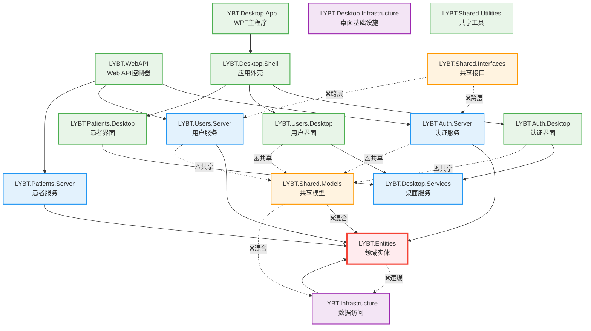
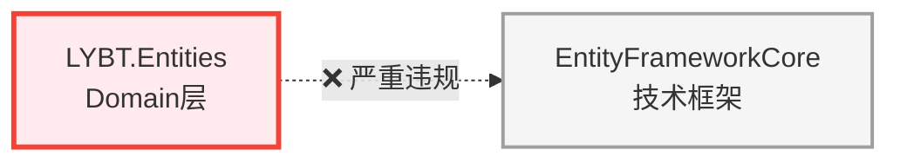
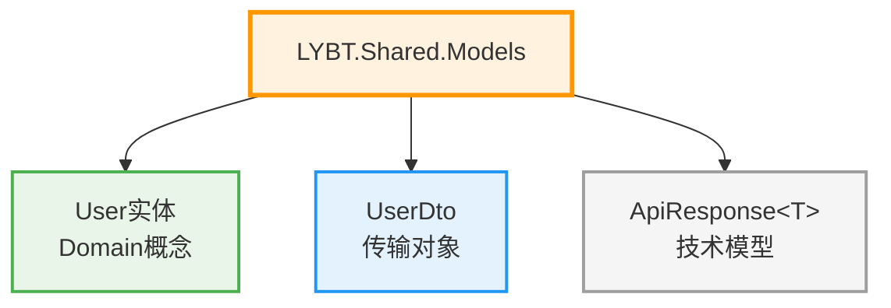
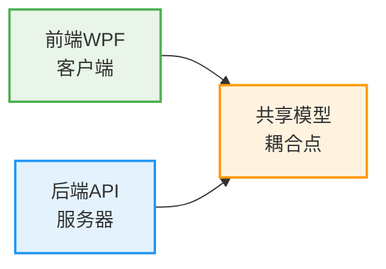
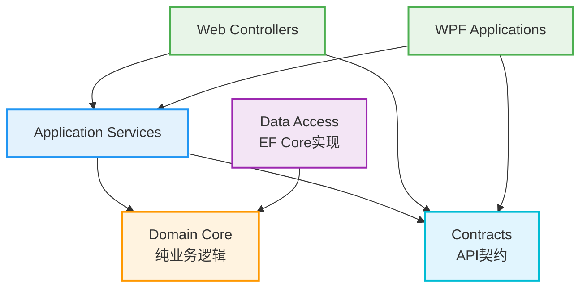

# 项目依赖关系图分析

**分析时间**: 2025-01-09  
**依赖原则**: UI → Application → Domain ← Infrastructure  
**图表格式**: Mermaid依赖图

---

## 🔗 当前依赖关系图 (Mermaid)



---

## 🚨 依赖违规详细分析

### Critical 违规 (必须修复)

#### 1. Domain层反向依赖Infrastructure


**违规详情**:
- **问题**: Domain实体直接依赖EF Core注解
- **影响**: Domain层不纯净，违反DDD原则
- **示例**: `[Column("UserName")]`, `[Key]`, `[Required]`等注解

#### 2. Shared层职责混合


**违规详情**:
- **问题**: 一个项目包含了三种不同层次的模型
- **影响**: 跨层依赖，职责不清，维护困难

### Warning 违规 (建议修复)

#### 3. 前后端耦合共享


**问题分析**:
- **现状**: 前后端直接共享实体模型
- **风险**: 前端变更影响后端，后端变更影响前端
- **建议**: 建立独立的Contract层

---

## 🎯 理想依赖关系图

### 目标架构 (推荐)


### 重构路径
1. **阶段1**: 创建纯净的`LYBT.Domain.Core`项目
2. **阶段2**: 建立独立的`LYBT.Contracts`项目  
3. **阶段3**: 重构`LYBT.Infrastructure`移除Domain污染
4. **阶段4**: 拆分`LYBT.Shared.Models`到对应层次

---

## 📊 依赖健康度评估

### 层次依赖合规率
| 依赖类型 | 当前状态 | 合规项 | 违规项 | 合规率 |
|---------|----------|--------|--------|--------|
| UI → Application | 🟢 良好 | 8个 | 0个 | 100% |
| Application → Domain | 🟡 部分违规 | 6个 | 2个 | 75% |
| Domain ← Infrastructure | 🔴 严重违规 | 0个 | 3个 | 0% |
| 前后端解耦 | 🟡 待改进 | 1个 | 4个 | 20% |

### 问题严重性统计
- **🔴 Critical (3个)**: Domain层污染，必须立即修复
- **🟡 Warning (4个)**: 前后端耦合，建议重构  
- **🟢 Good (8个)**: UI到Application依赖正确

---

## 🛠️ 修复建议优先级

### P0 - 立即修复 (1-2周)
1. **移除Domain层技术依赖**
   ```
   操作: 将EF Core注解移至Infrastructure层
   文件: LYBT.Entities项目中的所有实体类
   影响: 需要调整EF Core配置方式
   ```

2. **拆分Shared.Models项目**
   ```
   拆分为:
   - LYBT.Domain.Models (纯领域模型)
   - LYBT.Contracts (API契约)  
   - LYBT.Common (通用工具)
   ```

### P1 - 规划重构 (1个月内)
3. **建立Contract层解耦前后端**
4. **统一架构文档和规范**
5. **完善依赖注入配置**

---

## 🔍 已知缺口 / 需人工确认

### 技术确认项
1. **EF Core配置迁移**: FluentAPI配置的技术可行性？
2. **前后端解耦策略**: 是否使用AutoMapper处理模型转换？
3. **依赖注入影响**: 项目重构对DI容器配置的影响？

### 业务确认项
1. **重构范围**: 是否一次性重构所有模块？
2. **向后兼容**: API契约变更对现有客户端的影响？
3. **测试覆盖**: 重构过程中的测试保证策略？

### 流程确认项
1. **重构节奏**: 渐进式 vs 大爆炸式重构？
2. **团队协调**: 前后端团队的协作机制？
3. **发布计划**: 依赖调整的发布和回滚策略？

---

**依赖分析结论**: 系统存在明确的依赖方向违规问题，主要集中在Domain层污染和Shared层职责混合。通过系统性重构可以建立清晰的分层依赖关系。

**修复复杂度**: 🟡 **中等** - 需要系统性重构，但有明确的解决路径