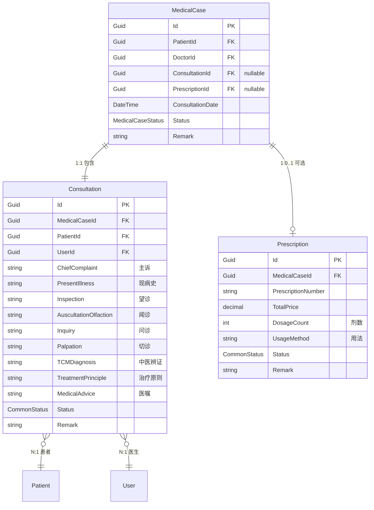

# 看诊业务模型与实体关系设计文档

**文档版本**: v1.0  
**创建日期**: 2025-08-22  
**项目**: 凌隐宝堂中医诊所管理系统  
**模块**: Consultation + MedicalCase  

---

## 📋 业务需求确认

### 当前版本范围（v1.0）
- ✅ **诊断模块**：中医四诊（望闻问切）+ 辨证论治
- ✅ **处方模块**：中药处方开具（可选）
- ❌ **挂号模块**：后续版本开发
- ❌ **收费模块**：后续版本开发

### 核心业务流程
```
创建医案 → 进行诊断 → [可选]开具处方 → 完成医案
    ↓          ↓            ↓              ↓
MedicalCase  Consultation  Prescription   结束会话
(起始状态)   (记录四诊)    (中药配方)     (保存完成)
```

### 重要业务规则
1. **无复诊概念**：每次患者就诊都是全新的MedicalCase
2. **1:1关系**：一个医案对应一次诊断
3. **处方可选**：医生可以选择不开方直接完成诊断
4. **独立性**：每个医案都是完整独立的诊疗记录

---

## 🎯 实体关系设计

### 核心实体职责

| 实体 | 中文名 | 职责范围 | 生命周期 |
|------|-------|----------|----------|
| **MedicalCase** | 医疗案例/病案 | 看诊流程容器，状态管理 | 从创建到完成的整个会话 |
| **Consultation** | 看诊记录/诊断 | 中医四诊内容，诊断结果 | 单次诊断活动 |
| **Prescription** | 处方 | 中药配方详情（可选） | 处方开具（如需要） |

### 实体关系图



---

## 📊 状态流转设计

### MedicalCaseStatus 枚举
```csharp
public enum MedicalCaseStatus
{
    Registered,      // 已创建（v1.0起始状态）
    InConsultation,  // 诊断中
    Completed        // 已完成（有方或无方）
}
```

### 状态流转路径

#### 路径1：需要处方
```
Registered → InConsultation → 创建Prescription → Completed
```

#### 路径2：不需处方（如养生指导）
```
Registered → InConsultation → 直接Completed
```

---

## 🔧 技术实现要点

### 数据库关系
- **已实现**：MedicalCases表已有ConsultationId字段
- **关系类型**：1:1 外键关联
- **约束**：一个MedicalCase最多对应一个Consultation

### 实体模型修正需求
```csharp
// ❌ 当前错误设计
public virtual ICollection<Consultation> Consultations { get; set; }

// ✅ 正确设计
public virtual Consultation? Consultation { get; set; }
```

### DTO层职责分离
- **MedicalCaseDto**：流程管理信息（患者、医生、时间、状态）
- **ConsultationDto**：诊断内容（四诊、辨证、医嘱）
- **避免重复**：MedicalCase DTOs不应包含诊断字段

---

## 💡 业务场景示例

### 场景1：常规诊疗（需开方）
1. **创建医案**：患者到诊，系统创建MedicalCase
2. **进行诊断**：医生创建Consultation，录入四诊信息
3. **完成辨证**：记录中医辨证结果和治疗原则
4. **开具处方**：创建Prescription，选择中药材
5. **完成诊疗**：设置MedicalCase状态为Completed

### 场景2：健康咨询（无需开方）
1. **创建医案**：患者咨询，系统创建MedicalCase
2. **进行诊断**：医生创建Consultation，了解情况
3. **给出建议**：记录养生建议和医嘱
4. **直接完成**：跳过处方，直接设置为Completed

### 场景3：患者复诊
1. **重新创建**：为患者创建全新的MedicalCase
2. **独立诊疗**：完整重复诊断流程
3. **历史关联**：通过PatientId可查询历史记录
4. **独立管理**：每次就诊都是独立的完整记录

---

## ⚠️ 重要约束

### 业务约束
1. **唯一性**：一个MedicalCase只能有一个Consultation
2. **完整性**：MedicalCase必须有Patient和Doctor信息
3. **状态一致性**：Consultation状态需要与MedicalCase同步
4. **可选性**：Prescription是可选的，但Consultation是必需的

### 技术约束
1. **外键完整性**：所有FK必须指向有效记录
2. **状态验证**：状态变更必须符合业务流程
3. **并发控制**：防止同时修改同一医案
4. **审计追踪**：记录创建、更新时间和操作人

---

## 📈 后续扩展计划

### v2.0 计划功能
- **挂号模块**：患者预约和排队管理
- **收费模块**：费用计算和支付处理
- **报表统计**：诊疗数据分析和统计

### 架构扩展点
- **挂号集成**：Registration → MedicalCase的流程
- **收费集成**：Billing关联MedicalCase和Prescription
- **多租户支持**：支持多个诊所分点（如需要）

---

## 📝 更新记录

| 版本 | 日期 | 修改内容 | 修改人 |
|------|------|----------|--------|
| v1.0 | 2025-08-22 | 初始文档创建，确认业务模型 | UltraThink |

---

*此文档记录了系统核心业务逻辑和实体关系设计，为后续开发和维护提供重要参考。*