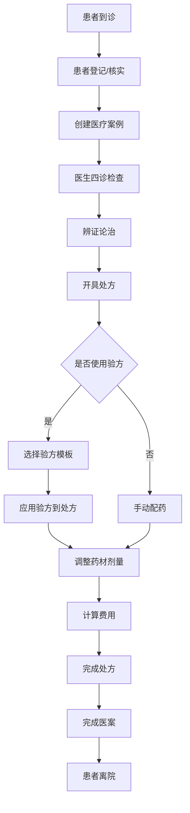
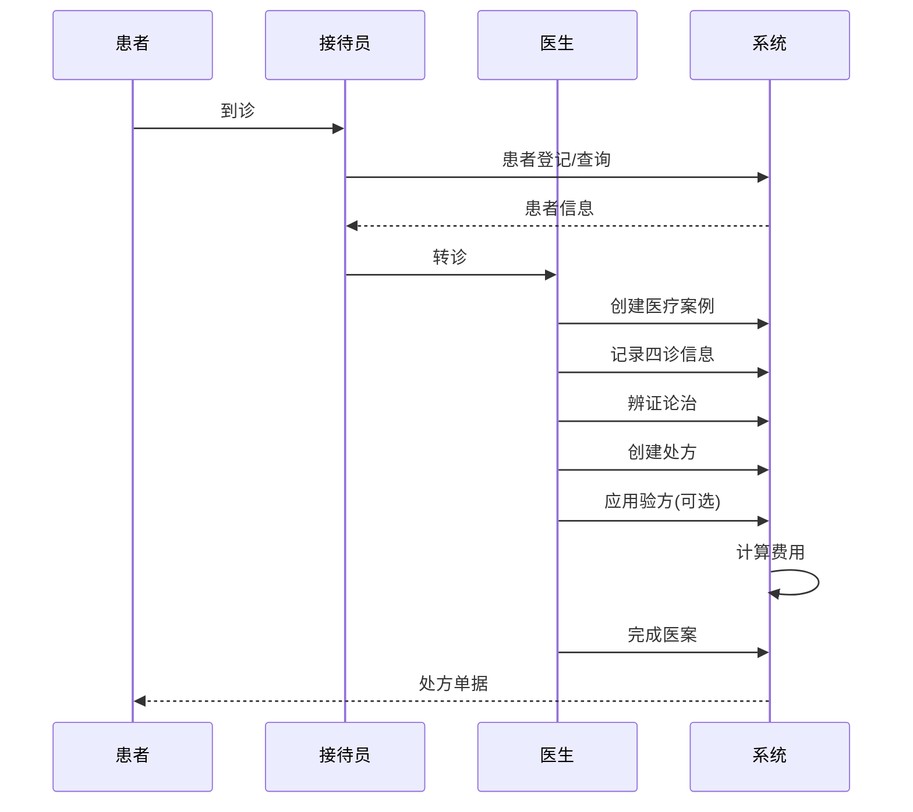

# 中医诊疗业务流程文档

## 📋 业务流程概述

凌隐宝堂中医诊所诊疗系统基于传统中医诊疗模式，结合现代信息化管理，实现完整的中医诊疗业务流程数字化。

**核心流程**：患者接待 → 医案创建 → 中医四诊 → 辨证论治 → 处方开具 → 医案完成

**设计理念**：
- **以患者为中心** - 所有流程围绕患者就诊体验设计
- **中医特色突出** - 四诊合参，辨证论治核心流程
- **数据完整记录** - 完整的诊疗数据留存和追溯
- **协作高效** - 各模块无缝协作，提升诊疗效率

## 🏥 整体业务架构

### 核心业务实体关系

```
患者档案 (Patients)
    ↓ 1:n
医疗案例 (MedicalCases) ←→ 看诊记录 (Consultations)
    ↓ 0..1:1                    ↑ 1:1
处方记录 (Prescriptions)        医生 (Users)
    ↓ 1:n
处方药材 (PrescriptionItems) ← 中药材 (Herbs)
    ↑ 
验方模板 (Formulas)
```

### 业务模块协作

1. **Patients** - 患者档案管理，基础接待功能
2. **MedicalCases** - 诊疗流程聚合根，统一管理看诊过程
3. **Consultations** - 中医四诊记录，纯数据存储专业化
4. **Prescriptions** - 处方开具，智能配伍和验方应用
5. **Herbs** - 药材基础信息，供处方选择使用
6. **Formulas** - 验方模板库，经典方剂和个人经验方

## 🔄 完整诊疗流程

### 阶段1：患者接待 (Patients模块)

#### 1.1 新患者登记
**操作角色**：接待员/医生  
**系统功能**：患者档案管理

**业务步骤**：
1. **基础信息采集**
   - 姓名、性别、年龄、联系方式
   - 证件类型和证件号码
   - 地址和紧急联系人信息

2. **医疗信息登记**
   - 过敏史记录（重要安全信息）
   - 既往病史简要记录
   - 血型等基础医疗信息

3. **系统操作**
   ```http
   POST /api/v1/patients
   {
       "name": "张三",
       "gender": "Male",
       "birthDate": "1985-06-15",
       "phoneNumber": "13800138000",
       "allergyHistory": "青霉素过敏",
       "emergencyContactName": "张四",
       "emergencyContactPhone": "13900139000"
   }
   ```

#### 1.2 老患者信息核实
**业务步骤**：
1. **快速检索**
   - 姓名搜索：`GET /api/v1/patients?keyword=张三`
   - 电话搜索：`GET /api/v1/patients?keyword=138`
   - 拼音搜索：`GET /api/v1/patients?keyword=zs`

2. **信息更新**
   - 核实联系方式变更
   - 更新就诊次数统计
   - 记录最后就诊时间

### 阶段2：医案创建 (MedicalCase模块)

#### 2.1 创建医疗案例
**操作角色**：医生  
**业务目标**：为本次就诊创建统一的数据容器

**业务步骤**：
1. **医案初始化**
   ```http
   POST /api/v1/medicalcases
   {
       "patientId": "patient-uuid",
       "doctorId": "doctor-uuid",
       "remark": "初诊/复诊"
   }
   ```

2. **状态管理**
   - **Registered** - 已挂号，等待看诊
   - **InProgress** - 看诊进行中
   - **Completed** - 看诊完成

#### 2.2 医案状态流转
```
Registered (挂号) → InProgress (看诊中) → Completed (完成)
     ↓                    ↓                    ↓
   等待医生              记录诊断              归档医案
```

### 阶段3：中医四诊 (Consultation模块)

#### 3.1 四诊数据采集
**操作角色**：医生  
**业务特色**：标准化的中医诊断数据记录

**望诊记录**：
- 神色形态观察
- 舌象检查记录
- 皮肤状况观察

**闻诊记录**：
- 语音声调特点
- 呼吸音特征
- 体味等嗅觉信息

**问诊记录**：
- 主诉症状详述
- 现病史完整记录
- 既往史和家族史

**切诊记录**：
- 脉象特征描述
- 腹部触诊发现
- 其他触诊信息

#### 3.2 系统记录操作
```http
POST /api/v1/consultations
{
    "medicalCaseId": "case-uuid",
    "patientId": "patient-uuid",
    "userId": "doctor-uuid",
    "chiefComplaint": "月经不调3月余",
    "presentIllness": "患者3月前出现月经周期延后...",
    "inspection": "面色淡白，精神疲倦，舌淡红苔薄白",
    "auscultationOlfaction": "语声低微，呼吸平",
    "inquiry": "月经周期35-40天，量少色淡，伴腰酸乏力",
    "palpation": "脉细弱，尺部尤甚"
}
```

### 阶段4：辨证论治 (Consultation模块)

#### 4.1 中医诊断
**业务核心**：四诊合参，辨证论治

**辨证过程**：
1. **证候分析** - 综合四诊信息分析病机
2. **病名诊断** - 确定中医病名
3. **证型判断** - 明确具体证型

#### 4.2 治疗原则制定
**系统记录**：
```http
PUT /api/v1/consultations/{id}
{
    "tcmDiagnosis": "月经不调（血虚证）",
    "treatmentPrinciple": "补血调经",
    "medicalAdvice": "忌生冷食物，保持情志舒畅，规律作息"
}
```

### 阶段5：处方开具 (Prescriptions + Herbs + Formulas协作)

#### 5.1 处方创建
**操作角色**：医生  
**业务特色**：智能配伍，验方应用

```http
POST /api/v1/prescriptions
{
    "medicalCaseId": "case-uuid",
    "patientId": "patient-uuid",
    "indication": "血虚月经不调",
    "dosageCount": 7,
    "advice": "水煎服，日1剂，早晚温服",
    "formulaSource": "四物汤加减"
}
```

#### 5.2 验方应用 (三模块协作核心)

**步骤1：选择验方**
```http
GET /api/v1/formulas/recommendations?symptoms=月经不调&diagnosis=血虚证&doctorId={doctorId}
```

**步骤2：应用验方**
```http
POST /api/v1/prescriptions/{prescriptionId}/apply-formula
{
    "formulaId": "formula-uuid"
}
```

**系统自动处理**：
- 从验方模板中提取药材组合
- 自动查询药材单价信息  
- 生成处方药材条目
- 计算总价格

#### 5.3 药材配伍调整

**手动添加药材**：
```http
GET /api/v1/herbs/search?keyword=川芎
```

**加减化裁**：
- 根据患者具体情况调整药材
- 修改药材剂量
- 添加针对性药材
- 删除不适宜药材

#### 5.4 处方完成
```http
POST /api/v1/prescriptions/{id}/recalculate
```

**系统功能**：
- 重新计算总费用
- 检查配伍禁忌（预留功能）
- 生成处方单据

### 阶段6：医案完成

#### 6.1 完成看诊
```http
POST /api/v1/medicalcases/{id}/complete
```

**系统处理**：
- 医案状态更新为 Completed
- 关联的诊断和处方记录归档
- 更新患者就诊统计信息

#### 6.2 数据归档
- 完整诊疗数据保存
- 生成诊疗报告
- 更新患者病历档案

## 📊 业务流程图

### 完整流程图


### 数据流转图


## 💊 处方业务详细流程

### 处方开具的三种模式

#### 模式1：验方直接应用
1. **选择经典验方** - 从Formula模板库选择
2. **一键应用** - 系统自动填充药材
3. **个性调整** - 根据患者情况微调
4. **费用计算** - 自动计算总价

#### 模式2：验方加减化裁
1. **基础验方** - 选择相近的验方模板
2. **加减调整** - 增减药材、调整剂量
3. **保存经验** - 可保存为个人验方
4. **重复使用** - 形成个人用药习惯

#### 模式3：完全手动配药
1. **药材搜索** - 通过关键词搜索药材
2. **逐个添加** - 手动添加每味药材
3. **剂量设定** - 设置用法用量
4. **费用核算** - 实时计算费用

### 处方安全控制

#### 过敏史检查
- 系统自动对比患者过敏史
- 高危药材使用警示
- 强制确认机制

#### 剂量合理性
- 单味药材最大剂量提醒
- 有毒药材剂量限制
- 特殊人群用药调整

#### 配伍禁忌 (预留功能)
- 十八反十九畏检查
- 药物相互作用提醒
- 配伍不当警告

## 📋 业务规则与约束

### 患者管理规则
1. **唯一性约束** - 同一患者避免重复建档
2. **信息完整性** - 关键信息不能为空
3. **隐私保护** - 敏感信息访问权限控制

### 医案管理规则
1. **一医一案** - 每次看诊创建独立医案
2. **状态流转** - 严格按照状态流程进行
3. **数据关联** - 医案必须关联患者和医生

### 处方管理规则
1. **处方权限** - 只有医生可以开具处方
2. **药材有效性** - 只能选择启用状态的药材
3. **剂量合理性** - 药材剂量必须在合理范围

### 验方管理规则
1. **共享机制** - 验方可设置共享给其他医生
2. **版本控制** - 验方修改保留历史版本
3. **权限控制** - 个人验方只有创建者可修改

## 🚀 业务优化建议

### 诊疗效率提升
1. **模板化录入** - 常见症状快速录入模板
2. **语音输入** - 四诊信息语音转文字
3. **智能推荐** - 基于历史诊疗数据的智能推荐

### 数据质量改善
1. **必填字段** - 关键诊疗信息强制填写
2. **数据校验** - 输入数据格式和逻辑校验
3. **标准化** - 术语标准化，减少表达差异

### 用户体验优化
1. **快捷操作** - 常用功能快捷键和快速通道
2. **界面友好** - 符合医生诊疗习惯的界面设计
3. **响应速度** - 系统响应时间优化

---

**文档版本**: v1.0  
**创建时间**: 2025-09-01  
**维护者**: UltraThink项目组  
**更新状态**: 基于现有业务模块和流程完成