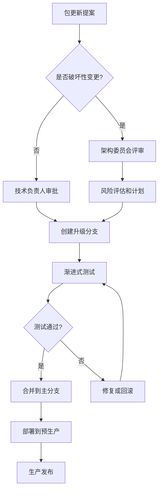

# CCPM 最佳实践指南

## 目标读者
本指南适用于架构师、高级开发工程师、Team Lead和DevOps工程师，旨在确保CPM在企业级项目中的正确应用和长期维护。

## 核心原则

### 1. 统一版本管理
**原则**: 相同包在整个解决方案中使用统一版本
**实践**: 
- 在Directory.Packages.props中集中定义所有包版本
- 避免在单个项目中覆写全局版本定义
- 定期审查和清理不一致的版本声明

**示例**:
```xml
<!-- ✅ 推荐 - 统一版本管理 -->
<ItemGroup Label="Microsoft Extensions">
  <PackageVersion Include="Microsoft.Extensions.Hosting" Version="9.0.0" />
  <PackageVersion Include="Microsoft.Extensions.DependencyInjection" Version="9.0.0" />
  <PackageVersion Include="Microsoft.Extensions.Configuration" Version="9.0.0" />
</ItemGroup>

<!-- ❌ 避免 - 版本不一致 -->
<PackageVersion Include="Microsoft.Extensions.Hosting" Version="9.0.0" />
<PackageVersion Include="Microsoft.Extensions.DependencyInjection" Version="8.0.8" />
```

### 2. 语义化分类管理
**原则**: 按功能和架构层次组织包分类
**实践**:
- 使用有意义的Label属性进行包分类
- 基于项目架构和用途进行逻辑分组
- 支持条件引用以避免包污染

**LYBTZYZS分类策略**:
```xml
<!-- 核心框架包 - 所有项目通用 -->
<ItemGroup Label="Core Framework">
  <PackageVersion Include="Microsoft.Extensions.Hosting" Version="9.0.0" />
</ItemGroup>

<!-- 前端WPF包 - 仅Desktop项目 -->
<ItemGroup Label="WPF and Desktop" Condition="$(MSBuildProjectName.Contains('Desktop'))">
  <PackageVersion Include="Prism.DryIoc" Version="9.0.537" />
</ItemGroup>

<!-- 后端API包 - 仅Server项目 -->
<ItemGroup Label="Web API and Services" Condition="$(MSBuildProjectName.Contains('Server'))">
  <PackageVersion Include="Microsoft.AspNetCore.Authentication.JwtBearer" Version="8.0.8" />
</ItemGroup>
```

### 3. 渐进式迁移策略
**原则**: 分阶段、可回滚的迁移方式
**实践**:
1. **阶段1**: 创建CPM配置文件，不修改项目文件
2. **阶段2**: 选择3-5个核心项目进行试点迁移
3. **阶段3**: 批量迁移剩余项目
4. **阶段4**: 优化和清理阶段

**迁移检查清单**:
```bash
# 迁移前检查
✅ Git分支已创建并推送
✅ 现有项目构建和测试全部通过  
✅ Directory.Packages.props配置已验证
✅ 备份恢复方案已准备

# 迁移后验证
✅ 项目构建无错误无警告
✅ 所有单元测试通过
✅ 集成测试验证完成
✅ 性能基准对比正常（±5%范围内）
```

## 架构集成最佳实践

### UltraThink双层架构适配
**挑战**: 前端采用UltraThink双层架构（QueryService + BusinessService + Module纯委托）
**解决方案**: 分层包管理策略

```xml
<!-- 前端架构专用包 -->
<ItemGroup Label="UltraThink Architecture" Condition="$(MSBuildProjectName.Contains('Desktop'))">
  <PackageVersion Include="Prism.DryIoc" Version="9.0.537" />
  <PackageVersion Include="Prism.Wpf" Version="9.0.537" />
  <PackageVersion Include="DryIoc.dll" Version="5.4.3" />
  <PackageVersion Include="Microsoft.Xaml.Behaviors.Wpf" Version="1.1.135" />
</ItemGroup>

<!-- 确保服务注册兼容性 -->
<ItemGroup Label="Frontend Service Infrastructure">
  <PackageVersion Include="Microsoft.Extensions.DependencyInjection" Version="9.0.0" />
  <PackageVersion Include="Microsoft.Extensions.Hosting" Version="9.0.0" />
</ItemGroup>
```

### 传统三层架构保持
**挑战**: 后端保持稳定的传统三层架构（Repository + Service + Controller）
**解决方案**: 后端包组合隔离

```xml
<!-- 后端架构稳定包组合 -->
<ItemGroup Label="Backend Three-Tier Architecture" Condition="$(MSBuildProjectName.Contains('Server'))">
  <PackageVersion Include="Microsoft.EntityFrameworkCore" Version="8.0.8" />
  <PackageVersion Include="Microsoft.EntityFrameworkCore.SqlServer" Version="8.0.8" />
  <PackageVersion Include="Microsoft.AspNetCore.Authentication.JwtBearer" Version="8.0.8" />
  <PackageVersion Include="AutoMapper" Version="12.0.1" />
  <PackageVersion Include="AutoMapper.Extensions.Microsoft.DependencyInjection" Version="12.0.1" />
</ItemGroup>
```

## 性能优化实践

### 1. 构建缓存优化
**配置构建缓存**:
```xml
<PropertyGroup>
  <!-- 启用包缓存 -->
  <RestorePackagesWithLockFile>true</RestorePackagesWithLockFile>
  <RestoreLockedMode Condition="'$(CI)' == 'true'">true</RestoreLockedMode>
  
  <!-- 优化输出目录 -->
  <UseArtifactsOutput>true</UseArtifactsOutput>
  <ArtifactsPath>$(MSBuildThisFileDirectory)artifacts</ArtifactsPath>
  
  <!-- 传递依赖锁定 -->
  <CentralPackageTransitivePinningEnabled>true</CentralPackageTransitivePinningEnabled>
</PropertyGroup>
```

**性能基准**:
- 首次包还原：30-60秒（取决于网络）
- 缓存命中还原：<10秒
- 构建时间变化：±5%以内
- Visual Studio加载：增加<5%

### 2. CI/CD流程优化
**GitHub Actions缓存策略**:
```yaml
- name: Cache NuGet packages
  uses: actions/cache@v4
  with:
    path: ~/.nuget/packages
    key: ${{ runner.os }}-nuget-${{ hashFiles('Directory.Packages.props', '**/packages.lock.json') }}
    restore-keys: |
      ${{ runner.os }}-nuget-
```

**多阶段缓存体系**:
1. **NuGet全局缓存**: 包数据持久化
2. **构建工件缓存**: 编译输出缓存 
3. **Docker层缓存**: 容器镜像优化
4. **GitHub Actions缓存**: CI流水线加速

## 安全最佳实践

### 1. 包源安全配置
**官方和信任源优先**:
```xml
<packageSources>
  <clear />
  <add key="nuget.org" value="https://api.nuget.org/v3/index.json" protocolVersion="3" />
  <add key="Microsoft Visual Studio Offline Packages" 
       value="C:\Program Files (x86)\Microsoft SDKs\NuGetPackages\" />
  <!-- 企业内部源 -->
  <add key="internal" value="https://internal-nuget.company.com/v3/index.json" />
</packageSources>
```

### 2. 版本锁定策略
**生产环境锁定**:
```xml
<PropertyGroup>
  <!-- 生产环境严格锁定 -->
  <RestorePackagesWithLockFile Condition="'$(Configuration)' == 'Release'">true</RestorePackagesWithLockFile>
  <RestoreLockedMode Condition="'$(CI)' == 'true'">true</RestoreLockedMode>
</PropertyGroup>
```

### 3. 漏洞监控自动化
**自动扫描脚本**:
```powershell
# CPM-SecurityScan.ps1
param(
    [string]$SolutionPath = ".",
    [switch]$Fix
)

Write-Host "🔍 扫描包安全漏洞..." -ForegroundColor Yellow
$vulnerablePackages = dotnet list package --vulnerable --include-transitive --source $SolutionPath

if ($vulnerablePackages -match "has the following vulnerable packages") {
    Write-Host "⚠️ 发现安全漏洞！" -ForegroundColor Red
    $vulnerablePackages
    
    if ($Fix) {
        Write-Host "🔧 自动修复安全漏洞..." -ForegroundColor Yellow
        # 实施自动修复逻辑
    }
} else {
    Write-Host "✅ 未发现安全漏洞" -ForegroundColor Green
}
```

## 团队协作最佳实践

### 1. 版本升级决策流程


### 2. 代码审查检查项
**CPM相关审查要点**:
- [ ] Directory.Packages.props中版本号正确无冲突
- [ ] 项目文件中PackageReference无Version属性
- [ ] 新包已添加到适当的分类标签
- [ ] 条件引用逻辑正确，避免包污染
- [ ] 包更新影响范围已评估和测试

### 3. 文档同步更新
**变更文档要求**:
- 包版本重大更新时更新操作手册
- 新包分类策略时更新架构文档  
- 流程优化时更新最佳实践指南
- 问题解决方案补充到FAQ文档

## 监控和度量

### 1. 关键性能指标(KPI)
**效率指标**:
- 包版本升级时间：目标从2小时 → 10分钟
- 新包添加流程：目标5分钟完成
- 版本冲突发现：100%自动化检测

**质量指标**:
- 包版本一致性：100%统一版本
- 构建成功率：≥99%
- 测试通过率：100%（回归测试）

### 2. 自动化监控脚本
```powershell
# CPM-HealthCheck.ps1
function Test-CPMHealth {
    $results = @{
        PackageConsistency = Test-PackageVersionConsistency
        BuildSuccess = Test-SolutionBuild  
        TestsPass = Test-AllTests
        SecurityVulnerabilities = Test-PackageSecurity
    }
    
    return $results
}

function Get-CPMMetrics {
    return @{
        TotalPackages = (Select-Xml -Path "Directory.Packages.props" -XPath "//PackageVersion").Count
        DirectorySize = (Get-Item "Directory.Packages.props").Length
        LastUpdate = (Get-Item "Directory.Packages.props").LastWriteTime
        BuildCacheHitRate = Get-BuildCacheHitRate
    }
}
```

## 高级优化技巧

### 1. 条件包引用优化
**基于项目特征的智能包分配**:
```xml
<!-- 基于项目名称模式 -->
<ItemGroup Label="WPF UI Components" Condition="$(MSBuildProjectName.EndsWith('.WPF'))">
  <PackageVersion Include="MaterialDesignThemes" Version="5.1.0" />
</ItemGroup>

<!-- 基于目标框架 -->
<ItemGroup Label="Windows-specific" Condition="$(TargetFramework.Contains('windows'))">
  <PackageVersion Include="Microsoft.WindowsAPICodePack" Version="1.1.4" />
</ItemGroup>

<!-- 基于配置类型 -->
<ItemGroup Label="Debug Tools" Condition="'$(Configuration)' == 'Debug'">
  <PackageVersion Include="Microsoft.EntityFrameworkCore.Tools" Version="8.0.8" />
</ItemGroup>
```

### 2. 自定义MSBuild任务
**自动化包管理任务**:
```xml
<Target Name="ValidateCPMConfiguration" BeforeTargets="Restore">
  <ItemGroup>
    <ProjectFiles Include="**/*.csproj" />
  </ItemGroup>
  
  <Message Text="验证CPM配置..." Importance="high" />
  
  <!-- 检查项目文件中是否有版本号 -->
  <Exec Command="powershell -Command &quot;Get-ChildItem -Recurse -Filter '*.csproj' | Select-String 'Version=' | ForEach-Object { Write-Warning 'CPM违规: $($_.FileName):$($_.LineNumber)' }&quot;" 
        ContinueOnError="true" />
</Target>
```

### 3. 包使用分析
**生成包使用报告**:
```powershell
# Generate-PackageUsageMatrix.ps1
function Get-PackageUsageMatrix {
    $packages = @{}
    
    Get-ChildItem -Recurse -Filter "*.csproj" | ForEach-Object {
        $projectName = $_.BaseName
        $content = Get-Content $_.FullName -Raw
        
        Select-String 'PackageReference Include="([^"]+)"' -InputObject $content -AllMatches | 
        ForEach-Object {
            $packageName = $_.Matches[0].Groups[1].Value
            if (-not $packages[$packageName]) {
                $packages[$packageName] = @()
            }
            $packages[$packageName] += $projectName
        }
    }
    
    return $packages
}
```

## 故障预防策略

### 1. 预防性检查
**自动化验证流程**:
```yaml
# .github/workflows/cpm-validation.yml
name: CPM Configuration Validation

on:
  pull_request:
    paths:
      - 'Directory.Packages.props'
      - '**/*.csproj'

jobs:
  validate-cpm:
    runs-on: windows-latest
    steps:
    - uses: actions/checkout@v4
    
    - name: Validate CPM Configuration
      run: |
        # 检查版本一致性
        .\scripts\CPM-VersionConflictDetector.ps1
        
        # 验证构建
        dotnet build --no-restore --verbosity minimal
        
        # 安全扫描
        dotnet list package --vulnerable
```

### 2. 回滚准备
**多层回滚机制**:
1. **配置回滚**: Git快速恢复Directory.Packages.props
2. **项目回滚**: 恢复.csproj文件的Version属性
3. **完整回滚**: 切换到CPM迁移前的Git分支
4. **紧急回滚**: 禁用CPM功能的快速开关

```xml
<!-- 紧急回滚开关 -->
<PropertyGroup>
  <ManagePackageVersionsCentrally Condition="'$(DisableCPM)' != 'true'">true</ManagePackageVersionsCentrally>
</PropertyGroup>
```

## 长期维护策略

### 1. 定期维护计划
**月度任务**:
- 检查包安全更新
- 更新非破坏性版本
- 清理未使用的包依赖

**季度任务**:
- 主要版本升级评估
- 性能基准测试
- 文档和流程优化

**年度任务**:
- CPM策略和架构审查
- 工具链升级评估
- 团队培训需求评估

### 2. 知识传承机制
**建立CPM专家体系**:
- **L1 专家**: 日常操作和基础故障排除
- **L2 专家**: 复杂问题诊断和架构优化
- **L3 专家**: 战略决策和企业级部署

**知识文档化要求**:
- 每个重要决策都有决策记录（ADR）
- 故障解决方案及时更新到知识库
- 最佳实践持续总结和分享

---
**文档版本**: v1.0  
**最后更新**: 2025-09-05  
**适用版本**: CCPM v1.0+  
**审查周期**: 季度更新