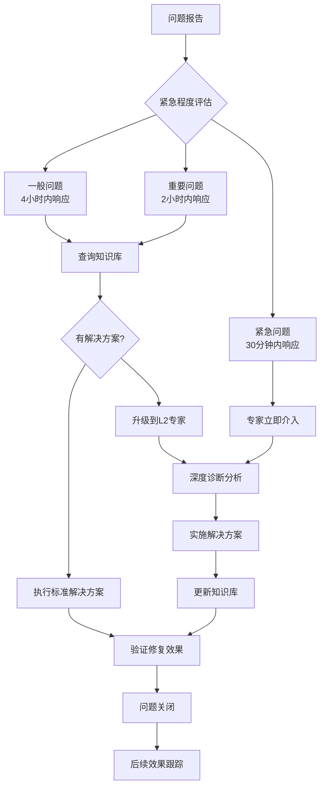

# CCPM 维护流程手册

## 概述
本手册定义了LYBTZYZS项目CCPM系统的标准化维护流程，确保CPM系统的长期稳定运行和持续优化。

## 维护目标
- 🎯 **可用性**: CPM系统可用率≥99.5%
- ⚡ **性能**: 包还原时间<60秒，构建时间变化±5%以内
- 🔒 **安全**: 零高危安全漏洞，包更新安全审查覆盖率100%
- 📈 **效率**: 包管理操作效率比传统方式提升≥60%

## 日常维护 (Daily Operations)

### 上午检查 (9:00 AM)
**负责人**: 值班开发工程师
**检查项目**:
- [ ] CPM系统健康状态检查
- [ ] 夜间自动化构建结果验证
- [ ] 包安全扫描报告审查
- [ ] 开发团队反馈的问题收集

**执行命令**:
```bash
# 运行每日健康检查
.\scripts\CPM-DailyHealthCheck.ps1

# 检查构建状态
gh workflow list --repo shouqitao/LYBTZYZS

# 扫描安全漏洞
.\scripts\CPM-SecurityScan.ps1 -Report Daily
```

### 下午维护 (2:00 PM)
**负责人**: CPM维护工程师
**维护任务**:
- [ ] 版本冲突检测和解决
- [ ] 性能指标分析和优化建议
- [ ] 包使用情况统计分析
- [ ] 知识库内容更新

**分析报告生成**:
```bash
# 生成包使用分析报告
.\scripts\Generate-PackageUsageReport.ps1 -Period Daily

# 性能指标收集
.\scripts\Collect-PerformanceMetrics.ps1

# 更新监控仪表板
.\scripts\Update-CPMDashboard.ps1
```

### 问题响应流程


## 周度维护 (Weekly Operations)

### 每周一: 包更新评估
**负责人**: 高级开发工程师 + 架构师
**主要任务**:
1. **包更新扫描**:
```bash
# 检查所有包的可用更新
dotnet list package --outdated

# 生成更新建议报告
.\scripts\Generate-PackageUpdateRecommendations.ps1
```

2. **更新优先级评估**:
   - **高优先级**: 安全修复、关键Bug修复
   - **中优先级**: 性能改进、新功能
   - **低优先级**: 文档更新、代码清理

3. **兼容性评估**:
```bash
# 检查破坏性变更
.\scripts\Check-BreakingChanges.ps1 -Packages @("Microsoft.EntityFrameworkCore", "Prism.DryIoc")

# 生成兼容性分析报告
.\scripts\Generate-CompatibilityReport.ps1
```

### 每周三: 性能监控和优化
**负责人**: DevOps工程师
**分析内容**:
- 构建时间趋势分析
- 包还原缓存命中率
- Visual Studio启动性能
- 磁盘空间使用情况

**优化操作**:
```bash
# 清理过期缓存
.\scripts\Cleanup-NuGetCaches.ps1 -OlderThan 30Days

# 优化包缓存配置
.\scripts\Optimize-CacheConfiguration.ps1

# 生成性能优化建议
.\scripts\Generate-PerformanceOptimizationPlan.ps1
```

### 每周五: 文档和知识库更新
**负责人**: 技术文档工程师
**更新内容**:
- 本周解决的新问题补充到FAQ
- 更新最佳实践指南
- 审查和改进故障排除文档
- 培训材料内容更新

## 月度维护 (Monthly Operations)

### 第一周: 全面健康评估
**评估维度**:
1. **技术健康度**:
   - 包版本一致性检查：100%一致
   - 安全漏洞清零验证
   - 构建成功率统计：≥99%
   - 测试覆盖率保持：≥90%

2. **运营效率**:
   - 问题解决时间趋势
   - 团队自助解决率
   - 新功能采用率
   - 用户满意度调查

**健康评估报告**:
```bash
# 生成月度健康报告
.\scripts\Generate-MonthlyHealthReport.ps1 -Month $(Get-Date).Month

# 执行全面系统检查
.\scripts\CPM-ComprehensiveHealthCheck.ps1 -Detailed

# 收集用户反馈
.\scripts\Collect-UserFeedback.ps1 -Period Monthly
```

### 第二周: 安全审计和合规检查
**安全检查清单**:
- [ ] 所有包的安全漏洞扫描
- [ ] 许可证合规性验证
- [ ] 包源访问权限审查
- [ ] 敏感信息泄露检查

**合规性验证**:
```bash
# 执行安全审计
.\scripts\CPM-SecurityAudit.ps1 -ComprehensiveMode

# 生成合规报告
.\scripts\Generate-ComplianceReport.ps1

# 更新安全策略
.\scripts\Update-SecurityPolicies.ps1
```

### 第三周: 性能基准测试
**基准测试项目**:
- 冷启动构建时间
- 增量构建性能
- 包还原速度
- Visual Studio响应性

**基准测试执行**:
```bash
# 执行性能基准测试
.\scripts\Run-PerformanceBenchmarks.ps1

# 与历史数据对比
.\scripts\Compare-PerformanceTrends.ps1 -Period 3Months

# 生成性能报告
.\scripts\Generate-PerformanceReport.ps1
```

### 第四周: 架构审查和规划
**架构审查内容**:
- CPM配置架构合理性评估
- 包分类策略有效性验证
- 新技术集成可行性分析
- 下个月优化计划制定

## 季度维护 (Quarterly Operations)

### Q1: 战略规划和目标设定
**规划内容**:
1. **技术路线图更新**:
   - .NET版本升级计划
   - 主要包版本升级策略
   - 新技术集成评估

2. **团队能力建设**:
   - 培训需求分析
   - 专家认证计划
   - 知识传承机制完善

3. **工具链优化**:
   - 自动化程度提升
   - 监控体系增强
   - 用户体验改善

### Q2: 主要版本升级
**升级实施流程**:
1. **准备阶段** (Week 1):
```bash
# 创建升级计划分支
git checkout -b quarterly/q2-major-upgrade

# 备份当前配置
.\scripts\Backup-CPMConfiguration.ps1

# 兼容性分析
.\scripts\Analyze-UpgradeCompatibility.ps1
```

2. **测试阶段** (Week 2-3):
```bash
# 在测试环境执行升级
.\scripts\Execute-MajorUpgrade.ps1 -Environment Test

# 全面回归测试
.\scripts\Run-RegressionTests.ps1 -Comprehensive

# 性能影响评估
.\scripts\Assess-UpgradePerformanceImpact.ps1
```

3. **生产部署** (Week 4):
```bash
# 生产环境升级
.\scripts\Execute-MajorUpgrade.ps1 -Environment Production

# 生产验证
.\scripts\Validate-ProductionUpgrade.ps1

# 监控和回滚准备
.\scripts\Setup-PostUpgradeMonitoring.ps1
```

### Q3: 深度优化和创新
**优化项目**:
- 包管理流程自动化增强
- 智能依赖分析工具开发
- 预测性维护机制建立
- 用户体验优化

### Q4: 年度总结和规划
**总结内容**:
- 年度CPM系统运营报告
- 团队能力提升成果
- 下一年度发展规划
- 最佳实践总结和分享

## 应急响应流程

### 紧急事件分类
**P0 - 系统完全不可用** (15分钟响应):
- CPM构建完全失败
- 关键安全漏洞利用
- 数据损坏或丢失

**P1 - 核心功能受影响** (30分钟响应):
- 部分项目构建失败
- 性能严重下降
- 重要包版本冲突

**P2 - 非核心功能异常** (2小时响应):
- 个别项目问题
- 轻微性能影响
- 文档或工具问题

### 应急响应小组
**P0响应小组**:
- 首席架构师 (指挥官)
- 高级DevOps工程师 (执行)
- 系统管理员 (支持)
- 产品负责人 (决策)

**应急操作手册**:
```bash
# P0应急响应脚本
.\scripts\Emergency-Response-P0.ps1

# 快速诊断
.\scripts\Emergency-Diagnosis.ps1

# 临时修复
.\scripts\Emergency-HotFix.ps1

# 系统回滚
.\scripts\Emergency-Rollback.ps1
```

### 事后处理流程
1. **问题根因分析** (24小时内):
   - 技术根因调查
   - 流程缺陷识别
   - 责任界定和学习

2. **预防措施制定** (48小时内):
   - 技术改进方案
   - 流程优化建议
   - 监控增强计划

3. **改进实施跟踪** (1周内):
   - 改进措施实施
   - 效果验证确认
   - 知识库更新

## 质量保证体系

### SLA指标定义
**可用性指标**:
- CPM系统可用率: ≥99.5%
- 平均故障恢复时间: <30分钟
- 计划内维护时间: 每月<4小时

**性能指标**:
- 包还原时间: <60秒 (首次), <10秒 (缓存命中)
- 构建时间影响: ±5%以内
- Visual Studio启动影响: <5%增加

**质量指标**:
- 包版本一致性: 100%
- 安全漏洞响应时间: <4小时
- 问题首次解决率: ≥85%

### 持续改进机制
**月度改进会议**:
- 指标达成情况回顾
- 用户反馈分析
- 改进机会识别
- 下月改进计划制定

**改进实施跟踪**:
- 改进项目进度跟踪
- 效果量化评估
- 最佳实践提炼
- 经验教训总结

## 文档维护标准

### 文档更新触发条件
- CPM配置重大变更
- 新问题解决方案发现
- 流程优化和改进
- 工具版本重大更新
- 团队反馈的文档问题

### 文档质量标准
**内容质量**:
- [ ] 准确性：与实际系统状态100%一致
- [ ] 完整性：覆盖所有关键操作步骤
- [ ] 实用性：用户可以直接按照执行
- [ ] 时效性：与当前版本同步更新

**格式质量**:
- [ ] 结构清晰：逻辑层次分明
- [ ] 语言简洁：避免冗长和模糊表述  
- [ ] 代码正确：所有示例代码可执行
- [ ] 链接有效：所有外部链接可访问

### 文档审核流程
1. **技术审核**: 技术专家验证内容准确性
2. **用户测试**: 目标用户按文档执行操作验证
3. **编辑审核**: 文档编辑检查格式和语言
4. **最终审批**: 项目负责人批准发布

## 监控和告警设置

### 关键监控指标
**系统健康监控**:
```yaml
# CPM系统健康监控配置
monitors:
  - name: "CPM Build Success Rate"
    metric: "build_success_percentage"
    threshold: 95
    alert_level: "warning"
    
  - name: "Package Restore Time"
    metric: "package_restore_duration"
    threshold: 60
    alert_level: "critical"
    
  - name: "Security Vulnerabilities"
    metric: "high_severity_vulnerabilities"
    threshold: 0
    alert_level: "critical"
```

### 告警响应矩阵
| 告警级别 | 响应时间 | 通知对象 | 处理要求 |
|---------|----------|----------|----------|
| Critical | 15分钟 | 专家小组 + 管理层 | 立即处理 |
| Warning | 2小时 | 维护团队 | 当日处理 |
| Info | 24小时 | 责任工程师 | 3日内处理 |

---
**文档版本**: v1.0  
**生效日期**: 2025-09-05  
**审查周期**: 季度审查  
**维护责任**: CCPM运维团队  
**批准人**: 技术总监