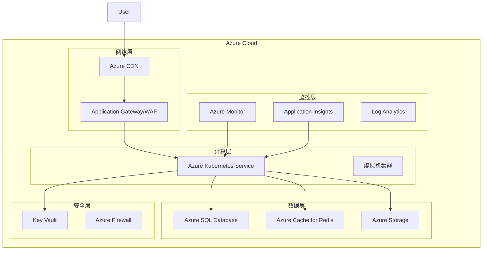

# 凌隐宝堂生产环境部署指南 - UltraThink重构

## 概述

本文档提供完整的生产环境部署指南，包括基础设施配置、应用部署、监控设置和灾难恢复。

## 架构概览



## 前置要求

### 1. 工具安装

```bash
# Terraform
wget https://releases.hashicorp.com/terraform/1.5.0/terraform_1.5.0_linux_amd64.zip
unzip terraform_1.5.0_linux_amd64.zip
sudo mv terraform /usr/local/bin/

# Azure CLI
curl -sL https://aka.ms/InstallAzureCLIDeb | sudo bash

# Kubectl
curl -LO "https://dl.k8s.io/release/$(curl -L -s https://dl.k8s.io/release/stable.txt)/bin/linux/amd64/kubectl"
sudo install -o root -g root -m 0755 kubectl /usr/local/bin/kubectl

# Helm
curl https://raw.githubusercontent.com/helm/helm/main/scripts/get-helm-3 | bash

# Ansible
sudo apt update
sudo apt install python3-pip
pip3 install ansible ansible-core
```

### 2. Azure认证

```bash
# 登录Azure
az login

# 设置订阅
az account set --subscription "Your-Subscription-ID"

# 创建服务主体
az ad sp create-for-rbac --name "lybt-terraform" --role="Contributor" --scopes="/subscriptions/YOUR_SUBSCRIPTION_ID"

# 导出环境变量
export ARM_CLIENT_ID="00000000-0000-0000-0000-000000000000"
export ARM_CLIENT_SECRET="00000000-0000-0000-0000-000000000000"
export ARM_SUBSCRIPTION_ID="00000000-0000-0000-0000-000000000000"
export ARM_TENANT_ID="00000000-0000-0000-0000-000000000000"
```

## 基础设施部署

### 1. 初始化Terraform

```bash
cd terraform

# 初始化Terraform
terraform init

# 创建工作区
terraform workspace new production
terraform workspace select production

# 验证配置
terraform validate

# 查看执行计划
terraform plan -var-file="environments/production.tfvars"
```

### 2. 部署基础设施

```bash
# 部署资源
terraform apply -var-file="environments/production.tfvars" -auto-approve

# 保存输出
terraform output -json > infrastructure-outputs.json

# 获取AKS凭证
az aks get-credentials --resource-group lybt-production-rg --name lybt-production-aks

# 验证连接
kubectl get nodes
```

### 3. 配置DNS

```bash
# 获取Application Gateway IP
AG_IP=$(terraform output -raw app_gateway_public_ip)

# 更新DNS记录
az network dns record-set a add-record \
  --resource-group lybt-dns-rg \
  --zone-name lybt.com \
  --record-set-name @ \
  --ipv4-address $AG_IP

# 添加www记录
az network dns record-set a add-record \
  --resource-group lybt-dns-rg \
  --zone-name lybt.com \
  --record-set-name www \
  --ipv4-address $AG_IP
```

## 应用部署

### 1. 准备部署文件

```bash
# 克隆配置仓库
git clone https://github.com/lybt/deployment-config.git
cd deployment-config

# 创建密钥
kubectl create namespace lybt-prod

# 创建数据库密钥
kubectl create secret generic db-secret \
  --from-literal=username=sa \
  --from-literal=password='YourStrong!Password' \
  -n lybt-prod

# 创建Redis密钥
kubectl create secret generic redis-secret \
  --from-literal=password='YourRedisPassword' \
  -n lybt-prod

# 创建JWT密钥
kubectl create secret generic jwt-secret \
  --from-literal=secret='YourJWTSecretKey' \
  -n lybt-prod
```

### 2. 使用Helm部署

```bash
# 添加Helm仓库
helm repo add lybt https://charts.lybt.com
helm repo update

# 部署应用
helm install lybt-webapi lybt/webapi \
  --namespace lybt-prod \
  --values values-production.yaml \
  --set image.tag=v1.0.0 \
  --set replicaCount=3 \
  --set ingress.enabled=true \
  --set ingress.hosts[0].host=api.lybt.com

# 验证部署
kubectl get all -n lybt-prod
kubectl get ingress -n lybt-prod
```

### 3. 使用Ansible部署

```bash
cd ansible

# 加密敏感数据
ansible-vault create group_vars/production/vault.yml

# 执行部署
ansible-playbook -i inventory/production.yml playbook-deploy.yml \
  --ask-vault-pass \
  -e "deploy_version=v1.0.0" \
  -e "environment=production"

# 验证部署
ansible all -i inventory/production.yml -m uri -a "url=http://localhost/health"
```

## 数据库配置

### 1. 初始化数据库

```bash
# 连接到SQL Server
sqlcmd -S lybt-prod-sql.database.windows.net -U adminuser -P 'YourPassword'

# 创建数据库
CREATE DATABASE LYBTDB;
GO

# 配置数据库
ALTER DATABASE LYBTDB SET RECOVERY FULL;
ALTER DATABASE LYBTDB SET AUTO_SHRINK OFF;
ALTER DATABASE LYBTDB SET AUTO_UPDATE_STATISTICS ON;
GO
```

### 2. 运行迁移

```bash
# 使用EF Core迁移
dotnet ef database update \
  --project src/Backend/Core/LYBT.Infrastructure \
  --startup-project src/Backend/Services/LYBT.WebAPI \
  --connection "Server=lybt-prod-sql.database.windows.net;Database=LYBTDB;User Id=adminuser;Password=YourPassword"

# 验证迁移
dotnet ef migrations list \
  --project src/Backend/Core/LYBT.Infrastructure \
  --startup-project src/Backend/Services/LYBT.WebAPI
```

### 3. 配置备份

```bash
# 配置自动备份
az sql db long-term-retention-policy set \
  --resource-group lybt-production-rg \
  --server lybt-prod-sql \
  --database LYBTDB \
  --weekly-retention P4W \
  --monthly-retention P12M \
  --yearly-retention P5Y

# 创建手动备份
az sql db backup create \
  --resource-group lybt-production-rg \
  --server lybt-prod-sql \
  --database LYBTDB \
  --name "LYBTDB-manual-$(date +%Y%m%d%H%M%S)"
```

## SSL证书配置

### 1. 获取证书

```bash
# 使用Let's Encrypt
sudo certbot certonly \
  --manual \
  --preferred-challenges dns \
  -d lybt.com \
  -d www.lybt.com \
  -d api.lybt.com

# 或使用Azure证书服务
az keyvault certificate create \
  --vault-name lybt-prod-kv \
  --name lybt-ssl-cert \
  --policy @certificate-policy.json
```

### 2. 配置Application Gateway

```bash
# 上传证书到Key Vault
az keyvault certificate import \
  --vault-name lybt-prod-kv \
  --name lybt-ssl-cert \
  --file lybt-certificate.pfx \
  --password 'CertPassword'

# 配置Application Gateway
az network application-gateway ssl-cert create \
  --gateway-name lybt-prod-ag \
  --resource-group lybt-production-rg \
  --name lybt-ssl-cert \
  --key-vault-secret-id $(az keyvault certificate show --vault-name lybt-prod-kv --name lybt-ssl-cert --query sid -o tsv)
```

## 监控配置

### 1. 配置Application Insights

```bash
# 获取Instrumentation Key
INSTRUMENTATION_KEY=$(az monitor app-insights component show \
  --app lybt-prod-ai \
  --resource-group lybt-production-rg \
  --query instrumentationKey -o tsv)

# 更新应用配置
kubectl set env deployment/lybt-webapi \
  ApplicationInsights__InstrumentationKey=$INSTRUMENTATION_KEY \
  -n lybt-prod
```

### 2. 配置告警

```bash
# CPU使用率告警
az monitor metrics alert create \
  --name high-cpu-usage \
  --resource-group lybt-production-rg \
  --scopes /subscriptions/.../resourceGroups/.../providers/Microsoft.ContainerService/managedClusters/lybt-prod-aks \
  --condition "avg Percentage CPU > 80" \
  --window-size 5m \
  --evaluation-frequency 1m \
  --action-group /subscriptions/.../resourceGroups/.../providers/microsoft.insights/actionGroups/lybt-alerts

# 内存使用率告警
az monitor metrics alert create \
  --name high-memory-usage \
  --resource-group lybt-production-rg \
  --scopes /subscriptions/.../resourceGroups/.../providers/Microsoft.ContainerService/managedClusters/lybt-prod-aks \
  --condition "avg Working Set Memory Percentage > 80" \
  --window-size 5m \
  --evaluation-frequency 1m \
  --action-group /subscriptions/.../resourceGroups/.../providers/microsoft.insights/actionGroups/lybt-alerts
```

### 3. 配置日志

```bash
# 配置诊断设置
az monitor diagnostic-settings create \
  --name lybt-diagnostics \
  --resource /subscriptions/.../resourceGroups/.../providers/Microsoft.ContainerService/managedClusters/lybt-prod-aks \
  --workspace /subscriptions/.../resourceGroups/.../providers/Microsoft.OperationalInsights/workspaces/lybt-prod-law \
  --logs '[{"category": "kube-apiserver", "enabled": true}, {"category": "kube-controller-manager", "enabled": true}]' \
  --metrics '[{"category": "AllMetrics", "enabled": true}]'
```

## 性能优化

### 1. 配置自动扩展

```bash
# 配置HPA
kubectl autoscale deployment lybt-webapi \
  --cpu-percent=70 \
  --min=3 \
  --max=10 \
  -n lybt-prod

# 配置VPA
kubectl apply -f - <<EOF
apiVersion: autoscaling.k8s.io/v1
kind: VerticalPodAutoscaler
metadata:
  name: lybt-webapi-vpa
  namespace: lybt-prod
spec:
  targetRef:
    apiVersion: apps/v1
    kind: Deployment
    name: lybt-webapi
  updatePolicy:
    updateMode: "Auto"
EOF
```

### 2. 配置CDN

```bash
# 创建CDN端点
az cdn endpoint create \
  --resource-group lybt-production-rg \
  --profile-name lybt-cdn-profile \
  --name lybt-cdn-endpoint \
  --origin api.lybt.com \
  --origin-host-header api.lybt.com

# 配置缓存规则
az cdn endpoint rule add \
  --resource-group lybt-production-rg \
  --profile-name lybt-cdn-profile \
  --endpoint-name lybt-cdn-endpoint \
  --name cache-static-assets \
  --order 1 \
  --match-variable UrlPath \
  --operator Contains \
  --match-values "/assets/" \
  --cache-behavior Override \
  --cache-duration "7.00:00:00"
```

## 安全加固

### 1. 网络策略

```yaml
# network-policy.yaml
apiVersion: networking.k8s.io/v1
kind: NetworkPolicy
metadata:
  name: lybt-network-policy
  namespace: lybt-prod
spec:
  podSelector:
    matchLabels:
      app: lybt-webapi
  policyTypes:
  - Ingress
  - Egress
  ingress:
  - from:
    - namespaceSelector:
        matchLabels:
          name: ingress-nginx
    ports:
    - protocol: TCP
      port: 5000
  egress:
  - to:
    - namespaceSelector: {}
    ports:
    - protocol: TCP
      port: 1433
    - protocol: TCP
      port: 6379
```

### 2. Pod安全策略

```yaml
# pod-security-policy.yaml
apiVersion: policy/v1beta1
kind: PodSecurityPolicy
metadata:
  name: lybt-psp
spec:
  privileged: false
  allowPrivilegeEscalation: false
  requiredDropCapabilities:
    - ALL
  volumes:
    - 'configMap'
    - 'emptyDir'
    - 'projected'
    - 'secret'
    - 'downwardAPI'
    - 'persistentVolumeClaim'
  runAsUser:
    rule: 'MustRunAsNonRoot'
  seLinux:
    rule: 'RunAsAny'
  fsGroup:
    rule: 'RunAsAny'
  readOnlyRootFilesystem: true
```

## 灾难恢复

### 1. 备份策略

```bash
# 创建备份脚本
cat > backup.sh <<'EOF'
#!/bin/bash
TIMESTAMP=$(date +%Y%m%d%H%M%S)

# 备份数据库
az sql db export \
  --resource-group lybt-production-rg \
  --server lybt-prod-sql \
  --database LYBTDB \
  --admin-user adminuser \
  --admin-password 'YourPassword' \
  --storage-key-type StorageAccessKey \
  --storage-key 'YourStorageKey' \
  --storage-uri "https://lybtbackup.blob.core.windows.net/backups/LYBTDB-$TIMESTAMP.bacpac"

# 备份Kubernetes配置
kubectl get all --all-namespaces -o yaml > k8s-backup-$TIMESTAMP.yaml

# 备份密钥
kubectl get secrets -n lybt-prod -o yaml > secrets-backup-$TIMESTAMP.yaml

# 上传到备份存储
az storage blob upload-batch \
  --account-name lybtbackup \
  --destination backups \
  --source ./
EOF

# 设置定时任务
crontab -e
# 0 2 * * * /path/to/backup.sh
```

### 2. 恢复流程

```bash
# 恢复数据库
az sql db import \
  --resource-group lybt-production-rg \
  --server lybt-prod-sql \
  --database LYBTDB-restored \
  --admin-user adminuser \
  --admin-password 'YourPassword' \
  --storage-key-type StorageAccessKey \
  --storage-key 'YourStorageKey' \
  --storage-uri "https://lybtbackup.blob.core.windows.net/backups/LYBTDB-20240101000000.bacpac"

# 恢复Kubernetes资源
kubectl apply -f k8s-backup-20240101000000.yaml

# 恢复密钥
kubectl apply -f secrets-backup-20240101000000.yaml
```

### 3. 回滚流程

```bash
# 使用Ansible回滚
ansible-playbook -i inventory/production.yml playbook-rollback.yml \
  --ask-vault-pass \
  -e "rollback_version=v0.9.0" \
  -e "environment=production" \
  -e "rollback_database=true"

# 使用Helm回滚
helm rollback lybt-webapi 1 -n lybt-prod

# 使用kubectl回滚
kubectl rollout undo deployment/lybt-webapi -n lybt-prod
kubectl rollout status deployment/lybt-webapi -n lybt-prod
```

## 性能测试

### 1. 负载测试

```bash
# 安装K6
sudo apt-key adv --keyserver hkp://keyserver.ubuntu.com:80 --recv-keys C5AD17C747E3415A3642D57D77C6C491D6AC1D69
echo "deb https://dl.k6.io/deb stable main" | sudo tee /etc/apt/sources.list.d/k6.list
sudo apt-get update
sudo apt-get install k6

# 运行负载测试
k6 run --vus 100 --duration 30s load-test.js
```

### 2. 压力测试

```javascript
// stress-test.js
import http from 'k6/http';
import { check, sleep } from 'k6';

export let options = {
  stages: [
    { duration: '2m', target: 100 },
    { duration: '5m', target: 100 },
    { duration: '2m', target: 200 },
    { duration: '5m', target: 200 },
    { duration: '2m', target: 300 },
    { duration: '5m', target: 300 },
    { duration: '10m', target: 0 },
  ],
  thresholds: {
    http_req_duration: ['p(95)<500'],
    http_req_failed: ['rate<0.1'],
  },
};

export default function () {
  let response = http.get('https://api.lybt.com/api/v1/health');
  check(response, {
    'status is 200': (r) => r.status === 200,
    'response time < 500ms': (r) => r.timings.duration < 500,
  });
  sleep(1);
}
```

## 故障排除

### 常见问题

#### 1. Pod无法启动

```bash
# 查看Pod状态
kubectl describe pod <pod-name> -n lybt-prod

# 查看日志
kubectl logs <pod-name> -n lybt-prod --previous

# 检查资源限制
kubectl top pods -n lybt-prod
```

#### 2. 数据库连接失败

```bash
# 检查网络策略
kubectl get networkpolicy -n lybt-prod

# 测试连接
kubectl run -it --rm debug --image=mcr.microsoft.com/mssql-tools --restart=Never -- bash
sqlcmd -S lybt-prod-sql.database.windows.net -U adminuser -P 'YourPassword' -Q "SELECT 1"
```

#### 3. 性能问题

```bash
# 查看资源使用
kubectl top nodes
kubectl top pods -n lybt-prod

# 查看HPA状态
kubectl get hpa -n lybt-prod

# 分析慢查询
az sql db query-performance-insight show \
  --resource-group lybt-production-rg \
  --server lybt-prod-sql \
  --database LYBTDB
```

## 维护窗口

### 计划维护

```bash
# 设置维护窗口
az aks maintenanceconfiguration add \
  --resource-group lybt-production-rg \
  --cluster-name lybt-prod-aks \
  --name default \
  --weekday Saturday \
  --start-hour 2

# 通知用户
kubectl apply -f - <<EOF
apiVersion: v1
kind: ConfigMap
metadata:
  name: maintenance-notice
  namespace: lybt-prod
data:
  message: "系统将于周六凌晨2点进行维护，预计持续30分钟"
  start_time: "2024-01-13T02:00:00Z"
  end_time: "2024-01-13T02:30:00Z"
EOF
```

## 监控仪表板

### Grafana配置

```json
{
  "dashboard": {
    "title": "LYBT Production Dashboard",
    "panels": [
      {
        "title": "API请求速率",
        "targets": [
          {
            "expr": "rate(http_requests_total[5m])"
          }
        ]
      },
      {
        "title": "响应时间",
        "targets": [
          {
            "expr": "histogram_quantile(0.95, http_request_duration_seconds_bucket)"
          }
        ]
      },
      {
        "title": "错误率",
        "targets": [
          {
            "expr": "rate(http_requests_total{status=~'5..'}[5m])"
          }
        ]
      },
      {
        "title": "CPU使用率",
        "targets": [
          {
            "expr": "100 - (avg(irate(node_cpu_seconds_total{mode='idle'}[5m])) * 100)"
          }
        ]
      },
      {
        "title": "内存使用率",
        "targets": [
          {
            "expr": "(1 - (node_memory_MemAvailable_bytes / node_memory_MemTotal_bytes)) * 100"
          }
        ]
      }
    ]
  }
}
```

## 合规性检查

### HIPAA合规

```bash
# 启用审计日志
az sql server audit-policy update \
  --resource-group lybt-production-rg \
  --server lybt-prod-sql \
  --state Enabled \
  --storage-account lybtaudit

# 配置数据加密
az sql db tde set \
  --resource-group lybt-production-rg \
  --server lybt-prod-sql \
  --database LYBTDB \
  --status Enabled

# 配置访问控制
az sql server firewall-rule create \
  --resource-group lybt-production-rg \
  --server lybt-prod-sql \
  --name AllowSpecificIPs \
  --start-ip-address 203.0.113.0 \
  --end-ip-address 203.0.113.255
```

## 联系方式

- **运维团队**: devops@lybt.com
- **紧急联系**: +86 138 0013 8000
- **文档**: https://docs.lybt.com
- **监控面板**: https://monitor.lybt.com

---

*此文档是UltraThink重构项目的一部分，最后更新于 2025-08-12*