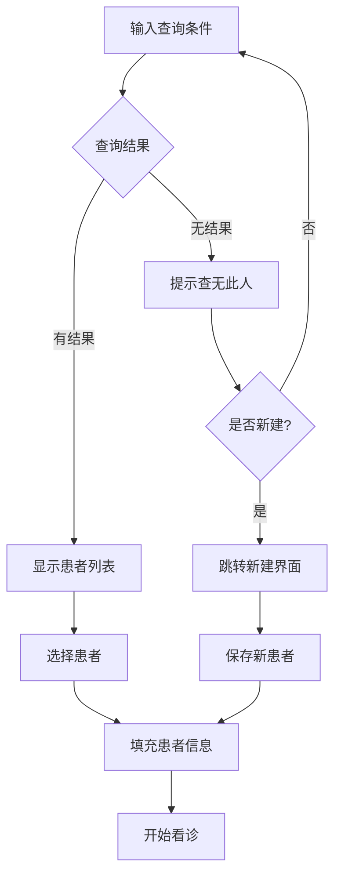
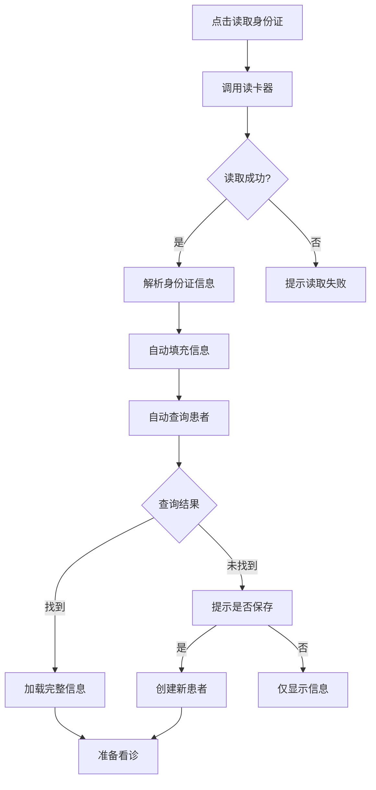

# 患者接待流程设计规范

## 一、功能概述

### 1.1 设计目标
- 快速查找已有患者
- 便捷创建新患者档案
- 支持身份证读卡器快速录入
- 自动识别新老患者

## 二、界面布局设计

### 2.1 患者接待主界面
```
┌──────────────────────────────────────────────────────────┐
│                     患者接待                              │
├──────────────────────────────────────────────────────────┤
│ ┌────────────────────────┬─────────────────────────────┐ │
│ │                        │                             │ │
│ │    患者查询区          │      患者信息展示区          │ │
│ │                        │                             │ │
│ │ 搜索：[___________]🔍  │  姓名：[___________]        │ │
│ │       支持：姓名/拼音   │  性别：[男 ○ 女 ○]         │ │
│ │       电话/身份证号     │  年龄：[___] 岁            │ │
│ │                        │  电话：[___________]        │ │
│ │ [读取身份证] [新建]    │  身份证：[_________________] │ │
│ │                        │  地址：[_________________]  │ │
│ │ ─────────────────────  │  过敏史：[_______________]  │ │
│ │                        │                             │ │
│ │   查询结果列表         │  最近就诊：                  │ │
│ │ ┌──────────────────┐  │  2025-01-05 风寒感冒        │ │
│ │ │ 张三 男 35岁      │  │  2024-12-20 脾胃虚寒        │ │
│ │ │ 138****1234       │  │  2024-11-15 慢性胃炎        │ │
│ │ │ [选择]            │  │                             │ │
│ │ └──────────────────┘  │  [保存患者信息] [开始看诊]   │ │
│ │ ┌──────────────────┐  │                             │ │
│ │ │ 张三丰 男 68岁    │  │                             │ │
│ │ │ 139****5678       │  │                             │ │
│ │ │ [选择]            │  │                             │ │
│ │ └──────────────────┘  │                             │ │
│ └────────────────────────┴─────────────────────────────┘ │
└──────────────────────────────────────────────────────────┘
```

## 三、交互流程设计

### 3.1 患者查询流程



### 3.2 身份证读卡流程



## 四、详细功能设计

### 4.1 查询功能

#### 支持的查询方式
- **姓名查询**：精确或模糊匹配
- **拼音查询**：输入拼音首字母（如"zs"找"张三"）
- **电话查询**：输入手机号后4位即可
- **身份证查询**：输入后6位即可
- **组合查询**：自动识别输入类型

#### 查询优化
- **实时搜索**：输入2个字符后自动搜索
- **智能排序**：最近就诊的患者优先
- **快捷键**：
  - `Enter`：选择第一个结果
  - `↑↓`：在结果列表中导航
  - `F2`：新建患者
  - `F3`：读取身份证

### 4.2 身份证读卡器集成

#### 读取的信息
```csharp
public class IDCardInfo
{
    public string Name { get; set; }          // 姓名
    public string Gender { get; set; }        // 性别
    public string Nation { get; set; }        // 民族
    public DateTime BirthDate { get; set; }   // 出生日期
    public int Age => CalculateAge();         // 自动计算年龄
    public string IDNumber { get; set; }      // 身份证号
    public string Address { get; set; }       // 住址
    public string IssuingAuthority { get; set; } // 签发机关
    public DateTime ValidFrom { get; set; }   // 有效期起始
    public DateTime ValidTo { get; set; }     // 有效期结束
    public byte[] Photo { get; set; }         // 照片
}
```

#### 自动处理逻辑
1. **读取成功后**：
   - 自动填充患者信息表单
   - 自动执行患者查询
   - 显示查询结果或新建提示

2. **匹配规则**：
   - 优先按身份证号匹配
   - 其次按姓名+出生日期匹配
   - 支持身份证号变更的情况

### 4.3 新建患者

#### 触发方式
1. **主动新建**：点击"新建"按钮
2. **查无结果**：查询无结果时提示新建
3. **身份证新建**：读卡后无匹配时提示

#### 新建界面
```
┌────────────────────────────────────┐
│        新建患者档案                 │
├────────────────────────────────────┤
│ 基本信息（*为必填）                 │
│                                    │
│ *姓名：[___________]               │
│ *性别：[●男 ○女]                   │
│ *年龄：[___] 岁  生日：[____-__-__]│
│ *电话：[___________]               │
│  身份证：[_____________________]   │
│  地址：[_______________________]   │
│                                    │
│ 医疗信息                           │
│  过敏史：[_____________________]   │
│  既往史：[_____________________]   │
│  备注：[_______________________]   │
│                                    │
│ [保存并看诊] [仅保存] [取消]        │
└────────────────────────────────────┘
```

### 4.4 患者信息展示

#### 展示内容
- **基本信息**：姓名、性别、年龄、联系方式
- **医疗信息**：过敏史、既往史
- **就诊历史**：最近5次就诊记录
- **统计信息**：总就诊次数、最后就诊时间

#### 信息更新
- **实时编辑**：可直接在展示区编辑
- **自动保存**：失焦后自动保存
- **变更提示**：信息有变更时标记

## 五、异常处理

### 5.1 查询异常
| 异常情况 | 处理方式 |
|---------|---------|
| 网络超时 | 提示"查询超时，请重试" |
| 无结果 | 提示"查无此人，是否新建患者档案？" |
| 多个结果 | 显示列表供选择 |

### 5.2 读卡异常
| 异常情况 | 处理方式 |
|---------|---------|
| 未检测到读卡器 | 提示"未检测到身份证读卡器" |
| 读取失败 | 提示"读取失败，请重新放置身份证" |
| 身份证过期 | 警告"身份证已过期"但允许继续 |

### 5.3 数据异常
| 异常情况 | 处理方式 |
|---------|---------|
| 必填项为空 | 红框提示，阻止保存 |
| 手机号格式错误 | 提示"请输入正确的手机号" |
| 身份证号重复 | 提示"该身份证号已存在" |

## 六、快捷操作设计

### 6.1 常用患者
- 显示最近接诊的10个患者
- 一键选择，快速开始

### 6.2 快速录入
- 支持扫码枪输入
- 支持语音输入（预留）
- 支持批量导入

### 6.3 模板功能
- 快速填充常见信息
- 复制相似患者信息

## 七、权限控制

### 7.1 查看权限
- 医生：可查看所有患者基本信息
- 管理员：可查看所有信息

### 7.2 编辑权限
- 医生：可编辑基本信息和医疗信息
- 管理员：可编辑所有信息

### 7.3 删除权限
- 医生：不可删除
- 管理员：可标记删除（软删除）

## 八、性能要求

### 8.1 响应时间
- 查询响应：< 500ms
- 读卡识别：< 2秒
- 保存操作：< 1秒

### 8.2 并发处理
- 支持多窗口查询
- 防止重复创建
- 数据同步更新

## 九、数据安全

### 9.1 隐私保护
- 身份证号中间位数脱敏显示
- 手机号中间4位脱敏
- 敏感信息加密存储

### 9.2 操作审计
- 记录所有查询操作
- 记录信息修改历史
- 记录身份证读取日志

---

**文档版本**: 1.0
**创建日期**: 2025-01-08
**最后更新**: 2025-01-08
**状态**: 已确认