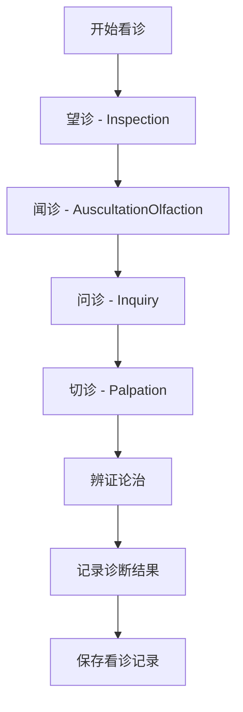

# Consultation Module 前端项目文档

## 项目概览

**项目名称**: LYBT.Desktop.Consultation  
**项目类型**: 前端业务模块  
**技术框架**: WPF + Prism.DryIoc + MVVM  
**业务领域**: 看诊诊断管理（中医四诊数据记录）  
**更新时间**: 2025-01-01

## 业务定位

### 核心功能
Consultation模块专注于看诊诊断数据的记录和管理，实现中医四诊流程的数字化：

1. **看诊记录管理**: 创建、编辑、查看、删除看诊诊断记录
2. **中医四诊**: 望诊、闻诊、问诊、切诊的完整数据记录
3. **诊断数据存储**: 症状分析、辨证论治、治疗方案记录
4. **历史查询**: 患者历史看诊记录查询和诊断追踪
5. **数据关联**: 与MedicalCase模块1:1关联，不涉及流程控制

### 架构角色
- **纯数据记录层**: 专注诊断数据存储，不涉及业务流程管理
- **四诊数字化**: 将传统中医四诊方法标准化记录
- **诊断专业化**: 提供专业的中医诊断数据管理功能
- **关联数据模块**: 与医疗案例紧密配合，提供诊断数据支持

## 技术架构

### 核心依赖
```xml
<PackageReference Include="Prism.DryIoc" Version="9.0.537" />
<PackageReference Include="Microsoft.Extensions.Logging" Version="8.0.1" />
<PackageReference Include="AutoMapper" Version="15.0.1" />
<PackageReference Include="Refit" Version="7.2.22" />
```

### 项目引用
- `LYBT.Desktop.Core` - 基础控件和基类
- `LYBT.Desktop.Infrastructure` - 基础设施服务
- `LYBT.Desktop.Services` - API服务和通用服务
- `LYBT.Shared.Models` - 共享数据模型
- `LYBT.Shared.Interfaces` - 共享接口定义

## 模块注册与服务

### 模块注册类
```csharp
public class ConsultationModule : IModule
{
    public void OnInitialized(IContainerProvider containerProvider)
    {
        // 模块初始化完成后，配置ViewModelLocator
        ViewModelLocationProvider.Register<ConsultationMainView, ConsultationMainViewModel>();
    }

    public void RegisterTypes(IContainerRegistry containerRegistry)
    {
        // UltraThink模块自治：注册业务服务接口实现
        containerRegistry.RegisterSingleton<Services.ConsultationModule>();
        containerRegistry.RegisterSingleton<IConsultationService>(container => 
            container.Resolve<Services.ConsultationModule>());

        // 注册简化后的视图模型
        containerRegistry.Register<ConsultationMainViewModel>();
        containerRegistry.Register<ConsultationManagementViewModel>();

        // 注册视图导航
        containerRegistry.RegisterForNavigation<ConsultationMainView>();
        containerRegistry.RegisterForNavigation<ConsultationManagementView, ConsultationManagementViewModel>();
    }
}
```

### 核心服务实现

#### ConsultationModule Service
```csharp
public class ConsultationModule : IConsultationService
{
    #region 依赖服务
    private readonly IConsultationApi _consultationApi;
    private readonly ILogger<ConsultationModule> _logger;
    #endregion

    #region 基本CRUD操作
    public async Task<ServiceResult<PagedResult<ConsultationDto>>> GetPagedAsync(PagedQueryBaseDto query);
    public async Task<ServiceResult<ConsultationDetailDto>> GetByIdAsync(Guid id);
    public async Task<ServiceResult<ConsultationDto>> StartAsync(ConsultationStartDto createDto);
    public async Task<ServiceResult<ConsultationDto>> UpdateAsync(Guid id, ConsultationDetailDto updateDto);
    public async Task<ServiceResult<bool>> DeleteAsync(Guid id);
    public async Task<ServiceResult<List<ConsultationDto>>> SearchAsync(string keyword);
    #endregion

    #region 关联查询
    public async Task<ServiceResult<List<ConsultationDto>>> GetPatientHistoryAsync(Guid patientId);
    public async Task<ServiceResult<List<ConsultationDto>>> GetByPatientIdAsync(Guid patientId);
    public async Task<ServiceResult<List<ConsultationDto>>> GetByMedicalCaseIdAsync(Guid medicalCaseId);
    public async Task<ServiceResult<List<ConsultationDto>>> GetByDoctorIdAsync(Guid doctorId);
    #endregion

    #region 诊断管理
    public async Task<ServiceResult> UpdateDiagnosisAsync(Guid consultationId, ConsultationUpdateDto diagnosisData);
    public async Task<ServiceResult<bool>> CompleteConsultationAsync(Guid id, ConsultationCompleteDto dto);
    public async Task<ServiceResult<bool>> CancelConsultationAsync(Guid id, string reason);
    #endregion

    #region 中医四诊
    public async Task<ServiceResult<object>> GetFourDiagnosisByMedicalCaseIdAsync(Guid medicalCaseId);
    public async Task<ServiceResult<bool>> SaveFourDiagnosisAsync(Guid consultationId, object fourDiagnosisData);
    #endregion

    #region 统计分析
    public async Task<ServiceResult<object>> GetStatisticsAsync(DateTime? startDate, DateTime? endDate);
    #endregion

    #region 批量操作
    public async Task<ServiceResult> BatchDeleteAsync(List<Guid> ids);
    public Task<ServiceResult<bool>> CanDeleteAsync(Guid id);
    public Task<ServiceResult<bool>> CanModifyAsync(Guid id);
    #endregion
}
```

## MVVM实现

### ViewModel层

#### ConsultationMainViewModel
```csharp
public class ConsultationMainViewModel : BindableBase, INavigationAware
{
    // 看诊主界面视图模型
    // 包含四诊录入、诊断记录、症状分析等功能
}
```

#### ConsultationManagementViewModel
```csharp
public class ConsultationManagementViewModel : BindableBase, INavigationAware
{
    // 看诊管理视图模型
    // 提供看诊记录列表、搜索、筛选等管理功能
}
```

### View层

#### ConsultationMainView.xaml
- 看诊主界面
- 中医四诊数据录入界面
- 诊断结果记录和展示

#### ConsultationManagementView.xaml
- 看诊记录管理界面
- 历史看诊记录查询
- 诊断数据统计分析

## 业务流程

### 中医四诊流程


### 典型业务场景
1. **创建看诊记录**: 选择患者和医生 → 开始新的看诊记录
2. **四诊数据录入**: 按顺序记录望、闻、问、切诊的观察结果
3. **诊断分析**: 基于四诊数据进行辨证论治
4. **记录保存**: 完成诊断后保存完整的看诊记录
5. **历史查询**: 查看患者历史看诊记录和诊断追踪

## 数据模型

### 核心DTO

#### ConsultationDto
```csharp
public class ConsultationDto
{
    public Guid Id { get; set; }
    public Guid MedicalCaseId { get; set; }
    public Guid PatientId { get; set; }
    public Guid UserId { get; set; }  // DoctorId
    public DateTime ConsultationTime { get; set; }
    public string ChiefComplaint { get; set; }
    public string Inspection { get; set; }        // 望诊
    public string Auscultation { get; set; }      // 闻诊
    public string Inquiry { get; set; }           // 问诊
    public string Palpation { get; set; }         // 切诊
    public string Diagnosis { get; set; }         // 诊断结果
    public string Remark { get; set; }
    public CommonStatus Status { get; set; }
    public DateTime CreateTime { get; set; }
    public DateTime? UpdateTime { get; set; }
}
```

#### ConsultationStartDto
```csharp
public class ConsultationStartDto
{
    public Guid PatientId { get; set; }
    public Guid DoctorId { get; set; }
    public Guid MedicalCaseId { get; set; }
    public string ChiefComplaint { get; set; }
    public DateTime ConsultationTime { get; set; }
}
```

#### ConsultationDetailDto
```csharp
public class ConsultationDetailDto : ConsultationDto
{
    public string PatientName { get; set; }
    public string DoctorName { get; set; }
    public string AuscultationOlfaction { get; set; }  // 完整的闻诊记录
    public object FourDiagnosisDetails { get; set; }   // 详细的四诊数据
}
```

#### ConsultationUpdateDto
```csharp
public class ConsultationUpdateDto
{
    public Guid Id { get; set; }
    public Guid PatientId { get; set; }
    public Guid DoctorId { get; set; }
    public string ChiefComplaint { get; set; }
    public string Inspection { get; set; }
    public string AuscultationOlfaction { get; set; }
    public string Inquiry { get; set; }
    public string Palpation { get; set; }
    public string Diagnosis { get; set; }
    public string Remark { get; set; }
}
```

#### ConsultationCompleteDto
```csharp
public class ConsultationCompleteDto
{
    public string FinalDiagnosis { get; set; }
    public string TreatmentPlan { get; set; }
    public string CompletionNotes { get; set; }
}
```

## API集成

### Refit API接口
```csharp
public interface IConsultationApi
{
    [Get("/api/v1/consultations")]
    Task<ApiResponse<PagedResult<ConsultationDto>>> GetConsultationsAsync(
        [Query] int page,
        [Query] int pageSize,
        [Query] string keyword = null);
    
    [Get("/api/v1/consultations/{id}")]
    Task<ApiResponse<ConsultationDetailDto>> GetByIdAsync(Guid id);
    
    [Post("/api/v1/consultations/start")]
    Task<ApiResponse<ConsultationStartResultDto>> StartConsultationAsync([Body] ConsultationStartDto startDto);
    
    [Put("/api/v1/consultations/{id}")]
    Task<ApiResponse<ConsultationUpdateResultDto>> UpdateConsultationAsync(Guid id, [Body] ConsultationUpdateDto updateDto);
    
    [Delete("/api/v1/consultations/{id}")]
    Task<ApiResponse<bool>> DeleteAsync(Guid id);
    
    [Post("/api/v1/consultations/{id}/complete")]
    Task<ApiResponse<bool>> CompleteConsultationAsync(Guid id, [Body] ConsultationCompleteDto completeDto);
    
    [Post("/api/v1/consultations/{id}/cancel")]
    Task<ApiResponse<bool>> CancelConsultationAsync(Guid id, [Body] string reason);
    
    [Get("/api/v1/consultations/statistics")]
    Task<ApiResponse<object>> GetStatisticsAsync([Query] DateTime? startDate, [Query] DateTime? endDate);
}
```

### 数据转换处理
```csharp
// API返回数据到DTO的转换示例
var consultationDto = new ConsultationDto
{
    Id = apiResult.Content.Id,
    MedicalCaseId = apiResult.Content.MedicalCaseId,
    PatientId = apiResult.Content.PatientId,
    UserId = apiResult.Content.DoctorId,
    ConsultationTime = apiResult.Content.ConsultationTime,
    ChiefComplaint = apiResult.Content.ChiefComplaint,
    Inspection = apiResult.Content.Inspection,
    Auscultation = apiResult.Content.AuscultationOlfaction,
    Inquiry = apiResult.Content.Inquiry,
    Palpation = apiResult.Content.Palpation,
    Diagnosis = apiResult.Content.Diagnosis,
    Remark = apiResult.Content.Remark,
    Status = (CommonStatus)(int)apiResult.Content.Status,
    CreateTime = apiResult.Content.CreateTime,
    UpdateTime = apiResult.Content.UpdateTime
};
```

## 测试支持

### 单元测试结构
```
tests/
├── ConsultationModuleTests.cs              # 服务层测试
├── ViewModels/
│   ├── ConsultationMainViewModelTests.cs
│   └── ConsultationManagementViewModelTests.cs
└── Mock/
    ├── MockConsultationApi.cs
    └── MockConsultationService.cs
```

### 测试用例示例
```csharp
[Test]
public async Task StartConsultation_ValidInput_ReturnsSuccess()
{
    // Arrange
    var startDto = new ConsultationStartDto
    {
        PatientId = Guid.NewGuid(),
        DoctorId = Guid.NewGuid(),
        MedicalCaseId = Guid.NewGuid(),
        ChiefComplaint = "头痛三日，伴随恶寒",
        ConsultationTime = DateTime.Now
    };

    // Act
    var result = await _consultationModule.StartAsync(startDto);

    // Assert
    Assert.IsTrue(result.IsSuccess);
    Assert.IsNotNull(result.Data);
    Assert.AreEqual(startDto.ChiefComplaint, result.Data.ChiefComplaint);
}

[Test]
public async Task SaveFourDiagnosis_CompleteData_UpdatesRecord()
{
    // Arrange
    var consultationId = Guid.NewGuid();
    var fourDiagnosisData = new
    {
        Inspection = "面色苍白，舌苔白厚",
        Auscultation = "语声低微，呼吸短促", 
        Inquiry = "头痛，恶寒，无汗，脉象沉紧",
        Palpation = "脉象沉紧有力，寸关尺均弱"
    };

    // Act
    var result = await _consultationModule.SaveFourDiagnosisAsync(consultationId, fourDiagnosisData);

    // Assert
    Assert.IsTrue(result.IsSuccess);
    Assert.IsTrue(result.Data);
}
```

## 关键特性

### 1. 中医四诊标准化
- 完整的望、闻、问、切诊数据结构
- 标准化的中医术语和描述格式
- 四诊数据的系统化存储和查询

### 2. 专业化数据管理
- 纯数据记录层，不涉及复杂业务流程
- 专注于诊断数据的准确性和完整性
- 提供灵活的数据查询和统计功能

### 3. 简化的服务架构
- 直接API调用，避免过度设计的业务逻辑
- 轻量级的数据转换和验证
- 高效的CRUD操作实现

### 4. 历史追踪分析
- 患者历史看诊记录完整保存
- 诊断数据的时间序列分析
- 医生个人诊断记录统计

## 性能优化

### 1. 数据缓存
- 常用诊断模板缓存
- 患者近期看诊记录缓存
- 四诊术语词典缓存

### 2. 查询优化
- 分页查询减少数据传输
- 索引优化提升查询速度
- 按需加载详细诊断数据

### 3. 用户体验
- 四诊录入界面优化
- 智能提示和自动补全
- 快速保存和恢复功能

## 集成接口

### 模块间协作
- **与MedicalCase模块**: 1:1关联，提供诊断数据
- **与Patients模块**: 获取患者基本信息
- **与Users模块**: 获取医生信息
- **与Prescriptions模块**: 提供诊断依据支持处方

### 数据流向
```
MedicalCase (1) ←→ (1) Consultation
    ↑                    ↓
Patients              Prescriptions
```

## 开发指南

### 添加新的诊断字段
1. 在`ConsultationDto`和相关DTO中添加新字段
2. 更新API接口定义和数据转换逻辑
3. 修改UI界面支持新字段录入和显示
4. 更新验证规则和业务逻辑

### 扩展四诊功能
1. 在四诊数据结构中添加新的诊断维度
2. 更新`GetFourDiagnosisByMedicalCaseIdAsync`方法
3. 修改`SaveFourDiagnosisAsync`方法支持新数据
4. 设计相应的UI录入界面

### 集成新的分析功能
1. 通过统计API获取诊断数据
2. 实现数据分析和图表展示
3. 提供导出功能支持报告生成

## 维护说明

### 重要配置
- 四诊数据验证规则
- 诊断术语标准字典
- 数据保存和备份策略

### 日志记录
- 关键诊断操作日志
- 数据修改审计记录
- API调用性能日志

### 监控指标
- 看诊记录创建成功率
- 四诊数据完整度统计
- 历史查询响应时间

---

**版本**: v1.0  
**维护**: 开发团队  
**更新**: 2025-01-01