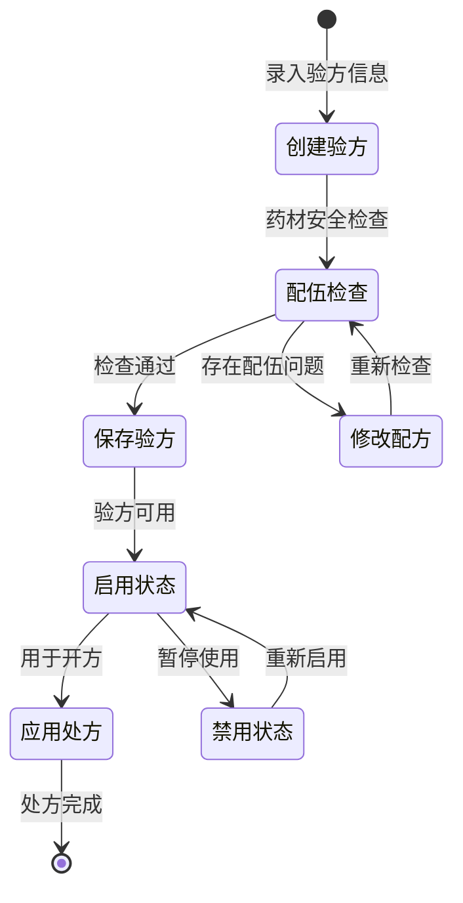

# Formula Module 前端项目文档

## 项目概览

**项目名称**: LYBT.Desktop.Formula  
**项目类型**: 前端业务模块  
**技术框架**: WPF + Prism.DryIoc + MVVM  
**业务领域**: 验方模板管理（经典处方模板库）  
**更新时间**: 2025-01-01

## 业务定位

### 核心功能
Formula模块负责管理中医验方模板，为处方开具提供经典验方参考：

1. **验方模板管理**: 创建、编辑、查看、删除经典验方模板
2. **分类管理**: 按中医科目分类管理验方（内科、外科、妇科等）
3. **模板应用**: 为Prescriptions模块提供验方模板参考
4. **数据导入导出**: 支持批量导入验方数据和模板导出
5. **配伍检查**: 通过FormulaCoordinator进行药材配伍安全检查

### 架构角色
- **模板库**: 存储和管理经典验方模板
- **参考系统**: 为处方开具提供专业参考
- **知识库**: 积累中医临床经验和验证方剂
- **协作支持**: 与Prescriptions和Herbs模块紧密协作

## 技术架构

### 核心依赖
```xml
<PackageReference Include="Prism.DryIoc" Version="9.0.537" />
<PackageReference Include="Microsoft.Extensions.Logging" Version="8.0.1" />
<PackageReference Include="AutoMapper" Version="15.0.1" />
<PackageReference Include="Refit" Version="7.2.22" />
```

### 项目引用
- `LYBT.Desktop.Core` - 基础控件和基类
- `LYBT.Desktop.Infrastructure` - 基础设施服务
- `LYBT.Desktop.Services` - API服务和通用服务
- `LYBT.Shared.Models` - 共享数据模型
- `LYBT.Shared.Interfaces` - 共享接口定义

## 模块注册与服务

### 模块注册类
```csharp
public class FormulaModule : IModule
{
    public void RegisterTypes(IContainerRegistry containerRegistry)
    {
        // UltraThink模块自治：注册业务服务接口实现
        containerRegistry.RegisterSingleton<Services.FormulaModule>();
        containerRegistry.RegisterSingleton<IFormulaService>(container => 
            container.Resolve<Services.FormulaModule>());
        
        // 注册业务协调器
        containerRegistry.RegisterSingleton<FormulaCoordinator>();
        
        // UltraThink四层架构：注册标准ViewModel
        containerRegistry.RegisterForNavigation<FormulaManagementView, FormulaManagementViewModel>();
        containerRegistry.RegisterForNavigation<FormulaDetailView, FormulaDetailViewModel>();

        // 注册对话框
        RegisterDialogs(containerRegistry);
    }
}
```

### 核心服务实现

#### FormulaModule Service
```csharp
public class FormulaModule : IFormulaService
{
    #region 依赖服务
    private readonly IFormulaApi _apiService;
    private readonly IMapper _mapper;
    #endregion

    #region 基础CRUD操作
    public async Task<ServiceResult<PagedResult<FormulaDto>>> GetPagedAsync(FormulaQueryDto query);
    public async Task<ServiceResult<FormulaDto>> GetByIdAsync(Guid id);
    public async Task<ServiceResult<FormulaDto>> CreateAsync(FormulaCreateDto createDto);
    public async Task<ServiceResult<FormulaDto>> UpdateAsync(Guid id, FormulaUpdateDto updateDto);
    public async Task<ServiceResult<bool>> DeleteAsync(Guid id);
    #endregion

    #region 业务特定操作
    public async Task<ServiceResult<PagedResult<FormulaDto>>> SearchFormulasAsync(PagedQueryBaseDto request);
    public async Task<ServiceResult<List<string>>> GetCategoriesAsync();
    public async Task<ServiceResult<IEnumerable<FormulaDto>>> GetByCategoryAsync(string category);
    public async Task<ServiceResult<List<FormulaDto>>> GetTemplatesAsync();
    public async Task<ServiceResult<List<FormulaDto>>> GetByTypeAsync(string formulaType);
    public async Task<ServiceResult<List<FormulaDto>>> GetFormulasAsync(string? keyword = null, string? category = null);
    #endregion

    #region 状态管理
    public async Task<ServiceResult> EnableAsync(Guid id);
    public async Task<ServiceResult> DisableAsync(Guid id);
    public async Task<ServiceResult<bool>> ToggleStatusAsync(Guid id);
    #endregion

    #region 数据导入导出功能
    public async Task<ServiceResult<int>> ImportFormulasAsync(List<FormulaImportDto> formulas);
    public async Task<ServiceResult<List<FormulaDto>>> ExportFormulasAsync();
    public async Task<ServiceResult<byte[]>> GetImportTemplateAsync();
    #endregion

    #region 验证功能
    public Task<ServiceResult> ValidateCreateDtoAsync(FormulaCreateDto createDto);
    public Task<ServiceResult> ValidateUpdateDtoAsync(FormulaUpdateDto updateDto);
    #endregion
}
```

#### FormulaCoordinator 业务协调器
```csharp
public class FormulaCoordinator
{
    #region 模板管理
    public async Task<ServiceResult<Guid>> CreateTemplateAsync(FormulaTemplate template);
    public async Task<ServiceResult<bool>> UpdateTemplateAsync(FormulaTemplate template);
    public ServiceResult<FormulaTemplate?> GetTemplate(Guid templateId);
    public ServiceResult<List<FormulaTemplate>> GetTemplatesByCategory(string category);
    #endregion

    #region 药材配伍检查
    public Task<ServiceResult<FormulaCompatibility>> CheckHerbCompatibilityAsync(
        List<FormulaHerb> herbs);
    public Task<ServiceResult<FormulaOptimizationResult>> OptimizeFormulaAsync(
        List<FormulaHerb> herbs, 
        OptimizationCriteria criteria);
    #endregion

    #region 验方应用
    public Task<ServiceResult<AppliedFormula>> ApplyTemplateAsync(
        Guid templateId, 
        Guid patientId, 
        FormulaApplicationContext context);
    #endregion

    #region 事件发布
    public event EventHandler<FormulaTemplateCreatedEventArgs>? TemplateCreated;
    public event EventHandler<FormulaTemplateUpdatedEventArgs>? TemplateUpdated;
    public event EventHandler<HerbCompatibilityCheckedEventArgs>? CompatibilityChecked;
    public event EventHandler<FormulaAppliedEventArgs>? FormulaApplied;
    #endregion
}
```

## MVVM实现

### ViewModel层

#### FormulaManagementViewModel
```csharp
public class FormulaManagementViewModel : BindableBase, INavigationAware
{
    // 验方管理主视图模型
    // 包含验方列表、搜索、分类筛选、状态管理等功能
}
```

#### FormulaDetailViewModel  
```csharp
public class FormulaDetailViewModel : BindableBase, INavigationAware
{
    // 验方详情视图模型
    // 显示验方完整信息和药材组成
}
```

#### AddFormulaDialogViewModel
```csharp
public class AddFormulaDialogViewModel : BindableBase
{
    // 添加验方对话框视图模型
    // 处理新验方创建的表单验证和业务逻辑
}
```

#### EditFormulaDialogViewModel
```csharp
public class EditFormulaDialogViewModel : BindableBase
{
    // 编辑验方对话框视图模型
    // 处理验方修改的表单验证和业务逻辑
}
```

#### ViewFormulaDialogViewModel
```csharp
public class ViewFormulaDialogViewModel : BindableBase
{
    // 查看验方对话框视图模型
    // 只读模式显示验方详细信息
}
```

### View层

#### FormulaManagementView.xaml
- 验方管理主界面
- 包含搜索、分类筛选、列表展示区域
- 支持状态切换和批量操作

#### FormulaDetailView.xaml
- 验方详细信息展示
- 药材组成和用法用量显示
- 验方历史和应用记录

#### AddFormulaDialog.xaml
- 添加验方对话框
- 基本信息录入和药材选择
- 表单验证和错误提示

#### EditFormulaDialog.xaml
- 编辑验方对话框
- 现有验方信息修改
- 版本控制和变更记录

#### ViewFormulaDialog.xaml
- 查看验方对话框
- 只读模式信息展示
- 打印和导出功能

## 业务流程

### 验方管理生命周期


### 典型业务流程
1. **创建验方模板**: 录入基本信息 → 选择药材 → 配伍检查 → 保存模板
2. **验方分类管理**: 按科目分类 → 标签管理 → 检索优化
3. **验方应用**: 处方开具时选择模板 → 个性化调整 → 生成处方
4. **数据维护**: 批量导入 → 数据清理 → 模板导出

## 数据模型

### 核心DTO

#### FormulaDto
```csharp
public class FormulaDto
{
    public Guid Id { get; set; }
    public string Name { get; set; }
    public string Category { get; set; }
    public string Effect { get; set; }
    public string Usage { get; set; }
    public string Remark { get; set; }
    public CommonStatus Status { get; set; }
    public DateTime CreateTime { get; set; }
    public DateTime? UpdateTime { get; set; }
    public List<FormulaHerbDto> Herbs { get; set; }
    public decimal TotalPrice { get; set; }
}
```

#### FormulaCreateDto
```csharp
public class FormulaCreateDto
{
    public string Name { get; set; }
    public string Effect { get; set; }
    public string Usage { get; set; }
    public string Remark { get; set; }
    public List<FormulaHerbCreateDto> Herbs { get; set; }
}
```

#### FormulaQueryDto
```csharp
public class FormulaQueryDto : PagedQueryBaseDto
{
    public string? Category { get; set; }
    public CommonStatus? Status { get; set; }
    public string? Effect { get; set; }
}
```

## API集成

### Refit API接口
```csharp
public interface IFormulaApi
{
    [Get("/api/v1/formulas")]
    Task<ApiResponse<PagedResult<FormulaDto>>> GetPagedFormulasAsync(
        [Query] FormulaQueryDto query);
    
    [Get("/api/v1/formulas/{id}")]
    Task<ApiResponse<FormulaDto>> GetFormulaByIdAsync(Guid id);
    
    [Post("/api/v1/formulas")]
    Task<ApiResponse<FormulaDto>> CreateFormulaAsync([Body] FormulaCreateDto createDto);
    
    [Put("/api/v1/formulas/{id}")]
    Task<ApiResponse<FormulaDto>> UpdateFormulaAsync(Guid id, [Body] FormulaUpdateDto updateDto);
    
    [Delete("/api/v1/formulas/{id}/toggle")]
    Task<ApiResponse<bool>> ToggleFormulaStatusAsync(Guid id);
    
    [Get("/api/v1/formulas/categories")]
    Task<ApiResponse<List<string>>> GetCategoriesAsync();
    
    [Post("/api/v1/formulas/import")]
    Task<ApiResponse<FormulaImportResultDto>> ImportFormulasAsync(
        [Body] List<FormulaImportDto> formulas,
        [Body] FormulaImportOptionsDto options);
    
    [Get("/api/v1/formulas/export")]
    Task<ApiResponse<List<FormulaExportDto>>> ExportAllFormulasAsync([Query] bool includePrivate);
    
    [Get("/api/v1/formulas/template")]
    Task<ApiResponse<byte[]>> GetImportTemplateAsync();
}
```

### 数据映射配置
```csharp
public class FormulaMappingProfile : Profile
{
    public FormulaMappingProfile()
    {
        CreateMap<FormulaUpdateDto, FormulaDto>();
        CreateMap<FormulaExportDto, FormulaDto>();
        CreateMap<FormulaImportDto, FormulaCreateDto>();
        // 其他映射配置...
    }
}
```

## 测试支持

### 单元测试结构
```
tests/
├── FormulaModuleTests.cs              # 服务层测试
├── FormulaCoordinatorTests.cs         # 协调器测试
├── ViewModels/
│   ├── FormulaManagementViewModelTests.cs
│   ├── AddFormulaDialogViewModelTests.cs
│   ├── EditFormulaDialogViewModelTests.cs
│   └── FormulaDetailViewModelTests.cs
└── Mock/
    ├── MockFormulaApi.cs
    └── MockFormulaService.cs
```

### 测试用例示例
```csharp
[Test]
public async Task CreateFormulaAsync_ValidInput_ReturnsSuccess()
{
    // Arrange
    var createDto = new FormulaCreateDto
    {
        Name = "小柴胡汤",
        Effect = "和解少阳",
        Usage = "水煎服",
        Remark = "经典少阳病方"
    };

    // Act
    var result = await _formulaModule.CreateAsync(createDto);

    // Assert
    Assert.IsTrue(result.IsSuccess);
    Assert.IsNotNull(result.Data);
    Assert.AreEqual(createDto.Name, result.Data.Name);
}
```

## 关键特性

### 1. 验方模板库
- 经典验方收录和分类管理
- 按中医科目和病症分类
- 支持个人验方和共享验方

### 2. 配伍安全检查
- 十八反十九畏配伍检查
- 药材重复和剂量冲突检验
- 智能配伍建议和优化

### 3. 模板应用系统
- 验方模板一键应用到处方
- 根据患者情况个性化调整
- 历史应用记录和效果跟踪

### 4. 数据管理功能
- 批量导入验方数据
- 模板导出和备份
- 数据清理和维护工具

## 性能优化

### 1. 模板缓存
- 常用验方模板内存缓存
- 分类索引快速检索
- 按需加载详细信息

### 2. 搜索优化
- 多字段组合搜索
- 关键词高亮显示
- 搜索历史和智能提示

### 3. 异步处理
- 所有API调用异步化
- 批量操作进度提示
- 后台数据同步

## 集成接口

### 模块间协作
- **与Prescriptions模块**: 提供验方模板选择
- **与Herbs模块**: 获取药材信息和价格
- **与Users模块**: 获取医生信息和权限
- **与Patients模块**: 获取患者信息用于个性化

### 事件发布/订阅
- `FormulaTemplateCreated`: 验方模板创建事件
- `FormulaTemplateUpdated`: 模板更新事件
- `CompatibilityChecked`: 配伍检查完成事件
- `FormulaApplied`: 验方应用事件

## 开发指南

### 添加新验方分类
1. 在`GetCategoriesAsync()`方法中添加新分类
2. 更新分类缓存逻辑
3. 修改UI分类筛选器
4. 测试分类功能完整性

### 扩展配伍检查规则
1. 在`FormulaCoordinator`中添加新检查方法
2. 更新`CheckHerbCompatibilityAsync`方法
3. 增加新的配伍问题类型
4. 测试配伍检查准确性

### 集成新的验方来源
1. 扩展`FormulaImportDto`支持新格式
2. 实现对应的导入解析逻辑
3. 添加数据验证和清理
4. 提供导入向导界面

## 维护说明

### 重要配置
- 验方分类配置
- 配伍检查规则配置
- 导入导出格式配置

### 日志记录
- 验方模板操作日志
- 配伍检查结果日志
- 数据导入导出日志

### 监控指标
- 验方模板使用频率
- 配伍检查准确率
- 导入导出成功率

---

**版本**: v1.0  
**维护**: 开发团队  
**更新**: 2025-01-01