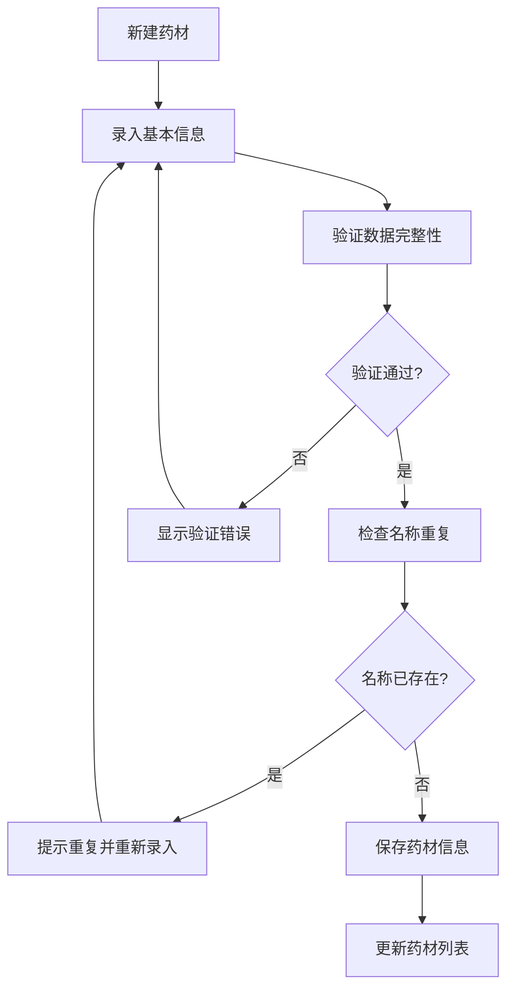

# Herbs Module 前端项目文档

## 项目概览

**项目名称**: LYBT.Desktop.Herbs  
**项目类型**: 前端业务模块  
**技术框架**: WPF + Prism.DryIoc + MVVM  
**业务领域**: 中药材管理（处方用药选择，不含库存）  
**更新时间**: 2025-01-01

## 业务定位

### 核心功能
Herbs模块专注于中药材基础信息的管理和维护，为处方开具提供药材选择支持：

1. **药材管理**: 创建、编辑、查看、删除中药材记录
2. **药材信息**: 名称、单价、用法信息维护
3. **仅处方用药**: 不涉及库存管理，专注处方选择
4. **标准化管理**: 统一药材标准和规格
5. **数据导入导出**: 支持批量药材数据管理
6. **价格管理**: 药材单价更新和历史记录

### 架构角色
- **基础数据管理**: 为其他模块提供药材基础信息支持
- **处方支撑**: 专门为Prescriptions模块提供药材选择数据
- **标准化**: 统一药材名称、规格、用法等标准信息
- **简化设计**: 不涉及复杂的库存和批次管理

## 技术架构

### 核心依赖
```xml
<PackageReference Include="Prism.DryIoc" Version="9.0.537" />
<PackageReference Include="Microsoft.Extensions.Logging" Version="8.0.1" />
<PackageReference Include="AutoMapper" Version="15.0.1" />
<PackageReference Include="Refit" Version="7.2.22" />
```

### 项目引用
- `LYBT.Desktop.Core` - 基础控件和基类
- `LYBT.Desktop.Infrastructure` - 基础设施服务
- `LYBT.Desktop.Services` - API服务和通用服务
- `LYBT.Shared.Models` - 共享数据模型
- `LYBT.Shared.Interfaces` - 共享接口定义

## 模块注册与服务

### 模块注册类
```csharp
public class HerbsModule : IModule
{
    public void RegisterTypes(IContainerRegistry containerRegistry)
    {
        // UltraThink模块自治：注册业务服务接口实现
        containerRegistry.RegisterSingleton<HerbModule>();
        containerRegistry.RegisterSingleton<IHerbService>(container => 
            container.Resolve<HerbModule>());
        
        // UltraThink四层架构：注册标准ViewModel
        containerRegistry.RegisterForNavigation<HerbManagementView, HerbManagementViewModel>();
        containerRegistry.RegisterForNavigation<HerbAddEditDialog, HerbAddEditDialogViewModel>();
        containerRegistry.RegisterForNavigation<HerbDetailView, HerbDetailViewModel>();
    }
}
```

### 核心服务实现

#### HerbModule Service
```csharp
public class HerbModule : IHerbService
{
    private readonly IHerbApi _apiService;
    private readonly IMapper _mapper;

    #region 基础CRUD操作
    public async Task<ServiceResult<PagedResult<HerbDto>>> GetPagedAsync(HerbPagedQueryDto query);
    public async Task<ServiceResult<HerbDto>> GetByIdAsync(Guid id);
    public async Task<ServiceResult<HerbDto>> CreateAsync(HerbCreateDto createDto);
    public async Task<ServiceResult<HerbDto>> UpdateAsync(Guid id, HerbUpdateDto updateDto);
    public async Task<ServiceResult<bool>> DeleteAsync(Guid id);
    #endregion

    #region 业务特定操作
    public async Task<ServiceResult<PagedResult<HerbDto>>> SearchHerbsAsync(HerbPagedQueryDto request);
    public async Task<ServiceResult<HerbDto>> GetByNameAsync(string name);
    public Task<ServiceResult> ValidateCreateDtoAsync(HerbCreateDto createDto);
    public Task<ServiceResult> ValidateUpdateDtoAsync(HerbUpdateDto updateDto);
    public async Task<ServiceResult<bool>> IsNameExistsAsync(string name, Guid? excludeId = null);
    #endregion

    #region 状态管理
    public async Task<ServiceResult> EnableAsync(Guid id);
    public async Task<ServiceResult> DisableAsync(Guid id);
    #endregion

    #region 基础数据导入导出功能
    public async Task<ServiceResult<int>> ImportHerbsAsync(List<HerbImportDto> herbs);
    public async Task<ServiceResult<List<HerbDto>>> ExportHerbsAsync();
    public async Task<ServiceResult<byte[]>> GetImportTemplateAsync();
    #endregion

    #region 扩展查询功能
    public async Task<ServiceResult<List<HerbDto>>> GetAllAsync();
    public async Task<ServiceResult<List<HerbDto>>> GetByIdsAsync(List<Guid> ids);
    public async Task<ServiceResult<bool>> UpdatePriceAsync(Guid id, HerbPriceUpdateDto dto);
    public async Task<ServiceResult<List<HerbDto>>> SearchAsync(string keyword);
    public async Task<ServiceResult<List<HerbDto>>> GetAvailableHerbsAsync();
    public async Task<ServiceResult<Dictionary<int, int>>> GetStatisticsAsync();
    public async Task<ServiceResult<List<HerbDto>>> SearchByNameAsync(string name);
    #endregion
}
```

### 辅助组件

#### HerbCoordinator 药材协调器
```csharp
public class HerbCoordinator
{
    // 复杂业务流程协调
    public async Task<ServiceResult<HerbDto>> CreateHerbWithValidationAsync(
        HerbCreationContext context);
    
    // 批量操作协调
    public async Task<ServiceResult<BatchOperationResult>> ProcessBatchImportAsync(
        List<HerbImportDto> herbs);
    
    // 价格更新协调
    public async Task<ServiceResult<bool>> UpdatePriceWithHistoryAsync(
        Guid herbId, 
        decimal newPrice, 
        string reason);
}
```

## MVVM实现

### ViewModel层

#### HerbManagementViewModel
```csharp
public class HerbManagementViewModel : BindableBase, INavigationAware
{
    // 药材管理主视图模型
    // 包含药材列表、搜索、筛选、状态管理等功能
}
```

#### HerbAddEditDialogViewModel
```csharp
public class HerbAddEditDialogViewModel : BindableBase
{
    // 药材添加编辑对话框视图模型
    // 处理药材信息录入和编辑的表单验证
}
```

#### HerbDetailViewModel
```csharp
public class HerbDetailViewModel : BindableBase, INavigationAware
{
    // 药材详情视图模型
    // 显示药材完整信息和历史记录
}
```

### View层

#### HerbManagementView.xaml
- 药材管理主界面
- 包含搜索、筛选、列表展示区域
- 支持状态切换和批量操作

#### HerbAddEditDialog.xaml
- 药材添加编辑对话框
- 包含药材基本信息录入表单
- 数据验证和错误提示功能

#### HerbDetailView.xaml
- 药材详细信息展示
- 显示药材完整属性和使用历史
- 支持快速编辑和状态管理

## 业务流程

### 药材管理流程


### 典型业务场景
1. **新增药材**: 录入药材信息 → 数据验证 → 名称重复检查 → 保存药材
2. **编辑药材**: 选择药材 → 修改信息 → 验证更新 → 保存变更
3. **导入药材**: 选择导入文件 → 数据验证 → 批量创建 → 结果反馈
4. **价格更新**: 选择药材 → 输入新价格 → 更新记录 → 通知相关模块

## 数据模型

### 核心DTO

#### HerbDto
```csharp
public class HerbDto
{
    public Guid Id { get; set; }
    public string Name { get; set; }
    public string PinyinCode { get; set; }
    public decimal Price { get; set; }
    public string Unit { get; set; }
    public string Usage { get; set; }
    public string Properties { get; set; }
    public string Functions { get; set; }
    public string Indications { get; set; }
    public string Contraindications { get; set; }
    public bool IsEnabled { get; set; }
    public CommonStatus Status { get; set; }
    public DateTime CreateTime { get; set; }
    public DateTime? UpdateTime { get; set; }
}
```

#### HerbCreateDto
```csharp
public class HerbCreateDto
{
    public string Name { get; set; }
    public string PinyinCode { get; set; }
    public decimal Price { get; set; }
    public string Unit { get; set; }
    public string Usage { get; set; }
    public string Properties { get; set; }
    public string Functions { get; set; }
    public string Indications { get; set; }
    public string Contraindications { get; set; }
    public string Remark { get; set; }
}
```

#### HerbUpdateDto
```csharp
public class HerbUpdateDto
{
    public Guid Id { get; set; }
    public string Name { get; set; }
    public string PinyinCode { get; set; }
    public decimal Price { get; set; }
    public string Unit { get; set; }
    public string Usage { get; set; }
    public string Properties { get; set; }
    public string Functions { get; set; }
    public string Indications { get; set; }
    public string Contraindications { get; set; }
    public string Remark { get; set; }
}
```

#### HerbPagedQueryDto
```csharp
public class HerbPagedQueryDto
{
    public int PageIndex { get; set; }
    public int PageSize { get; set; }
    public string Keyword { get; set; }
    public string Name { get; set; }
    public string PinyinCode { get; set; }
    public bool? IsEnabled { get; set; }
    public decimal? MinPrice { get; set; }
    public decimal? MaxPrice { get; set; }
}
```

#### HerbImportDto
```csharp
public class HerbImportDto
{
    public string Name { get; set; }
    public string PinyinCode { get; set; }
    public decimal Price { get; set; }
    public string Unit { get; set; }
    public string Usage { get; set; }
    public string Properties { get; set; }
    public string Functions { get; set; }
    public string Remark { get; set; }
}
```

#### HerbPriceUpdateDto
```csharp
public class HerbPriceUpdateDto
{
    public decimal? Price { get; set; }
    public string Reason { get; set; }
    public DateTime EffectiveDate { get; set; }
}
```

## API集成

### Refit API接口
```csharp
public interface IHerbApi
{
    [Get("/api/v1/herbs")]
    Task<ApiResponse<PagedResult<HerbDto>>> GetHerbsAsync(
        [Query] int pageIndex,
        [Query] int pageSize,
        [Query] string keyword = null);
    
    [Get("/api/v1/herbs/{id}")]
    Task<ApiResponse<HerbDetailDto>> GetHerbByIdAsync(Guid id);
    
    [Post("/api/v1/herbs")]
    Task<ApiResponse<HerbDto>> CreateHerbAsync([Body] HerbCreateDto createDto);
    
    [Put("/api/v1/herbs/{id}")]
    Task<ApiResponse<HerbDto>> UpdateHerbAsync(Guid id, [Body] HerbUpdateDto updateDto);
    
    [Post("/api/v1/herbs/{id}/toggle-status")]
    Task<ApiResponse<bool>> ToggleStatusAsync(Guid id);
    
    [Post("/api/v1/herbs/import")]
    Task<ApiResponse<int>> ImportHerbsAsync([Body] List<HerbImportDto> herbs);
    
    [Get("/api/v1/herbs/export")]
    Task<ApiResponse<List<HerbDetailDto>>> ExportHerbsAsync();
    
    [Get("/api/v1/herbs/import-template")]
    Task<ApiResponse<byte[]>> GetImportTemplateAsync();
}
```

### 数据映射配置
```csharp
public class HerbMappingProfile : Profile
{
    public HerbMappingProfile()
    {
        CreateMap<HerbDetailDto, HerbDto>()
            .ForMember(dest => dest.IsEnabled, opt => opt.MapFrom(src => src.Status == CommonStatus.Enabled));
        
        CreateMap<HerbCreateDto, HerbDto>()
            .ForMember(dest => dest.Id, opt => opt.Ignore())
            .ForMember(dest => dest.CreateTime, opt => opt.Ignore())
            .ForMember(dest => dest.UpdateTime, opt => opt.Ignore());
    }
}
```

## 测试支持

### 单元测试结构
```
tests/
├── HerbModuleTests.cs                    # 服务层测试
├── Coordinators/
│   └── HerbCoordinatorTests.cs
├── ViewModels/
│   ├── HerbManagementViewModelTests.cs
│   ├── HerbAddEditDialogViewModelTests.cs
│   └── HerbDetailViewModelTests.cs
└── Mock/
    ├── MockHerbApi.cs
    └── MockHerbService.cs
```

### 测试用例示例
```csharp
[Test]
public async Task CreateHerb_ValidInput_ReturnsSuccess()
{
    // Arrange
    var createDto = new HerbCreateDto
    {
        Name = "当归",
        PinyinCode = "DG",
        Price = 12.50m,
        Unit = "g",
        Usage = "煎服",
        Properties = "甘、辛，温",
        Functions = "补血活血，调经止痛",
        Indications = "血虚萎黄，眩晕心悸",
        Contraindications = "湿阻中焦及大便溏泄者慎服"
    };

    // Act
    var result = await _herbModule.CreateAsync(createDto);

    // Assert
    Assert.IsTrue(result.IsSuccess);
    Assert.IsNotNull(result.Data);
    Assert.AreEqual(createDto.Name, result.Data.Name);
    Assert.AreEqual(createDto.Price, result.Data.Price);
}

[Test]
public async Task CreateHerb_DuplicateName_ReturnsFailure()
{
    // Arrange
    var createDto = new HerbCreateDto
    {
        Name = "当归", // 假设已存在
        Price = 12.50m,
        Unit = "g"
    };

    _mockHerbService.Setup(x => x.IsNameExistsAsync("当归", null))
        .ReturnsAsync(ServiceResult<bool>.Success(true));

    // Act
    var result = await _herbModule.CreateAsync(createDto);

    // Assert
    Assert.IsFalse(result.IsSuccess);
    Assert.AreEqual("该中药材名称已被使用", result.ErrorMessage);
}

[Test]
public async Task ImportHerbs_ValidData_ReturnsSuccessCount()
{
    // Arrange
    var importHerbs = new List<HerbImportDto>
    {
        new HerbImportDto { Name = "人参", Price = 85.00m, Unit = "g" },
        new HerbImportDto { Name = "黄芪", Price = 15.50m, Unit = "g" },
        new HerbImportDto { Name = "白术", Price = 22.00m, Unit = "g" }
    };

    // Act
    var result = await _herbModule.ImportHerbsAsync(importHerbs);

    // Assert
    Assert.IsTrue(result.IsSuccess);
    Assert.AreEqual(3, result.Data);
}
```

## 关键特性

### 1. 标准化药材管理
- 统一的药材信息标准
- 拼音码自动生成和管理
- 标准化的药性、功效描述

### 2. 数据验证和重复检查
- 完整的药材信息验证
- 药材名称重复检查
- 价格合理性验证

### 3. 简化的库存模型
- 不涉及复杂的库存管理
- 专注于基础信息和价格管理
- 适合小型诊所使用场景

### 4. 数据导入导出功能
- Excel模板导入支持
- 批量药材数据管理
- 数据备份和迁移支持

### 5. 灵活的搜索功能
- 多字段模糊搜索
- 拼音码快速检索
- 价格范围筛选

## 性能优化

### 1. 数据缓存
- 常用药材信息缓存
- 搜索结果智能缓存
- 导入模板本地缓存

### 2. 分页和虚拟化
- 大数据量分页显示
- 虚拟化列表控件
- 按需加载详细信息

### 3. 搜索优化
- 拼音码索引优化
- 智能搜索建议
- 结果排序和相关性

## 集成接口

### 模块间协作
- **与Prescriptions模块**: 提供药材选择数据和价格信息
- **与Formula模块**: 为验方提供药材基础信息
- **与Users模块**: 获取操作用户信息
- **系统集成**: 提供药材基础数据支撑

### 事件发布/订阅
- `HerbCreated`: 药材创建事件
- `HerbUpdated`: 药材更新事件
- `HerbPriceChanged`: 价格变更事件
- `HerbStatusChanged`: 状态变更事件

## 开发指南

### 添加新的药材属性
1. 在`HerbDto`和相关DTO中添加新属性
2. 更新数据验证规则和映射配置
3. 修改UI界面支持新属性的录入和显示
4. 更新导入导出模板

### 扩展搜索功能
1. 在`HerbPagedQueryDto`中添加新的查询条件
2. 更新搜索API和服务方法
3. 修改搜索界面添加新的筛选选项
4. 测试新的搜索功能

### 集成新的验证规则
1. 在验证方法中添加新的业务规则
2. 更新错误消息和提示信息
3. 确保前端界面能正确显示验证结果

## 维护说明

### 重要配置
- 药材数据验证规则配置
- 导入导出模板格式配置
- 价格更新策略配置

### 日志记录
- 药材创建和修改操作日志
- 批量导入操作详细记录
- 价格变更审计日志

### 监控指标
- 药材数据完整性统计
- 导入导出成功率
- 搜索性能和使用频率

---

**版本**: v1.0  
**维护**: 开发团队  
**更新**: 2025-01-01