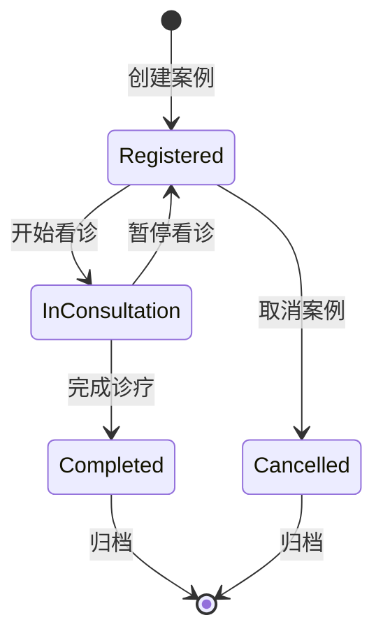

# MedicalCase Module 前端项目文档

## 项目概览

**项目名称**: LYBT.Desktop.MedicalCase  
**项目类型**: 前端业务模块  
**技术框架**: WPF + Prism.DryIoc + MVVM  
**业务领域**: 医疗案例管理（看诊流程聚合根）  
**更新时间**: 2025-01-01

## 业务定位

### 核心功能
MedicalCase模块是诊疗流程的聚合根，负责管理整个看诊会话的生命周期：

1. **医疗案例管理**: 创建、编辑、查看、删除医疗案例记录
2. **状态管理**: 从Registered → InConsultation → Completed的完整状态流转
3. **工作流协调**: 作为看诊流程的容器，与Consultation模块1:1关联
4. **历史跟踪**: 患者历史医疗案例查询和统计
5. **业务协调**: 通过MedicalCaseCoordinator协调复杂业务流程

### 架构角色
- **聚合根模式**: 管理看诊流程的完整生命周期
- **状态机**: 控制医疗案例的状态转换逻辑
- **工作流容器**: 统一管理诊断、处方等相关业务
- **历史管理**: 提供患者医疗案例的历史查询功能

## 技术架构

### 核心依赖
```xml
<PackageReference Include="Prism.DryIoc" Version="9.0.537" />
<PackageReference Include="Microsoft.Extensions.Logging" Version="8.0.1" />
<PackageReference Include="AutoMapper" Version="15.0.1" />
<PackageReference Include="Refit" Version="7.2.22" />
```

### 项目引用
- `LYBT.Desktop.Core` - 基础控件和基类
- `LYBT.Desktop.Infrastructure` - 基础设施服务
- `LYBT.Desktop.Services` - API服务和通用服务
- `LYBT.Shared.Models` - 共享数据模型
- `LYBT.Shared.Interfaces` - 共享接口定义

## 模块注册与服务

### 模块注册类
```csharp
public class MedicalCaseModule : IModule
{
    public void RegisterTypes(IContainerRegistry containerRegistry)
    {
        // UltraThink模块自治：注册业务服务接口实现
        containerRegistry.RegisterSingleton<Services.MedicalCaseModule>();
        containerRegistry.RegisterSingleton<IMedicalCaseService>(container => 
            container.Resolve<Services.MedicalCaseModule>());
        
        // UltraThink四层架构：注册标准ViewModel
        containerRegistry.RegisterForNavigation<MedicalCaseListView, MedicalCaseListViewModel>();
        containerRegistry.RegisterForNavigation<MedicalCaseManagementView, MedicalCaseManagementViewModel>();
        containerRegistry.RegisterForNavigation<MedicalCaseDetailView, MedicalCaseDetailViewModel>();

        // 注册对话框
        RegisterDialogs(containerRegistry);
    }
}
```

### 核心服务实现

#### MedicalCaseModule Service
```csharp
public class MedicalCaseModule : IMedicalCaseService
{
    #region 依赖服务
    private readonly IMedicalCaseApi _medicalCaseApi;
    private readonly IMapper _mapper;
    private readonly ILogger<MedicalCaseModule> _logger;
    #endregion

    #region 基础CRUD操作
    public async Task<ServiceResult<PagedResult<MedicalCaseDto>>> GetPagedAsync(PagedQueryBaseDto query);
    public async Task<ServiceResult<MedicalCaseDetailDto>> GetByIdAsync(Guid id);
    public async Task<ServiceResult<MedicalCaseDto>> CreateAsync(MedicalCaseCreateDto createDto);
    public async Task<ServiceResult<MedicalCaseDto>> UpdateAsync(Guid id, MedicalCaseUpdateDto updateDto);
    public async Task<ServiceResult<bool>> DeleteAsync(Guid id);
    #endregion

    #region 状态管理
    public async Task<ServiceResult<bool>> UpdateStatusAsync(Guid id, int status);
    public async Task<ServiceResult<bool>> CompleteAsync(Guid id, string completionReason);
    public async Task<ServiceResult<bool>> SuspendAsync(Guid id, string reason);
    public async Task<ServiceResult<bool>> ResumeAsync(Guid id);
    public async Task<ServiceResult<bool>> CancelConsultationAsync(Guid id, string reason);
    public async Task<ServiceResult<bool>> ArchiveAsync(Guid id, string archiveReason);
    #endregion

    #region 业务查询
    public async Task<ServiceResult<List<MedicalCaseDto>>> GetByPatientIdAsync(Guid patientId);
    public async Task<ServiceResult<MedicalCaseDto>> GetActiveByPatientIdAsync(Guid patientId);
    public async Task<ServiceResult<List<MedicalCaseDto>>> SearchAsync(string keyword);
    public async Task<ServiceResult<object>> GetStatisticsAsync(DateTime? startDate, DateTime? endDate);
    public async Task<ServiceResult<List<object>>> GetHistoryAsync(Guid id);
    #endregion
}
```

#### MedicalCaseCoordinator 业务协调器
```csharp
public class MedicalCaseCoordinator
{
    #region 工作流管理
    public async Task<ServiceResult<Guid>> CreateMedicalCaseAsync(
        Guid patientId, 
        Guid doctorId, 
        MedicalCaseCreationContext context);
    
    public async Task<ServiceResult<Guid>> AddConsultationRecordAsync(
        Guid caseId, 
        ConsultationRecord record);
    
    public async Task<ServiceResult<Guid>> AddPrescriptionRecordAsync(
        Guid caseId, 
        PrescriptionRecord record);
    #endregion

    #region 状态协调
    public async Task<ServiceResult<bool>> UpdateCaseStatusAsync(
        Guid caseId, 
        MedicalCaseStatus newStatus, 
        string reason = "");
    #endregion

    #region 分析评估
    public Task<ServiceResult<TreatmentEffectivenessAssessment>> EvaluateTreatmentEffectivenessAsync(
        Guid caseId, 
        EffectivenessEvaluationCriteria criteria);
    #endregion

    #region 随访管理
    public async Task<ServiceResult<Guid>> ScheduleFollowUpAsync(
        Guid caseId, 
        FollowUpSchedule schedule);
    
    public Task<ServiceResult<List<FollowUpReminder>>> CheckFollowUpRemindersAsync();
    #endregion

    #region 报告生成
    public Task<ServiceResult<CaseAnalysisReport>> GenerateCaseAnalysisReportAsync(
        Guid caseId, 
        ReportGenerationOptions options);
    #endregion
}
```

## MVVM实现

### ViewModel层

#### MedicalCaseManagementViewModel
```csharp
public class MedicalCaseManagementViewModel : BindableBase, INavigationAware
{
    // 医疗案例管理主视图模型
    // 包含案例列表、搜索、筛选、状态管理等功能
}
```

#### MedicalCaseListViewModel  
```csharp
public class MedicalCaseListViewModel : BindableBase, INavigationAware
{
    // 医疗案例列表视图模型
    // 提供分页列表显示和基本操作
}
```

#### MedicalCaseDetailViewModel
```csharp
public class MedicalCaseDetailViewModel : BindableBase, INavigationAware
{
    // 医疗案例详情视图模型
    // 显示案例完整信息和关联的诊断、处方记录
}
```

#### CreateMedicalCaseViewModel
```csharp
public class CreateMedicalCaseViewModel : BindableBase
{
    // 创建医疗案例对话框视图模型
    // 处理新案例创建的表单验证和业务逻辑
}
```

### View层

#### MedicalCaseManagementView.xaml
- 医疗案例管理主界面
- 包含搜索、筛选、列表展示区域
- 支持状态切换和批量操作

#### MedicalCaseListView.xaml
- 医疗案例列表显示
- 分页导航和排序功能
- 快速操作按钮（编辑、删除、查看详情）

#### MedicalCaseDetailView.xaml
- 医疗案例详细信息展示
- 关联诊断记录和处方历史
- 状态流转和操作历史

#### CreateMedicalCaseDialog.xaml
- 创建医疗案例对话框
- 患者选择和基本信息录入
- 表单验证和错误提示

## 业务流程

### 医疗案例生命周期


### 典型业务流程
1. **创建医疗案例**: 选择患者 → 录入主诉 → 生成案例记录
2. **状态流转**: Registered → InConsultation → Completed
3. **关联业务**: 创建诊断记录 → 开具处方 → 完成治疗
4. **历史查询**: 按患者查询历史案例 → 分析治疗效果

## 数据模型

### 核心DTO

#### MedicalCaseDto
```csharp
public class MedicalCaseDto
{
    public Guid Id { get; set; }
    public Guid PatientId { get; set; }
    public Guid DoctorId { get; set; }
    public string PatientName { get; set; }
    public string DoctorName { get; set; }
    public string ChiefComplaint { get; set; }
    public CommonStatus Status { get; set; }
    public DateTime CreateTime { get; set; }
    public DateTime? UpdateTime { get; set; }
}
```

#### MedicalCaseCreateDto
```csharp
public class MedicalCaseCreateDto
{
    public Guid PatientId { get; set; }
    public Guid DoctorId { get; set; }
    public string ChiefComplaint { get; set; }
    public string DiagnosisSummary { get; set; }
}
```

#### MedicalCaseDetailDto
```csharp
public class MedicalCaseDetailDto : MedicalCaseDto
{
    public string DiagnosisResult { get; set; }
    public string TreatmentPlan { get; set; }
    public List<ConsultationDto> Consultations { get; set; }
    public List<PrescriptionDto> Prescriptions { get; set; }
}
```

## API集成

### Refit API接口
```csharp
public interface IMedicalCaseApi
{
    [Get("/api/v1/medicalcases")]
    Task<ApiResponse<PagedResult<MedicalCaseDto>>> GetPagedAsync(
        [Query] int pageIndex, 
        [Query] int pageSize);
    
    [Get("/api/v1/medicalcases/{id}")]
    Task<ApiResponse<MedicalCaseDetailDto>> GetByIdAsync(Guid id);
    
    [Post("/api/v1/medicalcases")]
    Task<ApiResponse<MedicalCaseDto>> CreateAsync([Body] MedicalCaseCreateDto createDto);
    
    [Put("/api/v1/medicalcases/{id}")]
    Task<ApiResponse<bool>> UpdateAsync(Guid id, [Body] MedicalCaseEditDto editDto);
    
    [Delete("/api/v1/medicalcases/{id}")]
    Task<ApiResponse<bool>> DeleteAsync(Guid id);
    
    [Put("/api/v1/medicalcases/{id}/status")]
    Task<ApiResponse<bool>> UpdateStatusAsync(Guid id, [Body] MedicalCaseStatus status);
}
```

### 数据映射配置
```csharp
public class MedicalCaseMappingProfile : Profile
{
    public MedicalCaseMappingProfile()
    {
        CreateMap<MedicalCaseUpdateDto, MedicalCaseEditDto>();
        CreateMap<MedicalCaseDetailDto, MedicalCaseDto>();
        // 其他映射配置...
    }
}
```

## 测试支持

### 单元测试结构
```
tests/
├── MedicalCaseModuleTests.cs          # 服务层测试
├── MedicalCaseCoordinatorTests.cs     # 协调器测试
├── ViewModels/
│   ├── MedicalCaseManagementViewModelTests.cs
│   ├── MedicalCaseListViewModelTests.cs
│   └── MedicalCaseDetailViewModelTests.cs
└── Mock/
    ├── MockMedicalCaseApi.cs
    └── MockMedicalCaseService.cs
```

### 测试用例示例
```csharp
[Test]
public async Task CreateMedicalCaseAsync_ValidInput_ReturnsSuccess()
{
    // Arrange
    var createDto = new MedicalCaseCreateDto
    {
        PatientId = Guid.NewGuid(),
        DoctorId = Guid.NewGuid(),
        ChiefComplaint = "头痛三天",
        DiagnosisSummary = "初步诊断感冒"
    };

    // Act
    var result = await _medicalCaseModule.CreateAsync(createDto);

    // Assert
    Assert.IsTrue(result.IsSuccess);
    Assert.IsNotNull(result.Data);
    Assert.AreEqual(createDto.ChiefComplaint, result.Data.ChiefComplaint);
}
```

## 关键特性

### 1. 聚合根模式
- 作为看诊流程的聚合根，统一管理相关业务
- 维护业务一致性和完整性约束
- 提供清晰的业务边界

### 2. 状态机管理
- 完整的状态流转控制
- 状态变更的业务规则验证
- 状态历史跟踪和审计

### 3. 工作流协调
- MedicalCaseCoordinator提供复杂业务流程编排
- 事件驱动的业务协调
- 支持异步业务处理

### 4. 历史分析
- 患者历史案例统计分析
- 治疗效果评估和趋势分析
- 随访管理和提醒机制

## 性能优化

### 1. 数据缓存
- 常用案例数据内存缓存
- 患者关联案例缓存策略
- 统计数据定期刷新

### 2. 分页加载
- 大数据量分页显示
- 虚拟化列表控件
- 按需加载详细信息

### 3. 异步处理
- 所有API调用异步化
- 长时间操作进度提示
- 取消操作支持

## 集成接口

### 模块间协作
- **与Patients模块**: 获取患者基本信息
- **与Consultation模块**: 1:1关联诊断记录
- **与Prescriptions模块**: 关联处方记录
- **与Users模块**: 获取医生信息

### 事件发布/订阅
- `MedicalCaseCreated`: 案例创建事件
- `MedicalCaseStatusChanged`: 状态变更事件
- `MedicalCaseCompleted`: 案例完成事件

## 开发指南

### 添加新功能
1. 在`IMedicalCaseService`接口中定义新方法
2. 在`MedicalCaseModule`服务中实现业务逻辑
3. 创建对应的ViewModel处理UI交互
4. 设计XAML界面和用户体验
5. 编写单元测试确保质量

### 扩展状态管理
1. 在`MedicalCaseStatus`枚举中添加新状态
2. 更新状态转换规则和验证逻辑
3. 修改UI状态显示和操作按钮
4. 测试状态流转的完整性

### 集成新的业务模块
1. 通过事件机制实现松耦合集成
2. 使用协调器模式处理复杂业务流程
3. 确保数据一致性和事务边界

## 维护说明

### 重要配置
- 状态转换规则配置
- 工作流模板配置
- 随访提醒策略配置

### 日志记录
- 关键业务操作日志
- 状态变更审计日志
- 错误和异常日志

### 监控指标
- 案例创建成功率
- 平均处理时间
- 状态流转统计

---

**版本**: v1.0  
**维护**: 开发团队  
**更新**: 2025-01-01