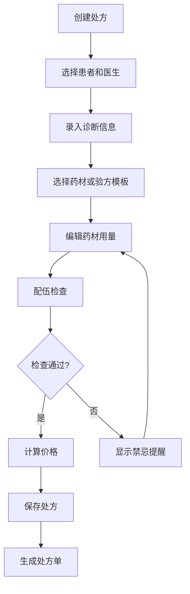

# Prescriptions Module 前端项目文档

## 项目概览

**项目名称**: LYBT.Desktop.Prescriptions  
**项目类型**: 前端业务模块  
**技术框架**: WPF + Prism.DryIoc + MVVM  
**业务领域**: 处方管理（智能配伍，验方组合）  
**更新时间**: 2025-01-01

## 业务定位

### 核心功能
Prescriptions模块专注于中医处方的创建、编辑和管理，提供智能化的处方组成功能：

1. **处方管理**: 创建、编辑、查看、删除中医处方记录
2. **智能配伍**: 中药材配伍禁忌检查和智能推荐
3. **验方组合**: 与Formula模块集成，支持经典验方模板
4. **价格计算**: 自动计算处方总价和单剂价格
5. **处方输出**: 标准格式打印、复制、验证功能
6. **历史管理**: 患者处方历史查询和医案处方记录

### 架构角色
- **数据记录专用**: 专注处方数据存储，不涉及复杂业务流程
- **协作API完整**: 患者处方历史、医案处方记录、高级搜索功能
- **处方输出**: 标准格式打印、复制、验证功能
- **智能化工具**: 提供处方组成的辅助决策支持

## 技术架构

### 核心依赖
```xml
<PackageReference Include="Prism.DryIoc" Version="9.0.537" />
<PackageReference Include="Microsoft.Extensions.Logging" Version="8.0.1" />
<PackageReference Include="AutoMapper" Version="15.0.1" />
<PackageReference Include="Refit" Version="7.2.22" />
```

### 项目引用
- `LYBT.Desktop.Core` - 基础控件和基类
- `LYBT.Desktop.Infrastructure` - 基础设施服务
- `LYBT.Desktop.Services` - API服务和通用服务
- `LYBT.Shared.Models` - 共享数据模型
- `LYBT.Shared.Interfaces` - 共享接口定义

## 模块注册与服务

### 模块注册类
```csharp
public class PrescriptionsModule : IModule
{
    public void RegisterTypes(IContainerRegistry containerRegistry)
    {
        // UltraThink简化架构：注册核心组件和服务
        
        // 核心组件（简化版）
        containerRegistry.RegisterSingleton<PriceCalculator>();
        containerRegistry.RegisterSingleton<BasicValidator>();
        
        // 简化服务
        containerRegistry.RegisterSingleton<IPrescriptionComposerService, PrescriptionComposerService>();
        
        // UltraThink模块自治：注册业务服务接口实现
        containerRegistry.RegisterSingleton<PrescriptionsModule>();
        containerRegistry.RegisterSingleton<IPrescriptionService>(container => 
            container.Resolve<PrescriptionsModule>());
        
        // 主视图：处方组成编辑器（简化版核心）
        containerRegistry.RegisterForNavigation<PrescriptionComposerView, PrescriptionComposerViewModel>();
        
        // 主入口视图（兼容性保持）
        containerRegistry.RegisterForNavigation<PrescriptionsMainView, PrescriptionsMainViewModel>();
        
        // 保留的处方工作流视图（向后兼容）
        containerRegistry.RegisterForNavigation<PrescriptionManagementView, PrescriptionManagementViewModel>();
        
        // 对话框视图（向后兼容）
        containerRegistry.RegisterForNavigation<PrescriptionEditorDialog, PrescriptionEditorDialogViewModel>();
        containerRegistry.RegisterForNavigation<HerbSelectionDialog, HerbSelectionDialogViewModel>();
        containerRegistry.RegisterForNavigation<FormulaTemplateDialog, FormulaTemplateDialogViewModel>();
        containerRegistry.RegisterForNavigation<SelectFormulaDialog, SelectFormulaDialogViewModel>();
    }
}
```

### 核心服务实现

#### PrescriptionsModule Service
```csharp
public class PrescriptionsModule : IPrescriptionService
{
    private readonly IPrescriptionApi _apiService;
    private readonly IMapper _mapper;

    #region 基础CRUD操作
    public async Task<ServiceResult<PagedResult<PrescriptionDto>>> GetPagedAsync(PrescriptionQueryDto query);
    public async Task<ServiceResult<PrescriptionDto>> GetByIdAsync(Guid id);
    public async Task<ServiceResult<PrescriptionDto>> CreateAsync(PrescriptionCreateDto createDto);
    public async Task<ServiceResult<PrescriptionDto>> UpdateAsync(Guid id, PrescriptionEditDto updateDto);
    public async Task<ServiceResult<bool>> DeleteAsync(Guid id);
    public async Task<ServiceResult<List<PrescriptionDto>>> SearchAsync(string keyword);
    #endregion

    #region 状态管理
    public async Task<ServiceResult> CompletePrescriptionAsync(Guid id);
    public async Task<ServiceResult> VoidPrescriptionAsync(Guid id, string reason);
    #endregion

    #region 关联查询
    public async Task<ServiceResult<List<PrescriptionDto>>> GetByPatientIdAsync(Guid patientId);
    public async Task<ServiceResult<List<PrescriptionDto>>> GetByMedicalCaseIdAsync(Guid medicalCaseId);
    #endregion

    #region 数据验证
    public Task<ServiceResult<PrescriptionValidationResult>> ValidateAsync(PrescriptionCreateDto dto);
    public async Task<ServiceResult<PrescriptionDto>> CopyAsync(Guid id, string newName);
    #endregion
}
```

### 辅助组件

#### PriceCalculator 价格计算器
```csharp
public class PriceCalculator
{
    // 计算处方总价
    public decimal CalculateTotalPrice(List<PrescriptionItemDto> items, int dosageCount);
    
    // 计算单剂价格
    public decimal CalculateSingleDosePrice(List<PrescriptionItemDto> items);
    
    // 应用折扣
    public decimal ApplyDiscount(decimal originalPrice, decimal discountRate);
}
```

#### BasicValidator 基础验证器
```csharp
public class BasicValidator
{
    // 验证处方数据完整性
    public ValidationResult ValidatePrescription(PrescriptionCreateDto dto);
    
    // 验证药材配伍
    public ValidationResult ValidateHerbCompatibility(List<PrescriptionItemDto> items);
    
    // 验证用药剂量
    public ValidationResult ValidateDosage(PrescriptionItemDto item);
}
```

#### PrescriptionCoordinator 处方协调器
```csharp
public class PrescriptionCoordinator
{
    // 创建完整处方流程
    public async Task<ServiceResult<PrescriptionDto>> CreateCompletePrescrptionAsync(
        PrescriptionCreationContext context);
    
    // 应用验方模板
    public async Task<ServiceResult<PrescriptionDto>> ApplyFormulaTemplateAsync(
        Guid formulaId, 
        PrescriptionCustomizationDto customization);
    
    // 检查药材库存
    public async Task<ServiceResult<AvailabilityCheckResult>> CheckHerbAvailabilityAsync(
        List<PrescriptionItemDto> items);
}
```

## MVVM实现

### ViewModel层

#### PrescriptionComposerViewModel
```csharp
public class PrescriptionComposerViewModel : BindableBase, INavigationAware
{
    // 处方组成编辑器核心视图模型
    // 支持拖拽添加药材、自动计算价格、配伍检查
}
```

#### PrescriptionsMainViewModel
```csharp
public class PrescriptionsMainViewModel : BindableBase, INavigationAware
{
    // 处方模块主入口视图模型
    // 提供处方管理的统一入口和导航
}
```

#### PrescriptionManagementViewModel
```csharp
public class PrescriptionManagementViewModel : BindableBase, INavigationAware
{
    // 处方管理视图模型
    // 处方列表、搜索、筛选、批量操作
}
```

#### PrescriptionEditorDialogViewModel
```csharp
public class PrescriptionEditorDialogViewModel : BindableBase
{
    // 处方编辑对话框视图模型
    // 处理处方详细编辑和验证逻辑
}
```

#### HerbSelectionDialogViewModel
```csharp
public class HerbSelectionDialogViewModel : BindableBase
{
    // 药材选择对话框视图模型
    // 药材搜索、筛选、配伍检查
}
```

#### FormulaTemplateDialogViewModel
```csharp
public class FormulaTemplateDialogViewModel : BindableBase
{
    // 验方模板对话框视图模型
    // 验方模板选择和自定义参数设置
}
```

### View层

#### PrescriptionComposerView.xaml
- 处方组成编辑器主界面
- 药材拖拽添加和编辑区域
- 实时价格计算和配伍检查显示

#### PrescriptionsMainView.xaml
- 处方模块主入口界面
- 功能导航和快速访问
- 数据仪表板和统计信息

#### PrescriptionManagementView.xaml
- 处方管理列表界面
- 搜索筛选和批量操作
- 处方状态管理

#### PrescriptionEditorDialog.xaml
- 处方详细编辑对话框
- 完整的处方信息编辑表单
- 数据验证和错误提示

#### HerbSelectionDialog.xaml
- 药材选择对话框
- 药材库浏览和搜索
- 配伍禁忌提醒

#### FormulaTemplateDialog.xaml
- 验方模板选择对话框
- 经典验方展示和选择
- 模板参数自定义

## 业务流程

### 处方创建流程


### 典型业务场景
1. **新建处方**: 选择患者 → 录入诊断 → 添加药材 → 配伍检查 → 保存处方
2. **应用验方**: 选择验方模板 → 自定义药材用量 → 调整配方 → 保存处方
3. **复制处方**: 选择历史处方 → 修改药材和用量 → 重新验证 → 另存为新处方
4. **处方管理**: 查询历史处方 → 编辑修改 → 状态管理 → 打印输出

## 数据模型

### 核心DTO

#### PrescriptionDto
```csharp
public class PrescriptionDto
{
    public Guid Id { get; set; }
    public Guid PatientId { get; set; }
    public Guid UserId { get; set; }  // DoctorId
    public Guid? MedicalCaseId { get; set; }
    public string PrescriptionNo { get; set; }
    public string Diagnosis { get; set; }
    public int DosageCount { get; set; }
    public decimal TotalAmount { get; set; }
    public decimal SingleDosePrice { get; set; }
    public string Usage { get; set; }
    public string Advice { get; set; }
    public string FormulaSource { get; set; }
    public string Remark { get; set; }
    public CommonStatus Status { get; set; }
    public List<PrescriptionItemDto> Items { get; set; }
    public DateTime CreateTime { get; set; }
    public DateTime? UpdateTime { get; set; }
}
```

#### PrescriptionCreateDto
```csharp
public class PrescriptionCreateDto
{
    public Guid PatientId { get; set; }
    public Guid DoctorId { get; set; }
    public Guid? MedicalCaseId { get; set; }
    public string Diagnosis { get; set; }
    public int DosageCount { get; set; }
    public decimal TotalAmount { get; set; }
    public string Usage { get; set; }
    public string Advice { get; set; }
    public string FormulaSource { get; set; }
    public string Remark { get; set; }
    public List<PrescriptionItemCreateDto> Items { get; set; }
}
```

#### PrescriptionEditDto
```csharp
public class PrescriptionEditDto
{
    public Guid Id { get; set; }
    public string Diagnosis { get; set; }
    public int DosageCount { get; set; }
    public decimal TotalAmount { get; set; }
    public string Usage { get; set; }
    public string Advice { get; set; }
    public string Remark { get; set; }
    public List<PrescriptionItemEditDto> Items { get; set; }
}
```

#### PrescriptionItemDto
```csharp
public class PrescriptionItemDto
{
    public Guid Id { get; set; }
    public Guid PrescriptionId { get; set; }
    public Guid HerbId { get; set; }
    public string HerbName { get; set; }
    public decimal Quantity { get; set; }
    public string Unit { get; set; }
    public decimal UnitPrice { get; set; }
    public decimal Subtotal { get; set; }
    public string Usage { get; set; }
    public string Remark { get; set; }
}
```

#### PrescriptionQueryDto
```csharp
public class PrescriptionQueryDto
{
    public int PageIndex { get; set; }
    public int PageSize { get; set; }
    public string Keyword { get; set; }
    public Guid? PatientId { get; set; }
    public Guid? DoctorId { get; set; }
    public Guid? MedicalCaseId { get; set; }
    public CommonStatus? Status { get; set; }
    public DateTime? StartDate { get; set; }
    public DateTime? EndDate { get; set; }
}
```

#### PrescriptionValidationResult
```csharp
public class PrescriptionValidationResult
{
    public bool IsValid { get; set; }
    public List<string> Errors { get; set; } = new List<string>();
    public List<string> Warnings { get; set; } = new List<string>();
    public List<HerbCompatibilityIssue> CompatibilityIssues { get; set; } = new List<HerbCompatibilityIssue>();
}
```

## API集成

### Refit API接口
```csharp
public interface IPrescriptionApi
{
    [Get("/api/v1/prescriptions")]
    Task<ApiResponse<PagedResult<PrescriptionDto>>> GetListAsync(
        [Query] int pageIndex,
        [Query] int pageSize,
        [Query] string keyword = null);
    
    [Get("/api/v1/prescriptions/{id}")]
    Task<ApiResponse<PrescriptionDetailDto>> GetByIdAsync(Guid id);
    
    [Post("/api/v1/prescriptions")]
    Task<ApiResponse<PrescriptionDto>> CreatePrescriptionAsync([Body] PrescriptionCreateDto createDto);
    
    [Put("/api/v1/prescriptions/{id}")]
    Task<ApiResponse<PrescriptionDto>> UpdatePrescriptionAsync(Guid id, [Body] PrescriptionEditDto editDto);
    
    [Delete("/api/v1/prescriptions/{id}")]
    Task<ApiResponse<bool>> DeletePrescriptionAsync(Guid id);
    
    [Post("/api/v1/prescriptions/{id}/cancel")]
    Task<ApiResponse<bool>> CancelPrescriptionAsync(Guid id);
    
    [Get("/api/v1/prescriptions/patient/{patientId}")]
    Task<ApiResponse<List<PrescriptionDto>>> GetByPatientIdAsync(Guid patientId);
    
    [Get("/api/v1/prescriptions/medical-case/{medicalCaseId}")]
    Task<ApiResponse<List<PrescriptionDto>>> GetByMedicalCaseIdAsync(Guid medicalCaseId);
}
```

### 数据转换处理
模块内部直接使用DTO，无需复杂的映射转换，简化了数据处理流程。

## 测试支持

### 单元测试结构
```
tests/
├── PrescriptionsModuleTests.cs               # 服务层测试
├── Components/
│   ├── PriceCalculatorTests.cs
│   └── BasicValidatorTests.cs
├── ViewModels/
│   ├── PrescriptionComposerViewModelTests.cs
│   ├── PrescriptionsMainViewModelTests.cs
│   └── PrescriptionManagementViewModelTests.cs
└── Mock/
    ├── MockPrescriptionApi.cs
    └── MockPrescriptionService.cs
```

### 测试用例示例
```csharp
[Test]
public async Task CreatePrescription_ValidInput_ReturnsSuccess()
{
    // Arrange
    var createDto = new PrescriptionCreateDto
    {
        PatientId = Guid.NewGuid(),
        DoctorId = Guid.NewGuid(),
        Diagnosis = "风寒感冒",
        DosageCount = 7,
        Usage = "水煎服，每日一剂，分二次服",
        Items = new List<PrescriptionItemCreateDto>
        {
            new PrescriptionItemCreateDto
            {
                HerbId = Guid.NewGuid(),
                HerbName = "麻黄",
                Quantity = 6,
                Unit = "g",
                UnitPrice = 3.50m
            }
        }
    };

    // Act
    var result = await _prescriptionsModule.CreateAsync(createDto);

    // Assert
    Assert.IsTrue(result.IsSuccess);
    Assert.IsNotNull(result.Data);
    Assert.AreEqual(createDto.Diagnosis, result.Data.Diagnosis);
}

[Test]
public async Task ValidatePrescription_IncompatibleHerbs_ReturnsWarnings()
{
    // Arrange
    var createDto = new PrescriptionCreateDto
    {
        PatientId = Guid.NewGuid(),
        DoctorId = Guid.NewGuid(),
        Diagnosis = "测试配伍",
        Items = new List<PrescriptionItemCreateDto>
        {
            new PrescriptionItemCreateDto { HerbName = "甘草", Quantity = 10 },
            new PrescriptionItemCreateDto { HerbName = "甘遂", Quantity = 5 }  // 配伍禁忌
        }
    };

    // Act
    var result = await _prescriptionsModule.ValidateAsync(createDto);

    // Assert
    Assert.IsTrue(result.IsSuccess);
    Assert.IsFalse(result.Data.IsValid);
    Assert.IsTrue(result.Data.CompatibilityIssues.Any());
}
```

## 关键特性

### 1. 智能配伍检查
- 中药材配伍禁忌自动检测
- 相畏、相恶、相反组合预警
- 配伍建议和替代方案推荐

### 2. 验方模板集成
- 与Formula模块深度集成
- 经典验方一键应用
- 个人验方模板定制

### 3. 精确价格计算
- 实时药材价格获取
- 自动计算单剂和总价
- 支持折扣和优惠应用

### 4. 处方输出优化
- 标准中医处方格式
- 支持打印和电子保存
- 符合医疗法规要求

### 5. 简化架构设计
- 移除过度复杂的业务逻辑
- 专注核心处方管理功能
- 适合小型诊所使用场景

## 性能优化

### 1. 数据缓存
- 常用药材信息缓存
- 验方模板本地缓存
- 配伍禁忌规则缓存

### 2. 智能加载
- 药材列表分页加载
- 处方详情按需获取
- 历史记录延迟加载

### 3. 计算优化
- 价格计算异步处理
- 配伍检查后台执行
- UI响应性保障

## 集成接口

### 模块间协作
- **与Formula模块**: 获取验方模板和配方信息
- **与Herbs模块**: 获取药材信息和价格数据
- **与Patients模块**: 关联患者信息
- **与MedicalCase模块**: 关联医疗案例
- **与Consultation模块**: 获取诊断依据

### 事件发布/订阅
- `PrescriptionCreated`: 处方创建事件
- `PrescriptionUpdated`: 处方更新事件
- `PrescriptionCompleted`: 处方完成事件

## 开发指南

### 添加新的药材验证规则
1. 在`BasicValidator`中添加验证方法
2. 更新`PrescriptionValidationResult`包含新的检查项
3. 修改UI显示新的验证结果和提示信息

### 扩展配伍检查功能
1. 更新配伍禁忌数据源
2. 增强`ValidateHerbCompatibility`方法
3. 设计更详细的配伍建议界面

### 集成新的输出格式
1. 创建新的输出格式处理器
2. 更新打印和导出功能
3. 确保符合相关医疗法规

## 维护说明

### 重要配置
- 药材配伍禁忌规则配置
- 处方模板和格式配置
- 价格计算参数配置

### 日志记录
- 处方创建和修改操作日志
- 配伍检查结果审计日志
- API调用和错误日志

### 监控指标
- 处方创建成功率
- 配伍检查准确性
- 处方打印和输出统计

---

**版本**: v1.0  
**维护**: 开发团队  
**更新**: 2025-01-01