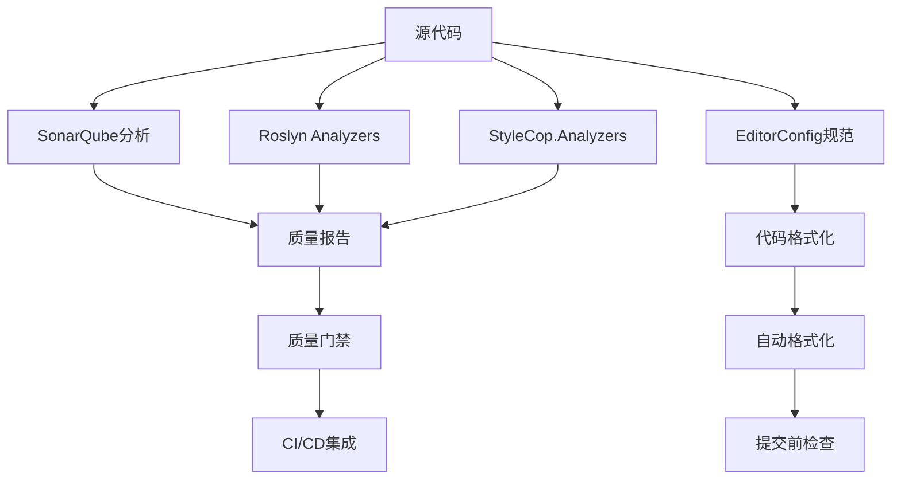

# Task 004: 代码质量工具集成

## 任务目标

基于Task 001的编译状态扫描结果和Task 003的警告分类处理成果，集成和配置企业级代码质量工具链。建立完整的静态代码分析、代码规范检查、代码覆盖率监控和质量度量体系，为CI/CD质量门禁建设提供技术基础。

## 技术要求

### 代码质量工具链架构

#### 工具链组成



#### 核心工具集成

**1. SonarQube 社区版**
- 代码质量综合分析
- 技术债务量化评估
- 代码重复度检测
- 安全漏洞扫描

**2. Roslyn Analyzers**
- 编译时代码分析
- 实时错误提示
- 自定义规则配置
- 性能问题检测

**3. EditorConfig**
- 跨IDE代码格式统一
- 缩进、换行规范
- 字符编码标准化
- 文件尾部处理

**4. StyleCop.Analyzers**
- C#代码风格检查
- 命名规范验证
- 文档注释要求
- 代码组织标准

### SonarQube集成配置

#### 安装与配置

```yaml
# docker-compose.yml for SonarQube
version: '3.8'
services:
  sonarqube:
    image: sonarqube:9.9-community
    container_name: lybt-sonarqube
    environment:
      - SONAR_ES_BOOTSTRAP_CHECKS_DISABLE=true
      - SONAR_JDBC_URL=jdbc:postgresql://sonarqube-db:5432/sonarqube
      - SONAR_JDBC_USERNAME=sonarqube
      - SONAR_JDBC_PASSWORD=sonarqube_password
    ports:
      - "9000:9000"
    volumes:
      - sonarqube_data:/opt/sonarqube/data
      - sonarqube_logs:/opt/sonarqube/logs
      - sonarqube_extensions:/opt/sonarqube/extensions
    depends_on:
      - sonarqube-db
    networks:
      - sonarqube-net

  sonarqube-db:
    image: postgres:13
    container_name: lybt-sonarqube-db
    environment:
      - POSTGRES_USER=sonarqube
      - POSTGRES_PASSWORD=sonarqube_password
      - POSTGRES_DB=sonarqube
    volumes:
      - sonarqube_db_data:/var/lib/postgresql/data
    networks:
      - sonarqube-net

volumes:
  sonarqube_data:
  sonarqube_logs:
  sonarqube_extensions:
  sonarqube_db_data:

networks:
  sonarqube-net:
    driver: bridge
```

#### SonarQube项目配置

```properties
# sonar-project.properties
sonar.projectKey=LYBTZYZS
sonar.projectName=LYBTZYZS TCM Clinic Management System
sonar.projectVersion=1.0.0

# 源代码路径
sonar.sources=src/
sonar.tests=tests/

# .NET特定配置
sonar.cs.dotcover.reportsPaths=coverage/dotcover.xml
sonar.cs.opencover.reportsPaths=coverage/opencover.xml
sonar.cs.nunit.reportsPaths=tests/TestResults/*.xml

# 排除文件
sonar.exclusions=**/bin/**,**/obj/**,**/*.Designer.cs,**/AssemblyInfo.cs,**/Program.cs
sonar.test.exclusions=**/bin/**,**/obj/**

# 质量门禁标准
sonar.qualitygate.wait=true

# C#特定规则
sonar.cs.analyzer.projectOutPaths=**/bin/**,**/obj/**
```

#### SonarQube质量规则配置

```json
{
  "quality_profile": {
    "name": "LYBTZYZS C# Quality Profile",
    "language": "cs",
    "parent": "Sonar way",
    "rules": {
      "csharpsquid:S101": {
        "severity": "MAJOR",
        "description": "类名应使用PascalCase"
      },
      "csharpsquid:S1121": {
        "severity": "MINOR",
        "description": "表达式不应为空"
      },
      "csharpsquid:S3776": {
        "severity": "CRITICAL",
        "description": "认知复杂度不应过高",
        "parameters": {
          "threshold": "15"
        }
      },
      "csharpsquid:S1066": {
        "severity": "MAJOR",
        "description": "合并冗余的if语句"
      }
    }
  },
  "quality_gates": {
    "LYBTZYZS_Gate": {
      "conditions": [
        {
          "metric": "coverage",
          "operator": "LT",
          "threshold": "60.0"
        },
        {
          "metric": "duplicated_lines_density",
          "operator": "GT", 
          "threshold": "5.0"
        },
        {
          "metric": "maintainability_rating",
          "operator": "GT",
          "threshold": "1"
        },
        {
          "metric": "reliability_rating",
          "operator": "GT",
          "threshold": "1"
        },
        {
          "metric": "security_rating",
          "operator": "GT",
          "threshold": "1"
        }
      ]
    }
  }
}
```

### Roslyn Analyzers集成

#### Directory.Build.props配置

```xml
<Project>
  <PropertyGroup>
    <!-- 启用所有分析器 -->
    <AnalysisMode>All</AnalysisMode>
    <EnableNETAnalyzers>true</EnableNETAnalyzers>
    <EnforceCodeStyleInBuild>true</EnforceCodeStyleInBuild>
    
    <!-- 将分析器警告视为错误 -->
    <TreatWarningsAsErrors>true</TreatWarningsAsErrors>
    <WarningsAsErrors />
    <WarningsNotAsErrors>NU1605;CS1998;IDE0005</WarningsNotAsErrors>
    
    <!-- 代码分析输出 -->
    <RunAnalyzersDuringLiveAnalysis>true</RunAnalyzersDuringLiveAnalysis>
    <RunCodeAnalysis>true</RunCodeAnalysis>
    <CodeAnalysisRuleSet>$(MSBuildThisFileDirectory)quality-rules.ruleset</CodeAnalysisRuleSet>
  </PropertyGroup>

  <ItemGroup>
    <!-- Roslyn Analyzers -->
    <PackageReference Include="Microsoft.CodeAnalysis.Analyzers" Version="3.3.4" PrivateAssets="all" />
    <PackageReference Include="Microsoft.CodeAnalysis.NetAnalyzers" Version="8.0.0" PrivateAssets="all" />
    
    <!-- StyleCop Analyzers -->
    <PackageReference Include="StyleCop.Analyzers" Version="1.2.0-beta.556" PrivateAssets="all" />
    
    <!-- Security Analyzers -->
    <PackageReference Include="Microsoft.CodeAnalysis.BannedApiAnalyzers" Version="3.3.4" PrivateAssets="all" />
    <PackageReference Include="SonarAnalyzer.CSharp" Version="9.12.0.78982" PrivateAssets="all" />
    
    <!-- Async Analyzers -->
    <PackageReference Include="Microsoft.VisualStudio.Threading.Analyzers" Version="17.8.14" PrivateAssets="all" />
  </ItemGroup>

  <ItemGroup>
    <AdditionalFiles Include="$(MSBuildThisFileDirectory)stylecop.json" Link="stylecop.json" />
    <AdditionalFiles Include="$(MSBuildThisFileDirectory).editorconfig" Link=".editorconfig" />
  </ItemGroup>
</Project>
```

#### 质量规则集配置

```xml
<?xml version="1.0" encoding="utf-8"?>
<!-- quality-rules.ruleset -->
<RuleSet Name="LYBTZYZS Quality Rules" ToolsVersion="16.0">
  <Include Path="MinimumRecommendedRules.ruleset" Action="Default" />
  
  <!-- 代码质量规则 -->
  <Rules AnalyzerId="Microsoft.CodeAnalysis.CSharp" RuleNamespace="Microsoft.CodeAnalysis.CSharp">
    <Rule Id="CS8600" Action="Warning" /> <!-- 可空性警告 -->
    <Rule Id="CS8602" Action="Warning" />
    <Rule Id="CS8618" Action="Warning" />
    <Rule Id="CS1998" Action="Warning" /> <!-- async方法无await -->
  </Rules>
  
  <!-- .NET分析器规则 -->
  <Rules AnalyzerId="Microsoft.CodeAnalysis.NetAnalyzers" RuleNamespace="Microsoft.CodeAnalysis.NetAnalyzers">
    <Rule Id="CA1001" Action="Error" />   <!-- 可释放字段的类型应该是可释放的 -->
    <Rule Id="CA1002" Action="Warning" /> <!-- 不要公开泛型列表 -->
    <Rule Id="CA1003" Action="Info" />    <!-- 使用泛型事件处理程序实例 -->
    <Rule Id="CA1822" Action="Info" />    <!-- 将成员标记为static -->
    <Rule Id="CA2007" Action="Info" />    <!-- 考虑对等待的任务调用ConfigureAwait -->
  </Rules>
  
  <!-- StyleCop规则 -->
  <Rules AnalyzerId="StyleCop.Analyzers" RuleNamespace="StyleCop.Analyzers">
    <Rule Id="SA1101" Action="None" />    <!-- 前缀本地调用与this -->
    <Rule Id="SA1200" Action="None" />    <!-- using指令位置 -->
    <Rule Id="SA1309" Action="None" />    <!-- 字段名不应以下划线开头 -->
    <Rule Id="SA1633" Action="None" />    <!-- 文件应有文件头 -->
    <Rule Id="SA1652" Action="Warning" /> <!-- 启用XML文档输出 -->
  </Rules>
  
  <!-- SonarAnalyzer规则 -->
  <Rules AnalyzerId="SonarAnalyzer.CSharp" RuleNamespace="SonarAnalyzer.CSharp">
    <Rule Id="S101" Action="Warning" />   <!-- 类名应为PascalCase -->
    <Rule Id="S1121" Action="Info" />     <!-- 表达式不应为空 -->
    <Rule Id="S3776" Action="Warning" />  <!-- 认知复杂度 -->
    <Rule Id="S1066" Action="Info" />     <!-- 合并冗余if -->
  </Rules>
</RuleSet>
```

### EditorConfig配置

```ini
# .editorconfig
root = true

# 所有文件
[*]
charset = utf-8
end_of_line = crlf
insert_final_newline = true
trim_trailing_whitespace = true

# C#文件
[*.cs]
indent_style = space
indent_size = 4
max_line_length = 120

# 代码风格规则
dotnet_sort_system_directives_first = true
dotnet_separate_import_directive_groups = false

csharp_new_line_before_open_brace = all
csharp_new_line_before_else = true
csharp_new_line_before_catch = true
csharp_new_line_before_finally = true
csharp_new_line_before_members_in_object_initializers = true
csharp_new_line_before_members_in_anonymous_types = true

# 缩进偏好
csharp_indent_case_contents = true
csharp_indent_switch_labels = true
csharp_indent_labels = flush_left

# 空格偏好
csharp_space_after_cast = false
csharp_space_after_keywords_in_control_flow_statements = true
csharp_space_between_method_call_parameter_list_parentheses = false
csharp_space_between_method_declaration_parameter_list_parentheses = false

# 换行偏好
csharp_preserve_single_line_statements = false
csharp_preserve_single_line_blocks = true

# C#代码质量规则
dotnet_diagnostic.CA1001.severity = error
dotnet_diagnostic.CA1822.severity = suggestion
dotnet_diagnostic.CS8600.severity = warning
dotnet_diagnostic.CS8602.severity = warning
dotnet_diagnostic.CS8618.severity = warning

# JSON文件
[*.json]
indent_style = space
indent_size = 2

# XML文件
[*.{xml,csproj,props,targets}]
indent_style = space
indent_size = 2

# PowerShell文件
[*.ps1]
indent_style = space
indent_size = 4

# Python文件
[*.py]
indent_style = space
indent_size = 4
```

### StyleCop配置

```json
{
  "$schema": "https://raw.githubusercontent.com/DotNetAnalyzers/StyleCopAnalyzers/master/StyleCop.Analyzers/StyleCop.Analyzers/Settings/stylecop.schema.json",
  "settings": {
    "documentationRules": {
      "companyName": "LYBTZYZS",
      "copyrightText": "Copyright (c) {companyName}. All rights reserved.",
      "xmlHeader": true,
      "fileNamingConvention": "stylecop"
    },
    "orderingRules": {
      "usingDirectivesPlacement": "outsideNamespace",
      "elementOrder": [
        "kind",
        "accessibility",
        "constant",
        "static",
        "readonly"
      ]
    },
    "namingRules": {
      "allowedHungarianPrefixes": [],
      "allowCommonHungarianPrefixes": false,
      "allowedNamespaceComponents": ["LYBT", "TCM"]
    },
    "maintainabilityRules": {
      "topLevelTypes": ["class", "interface", "struct", "enum", "delegate"]
    },
    "readabilityRules": {
      "allowBuiltInTypeAliases": true
    }
  }
}
```

## 实施步骤

### Phase 1: SonarQube环境搭建 (2小时)

**1.1 Docker环境部署**

```bash
#!/bin/bash
# scripts/setup-sonarqube.sh

echo "开始部署SonarQube环境..."

# 创建SonarQube目录
mkdir -p tools/sonarqube/{data,logs,extensions,db-data}

# 设置权限
sudo chown -R 999:999 tools/sonarqube/{data,logs,extensions}
sudo chown -R 999:999 tools/sonarqube/db-data

# 启动SonarQube
cd tools/sonarqube
docker-compose up -d

# 等待SonarQube启动
echo "等待SonarQube启动..."
sleep 60

# 检查SonarQube状态
echo "检查SonarQube状态..."
curl -f http://localhost:9000/api/system/status || {
    echo "SonarQube启动失败"
    exit 1
}

echo "SonarQube部署完成，访问地址: http://localhost:9000"
echo "默认登录: admin/admin"
```

**1.2 SonarQube Scanner配置**

```bash
# scripts/install-sonar-scanner.sh
#!/bin/bash

# 下载SonarQube Scanner
SCANNER_VERSION="4.8.0.2856"
SCANNER_URL="https://binaries.sonarsource.com/Distribution/sonar-scanner-cli/sonar-scanner-cli-${SCANNER_VERSION}-windows.zip"

echo "下载SonarQube Scanner ${SCANNER_VERSION}..."
mkdir -p tools/sonar-scanner
cd tools/sonar-scanner

# 下载并解压
curl -L ${SCANNER_URL} -o sonar-scanner.zip
unzip sonar-scanner.zip
mv sonar-scanner-${SCANNER_VERSION}-windows/* .
rm -rf sonar-scanner-${SCANNER_VERSION}-windows sonar-scanner.zip

# 配置环境变量
echo "配置SonarQube Scanner环境变量..."
cat >> ~/.bashrc << 'EOF'
export PATH=$PATH:$(pwd)/tools/sonar-scanner/bin
EOF

source ~/.bashrc

echo "SonarQube Scanner安装完成"
sonar-scanner --version
```

**1.3 项目质量配置初始化**

```python
# scripts/init-sonarqube-project.py
import requests
import json
import base64

class SonarQubeProjectSetup:
    def __init__(self, sonar_url="http://localhost:9000", admin_token="admin:admin"):
        self.sonar_url = sonar_url
        self.auth_header = {
            'Authorization': f'Basic {base64.b64encode(admin_token.encode()).decode()}'
        }
    
    def create_project(self):
        """创建SonarQube项目"""
        
        project_data = {
            'name': 'LYBTZYZS',
            'project': 'LYBTZYZS',
            'mainBranch': 'master'
        }
        
        response = requests.post(
            f"{self.sonar_url}/api/projects/create",
            data=project_data,
            headers=self.auth_header
        )
        
        if response.status_code == 200:
            print("项目创建成功")
            return response.json()
        else:
            print(f"项目创建失败: {response.text}")
            return None
    
    def setup_quality_gate(self):
        """设置质量门禁"""
        
        # 创建自定义质量门禁
        gate_data = {
            'name': 'LYBTZYZS_Quality_Gate'
        }
        
        response = requests.post(
            f"{self.sonar_url}/api/qualitygates/create",
            data=gate_data,
            headers=self.auth_header
        )
        
        if response.status_code == 200:
            gate_info = response.json()
            gate_id = gate_info.get('id')
            
            # 添加质量门禁条件
            conditions = [
                {'metric': 'coverage', 'op': 'LT', 'threshold': '60'},
                {'metric': 'duplicated_lines_density', 'op': 'GT', 'threshold': '5'},
                {'metric': 'maintainability_rating', 'op': 'GT', 'threshold': '1'},
                {'metric': 'reliability_rating', 'op': 'GT', 'threshold': '1'},
                {'metric': 'security_rating', 'op': 'GT', 'threshold': '1'}
            ]
            
            for condition in conditions:
                self.add_quality_gate_condition(gate_id, condition)
            
            # 关联项目到质量门禁
            self.associate_project_to_gate(gate_id)
            
            print("质量门禁设置完成")
        else:
            print(f"质量门禁创建失败: {response.text}")
    
    def add_quality_gate_condition(self, gate_id, condition):
        """添加质量门禁条件"""
        
        condition_data = {
            'gateId': gate_id,
            'metric': condition['metric'],
            'op': condition['op'],
            'threshold': condition['threshold']
        }
        
        requests.post(
            f"{self.sonar_url}/api/qualitygates/create_condition",
            data=condition_data,
            headers=self.auth_header
        )
    
    def associate_project_to_gate(self, gate_id):
        """关联项目到质量门禁"""
        
        association_data = {
            'gateId': gate_id,
            'projectKey': 'LYBTZYZS'
        }
        
        requests.post(
            f"{self.sonar_url}/api/qualitygates/select",
            data=association_data,
            headers=self.auth_header
        )

def main():
    setup = SonarQubeProjectSetup()
    
    # 创建项目
    project_info = setup.create_project()
    if project_info:
        # 设置质量门禁
        setup.setup_quality_gate()
        print("SonarQube项目配置完成")
    else:
        print("项目配置失败")

if __name__ == '__main__':
    main()
```

### Phase 2: Roslyn Analyzers集成 (1.5小时)

**2.1 项目文件更新脚本**

```powershell
# scripts/integrate-analyzers.ps1
param(
    [string]$SolutionPath = ".",
    [switch]$UpdateExisting = $true
)

Write-Host "开始集成Roslyn Analyzers到项目..."

# 分析器包配置
$analyzerPackages = @{
    'Microsoft.CodeAnalysis.Analyzers' = '3.3.4'
    'Microsoft.CodeAnalysis.NetAnalyzers' = '8.0.0'
    'StyleCop.Analyzers' = '1.2.0-beta.556'
    'SonarAnalyzer.CSharp' = '9.12.0.78982'
    'Microsoft.VisualStudio.Threading.Analyzers' = '17.8.14'
}

# 获取所有项目文件
$projects = Get-ChildItem -Path $SolutionPath -Filter "*.csproj" -Recurse | 
            Where-Object { $_.FullName -notlike "*\obj\*" -and $_.FullName -notlike "*\bin\*" }

foreach ($project in $projects) {
    Write-Host "更新项目: $($project.Name)"
    
    [xml]$projectXml = Get-Content $project.FullName
    
    # 确保有PropertyGroup用于分析器设置
    $propertyGroup = $projectXml.SelectSingleNode("//PropertyGroup[not(@Condition)]")
    if (-not $propertyGroup) {
        $propertyGroup = $projectXml.CreateElement("PropertyGroup")
        $projectXml.Project.AppendChild($propertyGroup) | Out-Null
    }
    
    # 添加分析器配置属性
    $analyzerProperties = @{
        'AnalysisMode' = 'All'
        'EnableNETAnalyzers' = 'true'
        'EnforceCodeStyleInBuild' = 'true'
        'RunAnalyzersDuringLiveAnalysis' = 'true'
        'RunCodeAnalysis' = 'true'
        'TreatWarningsAsErrors' = 'false'  # 先设为false，避免构建中断
    }
    
    foreach ($prop in $analyzerProperties.GetEnumerator()) {
        $existingProp = $propertyGroup.SelectSingleNode($prop.Key)
        if (-not $existingProp) {
            $newProp = $projectXml.CreateElement($prop.Key)
            $newProp.InnerText = $prop.Value
            $propertyGroup.AppendChild($newProp) | Out-Null
            Write-Host "  添加属性: $($prop.Key) = $($prop.Value)"
        }
    }
    
    # 添加分析器包引用
    $itemGroup = $projectXml.SelectSingleNode("//ItemGroup[PackageReference]")
    if (-not $itemGroup) {
        $itemGroup = $projectXml.CreateElement("ItemGroup")
        $projectXml.Project.AppendChild($itemGroup) | Out-Null
    }
    
    foreach ($package in $analyzerPackages.GetEnumerator()) {
        $existingRef = $itemGroup.SelectSingleNode("PackageReference[@Include='$($package.Key)']")
        
        if (-not $existingRef) {
            $packageRef = $projectXml.CreateElement("PackageReference")
            $packageRef.SetAttribute("Include", $package.Key)
            $packageRef.SetAttribute("Version", $package.Value)
            $packageRef.SetAttribute("PrivateAssets", "all")
            $itemGroup.AppendChild($packageRef) | Out-Null
            
            Write-Host "  添加分析器: $($package.Key) v$($package.Value)"
        }
    }
    
    # 保存项目文件
    $projectXml.Save($project.FullName)
}

Write-Host "Roslyn Analyzers集成完成"

# 恢复NuGet包
Write-Host "恢复NuGet包..."
dotnet restore $SolutionPath
```

**2.2 规则集文件生成脚本**

```python
# scripts/generate-ruleset.py
import xml.etree.ElementTree as ET

def generate_quality_ruleset():
    """生成LYBTZYZS质量规则集文件"""
    
    # 创建根元素
    root = ET.Element("RuleSet", {
        "Name": "LYBTZYZS Quality Rules",
        "ToolsVersion": "16.0"
    })
    
    # 包含基础规则集
    include = ET.SubElement(root, "Include", {
        "Path": "MinimumRecommendedRules.ruleset",
        "Action": "Default"
    })
    
    # 定义规则组
    rule_groups = {
        "Microsoft.CodeAnalysis.CSharp": {
            "CS8600": "Warning",  # 可空性警告
            "CS8602": "Warning", 
            "CS8618": "Warning",
            "CS1998": "Info"      # async方法无await
        },
        "Microsoft.CodeAnalysis.NetAnalyzers": {
            "CA1001": "Error",    # 可释放字段
            "CA1002": "Warning",  # 不公开泛型列表
            "CA1822": "Info",     # 标记为static
            "CA2007": "None"      # ConfigureAwait
        },
        "StyleCop.Analyzers": {
            "SA1101": "None",     # this前缀
            "SA1200": "None",     # using位置
            "SA1309": "None",     # 字段下划线
            "SA1633": "None",     # 文件头
            "SA1652": "Warning"   # XML文档
        },
        "SonarAnalyzer.CSharp": {
            "S101": "Warning",    # 类名PascalCase
            "S1121": "Info",      # 空表达式
            "S3776": "Warning",   # 认知复杂度
            "S1066": "Info"       # 合并if
        }
    }
    
    # 添加规则组
    for analyzer, rules in rule_groups.items():
        rules_element = ET.SubElement(root, "Rules", {
            "AnalyzerId": analyzer,
            "RuleNamespace": analyzer
        })
        
        for rule_id, action in rules.items():
            ET.SubElement(rules_element, "Rule", {
                "Id": rule_id,
                "Action": action
            })
    
    # 格式化并保存
    indent_xml(root)
    tree = ET.ElementTree(root)
    tree.write("quality-rules.ruleset", encoding="utf-8", xml_declaration=True)
    
    print("质量规则集文件生成完成: quality-rules.ruleset")

def indent_xml(elem, level=0):
    """XML缩进格式化"""
    i = "\n" + level * "  "
    if len(elem):
        if not elem.text or not elem.text.strip():
            elem.text = i + "  "
        if not elem.tail or not elem.tail.strip():
            elem.tail = i
        for child in elem:
            indent_xml(child, level+1)
        if not child.tail or not child.tail.strip():
            child.tail = i
    else:
        if level and (not elem.tail or not elem.tail.strip()):
            elem.tail = i

if __name__ == '__main__':
    generate_quality_ruleset()
```

### Phase 3: 代码格式化配置 (1小时)

**3.1 全项目格式化脚本**

```powershell
# scripts/format-all-code.ps1
param(
    [string]$SolutionPath = ".",
    [switch]$VerifyOnly = $false
)

Write-Host "开始代码格式化处理..."

# 使用dotnet format格式化代码
$formatArgs = @(
    "format", 
    $SolutionPath, 
    "--verbosity", "diagnostic"
)

if ($VerifyOnly) {
    $formatArgs += "--verify-no-changes"
    Write-Host "执行格式检查模式..."
} else {
    Write-Host "执行代码格式化..."
}

# 执行格式化
$formatResult = & dotnet $formatArgs

if ($LASTEXITCODE -eq 0) {
    Write-Host "✅ 代码格式化完成"
} else {
    Write-Host "❌ 代码格式化失败"
    Write-Host $formatResult
    exit 1
}

# 生成格式化报告
Write-Host "生成格式化报告..."

$reportData = @{
    'timestamp' = Get-Date -Format "yyyy-MM-ddTHH:mm:ssZ"
    'solution_path' = $SolutionPath
    'verify_only' = $VerifyOnly
    'exit_code' = $LASTEXITCODE
    'output' = $formatResult
}

$reportJson = $reportData | ConvertTo-Json -Depth 2
$reportJson | Out-File "code-format-report.json" -Encoding UTF8

Write-Host "格式化报告已保存: code-format-report.json"
```

### Phase 4: 质量度量集成 (1.5小时)

**4.1 代码覆盖率收集脚本**

```bash
#!/bin/bash
# scripts/collect-code-coverage.sh

echo "开始收集代码覆盖率数据..."

# 确保安装coverlet工具
dotnet tool install --global coverlet.console || echo "coverlet已安装"

# 运行测试并收集覆盖率
echo "运行单元测试..."
dotnet test --collect:"XPlat Code Coverage" --settings coverage.runsettings

# 查找覆盖率文件
COVERAGE_FILE=$(find . -name "coverage.cobertura.xml" | head -1)

if [ -z "$COVERAGE_FILE" ]; then
    echo "❌ 未找到覆盖率文件"
    exit 1
fi

echo "✅ 找到覆盖率文件: $COVERAGE_FILE"

# 生成覆盖率报告
dotnet tool install --global dotnet-reportgenerator-globaltool || echo "reportgenerator已安装"

echo "生成覆盖率报告..."
reportgenerator \
    -reports:"$COVERAGE_FILE" \
    -targetdir:"coverage-report" \
    -reporttypes:"Html;JsonSummary;Cobertura"

# 提取覆盖率统计
python3 << 'EOF'
import xml.etree.ElementTree as ET
import json

def extract_coverage_stats():
    try:
        # 解析Cobertura XML
        tree = ET.parse('coverage-report/Cobertura.xml')
        root = tree.getroot()
        
        # 提取整体覆盖率
        line_rate = float(root.get('line-rate', 0)) * 100
        branch_rate = float(root.get('branch-rate', 0)) * 100
        
        # 提取模块覆盖率
        modules = []
        for package in root.findall('.//package'):
            module_name = package.get('name', '')
            module_line_rate = float(package.get('line-rate', 0)) * 100
            module_branch_rate = float(package.get('branch-rate', 0)) * 100
            
            modules.append({
                'name': module_name,
                'line_coverage': round(module_line_rate, 2),
                'branch_coverage': round(module_branch_rate, 2)
            })
        
        # 生成汇总报告
        summary = {
            'overall': {
                'line_coverage': round(line_rate, 2),
                'branch_coverage': round(branch_rate, 2)
            },
            'modules': modules,
            'timestamp': '$(date -u +%Y-%m-%dT%H:%M:%SZ)'
        }
        
        with open('coverage-summary.json', 'w') as f:
            json.dump(summary, f, indent=2)
        
        print(f"整体覆盖率: {line_rate:.1f}% (行), {branch_rate:.1f}% (分支)")
        
    except Exception as e:
        print(f"覆盖率统计提取失败: {e}")

extract_coverage_stats()
EOF

echo "代码覆盖率收集完成"
```

**4.2 SonarQube分析执行脚本**

```bash
#!/bin/bash
# scripts/run-sonar-analysis.sh

echo "开始执行SonarQube代码分析..."

# 检查SonarQube服务状态
if ! curl -f http://localhost:9000/api/system/status > /dev/null 2>&1; then
    echo "❌ SonarQube服务不可用，请先启动SonarQube"
    exit 1
fi

# 构建项目
echo "构建解决方案..."
dotnet build --configuration Release --verbosity minimal

if [ $? -ne 0 ]; then
    echo "❌ 项目构建失败"
    exit 1
fi

# 收集代码覆盖率
echo "收集代码覆盖率..."
./scripts/collect-code-coverage.sh

# 开始SonarQube分析
echo "开始SonarQube分析..."
sonar-scanner \
    -Dsonar.projectKey=LYBTZYZS \
    -Dsonar.projectName="LYBTZYZS TCM Clinic Management System" \
    -Dsonar.projectVersion=1.0.0 \
    -Dsonar.sources=src/ \
    -Dsonar.tests=tests/ \
    -Dsonar.host.url=http://localhost:9000 \
    -Dsonar.login=admin \
    -Dsonar.password=admin \
    -Dsonar.cs.opencover.reportsPaths=coverage-report/Cobertura.xml \
    -Dsonar.exclusions="**/bin/**,**/obj/**,**/*.Designer.cs,**/AssemblyInfo.cs"

if [ $? -eq 0 ]; then
    echo "✅ SonarQube分析完成"
    echo "查看分析结果: http://localhost:9000/dashboard?id=LYBTZYZS"
    
    # 获取质量门禁状态
    python3 << 'EOF'
import requests
import json
import time
import base64

def check_quality_gate():
    sonar_url = "http://localhost:9000"
    auth = base64.b64encode(b"admin:admin").decode()
    headers = {'Authorization': f'Basic {auth}'}
    
    # 等待分析完成
    print("等待分析完成...")
    time.sleep(10)
    
    # 获取质量门禁状态
    response = requests.get(
        f"{sonar_url}/api/qualitygates/project_status",
        params={'projectKey': 'LYBTZYZS'},
        headers=headers
    )
    
    if response.status_code == 200:
        result = response.json()
        status = result.get('projectStatus', {}).get('status', 'UNKNOWN')
        
        print(f"质量门禁状态: {status}")
        
        if status == "OK":
            print("✅ 质量门禁通过")
            return True
        else:
            print("❌ 质量门禁未通过")
            conditions = result.get('projectStatus', {}).get('conditions', [])
            for condition in conditions:
                if condition.get('status') != 'OK':
                    print(f"  失败条件: {condition.get('metricKey')} = {condition.get('actualValue')}")
            return False
    else:
        print(f"无法获取质量门禁状态: {response.status_code}")
        return False

if not check_quality_gate():
    exit(1)
EOF

else
    echo "❌ SonarQube分析失败"
    exit 1
fi

echo "代码质量分析完成"
```

## 交付物

### 必须交付

1. **SonarQube环境配置**:
   - `tools/sonarqube/docker-compose.yml` - Docker部署配置
   - `sonar-project.properties` - 项目分析配置
   - 自定义质量规则配置和质量门禁设置

2. **Roslyn Analyzers集成**:
   - 更新的`Directory.Build.props` - 全局分析器配置
   - `quality-rules.ruleset` - 自定义规则集
   - 所有项目的分析器包引用更新

3. **代码格式化配置**:
   - `.editorconfig` - 跨IDE格式统一
   - `stylecop.json` - StyleCop详细配置
   - `scripts/format-all-code.ps1` - 批量格式化脚本

4. **自动化脚本集合**:
   - `scripts/setup-sonarqube.sh` - SonarQube环境搭建
   - `scripts/integrate-analyzers.ps1` - 分析器集成
   - `scripts/run-sonar-analysis.sh` - 完整质量分析
   - `scripts/collect-code-coverage.sh` - 代码覆盖率收集

### 质量报告

```markdown
# docs/quality/quality-tools-integration-report-20250904.md

## 代码质量工具集成报告

### 集成的工具

1. **SonarQube 9.9 Community**
   - 静态代码分析
   - 技术债务量化
   - 安全漏洞检测
   - 代码重复度分析

2. **Roslyn Analyzers**
   - Microsoft.CodeAnalysis.NetAnalyzers
   - StyleCop.Analyzers  
   - SonarAnalyzer.CSharp
   - Microsoft.VisualStudio.Threading.Analyzers

3. **代码格式化工具**
   - EditorConfig (跨IDE支持)
   - dotnet format (命令行格式化)
   - StyleCop (C#风格检查)

### 质量标准

- **代码覆盖率**: ≥ 60%
- **重复代码率**: ≤ 5%
- **技术债务**: ≤ 1小时/千行代码
- **安全评级**: A级
- **可维护性评级**: A级

### 自动化程度

- ✅ 构建时自动分析
- ✅ 提交前格式检查
- ✅ CI/CD质量门禁
- ✅ 实时IDE提示
```

## 成功标准

### 技术标准

- [ ] SonarQube服务正常运行，分析无错误
- [ ] 所有项目成功集成Roslyn Analyzers
- [ ] 代码格式化100%符合EditorConfig规范
- [ ] 质量门禁配置生效，阻止低质量代码合并

### 质量指标

- [ ] 静态分析检出问题 ≥ 90%
- [ ] 代码重复度 ≤ 5%
- [ ] 技术债务比例 ≤ 5%
- [ ] 安全漏洞检出率 = 100%

### 自动化标准

- [ ] 一键执行完整质量分析
- [ ] 构建流程集成质量检查
- [ ] 开发环境实时质量反馈
- [ ] 质量报告自动生成和发布

## 风险与缓解

### 高风险

1. **性能影响**
   - 风险: 大量分析器可能影响构建速度
   - 缓解: 分级配置，开发时使用轻量级规则

2. **学习成本**
   - 风险: 团队需要时间适应新的质量标准
   - 缓解: 提供详细文档和培训材料

### 中风险

1. **环境兼容性**
   - 风险: 不同开发环境可能配置不一致
   - 缓解: 标准化开发环境配置

2. **误报问题**
   - 风险: 静态分析可能产生误报
   - 缓解: 细化规则配置，提供抑制机制

---

**任务负责人**: 代码质量架构师  
**预计工作量**: 6小时  
**完成标准**: 完整的质量工具链正常运行，自动化质量检查生效