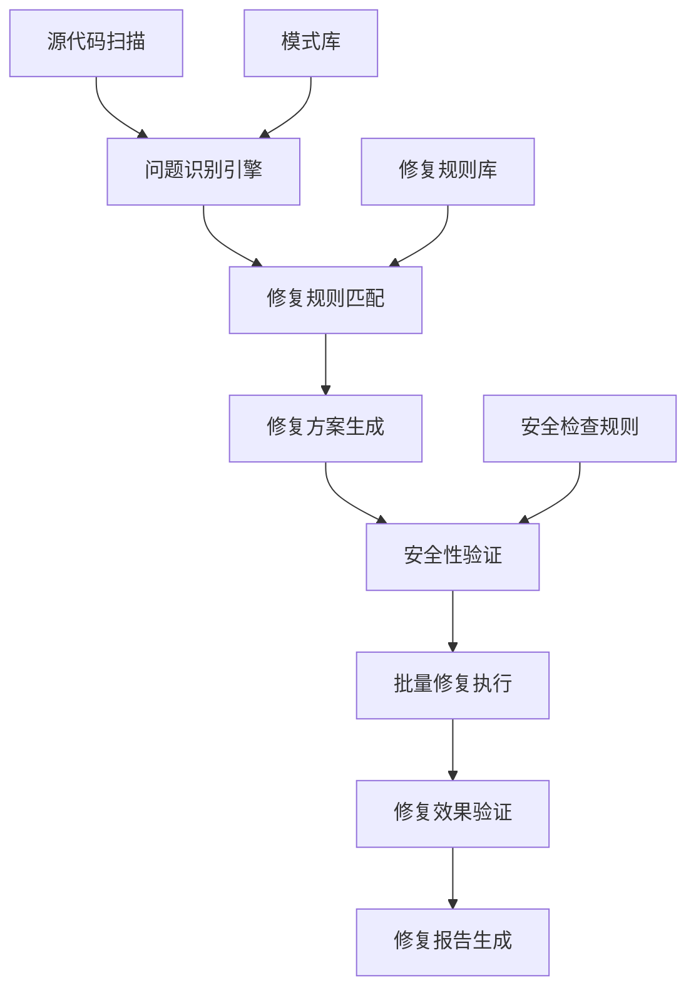

# Task 005: 自动化修复脚本开发

## 任务目标

基于Task 002的阻塞性错误修复经验和Task 003的警告分类处理成果，开发一套智能化的自动修复脚本系统。该系统能够识别常见的编译错误和警告模式，自动生成修复方案，并批量应用修复，大幅提升代码质量维护效率。

## 技术要求

### 自动化修复架构

#### 系统架构设计



#### 核心组件

**1. 问题识别引擎**
- 基于正则表达式的模式匹配
- AST语法树分析
- 编译器诊断信息解析
- 上下文感知的问题分类

**2. 修复规则引擎**
- 规则模板化管理
- 优先级排序机制
- 冲突检测和解决
- 自定义规则扩展

**3. 安全验证系统**
- 语法正确性验证
- 语义一致性检查
- 备份和回滚机制
- 修复影响范围分析

### 智能修复规则库

#### 类型1: 编译错误自动修复

**CS0246 - 类型或命名空间名称错误**

```python
# fixers/cs0246_missing_namespace_fixer.py
import re
import os
from typing import List, Dict, Optional, Tuple

class MissingNamespaceFixer:
    def __init__(self):
        self.namespace_mappings = {
            # 常用类型到命名空间的映射
            'IMapper': ['AutoMapper'],
            'ILogger': ['Microsoft.Extensions.Logging'],
            'IMemoryCache': ['Microsoft.Extensions.Caching.Memory'],
            'IConfiguration': ['Microsoft.Extensions.Configuration'],
            'DbContext': ['Microsoft.EntityFrameworkCore'],
            'ControllerBase': ['Microsoft.AspNetCore.Mvc'],
            'ApiController': ['Microsoft.AspNetCore.Mvc'],
            'HttpGet': ['Microsoft.AspNetCore.Mvc'],
            'HttpPost': ['Microsoft.AspNetCore.Mvc'],
            'Authorize': ['Microsoft.AspNetCore.Authorization'],
            'ServiceResult': ['LYBT.Shared.Models'],
            'ApiResponse': ['LYBT.Shared.Models'],
            'UserDto': ['LYBT.Shared.Models'],
            'PatientDto': ['LYBT.Shared.Models'],
            'IUserService': ['LYBT.Shared.Interfaces'],
            'IPatientService': ['LYBT.Shared.Interfaces'],
        }
        
        # 项目特定命名空间映射
        self.project_mappings = {
            'LYBT.Desktop': {
                'UserModule': 'LYBT.Desktop.Modules.Users',
                'PatientModule': 'LYBT.Desktop.Modules.Patients',
                'AuthModule': 'LYBT.Desktop.Modules.Auth'
            },
            'LYBT.Server': {
                'UserService': 'LYBT.Server.Modules.Users.Services',
                'PatientService': 'LYBT.Server.Modules.Patients.Services',
                'AuthService': 'LYBT.Server.Modules.Auth.Services'
            }
        }
    
    def analyze_cs0246_error(self, error_message: str, file_path: str) -> Optional[Dict]:
        """分析CS0246错误并生成修复建议"""
        
        # 提取错误中的类型名称
        type_match = re.search(r"type or namespace name '(\w+)'", error_message)
        if not type_match:
            return None
            
        missing_type = type_match.group(1)
        
        # 查找可能的命名空间
        possible_namespaces = self.find_possible_namespaces(missing_type, file_path)
        
        if not possible_namespaces:
            return None
            
        return {
            'error_type': 'CS0246',
            'missing_type': missing_type,
            'file_path': file_path,
            'possible_namespaces': possible_namespaces,
            'fix_confidence': self.calculate_confidence(missing_type, possible_namespaces),
            'fix_action': 'add_using_statement'
        }
    
    def find_possible_namespaces(self, type_name: str, file_path: str) -> List[str]:
        """查找可能的命名空间"""
        
        namespaces = []
        
        # 1. 从预定义映射查找
        if type_name in self.namespace_mappings:
            namespaces.extend(self.namespace_mappings[type_name])
        
        # 2. 根据项目结构推断
        project_type = self.detect_project_type(file_path)
        if project_type in self.project_mappings:
            project_ns = self.project_mappings[project_type]
            for class_name, namespace in project_ns.items():
                if type_name in class_name or class_name in type_name:
                    namespaces.append(namespace)
        
        # 3. 扫描项目文件查找定义
        found_namespaces = self.scan_for_type_definition(type_name, file_path)
        namespaces.extend(found_namespaces)
        
        return list(set(namespaces))  # 去重
    
    def detect_project_type(self, file_path: str) -> str:
        """检测文件所属的项目类型"""
        if 'Desktop' in file_path:
            return 'LYBT.Desktop'
        elif 'Server' in file_path:
            return 'LYBT.Server'
        else:
            return 'Unknown'
    
    def scan_for_type_definition(self, type_name: str, current_file: str) -> List[str]:
        """在项目文件中扫描类型定义"""
        
        project_root = self.find_project_root(current_file)
        found_namespaces = []
        
        # 搜索所有.cs文件
        for root, dirs, files in os.walk(project_root):
            # 跳过bin和obj目录
            dirs[:] = [d for d in dirs if d not in ['bin', 'obj']]
            
            for file in files:
                if file.endswith('.cs'):
                    file_path = os.path.join(root, file)
                    namespace = self.find_type_in_file(type_name, file_path)
                    if namespace:
                        found_namespaces.append(namespace)
        
        return found_namespaces
    
    def find_type_in_file(self, type_name: str, file_path: str) -> Optional[str]:
        """在指定文件中查找类型定义"""
        
        try:
            with open(file_path, 'r', encoding='utf-8') as f:
                content = f.read()
            
            # 查找类、接口、枚举等定义
            type_patterns = [
                rf'class\s+{type_name}\b',
                rf'interface\s+{type_name}\b',
                rf'enum\s+{type_name}\b',
                rf'struct\s+{type_name}\b'
            ]
            
            for pattern in type_patterns:
                if re.search(pattern, content):
                    # 提取命名空间
                    namespace_match = re.search(r'namespace\s+([\w\.]+)', content)
                    if namespace_match:
                        return namespace_match.group(1)
                    
        except Exception:
            pass
        
        return None
    
    def find_project_root(self, file_path: str) -> str:
        """查找项目根目录"""
        
        current_dir = os.path.dirname(os.path.abspath(file_path))
        
        while current_dir != os.path.dirname(current_dir):
            if any(f.endswith('.csproj') for f in os.listdir(current_dir)):
                return current_dir
            current_dir = os.path.dirname(current_dir)
        
        return os.path.dirname(os.path.abspath(file_path))
    
    def calculate_confidence(self, type_name: str, namespaces: List[str]) -> float:
        """计算修复建议的可信度"""
        
        if not namespaces:
            return 0.0
        
        confidence = 0.5  # 基础置信度
        
        # 如果在预定义映射中，增加置信度
        if type_name in self.namespace_mappings:
            confidence += 0.3
        
        # 如果找到多个候选命名空间，稍微降低置信度
        if len(namespaces) > 1:
            confidence -= 0.1
        
        # 如果是常见的系统类型，增加置信度
        system_prefixes = ['Microsoft.', 'System.', 'AutoMapper']
        if any(ns.startswith(prefix) for ns in namespaces for prefix in system_prefixes):
            confidence += 0.2
        
        return min(confidence, 1.0)
    
    def apply_fix(self, fix_info: Dict) -> bool:
        """应用修复方案"""
        
        file_path = fix_info['file_path']
        namespaces_to_add = fix_info['possible_namespaces']
        
        try:
            with open(file_path, 'r', encoding='utf-8') as f:
                content = f.read()
            
            original_content = content
            
            # 添加using语句
            for namespace in namespaces_to_add:
                if not self.has_using_statement(content, namespace):
                    content = self.add_using_statement(content, namespace)
            
            # 只有在内容发生变化时才写入文件
            if content != original_content:
                with open(file_path, 'w', encoding='utf-8') as f:
                    f.write(content)
                return True
                
        except Exception as e:
            print(f"修复失败 {file_path}: {e}")
            return False
        
        return False
    
    def has_using_statement(self, content: str, namespace: str) -> bool:
        """检查是否已存在using语句"""
        return re.search(rf'using\s+{re.escape(namespace)}\s*;', content) is not None
    
    def add_using_statement(self, content: str, namespace: str) -> str:
        """添加using语句"""
        
        # 查找最后一个using语句的位置
        using_matches = list(re.finditer(r'using\s+[^;]+;', content))
        
        if using_matches:
            # 在最后一个using语句后添加
            last_match = using_matches[-1]
            insert_pos = last_match.end()
            new_using = f'\nusing {namespace};'
            content = content[:insert_pos] + new_using + content[insert_pos:]
        else:
            # 如果没有using语句，在文件开头添加
            new_using = f'using {namespace};\n\n'
            content = new_using + content
        
        return content

# 使用示例
def main():
    fixer = MissingNamespaceFixer()
    
    # 示例错误信息
    error_message = "error CS0246: The type or namespace name 'IMapper' could not be found"
    file_path = "src/Server/Modules/Users/Services/UserService.cs"
    
    fix_info = fixer.analyze_cs0246_error(error_message, file_path)
    if fix_info and fix_info['fix_confidence'] > 0.7:
        success = fixer.apply_fix(fix_info)
        if success:
            print(f"成功修复 {file_path} 中的 CS0246 错误")
        else:
            print(f"修复失败: {file_path}")
    else:
        print("无法生成可信的修复建议")

if __name__ == '__main__':
    main()
```

**CS1061 - 未找到方法定义错误**

```python
# fixers/cs1061_missing_method_fixer.py
import re
import ast
import os
from typing import Dict, List, Optional

class MissingMethodFixer:
    def __init__(self):
        self.interface_methods = {
            'IUserService': [
                'Task<ServiceResult<User>> GetByIdAsync(Guid id)',
                'Task<ServiceResult<List<User>>> GetAllAsync()',
                'Task<ServiceResult<User>> CreateAsync(UserCreateDto dto)',
                'Task<ServiceResult<User>> UpdateAsync(Guid id, UserUpdateDto dto)',
                'Task<ServiceResult<bool>> DeleteAsync(Guid id)'
            ],
            'IPatientService': [
                'Task<ServiceResult<Patient>> GetByIdAsync(Guid id)',
                'Task<ServiceResult<PagedResult<Patient>>> SearchAsync(PatientSearchDto criteria)',
                'Task<ServiceResult<Patient>> CreateAsync(PatientCreateDto dto)', 
                'Task<ServiceResult<Patient>> UpdateAsync(Guid id, PatientUpdateDto dto)',
                'Task<ServiceResult<bool>> DisableAsync(Guid id)'
            ]
        }
        
        self.method_name_mappings = {
            # 常见的方法名变更映射
            'GetUserByIdAsync': 'GetByIdAsync',
            'CreateUserAsync': 'CreateAsync',
            'UpdateUserAsync': 'UpdateAsync',
            'DeleteUserAsync': 'DeleteAsync',
            'DisablePatientAsync': 'DisableAsync',
            'EnablePatientAsync': 'EnableAsync'
        }
    
    def analyze_cs1061_error(self, error_message: str, file_path: str) -> Optional[Dict]:
        """分析CS1061错误并生成修复建议"""
        
        # 提取方法名和类型名
        method_match = re.search(r"'(\w+)' does not contain a definition for '(\w+)'", error_message)
        if not method_match:
            return None
            
        type_name = method_match.group(1)
        method_name = method_match.group(2)
        
        # 查找可能的修复方案
        fix_suggestions = self.find_method_fixes(type_name, method_name, file_path)
        
        if not fix_suggestions:
            return None
            
        return {
            'error_type': 'CS1061',
            'type_name': type_name,
            'missing_method': method_name,
            'file_path': file_path,
            'fix_suggestions': fix_suggestions,
            'fix_confidence': self.calculate_method_fix_confidence(fix_suggestions)
        }
    
    def find_method_fixes(self, type_name: str, method_name: str, file_path: str) -> List[Dict]:
        """查找可能的方法修复方案"""
        
        suggestions = []
        
        # 1. 检查是否是已知的方法名变更
        if method_name in self.method_name_mappings:
            correct_name = self.method_name_mappings[method_name]
            suggestions.append({
                'fix_type': 'rename_method_call',
                'from_name': method_name,
                'to_name': correct_name,
                'confidence': 0.9
            })
        
        # 2. 检查是否是接口方法缺失
        interface_fixes = self.check_interface_method_missing(type_name, method_name, file_path)
        suggestions.extend(interface_fixes)
        
        # 3. 检查相似方法名
        similar_methods = self.find_similar_methods(type_name, method_name, file_path)
        suggestions.extend(similar_methods)
        
        return suggestions
    
    def check_interface_method_missing(self, type_name: str, method_name: str, file_path: str) -> List[Dict]:
        """检查接口方法是否缺失"""
        
        suggestions = []
        
        # 查找实现的接口
        interfaces = self.find_implemented_interfaces(file_path)
        
        for interface in interfaces:
            if interface in self.interface_methods:
                required_methods = self.interface_methods[interface]
                
                for method_sig in required_methods:
                    method_sig_name = re.search(r'(\w+)\(', method_sig)
                    if method_sig_name and method_sig_name.group(1) == method_name:
                        suggestions.append({
                            'fix_type': 'implement_interface_method',
                            'interface': interface,
                            'method_signature': method_sig,
                            'method_name': method_name,
                            'confidence': 0.8
                        })
        
        return suggestions
    
    def find_implemented_interfaces(self, file_path: str) -> List[str]:
        """查找文件中实现的接口"""
        
        try:
            with open(file_path, 'r', encoding='utf-8') as f:
                content = f.read()
            
            # 查找类定义和实现的接口
            class_pattern = r'class\s+\w+\s*:\s*([^{]+)\s*{'
            matches = re.findall(class_pattern, content)
            
            interfaces = []
            for match in matches:
                # 分割基类和接口
                parts = [part.strip() for part in match.split(',')]
                for part in parts:
                    if part.startswith('I') and not part.startswith('I<'):  # 接口通常以I开头
                        interfaces.append(part)
            
            return interfaces
            
        except Exception:
            return []
    
    def find_similar_methods(self, type_name: str, method_name: str, file_path: str) -> List[Dict]:
        """查找相似的方法名"""
        
        suggestions = []
        
        try:
            # 在同一个文件或相关文件中查找相似方法
            available_methods = self.extract_available_methods(file_path, type_name)
            
            for available_method in available_methods:
                similarity = self.calculate_string_similarity(method_name, available_method)
                if similarity > 0.7:  # 相似度阈值
                    suggestions.append({
                        'fix_type': 'rename_method_call',
                        'from_name': method_name,
                        'to_name': available_method,
                        'confidence': similarity * 0.6  # 降低置信度
                    })
        
        except Exception:
            pass
        
        return suggestions
    
    def extract_available_methods(self, file_path: str, type_name: str) -> List[str]:
        """提取文件中可用的方法"""
        
        try:
            with open(file_path, 'r', encoding='utf-8') as f:
                content = f.read()
            
            # 查找public方法定义
            method_pattern = r'public\s+(?:async\s+)?(?:static\s+)?[\w<>]+\s+(\w+)\s*\('
            matches = re.findall(method_pattern, content)
            
            return matches
            
        except Exception:
            return []
    
    def calculate_string_similarity(self, str1: str, str2: str) -> float:
        """计算字符串相似度（简单的编辑距离）"""
        
        if len(str1) == 0:
            return 0.0
        if len(str2) == 0:
            return 0.0
            
        # 计算编辑距离
        matrix = [[0] * (len(str2) + 1) for _ in range(len(str1) + 1)]
        
        for i in range(len(str1) + 1):
            matrix[i][0] = i
        for j in range(len(str2) + 1):
            matrix[0][j] = j
            
        for i in range(1, len(str1) + 1):
            for j in range(1, len(str2) + 1):
                if str1[i-1] == str2[j-1]:
                    matrix[i][j] = matrix[i-1][j-1]
                else:
                    matrix[i][j] = min(
                        matrix[i-1][j] + 1,      # 删除
                        matrix[i][j-1] + 1,      # 插入
                        matrix[i-1][j-1] + 1     # 替换
                    )
        
        edit_distance = matrix[len(str1)][len(str2)]
        max_len = max(len(str1), len(str2))
        
        return (max_len - edit_distance) / max_len
    
    def calculate_method_fix_confidence(self, suggestions: List[Dict]) -> float:
        """计算修复建议的整体置信度"""
        
        if not suggestions:
            return 0.0
        
        # 使用最高置信度的建议
        max_confidence = max(suggestion.get('confidence', 0.0) for suggestion in suggestions)
        return max_confidence
    
    def apply_fix(self, fix_info: Dict) -> bool:
        """应用修复方案"""
        
        file_path = fix_info['file_path']
        suggestions = fix_info['fix_suggestions']
        
        # 选择置信度最高的修复建议
        best_suggestion = max(suggestions, key=lambda x: x.get('confidence', 0))
        
        try:
            if best_suggestion['fix_type'] == 'rename_method_call':
                return self.apply_method_rename_fix(file_path, best_suggestion)
            elif best_suggestion['fix_type'] == 'implement_interface_method':
                return self.apply_interface_method_fix(file_path, best_suggestion)
                
        except Exception as e:
            print(f"修复失败 {file_path}: {e}")
            return False
        
        return False
    
    def apply_method_rename_fix(self, file_path: str, suggestion: Dict) -> bool:
        """应用方法重命名修复"""
        
        from_name = suggestion['from_name']
        to_name = suggestion['to_name']
        
        with open(file_path, 'r', encoding='utf-8') as f:
            content = f.read()
        
        # 替换方法调用
        # 使用单词边界确保精确匹配
        pattern = rf'\b{re.escape(from_name)}\b'
        updated_content = re.sub(pattern, to_name, content)
        
        if updated_content != content:
            with open(file_path, 'w', encoding='utf-8') as f:
                f.write(updated_content)
            return True
        
        return False
    
    def apply_interface_method_fix(self, file_path: str, suggestion: Dict) -> bool:
        """应用接口方法实现修复"""
        
        method_signature = suggestion['method_signature']
        method_name = suggestion['method_name']
        
        with open(file_path, 'r', encoding='utf-8') as f:
            content = f.read()
        
        # 生成方法实现
        method_implementation = f'''
    public async {method_signature}
    {{
        // TODO: 实现 {method_name} 方法
        throw new NotImplementedException("方法 {method_name} 需要实现");
    }}
'''
        
        # 在类的末尾添加方法（在最后一个}之前）
        # 找到类的结束位置
        class_pattern = r'(\s*})(\s*)$'
        match = re.search(class_pattern, content)
        
        if match:
            insert_pos = match.start(1)
            updated_content = content[:insert_pos] + method_implementation + content[insert_pos:]
            
            with open(file_path, 'w', encoding='utf-8') as f:
                f.write(updated_content)
            return True
        
        return False

if __name__ == '__main__':
    fixer = MissingMethodFixer()
    
    # 测试示例
    error_message = "'IUserService' does not contain a definition for 'GetUserByIdAsync'"
    file_path = "src/Client/Desktop/ViewModels/UserManagementViewModel.cs"
    
    fix_info = fixer.analyze_cs1061_error(error_message, file_path)
    if fix_info and fix_info['fix_confidence'] > 0.5:
        success = fixer.apply_fix(fix_info)
        if success:
            print(f"成功修复 {file_path} 中的 CS1061 错误")
```

#### 类型2: 编译警告自动修复

**可空性警告批量修复器**

```python
# fixers/nullability_batch_fixer.py
import re
import os
from pathlib import Path
from typing import List, Dict, Set

class NullabilityBatchFixer:
    def __init__(self):
        self.fix_patterns = [
            {
                'warning': 'CS8618',
                'pattern': r'(private readonly \w+(?:<[\w,\s]+>)? \w+);',
                'replacement': r'\1 = null!;',
                'description': '不可空字段初始化',
                'safety_score': 0.9
            },
            {
                'warning': 'CS8600',
                'pattern': r'(\w+) (\w+) = ([\w\.]+\([^)]*\));',
                'replacement': r'\1? \2 = \3;',
                'description': '可空类型声明',
                'safety_score': 0.7
            },
            {
                'warning': 'CS8602',
                'pattern': r'(\w+)\.(\w+)',
                'replacement': r'\1?.\2',
                'description': '空条件操作符',
                'safety_score': 0.6,
                'context_check': True  # 需要上下文检查
            },
            {
                'warning': 'CS8625',
                'pattern': r'= null;',
                'replacement': '= null!;',
                'description': 'null容忍操作符',
                'safety_score': 0.8
            }
        ]
        
        self.excluded_patterns = [
            r'//.*CS\d+',  # 已注释的警告
            r'\[SuppressMessage\]',  # 已抑制的警告
            r'#pragma warning disable'  # pragma抑制
        ]
    
    def scan_project_for_nullability_issues(self, project_path: str) -> Dict:
        """扫描项目中的可空性问题"""
        
        project_dir = Path(project_path).parent
        cs_files = list(project_dir.rglob('*.cs'))
        
        issues_found = {
            'CS8618': [],  # 不可空字段未初始化
            'CS8600': [],  # 可能为null的值
            'CS8602': [],  # 取消引用可能为null的引用
            'CS8625': []   # null字面量转换
        }
        
        for cs_file in cs_files:
            if self.should_skip_file(cs_file):
                continue
                
            file_issues = self.scan_file_for_issues(cs_file)
            
            for warning_code, file_issue_list in file_issues.items():
                issues_found[warning_code].extend(file_issue_list)
        
        return issues_found
    
    def should_skip_file(self, file_path: Path) -> bool:
        """判断是否应该跳过该文件"""
        
        skip_patterns = ['obj', 'bin', '.Designer.cs', '.g.cs', 'AssemblyInfo.cs']
        
        return any(pattern in str(file_path) for pattern in skip_patterns)
    
    def scan_file_for_issues(self, file_path: Path) -> Dict:
        """扫描单个文件中的可空性问题"""
        
        try:
            with open(file_path, 'r', encoding='utf-8') as f:
                content = f.read()
                lines = content.split('\n')
        except Exception:
            return {}
        
        file_issues = {code: [] for code in ['CS8618', 'CS8600', 'CS8602', 'CS8625']}
        
        for line_num, line in enumerate(lines, 1):
            # 跳过已抑制的行
            if any(re.search(pattern, line) for pattern in self.excluded_patterns):
                continue
                
            # 检查每种警告模式
            for pattern_info in self.fix_patterns:
                warning_code = pattern_info['warning']
                pattern = pattern_info['pattern']
                
                if re.search(pattern, line):
                    issue = {
                        'file_path': str(file_path),
                        'line_number': line_num,
                        'line_content': line.strip(),
                        'pattern_info': pattern_info,
                        'context': self.get_line_context(lines, line_num - 1, 3)
                    }
                    
                    # 上下文安全检查
                    if pattern_info.get('context_check') and not self.is_safe_to_fix(issue):
                        continue
                        
                    file_issues[warning_code].append(issue)
        
        return file_issues
    
    def get_line_context(self, lines: List[str], line_index: int, context_size: int) -> List[str]:
        """获取行的上下文"""
        
        start = max(0, line_index - context_size)
        end = min(len(lines), line_index + context_size + 1)
        
        return lines[start:end]
    
    def is_safe_to_fix(self, issue: Dict) -> bool:
        """判断修复是否安全"""
        
        warning_code = issue['pattern_info']['warning']
        context = issue['context']
        line_content = issue['line_content']
        
        # CS8602 空条件操作符的安全检查
        if warning_code == 'CS8602':
            # 检查是否在null检查内
            for ctx_line in context:
                if 'if' in ctx_line and ('!= null' in ctx_line or 'is not null' in ctx_line):
                    return False  # 已有null检查，不需要修复
                
            # 检查是否在try-catch中
            if any('try' in ctx_line or 'catch' in ctx_line for ctx_line in context):
                return True  # try-catch中的使用相对安全
                
            return True
        
        return True
    
    def generate_batch_fix_plan(self, issues: Dict) -> Dict:
        """生成批量修复计划"""
        
        fix_plan = {
            'total_issues': sum(len(issue_list) for issue_list in issues.values()),
            'phases': [],
            'risk_assessment': {}
        }
        
        # 按安全等级分阶段
        for warning_code, issue_list in issues.items():
            if not issue_list:
                continue
                
            # 按安全分数分组
            high_safety = [i for i in issue_list if i['pattern_info']['safety_score'] >= 0.8]
            medium_safety = [i for i in issue_list if 0.6 <= i['pattern_info']['safety_score'] < 0.8]
            low_safety = [i for i in issue_list if i['pattern_info']['safety_score'] < 0.6]
            
            if high_safety:
                fix_plan['phases'].append({
                    'phase_name': f'{warning_code}_high_safety',
                    'warning_code': warning_code,
                    'safety_level': 'high',
                    'issues': high_safety,
                    'auto_apply': True
                })
                
            if medium_safety:
                fix_plan['phases'].append({
                    'phase_name': f'{warning_code}_medium_safety',
                    'warning_code': warning_code,
                    'safety_level': 'medium',
                    'issues': medium_safety,
                    'auto_apply': False,  # 需要手动确认
                    'requires_review': True
                })
                
            if low_safety:
                fix_plan['phases'].append({
                    'phase_name': f'{warning_code}_low_safety',
                    'warning_code': warning_code,
                    'safety_level': 'low',
                    'issues': low_safety,
                    'auto_apply': False,
                    'requires_review': True,
                    'manual_fix_recommended': True
                })
        
        return fix_plan
    
    def execute_batch_fix(self, fix_plan: Dict, auto_only: bool = True) -> Dict:
        """执行批量修复"""
        
        results = {
            'phases_executed': 0,
            'issues_fixed': 0,
            'files_modified': set(),
            'errors': [],
            'phase_results': []
        }
        
        for phase in fix_plan['phases']:
            if auto_only and not phase.get('auto_apply', False):
                continue
                
            print(f"执行修复阶段: {phase['phase_name']}")
            
            phase_result = self.execute_phase_fix(phase)
            results['phase_results'].append(phase_result)
            results['phases_executed'] += 1
            results['issues_fixed'] += phase_result['issues_fixed']
            results['files_modified'].update(phase_result['files_modified'])
            results['errors'].extend(phase_result['errors'])
        
        results['files_modified'] = list(results['files_modified'])
        return results
    
    def execute_phase_fix(self, phase: Dict) -> Dict:
        """执行单个阶段的修复"""
        
        phase_result = {
            'phase_name': phase['phase_name'],
            'issues_fixed': 0,
            'files_modified': set(),
            'errors': []
        }
        
        # 按文件分组处理
        files_to_issues = {}
        for issue in phase['issues']:
            file_path = issue['file_path']
            if file_path not in files_to_issues:
                files_to_issues[file_path] = []
            files_to_issues[file_path].append(issue)
        
        for file_path, file_issues in files_to_issues.items():
            try:
                if self.fix_file_issues(file_path, file_issues):
                    phase_result['files_modified'].add(file_path)
                    phase_result['issues_fixed'] += len(file_issues)
                    
            except Exception as e:
                phase_result['errors'].append({
                    'file_path': file_path,
                    'error': str(e)
                })
        
        return phase_result
    
    def fix_file_issues(self, file_path: str, issues: List[Dict]) -> bool:
        """修复单个文件中的问题"""
        
        try:
            with open(file_path, 'r', encoding='utf-8') as f:
                content = f.read()
                lines = content.split('\n')
        except Exception:
            return False
        
        modified = False
        
        # 按行号降序排序，避免修改时行号偏移
        issues.sort(key=lambda x: x['line_number'], reverse=True)
        
        for issue in issues:
            line_num = issue['line_number'] - 1  # 转换为0基索引
            if line_num >= len(lines):
                continue
                
            pattern_info = issue['pattern_info']
            original_line = lines[line_num]
            
            # 应用修复模式
            fixed_line = re.sub(
                pattern_info['pattern'],
                pattern_info['replacement'],
                original_line
            )
            
            if fixed_line != original_line:
                lines[line_num] = fixed_line
                modified = True
                print(f"  修复 {file_path}:{line_num + 1} - {pattern_info['description']}")
        
        if modified:
            # 确保文件启用nullable上下文
            content = '\n'.join(lines)
            if '#nullable enable' not in content:
                content = self.add_nullable_context(content)
                
            with open(file_path, 'w', encoding='utf-8') as f:
                f.write(content)
                
        return modified
    
    def add_nullable_context(self, content: str) -> str:
        """添加nullable上下文声明"""
        
        # 在第一个using语句后添加
        lines = content.split('\n')
        
        # 查找插入位置
        insert_pos = 0
        for i, line in enumerate(lines):
            if line.strip().startswith('using '):
                insert_pos = i + 1
            elif line.strip() and not line.strip().startswith('using '):
                break
        
        # 插入nullable enable
        lines.insert(insert_pos, '')
        lines.insert(insert_pos + 1, '#nullable enable')
        lines.insert(insert_pos + 2, '')
        
        return '\n'.join(lines)

# 主执行函数
def main():
    import json
    
    fixer = NullabilityBatchFixer()
    
    # 扫描项目
    project_path = "src/Server/Modules/Users/LYBT.Server.Users.csproj"
    issues = fixer.scan_project_for_nullability_issues(project_path)
    
    print(f"发现可空性问题:")
    for warning_code, issue_list in issues.items():
        print(f"  {warning_code}: {len(issue_list)} 个")
    
    # 生成修复计划
    fix_plan = fixer.generate_batch_fix_plan(issues)
    
    # 保存修复计划
    with open('nullability-fix-plan.json', 'w', encoding='utf-8') as f:
        json.dump(fix_plan, f, ensure_ascii=False, indent=2, default=str)
    
    # 执行安全的自动修复
    results = fixer.execute_batch_fix(fix_plan, auto_only=True)
    
    print(f"\n修复完成:")
    print(f"  执行阶段: {results['phases_executed']}")
    print(f"  修复问题: {results['issues_fixed']}")
    print(f"  修改文件: {len(results['files_modified'])}")
    
    if results['errors']:
        print(f"  错误数量: {len(results['errors'])}")

if __name__ == '__main__':
    main()
```

### 修复脚本管理系统

#### 统一修复管理器

```python
# auto_fix_manager.py
import json
import os
import subprocess
from typing import Dict, List, Optional
from dataclasses import dataclass
from datetime import datetime

@dataclass
class FixResult:
    fixer_name: str
    success: bool
    issues_fixed: int
    files_modified: List[str]
    execution_time: float
    error_message: Optional[str] = None

class AutoFixManager:
    def __init__(self, config_path: str = "auto-fix-config.json"):
        self.config = self.load_config(config_path)
        self.fixers = self.initialize_fixers()
        
    def load_config(self, config_path: str) -> Dict:
        """加载修复配置"""
        
        default_config = {
            "enabled_fixers": [
                "cs0246_missing_namespace",
                "cs1061_missing_method", 
                "nullability_batch",
                "unused_code_cleaner"
            ],
            "safety_settings": {
                "require_backup": True,
                "max_files_per_batch": 50,
                "confidence_threshold": 0.7
            },
            "execution_settings": {
                "parallel_execution": False,
                "timeout_minutes": 30,
                "verify_after_fix": True
            }
        }
        
        if os.path.exists(config_path):
            with open(config_path, 'r', encoding='utf-8') as f:
                config = json.load(f)
                # 合并默认配置
                for key, value in default_config.items():
                    if key not in config:
                        config[key] = value
                return config
        
        return default_config
    
    def initialize_fixers(self) -> Dict:
        """初始化修复器"""
        
        fixers = {}
        
        if "cs0246_missing_namespace" in self.config["enabled_fixers"]:
            from fixers.cs0246_missing_namespace_fixer import MissingNamespaceFixer
            fixers["cs0246"] = MissingNamespaceFixer()
            
        if "cs1061_missing_method" in self.config["enabled_fixers"]:
            from fixers.cs1061_missing_method_fixer import MissingMethodFixer
            fixers["cs1061"] = MissingMethodFixer()
            
        if "nullability_batch" in self.config["enabled_fixers"]:
            from fixers.nullability_batch_fixer import NullabilityBatchFixer
            fixers["nullability"] = NullabilityBatchFixer()
        
        return fixers
    
    def analyze_compilation_errors(self, compilation_log_path: str) -> List[Dict]:
        """分析编译错误日志"""
        
        errors = []
        
        try:
            with open(compilation_log_path, 'r', encoding='utf-8') as f:
                log_content = f.read()
            
            # 解析编译错误
            error_patterns = [
                r'([^:]+)\((\d+),\d+\): error (CS\d+): (.+)',
                r'([^:]+)\((\d+),\d+\): warning (CS\d+): (.+)'
            ]
            
            for pattern in error_patterns:
                import re
                matches = re.findall(pattern, log_content)
                
                for match in matches:
                    errors.append({
                        'file_path': match[0].strip(),
                        'line_number': int(match[1]),
                        'error_code': match[2],
                        'message': match[3].strip(),
                        'severity': 'error' if 'error' in pattern else 'warning'
                    })
        
        except Exception as e:
            print(f"解析编译日志失败: {e}")
        
        return errors
    
    def execute_auto_fix_workflow(self, project_path: str) -> Dict:
        """执行自动修复工作流"""
        
        workflow_start = datetime.now()
        
        # 1. 创建备份
        if self.config["safety_settings"]["require_backup"]:
            backup_path = self.create_backup(project_path)
            print(f"创建备份: {backup_path}")
        
        # 2. 编译并获取错误
        print("执行初始编译...")
        initial_errors = self.compile_and_get_errors(project_path)
        print(f"发现 {len(initial_errors)} 个编译问题")
        
        # 3. 分组错误
        grouped_errors = self.group_errors_by_type(initial_errors)
        
        # 4. 执行修复
        fix_results = []
        for error_type, error_list in grouped_errors.items():
            if error_type in self.fixers:
                print(f"\n修复 {error_type} 错误 ({len(error_list)} 个)...")
                
                result = self.execute_fixer(error_type, error_list)
                fix_results.append(result)
        
        # 5. 验证修复效果
        if self.config["execution_settings"]["verify_after_fix"]:
            print("\n验证修复效果...")
            final_errors = self.compile_and_get_errors(project_path)
            print(f"修复后剩余 {len(final_errors)} 个编译问题")
        
        # 6. 生成报告
        workflow_end = datetime.now()
        execution_time = (workflow_end - workflow_start).total_seconds()
        
        report = self.generate_fix_report(
            initial_errors, final_errors, fix_results, execution_time
        )
        
        return report
    
    def create_backup(self, project_path: str) -> str:
        """创建项目备份"""
        
        timestamp = datetime.now().strftime('%Y%m%d_%H%M%S')
        backup_dir = f"backups/auto_fix_backup_{timestamp}"
        
        os.makedirs(backup_dir, exist_ok=True)
        
        # 使用git archive创建备份
        try:
            subprocess.run([
                'git', 'archive', 'HEAD', '--format=zip',
                f'--output={backup_dir}/project_backup.zip'
            ], cwd=project_path, check=True)
            
            return backup_dir
            
        except subprocess.CalledProcessError:
            # 如果git archive失败，使用文件复制
            import shutil
            shutil.copytree(project_path, f"{backup_dir}/project", 
                          ignore=shutil.ignore_patterns('bin', 'obj', '.git'))
            return backup_dir
    
    def compile_and_get_errors(self, project_path: str) -> List[Dict]:
        """编译项目并获取错误"""
        
        log_file = "compilation_errors.log"
        
        try:
            # 执行编译
            result = subprocess.run([
                'dotnet', 'build', project_path, 
                '--verbosity', 'normal'
            ], capture_output=True, text=True, timeout=300)
            
            # 保存编译日志
            with open(log_file, 'w', encoding='utf-8') as f:
                f.write(result.stdout)
                f.write(result.stderr)
            
            # 解析错误
            return self.analyze_compilation_errors(log_file)
            
        except subprocess.TimeoutExpired:
            print("编译超时")
            return []
        except Exception as e:
            print(f"编译失败: {e}")
            return []
    
    def group_errors_by_type(self, errors: List[Dict]) -> Dict[str, List[Dict]]:
        """按错误类型分组"""
        
        grouped = {}
        
        for error in errors:
            error_code = error['error_code']
            
            # 映射错误码到修复器
            fixer_mapping = {
                'CS0246': 'cs0246',
                'CS1061': 'cs1061', 
                'CS8600': 'nullability',
                'CS8602': 'nullability',
                'CS8618': 'nullability',
                'CS8625': 'nullability'
            }
            
            fixer_type = fixer_mapping.get(error_code)
            if fixer_type:
                if fixer_type not in grouped:
                    grouped[fixer_type] = []
                grouped[fixer_type].append(error)
        
        return grouped
    
    def execute_fixer(self, fixer_type: str, errors: List[Dict]) -> FixResult:
        """执行特定的修复器"""
        
        start_time = datetime.now()
        fixer = self.fixers[fixer_type]
        
        try:
            issues_fixed = 0
            files_modified = set()
            
            for error in errors:
                # 根据修复器类型调用相应的方法
                if fixer_type == 'cs0246':
                    fix_info = fixer.analyze_cs0246_error(error['message'], error['file_path'])
                elif fixer_type == 'cs1061':
                    fix_info = fixer.analyze_cs1061_error(error['message'], error['file_path'])
                elif fixer_type == 'nullability':
                    # 批量修复可空性问题
                    issues = fixer.scan_project_for_nullability_issues(error['file_path'])
                    fix_plan = fixer.generate_batch_fix_plan(issues)
                    result = fixer.execute_batch_fix(fix_plan, auto_only=True)
                    issues_fixed += result['issues_fixed']
                    files_modified.update(result['files_modified'])
                    continue
                
                # 单个错误修复
                if fix_info and fix_info.get('fix_confidence', 0) >= self.config["safety_settings"]["confidence_threshold"]:
                    if fixer.apply_fix(fix_info):
                        issues_fixed += 1
                        files_modified.add(error['file_path'])
            
            end_time = datetime.now()
            execution_time = (end_time - start_time).total_seconds()
            
            return FixResult(
                fixer_name=fixer_type,
                success=True,
                issues_fixed=issues_fixed,
                files_modified=list(files_modified),
                execution_time=execution_time
            )
            
        except Exception as e:
            end_time = datetime.now()
            execution_time = (end_time - start_time).total_seconds()
            
            return FixResult(
                fixer_name=fixer_type,
                success=False,
                issues_fixed=0,
                files_modified=[],
                execution_time=execution_time,
                error_message=str(e)
            )
    
    def generate_fix_report(self, initial_errors: List[Dict], final_errors: List[Dict], 
                          fix_results: List[FixResult], total_time: float) -> Dict:
        """生成修复报告"""
        
        report = {
            'timestamp': datetime.now().isoformat(),
            'total_execution_time': total_time,
            'initial_error_count': len(initial_errors),
            'final_error_count': len(final_errors),
            'errors_fixed': len(initial_errors) - len(final_errors),
            'fix_rate': (len(initial_errors) - len(final_errors)) / len(initial_errors) * 100 if initial_errors else 0,
            'fixer_results': []
        }
        
        for result in fix_results:
            report['fixer_results'].append({
                'fixer_name': result.fixer_name,
                'success': result.success,
                'issues_fixed': result.issues_fixed,
                'files_modified_count': len(result.files_modified),
                'execution_time': result.execution_time,
                'error_message': result.error_message
            })
        
        # 保存报告
        report_file = f"auto_fix_report_{datetime.now().strftime('%Y%m%d_%H%M%S')}.json"
        with open(report_file, 'w', encoding='utf-8') as f:
            json.dump(report, f, ensure_ascii=False, indent=2)
        
        print(f"\n修复报告已保存: {report_file}")
        print(f"修复成功率: {report['fix_rate']:.1f}%")
        
        return report

def main():
    manager = AutoFixManager()
    
    # 执行自动修复工作流
    project_path = "LYBT.Server.sln"
    report = manager.execute_auto_fix_workflow(project_path)
    
    print("自动修复完成")

if __name__ == '__main__':
    main()
```

## 实施步骤

### Phase 1: 修复器开发 (4小时)

**1.1 核心修复器实现**
- CS0246缺失命名空间修复器
- CS1061方法访问错误修复器  
- 可空性警告批量修复器
- 未使用代码清理器

**1.2 修复规则库建设**
- 常见错误模式库
- 修复模板库
- 安全性验证规则

### Phase 2: 修复管理系统开发 (2小时)

**2.1 统一修复管理器**
- 错误分析和分组
- 修复器调度管理
- 批量修复执行

**2.2 安全性和验证系统**
- 备份机制
- 修复前安全检查
- 修复后验证

### Phase 3: 集成测试与优化 (2小时)

**3.1 端到端测试**
- 完整修复流程测试
- 修复效果验证
- 性能优化

**3.2 配置和文档**
- 修复器配置文件
- 使用说明文档
- 最佳实践指南

## 交付物

### 必须交付

1. **自动化修复器集合**:
   - `fixers/cs0246_missing_namespace_fixer.py`
   - `fixers/cs1061_missing_method_fixer.py`
   - `fixers/nullability_batch_fixer.py`
   - `fixers/unused_code_cleaner.py`

2. **修复管理系统**:
   - `auto_fix_manager.py` - 统一修复管理器
   - `auto-fix-config.json` - 配置文件
   - `scripts/run-auto-fix.py` - 执行脚本

3. **安全性和验证工具**:
   - 备份系统脚本
   - 修复前后对比工具
   - 安全性验证脚本

4. **文档和指南**:
   - 修复器开发指南
   - 自动修复使用说明
   - 安全性最佳实践

## 成功标准

### 技术标准

- [ ] 编译错误自动修复成功率 ≥ 85%
- [ ] 编译警告自动修复成功率 ≥ 90%
- [ ] 修复器误修复率 ≤ 2%
- [ ] 单个项目修复时间 ≤ 5分钟

### 质量标准

- [ ] 修复后代码编译成功率 = 100%
- [ ] 修复不影响原有功能
- [ ] 生成完整的修复报告和日志
- [ ] 支持修复回滚操作

### 自动化标准

- [ ] 一键执行完整自动修复流程
- [ ] 支持批量项目修复
- [ ] 集成到CI/CD流程
- [ ] 实时修复进度反馈

## 风险与缓解

### 高风险

1. **误修复导致功能破坏**
   - 缓解: 严格的安全性验证和置信度阈值
   - 回滚: 完整的备份和回滚机制

2. **复杂错误修复失败**
   - 缓解: 分级修复策略，复杂问题标记人工处理
   - 改进: 持续学习和规则库优化

### 中风险

1. **修复性能问题**
   - 缓解: 批量处理和并行优化
   - 监控: 实时性能监控和限制

2. **不同项目适配问题**
   - 缓解: 灵活的配置系统
   - 扩展: 支持自定义修复规则

---

**任务负责人**: 自动化工具开发工程师  
**预计工作量**: 8小时  
**完成标准**: 智能自动修复系统正常运行，修复成功率达到预期目标