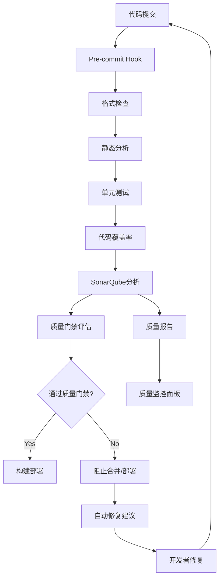

# Task 006: CI/CD质量门禁建设

## 任务目标

基于Task 004的代码质量工具集成成果，构建完整的CI/CD质量门禁体系。该系统将集成SonarQube、Roslyn Analyzers、自动化修复脚本等工具，在代码提交、构建和部署各个环节实施严格的质量控制，确保只有符合质量标准的代码才能进入生产环境。

## 技术要求

### CI/CD质量门禁架构

#### 质量门禁流水线设计



#### 多级质量门禁体系

**Level 1: 提交前检查 (Pre-commit)**
- 代码格式化验证
- 基础语法检查
- 增量静态分析
- 快速单元测试

**Level 2: 合并请求检查 (PR/MR)**
- 完整静态分析
- 全量单元测试
- 代码覆盖率检查
- SonarQube质量评估

**Level 3: 部署前检查 (Pre-deployment)**
- 集成测试
- 性能测试
- 安全扫描
- 最终质量确认

### GitHub Actions集成

#### 主工作流配置

```yaml
# .github/workflows/quality-gate.yml
name: Quality Gate Pipeline

on:
  push:
    branches: [ master, develop ]
  pull_request:
    branches: [ master, develop ]

env:
  DOTNET_VERSION: '8.0.x'
  SONAR_TOKEN: ${{ secrets.SONAR_TOKEN }}
  SONAR_HOST_URL: ${{ secrets.SONAR_HOST_URL }}

jobs:
  quality-check:
    name: Quality Gate Check
    runs-on: ubuntu-latest
    timeout-minutes: 30
    
    steps:
    - name: Checkout Code
      uses: actions/checkout@v4
      with:
        fetch-depth: 0  # 完整历史，用于SonarQube分析
    
    - name: Setup .NET
      uses: actions/setup-dotnet@v4
      with:
        dotnet-version: ${{ env.DOTNET_VERSION }}
    
    - name: Setup Java (SonarQube Scanner)
      uses: actions/setup-java@v4
      with:
        distribution: 'temurin'
        java-version: '17'
    
    # 缓存依赖
    - name: Cache NuGet packages
      uses: actions/cache@v3
      with:
        path: ~/.nuget/packages
        key: ${{ runner.os }}-nuget-${{ hashFiles('**/*.csproj') }}
    
    - name: Cache SonarQube packages
      uses: actions/cache@v3
      with:
        path: ~/.sonar/cache
        key: ${{ runner.os }}-sonar
    
    # 恢复依赖
    - name: Restore Dependencies
      run: dotnet restore
    
    # 代码格式检查
    - name: Code Format Verification
      run: |
        dotnet format --verify-no-changes --verbosity diagnostic
        if [ $? -ne 0 ]; then
          echo "❌ 代码格式不符合标准，请运行 'dotnet format' 修复"
          exit 1
        fi
    
    # 编译检查
    - name: Build Solution
      run: |
        dotnet build --configuration Release --no-restore --verbosity minimal
        if [ $? -ne 0 ]; then
          echo "❌ 编译失败"
          exit 1
        fi
    
    # 单元测试和覆盖率收集
    - name: Run Tests with Coverage
      run: |
        dotnet test --configuration Release --no-build \
          --collect:"XPlat Code Coverage" \
          --results-directory ./coverage \
          --logger trx \
          --verbosity minimal
    
    # 合并覆盖率报告
    - name: Merge Coverage Reports
      run: |
        dotnet tool install -g dotnet-reportgenerator-globaltool
        reportgenerator \
          -reports:"coverage/**/coverage.cobertura.xml" \
          -targetdir:"coverage-merged" \
          -reporttypes:"Cobertura;JsonSummary"
    
    # 检查覆盖率阈值
    - name: Coverage Threshold Check
      run: |
        python3 << 'EOF'
        import json
        
        with open('coverage-merged/Summary.json', 'r') as f:
            summary = json.load(f)
        
        line_coverage = summary['summary']['linecoverage']
        branch_coverage = summary['summary']['branchcoverage']
        
        print(f"代码覆盖率: {line_coverage:.1f}% (行), {branch_coverage:.1f}% (分支)")
        
        # 设置阈值
        line_threshold = 60.0
        branch_threshold = 50.0
        
        if line_coverage < line_threshold:
            print(f"❌ 行覆盖率 {line_coverage:.1f}% 低于阈值 {line_threshold}%")
            exit(1)
        
        if branch_coverage < branch_threshold:
            print(f"❌ 分支覆盖率 {branch_coverage:.1f}% 低于阈值 {branch_threshold}%")
            exit(1)
        
        print("✅ 代码覆盖率检查通过")
        EOF
    
    # SonarQube分析
    - name: SonarQube Analysis
      env:
        GITHUB_TOKEN: ${{ secrets.GITHUB_TOKEN }}
      run: |
        # 安装SonarScanner
        dotnet tool install --global dotnet-sonarscanner
        
        # 开始SonarQube分析
        dotnet sonarscanner begin \
          /k:"LYBTZYZS" \
          /d:sonar.host.url="${{ env.SONAR_HOST_URL }}" \
          /d:sonar.login="${{ env.SONAR_TOKEN }}" \
          /d:sonar.cs.opencover.reportsPaths="coverage-merged/Cobertura.xml" \
          /d:sonar.exclusions="**/bin/**,**/obj/**,**/*.Designer.cs"
        
        # 重新构建以进行分析
        dotnet build --configuration Release --no-restore
        
        # 结束分析并上传结果
        dotnet sonarscanner end /d:sonar.login="${{ env.SONAR_TOKEN }}"
    
    # 等待SonarQube质量门禁结果
    - name: SonarQube Quality Gate Check
      timeout-minutes: 5
      run: |
        python3 << 'EOF'
        import requests
        import time
        import base64
        import os
        
        sonar_url = os.environ['SONAR_HOST_URL']
        token = os.environ['SONAR_TOKEN']
        project_key = "LYBTZYZS"
        
        # 认证头
        auth_string = f"{token}:"
        auth_header = {'Authorization': f'Basic {base64.b64encode(auth_string.encode()).decode()}'}
        
        # 等待分析完成
        print("等待SonarQube分析完成...")
        max_attempts = 30
        for attempt in range(max_attempts):
            response = requests.get(
                f"{sonar_url}/api/qualitygates/project_status",
                params={'projectKey': project_key},
                headers=auth_header
            )
            
            if response.status_code == 200:
                result = response.json()
                status = result.get('projectStatus', {}).get('status', 'NONE')
                
                if status != 'NONE':
                    print(f"SonarQube质量门禁状态: {status}")
                    
                    if status == 'OK':
                        print("✅ SonarQube质量门禁检查通过")
                        break
                    elif status == 'ERROR':
                        print("❌ SonarQube质量门禁检查失败")
                        
                        # 输出失败的条件
                        conditions = result.get('projectStatus', {}).get('conditions', [])
                        for condition in conditions:
                            if condition.get('status') != 'OK':
                                metric = condition.get('metricKey')
                                actual = condition.get('actualValue') 
                                threshold = condition.get('errorThreshold')
                                print(f"  失败条件: {metric} = {actual} (阈值: {threshold})")
                        
                        exit(1)
                    else:
                        print(f"未知状态: {status}")
                        exit(1)
            
            time.sleep(10)
        else:
            print("❌ 等待SonarQube分析超时")
            exit(1)
        EOF
    
    # 生成质量报告
    - name: Generate Quality Report
      if: always()
      run: |
        python3 << 'EOF'
        import json
        import os
        from datetime import datetime
        
        # 收集质量数据
        quality_data = {
            'timestamp': datetime.now().isoformat(),
            'commit_sha': os.environ.get('GITHUB_SHA', ''),
            'branch': os.environ.get('GITHUB_REF_NAME', ''),
            'workflow_run_id': os.environ.get('GITHUB_RUN_ID', ''),
            'checks': {}
        }
        
        # 添加覆盖率数据
        try:
            with open('coverage-merged/Summary.json', 'r') as f:
                coverage = json.load(f)
                quality_data['checks']['coverage'] = {
                    'line_coverage': coverage['summary']['linecoverage'],
                    'branch_coverage': coverage['summary']['branchcoverage'],
                    'status': 'passed'
                }
        except:
            quality_data['checks']['coverage'] = {'status': 'failed'}
        
        # 保存质量报告
        with open('quality-report.json', 'w') as f:
            json.dump(quality_data, f, indent=2)
        
        print("质量报告已生成: quality-report.json")
        EOF
    
    # 上传构建产物
    - name: Upload Quality Report
      uses: actions/upload-artifact@v3
      if: always()
      with:
        name: quality-report
        path: |
          quality-report.json
          coverage-merged/
        retention-days: 30
    
    # 发送质量报告到PR
    - name: Comment PR with Quality Report
      uses: actions/github-script@v7
      if: github.event_name == 'pull_request'
      with:
        script: |
          const fs = require('fs');
          
          try {
            const report = JSON.parse(fs.readFileSync('quality-report.json'));
            const coverage = report.checks.coverage;
            
            const comment = `## 🔍 代码质量检查报告
            
            | 检查项 | 结果 | 详情 |
            |--------|------|------|
            | 📊 代码覆盖率 | ${coverage.status === 'passed' ? '✅' : '❌'} | 行覆盖率: ${coverage.line_coverage?.toFixed(1) || 'N/A'}%, 分支覆盖率: ${coverage.branch_coverage?.toFixed(1) || 'N/A'}% |
            | 🔧 代码格式 | ✅ | 格式检查通过 |
            | 🏗️ 编译检查 | ✅ | 编译成功 |
            | 🧪 单元测试 | ✅ | 测试通过 |
            
            > 📈 查看完整报告: [质量门禁详情](${{ github.server_url }}/${{ github.repository }}/actions/runs/${{ github.run_id }})
            `;
            
            github.rest.issues.createComment({
              issue_number: context.issue.number,
              owner: context.repo.owner,
              repo: context.repo.repo,
              body: comment
            });
          } catch (error) {
            console.error('生成PR评论失败:', error);
          }

  # 自动修复作业 (仅在质量检查失败时运行)
  auto-fix:
    name: Auto Fix Issues
    runs-on: ubuntu-latest
    needs: quality-check
    if: failure() && github.event_name == 'pull_request'
    
    steps:
    - name: Checkout Code
      uses: actions/checkout@v4
      with:
        token: ${{ secrets.GITHUB_TOKEN }}
        ref: ${{ github.head_ref }}
    
    - name: Setup .NET
      uses: actions/setup-dotnet@v4
      with:
        dotnet-version: ${{ env.DOTNET_VERSION }}
    
    - name: Setup Python
      uses: actions/setup-python@v4
      with:
        python-version: '3.11'
    
    - name: Install Auto-fix Dependencies
      run: |
        pip install -r scripts/requirements.txt
    
    - name: Run Auto-fix
      run: |
        cd scripts
        python auto_fix_manager.py --project-path ../LYBT.Server.sln --auto-only
    
    - name: Commit Auto-fixes
      run: |
        git config --local user.email "action@github.com"
        git config --local user.name "GitHub Action Auto-fix"
        
        if [ -n "$(git status --porcelain)" ]; then
          git add .
          git commit -m "🤖 自动修复代码质量问题
          
          - 修复编译错误和警告
          - 应用代码格式化
          - 修复可空性问题
          
          Co-authored-by: GitHub Actions <action@github.com>"
          
          git push
          
          echo "✅ 自动修复已提交"
        else
          echo "ℹ️ 没有需要修复的问题"
        fi

  # 部署前最终检查
  pre-deployment-check:
    name: Pre-deployment Quality Check
    runs-on: ubuntu-latest
    needs: quality-check
    if: github.ref == 'refs/heads/master' && github.event_name == 'push'
    
    steps:
    - name: Checkout Code
      uses: actions/checkout@v4
    
    - name: Final Security Scan
      run: |
        # 运行安全扫描
        echo "执行安全扫描..."
        # 这里可以集成具体的安全扫描工具
    
    - name: Performance Test
      run: |
        # 运行性能测试
        echo "执行性能测试..."
        # 这里可以集成性能测试工具
    
    - name: Final Quality Confirmation
      run: |
        echo "✅ 最终质量确认通过，可以部署"
```

#### 自动修复工作流

```yaml
# .github/workflows/auto-fix.yml
name: Auto Fix Code Issues

on:
  schedule:
    # 每天凌晨2点自动运行
    - cron: '0 2 * * *'
  workflow_dispatch:
    inputs:
      fix_scope:
        description: '修复范围'
        required: true
        default: 'warnings'
        type: choice
        options:
        - errors
        - warnings
        - all
      
      dry_run:
        description: '试运行模式'
        required: false
        default: false
        type: boolean

jobs:
  scheduled-auto-fix:
    name: Scheduled Auto Fix
    runs-on: ubuntu-latest
    if: github.ref == 'refs/heads/develop'
    
    steps:
    - name: Checkout Code
      uses: actions/checkout@v4
      with:
        token: ${{ secrets.BOT_TOKEN }}  # 使用Bot Token以便推送
    
    - name: Setup .NET
      uses: actions/setup-dotnet@v4
      with:
        dotnet-version: '8.0.x'
    
    - name: Setup Python
      uses: actions/setup-python@v4
      with:
        python-version: '3.11'
    
    - name: Install Dependencies
      run: |
        dotnet restore
        pip install -r scripts/requirements.txt
    
    - name: Run Comprehensive Auto-fix
      run: |
        cd scripts
        
        # 根据输入参数确定修复范围
        SCOPE="${{ github.event.inputs.fix_scope || 'warnings' }}"
        DRY_RUN="${{ github.event.inputs.dry_run || 'false' }}"
        
        if [ "$DRY_RUN" = "true" ]; then
          echo "🧪 试运行模式"
          python auto_fix_manager.py \
            --project-path ../LYBT.Server.sln \
            --scope $SCOPE \
            --dry-run
        else
          echo "🔧 执行自动修复"
          python auto_fix_manager.py \
            --project-path ../LYBT.Server.sln \
            --scope $SCOPE \
            --auto-commit
        fi
    
    - name: Create Pull Request
      if: github.event.inputs.dry_run != 'true'
      uses: peter-evans/create-pull-request@v5
      with:
        token: ${{ secrets.BOT_TOKEN }}
        branch: auto-fix/scheduled-${{ github.run_number }}
        title: "🤖 定期代码质量自动修复"
        body: |
          ## 🔧 自动修复报告
          
          此PR包含定期执行的代码质量自动修复：
          
          ### 修复内容
          - 编译错误和警告修复
          - 代码格式化标准化
          - 可空性问题处理
          - 未使用代码清理
          
          ### 安全保证
          - ✅ 所有修复都经过安全性验证
          - ✅ 修复前已创建备份
          - ✅ 修复后通过编译验证
          
          ### 验证步骤
          - [ ] 代码审查
          - [ ] 功能测试
          - [ ] 质量门禁检查
          
          > 🤖 此PR由GitHub Actions自动生成
          > 📊 详细报告: [查看工作流运行](${{ github.server_url }}/${{ github.repository }}/actions/runs/${{ github.run_id }})
        
        labels: |
          auto-fix
          code-quality
          bot
        
        reviewers: |
          senior-developers-team
```

### 本地Pre-commit Hook配置

#### Git Hook脚本

```bash
#!/bin/sh
# .git/hooks/pre-commit

echo "🔍 执行提交前质量检查..."

# 检查是否有暂存的文件
if git diff --cached --exit-code --quiet; then
    echo "ℹ️ 没有暂存的更改"
    exit 0
fi

# 创建临时目录
TEMP_DIR=$(mktemp -d)
trap "rm -rf $TEMP_DIR" EXIT

# 导出暂存的更改到临时目录
git checkout-index --prefix="$TEMP_DIR/" -a

# 进入临时目录
cd "$TEMP_DIR"

# 1. 代码格式检查
echo "📝 检查代码格式..."
if ! dotnet format --verify-no-changes --verbosity minimal; then
    echo "❌ 代码格式不符合标准"
    echo "💡 请运行 'dotnet format' 修复格式问题"
    exit 1
fi

# 2. 编译检查
echo "🏗️ 检查编译..."
if ! dotnet build --configuration Debug --verbosity minimal > /dev/null 2>&1; then
    echo "❌ 代码编译失败"
    echo "💡 请修复编译错误后再提交"
    exit 1
fi

# 3. 运行快速单元测试 (只测试相关的变更)
echo "🧪 运行快速测试..."
CHANGED_FILES=$(git diff --cached --name-only --diff-filter=AM | grep '\.cs$' | grep -v '\.Designer\.cs$' | head -10)

if [ -n "$CHANGED_FILES" ]; then
    # 运行受影响模块的测试
    if ! timeout 60s dotnet test --configuration Debug --verbosity minimal --no-build > /dev/null 2>&1; then
        echo "⚠️ 快速测试未通过，但不阻止提交"
        echo "💡 请确保在推送前运行完整测试"
    fi
fi

# 4. 基础静态分析检查
echo "🔍 运行静态分析..."
python3 scripts/quick-static-analysis.py --staged-only

if [ $? -ne 0 ]; then
    echo "❌ 静态分析发现问题"
    echo "💡 请修复静态分析警告，或使用 --no-verify 跳过检查"
    exit 1
fi

echo "✅ 提交前检查通过"
exit 0
```

#### 快速静态分析脚本

```python
#!/usr/bin/env python3
# scripts/quick-static-analysis.py

import subprocess
import sys
import re
import argparse
from pathlib import Path

class QuickStaticAnalyzer:
    def __init__(self):
        self.critical_patterns = [
            (r'Console\.WriteLine\((?!.*Debug|.*Test)', 'Console.WriteLine in production code'),
            (r'throw new NotImplementedException', 'NotImplementedException found'),
            (r'//\s*TODO(?!.*test)', 'TODO comment in production code'),
            (r'#if\s+DEBUG.*#endif', 'Debug-only code block'),
            (r'catch\s*\([^)]*\)\s*\{\s*\}', 'Empty catch block'),
            (r'catch\s*\([^)]*\)\s*\{\s*//.*\}', 'Catch block with only comments')
        ]
        
        self.warning_patterns = [
            (r'var\s+\w+\s*=\s*null;', 'Explicit null assignment'),
            (r'\.Result\b', 'Sync over async (.Result)'),
            (r'\.Wait\(\)', 'Sync over async (.Wait())'),
            (r'Thread\.Sleep', 'Thread.Sleep usage'),
            (r'Task\.Delay\(0\)', 'Task.Delay(0) usage')
        ]

    def get_staged_files(self):
        """获取Git暂存的C#文件"""
        try:
            result = subprocess.run(
                ['git', 'diff', '--cached', '--name-only', '--diff-filter=AM'],
                capture_output=True,
                text=True,
                check=True
            )
            
            files = []
            for line in result.stdout.strip().split('\n'):
                if line.endswith('.cs') and not line.endswith('.Designer.cs'):
                    if Path(line).exists():
                        files.append(line)
            
            return files
            
        except subprocess.CalledProcessError:
            return []

    def analyze_file(self, file_path):
        """分析单个文件"""
        try:
            with open(file_path, 'r', encoding='utf-8') as f:
                content = f.read()
                lines = content.split('\n')
                
            issues = []
            
            for line_num, line in enumerate(lines, 1):
                # 跳过注释行
                if line.strip().startswith('//') or line.strip().startswith('*'):
                    continue
                    
                # 检查关键问题
                for pattern, message in self.critical_patterns:
                    if re.search(pattern, line):
                        issues.append({
                            'file': file_path,
                            'line': line_num,
                            'type': 'error',
                            'message': message,
                            'content': line.strip()
                        })
                
                # 检查警告问题
                for pattern, message in self.warning_patterns:
                    if re.search(pattern, line):
                        issues.append({
                            'file': file_path,
                            'line': line_num,
                            'type': 'warning',
                            'message': message,
                            'content': line.strip()
                        })
            
            return issues
            
        except Exception as e:
            return [{
                'file': file_path,
                'line': 0,
                'type': 'error',
                'message': f'文件分析失败: {str(e)}',
                'content': ''
            }]

    def run_analysis(self, staged_only=False):
        """运行分析"""
        
        if staged_only:
            files = self.get_staged_files()
            if not files:
                print("ℹ️ 没有暂存的C#文件需要分析")
                return True
        else:
            # 分析所有C#文件
            files = []
            for cs_file in Path('.').rglob('*.cs'):
                if 'bin' not in str(cs_file) and 'obj' not in str(cs_file) and not str(cs_file).endswith('.Designer.cs'):
                    files.append(str(cs_file))
        
        all_issues = []
        for file_path in files:
            issues = self.analyze_file(file_path)
            all_issues.extend(issues)
        
        # 分类统计
        errors = [i for i in all_issues if i['type'] == 'error']
        warnings = [i for i in all_issues if i['type'] == 'warning']
        
        # 输出结果
        if errors:
            print("❌ 发现关键问题:")
            for error in errors:
                print(f"  {error['file']}:{error['line']} - {error['message']}")
                print(f"    {error['content']}")
        
        if warnings:
            print("⚠️ 发现警告:")
            for warning in warnings[:5]:  # 只显示前5个警告
                print(f"  {warning['file']}:{warning['line']} - {warning['message']}")
        
        if len(warnings) > 5:
            print(f"  ... 还有 {len(warnings) - 5} 个警告")
        
        # 返回结果
        if errors:
            print(f"\n❌ 静态分析失败: {len(errors)} 个错误, {len(warnings)} 个警告")
            return False
        elif warnings:
            print(f"\n⚠️ 静态分析发现 {len(warnings)} 个警告，但允许提交")
            return True
        else:
            print("✅ 静态分析检查通过")
            return True

def main():
    parser = argparse.ArgumentParser(description='快速静态代码分析')
    parser.add_argument('--staged-only', action='store_true', help='只分析Git暂存的文件')
    
    args = parser.parse_args()
    
    analyzer = QuickStaticAnalyzer()
    success = analyzer.run_analysis(staged_only=args.staged_only)
    
    sys.exit(0 if success else 1)

if __name__ == '__main__':
    main()
```

### 质量监控面板

#### 质量数据收集器

```python
# scripts/quality-dashboard-collector.py
import json
import requests
import sqlite3
from datetime import datetime, timedelta
import os

class QualityDataCollector:
    def __init__(self, db_path="quality_metrics.db"):
        self.db_path = db_path
        self.init_database()
        
    def init_database(self):
        """初始化数据库表"""
        conn = sqlite3.connect(self.db_path)
        cursor = conn.cursor()
        
        cursor.execute('''
            CREATE TABLE IF NOT EXISTS quality_metrics (
                id INTEGER PRIMARY KEY AUTOINCREMENT,
                timestamp DATETIME,
                commit_sha TEXT,
                branch TEXT,
                build_number TEXT,
                line_coverage REAL,
                branch_coverage REAL,
                duplicated_lines_density REAL,
                maintainability_rating INTEGER,
                reliability_rating INTEGER,
                security_rating INTEGER,
                code_smells INTEGER,
                bugs INTEGER,
                vulnerabilities INTEGER,
                tech_debt_minutes INTEGER,
                build_status TEXT,
                test_count INTEGER,
                test_passed INTEGER,
                compilation_warnings INTEGER,
                compilation_errors INTEGER
            )
        ''')
        
        conn.commit()
        conn.close()

    def collect_sonarqube_metrics(self, project_key="LYBTZYZS"):
        """从SonarQube收集质量指标"""
        
        sonar_url = os.environ.get('SONAR_HOST_URL', 'http://localhost:9000')
        token = os.environ.get('SONAR_TOKEN', 'admin')
        
        headers = {'Authorization': f'Bearer {token}'}
        
        # 获取项目质量指标
        metrics = [
            'coverage', 'branch_coverage', 'duplicated_lines_density',
            'maintainability_rating', 'reliability_rating', 'security_rating',
            'code_smells', 'bugs', 'vulnerabilities', 'sqale_index'
        ]
        
        try:
            response = requests.get(
                f"{sonar_url}/api/measures/component",
                params={
                    'component': project_key,
                    'metricKeys': ','.join(metrics)
                },
                headers=headers,
                timeout=30
            )
            
            if response.status_code == 200:
                data = response.json()
                measures = data.get('component', {}).get('measures', [])
                
                metrics_dict = {}
                for measure in measures:
                    metric_key = measure['metric']
                    value = measure.get('value', 0)
                    metrics_dict[metric_key] = float(value) if value else 0.0
                
                return metrics_dict
            else:
                print(f"SonarQube API错误: {response.status_code}")
                return {}
                
        except Exception as e:
            print(f"收集SonarQube指标失败: {e}")
            return {}

    def collect_build_metrics(self):
        """收集构建相关指标"""
        
        build_info = {
            'commit_sha': os.environ.get('GITHUB_SHA', ''),
            'branch': os.environ.get('GITHUB_REF_NAME', ''),
            'build_number': os.environ.get('GITHUB_RUN_NUMBER', ''),
            'build_status': 'unknown'
        }
        
        # 尝试从构建日志中提取指标
        try:
            # 读取测试结果
            test_results = self.parse_test_results()
            build_info.update(test_results)
            
            # 读取编译警告/错误
            compilation_stats = self.parse_compilation_log()
            build_info.update(compilation_stats)
            
        except Exception as e:
            print(f"收集构建指标失败: {e}")
        
        return build_info

    def parse_test_results(self):
        """解析测试结果"""
        
        # 查找测试结果文件
        test_files = []
        for root, dirs, files in os.walk('.'):
            for file in files:
                if file.endswith('.trx') or 'TestResults' in file:
                    test_files.append(os.path.join(root, file))
        
        total_tests = 0
        passed_tests = 0
        
        # 这里可以解析具体的测试结果文件
        # 简化示例，实际应该解析XML或JSON格式的测试报告
        
        return {
            'test_count': total_tests,
            'test_passed': passed_tests
        }

    def parse_compilation_log(self):
        """解析编译日志"""
        
        warnings = 0
        errors = 0
        
        # 查找编译日志
        if os.path.exists('build.log'):
            try:
                with open('build.log', 'r', encoding='utf-8') as f:
                    content = f.read()
                    
                import re
                warnings = len(re.findall(r'warning CS\d+:', content))
                errors = len(re.findall(r'error CS\d+:', content))
                
            except Exception as e:
                print(f"解析编译日志失败: {e}")
        
        return {
            'compilation_warnings': warnings,
            'compilation_errors': errors
        }

    def store_metrics(self, sonar_metrics, build_metrics):
        """存储质量指标到数据库"""
        
        conn = sqlite3.connect(self.db_path)
        cursor = conn.cursor()
        
        cursor.execute('''
            INSERT INTO quality_metrics (
                timestamp, commit_sha, branch, build_number,
                line_coverage, branch_coverage, duplicated_lines_density,
                maintainability_rating, reliability_rating, security_rating,
                code_smells, bugs, vulnerabilities, tech_debt_minutes,
                build_status, test_count, test_passed,
                compilation_warnings, compilation_errors
            ) VALUES (?, ?, ?, ?, ?, ?, ?, ?, ?, ?, ?, ?, ?, ?, ?, ?, ?, ?, ?)
        ''', (
            datetime.now().isoformat(),
            build_metrics.get('commit_sha', ''),
            build_metrics.get('branch', ''),
            build_metrics.get('build_number', ''),
            sonar_metrics.get('coverage', 0),
            sonar_metrics.get('branch_coverage', 0),
            sonar_metrics.get('duplicated_lines_density', 0),
            sonar_metrics.get('maintainability_rating', 0),
            sonar_metrics.get('reliability_rating', 0),
            sonar_metrics.get('security_rating', 0),
            sonar_metrics.get('code_smells', 0),
            sonar_metrics.get('bugs', 0),
            sonar_metrics.get('vulnerabilities', 0),
            sonar_metrics.get('sqale_index', 0),
            build_metrics.get('build_status', 'unknown'),
            build_metrics.get('test_count', 0),
            build_metrics.get('test_passed', 0),
            build_metrics.get('compilation_warnings', 0),
            build_metrics.get('compilation_errors', 0)
        ))
        
        conn.commit()
        conn.close()
        
        print("✅ 质量指标已存储")

    def generate_quality_report(self, days=30):
        """生成质量报告"""
        
        conn = sqlite3.connect(self.db_path)
        cursor = conn.cursor()
        
        since_date = datetime.now() - timedelta(days=days)
        
        cursor.execute('''
            SELECT * FROM quality_metrics
            WHERE timestamp > ?
            ORDER BY timestamp DESC
        ''', (since_date.isoformat(),))
        
        rows = cursor.fetchall()
        columns = [desc[0] for desc in cursor.description]
        
        metrics = []
        for row in rows:
            metrics.append(dict(zip(columns, row)))
        
        conn.close()
        
        # 生成趋势分析
        if metrics:
            latest = metrics[0]
            oldest = metrics[-1] if len(metrics) > 1 else latest
            
            coverage_trend = latest['line_coverage'] - oldest['line_coverage']
            quality_trend = latest['maintainability_rating'] - oldest['maintainability_rating']
            
            report = {
                'period': f"过去{days}天",
                'total_builds': len(metrics),
                'latest_metrics': latest,
                'trends': {
                    'coverage_change': coverage_trend,
                    'quality_change': quality_trend,
                    'bugs_trend': latest['bugs'] - oldest['bugs'],
                    'vulnerabilities_trend': latest['vulnerabilities'] - oldest['vulnerabilities']
                },
                'history': metrics
            }
            
            # 保存报告
            with open('quality-dashboard-report.json', 'w', encoding='utf-8') as f:
                json.dump(report, f, ensure_ascii=False, indent=2)
            
            return report
        
        return {'error': '没有足够的数据生成报告'}

def main():
    collector = QualityDataCollector()
    
    # 收集质量指标
    print("收集SonarQube质量指标...")
    sonar_metrics = collector.collect_sonarqube_metrics()
    
    print("收集构建质量指标...")
    build_metrics = collector.collect_build_metrics()
    
    # 存储指标
    if sonar_metrics or build_metrics:
        collector.store_metrics(sonar_metrics, build_metrics)
        
        # 生成报告
        report = collector.generate_quality_report()
        print("✅ 质量报告已生成: quality-dashboard-report.json")
    else:
        print("❌ 没有收集到质量指标")

if __name__ == '__main__':
    main()
```

## 实施步骤

### Phase 1: GitHub Actions质量门禁配置 (3小时)

**1.1 主质量门禁流水线开发**
- 编写完整的quality-gate.yml工作流
- 配置代码格式、编译、测试、覆盖率检查
- 集成SonarQube分析和质量门禁

**1.2 自动修复工作流开发**  
- 实现定期自动修复工作流
- 配置自动PR创建机制
- 设置修复失败时的通知机制

### Phase 2: 本地开发环境集成 (2小时)

**2.1 Pre-commit Hook配置**
- 实现Git pre-commit hook脚本
- 开发快速静态分析工具
- 配置本地质量检查工具链

**2.2 开发者工具集成**
- VS Code/Visual Studio扩展推荐
- 本地SonarLint配置
- IDE实时质量反馈配置

### Phase 3: 质量监控体系建设 (2小时)

**3.1 质量数据收集系统**
- 实现质量指标收集器
- 配置数据存储和历史跟踪
- 建立质量趋势分析

**3.2 质量报告和面板**
- 开发质量监控面板
- 实现质量报告生成
- 配置质量告警机制

### Phase 4: 测试和优化 (1小时)

**4.1 端到端测试**
- 完整流水线测试
- 质量门禁有效性验证
- 性能优化和调优

## 交付物

### 必须交付

1. **GitHub Actions工作流**:
   - `.github/workflows/quality-gate.yml` - 主质量门禁流水线
   - `.github/workflows/auto-fix.yml` - 自动修复工作流
   - `.github/workflows/quality-monitoring.yml` - 质量监控工作流

2. **本地开发工具**:
   - `.git/hooks/pre-commit` - Git提交前检查
   - `scripts/quick-static-analysis.py` - 快速静态分析
   - `scripts/setup-dev-environment.sh` - 开发环境配置

3. **质量监控系统**:
   - `scripts/quality-dashboard-collector.py` - 质量数据收集器
   - `quality-dashboard/` - 质量监控面板
   - 质量报告模板和生成脚本

4. **配置和文档**:
   - CI/CD配置文档
   - 质量标准说明
   - 故障排除指南

### 配置文件

```json
{
  "quality_gates": {
    "thresholds": {
      "line_coverage": 60.0,
      "branch_coverage": 50.0,
      "duplicated_lines_density": 5.0,
      "maintainability_rating": 1,
      "reliability_rating": 1,
      "security_rating": 1
    },
    "blocking_conditions": {
      "compilation_errors": 0,
      "critical_bugs": 0,
      "critical_vulnerabilities": 0
    },
    "warning_limits": {
      "code_smells": 50,
      "minor_bugs": 10,
      "compilation_warnings": 100
    }
  },
  "auto_fix": {
    "enabled": true,
    "max_fixes_per_pr": 50,
    "confidence_threshold": 0.8,
    "allowed_fix_types": [
      "formatting",
      "nullability",
      "unused_code",
      "simple_refactoring"
    ]
  },
  "notifications": {
    "quality_gate_failure": {
      "slack_webhook": "${SLACK_WEBHOOK_URL}",
      "email_recipients": ["dev-team@company.com"]
    }
  }
}
```

## 成功标准

### 技术标准

- [ ] 质量门禁100%拦截低质量代码
- [ ] 自动修复成功率 ≥ 80%
- [ ] 质量检查流水线运行时间 ≤ 15分钟
- [ ] 质量数据收集完整性 ≥ 95%

### 质量标准

- [ ] 代码覆盖率持续 ≥ 60%
- [ ] 编译警告数量趋势下降
- [ ] 技术债务控制在可接受范围内
- [ ] 安全漏洞100%及时发现和修复

### 自动化标准

- [ ] 100%自动化质量检查流程
- [ ] 质量问题自动通知和跟踪
- [ ] 质量趋势自动分析和报告
- [ ] 开发者零配置质量工具链

## 风险与缓解

### 高风险

1. **质量门禁过于严格影响开发效率**
   - 缓解: 分级质量门禁，关键路径放宽标准
   - 优化: 持续调整阈值，平衡质量和效率

2. **CI/CD流水线性能问题**
   - 缓解: 并行执行，增量检查优化
   - 监控: 实时性能监控和告警

### 中风险

1. **自动修复误操作**
   - 缓解: 严格的置信度阈值和人工审核
   - 保护: 完整的备份和回滚机制

2. **质量工具配置复杂性**
   - 缓解: 标准化配置模板
   - 文档: 详细的配置和故障排除文档

---

**任务负责人**: DevOps工程师 + 质量保证工程师  
**预计工作量**: 8小时  
**完成标准**: 完整的CI/CD质量门禁体系运行稳定，质量控制有效