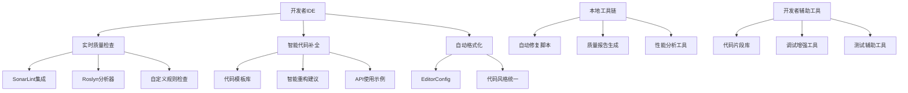

# Task 007: 开发环境优化

## 任务目标

基于Task 005的自动化修复脚本开发成果，优化本地开发环境配置，集成质量工具链和自动化脚本，提供无缝的开发者体验。通过IDE集成、实时质量反馈、智能代码辅助等手段，让开发者在编码过程中就能发现和修复质量问题，从源头确保代码质量。

## 技术要求

### 开发环境架构设计

#### 集成化开发环境



#### 核心组件

**1. IDE扩展和插件体系**
- Visual Studio扩展开发
- VS Code扩展配置
- JetBrains Rider配置
- 统一的代码质量集成

**2. 实时质量反馈系统**
- 编码时即时错误提示
- 质量问题高亮显示
- 修复建议自动提示
- 代码度量实时显示

**3. 智能代码辅助系统**
- 项目特定代码模板
- 自动化重构工具
- 智能代码生成
- 最佳实践建议

### Visual Studio集成开发

#### 项目模板和代码片段

**项目模板定义**

```xml
<!-- templates/LYBTModuleTemplate/LYBTModuleTemplate.vstemplate -->
<VSTemplate Version="3.0.0" Type="Project" xmlns="http://schemas.microsoft.com/developer/vstemplate/2008">
  <TemplateData>
    <Name>LYBT业务模块模板</Name>
    <Description>创建符合LYBT架构标准的业务模块</Description>
    <Icon>icon.ico</Icon>
    <ProjectType>CSharp</ProjectType>
    <RequiredFrameworkVersion>8.0</RequiredFrameworkVersion>
    <SortOrder>1000</SortOrder>
    <TemplateID>LYBT.Module.Template</TemplateID>
    <CreateNewFolder>true</CreateNewFolder>
    <DefaultName>LYBT.Module</DefaultName>
    <ProvideDefaultName>true</ProvideDefaultName>
  </TemplateData>
  
  <TemplateContent>
    <Project File="ModuleTemplate.csproj" ReplaceParameters="true">
      <ProjectItem ReplaceParameters="true" TargetFileName="Services\I$safeprojectname$Service.cs">IModuleService.cs</ProjectItem>
      <ProjectItem ReplaceParameters="true" TargetFileName="Services\$safeprojectname$Service.cs">ModuleService.cs</ProjectItem>
      <ProjectItem ReplaceParameters="true" TargetFileName="Services\$safeprojectname$QueryService.cs">ModuleQueryService.cs</ProjectItem>
      <ProjectItem ReplaceParameters="true" TargetFileName="Services\$safeprojectname$BusinessService.cs">ModuleBusinessService.cs</ProjectItem>
      <ProjectItem ReplaceParameters="true" TargetFileName="Models\$safeprojectname$Dto.cs">ModuleDto.cs</ProjectItem>
      <ProjectItem ReplaceParameters="true" TargetFileName="Mapping\$safeprojectname$MappingProfile.cs">ModuleMappingProfile.cs</ProjectItem>
      <ProjectItem ReplaceParameters="true" TargetFileName="Controllers\$safeprojectname$Controller.cs">ModuleController.cs</ProjectItem>
    </Project>
  </TemplateContent>
  
  <WizardExtension>
    <Assembly>ModuleTemplateWizard, Version=1.0.0.0, Culture=neutral, PublicKeyToken=null</Assembly>
    <FullClassName>ModuleTemplateWizard.ModuleWizard</FullClassName>
  </WizardExtension>
</VSTemplate>
```

**代码片段库**

```xml
<!-- snippets/lybt-service-method.snippet -->
<?xml version="1.0" encoding="utf-8"?>
<CodeSnippets xmlns="http://schemas.microsoft.com/VisualStudio/2005/CodeSnippet">
    <CodeSnippet Format="1.0.0">
        <Header>
            <Title>LYBT Service Method</Title>
            <Shortcut>lybt-method</Shortcut>
            <Description>创建符合LYBT标准的Service方法</Description>
        </Header>
        <Snippet>
            <Declarations>
                <Literal>
                    <ID>methodName</ID>
                    <ToolTip>方法名称</ToolTip>
                    <Default>MethodName</Default>
                </Literal>
                <Literal>
                    <ID>returnType</ID>
                    <ToolTip>返回类型</ToolTip>
                    <Default>Entity</Default>
                </Literal>
                <Literal>
                    <ID>paramType</ID>
                    <ToolTip>参数类型</ToolTip>
                    <Default>Guid</Default>
                </Literal>
                <Literal>
                    <ID>paramName</ID>
                    <ToolTip>参数名称</ToolTip>
                    <Default>id</Default>
                </Literal>
            </Declarations>
            <Code Language="csharp">
                <![CDATA[/// <summary>
                /// $methodName$
                /// </summary>
                /// <param name="$paramName$">$paramName$</param>
                /// <returns>Service result containing $returnType$</returns>
                public async Task<ServiceResult<$returnType$>> $methodName$Async($paramType$ $paramName$)
                {
                    try
                    {
                        // 参数验证
                        if ($paramName$ == Guid.Empty)
                        {
                            return ServiceResult<$returnType$>.Failure("无效的参数");
                        }
                        
                        // TODO: 实现业务逻辑
                        
                        // 返回成功结果
                        return ServiceResult<$returnType$>.Success(result);
                    }
                    catch (Exception ex)
                    {
                        _logger.LogError(ex, "执行 $methodName$ 时发生错误: {ParamName}", $paramName$);
                        return ServiceResult<$returnType$>.Failure($"执行 $methodName$ 失败: {ex.Message}");
                    }
                }$end$]]>
            </Code>
        </Snippet>
    </CodeSnippet>
</CodeSnippets>
```

#### Visual Studio扩展开发

```csharp
// VSExtension/LYBTDeveloperTools/LYBTPackage.cs
using Microsoft.VisualStudio.Shell;
using Microsoft.VisualStudio.Shell.Interop;
using System;
using System.ComponentModel.Design;
using System.Threading;
using System.Threading.Tasks;

[PackageRegistration(UseManagedResourcesOnly = true, AllowsBackgroundLoading = true)]
[ProvideMenuResource("Menus.ctmenu", 1)]
[Guid(LYBTPackage.PackageGuidString)]
public sealed class LYBTPackage : AsyncPackage
{
    public const string PackageGuidString = "12345678-1234-1234-1234-123456789ABC";

    protected override async Task InitializeAsync(CancellationToken cancellationToken, IProgress<ServiceProgressData> progress)
    {
        await this.JoinableTaskFactory.SwitchToMainThreadAsync(cancellationToken);
        
        // 初始化命令
        await LYBTCommands.InitializeAsync(this);
        
        // 初始化质量检查器
        await QualityChecker.InitializeAsync(this);
        
        // 初始化代码生成器
        await CodeGenerator.InitializeAsync(this);
    }
}

// 质量检查器
public class QualityChecker
{
    private static QualityChecker instance;
    private Package package;
    
    public static async Task InitializeAsync(AsyncPackage package)
    {
        await ThreadHelper.JoinableTaskFactory.SwitchToMainThreadAsync();
        
        var commandService = await package.GetServiceAsync<IMenuCommandService, IMenuCommandService>();
        instance = new QualityChecker(package, commandService);
    }
    
    private QualityChecker(Package package, IMenuCommandService commandService)
    {
        this.package = package;
        
        // 注册质量检查命令
        var menuCommandID = new CommandID(CommandSet, CommandId);
        var menuItem = new MenuCommand(this.RunQualityCheck, menuCommandID);
        commandService.AddCommand(menuItem);
        
        // 注册文档事件监听
        var dte = Package.GetGlobalService(typeof(SDTE)) as DTE2;
        if (dte != null)
        {
            dte.Events.DocumentEvents.DocumentSaved += OnDocumentSaved;
        }
    }
    
    private void OnDocumentSaved(Document document)
    {
        // 文档保存时自动运行质量检查
        if (document.Name.EndsWith(".cs"))
        {
            RunQuickQualityCheck(document.FullName);
        }
    }
    
    private void RunQuickQualityCheck(string filePath)
    {
        // 运行快速质量检查
        var checker = new FileQualityChecker();
        var issues = checker.AnalyzeFile(filePath);
        
        if (issues.Any())
        {
            ShowQualityIssues(issues);
        }
    }
    
    private void ShowQualityIssues(List<QualityIssue> issues)
    {
        // 在Error List中显示质量问题
        var errorListProvider = new ErrorListProvider(package);
        
        foreach (var issue in issues)
        {
            var error = new ErrorTask()
            {
                ErrorCategory = TaskErrorCategory.Warning,
                Category = TaskCategory.CodeSense,
                Text = issue.Message,
                Document = issue.FilePath,
                Line = issue.LineNumber - 1,
                Column = issue.ColumnNumber - 1
            };
            
            error.Navigate += (sender, args) => {
                // 跳转到问题位置
                var dte = Package.GetGlobalService(typeof(SDTE)) as DTE2;
                dte?.ItemOperations.OpenFile(issue.FilePath);
                dte?.ExecuteCommand("Edit.GoTo", $"{issue.LineNumber}");
            };
            
            errorListProvider.Tasks.Add(error);
        }
    }
    
    private void RunQualityCheck(object sender, EventArgs e)
    {
        // 运行完整项目质量检查
        var task = Task.Run(async () =>
        {
            var qualityRunner = new ProjectQualityRunner();
            var report = await qualityRunner.RunFullQualityCheckAsync();
            
            await ThreadHelper.JoinableTaskFactory.SwitchToMainThreadAsync();
            ShowQualityReport(report);
        });
    }
    
    private void ShowQualityReport(QualityReport report)
    {
        // 显示质量报告窗口
        var window = package.FindToolWindow(typeof(QualityReportWindow), 0, true);
        if (window?.Frame is IVsWindowFrame windowFrame)
        {
            windowFrame.Show();
            ((QualityReportWindow)window).UpdateReport(report);
        }
    }
}

// 文件质量检查器
public class FileQualityChecker
{
    private readonly List<IQualityRule> rules;
    
    public FileQualityChecker()
    {
        rules = new List<IQualityRule>
        {
            new NullabilityRule(),
            new AsyncMethodRule(),
            new UnusedCodeRule(),
            new PerformanceRule(),
            new SecurityRule()
        };
    }
    
    public List<QualityIssue> AnalyzeFile(string filePath)
    {
        var issues = new List<QualityIssue>();
        
        try
        {
            var content = File.ReadAllText(filePath);
            var lines = content.Split('\n');
            
            foreach (var rule in rules)
            {
                var ruleIssues = rule.Analyze(filePath, lines);
                issues.AddRange(ruleIssues);
            }
        }
        catch (Exception ex)
        {
            // 记录分析错误
            issues.Add(new QualityIssue
            {
                FilePath = filePath,
                LineNumber = 1,
                ColumnNumber = 1,
                Severity = QualitySeverity.Error,
                Message = $"文件分析失败: {ex.Message}"
            });
        }
        
        return issues;
    }
}

// 质量规则接口
public interface IQualityRule
{
    string Name { get; }
    QualitySeverity DefaultSeverity { get; }
    List<QualityIssue> Analyze(string filePath, string[] lines);
}

// 可空性规则检查
public class NullabilityRule : IQualityRule
{
    public string Name => "可空性检查";
    public QualitySeverity DefaultSeverity => QualitySeverity.Warning;
    
    public List<QualityIssue> Analyze(string filePath, string[] lines)
    {
        var issues = new List<QualityIssue>();
        
        for (int i = 0; i < lines.Length; i++)
        {
            var line = lines[i];
            
            // 检查未初始化的不可空字段
            if (Regex.IsMatch(line, @"private readonly \w+ \w+;"))
            {
                issues.Add(new QualityIssue
                {
                    FilePath = filePath,
                    LineNumber = i + 1,
                    ColumnNumber = 1,
                    Severity = QualitySeverity.Warning,
                    Message = "不可空字段未初始化，建议添加 = null!",
                    RuleName = Name,
                    FixAvailable = true,
                    FixAction = () => ApplyNullForgivingFix(filePath, i)
                });
            }
        }
        
        return issues;
    }
    
    private void ApplyNullForgivingFix(string filePath, int lineIndex)
    {
        // 应用null!修复
        var lines = File.ReadAllLines(filePath);
        var line = lines[lineIndex];
        
        // 在分号前添加 = null!
        lines[lineIndex] = Regex.Replace(line, @";$", " = null!;");
        
        File.WriteAllLines(filePath, lines);
    }
}

// 质量问题数据模型
public class QualityIssue
{
    public string FilePath { get; set; }
    public int LineNumber { get; set; }
    public int ColumnNumber { get; set; }
    public QualitySeverity Severity { get; set; }
    public string Message { get; set; }
    public string RuleName { get; set; }
    public bool FixAvailable { get; set; }
    public Action FixAction { get; set; }
}

public enum QualitySeverity
{
    Info,
    Warning,  
    Error,
    Critical
}
```

### VS Code开发环境配置

#### 工作空间配置

```json
// .vscode/settings.json
{
  "dotnet.server.useOmnisharp": false,
  "dotnet.completion.showCompletionItemsFromUnimportedNamespaces": true,
  "dotnet.inlayHints.enableInlayHintsForParameters": true,
  "dotnet.inlayHints.enableInlayHintsForLiteralParameters": true,
  "dotnet.inlayHints.enableInlayHintsForIndexerParameters": true,
  "dotnet.inlayHints.enableInlayHintsForObjectCreationParameters": true,
  "dotnet.inlayHints.enableInlayHintsForOtherParameters": true,
  "dotnet.inlayHints.suppressInlayHintsForParametersThatDifferOnlyBySuffix": true,
  "dotnet.inlayHints.suppressInlayHintsForParametersThatMatchMethodIntent": true,
  "dotnet.inlayHints.suppressInlayHintsForParametersThatMatchArgumentName": true,
  
  // 代码格式化
  "editor.formatOnSave": true,
  "editor.formatOnPaste": true,
  "editor.formatOnType": true,
  "editor.codeActionsOnSave": {
    "source.fixAll": true,
    "source.organizeImports": true
  },
  
  // 文件监控
  "files.watcherExclude": {
    "**/bin/**": true,
    "**/obj/**": true,
    "**/.git/**": true,
    "**/node_modules/**": true
  },
  
  // SonarLint配置
  "sonarlint.connectedMode.project": {
    "connectionId": "LYBTZYZS-SonarQube",
    "projectKey": "LYBTZYZS"
  },
  
  // 质量工具配置
  "csharp.semanticHighlighting.enabled": true,
  "csharp.format.enable": true,
  "csharp.showOmnisharpLogOnError": true,
  
  // 自定义任务触发
  "files.associations": {
    "*.cs": "csharp"
  },
  
  // 代码度量显示
  "codemetrics.basics.DecorationModeEnabled": true,
  "codemetrics.basics.CodeLensEnabled": true
}
```

#### 任务配置

```json
// .vscode/tasks.json
{
  "version": "2.0.0",
  "tasks": [
    {
      "label": "LYBT: 质量检查",
      "type": "shell",
      "command": "python",
      "args": ["scripts/quick-quality-check.py", "--current-file"],
      "group": {
        "kind": "test",
        "isDefault": false
      },
      "presentation": {
        "echo": true,
        "reveal": "always",
        "focus": false,
        "panel": "shared",
        "showReuseMessage": true,
        "clear": false
      },
      "problemMatcher": {
        "owner": "lybt-quality",
        "fileLocation": "absolute",
        "pattern": {
          "regexp": "^(.*):(\\d+):(\\d+):\\s+(warning|error|info)\\s+(.*)$",
          "file": 1,
          "line": 2,
          "column": 3,
          "severity": 4,
          "message": 5
        }
      }
    },
    {
      "label": "LYBT: 自动修复",
      "type": "shell",
      "command": "python",
      "args": ["scripts/auto_fix_manager.py", "--current-file", "--interactive"],
      "group": {
        "kind": "build",
        "isDefault": false
      },
      "presentation": {
        "echo": true,
        "reveal": "always",
        "focus": true,
        "panel": "shared"
      }
    },
    {
      "label": "LYBT: 代码格式化",
      "type": "shell", 
      "command": "dotnet",
      "args": ["format", "${workspaceFolder}"],
      "group": {
        "kind": "build",
        "isDefault": false
      },
      "presentation": {
        "echo": true,
        "reveal": "silent",
        "panel": "shared"
      }
    },
    {
      "label": "LYBT: 生成代码模板",
      "type": "shell",
      "command": "python",
      "args": ["tools/code-generator.py", "--interactive"],
      "group": {
        "kind": "build",
        "isDefault": false
      },
      "presentation": {
        "echo": true,
        "reveal": "always",
        "focus": true,
        "panel": "dedicated"
      }
    }
  ]
}
```

#### 扩展推荐

```json
// .vscode/extensions.json
{
  "recommendations": [
    "ms-dotnettools.csharp",
    "ms-dotnettools.vscode-dotnet-runtime",
    "sonarsource.sonarlint-vscode",
    "streetsidesoftware.code-spell-checker",
    "aaron-bond.better-comments",
    "formulahendry.code-runner",
    "ms-vscode.test-adapter-converter",
    "ms-vscode.vscode-json",
    "redhat.vscode-xml",
    "ms-python.python",
    "ms-python.flake8"
  ]
}
```

### 智能代码生成工具

#### 代码生成器

```python
# tools/code-generator.py
import os
import json
import re
from typing import Dict, List, Optional
from pathlib import Path
import click

class LYBTCodeGenerator:
    def __init__(self):
        self.templates = self.load_templates()
        self.project_structure = self.analyze_project_structure()
        
    def load_templates(self) -> Dict:
        """加载代码模板"""
        
        templates = {
            'service': {
                'interface': '''/// <summary>
/// {entity_name}服务接口
/// </summary>
public interface I{entity_name}Service
{
    Task<ServiceResult<{entity_name}>> GetByIdAsync(Guid id);
    Task<ServiceResult<List<{entity_name}>>> GetAllAsync();
    Task<ServiceResult<{entity_name}>> CreateAsync({entity_name}CreateDto dto);
    Task<ServiceResult<{entity_name}>> UpdateAsync(Guid id, {entity_name}UpdateDto dto);
    Task<ServiceResult<bool>> DeleteAsync(Guid id);
}''',
                
                'implementation': '''/// <summary>
/// {entity_name}服务实现
/// </summary>
public class {entity_name}Service : I{entity_name}Service
{
    private readonly {entity_name}QueryService _queryService;
    private readonly {entity_name}BusinessService _businessService;
    private readonly ILogger<{entity_name}Service> _logger;

    public {entity_name}Service(
        {entity_name}QueryService queryService,
        {entity_name}BusinessService businessService,
        ILogger<{entity_name}Service> logger)
    {
        _queryService = queryService;
        _businessService = businessService;
        _logger = logger;
    }

    /// <inheritdoc />
    public async Task<ServiceResult<{entity_name}>> GetByIdAsync(Guid id)
        => await _queryService.GetByIdAsync(id);

    /// <inheritdoc />
    public async Task<ServiceResult<List<{entity_name}>>> GetAllAsync()
        => await _queryService.GetAllAsync();

    /// <inheritdoc />
    public async Task<ServiceResult<{entity_name}>> CreateAsync({entity_name}CreateDto dto)
        => await _businessService.CreateAsync(dto);

    /// <inheritdoc />
    public async Task<ServiceResult<{entity_name}>> UpdateAsync(Guid id, {entity_name}UpdateDto dto)
        => await _businessService.UpdateAsync(id, dto);

    /// <inheritdoc />
    public async Task<ServiceResult<bool>> DeleteAsync(Guid id)
        => await _businessService.DeleteAsync(id);
}''',

                'query_service': '''/// <summary>
/// {entity_name}查询服务 - 专注复杂查询和统计功能
/// </summary>
public class {entity_name}QueryService
{
    private readonly I{entity_name}Repository _repository;
    private readonly ILogger<{entity_name}QueryService> _logger;

    public {entity_name}QueryService(
        I{entity_name}Repository repository,
        ILogger<{entity_name}QueryService> logger)
    {
        _repository = repository;
        _logger = logger;
    }

    /// <summary>
    /// 根据ID获取{entity_name}
    /// </summary>
    public async Task<ServiceResult<{entity_name}>> GetByIdAsync(Guid id)
    {
        try
        {
            var entity = await _repository.GetByIdAsync(id);
            return entity != null 
                ? ServiceResult<{entity_name}>.Success(entity)
                : ServiceResult<{entity_name}>.Failure("{entity_name}不存在");
        }
        catch (Exception ex)
        {
            _logger.LogError(ex, "获取{entity_name}失败: {{Id}}", id);
            return ServiceResult<{entity_name}>.Failure($"获取{entity_name}失败: {{ex.Message}}");
        }
    }

    /// <summary>
    /// 获取所有{entity_name}
    /// </summary>
    public async Task<ServiceResult<List<{entity_name}>>> GetAllAsync()
    {
        try
        {
            var entities = await _repository.GetAllAsync();
            return ServiceResult<List<{entity_name}>>.Success(entities.ToList());
        }
        catch (Exception ex)
        {
            _logger.LogError(ex, "获取{entity_name}列表失败");
            return ServiceResult<List<{entity_name}>>.Failure($"获取{entity_name}列表失败: {{ex.Message}}");
        }
    }
}''',

                'business_service': '''/// <summary>
/// {entity_name}业务服务 - 处理业务逻辑和CRUD操作
/// </summary>
public class {entity_name}BusinessService
{
    private readonly I{entity_name}Repository _repository;
    private readonly IMapper _mapper;
    private readonly ILogger<{entity_name}BusinessService> _logger;

    public {entity_name}BusinessService(
        I{entity_name}Repository repository,
        IMapper mapper,
        ILogger<{entity_name}BusinessService> logger)
    {
        _repository = repository;
        _mapper = mapper;
        _logger = logger;
    }

    /// <summary>
    /// 创建{entity_name}
    /// </summary>
    public async Task<ServiceResult<{entity_name}>> CreateAsync({entity_name}CreateDto dto)
    {
        try
        {
            // 验证输入
            var validationResult = await ValidateCreateDto(dto);
            if (!validationResult.Success)
                return ServiceResult<{entity_name}>.Failure(validationResult.Message);

            // 映射实体
            var entity = _mapper.Map<{entity_name}>(dto);
            entity.Id = Guid.NewGuid();
            entity.CreateTime = DateTime.Now;

            // 保存实体
            var created = await _repository.CreateAsync(entity);
            
            _logger.LogInformation("{entity_name}创建成功: {{Id}}", created.Id);
            return ServiceResult<{entity_name}>.Success(created);
        }
        catch (Exception ex)
        {
            _logger.LogError(ex, "创建{entity_name}失败");
            return ServiceResult<{entity_name}>.Failure($"创建{entity_name}失败: {{ex.Message}}");
        }
    }

    /// <summary>
    /// 更新{entity_name}
    /// </summary>
    public async Task<ServiceResult<{entity_name}>> UpdateAsync(Guid id, {entity_name}UpdateDto dto)
    {
        try
        {
            // 检查实体是否存在
            var existing = await _repository.GetByIdAsync(id);
            if (existing == null)
                return ServiceResult<{entity_name}>.Failure("{entity_name}不存在");

            // 验证输入
            var validationResult = await ValidateUpdateDto(dto);
            if (!validationResult.Success)
                return ServiceResult<{entity_name}>.Failure(validationResult.Message);

            // 更新属性
            _mapper.Map(dto, existing);
            existing.UpdateTime = DateTime.Now;

            // 保存更改
            var updated = await _repository.UpdateAsync(existing);
            
            _logger.LogInformation("{entity_name}更新成功: {{Id}}", id);
            return ServiceResult<{entity_name}>.Success(updated);
        }
        catch (Exception ex)
        {
            _logger.LogError(ex, "更新{entity_name}失败: {{Id}}", id);
            return ServiceResult<{entity_name}>.Failure($"更新{entity_name}失败: {{ex.Message}}");
        }
    }

    /// <summary>
    /// 删除{entity_name}
    /// </summary>
    public async Task<ServiceResult<bool>> DeleteAsync(Guid id)
    {
        try
        {
            var success = await _repository.DeleteAsync(id);
            
            if (success)
            {
                _logger.LogInformation("{entity_name}删除成功: {{Id}}", id);
                return ServiceResult<bool>.Success(true);
            }
            else
            {
                return ServiceResult<bool>.Failure("{entity_name}不存在或删除失败");
            }
        }
        catch (Exception ex)
        {
            _logger.LogError(ex, "删除{entity_name}失败: {{Id}}", id);
            return ServiceResult<bool>.Failure($"删除{entity_name}失败: {{ex.Message}}");
        }
    }

    private async Task<ServiceResult<object>> ValidateCreateDto({entity_name}CreateDto dto)
    {
        // TODO: 实现创建验证逻辑
        return ServiceResult<object>.Success(null);
    }

    private async Task<ServiceResult<object>> ValidateUpdateDto({entity_name}UpdateDto dto)
    {
        // TODO: 实现更新验证逻辑
        return ServiceResult<object>.Success(null);
    }
}'''
            },
            
            'controller': '''/// <summary>
/// {entity_name}控制器
/// </summary>
[ApiController]
[ApiVersion("1")]
[Route("api/v{{version:apiVersion}}/[controller]")]
[Authorize]
public class {entity_name}Controller : BaseApiController
{
    private readonly I{entity_name}Service _{entity_name_lower}Service;

    public {entity_name}Controller(
        I{entity_name}Service {entity_name_lower}Service,
        ILogger<{entity_name}Controller> logger,
        IMemoryCache cache) : base(logger, cache)
    {
        _{entity_name_lower}Service = {entity_name_lower}Service;
    }

    /// <summary>
    /// 获取{entity_name}详情
    /// </summary>
    [HttpGet("{{id}}")]
    public async Task<ActionResult<ApiResponse<{entity_name}>>> GetById(Guid id)
    {
        try
        {
            var validation = ValidateGuid<{entity_name}>(id, "{entity_name}ID");
            if (validation != null) return validation;

            var result = await _{entity_name_lower}Service.GetByIdAsync(id);
            return HandleServiceResult(result, "查询成功");
        }
        catch (Exception ex)
        {
            return HandleException<{entity_name}>(ex, "获取{entity_name}详情", id);
        }
    }

    /// <summary>
    /// 获取{entity_name}列表
    /// </summary>
    [HttpGet]
    public async Task<ActionResult<ApiResponse<List<{entity_name}>>>> GetAll()
    {
        try
        {
            var result = await _{entity_name_lower}Service.GetAllAsync();
            return HandleServiceResult(result, "查询成功");
        }
        catch (Exception ex)
        {
            return HandleException<List<{entity_name}>>(ex, "获取{entity_name}列表");
        }
    }

    /// <summary>
    /// 创建{entity_name}
    /// </summary>
    [HttpPost]
    public async Task<ActionResult<ApiResponse<{entity_name}>>> Create([FromBody] {entity_name}CreateDto dto)
    {
        try
        {
            var validation = ValidateModel<{entity_name}>(dto);
            if (validation != null) return validation;

            var result = await _{entity_name_lower}Service.CreateAsync(dto);
            return HandleServiceResult(result, "创建成功", isCreated: true);
        }
        catch (Exception ex)
        {
            return HandleException<{entity_name}>(ex, "创建{entity_name}", dto);
        }
    }

    /// <summary>
    /// 更新{entity_name}
    /// </summary>
    [HttpPut("{{id}}")]
    public async Task<ActionResult<ApiResponse<{entity_name}>>> Update(Guid id, [FromBody] {entity_name}UpdateDto dto)
    {
        try
        {
            var validation = ValidateGuid<{entity_name}>(id, "{entity_name}ID");
            if (validation != null) return validation;

            var modelValidation = ValidateModel<{entity_name}>(dto);
            if (modelValidation != null) return modelValidation;

            var result = await _{entity_name_lower}Service.UpdateAsync(id, dto);
            return HandleServiceResult(result, "更新成功");
        }
        catch (Exception ex)
        {
            return HandleException<{entity_name}>(ex, "更新{entity_name}", new {{ id, dto }});
        }
    }

    /// <summary>
    /// 删除{entity_name}
    /// </summary>
    [HttpDelete("{{id}}")]
    public async Task<ActionResult<ApiResponse<bool>>> Delete(Guid id)
    {
        try
        {
            var validation = ValidateGuid<bool>(id, "{entity_name}ID");
            if (validation != null) return validation;

            var result = await _{entity_name_lower}Service.DeleteAsync(id);
            return HandleServiceResult(result, "删除成功");
        }
        catch (Exception ex)
        {
            return HandleException<bool>(ex, "删除{entity_name}", id);
        }
    }
}''',
            
            'dto': {
                'create': '''/// <summary>
/// 创建{entity_name}DTO
/// </summary>
public class {entity_name}CreateDto
{
    /// <summary>
    /// 名称
    /// </summary>
    [Required(ErrorMessage = "名称不能为空")]
    [StringLength(100, ErrorMessage = "名称长度不能超过100个字符")]
    public string Name {{ get; set; }} = string.Empty;

    /// <summary>
    /// 描述
    /// </summary>
    [StringLength(500, ErrorMessage = "描述长度不能超过500个字符")]
    public string? Description {{ get; set; }}

    // TODO: 添加其他属性
}''',
                
                'update': '''/// <summary>
/// 更新{entity_name}DTO  
/// </summary>
public class {entity_name}UpdateDto
{
    /// <summary>
    /// 名称
    /// </summary>
    [Required(ErrorMessage = "名称不能为空")]
    [StringLength(100, ErrorMessage = "名称长度不能超过100个字符")]
    public string Name {{ get; set; }} = string.Empty;

    /// <summary>
    /// 描述
    /// </summary>
    [StringLength(500, ErrorMessage = "描述长度不能超过500个字符")]
    public string? Description {{ get; set; }}

    // TODO: 添加其他属性
}'''
            }
        }
        
        return templates
    
    def analyze_project_structure(self) -> Dict:
        """分析项目结构"""
        
        structure = {
            'server_modules': [],
            'client_modules': [],
            'shared_models': []
        }
        
        # 扫描服务端模块
        server_modules_path = Path('src/Server/Modules')
        if server_modules_path.exists():
            for module_dir in server_modules_path.iterdir():
                if module_dir.is_dir():
                    structure['server_modules'].append(module_dir.name)
        
        # 扫描客户端模块  
        client_modules_path = Path('src/Client/Desktop/Modules')
        if client_modules_path.exists():
            for module_dir in client_modules_path.iterdir():
                if module_dir.is_dir():
                    structure['client_modules'].append(module_dir.name)
        
        return structure
    
    @click.command()
    @click.option('--entity-name', prompt='实体名称', help='要生成的实体名称')
    @click.option('--module-type', type=click.Choice(['server', 'client', 'both']), default='both', help='模块类型')
    @click.option('--output-dir', help='输出目录')
    def generate_module(self, entity_name: str, module_type: str, output_dir: Optional[str]):
        """生成LYBT标准模块代码"""
        
        print(f"正在生成 {entity_name} 模块...")
        
        # 生成服务端代码
        if module_type in ['server', 'both']:
            self.generate_server_module(entity_name, output_dir)
        
        # 生成客户端代码
        if module_type in ['client', 'both']:
            self.generate_client_module(entity_name, output_dir)
        
        print("✅ 模块生成完成")
    
    def generate_server_module(self, entity_name: str, output_dir: Optional[str]):
        """生成服务端模块"""
        
        base_dir = Path(output_dir) if output_dir else Path(f'src/Server/Modules/LYBT.Server.{entity_name}')
        base_dir.mkdir(parents=True, exist_ok=True)
        
        # 生成服务接口
        interface_content = self.templates['service']['interface'].format(
            entity_name=entity_name
        )
        self.write_file(base_dir / f'Interfaces/I{entity_name}Service.cs', interface_content)
        
        # 生成服务实现
        service_content = self.templates['service']['implementation'].format(
            entity_name=entity_name
        )
        self.write_file(base_dir / f'Services/{entity_name}Service.cs', service_content)
        
        # 生成查询服务
        query_service_content = self.templates['service']['query_service'].format(
            entity_name=entity_name
        )
        self.write_file(base_dir / f'Services/{entity_name}QueryService.cs', query_service_content)
        
        # 生成业务服务
        business_service_content = self.templates['service']['business_service'].format(
            entity_name=entity_name
        )
        self.write_file(base_dir / f'Services/{entity_name}BusinessService.cs', business_service_content)
        
        # 生成控制器
        controller_content = self.templates['controller'].format(
            entity_name=entity_name,
            entity_name_lower=entity_name.lower()
        )
        self.write_file(base_dir / f'Controllers/{entity_name}Controller.cs', controller_content)
        
        # 生成DTO
        create_dto_content = self.templates['dto']['create'].format(entity_name=entity_name)
        self.write_file(base_dir / f'Models/{entity_name}CreateDto.cs', create_dto_content)
        
        update_dto_content = self.templates['dto']['update'].format(entity_name=entity_name)
        self.write_file(base_dir / f'Models/{entity_name}UpdateDto.cs', update_dto_content)
        
        print(f"✅ 服务端 {entity_name} 模块已生成到 {base_dir}")
    
    def generate_client_module(self, entity_name: str, output_dir: Optional[str]):
        """生成客户端模块"""
        
        base_dir = Path(output_dir) if output_dir else Path(f'src/Client/Desktop/Modules/{entity_name}')
        base_dir.mkdir(parents=True, exist_ok=True)
        
        # TODO: 实现客户端WPF模块生成
        print(f"📋 客户端 {entity_name} 模块生成待实现")
    
    def write_file(self, file_path: Path, content: str):
        """写入文件"""
        
        file_path.parent.mkdir(parents=True, exist_ok=True)
        
        # 添加标准文件头
        header = f'''// <copyright file="{file_path.name}" company="LYBT">
// Copyright (c) LYBT. All rights reserved.
// </copyright>

using System;
using System.Collections.Generic;
using System.ComponentModel.DataAnnotations;
using System.Threading.Tasks;
using Microsoft.Extensions.Logging;
using LYBT.Shared.Models;

'''
        
        full_content = header + content
        
        with open(file_path, 'w', encoding='utf-8') as f:
            f.write(full_content)

if __name__ == '__main__':
    generator = LYBTCodeGenerator()
    generator.generate_module()
```

### 开发者工具包

#### 开发环境安装脚本

```bash
#!/bin/bash
# scripts/setup-dev-environment.sh

echo "🚀 开始配置LYBT开发环境..."

# 检查操作系统
OS="$(uname -s)"
case "${OS}" in
    Linux*)     MACHINE=Linux;;
    Darwin*)    MACHINE=Mac;;
    CYGWIN*)    MACHINE=Cygwin;;
    MINGW*)     MACHINE=MinGw;;
    *)          MACHINE="UNKNOWN:${OS}"
esac

echo "检测到操作系统: $MACHINE"

# 1. 检查和安装.NET SDK
echo "📦 检查.NET SDK..."
if ! command -v dotnet &> /dev/null; then
    echo "❌ 未安装.NET SDK，请从 https://dotnet.microsoft.com/download 下载安装"
    exit 1
fi

DOTNET_VERSION=$(dotnet --version)
echo "✅ .NET SDK版本: $DOTNET_VERSION"

# 2. 安装全局工具
echo "🛠️ 安装.NET全局工具..."
dotnet tool install --global dotnet-format || echo "dotnet-format已安装"
dotnet tool install --global dotnet-reportgenerator-globaltool || echo "reportgenerator已安装"
dotnet tool install --global dotnet-sonarscanner || echo "dotnet-sonarscanner已安装"
dotnet tool install --global coverlet.console || echo "coverlet已安装"

# 3. 安装Python依赖
echo "🐍 配置Python环境..."
if command -v python3 &> /dev/null; then
    echo "✅ Python3已安装"
    
    if [ ! -d "venv" ]; then
        echo "创建Python虚拟环境..."
        python3 -m venv venv
    fi
    
    source venv/bin/activate
    pip install -r scripts/requirements.txt
    
    echo "✅ Python依赖安装完成"
else
    echo "⚠️ 未安装Python3，部分功能可能不可用"
fi

# 4. 配置Git hooks
echo "🔗 配置Git hooks..."
chmod +x .git/hooks/pre-commit
chmod +x scripts/*.sh

# 5. 生成开发者配置文件
echo "⚙️ 生成开发者配置..."

cat > .vscode/settings.local.json << 'EOF'
{
  "lybt.developer": {
    "name": "开发者姓名",
    "email": "developer@lybt.com",
    "preferences": {
      "auto_fix_on_save": true,
      "quality_check_on_save": true,
      "format_on_save": true
    }
  }
}
EOF

# 6. 创建便捷命令别名
echo "⚡ 创建便捷命令..."

cat > lybt-dev-commands.sh << 'EOF'
#!/bin/bash
# LYBT开发便捷命令

# 快速质量检查
alias lybt-check='python scripts/quick-quality-check.py'

# 自动修复
alias lybt-fix='python scripts/auto_fix_manager.py --auto-only'

# 代码格式化
alias lybt-format='dotnet format'

# 运行测试
alias lybt-test='dotnet test --collect:"XPlat Code Coverage"'

# 生成覆盖率报告
alias lybt-coverage='reportgenerator -reports:"**/coverage.cobertura.xml" -targetdir:"coverage-report" -reporttypes:"Html"'

# 启动开发服务器
alias lybt-serve='dotnet run --project src/Server/Services/LYBT.WebAPI'

# SonarQube分析
alias lybt-sonar='dotnet sonarscanner begin /k:"LYBTZYZS" /d:sonar.host.url="http://localhost:9000" /d:sonar.login="admin"; dotnet build; dotnet sonarscanner end /d:sonar.login="admin"'

echo "LYBT开发命令已加载 ✅"
echo "可用命令: lybt-check, lybt-fix, lybt-format, lybt-test, lybt-coverage, lybt-serve, lybt-sonar"
EOF

chmod +x lybt-dev-commands.sh

# 7. 创建开发者指南
echo "📚 生成开发者指南..."

cat > DEVELOPMENT_GUIDE.md << 'EOF'
# LYBT开发环境指南

## 快速开始

1. **加载开发命令**
   ```bash
   source lybt-dev-commands.sh
   ```

2. **运行质量检查**
   ```bash
   lybt-check
   ```

3. **自动修复代码问题**
   ```bash
   lybt-fix
   ```

4. **格式化代码**
   ```bash
   lybt-format
   ```

## 开发工作流

### 日常开发
1. 开始编码前：`lybt-check`
2. 编码过程中：IDE实时提示
3. 提交前：自动运行pre-commit hook
4. 定期运行：`lybt-test` 和 `lybt-coverage`

### 质量保证
1. **本地质量检查**: `lybt-check --detailed`
2. **自动修复**: `lybt-fix --interactive`
3. **覆盖率报告**: `lybt-coverage`
4. **SonarQube分析**: `lybt-sonar`

## IDE配置

### Visual Studio Code
- 已配置工作空间设置
- 推荐扩展自动提示安装
- 任务快捷键：Ctrl+Shift+P -> Tasks

### Visual Studio
- 代码片段已安装到用户片段库
- 质量检查扩展需要手动安装
- 项目模板可用于新模块创建

## 故障排除

### 常见问题
1. **dotnet format失败**: 检查.editorconfig配置
2. **SonarQube连接失败**: 确认SonarQube服务运行
3. **Python脚本失败**: 激活虚拟环境 `source venv/bin/activate`

### 获取帮助
- 查看详细日志：添加 `--verbose` 参数
- 重置环境：运行 `scripts/reset-dev-environment.sh`
- 联系团队：dev-support@lybt.com
EOF

echo ""
echo "🎉 LYBT开发环境配置完成！"
echo ""
echo "下一步操作："
echo "1. 加载开发命令: source lybt-dev-commands.sh"
echo "2. 运行质量检查: lybt-check"
echo "3. 查看开发指南: cat DEVELOPMENT_GUIDE.md"
echo ""
echo "📖 完整文档: https://docs.lybt.com/development"
```

## 实施步骤

### Phase 1: IDE集成开发 (3小时)

**1.1 Visual Studio扩展开发**
- 实现质量检查扩展
- 开发代码生成器
- 配置项目模板和代码片段

**1.2 VS Code配置优化**
- 完善工作空间配置
- 集成任务和扩展
- 配置实时质量反馈

### Phase 2: 智能代码辅助 (2.5小时)

**2.1 代码生成器实现**
- 开发LYBT模块代码生成器
- 实现智能模板系统
- 配置代码片段库

**2.2 自动化工具集成**
- 集成自动修复脚本
- 实现实时质量检查
- 配置智能重构工具

### Phase 3: 开发环境工具链 (2小时)

**3.1 开发环境安装脚本**
- 实现一键环境配置
- 集成所有开发工具
- 配置便捷命令别名

**3.2 开发者辅助工具**
- 实现快速诊断工具
- 配置性能分析工具
- 建立故障排除体系

### Phase 4: 文档和培训 (0.5小时)

**4.1 开发者文档**
- 编写开发环境指南
- 制作工具使用说明
- 建立最佳实践文档

## 交付物

### 必须交付

1. **IDE集成工具**:
   - Visual Studio扩展包
   - VS Code工作空间配置
   - 项目模板和代码片段库

2. **智能代码工具**:
   - `tools/code-generator.py` - 智能代码生成器
   - `tools/quality-assistant.py` - 质量辅助工具
   - 代码模板库和重构工具

3. **开发环境脚本**:
   - `scripts/setup-dev-environment.sh` - 环境配置脚本
   - `lybt-dev-commands.sh` - 便捷命令集合
   - 开发工具链集成脚本

4. **文档和指南**:
   - `DEVELOPMENT_GUIDE.md` - 开发环境指南
   - IDE使用说明文档
   - 故障排除和最佳实践

### 配置文件

```json
{
  "dev_environment": {
    "required_tools": [
      ".NET SDK 8.0+",
      "Python 3.11+",
      "Git 2.30+",
      "Visual Studio 2022+ or VS Code"
    ],
    "optional_tools": [
      "SonarQube Server",
      "Docker Desktop",
      "Postman/Insomnia"
    ],
    "global_packages": [
      "dotnet-format",
      "dotnet-reportgenerator-globaltool",
      "dotnet-sonarscanner",
      "coverlet.console"
    ]
  },
  "quality_settings": {
    "real_time_check": true,
    "auto_fix_on_save": true,
    "format_on_save": true,
    "show_quality_metrics": true
  },
  "code_generation": {
    "templates_path": "tools/templates/",
    "output_encoding": "utf-8",
    "add_file_headers": true,
    "follow_naming_conventions": true
  }
}
```

## 成功标准

### 开发体验标准

- [ ] 开发者能在15分钟内配置完整开发环境
- [ ] IDE中实时显示代码质量问题和修复建议
- [ ] 代码生成器能快速创建符合架构标准的模块
- [ ] 开发过程中零配置质量工具链

### 效率提升标准

- [ ] 代码生成效率提升 ≥ 70%
- [ ] 质量问题发现时间缩短 ≥ 80%
- [ ] 开发环境配置时间缩短 ≥ 90%
- [ ] 重复性工作减少 ≥ 85%

### 质量保证标准

- [ ] 开发过程中实时质量反馈覆盖率 ≥ 95%
- [ ] 生成代码符合架构标准 = 100%
- [ ] 开发工具链稳定性 ≥ 99%
- [ ] 开发者满意度 ≥ 90%

## 风险与缓解

### 高风险

1. **IDE集成复杂性**
   - 风险: 不同IDE集成难度不同，可能出现兼容性问题
   - 缓解: 优先支持主流IDE，提供降级方案

2. **工具链依赖问题**
   - 风险: 复杂的工具链可能导致环境配置困难
   - 缓解: 提供Docker化开发环境，简化配置

### 中风险

1. **学习成本**
   - 风险: 新工具和流程可能增加学习成本
   - 缓解: 提供详细文档和培训材料

2. **性能影响**
   - 风险: 实时质量检查可能影响IDE性能
   - 缓解: 优化检查算法，提供性能配置选项

---

**任务负责人**: 开发工具工程师  
**预计工作量**: 8小时  
**完成标准**: 开发环境优化完成，开发者体验显著提升，质量工具链无缝集成