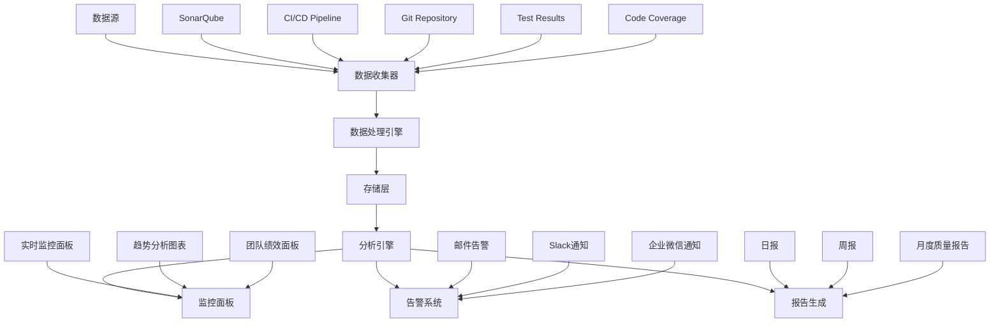

# Task 008: 质量监控体系

## 任务目标

基于Task 006的CI/CD质量门禁建设成果，建立完整的代码质量监控和度量体系。该系统将提供实时质量监控、历史趋势分析、质量预警、自动化报告生成等功能，帮助团队持续改进代码质量，确保项目长期健康发展。

## 技术要求

### 质量监控架构设计

#### 监控体系架构



#### 核心监控指标

**1. 代码质量指标**
- 代码覆盖率（行覆盖率、分支覆盖率）
- 技术债务时间和密度
- 代码复杂度（圈复杂度、认知复杂度）
- 代码重复度
- 维护性指数

**2. 编译质量指标**
- 编译成功率
- 编译警告数量和趋势
- 编译错误修复时间
- 静态分析问题数量

**3. 测试质量指标**
- 测试通过率
- 测试覆盖率趋势
- 测试执行时间
- 失败测试分析

**4. 团队效率指标**
- 代码提交频率
- 代码审查效率
- 缺陷修复时间
- 质量门禁通过率

### 数据收集与处理系统

#### 多源数据收集器

```python
# monitoring/data_collector.py
import asyncio
import aiohttp
import sqlite3
import json
import logging
from datetime import datetime, timedelta
from typing import Dict, List, Optional, Any
from dataclasses import dataclass
import pandas as pd

@dataclass
class QualityMetric:
    timestamp: datetime
    source: str
    metric_name: str
    metric_value: float
    metadata: Dict[str, Any]

class MultiSourceDataCollector:
    def __init__(self, config_path: str = "monitoring_config.json"):
        self.config = self.load_config(config_path)
        self.db_path = self.config['database']['path']
        self.init_database()
        self.logger = self.setup_logging()
        
    def load_config(self, config_path: str) -> Dict:
        """加载监控配置"""
        
        with open(config_path, 'r', encoding='utf-8') as f:
            return json.load(f)
    
    def setup_logging(self) -> logging.Logger:
        """设置日志"""
        
        logging.basicConfig(
            level=logging.INFO,
            format='%(asctime)s - %(name)s - %(levelname)s - %(message)s',
            handlers=[
                logging.FileHandler('quality_monitoring.log'),
                logging.StreamHandler()
            ]
        )
        return logging.getLogger(__name__)
    
    def init_database(self):
        """初始化数据库"""
        
        conn = sqlite3.connect(self.db_path)
        cursor = conn.cursor()
        
        cursor.execute('''
            CREATE TABLE IF NOT EXISTS quality_metrics (
                id INTEGER PRIMARY KEY AUTOINCREMENT,
                timestamp DATETIME,
                source TEXT,
                metric_name TEXT,
                metric_value REAL,
                commit_sha TEXT,
                branch TEXT,
                build_number TEXT,
                metadata TEXT
            )
        ''')
        
        cursor.execute('''
            CREATE TABLE IF NOT EXISTS quality_alerts (
                id INTEGER PRIMARY KEY AUTOINCREMENT,
                timestamp DATETIME,
                alert_type TEXT,
                severity TEXT,
                message TEXT,
                metric_name TEXT,
                threshold_value REAL,
                actual_value REAL,
                resolved BOOLEAN DEFAULT FALSE,
                resolved_at DATETIME
            )
        ''')
        
        cursor.execute('''
            CREATE TABLE IF NOT EXISTS quality_trends (
                id INTEGER PRIMARY KEY AUTOINCREMENT,
                date DATE,
                metric_name TEXT,
                avg_value REAL,
                min_value REAL,
                max_value REAL,
                trend_direction TEXT,
                change_percentage REAL
            )
        ''')
        
        conn.commit()
        conn.close()
    
    async def collect_all_metrics(self) -> List[QualityMetric]:
        """收集所有质量指标"""
        
        all_metrics = []
        
        # 并行收集各种指标
        tasks = [
            self.collect_sonarqube_metrics(),
            self.collect_build_metrics(),
            self.collect_test_metrics(),
            self.collect_git_metrics(),
            self.collect_coverage_metrics()
        ]
        
        results = await asyncio.gather(*tasks, return_exceptions=True)
        
        for result in results:
            if isinstance(result, Exception):
                self.logger.error(f"数据收集失败: {result}")
            else:
                all_metrics.extend(result)
        
        return all_metrics
    
    async def collect_sonarqube_metrics(self) -> List[QualityMetric]:
        """收集SonarQube质量指标"""
        
        metrics = []
        
        try:
            sonar_config = self.config['sources']['sonarqube']
            async with aiohttp.ClientSession() as session:
                
                # 获取项目质量指标
                params = {
                    'component': sonar_config['project_key'],
                    'metricKeys': ','.join([
                        'coverage', 'branch_coverage', 'duplicated_lines_density',
                        'maintainability_rating', 'reliability_rating', 'security_rating',
                        'code_smells', 'bugs', 'vulnerabilities', 'sqale_index',
                        'complexity', 'cognitive_complexity', 'ncloc'
                    ])
                }
                
                headers = {'Authorization': f"Bearer {sonar_config['token']}"}
                
                async with session.get(
                    f"{sonar_config['url']}/api/measures/component",
                    params=params,
                    headers=headers
                ) as response:
                    
                    if response.status == 200:
                        data = await response.json()
                        measures = data.get('component', {}).get('measures', [])
                        
                        timestamp = datetime.now()
                        
                        for measure in measures:
                            metric_name = measure['metric']
                            value = float(measure.get('value', 0))
                            
                            metrics.append(QualityMetric(
                                timestamp=timestamp,
                                source='sonarqube',
                                metric_name=metric_name,
                                metric_value=value,
                                metadata={'project_key': sonar_config['project_key']}
                            ))
                    
                # 获取质量门禁状态
                async with session.get(
                    f"{sonar_config['url']}/api/qualitygates/project_status",
                    params={'projectKey': sonar_config['project_key']},
                    headers=headers
                ) as response:
                    
                    if response.status == 200:
                        data = await response.json()
                        status = data.get('projectStatus', {}).get('status', 'UNKNOWN')
                        
                        metrics.append(QualityMetric(
                            timestamp=datetime.now(),
                            source='sonarqube',
                            metric_name='quality_gate_status',
                            metric_value=1.0 if status == 'OK' else 0.0,
                            metadata={'status': status}
                        ))
        
        except Exception as e:
            self.logger.error(f"SonarQube指标收集失败: {e}")
        
        return metrics
    
    async def collect_build_metrics(self) -> List[QualityMetric]:
        """收集构建指标"""
        
        metrics = []
        
        try:
            # 从GitHub Actions API获取构建数据
            github_config = self.config['sources']['github']
            
            async with aiohttp.ClientSession() as session:
                headers = {
                    'Authorization': f"token {github_config['token']}",
                    'Accept': 'application/vnd.github.v3+json'
                }
                
                # 获取最近的workflow runs
                async with session.get(
                    f"https://api.github.com/repos/{github_config['repo']}/actions/runs",
                    headers=headers,
                    params={'per_page': 10}
                ) as response:
                    
                    if response.status == 200:
                        data = await response.json()
                        workflow_runs = data.get('workflow_runs', [])
                        
                        for run in workflow_runs:
                            timestamp = datetime.fromisoformat(run['created_at'].replace('Z', '+00:00'))
                            
                            # 构建成功率
                            success_value = 1.0 if run['conclusion'] == 'success' else 0.0
                            metrics.append(QualityMetric(
                                timestamp=timestamp,
                                source='github_actions',
                                metric_name='build_success_rate',
                                metric_value=success_value,
                                metadata={
                                    'run_id': run['id'],
                                    'workflow_name': run['name'],
                                    'conclusion': run['conclusion']
                                }
                            ))
                            
                            # 构建时间
                            if run['run_started_at'] and run['updated_at']:
                                start_time = datetime.fromisoformat(run['run_started_at'].replace('Z', '+00:00'))
                                end_time = datetime.fromisoformat(run['updated_at'].replace('Z', '+00:00'))
                                duration = (end_time - start_time).total_seconds() / 60  # 分钟
                                
                                metrics.append(QualityMetric(
                                    timestamp=timestamp,
                                    source='github_actions',
                                    metric_name='build_duration_minutes',
                                    metric_value=duration,
                                    metadata={'run_id': run['id']}
                                ))
        
        except Exception as e:
            self.logger.error(f"构建指标收集失败: {e}")
        
        return metrics
    
    async def collect_test_metrics(self) -> List[QualityMetric]:
        """收集测试指标"""
        
        metrics = []
        
        try:
            # 解析测试结果文件
            test_results_path = self.config['sources']['test_results']['path']
            
            if os.path.exists(test_results_path):
                with open(test_results_path, 'r', encoding='utf-8') as f:
                    test_data = json.load(f)
                
                timestamp = datetime.now()
                
                # 测试通过率
                total_tests = test_data.get('total_tests', 0)
                passed_tests = test_data.get('passed_tests', 0)
                
                if total_tests > 0:
                    pass_rate = (passed_tests / total_tests) * 100
                    
                    metrics.append(QualityMetric(
                        timestamp=timestamp,
                        source='test_results',
                        metric_name='test_pass_rate',
                        metric_value=pass_rate,
                        metadata={
                            'total_tests': total_tests,
                            'passed_tests': passed_tests,
                            'failed_tests': total_tests - passed_tests
                        }
                    ))
                    
                    # 测试执行时间
                    if 'execution_time' in test_data:
                        metrics.append(QualityMetric(
                            timestamp=timestamp,
                            source='test_results',
                            metric_name='test_execution_time',
                            metric_value=test_data['execution_time'],
                            metadata={'unit': 'seconds'}
                        ))
        
        except Exception as e:
            self.logger.error(f"测试指标收集失败: {e}")
        
        return metrics
    
    async def collect_git_metrics(self) -> List[QualityMetric]:
        """收集Git代码库指标"""
        
        metrics = []
        
        try:
            import subprocess
            
            # 获取提交频率（最近7天）
            result = subprocess.run([
                'git', 'log', '--since=7.days.ago', '--pretty=format:', '--name-only'
            ], capture_output=True, text=True)
            
            if result.returncode == 0:
                lines = [line for line in result.stdout.split('\n') if line.strip()]
                commits_count = len([line for line in lines if line == ''])
                files_changed = len(set([line for line in lines if line != '']))
                
                timestamp = datetime.now()
                
                metrics.append(QualityMetric(
                    timestamp=timestamp,
                    source='git',
                    metric_name='commits_last_7_days',
                    metric_value=commits_count,
                    metadata={'period': '7_days'}
                ))
                
                metrics.append(QualityMetric(
                    timestamp=timestamp,
                    source='git',
                    metric_name='files_changed_last_7_days',
                    metric_value=files_changed,
                    metadata={'period': '7_days'}
                ))
            
            # 获取代码行数
            result = subprocess.run([
                'git', 'ls-files', '*.cs'
            ], capture_output=True, text=True)
            
            if result.returncode == 0:
                cs_files = result.stdout.strip().split('\n')
                total_lines = 0
                
                for file in cs_files:
                    if os.path.exists(file):
                        with open(file, 'r', encoding='utf-8', errors='ignore') as f:
                            total_lines += len(f.readlines())
                
                metrics.append(QualityMetric(
                    timestamp=datetime.now(),
                    source='git',
                    metric_name='total_lines_of_code',
                    metric_value=total_lines,
                    metadata={'file_type': 'csharp'}
                ))
        
        except Exception as e:
            self.logger.error(f"Git指标收集失败: {e}")
        
        return metrics
    
    async def collect_coverage_metrics(self) -> List[QualityMetric]:
        """收集代码覆盖率指标"""
        
        metrics = []
        
        try:
            # 解析覆盖率报告
            coverage_file = self.config['sources']['coverage']['file_path']
            
            if os.path.exists(coverage_file):
                # 假设是JSON格式的覆盖率报告
                with open(coverage_file, 'r', encoding='utf-8') as f:
                    coverage_data = json.load(f)
                
                timestamp = datetime.now()
                
                if 'summary' in coverage_data:
                    summary = coverage_data['summary']
                    
                    metrics.append(QualityMetric(
                        timestamp=timestamp,
                        source='coverage_report',
                        metric_name='line_coverage_percentage',
                        metric_value=summary.get('linecoverage', 0.0),
                        metadata=summary
                    ))
                    
                    metrics.append(QualityMetric(
                        timestamp=timestamp,
                        source='coverage_report',
                        metric_name='branch_coverage_percentage',
                        metric_value=summary.get('branchcoverage', 0.0),
                        metadata=summary
                    ))
        
        except Exception as e:
            self.logger.error(f"覆盖率指标收集失败: {e}")
        
        return metrics
    
    def store_metrics(self, metrics: List[QualityMetric]):
        """存储质量指标到数据库"""
        
        conn = sqlite3.connect(self.db_path)
        cursor = conn.cursor()
        
        for metric in metrics:
            cursor.execute('''
                INSERT INTO quality_metrics (
                    timestamp, source, metric_name, metric_value, 
                    commit_sha, branch, build_number, metadata
                ) VALUES (?, ?, ?, ?, ?, ?, ?, ?)
            ''', (
                metric.timestamp.isoformat(),
                metric.source,
                metric.metric_name,
                metric.metric_value,
                metric.metadata.get('commit_sha', ''),
                metric.metadata.get('branch', ''),
                metric.metadata.get('build_number', ''),
                json.dumps(metric.metadata)
            ))
        
        conn.commit()
        conn.close()
        
        self.logger.info(f"已存储 {len(metrics)} 个质量指标")

# 主执行函数
async def main():
    collector = MultiSourceDataCollector()
    
    while True:
        try:
            print("开始收集质量指标...")
            metrics = await collector.collect_all_metrics()
            
            if metrics:
                collector.store_metrics(metrics)
                print(f"✅ 收集并存储了 {len(metrics)} 个指标")
            else:
                print("⚠️ 未收集到任何指标")
                
        except Exception as e:
            print(f"❌ 收集过程发生错误: {e}")
        
        # 等待下次收集（例如每30分钟）
        await asyncio.sleep(1800)  # 30分钟

if __name__ == '__main__':
    asyncio.run(main())
```

### 实时监控面板

#### Web监控面板实现

```python
# monitoring/dashboard.py
from flask import Flask, render_template, jsonify, request
import sqlite3
import json
from datetime import datetime, timedelta
import pandas as pd
import plotly.graph_objs as go
import plotly.utils

app = Flask(__name__)

class QualityDashboard:
    def __init__(self, db_path: str = "quality_metrics.db"):
        self.db_path = db_path
    
    def get_metrics_data(self, days: int = 30) -> pd.DataFrame:
        """获取指标数据"""
        
        conn = sqlite3.connect(self.db_path)
        
        since_date = datetime.now() - timedelta(days=days)
        
        query = '''
            SELECT timestamp, source, metric_name, metric_value, metadata
            FROM quality_metrics
            WHERE timestamp > ?
            ORDER BY timestamp DESC
        '''
        
        df = pd.read_sql_query(query, conn, params=(since_date.isoformat(),))
        conn.close()
        
        return df
    
    def get_latest_metrics(self) -> dict:
        """获取最新指标快照"""
        
        conn = sqlite3.connect(self.db_path)
        cursor = conn.cursor()
        
        # 获取最新的关键指标
        key_metrics = [
            'coverage', 'branch_coverage', 'maintainability_rating',
            'reliability_rating', 'security_rating', 'build_success_rate',
            'test_pass_rate', 'quality_gate_status'
        ]
        
        latest_values = {}
        
        for metric in key_metrics:
            cursor.execute('''
                SELECT metric_value, timestamp
                FROM quality_metrics
                WHERE metric_name = ?
                ORDER BY timestamp DESC
                LIMIT 1
            ''', (metric,))
            
            result = cursor.fetchone()
            if result:
                latest_values[metric] = {
                    'value': result[0],
                    'timestamp': result[1]
                }
        
        conn.close()
        return latest_values
    
    def generate_trend_chart(self, metric_name: str, days: int = 30) -> str:
        """生成趋势图表"""
        
        df = self.get_metrics_data(days)
        metric_data = df[df['metric_name'] == metric_name]
        
        if metric_data.empty:
            return json.dumps({})
        
        metric_data['timestamp'] = pd.to_datetime(metric_data['timestamp'])
        metric_data = metric_data.sort_values('timestamp')
        
        # 按日期分组求平均值
        daily_avg = metric_data.groupby(metric_data['timestamp'].dt.date)['metric_value'].mean()
        
        fig = go.Figure()
        fig.add_trace(go.Scatter(
            x=daily_avg.index,
            y=daily_avg.values,
            mode='lines+markers',
            name=metric_name,
            line=dict(color='#1f77b4', width=2),
            marker=dict(size=6)
        ))
        
        fig.update_layout(
            title=f'{metric_name} 趋势 (过去{days}天)',
            xaxis_title='日期',
            yaxis_title='数值',
            template='plotly_white',
            height=400
        )
        
        return json.dumps(fig, cls=plotly.utils.PlotlyJSONEncoder)
    
    def get_quality_summary(self) -> dict:
        """获取质量汇总信息"""
        
        latest_metrics = self.get_latest_metrics()
        
        # 计算质量评分（0-100）
        quality_score = 0
        factors = 0
        
        if 'coverage' in latest_metrics:
            quality_score += latest_metrics['coverage']['value']
            factors += 1
        
        if 'maintainability_rating' in latest_metrics:
            # SonarQube评级：1=A, 2=B, 3=C, 4=D, 5=E
            rating = latest_metrics['maintainability_rating']['value']
            score = max(0, (6 - rating) * 20)  # 转换为0-100分
            quality_score += score
            factors += 1
        
        if 'build_success_rate' in latest_metrics:
            quality_score += latest_metrics['build_success_rate']['value'] * 100
            factors += 1
        
        if 'test_pass_rate' in latest_metrics:
            quality_score += latest_metrics['test_pass_rate']['value']
            factors += 1
        
        overall_score = quality_score / factors if factors > 0 else 0
        
        # 质量等级
        if overall_score >= 90:
            grade = 'A'
            color = 'success'
        elif overall_score >= 80:
            grade = 'B'
            color = 'info'
        elif overall_score >= 70:
            grade = 'C'
            color = 'warning'
        else:
            grade = 'D'
            color = 'danger'
        
        return {
            'overall_score': round(overall_score, 1),
            'grade': grade,
            'color': color,
            'latest_metrics': latest_metrics
        }

dashboard = QualityDashboard()

@app.route('/')
def index():
    """主页面"""
    summary = dashboard.get_quality_summary()
    return render_template('dashboard.html', summary=summary)

@app.route('/api/metrics/latest')
def api_latest_metrics():
    """API: 获取最新指标"""
    return jsonify(dashboard.get_latest_metrics())

@app.route('/api/metrics/trend/<metric_name>')
def api_metric_trend(metric_name):
    """API: 获取指标趋势"""
    days = request.args.get('days', 30, type=int)
    chart_data = dashboard.generate_trend_chart(metric_name, days)
    return chart_data

@app.route('/api/quality/summary')
def api_quality_summary():
    """API: 获取质量汇总"""
    return jsonify(dashboard.get_quality_summary())

@app.route('/health')
def health_check():
    """健康检查"""
    return {'status': 'healthy', 'timestamp': datetime.now().isoformat()}

if __name__ == '__main__':
    app.run(debug=True, host='0.0.0.0', port=5000)
```

#### 监控面板模板

```html
<!-- monitoring/templates/dashboard.html -->
<!DOCTYPE html>
<html lang="zh-CN">
<head>
    <meta charset="UTF-8">
    <meta name="viewport" content="width=device-width, initial-scale=1.0">
    <title>LYBT 代码质量监控面板</title>
    <link href="https://cdn.jsdelivr.net/npm/bootstrap@5.1.3/dist/css/bootstrap.min.css" rel="stylesheet">
    <script src="https://cdn.plot.ly/plotly-latest.min.js"></script>
    <style>
        .metric-card {
            transition: transform 0.2s;
        }
        .metric-card:hover {
            transform: translateY(-5px);
        }
        .quality-score {
            font-size: 3rem;
            font-weight: bold;
        }
        .trend-chart {
            height: 400px;
        }
    </style>
</head>
<body>
    <nav class="navbar navbar-dark bg-dark">
        <div class="container-fluid">
            <span class="navbar-brand mb-0 h1">🔍 LYBT 代码质量监控</span>
            <span class="navbar-text">
                <span id="last-update">更新时间: {{ summary.latest_metrics.get('coverage', {}).get('timestamp', 'N/A') }}</span>
            </span>
        </div>
    </nav>

    <div class="container-fluid mt-4">
        <!-- 质量概览 -->
        <div class="row mb-4">
            <div class="col-md-3">
                <div class="card text-center metric-card">
                    <div class="card-body">
                        <h5 class="card-title">整体质量评分</h5>
                        <div class="quality-score text-{{ summary.color }}">
                            {{ summary.overall_score }}
                            <small class="fs-4">{{ summary.grade }}</small>
                        </div>
                        <p class="card-text text-muted">综合质量评估</p>
                    </div>
                </div>
            </div>
            <div class="col-md-3">
                <div class="card text-center metric-card">
                    <div class="card-body">
                        <h5 class="card-title">代码覆盖率</h5>
                        <div class="quality-score text-primary">
                            {{ "%.1f"|format(summary.latest_metrics.get('coverage', {}).get('value', 0)) }}%
                        </div>
                        <p class="card-text text-muted">行覆盖率</p>
                    </div>
                </div>
            </div>
            <div class="col-md-3">
                <div class="card text-center metric-card">
                    <div class="card-body">
                        <h5 class="card-title">构建成功率</h5>
                        <div class="quality-score text-success">
                            {{ "%.0f"|format(summary.latest_metrics.get('build_success_rate', {}).get('value', 0) * 100) }}%
                        </div>
                        <p class="card-text text-muted">最近构建</p>
                    </div>
                </div>
            </div>
            <div class="col-md-3">
                <div class="card text-center metric-card">
                    <div class="card-body">
                        <h5 class="card-title">测试通过率</h5>
                        <div class="quality-score text-info">
                            {{ "%.1f"|format(summary.latest_metrics.get('test_pass_rate', {}).get('value', 0)) }}%
                        </div>
                        <p class="card-text text-muted">自动化测试</p>
                    </div>
                </div>
            </div>
        </div>

        <!-- 趋势图表 -->
        <div class="row mb-4">
            <div class="col-md-6">
                <div class="card">
                    <div class="card-header">
                        <h5>代码覆盖率趋势</h5>
                    </div>
                    <div class="card-body">
                        <div id="coverage-trend" class="trend-chart"></div>
                    </div>
                </div>
            </div>
            <div class="col-md-6">
                <div class="card">
                    <div class="card-header">
                        <h5>构建成功率趋势</h5>
                    </div>
                    <div class="card-body">
                        <div id="build-success-trend" class="trend-chart"></div>
                    </div>
                </div>
            </div>
        </div>

        <div class="row mb-4">
            <div class="col-md-6">
                <div class="card">
                    <div class="card-header">
                        <h5>质量门禁状态</h5>
                    </div>
                    <div class="card-body">
                        <div id="quality-gate-trend" class="trend-chart"></div>
                    </div>
                </div>
            </div>
            <div class="col-md-6">
                <div class="card">
                    <div class="card-header">
                        <h5>维护性评级趋势</h5>
                    </div>
                    <div class="card-body">
                        <div id="maintainability-trend" class="trend-chart"></div>
                    </div>
                </div>
            </div>
        </div>

        <!-- 详细指标表格 -->
        <div class="row">
            <div class="col-12">
                <div class="card">
                    <div class="card-header">
                        <h5>详细指标</h5>
                    </div>
                    <div class="card-body">
                        <div class="table-responsive">
                            <table class="table table-striped">
                                <thead>
                                    <tr>
                                        <th>指标</th>
                                        <th>当前值</th>
                                        <th>状态</th>
                                        <th>更新时间</th>
                                    </tr>
                                </thead>
                                <tbody id="metrics-table">
                                    <!-- 动态加载指标数据 -->
                                </tbody>
                            </table>
                        </div>
                    </div>
                </div>
            </div>
        </div>
    </div>

    <script src="https://cdn.jsdelivr.net/npm/bootstrap@5.1.3/dist/js/bootstrap.bundle.min.js"></script>
    <script>
        // 加载趋势图表
        async function loadTrendChart(metricName, elementId) {
            try {
                const response = await fetch(`/api/metrics/trend/${metricName}?days=30`);
                const chartData = await response.json();
                
                if (Object.keys(chartData).length > 0) {
                    Plotly.newPlot(elementId, chartData.data, chartData.layout);
                }
            } catch (error) {
                console.error(`加载 ${metricName} 趋势图失败:`, error);
            }
        }
        
        // 加载详细指标表格
        async function loadMetricsTable() {
            try {
                const response = await fetch('/api/metrics/latest');
                const metrics = await response.json();
                
                const tbody = document.getElementById('metrics-table');
                tbody.innerHTML = '';
                
                for (const [metricName, metricData] of Object.entries(metrics)) {
                    const row = document.createElement('tr');
                    
                    // 确定状态和颜色
                    let status = '正常';
                    let statusClass = 'text-success';
                    
                    if (metricName === 'coverage' && metricData.value < 60) {
                        status = '需改进';
                        statusClass = 'text-warning';
                    } else if (metricName.includes('rating') && metricData.value > 1) {
                        status = '需关注';
                        statusClass = 'text-warning';
                    }
                    
                    row.innerHTML = `
                        <td>${getMetricDisplayName(metricName)}</td>
                        <td>${formatMetricValue(metricName, metricData.value)}</td>
                        <td><span class="${statusClass}">${status}</span></td>
                        <td>${new Date(metricData.timestamp).toLocaleString()}</td>
                    `;
                    
                    tbody.appendChild(row);
                }
            } catch (error) {
                console.error('加载指标表格失败:', error);
            }
        }
        
        // 获取指标显示名称
        function getMetricDisplayName(metricName) {
            const names = {
                'coverage': '代码覆盖率',
                'branch_coverage': '分支覆盖率',
                'maintainability_rating': '维护性评级',
                'reliability_rating': '可靠性评级',
                'security_rating': '安全评级',
                'build_success_rate': '构建成功率',
                'test_pass_rate': '测试通过率',
                'quality_gate_status': '质量门禁状态'
            };
            return names[metricName] || metricName;
        }
        
        // 格式化指标值
        function formatMetricValue(metricName, value) {
            if (metricName.includes('rate') || metricName.includes('coverage')) {
                return `${value.toFixed(1)}%`;
            } else if (metricName.includes('rating')) {
                const ratings = ['', 'A', 'B', 'C', 'D', 'E'];
                return ratings[Math.floor(value)] || value.toString();
            } else if (metricName === 'quality_gate_status') {
                return value === 1 ? '通过' : '未通过';
            }
            return value.toString();
        }
        
        // 页面初始化
        document.addEventListener('DOMContentLoaded', function() {
            // 加载趋势图表
            loadTrendChart('coverage', 'coverage-trend');
            loadTrendChart('build_success_rate', 'build-success-trend');
            loadTrendChart('quality_gate_status', 'quality-gate-trend');
            loadTrendChart('maintainability_rating', 'maintainability-trend');
            
            // 加载指标表格
            loadMetricsTable();
            
            // 设置定时刷新（每5分钟）
            setInterval(function() {
                loadMetricsTable();
                document.getElementById('last-update').textContent = 
                    '更新时间: ' + new Date().toLocaleString();
            }, 300000);
        });
    </script>
</body>
</html>
```

### 智能告警系统

#### 告警管理器

```python
# monitoring/alert_manager.py
import sqlite3
import smtplib
import json
from datetime import datetime, timedelta
from email.mime.text import MIMEText
from email.mime.multipart import MIMEMultipart
from typing import List, Dict, Optional
import requests
import logging

class AlertManager:
    def __init__(self, config_path: str = "alert_config.json"):
        self.config = self.load_config(config_path)
        self.db_path = self.config['database']['path']
        self.logger = self.setup_logging()
        
    def load_config(self, config_path: str) -> Dict:
        """加载告警配置"""
        
        with open(config_path, 'r', encoding='utf-8') as f:
            return json.load(f)
    
    def setup_logging(self) -> logging.Logger:
        """设置日志"""
        
        logging.basicConfig(level=logging.INFO)
        return logging.getLogger(__name__)
    
    def check_quality_thresholds(self) -> List[Dict]:
        """检查质量阈值，生成告警"""
        
        alerts = []
        
        conn = sqlite3.connect(self.db_path)
        cursor = conn.cursor()
        
        # 定义阈值规则
        threshold_rules = self.config['thresholds']
        
        for rule in threshold_rules:
            metric_name = rule['metric_name']
            threshold = rule['threshold']
            operator = rule['operator']  # 'lt', 'gt', 'eq'
            severity = rule['severity']
            
            # 获取最新的指标值
            cursor.execute('''
                SELECT metric_value, timestamp
                FROM quality_metrics
                WHERE metric_name = ?
                ORDER BY timestamp DESC
                LIMIT 1
            ''', (metric_name,))
            
            result = cursor.fetchone()
            if result:
                current_value = result[0]
                timestamp = result[1]
                
                # 检查是否触发告警
                trigger_alert = False
                if operator == 'lt' and current_value < threshold:
                    trigger_alert = True
                elif operator == 'gt' and current_value > threshold:
                    trigger_alert = True
                elif operator == 'eq' and current_value == threshold:
                    trigger_alert = True
                
                if trigger_alert:
                    alerts.append({
                        'metric_name': metric_name,
                        'current_value': current_value,
                        'threshold': threshold,
                        'operator': operator,
                        'severity': severity,
                        'timestamp': timestamp,
                        'message': f"{rule['description']}: {current_value} {operator} {threshold}"
                    })
        
        conn.close()
        return alerts
    
    def check_trend_alerts(self) -> List[Dict]:
        """检查趋势告警"""
        
        alerts = []
        
        conn = sqlite3.connect(self.db_path)
        
        # 检查覆盖率下降趋势
        coverage_trend = pd.read_sql_query('''
            SELECT timestamp, metric_value
            FROM quality_metrics
            WHERE metric_name = 'coverage'
            AND timestamp > ?
            ORDER BY timestamp DESC
            LIMIT 7
        ''', conn, params=[(datetime.now() - timedelta(days=7)).isoformat()])
        
        if len(coverage_trend) >= 3:
            recent_avg = coverage_trend.head(3)['metric_value'].mean()
            older_avg = coverage_trend.tail(3)['metric_value'].mean()
            
            decline_percentage = ((older_avg - recent_avg) / older_avg) * 100
            
            if decline_percentage > 5:  # 覆盖率下降超过5%
                alerts.append({
                    'type': 'trend',
                    'metric_name': 'coverage',
                    'severity': 'warning',
                    'message': f"代码覆盖率持续下降 {decline_percentage:.1f}%",
                    'timestamp': datetime.now().isoformat(),
                    'decline_percentage': decline_percentage
                })
        
        conn.close()
        return alerts
    
    def store_alert(self, alert: Dict):
        """存储告警到数据库"""
        
        conn = sqlite3.connect(self.db_path)
        cursor = conn.cursor()
        
        cursor.execute('''
            INSERT INTO quality_alerts (
                timestamp, alert_type, severity, message,
                metric_name, threshold_value, actual_value
            ) VALUES (?, ?, ?, ?, ?, ?, ?)
        ''', (
            alert.get('timestamp', datetime.now().isoformat()),
            alert.get('type', 'threshold'),
            alert['severity'],
            alert['message'],
            alert['metric_name'],
            alert.get('threshold', 0),
            alert.get('current_value', 0)
        ))
        
        conn.commit()
        conn.close()
    
    def send_email_alert(self, alert: Dict):
        """发送邮件告警"""
        
        try:
            email_config = self.config['notifications']['email']
            
            msg = MIMEMultipart()
            msg['From'] = email_config['from']
            msg['To'] = ', '.join(email_config['to'])
            msg['Subject'] = f"【LYBT质量告警】{alert['severity'].upper()}: {alert['metric_name']}"
            
            body = f"""
            LYBT代码质量告警通知
            
            告警级别: {alert['severity'].upper()}
            指标名称: {alert['metric_name']}
            告警消息: {alert['message']}
            告警时间: {alert['timestamp']}
            
            当前值: {alert.get('current_value', 'N/A')}
            阈值: {alert.get('threshold', 'N/A')}
            
            请及时关注并处理此质量问题。
            
            查看详细信息: {self.config['dashboard_url']}
            
            此邮件由LYBT质量监控系统自动发送。
            """
            
            msg.attach(MIMEText(body, 'plain', 'utf-8'))
            
            server = smtplib.SMTP(email_config['smtp_server'], email_config['smtp_port'])
            server.starttls()
            server.login(email_config['username'], email_config['password'])
            
            text = msg.as_string()
            server.sendmail(email_config['from'], email_config['to'], text)
            server.quit()
            
            self.logger.info(f"邮件告警已发送: {alert['message']}")
            
        except Exception as e:
            self.logger.error(f"发送邮件告警失败: {e}")
    
    def send_slack_alert(self, alert: Dict):
        """发送Slack告警"""
        
        try:
            slack_config = self.config['notifications']['slack']
            webhook_url = slack_config['webhook_url']
            
            color_map = {
                'critical': 'danger',
                'warning': 'warning',
                'info': 'good'
            }
            
            payload = {
                'username': 'LYBT Quality Bot',
                'icon_emoji': ':warning:',
                'attachments': [
                    {
                        'color': color_map.get(alert['severity'], 'warning'),
                        'title': f"代码质量告警: {alert['metric_name']}",
                        'text': alert['message'],
                        'fields': [
                            {
                                'title': '当前值',
                                'value': str(alert.get('current_value', 'N/A')),
                                'short': True
                            },
                            {
                                'title': '阈值',
                                'value': str(alert.get('threshold', 'N/A')),
                                'short': True
                            },
                            {
                                'title': '告警时间',
                                'value': alert['timestamp'],
                                'short': False
                            }
                        ],
                        'footer': 'LYBT Quality Monitor',
                        'ts': int(datetime.now().timestamp())
                    }
                ]
            }
            
            response = requests.post(webhook_url, json=payload)
            
            if response.status_code == 200:
                self.logger.info(f"Slack告警已发送: {alert['message']}")
            else:
                self.logger.error(f"Slack告警发送失败: {response.status_code}")
                
        except Exception as e:
            self.logger.error(f"发送Slack告警失败: {e}")
    
    def process_alerts(self):
        """处理所有告警"""
        
        # 检查阈值告警
        threshold_alerts = self.check_quality_thresholds()
        
        # 检查趋势告警
        trend_alerts = self.check_trend_alerts()
        
        all_alerts = threshold_alerts + trend_alerts
        
        for alert in all_alerts:
            # 检查是否已经发送过相同告警（避免重复发送）
            if not self.is_duplicate_alert(alert):
                # 存储告警
                self.store_alert(alert)
                
                # 发送通知
                if alert['severity'] in ['critical', 'warning']:
                    self.send_email_alert(alert)
                    self.send_slack_alert(alert)
                
                self.logger.info(f"处理告警: {alert['message']}")
        
        return len(all_alerts)
    
    def is_duplicate_alert(self, alert: Dict) -> bool:
        """检查是否是重复告警"""
        
        conn = sqlite3.connect(self.db_path)
        cursor = conn.cursor()
        
        # 检查过去1小时内是否有相同的告警
        one_hour_ago = datetime.now() - timedelta(hours=1)
        
        cursor.execute('''
            SELECT COUNT(*)
            FROM quality_alerts
            WHERE metric_name = ?
            AND severity = ?
            AND timestamp > ?
            AND resolved = FALSE
        ''', (alert['metric_name'], alert['severity'], one_hour_ago.isoformat()))
        
        count = cursor.fetchone()[0]
        conn.close()
        
        return count > 0

def main():
    alert_manager = AlertManager()
    
    print("开始检查质量告警...")
    alerts_count = alert_manager.process_alerts()
    
    if alerts_count > 0:
        print(f"处理了 {alerts_count} 个告警")
    else:
        print("没有发现质量问题")

if __name__ == '__main__':
    main()
```

## 实施步骤

### Phase 1: 数据收集系统开发 (3小时)

**1.1 多源数据收集器实现**
- 实现SonarQube、GitHub Actions、测试结果等数据源集成
- 开发数据标准化和存储系统
- 配置定时数据收集任务

**1.2 数据处理和分析引擎**
- 实现趋势分析和异常检测算法
- 开发质量评分计算逻辑
- 建立数据质量验证机制

### Phase 2: 监控面板开发 (2.5小时)

**2.1 Web监控面板实现**
- 开发Flask Web应用
- 实现实时数据展示和趋势图表
- 配置响应式设计和用户体验优化

**2.2 API接口开发**
- 实现RESTful API接口
- 配置数据缓存和性能优化
- 建立API安全认证机制

### Phase 3: 智能告警系统 (2小时)

**3.1 告警引擎实现**
- 开发阈值检查和趋势分析告警
- 实现多渠道通知机制（邮件、Slack）
- 配置告警去重和升级机制

**3.2 报告生成系统**
- 实现自动化报告生成
- 配置定期报告发送
- 建立质量改进建议系统

### Phase 4: 部署和文档 (0.5小时)

**4.1 系统部署**
- 配置监控系统部署脚本
- 建立系统监控和日志记录
- 配置数据备份和恢复机制

## 交付物

### 必须交付

1. **数据收集系统**:
   - `monitoring/data_collector.py` - 多源数据收集器
   - `monitoring/data_processor.py` - 数据处理分析引擎
   - 定时收集任务配置脚本

2. **监控面板系统**:
   - `monitoring/dashboard.py` - Web监控面板
   - `monitoring/templates/dashboard.html` - 前端界面
   - REST API接口文档

3. **智能告警系统**:
   - `monitoring/alert_manager.py` - 告警管理器
   - `monitoring/report_generator.py` - 报告生成器
   - 告警配置和模板文件

4. **配置和部署**:
   - `monitoring_config.json` - 系统配置文件
   - `docker-compose.yml` - 容器化部署配置
   - 系统运维文档

### 监控配置文件

```json
{
  "database": {
    "path": "quality_metrics.db",
    "backup_interval": 86400
  },
  "sources": {
    "sonarqube": {
      "url": "http://localhost:9000",
      "token": "${SONAR_TOKEN}",
      "project_key": "LYBTZYZS"
    },
    "github": {
      "token": "${GITHUB_TOKEN}",
      "repo": "owner/repository"
    },
    "test_results": {
      "path": "test_results.json"
    },
    "coverage": {
      "file_path": "coverage/Summary.json"
    }
  },
  "thresholds": [
    {
      "metric_name": "coverage",
      "threshold": 60.0,
      "operator": "lt",
      "severity": "warning",
      "description": "代码覆盖率低于标准"
    },
    {
      "metric_name": "maintainability_rating",
      "threshold": 1,
      "operator": "gt", 
      "severity": "critical",
      "description": "代码维护性评级下降"
    }
  ],
  "notifications": {
    "email": {
      "enabled": true,
      "smtp_server": "smtp.company.com",
      "smtp_port": 587,
      "from": "quality-bot@lybt.com",
      "to": ["dev-team@lybt.com"],
      "username": "${EMAIL_USER}",
      "password": "${EMAIL_PASS}"
    },
    "slack": {
      "enabled": true,
      "webhook_url": "${SLACK_WEBHOOK}"
    }
  },
  "dashboard": {
    "host": "0.0.0.0",
    "port": 5000,
    "refresh_interval": 300
  }
}
```

## 成功标准

### 功能标准

- [ ] 实时收集并展示所有关键质量指标
- [ ] 提供7天、30天、90天的趋势分析
- [ ] 智能告警检测准确率 ≥ 95%
- [ ] 监控面板响应时间 ≤ 2秒

### 可用性标准

- [ ] 系统可用性 ≥ 99%
- [ ] 数据收集完整性 ≥ 98%
- [ ] 告警响应时间 ≤ 5分钟
- [ ] 支持并发用户数 ≥ 20

### 业务价值标准

- [ ] 质量问题发现时间缩短 ≥ 80%
- [ ] 团队质量意识提升显著
- [ ] 代码质量持续改善趋势
- [ ] 开发效率与质量平衡优化

## 风险与缓解

### 高风险

1. **数据源依赖风险**
   - 风险: 外部系统不可用导致数据收集中断
   - 缓解: 实现数据源容错机制和备用方案

2. **系统性能风险**
   - 风险: 大量数据收集和处理影响系统性能
   - 缓解: 异步数据处理和分片存储优化

### 中风险

1. **告警准确性风险**
   - 风险: 误报和漏报影响告警系统可信度
   - 缓解: 持续优化阈值和算法参数

2. **数据安全风险**
   - 风险: 质量数据包含敏感信息
   - 缓解: 数据脱敏和访问权限控制

---

**任务负责人**: 监控系统工程师 + 数据分析工程师  
**预计工作量**: 8小时  
**完成标准**: 完整的质量监控体系上线运行，提供实时监控和智能告警服务