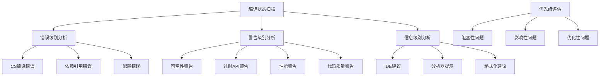

# Task 503: 编译状态全面扫描

## 任务目标

对LYBT.Server.sln和LYBT.Desktop.sln进行全面的编译状态检查，识别和分类所有编译错误、警告和潜在问题。建立系统性的问题分类、优先级评估和修复计划，为后续的编译错误修复工作提供清晰的路线图和数据支撑。

## 技术要求

### 编译状态评估框架

#### 多层级编译检查



#### 编译检查工具链

**1. .NET编译器诊断**
- MSBuild详细日志分析
- Roslyn编译器警告/错误收集
- NuGet包依赖问题识别
- 项目引用完整性检查

**2. 静态代码分析工具**
- Microsoft.CodeAnalysis.FxCopAnalyzers
- SonarAnalyzer.CSharp
- StyleCop.Analyzers  
- Roslynator代码分析器

**3. IDE诊断信息**
- Visual Studio Error List分析
- IntelliSense错误收集
- Code Actions建议提取

### 自动化扫描工具实现

#### 编译状态扫描器

```python
# scripts/compilation_scanner.py
import subprocess
import json
import re
import os
from datetime import datetime
from typing import Dict, List, Tuple, Optional
from pathlib import Path
from dataclasses import dataclass
import xml.etree.ElementTree as ET

@dataclass
class CompilationIssue:
    severity: str  # Error, Warning, Info, Hidden
    code: str
    file_path: str
    line: int
    column: int
    message: str
    project: str
    category: str
    rule_id: Optional[str] = None

class CompilationScanner:
    def __init__(self, solution_path: str):
        self.solution_path = Path(solution_path)
        self.issues: List[CompilationIssue] = []
        self.scan_timestamp = datetime.now()
        
    def scan_solution(self) -> Dict:
        """扫描整个解决方案的编译状态"""
        
        print(f"🔍 开始扫描解决方案: {self.solution_path}")
        
        # 清理之前的构建产物
        self._clean_solution()
        
        # 执行完整构建并收集问题
        build_result = self._build_with_detailed_logging()
        
        # 解析构建日志
        self._parse_build_log()
        
        # 运行静态分析
        self._run_static_analysis()
        
        # 收集IDE诊断信息
        self._collect_ide_diagnostics()
        
        # 生成扫描报告
        return self._generate_scan_report()
    
    def _clean_solution(self):
        """清理解决方案"""
        
        print("🧹 清理解决方案...")
        
        try:
            result = subprocess.run([
                'dotnet', 'clean', str(self.solution_path),
                '--verbosity', 'minimal'
            ], capture_output=True, text=True, check=True)
            
            print("✅ 解决方案清理完成")
            
        except subprocess.CalledProcessError as e:
            print(f"⚠️ 清理过程中出现问题: {e}")
    
    def _build_with_detailed_logging(self) -> bool:
        """使用详细日志进行构建"""
        
        print("🏗️ 执行详细构建...")
        
        log_file = self.solution_path.parent / "build_scan.log"
        
        try:
            # 使用详细输出进行构建
            result = subprocess.run([
                'dotnet', 'build', str(self.solution_path),
                '--verbosity', 'detailed',
                '--no-restore',
                '/flp:logfile=' + str(log_file) + ';verbosity=diagnostic'
            ], capture_output=True, text=True)
            
            # 保存标准输出和错误输出
            with open(log_file.with_suffix('.stdout.log'), 'w', encoding='utf-8') as f:
                f.write(result.stdout)
                
            with open(log_file.with_suffix('.stderr.log'), 'w', encoding='utf-8') as f:
                f.write(result.stderr)
            
            print(f"📝 构建日志已保存到: {log_file}")
            return result.returncode == 0
            
        except Exception as e:
            print(f"❌ 构建过程失败: {e}")
            return False
    
    def _parse_build_log(self):
        """解析构建日志"""
        
        print("📊 分析构建日志...")
        
        log_files = [
            self.solution_path.parent / "build_scan.log",
            self.solution_path.parent / "build_scan.stdout.log",
            self.solution_path.parent / "build_scan.stderr.log"
        ]
        
        for log_file in log_files:
            if log_file.exists():
                self._parse_log_file(log_file)
    
    def _parse_log_file(self, log_file: Path):
        """解析单个日志文件"""
        
        try:
            with open(log_file, 'r', encoding='utf-8', errors='ignore') as f:
                content = f.read()
            
            # 匹配编译错误和警告的正则表达式
            patterns = [
                # 标准MSBuild格式: file(line,col): severity code: message [project]
                r'([^()]+)\((\d+),(\d+)\):\s*(error|warning|info)\s+([^:]+):\s*([^\[]+)(?:\[([^\]]+)\])?',
                
                # 简化格式: file(line): severity code: message
                r'([^()]+)\((\d+)\):\s*(error|warning|info)\s+([^:]+):\s*(.+)',
                
                # C# 编译器错误格式
                r'(error|warning|info)\s+(CS\d+):\s*([^\[]+)(?:\[([^\]]+)\])?',
            ]
            
            for pattern in patterns:
                matches = re.finditer(pattern, content, re.MULTILINE | re.IGNORECASE)
                
                for match in matches:
                    try:
                        if len(match.groups()) >= 6:  # 完整格式
                            file_path, line, col, severity, code, message = match.groups()[:6]
                            project = match.groups()[6] if len(match.groups()) > 6 else ""
                            
                            self.issues.append(CompilationIssue(
                                severity=severity.lower(),
                                code=code.strip(),
                                file_path=file_path.strip(),
                                line=int(line) if line.isdigit() else 0,
                                column=int(col) if col.isdigit() else 0,
                                message=message.strip(),
                                project=project.strip(),
                                category=self._categorize_issue(code.strip())
                            ))
                            
                    except (ValueError, IndexError) as e:
                        # 跳过无法解析的行
                        continue
                        
        except Exception as e:
            print(f"⚠️ 解析日志文件失败 {log_file}: {e}")
    
    def _run_static_analysis(self):
        """运行静态代码分析"""
        
        print("🔬 运行静态代码分析...")
        
        try:
            # 运行dotnet analyze
            result = subprocess.run([
                'dotnet', 'format', str(self.solution_path),
                '--verify-no-changes',
                '--verbosity', 'diagnostic',
                '--report', str(self.solution_path.parent / 'format_report.json')
            ], capture_output=True, text=True)
            
            # 解析格式化报告
            self._parse_format_report()
            
        except Exception as e:
            print(f"⚠️ 静态分析执行失败: {e}")
    
    def _parse_format_report(self):
        """解析格式化报告"""
        
        format_report_path = self.solution_path.parent / 'format_report.json'
        
        if format_report_path.exists():
            try:
                with open(format_report_path, 'r', encoding='utf-8') as f:
                    report_data = json.load(f)
                
                # 处理格式化问题
                for file_info in report_data.get('Files', []):
                    file_path = file_info.get('FilePath', '')
                    
                    for change in file_info.get('Changes', []):
                        self.issues.append(CompilationIssue(
                            severity='info',
                            code='FORMAT001',
                            file_path=file_path,
                            line=change.get('LineNumber', 0),
                            column=change.get('CharNumber', 0),
                            message=f"格式化问题: {change.get('FormatDescription', '代码格式不符合标准')}",
                            project='',
                            category='formatting'
                        ))
                        
            except Exception as e:
                print(f"⚠️ 解析格式化报告失败: {e}")
    
    def _collect_ide_diagnostics(self):
        """收集IDE诊断信息"""
        
        print("💡 收集IDE诊断信息...")
        
        # 查找项目中的.editorconfig和Directory.Build.props
        config_files = [
            '.editorconfig',
            'Directory.Build.props',
            'Directory.Build.targets',
            'global.json'
        ]
        
        for config_file in config_files:
            config_path = self.solution_path.parent / config_file
            if not config_path.exists():
                self.issues.append(CompilationIssue(
                    severity='info',
                    code='CONFIG001',
                    file_path=str(config_path),
                    line=0,
                    column=0,
                    message=f"建议添加配置文件: {config_file}",
                    project='',
                    category='configuration'
                ))
    
    def _categorize_issue(self, code: str) -> str:
        """对问题进行分类"""
        
        categories = {
            # 编译错误
            'CS0': 'compilation_error',
            'CS1': 'compilation_error', 
            'MSB': 'build_error',
            
            # 可空性相关
            'CS8': 'nullability',
            
            # 性能和现代化
            'CA1': 'performance',
            'CA2': 'performance',
            'IDE0': 'modernization',
            
            # 安全性
            'SEC': 'security',
            'CA3': 'security',
            
            # 代码质量
            'CA5': 'code_quality',
            'SA1': 'code_quality',
            
            # 格式化
            'FORMAT': 'formatting',
            'CONFIG': 'configuration'
        }
        
        for prefix, category in categories.items():
            if code.startswith(prefix):
                return category
                
        return 'other'
    
    def _generate_scan_report(self) -> Dict:
        """生成扫描报告"""
        
        print("📋 生成扫描报告...")
        
        # 统计信息
        stats = {
            'total_issues': len(self.issues),
            'errors': len([i for i in self.issues if i.severity == 'error']),
            'warnings': len([i for i in self.issues if i.severity == 'warning']), 
            'info': len([i for i in self.issues if i.severity == 'info']),
            'by_category': {},
            'by_project': {},
            'by_severity': {}
        }
        
        # 按类别统计
        for issue in self.issues:
            cat = issue.category
            stats['by_category'][cat] = stats['by_category'].get(cat, 0) + 1
            
            proj = issue.project or 'Unknown'
            stats['by_project'][proj] = stats['by_project'].get(proj, 0) + 1
            
            sev = issue.severity
            stats['by_severity'][sev] = stats['by_severity'].get(sev, 0) + 1
        
        # 优先级分析
        critical_issues = [i for i in self.issues if i.severity == 'error']
        high_priority_warnings = [
            i for i in self.issues 
            if i.severity == 'warning' and i.category in ['nullability', 'security', 'performance']
        ]
        
        report = {
            'scan_info': {
                'solution_path': str(self.solution_path),
                'scan_timestamp': self.scan_timestamp.isoformat(),
                'scan_duration': (datetime.now() - self.scan_timestamp).total_seconds()
            },
            'statistics': stats,
            'critical_issues': [self._issue_to_dict(i) for i in critical_issues[:20]],  # 前20个关键问题
            'high_priority_warnings': [self._issue_to_dict(i) for i in high_priority_warnings[:30]],  # 前30个高优先级警告
            'all_issues': [self._issue_to_dict(i) for i in self.issues],
            'recommendations': self._generate_recommendations(stats)
        }
        
        # 保存报告
        report_file = self.solution_path.parent / f'compilation_scan_report_{self.scan_timestamp.strftime("%Y%m%d_%H%M%S")}.json'
        
        with open(report_file, 'w', encoding='utf-8') as f:
            json.dump(report, f, ensure_ascii=False, indent=2)
        
        print(f"📊 扫描报告已保存到: {report_file}")
        
        return report
    
    def _issue_to_dict(self, issue: CompilationIssue) -> Dict:
        """将问题对象转换为字典"""
        
        return {
            'severity': issue.severity,
            'code': issue.code,
            'file_path': issue.file_path,
            'line': issue.line,
            'column': issue.column,
            'message': issue.message,
            'project': issue.project,
            'category': issue.category,
            'rule_id': issue.rule_id
        }
    
    def _generate_recommendations(self, stats: Dict) -> List[str]:
        """生成修复建议"""
        
        recommendations = []
        
        if stats['errors'] > 0:
            recommendations.append(f"🚨 优先修复 {stats['errors']} 个编译错误，这些问题阻止代码编译")
        
        if stats.get('by_category', {}).get('nullability', 0) > 10:
            recommendations.append("⚠️ 发现大量可空性警告，建议启用nullable reference types并系统性修复")
        
        if stats.get('by_category', {}).get('performance', 0) > 5:
            recommendations.append("⚡ 发现性能相关问题，建议优先修复以提升应用性能")
        
        if stats.get('by_category', {}).get('security', 0) > 0:
            recommendations.append("🔒 发现安全相关问题，建议立即修复以确保应用安全")
        
        if stats.get('by_category', {}).get('formatting', 0) > 50:
            recommendations.append("📝 发现大量格式化问题，建议运行 dotnet format 进行批量修复")
        
        if stats.get('by_category', {}).get('modernization', 0) > 20:
            recommendations.append("🔄 发现代码现代化机会，建议使用最新C#语言特性")
        
        return recommendations

def main():
    import argparse
    
    parser = argparse.ArgumentParser(description='LYBT编译状态全面扫描工具')
    parser.add_argument('solution_path', help='解决方案文件路径')
    parser.add_argument('--output-format', choices=['console', 'json', 'both'], default='both',
                      help='输出格式')
    parser.add_argument('--categories-only', action='store_true',
                      help='只显示问题分类统计')
    
    args = parser.parse_args()
    
    scanner = CompilationScanner(args.solution_path)
    report = scanner.scan_solution()
    
    if args.output_format in ['console', 'both']:
        print_console_summary(report)
    
    if args.categories_only:
        print_category_breakdown(report['statistics'])

def print_console_summary(report: Dict):
    """打印控制台摘要"""
    
    stats = report['statistics']
    
    print("\n" + "="*60)
    print("📊 LYBT 编译状态扫描结果")
    print("="*60)
    
    print(f"\n📈 总体统计:")
    print(f"  总问题数量: {stats['total_issues']}")
    print(f"  🚨 错误: {stats['errors']}")
    print(f"  ⚠️  警告: {stats['warnings']}")
    print(f"  ℹ️  信息: {stats['info']}")
    
    print(f"\n📂 按类别统计:")
    for category, count in sorted(stats['by_category'].items(), key=lambda x: x[1], reverse=True):
        print(f"  {category}: {count}")
    
    print(f"\n🏗️ 按项目统计:")
    for project, count in sorted(stats['by_project'].items(), key=lambda x: x[1], reverse=True)[:10]:
        if project != 'Unknown':
            print(f"  {project}: {count}")
    
    if report['recommendations']:
        print(f"\n💡 修复建议:")
        for i, rec in enumerate(report['recommendations'], 1):
            print(f"  {i}. {rec}")
    
    print(f"\n🕒 扫描信息:")
    print(f"  扫描时间: {report['scan_info']['scan_timestamp']}")
    print(f"  耗时: {report['scan_info']['scan_duration']:.2f} 秒")
    print("="*60)

def print_category_breakdown(stats: Dict):
    """打印类别详细分解"""
    
    print("\n" + "="*60)
    print("📋 问题分类详细分解")
    print("="*60)
    
    category_descriptions = {
        'compilation_error': '编译错误 - 阻止代码编译的问题',
        'build_error': '构建错误 - MSBuild相关问题',
        'nullability': '可空性警告 - 空引用相关问题',
        'performance': '性能问题 - 影响运行时性能的问题',
        'modernization': '现代化建议 - 使用新语言特性的建议',
        'security': '安全问题 - 潜在的安全风险',
        'code_quality': '代码质量 - 代码风格和质量问题',
        'formatting': '格式化问题 - 代码格式不符合标准',
        'configuration': '配置问题 - 项目配置相关问题',
        'other': '其他问题 - 未分类的问题'
    }
    
    for category, count in sorted(stats['by_category'].items(), key=lambda x: x[1], reverse=True):
        description = category_descriptions.get(category, '未知类别')
        print(f"\n{category.upper()}: {count}")
        print(f"  {description}")
        
        # 根据数量给出建议
        if count > 50:
            print("  🔥 高优先级 - 问题数量较多，建议优先处理")
        elif count > 20:
            print("  ⚠️ 中优先级 - 建议在下个版本中处理")
        elif count > 0:
            print("  ℹ️ 低优先级 - 可以逐步改进")
    
    print("="*60)

if __name__ == '__main__':
    main()
```

#### 编译问题分析器

```python
# scripts/compilation_analyzer.py
import json
import pandas as pd
import matplotlib.pyplot as plt
import seaborn as sns
from pathlib import Path
from typing import Dict, List
from datetime import datetime

class CompilationAnalyzer:
    def __init__(self, report_file: str):
        self.report_file = Path(report_file)
        self.report_data = self._load_report()
        
    def _load_report(self) -> Dict:
        """加载扫描报告"""
        
        with open(self.report_file, 'r', encoding='utf-8') as f:
            return json.load(f)
    
    def analyze_issue_distribution(self):
        """分析问题分布"""
        
        issues_df = pd.DataFrame(self.report_data['all_issues'])
        
        if issues_df.empty:
            print("📊 没有发现编译问题")
            return
        
        print("📊 问题分布分析")
        print("="*50)
        
        # 严重性分布
        severity_counts = issues_df['severity'].value_counts()
        print(f"\n严重性分布:")
        for severity, count in severity_counts.items():
            print(f"  {severity}: {count}")
        
        # 类别分布
        category_counts = issues_df['category'].value_counts()
        print(f"\n类别分布:")
        for category, count in category_counts.items():
            print(f"  {category}: {count}")
        
        # 项目分布
        if 'project' in issues_df.columns:
            project_counts = issues_df['project'].value_counts().head(10)
            print(f"\n项目分布 (前10):")
            for project, count in project_counts.items():
                if project.strip():
                    print(f"  {project}: {count}")
    
    def identify_hotspots(self) -> List[Dict]:
        """识别问题热点文件"""
        
        issues_df = pd.DataFrame(self.report_data['all_issues'])
        
        if issues_df.empty:
            return []
        
        # 按文件统计问题数量
        file_issues = issues_df.groupby('file_path').agg({
            'severity': 'count',
            'category': lambda x: list(x.unique())
        }).rename(columns={'severity': 'issue_count'})
        
        # 找出问题最多的文件
        hotspots = []
        for file_path, row in file_issues.sort_values('issue_count', ascending=False).head(20).iterrows():
            if row['issue_count'] > 5:  # 只考虑问题数量 > 5 的文件
                hotspots.append({
                    'file_path': file_path,
                    'issue_count': row['issue_count'],
                    'categories': row['category']
                })
        
        print(f"\n🔥 问题热点文件 (问题数量 > 5):")
        for i, hotspot in enumerate(hotspots, 1):
            print(f"  {i}. {Path(hotspot['file_path']).name}: {hotspot['issue_count']} 个问题")
            print(f"     类别: {', '.join(hotspot['categories'])}")
        
        return hotspots
    
    def generate_priority_matrix(self) -> Dict:
        """生成优先级矩阵"""
        
        issues_df = pd.DataFrame(self.report_data['all_issues'])
        
        if issues_df.empty:
            return {}
        
        priority_matrix = {
            'critical': [],    # 阻塞性错误
            'high': [],        # 重要警告
            'medium': [],      # 一般警告
            'low': []          # 信息和建议
        }
        
        for _, issue in issues_df.iterrows():
            priority = self._calculate_priority(issue)
            priority_matrix[priority].append(issue.to_dict())
        
        print(f"\n🎯 优先级矩阵:")
        for priority, issues in priority_matrix.items():
            print(f"  {priority.upper()}: {len(issues)} 个问题")
        
        return priority_matrix
    
    def _calculate_priority(self, issue: pd.Series) -> str:
        """计算问题优先级"""
        
        # 编译错误 = Critical
        if issue['severity'] == 'error':
            return 'critical'
        
        # 安全和性能警告 = High
        if issue['severity'] == 'warning' and issue['category'] in ['security', 'performance']:
            return 'high'
        
        # 可空性和代码质量警告 = Medium
        if issue['severity'] == 'warning' and issue['category'] in ['nullability', 'code_quality']:
            return 'medium'
        
        # 其他 = Low
        return 'low'
    
    def generate_visualization(self, output_dir: str = "compilation_analysis"):
        """生成可视化图表"""
        
        output_path = Path(output_dir)
        output_path.mkdir(exist_ok=True)
        
        issues_df = pd.DataFrame(self.report_data['all_issues'])
        
        if issues_df.empty:
            print("没有数据可以生成图表")
            return
        
        plt.style.use('default')
        
        # 1. 问题严重性分布饼图
        fig, axes = plt.subplots(2, 2, figsize=(15, 12))
        
        severity_counts = issues_df['severity'].value_counts()
        axes[0, 0].pie(severity_counts.values, labels=severity_counts.index, autopct='%1.1f%%')
        axes[0, 0].set_title('问题严重性分布')
        
        # 2. 问题类别分布条形图
        category_counts = issues_df['category'].value_counts().head(10)
        axes[0, 1].barh(range(len(category_counts)), category_counts.values)
        axes[0, 1].set_yticks(range(len(category_counts)))
        axes[0, 1].set_yticklabels(category_counts.index)
        axes[0, 1].set_title('问题类别分布 (前10)')
        axes[0, 1].set_xlabel('问题数量')
        
        # 3. 问题代码分布
        code_counts = issues_df['code'].value_counts().head(15)
        axes[1, 0].barh(range(len(code_counts)), code_counts.values)
        axes[1, 0].set_yticks(range(len(code_counts)))
        axes[1, 0].set_yticklabels(code_counts.index)
        axes[1, 0].set_title('问题代码分布 (前15)')
        axes[1, 0].set_xlabel('问题数量')
        
        # 4. 问题热点文件
        file_counts = issues_df.groupby('file_path').size().sort_values(ascending=False).head(10)
        file_names = [Path(f).name for f in file_counts.index]
        axes[1, 1].barh(range(len(file_counts)), file_counts.values)
        axes[1, 1].set_yticks(range(len(file_counts)))
        axes[1, 1].set_yticklabels(file_names, fontsize=8)
        axes[1, 1].set_title('问题热点文件 (前10)')
        axes[1, 1].set_xlabel('问题数量')
        
        plt.tight_layout()
        plt.savefig(output_path / 'compilation_analysis.png', dpi=300, bbox_inches='tight')
        plt.close()
        
        print(f"📈 分析图表已保存到: {output_path / 'compilation_analysis.png'}")
    
    def export_excel_report(self, output_file: str = "compilation_report.xlsx"):
        """导出Excel详细报告"""
        
        issues_df = pd.DataFrame(self.report_data['all_issues'])
        
        if issues_df.empty:
            print("没有问题数据可以导出")
            return
        
        with pd.ExcelWriter(output_file, engine='openpyxl') as writer:
            # 所有问题
            issues_df.to_excel(writer, sheet_name='所有问题', index=False)
            
            # 按严重性分组
            for severity in issues_df['severity'].unique():
                severity_issues = issues_df[issues_df['severity'] == severity]
                severity_issues.to_excel(writer, sheet_name=f'{severity}_问题', index=False)
            
            # 按类别分组
            for category in issues_df['category'].unique():
                if len(category) <= 31:  # Excel sheet名称限制
                    category_issues = issues_df[issues_df['category'] == category]
                    category_issues.to_excel(writer, sheet_name=category, index=False)
            
            # 统计汇总
            stats_df = pd.DataFrame([
                {'指标': '总问题数', '数量': len(issues_df)},
                {'指标': '错误数', '数量': len(issues_df[issues_df['severity'] == 'error'])},
                {'指标': '警告数', '数量': len(issues_df[issues_df['severity'] == 'warning'])},
                {'指标': '信息数', '数量': len(issues_df[issues_df['severity'] == 'info'])},
            ])
            stats_df.to_excel(writer, sheet_name='统计汇总', index=False)
        
        print(f"📊 Excel报告已导出到: {output_file}")

def main():
    import argparse
    
    parser = argparse.ArgumentParser(description='编译状态分析工具')
    parser.add_argument('report_file', help='扫描报告JSON文件路径')
    parser.add_argument('--hotspots', action='store_true', help='显示问题热点')
    parser.add_argument('--priority', action='store_true', help='显示优先级矩阵')
    parser.add_argument('--visualize', action='store_true', help='生成可视化图表')
    parser.add_argument('--excel', action='store_true', help='导出Excel报告')
    
    args = parser.parse_args()
    
    analyzer = CompilationAnalyzer(args.report_file)
    
    # 基本分析
    analyzer.analyze_issue_distribution()
    
    if args.hotspots:
        analyzer.identify_hotspots()
    
    if args.priority:
        analyzer.generate_priority_matrix()
    
    if args.visualize:
        analyzer.generate_visualization()
    
    if args.excel:
        analyzer.export_excel_report()

if __name__ == '__main__':
    main()
```

## 实施步骤

### Phase 1: 工具准备和环境配置 (1.5小时)

**1.1 扫描工具开发**
- 实现compilation_scanner.py核心扫描器
- 配置MSBuild详细日志记录
- 集成静态分析工具链

**1.2 分析工具开发**
- 实现compilation_analyzer.py问题分析器
- 配置可视化和报告生成
- 建立优先级评估算法

### Phase 2: 全面扫描执行 (1.5小时)

**2.1 后端解决方案扫描**
- 扫描LYBT.Server.sln
- 收集编译错误、警告和建议
- 生成详细分析报告

**2.2 前端解决方案扫描**
- 扫描LYBT.Desktop.sln
- 分析WPF项目特有问题
- 整合前后端问题报告

### Phase 3: 结果分析和规划 (1小时)

**3.1 问题分类和优先级评估**
- 分析所有发现的问题
- 建立修复优先级矩阵
- 识别关键阻塞问题

**3.2 修复计划制定**
- 制定分阶段修复计划
- 评估修复时间和复杂度
- 建立问题跟踪机制

## 交付物

### 必须交付

1. **扫描工具**:
   - `scripts/compilation_scanner.py` - 编译状态扫描器
   - `scripts/compilation_analyzer.py` - 问题分析器
   - 工具使用文档和配置文件

2. **扫描报告**:
   - `compilation_scan_report_YYYYMMDD_HHMMSS.json` - 详细扫描数据
   - `compilation_analysis.png` - 可视化分析图表
   - `compilation_report.xlsx` - Excel详细报告

3. **分析结果**:
   - 问题分类统计和分布分析
   - 优先级矩阵和修复建议
   - 问题热点文件识别

4. **修复计划**:
   - 分阶段修复路线图
   - 关键问题处理策略
   - 后续任务依赖关系

### 扫描配置文件

```json
{
  "scan_config": {
    "solutions": [
      "LYBT.Server.sln",
      "LYBT.Desktop.sln"
    ],
    "build_config": "Debug",
    "verbosity": "detailed",
    "static_analysis": true,
    "include_suggestions": true
  },
  "analysis_config": {
    "priority_weights": {
      "error": 100,
      "warning_security": 80,
      "warning_performance": 70,
      "warning_nullability": 60,
      "warning_quality": 40,
      "info_modernization": 20,
      "info_formatting": 10
    },
    "hotspot_threshold": 5,
    "export_formats": ["json", "excel", "png"]
  },
  "categorization": {
    "compilation_error": ["CS0", "CS1", "MSB"],
    "nullability": ["CS8"],
    "performance": ["CA1", "CA2"],
    "modernization": ["IDE0"],
    "security": ["SEC", "CA3"],
    "code_quality": ["CA5", "SA1"],
    "formatting": ["FORMAT"],
    "configuration": ["CONFIG"]
  }
}
```

## 成功标准

### 扫描完整性标准

- [ ] 覆盖两个解决方案的所有项目
- [ ] 检测所有编译错误、警告和建议
- [ ] 静态分析工具集成成功
- [ ] 生成完整的问题分类统计

### 分析质量标准

- [ ] 问题优先级评估准确
- [ ] 热点文件识别有效
- [ ] 修复建议具有可操作性
- [ ] 可视化报告清晰易懂

### 工具可用性标准

- [ ] 扫描工具运行稳定
- [ ] 分析结果可复现
- [ ] 报告格式满足需求
- [ ] 文档完整易用

## 风险与缓解

### 高风险

1. **大型解决方案扫描性能**
   - 风险: 扫描过程耗时过长或内存不足
   - 缓解: 分批处理项目，优化内存使用

2. **问题数量过多难以处理**
   - 风险: 发现问题数量超出预期，难以分析
   - 缓解: 重点关注阻塞性问题，分类处理

### 中风险

1. **工具兼容性问题**
   - 风险: 不同.NET版本或工具版本不兼容
   - 缓解: 使用稳定版本工具，提供降级方案

2. **报告数据准确性**
   - 风险: 扫描结果存在误报或漏报
   - 缓解: 多工具交叉验证，人工抽查验证

---

**任务负责人**: 代码质量工程师  
**预计工作量**: 4小时  
**完成标准**: 完成两个解决方案的全面编译状态扫描，生成详细分析报告和修复计划