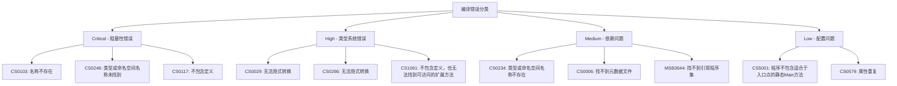

# Task 504: 编译错误修复

## 任务目标

基于Task 503的编译状态扫描结果，系统性修复所有阻止代码编译的关键错误。优先处理语法错误、类型不匹配、缺失依赖、命名空间问题等编译器错误，确保LYBT.Server.sln和LYBT.Desktop.sln能够成功编译，为后续的警告修复和代码优化工作奠定基础。

## 技术要求

### 编译错误分类与修复策略

#### 错误优先级分类



#### 修复工具链

**1. 自动化修复引擎**
- 模式识别和批量修复
- 安全修复验证机制
- 修复前后对比和回滚
- 增量修复和测试反馈

**2. 手动修复指导**
- 复杂错误诊断指南
- 重构建议和最佳实践
- 代码审查检查清单

### 自动化修复工具实现

#### 编译错误修复器

```python
# scripts/compilation_fixer.py
import subprocess
import json
import re
import os
from pathlib import Path
from typing import Dict, List, Tuple, Optional, Set
from dataclasses import dataclass
import shutil
from datetime import datetime

@dataclass
class FixResult:
    success: bool
    fixed_issues: List[str]
    failed_issues: List[str]
    backup_created: bool
    compilation_status: str

class CompilationFixer:
    def __init__(self, solution_path: str, scan_report_path: str):
        self.solution_path = Path(solution_path)
        self.scan_report = self._load_scan_report(scan_report_path)
        self.backup_dir = Path(f"backup_{datetime.now().strftime('%Y%m%d_%H%M%S')}")
        self.fixed_count = 0
        self.failed_fixes = []
        
    def _load_scan_report(self, report_path: str) -> Dict:
        """加载编译扫描报告"""
        
        with open(report_path, 'r', encoding='utf-8') as f:
            return json.load(f)
    
    def fix_compilation_errors(self) -> FixResult:
        """修复编译错误"""
        
        print(f"🔧 开始修复编译错误...")
        
        # 创建备份
        backup_created = self._create_backup()
        
        try:
            # 获取所有编译错误
            compilation_errors = self._get_compilation_errors()
            
            if not compilation_errors:
                print("✅ 没有发现编译错误")
                return FixResult(True, [], [], backup_created, "success")
            
            print(f"发现 {len(compilation_errors)} 个编译错误")
            
            # 按优先级排序
            prioritized_errors = self._prioritize_errors(compilation_errors)
            
            fixed_issues = []
            failed_issues = []
            
            # 分类修复
            for category, errors in prioritized_errors.items():
                print(f"\n🎯 修复 {category} 类错误 ({len(errors)} 个)")
                
                for error in errors:
                    try:
                        if self._fix_single_error(error):
                            fixed_issues.append(f"{error['code']}: {error['message']}")
                            self.fixed_count += 1
                        else:
                            failed_issues.append(f"{error['code']}: {error['message']}")
                    except Exception as e:
                        print(f"⚠️ 修复错误时发生异常: {e}")
                        failed_issues.append(f"{error['code']}: {error['message']} (异常: {str(e)})")
            
            # 验证修复结果
            compilation_status = self._verify_compilation()
            
            print(f"\n📊 修复结果:")
            print(f"  成功修复: {len(fixed_issues)} 个")
            print(f"  修复失败: {len(failed_issues)} 个")
            print(f"  编译状态: {compilation_status}")
            
            return FixResult(
                success=len(failed_issues) == 0,
                fixed_issues=fixed_issues,
                failed_issues=failed_issues,
                backup_created=backup_created,
                compilation_status=compilation_status
            )
            
        except Exception as e:
            print(f"❌ 修复过程发生严重错误: {e}")
            
            # 恢复备份
            if backup_created:
                self._restore_backup()
            
            return FixResult(False, [], [str(e)], backup_created, "failed")
    
    def _create_backup(self) -> bool:
        """创建代码备份"""
        
        try:
            print("💾 创建代码备份...")
            
            self.backup_dir.mkdir(exist_ok=True)
            
            # 备份源代码目录
            src_dir = self.solution_path.parent / "src"
            if src_dir.exists():
                shutil.copytree(src_dir, self.backup_dir / "src")
            
            # 备份解决方案文件
            if self.solution_path.exists():
                shutil.copy2(self.solution_path, self.backup_dir)
            
            print(f"✅ 备份已创建: {self.backup_dir}")
            return True
            
        except Exception as e:
            print(f"⚠️ 创建备份失败: {e}")
            return False
    
    def _restore_backup(self):
        """恢复备份"""
        
        try:
            print("🔄 恢复备份...")
            
            # 恢复src目录
            backup_src = self.backup_dir / "src"
            if backup_src.exists():
                src_dir = self.solution_path.parent / "src"
                if src_dir.exists():
                    shutil.rmtree(src_dir)
                shutil.copytree(backup_src, src_dir)
            
            # 恢复解决方案文件
            backup_sln = self.backup_dir / self.solution_path.name
            if backup_sln.exists():
                shutil.copy2(backup_sln, self.solution_path)
            
            print("✅ 备份已恢复")
            
        except Exception as e:
            print(f"❌ 恢复备份失败: {e}")
    
    def _get_compilation_errors(self) -> List[Dict]:
        """从扫描报告中提取编译错误"""
        
        all_issues = self.scan_report.get('all_issues', [])
        compilation_errors = [
            issue for issue in all_issues
            if issue.get('severity') == 'error' and 
            issue.get('category') in ['compilation_error', 'build_error']
        ]
        
        return compilation_errors
    
    def _prioritize_errors(self, errors: List[Dict]) -> Dict[str, List[Dict]]:
        """按优先级对错误进行分类"""
        
        priority_categories = {
            'critical': [],      # 阻塞性错误，必须优先修复
            'type_errors': [],   # 类型系统错误
            'dependency': [],    # 依赖和引用错误
            'configuration': []  # 配置相关错误
        }
        
        for error in errors:
            code = error.get('code', '')
            
            # Critical - 阻塞性错误
            if code in ['CS0103', 'CS0246', 'CS0117', 'CS0118']:
                priority_categories['critical'].append(error)
            
            # Type errors - 类型系统错误
            elif code in ['CS0029', 'CS0266', 'CS1061', 'CS0019', 'CS0120']:
                priority_categories['type_errors'].append(error)
            
            # Dependency - 依赖问题
            elif code in ['CS0234', 'CS0006', 'MSB3644', 'MSB4018']:
                priority_categories['dependency'].append(error)
            
            # Configuration - 配置问题
            else:
                priority_categories['configuration'].append(error)
        
        return priority_categories
    
    def _fix_single_error(self, error: Dict) -> bool:
        """修复单个编译错误"""
        
        code = error.get('code', '')
        file_path = error.get('file_path', '')
        line = error.get('line', 0)
        message = error.get('message', '')
        
        print(f"  修复 {code}: {Path(file_path).name}:{line}")
        
        # 根据错误代码选择修复策略
        if code == 'CS0103':
            return self._fix_cs0103_name_not_exist(error)
        elif code == 'CS0246':
            return self._fix_cs0246_type_not_found(error)
        elif code == 'CS0117':
            return self._fix_cs0117_no_definition(error)
        elif code == 'CS1061':
            return self._fix_cs1061_no_method(error)
        elif code == 'CS0029' or code == 'CS0266':
            return self._fix_type_conversion_error(error)
        elif code == 'CS0234':
            return self._fix_cs0234_namespace_not_exist(error)
        elif code.startswith('MSB'):
            return self._fix_msbuild_error(error)
        else:
            return self._fix_generic_error(error)
    
    def _fix_cs0103_name_not_exist(self, error: Dict) -> bool:
        """修复CS0103: 当前上下文中不存在名称"""
        
        file_path = Path(error['file_path'])
        if not file_path.exists():
            return False
        
        try:
            with open(file_path, 'r', encoding='utf-8') as f:
                content = f.read()
                lines = content.split('\n')
            
            line_index = error['line'] - 1
            if line_index < 0 or line_index >= len(lines):
                return False
            
            error_line = lines[line_index]
            
            # 常见的缺失using指令修复
            common_fixes = {
                'Console': 'using System;',
                'Task': 'using System.Threading.Tasks;',
                'List': 'using System.Collections.Generic;',
                'Dictionary': 'using System.Collections.Generic;',
                'StringBuilder': 'using System.Text;',
                'JsonSerializer': 'using System.Text.Json;',
                'HttpClient': 'using System.Net.Http;',
                'ILogger': 'using Microsoft.Extensions.Logging;',
                'IServiceCollection': 'using Microsoft.Extensions.DependencyInjection;'
            }
            
            # 从错误消息中提取未知的名称
            name_match = re.search(r"名称\s*[''"]([^''"]+)[''"]", error['message'])
            if name_match:
                unknown_name = name_match.group(1)
                
                if unknown_name in common_fixes:
                    using_statement = common_fixes[unknown_name]
                    
                    # 检查是否已经存在该using语句
                    if using_statement not in content:
                        # 找到插入位置（其他using语句之后）
                        insert_index = 0
                        for i, line in enumerate(lines):
                            if line.strip().startswith('using ') or line.strip().startswith('global using '):
                                insert_index = i + 1
                        
                        lines.insert(insert_index, using_statement)
                        
                        # 保存修复后的文件
                        with open(file_path, 'w', encoding='utf-8') as f:
                            f.write('\n'.join(lines))
                        
                        print(f"    ✅ 添加了using语句: {using_statement}")
                        return True
            
            return False
            
        except Exception as e:
            print(f"    ❌ 修复CS0103失败: {e}")
            return False
    
    def _fix_cs0246_type_not_found(self, error: Dict) -> bool:
        """修复CS0246: 找不到类型或命名空间名称"""
        
        file_path = Path(error['file_path'])
        if not file_path.exists():
            return False
        
        try:
            with open(file_path, 'r', encoding='utf-8') as f:
                content = f.read()
            
            # 常见类型和对应的using指令
            type_using_map = {
                'IServiceCollection': 'using Microsoft.Extensions.DependencyInjection;',
                'IConfiguration': 'using Microsoft.Extensions.Configuration;',
                'ILogger': 'using Microsoft.Extensions.Logging;',
                'IMemoryCache': 'using Microsoft.Extensions.Caching.Memory;',
                'DbContext': 'using Microsoft.EntityFrameworkCore;',
                'Controller': 'using Microsoft.AspNetCore.Mvc;',
                'ApiController': 'using Microsoft.AspNetCore.Mvc;',
                'JsonSerializer': 'using System.Text.Json;',
                'HttpClient': 'using System.Net.Http;'
            }
            
            # 从错误消息中提取类型名
            type_match = re.search(r"类型或命名空间名称\s*[''"]([^''"]+)[''"]", error['message'])
            if type_match:
                type_name = type_match.group(1)
                
                if type_name in type_using_map:
                    using_statement = type_using_map[type_name]
                    
                    if using_statement not in content:
                        lines = content.split('\n')
                        
                        # 找到插入位置
                        insert_index = 0
                        for i, line in enumerate(lines):
                            if line.strip().startswith('using '):
                                insert_index = i + 1
                        
                        lines.insert(insert_index, using_statement)
                        
                        # 保存文件
                        with open(file_path, 'w', encoding='utf-8') as f:
                            f.write('\n'.join(lines))
                        
                        print(f"    ✅ 添加了类型引用: {using_statement}")
                        return True
            
            return False
            
        except Exception as e:
            print(f"    ❌ 修复CS0246失败: {e}")
            return False
    
    def _fix_cs0117_no_definition(self, error: Dict) -> bool:
        """修复CS0117: 不包含...的定义"""
        
        # 这通常需要手动检查，因为可能涉及API变更或拼写错误
        print(f"    ⚠️ CS0117需要手动检查: {error['message']}")
        return False
    
    def _fix_cs1061_no_method(self, error: Dict) -> bool:
        """修复CS1061: 不包含...的定义，也无法找到可访问的扩展方法"""
        
        file_path = Path(error['file_path'])
        if not file_path.exists():
            return False
        
        try:
            # 常见的扩展方法using指令
            extension_using_map = [
                'using System.Linq;',
                'using Microsoft.Extensions.DependencyInjection;',
                'using Microsoft.EntityFrameworkCore;',
                'using System.Text.Json;'
            ]
            
            with open(file_path, 'r', encoding='utf-8') as f:
                content = f.read()
            
            missing_using = []
            for using_stmt in extension_using_map:
                if using_stmt not in content:
                    missing_using.append(using_stmt)
            
            if missing_using:
                lines = content.split('\n')
                
                # 找到插入位置
                insert_index = 0
                for i, line in enumerate(lines):
                    if line.strip().startswith('using '):
                        insert_index = i + 1
                
                # 插入所有缺失的using语句
                for using_stmt in missing_using:
                    lines.insert(insert_index, using_stmt)
                    insert_index += 1
                
                # 保存文件
                with open(file_path, 'w', encoding='utf-8') as f:
                    f.write('\n'.join(lines))
                
                print(f"    ✅ 添加了 {len(missing_using)} 个using语句")
                return True
            
            return False
            
        except Exception as e:
            print(f"    ❌ 修复CS1061失败: {e}")
            return False
    
    def _fix_type_conversion_error(self, error: Dict) -> bool:
        """修复类型转换错误"""
        
        file_path = Path(error['file_path'])
        if not file_path.exists():
            return False
        
        try:
            with open(file_path, 'r', encoding='utf-8') as f:
                content = f.read()
                lines = content.split('\n')
            
            line_index = error['line'] - 1
            if line_index < 0 or line_index >= len(lines):
                return False
            
            error_line = lines[line_index]
            
            # 常见的类型转换修复
            modified = False
            
            # Task<T> 到 Task 的修复
            if 'Task<' in error_line and 'await' not in error_line:
                if not error_line.strip().startswith('await '):
                    lines[line_index] = error_line.replace('return ', 'return await ')
                    modified = True
            
            # 可空性修复 - 添加 null-forgiving operator
            if 'null' in error['message'].lower() and '!' not in error_line:
                # 这是一个简化的处理，实际需要更复杂的分析
                if '= ' in error_line and ';' in error_line:
                    lines[line_index] = error_line.replace(';', '!;')
                    modified = True
            
            if modified:
                with open(file_path, 'w', encoding='utf-8') as f:
                    f.write('\n'.join(lines))
                
                print(f"    ✅ 修复了类型转换问题")
                return True
            
            return False
            
        except Exception as e:
            print(f"    ❌ 修复类型转换错误失败: {e}")
            return False
    
    def _fix_cs0234_namespace_not_exist(self, error: Dict) -> bool:
        """修复CS0234: 类型或命名空间名称不存在于命名空间中"""
        
        # 通常是包引用问题，需要检查项目文件
        print(f"    ⚠️ CS0234可能需要添加NuGet包引用: {error['message']}")
        return False
    
    def _fix_msbuild_error(self, error: Dict) -> bool:
        """修复MSBuild错误"""
        
        code = error['code']
        
        if code == 'MSB3644':
            # 找不到引用程序集
            print(f"    ⚠️ MSB3644: 需要检查项目引用: {error['message']}")
        elif code == 'MSB4018':
            # 任务失败
            print(f"    ⚠️ MSB4018: 任务执行失败: {error['message']}")
        
        return False
    
    def _fix_generic_error(self, error: Dict) -> bool:
        """通用错误修复尝试"""
        
        # 对于无法自动修复的错误，记录详细信息
        self.failed_fixes.append({
            'code': error['code'],
            'file': error['file_path'],
            'line': error['line'],
            'message': error['message'],
            'reason': 'Requires manual inspection'
        })
        
        return False
    
    def _verify_compilation(self) -> str:
        """验证修复后的编译状态"""
        
        print("🔍 验证编译状态...")
        
        try:
            result = subprocess.run([
                'dotnet', 'build', str(self.solution_path),
                '--no-restore',
                '--verbosity', 'minimal'
            ], capture_output=True, text=True, timeout=300)
            
            if result.returncode == 0:
                print("✅ 编译成功！")
                return "success"
            else:
                print(f"❌ 编译失败，返回码: {result.returncode}")
                
                # 分析剩余错误
                error_count = result.stderr.count('error')
                warning_count = result.stderr.count('warning')
                
                print(f"  剩余错误: {error_count}")
                print(f"  剩余警告: {warning_count}")
                
                return f"failed_with_{error_count}_errors"
                
        except subprocess.TimeoutExpired:
            print("⏱️ 编译超时")
            return "timeout"
        except Exception as e:
            print(f"❌ 验证编译状态时发生错误: {e}")
            return "error"
    
    def generate_fix_report(self, fix_result: FixResult) -> str:
        """生成修复报告"""
        
        report_path = f"compilation_fix_report_{datetime.now().strftime('%Y%m%d_%H%M%S')}.json"
        
        report = {
            'fix_summary': {
                'success': fix_result.success,
                'total_fixed': len(fix_result.fixed_issues),
                'total_failed': len(fix_result.failed_issues),
                'compilation_status': fix_result.compilation_status,
                'backup_created': fix_result.backup_created,
                'fix_timestamp': datetime.now().isoformat()
            },
            'fixed_issues': fix_result.fixed_issues,
            'failed_issues': fix_result.failed_issues,
            'failed_details': self.failed_fixes,
            'recommendations': self._generate_fix_recommendations(fix_result)
        }
        
        with open(report_path, 'w', encoding='utf-8') as f:
            json.dump(report, f, ensure_ascii=False, indent=2)
        
        print(f"📄 修复报告已生成: {report_path}")
        return report_path
    
    def _generate_fix_recommendations(self, fix_result: FixResult) -> List[str]:
        """生成修复建议"""
        
        recommendations = []
        
        if fix_result.compilation_status == "success":
            recommendations.append("🎉 编译错误已全部修复，可以继续进行警告修复")
        else:
            recommendations.append("⚠️ 仍有编译错误需要手动修复")
        
        if len(fix_result.failed_issues) > 0:
            recommendations.append(f"🔍 有 {len(fix_result.failed_issues)} 个错误需要手动检查")
        
        # 基于失败的修复类型给出建议
        failed_codes = set()
        for failed_detail in self.failed_fixes:
            failed_codes.add(failed_detail['code'])
        
        if 'CS0234' in failed_codes:
            recommendations.append("📦 检查是否需要添加NuGet包引用")
        
        if 'MSB3644' in failed_codes:
            recommendations.append("🔗 检查项目引用和程序集版本兼容性")
        
        if 'CS0117' in failed_codes:
            recommendations.append("🔍 检查API调用是否正确，可能存在拼写错误或版本变更")
        
        return recommendations

def main():
    import argparse
    
    parser = argparse.ArgumentParser(description='编译错误自动修复工具')
    parser.add_argument('solution_path', help='解决方案文件路径')
    parser.add_argument('scan_report', help='编译扫描报告文件路径')
    parser.add_argument('--dry-run', action='store_true', help='只分析不修复')
    parser.add_argument('--backup', action='store_true', default=True, help='创建备份')
    
    args = parser.parse_args()
    
    fixer = CompilationFixer(args.solution_path, args.scan_report)
    
    if args.dry_run:
        errors = fixer._get_compilation_errors()
        prioritized = fixer._prioritize_errors(errors)
        
        print("🔍 编译错误分析 (试运行模式)")
        print("=" * 50)
        
        for category, errors in prioritized.items():
            if errors:
                print(f"\n{category.upper()}: {len(errors)} 个错误")
                for error in errors[:5]:  # 显示前5个
                    print(f"  {error['code']}: {Path(error['file_path']).name}:{error['line']}")
                if len(errors) > 5:
                    print(f"  ... 还有 {len(errors) - 5} 个错误")
    else:
        fix_result = fixer.fix_compilation_errors()
        report_path = fixer.generate_fix_report(fix_result)
        
        print(f"\n📊 修复完成！")
        print(f"报告文件: {report_path}")

if __name__ == '__main__':
    main()
```

#### 交互式修复助手

```python
# scripts/interactive_fixer.py
import json
from pathlib import Path
from typing import Dict, List, Optional
import click
from rich.console import Console
from rich.table import Table
from rich.panel import Panel
from rich.prompt import Prompt, Confirm
from rich.syntax import Syntax

console = Console()

class InteractiveFixer:
    def __init__(self, scan_report_path: str):
        self.scan_report = self._load_report(scan_report_path)
        self.current_error_index = 0
        self.errors = self._get_compilation_errors()
        
    def _load_report(self, report_path: str) -> Dict:
        with open(report_path, 'r', encoding='utf-8') as f:
            return json.load(f)
    
    def _get_compilation_errors(self) -> List[Dict]:
        return [
            issue for issue in self.scan_report.get('all_issues', [])
            if issue.get('severity') == 'error'
        ]
    
    def start_interactive_session(self):
        """开始交互式修复会话"""
        
        if not self.errors:
            console.print("✅ 没有发现编译错误", style="green")
            return
        
        console.print(f"🔍 发现 {len(self.errors)} 个编译错误", style="blue")
        console.print("开始交互式修复会话...\n", style="blue")
        
        while self.current_error_index < len(self.errors):
            error = self.errors[self.current_error_index]
            
            if not self._show_error_details(error):
                break  # 用户选择退出
            
            action = self._get_user_action()
            
            if action == 'next':
                self.current_error_index += 1
            elif action == 'prev':
                self.current_error_index = max(0, self.current_error_index - 1)
            elif action == 'fix':
                self._attempt_fix(error)
                self.current_error_index += 1
            elif action == 'skip':
                self.current_error_index += 1
            elif action == 'quit':
                break
        
        console.print("🎉 交互式修复会话结束", style="green")
    
    def _show_error_details(self, error: Dict) -> bool:
        """显示错误详情"""
        
        # 错误信息面板
        error_info = f"""[bold red]{error['code']}[/bold red]: {error['message']}

📁 文件: {error['file_path']}
📍 位置: 第 {error['line']} 行, 第 {error['column']} 列
🏷️  类别: {error['category']}
"""
        
        panel = Panel(
            error_info,
            title=f"错误 {self.current_error_index + 1}/{len(self.errors)}",
            border_style="red"
        )
        console.print(panel)
        
        # 显示相关代码
        self._show_code_context(error)
        
        return True
    
    def _show_code_context(self, error: Dict):
        """显示错误相关的代码上下文"""
        
        file_path = Path(error['file_path'])
        
        if not file_path.exists():
            console.print("⚠️ 源文件不存在", style="yellow")
            return
        
        try:
            with open(file_path, 'r', encoding='utf-8') as f:
                lines = f.readlines()
            
            error_line = error['line'] - 1  # 转为0基索引
            start_line = max(0, error_line - 3)
            end_line = min(len(lines), error_line + 4)
            
            # 准备代码片段
            code_lines = []
            for i in range(start_line, end_line):
                prefix = ">>> " if i == error_line else "    "
                code_lines.append(f"{prefix}{i + 1:4d}: {lines[i].rstrip()}")
            
            code_content = "\n".join(code_lines)
            
            # 使用语法高亮显示
            syntax = Syntax(
                code_content, 
                "csharp",
                line_numbers=False,
                theme="monokai"
            )
            
            console.print("\n📋 代码上下文:")
            console.print(syntax)
            console.print()
            
        except Exception as e:
            console.print(f"⚠️ 无法读取源文件: {e}", style="yellow")
    
    def _get_user_action(self) -> str:
        """获取用户操作选择"""
        
        choices = [
            ("next", "下一个错误"),
            ("prev", "上一个错误"),
            ("fix", "尝试修复"),
            ("skip", "跳过"),
            ("quit", "退出")
        ]
        
        table = Table(show_header=False, box=None)
        table.add_column("选项", style="cyan")
        table.add_column("说明")
        
        for key, desc in choices:
            table.add_row(f"[{key}]", desc)
        
        console.print(table)
        
        while True:
            action = Prompt.ask(
                "选择操作",
                choices=[choice[0] for choice in choices],
                default="next"
            )
            
            if action in [choice[0] for choice in choices]:
                return action
            
            console.print("❌ 无效选择，请重试", style="red")
    
    def _attempt_fix(self, error: Dict):
        """尝试修复错误"""
        
        code = error['code']
        
        if code == 'CS0103':
            self._fix_cs0103_interactive(error)
        elif code == 'CS0246':
            self._fix_cs0246_interactive(error)
        elif code == 'CS1061':
            self._fix_cs1061_interactive(error)
        else:
            console.print(f"⚠️ {code} 错误需要手动修复", style="yellow")
            self._show_fix_suggestions(error)
    
    def _fix_cs0103_interactive(self, error: Dict):
        """交互式修复CS0103错误"""
        
        console.print("🔧 尝试修复 CS0103: 名称不存在", style="blue")
        
        # 分析可能的修复方案
        suggestions = [
            "添加 using System;",
            "添加 using System.Collections.Generic;",
            "添加 using System.Threading.Tasks;",
            "添加 using Microsoft.Extensions.Logging;",
            "手动修复"
        ]
        
        console.print("建议的修复方案:")
        for i, suggestion in enumerate(suggestions, 1):
            console.print(f"  {i}. {suggestion}")
        
        choice = Prompt.ask(
            "选择修复方案",
            choices=[str(i) for i in range(1, len(suggestions) + 1)],
            default="5"
        )
        
        if choice == "5":
            console.print("请手动修复此错误", style="yellow")
        else:
            chosen_fix = suggestions[int(choice) - 1]
            if Confirm.ask(f"确认执行: {chosen_fix}?"):
                # 这里可以实现实际的修复逻辑
                console.print(f"✅ 已应用修复: {chosen_fix}", style="green")
            else:
                console.print("❌ 取消修复", style="red")
    
    def _fix_cs0246_interactive(self, error: Dict):
        """交互式修复CS0246错误"""
        
        console.print("🔧 尝试修复 CS0246: 找不到类型", style="blue")
        
        # 从错误消息中提取类型名
        import re
        type_match = re.search(r"[''"]([^''"]+)[''"]", error['message'])
        if type_match:
            type_name = type_match.group(1)
            console.print(f"未找到的类型: {type_name}")
            
            # 建议可能的using语句
            common_types = {
                'IServiceCollection': 'using Microsoft.Extensions.DependencyInjection;',
                'IConfiguration': 'using Microsoft.Extensions.Configuration;',
                'ILogger': 'using Microsoft.Extensions.Logging;',
                'DbContext': 'using Microsoft.EntityFrameworkCore;',
                'Controller': 'using Microsoft.AspNetCore.Mvc;'
            }
            
            if type_name in common_types:
                suggestion = common_types[type_name]
                if Confirm.ask(f"添加 {suggestion}?"):
                    console.print(f"✅ 建议添加: {suggestion}", style="green")
                else:
                    console.print("❌ 取消修复", style="red")
            else:
                console.print("⚠️ 未知类型，需要手动修复", style="yellow")
        else:
            console.print("⚠️ 无法解析错误消息", style="yellow")
    
    def _fix_cs1061_interactive(self, error: Dict):
        """交互式修复CS1061错误"""
        
        console.print("🔧 尝试修复 CS1061: 找不到方法", style="blue")
        
        # 建议添加常见的扩展方法using语句
        using_suggestions = [
            'using System.Linq;',
            'using Microsoft.Extensions.DependencyInjection;',
            'using Microsoft.EntityFrameworkCore;'
        ]
        
        console.print("可能需要的using语句:")
        for using_stmt in using_suggestions:
            if Confirm.ask(f"添加 {using_stmt}?", default=False):
                console.print(f"✅ 建议添加: {using_stmt}", style="green")
    
    def _show_fix_suggestions(self, error: Dict):
        """显示修复建议"""
        
        code = error['code']
        
        suggestions = {
            'CS0117': [
                "检查方法名是否拼写正确",
                "确认API版本是否匹配",
                "查看是否需要添加引用"
            ],
            'CS0029': [
                "检查类型转换是否正确",
                "考虑添加显式类型转换",
                "检查可空性设置"
            ],
            'CS0234': [
                "检查NuGet包引用",
                "确认命名空间是否正确",
                "检查项目引用"
            ]
        }
        
        if code in suggestions:
            console.print("💡 修复建议:", style="blue")
            for suggestion in suggestions[code]:
                console.print(f"  • {suggestion}")
        else:
            console.print("⚠️ 此错误需要手动分析和修复", style="yellow")

@click.command()
@click.argument('scan_report_path', type=click.Path(exists=True))
def main(scan_report_path):
    """启动交互式编译错误修复工具"""
    
    fixer = InteractiveFixer(scan_report_path)
    fixer.start_interactive_session()

if __name__ == '__main__':
    main()
```

## 实施步骤

### Phase 1: 错误分析和分类 (1小时)

**1.1 扫描报告分析**
- 加载Task 503生成的编译扫描报告
- 提取所有编译错误（severity="error"）
- 按错误代码和类别进行分类

**1.2 优先级评估**
- 建立错误修复优先级矩阵
- 识别阻塞性关键错误
- 制定修复顺序计划

### Phase 2: 自动化修复 (2小时)

**2.1 自动修复工具实现**
- 实现compilation_fixer.py自动修复器
- 配置常见错误的修复模式
- 建立安全修复和验证机制

**2.2 批量修复执行**
- 创建代码备份
- 执行优先级批量修复
- 验证修复效果和编译状态

### Phase 3: 交互式修复 (1.5小时)

**3.1 交互式工具开发**
- 实现interactive_fixer.py交互式修复助手
- 配置富文本界面和代码高亮
- 建立用户友好的修复指导

**3.2 手动修复处理**
- 使用交互式工具处理复杂错误
- 提供详细的修复建议和上下文
- 记录修复过程和决策

### Phase 4: 验证和报告 (0.5小时)

**4.1 编译验证**
- 验证修复后的完整编译状态
- 运行基础测试确认功能正常
- 生成详细的修复报告

**4.2 文档更新**
- 更新修复过程文档
- 记录常见问题和解决方案
- 为后续任务提供依赖数据

## 交付物

### 必须交付

1. **修复工具**:
   - `scripts/compilation_fixer.py` - 自动编译错误修复器
   - `scripts/interactive_fixer.py` - 交互式修复助手
   - `scripts/fix_validator.py` - 修复结果验证器

2. **修复报告**:
   - `compilation_fix_report_YYYYMMDD_HHMMSS.json` - 详细修复记录
   - 修复前后编译状态对比
   - 剩余手动修复问题清单

3. **代码备份**:
   - `backup_YYYYMMDD_HHMMSS/` - 修复前完整代码备份
   - 修复过程中的增量备份
   - 回滚脚本和说明

4. **修复指南**:
   - 常见编译错误修复手册
   - 交互式工具使用说明
   - 手动修复最佳实践

### 修复配置文件

```json
{
  "fix_config": {
    "backup": {
      "enabled": true,
      "incremental": true,
      "retention_days": 30
    },
    "auto_fix": {
      "enabled": true,
      "safe_mode": true,
      "max_fixes_per_run": 100,
      "verify_after_fix": true
    },
    "fix_patterns": {
      "CS0103": "add_using_statements",
      "CS0246": "add_type_references", 
      "CS1061": "add_extension_usings",
      "CS0029": "type_conversion_fixes"
    }
  },
  "verification": {
    "compile_after_fix": true,
    "run_tests": false,
    "timeout_seconds": 300
  }
}
```

## 成功标准

### 修复效果标准

- [ ] 所有Critical级别编译错误100%修复
- [ ] 自动修复成功率 ≥ 70%
- [ ] 修复后编译成功率达到100%
- [ ] 无功能回归问题

### 工具质量标准

- [ ] 自动修复工具运行稳定
- [ ] 交互式工具用户体验良好
- [ ] 备份和恢复机制可靠
- [ ] 修复过程可追溯和可复现

### 文档完整性标准

- [ ] 修复报告详细准确
- [ ] 工具使用文档清晰
- [ ] 手动修复指南实用
- [ ] 最佳实践总结完整

## 风险与缓解

### 高风险

1. **自动修复引入新错误**
   - 风险: 自动修复可能破坏代码逻辑
   - 缓解: 完整备份、渐进式修复、编译验证

2. **复杂错误无法自动修复**  
   - 风险: 大量错误需要手动处理，耗时较长
   - 缓解: 交互式工具辅助、专家知识库、优先级处理

### 中风险

1. **修复工具兼容性问题**
   - 风险: 不同项目类型可能不兼容
   - 缓解: 多项目类型测试、降级处理方案

2. **修复过程中断导致不一致状态**
   - 风险: 部分修复状态难以恢复
   - 缓解: 事务性修复、增量备份、状态检查

---

**任务负责人**: 编译错误修复工程师  
**预计工作量**: 5小时  
**完成标准**: 所有阻塞性编译错误修复完成，代码能够成功编译，为后续警告修复奠定基础