# Task 505: 编译警告修复

## 任务目标

基于Task 503的扫描结果和Task 504的错误修复成果，系统性修复所有编译警告。优先处理可空性警告（nullable reference types）、过时API警告、性能建议、代码质量警告等，确保代码符合最新的C#语言标准和最佳实践，为后续的代码质量优化奠定基础。

## 技术要求

### 警告分类与修复策略

#### 警告优先级分类

```mermaid
graph TB
    A[编译警告分类] --> B[High - 可空性警告]
    A --> C[High - 安全警告]
    A --> D[Medium - 性能警告]
    A --> E[Medium - 现代化建议]
    A --> F[Low - 代码质量警告]
    A --> G[Low - 格式化警告]
    
    B --> H[CS8600: 可能的null引用]
    B --> I[CS8602: null引用取消引用]
    B --> J[CS8604: null引用参数]
    B --> K[CS8618: 不可为null的字段未初始化]
    
    C --> L[CA3075: 不安全的DTD处理]
    C --> M[CA5350: 不安全的加密算法]
    C --> N[CA5351: 不安全的加密模式]
    
    D --> O[CA1822: 标记成员为static]
    D --> P[CA1860: 使用Count替代Any]
    D --> Q[CA2007: 使用ConfigureAwait]
    
    E --> R[IDE0290: 主构造函数]
    E --> S[IDE0028: 集合表达式]
    E --> T[IDE0270: null检查]
    
    F --> U[CA1304: 指定CultureInfo]
    F --> V[CA1305: 指定IFormatProvider]
    F --> W[SA1200: Using语句排序]
    
    G --> X[IDE0008: 显式类型]
    G --> Y[IDE0011: 添加大括号]
    G --> Z[IDE0055: 格式化]
```



#### 修复工具链

**1. 可空性警告修复**
- Nullable Reference Types配置优化
- null-forgiving operator (!) 合理使用
- null检查和防护代码添加
- 类型注解和属性优化

**2. 现代化语法转换**
- C# 12新特性应用
- 主构造函数转换
- 集合表达式优化
- 模式匹配现代化

**3. 性能优化建议**
- 静态方法标记
- 高效集合操作
- 异步模式优化
- 内存分配优化

### 自动化警告修复工具实现

#### 警告修复器

```python
# scripts/warning_fixer.py
import subprocess
import json
import re
import os
from pathlib import Path
from typing import Dict, List, Tuple, Optional, Set
from dataclasses import dataclass
import shutil
from datetime import datetime
import ast

@dataclass
class WarningFixResult:
    success: bool
    fixed_warnings: List[str]
    skipped_warnings: List[str]
    failed_warnings: List[str]
    warnings_before: int
    warnings_after: int
    backup_created: bool

class WarningFixer:
    def __init__(self, solution_path: str, scan_report_path: str):
        self.solution_path = Path(solution_path)
        self.scan_report = self._load_scan_report(scan_report_path)
        self.backup_dir = Path(f"warning_fix_backup_{datetime.now().strftime('%Y%m%d_%H%M%S')}")
        self.fixed_count = 0
        self.skipped_count = 0
        self.failed_fixes = []
        
    def _load_scan_report(self, report_path: str) -> Dict:
        """加载编译扫描报告"""
        
        with open(report_path, 'r', encoding='utf-8') as f:
            return json.load(f)
    
    def fix_compilation_warnings(self) -> WarningFixResult:
        """修复编译警告"""
        
        print(f"⚠️ 开始修复编译警告...")
        
        # 创建备份
        backup_created = self._create_backup()
        
        # 获取修复前警告计数
        warnings_before = self._count_warnings()
        
        try:
            # 获取所有编译警告
            compilation_warnings = self._get_compilation_warnings()
            
            if not compilation_warnings:
                print("✅ 没有发现编译警告")
                return WarningFixResult(True, [], [], [], 0, 0, backup_created)
            
            print(f"发现 {len(compilation_warnings)} 个编译警告")
            
            # 按优先级和类别排序
            prioritized_warnings = self._prioritize_warnings(compilation_warnings)
            
            fixed_warnings = []
            skipped_warnings = []
            failed_warnings = []
            
            # 分类修复
            for category, warnings in prioritized_warnings.items():
                if not warnings:
                    continue
                    
                print(f"\n🎯 处理 {category} 类警告 ({len(warnings)} 个)")
                
                for warning in warnings:
                    try:
                        fix_result = self._fix_single_warning(warning)
                        
                        if fix_result == 'fixed':
                            fixed_warnings.append(f"{warning['code']}: {warning['message']}")
                            self.fixed_count += 1
                        elif fix_result == 'skipped':
                            skipped_warnings.append(f"{warning['code']}: {warning['message']}")
                            self.skipped_count += 1
                        else:
                            failed_warnings.append(f"{warning['code']}: {warning['message']}")
                            
                    except Exception as e:
                        print(f"⚠️ 修复警告时发生异常: {e}")
                        failed_warnings.append(f"{warning['code']}: {warning['message']} (异常: {str(e)})")
            
            # 获取修复后警告计数
            warnings_after = self._count_warnings()
            
            print(f"\n📊 修复结果:")
            print(f"  成功修复: {len(fixed_warnings)} 个")
            print(f"  跳过处理: {len(skipped_warnings)} 个")
            print(f"  修复失败: {len(failed_warnings)} 个")
            print(f"  警告总数变化: {warnings_before} → {warnings_after}")
            
            return WarningFixResult(
                success=len(failed_warnings) == 0,
                fixed_warnings=fixed_warnings,
                skipped_warnings=skipped_warnings,
                failed_warnings=failed_warnings,
                warnings_before=warnings_before,
                warnings_after=warnings_after,
                backup_created=backup_created
            )
            
        except Exception as e:
            print(f"❌ 修复过程发生严重错误: {e}")
            
            # 恢复备份
            if backup_created:
                self._restore_backup()
            
            return WarningFixResult(
                False, [], [], [str(e)], 
                warnings_before, warnings_before, backup_created
            )
    
    def _create_backup(self) -> bool:
        """创建代码备份"""
        
        try:
            print("💾 创建代码备份...")
            
            self.backup_dir.mkdir(exist_ok=True)
            
            # 备份源代码目录
            src_dir = self.solution_path.parent / "src"
            if src_dir.exists():
                shutil.copytree(src_dir, self.backup_dir / "src")
            
            print(f"✅ 备份已创建: {self.backup_dir}")
            return True
            
        except Exception as e:
            print(f"⚠️ 创建备份失败: {e}")
            return False
    
    def _restore_backup(self):
        """恢复备份"""
        
        try:
            print("🔄 恢复备份...")
            
            # 恢复src目录
            backup_src = self.backup_dir / "src"
            if backup_src.exists():
                src_dir = self.solution_path.parent / "src"
                if src_dir.exists():
                    shutil.rmtree(src_dir)
                shutil.copytree(backup_src, src_dir)
            
            print("✅ 备份已恢复")
            
        except Exception as e:
            print(f"❌ 恢复备份失败: {e}")
    
    def _get_compilation_warnings(self) -> List[Dict]:
        """从扫描报告中提取编译警告"""
        
        all_issues = self.scan_report.get('all_issues', [])
        compilation_warnings = [
            issue for issue in all_issues
            if issue.get('severity') == 'warning'
        ]
        
        return compilation_warnings
    
    def _prioritize_warnings(self, warnings: List[Dict]) -> Dict[str, List[Dict]]:
        """按优先级对警告进行分类"""
        
        priority_categories = {
            'nullability': [],      # 可空性警告
            'security': [],         # 安全警告  
            'performance': [],      # 性能警告
            'modernization': [],    # 现代化建议
            'code_quality': [],     # 代码质量
            'formatting': []        # 格式化问题
        }
        
        for warning in warnings:
            code = warning.get('code', '')
            category = warning.get('category', 'other')
            
            # 基于category分类
            if category in priority_categories:
                priority_categories[category].append(warning)
            else:
                # 基于错误代码分类
                if code.startswith('CS8'):
                    priority_categories['nullability'].append(warning)
                elif code.startswith('CA3') or code.startswith('CA5'):
                    priority_categories['security'].append(warning)
                elif code.startswith('CA1') or code.startswith('CA2'):
                    priority_categories['performance'].append(warning)
                elif code.startswith('IDE0'):
                    priority_categories['modernization'].append(warning)
                elif code.startswith('CA'):
                    priority_categories['code_quality'].append(warning)
                else:
                    priority_categories['formatting'].append(warning)
        
        return priority_categories
    
    def _fix_single_warning(self, warning: Dict) -> str:
        """修复单个编译警告
        
        Returns:
            'fixed' - 修复成功
            'skipped' - 跳过处理
            'failed' - 修复失败
        """
        
        code = warning.get('code', '')
        file_path = warning.get('file_path', '')
        line = warning.get('line', 0)
        category = warning.get('category', '')
        
        if not Path(file_path).exists():
            return 'skipped'
        
        print(f"  处理 {code}: {Path(file_path).name}:{line}")
        
        # 根据警告类别选择修复策略
        if category == 'nullability' or code.startswith('CS8'):
            return self._fix_nullability_warning(warning)
        elif category == 'performance' or code in ['CA1822', 'CA1860', 'CA2007']:
            return self._fix_performance_warning(warning)
        elif category == 'modernization' or code.startswith('IDE0'):
            return self._fix_modernization_warning(warning)
        elif category == 'security':
            return self._fix_security_warning(warning)
        elif category == 'code_quality':
            return self._fix_code_quality_warning(warning)
        elif category == 'formatting':
            return self._fix_formatting_warning(warning)
        else:
            return self._fix_generic_warning(warning)
    
    def _fix_nullability_warning(self, warning: Dict) -> str:
        """修复可空性警告"""
        
        code = warning['code']
        file_path = Path(warning['file_path'])
        line_num = warning['line']
        
        try:
            with open(file_path, 'r', encoding='utf-8') as f:
                content = f.read()
                lines = content.split('\n')
            
            line_index = line_num - 1
            if line_index < 0 or line_index >= len(lines):
                return 'failed'
            
            error_line = lines[line_index]
            original_line = error_line
            modified = False
            
            if code == 'CS8600':  # 可能的null引用
                # 为可能为null的赋值添加null检查
                if ' = ' in error_line and '!' not in error_line:
                    # 简单添加null-forgiving operator
                    if ';' in error_line:
                        error_line = error_line.replace(';', '!;')
                        modified = True
            
            elif code == 'CS8602':  # null引用取消引用
                # 为可能为null的成员访问添加null检查
                if '.' in error_line and '?' not in error_line:
                    # 添加null-conditional operator
                    # 这是一个简化处理，实际需要更复杂的语法分析
                    if not error_line.strip().startswith('//'):
                        # 找到第一个成员访问并添加?
                        dot_pos = error_line.find('.')
                        if dot_pos > 0:
                            error_line = error_line[:dot_pos] + '?.' + error_line[dot_pos+1:]
                            modified = True
            
            elif code == 'CS8604':  # null引用参数
                # 为可能为null的参数添加检查
                if '(' in error_line and ')' in error_line:
                    # 添加null-forgiving operator到参数
                    if '!' not in error_line:
                        error_line = error_line.replace(')', '!)')
                        modified = True
            
            elif code == 'CS8618':  # 不可为null的字段未初始化
                # 为字段添加默认初始化或null-forgiving
                if 'public ' in error_line or 'private ' in error_line:
                    if '= ' not in error_line and ';' in error_line:
                        # 添加默认初始化
                        if 'string' in error_line:
                            error_line = error_line.replace(';', ' = string.Empty;')
                        elif 'List<' in error_line:
                            error_line = error_line.replace(';', ' = new();')
                        else:
                            error_line = error_line.replace(';', ' = default!;')
                        modified = True
            
            if modified:
                lines[line_index] = error_line
                
                with open(file_path, 'w', encoding='utf-8') as f:
                    f.write('\n'.join(lines))
                
                print(f"    ✅ 修复可空性警告")
                return 'fixed'
            else:
                print(f"    ⏭️ 可空性警告需手动处理")
                return 'skipped'
                
        except Exception as e:
            print(f"    ❌ 修复可空性警告失败: {e}")
            return 'failed'
    
    def _fix_performance_warning(self, warning: Dict) -> str:
        """修复性能警告"""
        
        code = warning['code']
        file_path = Path(warning['file_path'])
        line_num = warning['line']
        
        try:
            with open(file_path, 'r', encoding='utf-8') as f:
                content = f.read()
                lines = content.split('\n')
            
            line_index = line_num - 1
            if line_index < 0 or line_index >= len(lines):
                return 'failed'
            
            error_line = lines[line_index]
            modified = False
            
            if code == 'CA1822':  # 标记成员为static
                # 为不使用实例状态的方法添加static关键字
                if ('public ' in error_line or 'private ' in error_line) and 'static' not in error_line:
                    if ' void ' in error_line or ' Task' in error_line or ' string ' in error_line:
                        # 在访问修饰符后添加static
                        for modifier in ['public ', 'private ', 'protected ', 'internal ']:
                            if modifier in error_line:
                                error_line = error_line.replace(modifier, modifier + 'static ')
                                modified = True
                                break
            
            elif code == 'CA1860':  # 使用Count替代Any()
                # 将集合的Any()调用替换为Count检查
                if '.Any()' in error_line:
                    error_line = error_line.replace('.Any()', '.Count > 0')
                    modified = True
                elif '.Any(' in error_line and ')' in error_line:
                    # 这需要更复杂的处理，先跳过
                    return 'skipped'
            
            elif code == 'CA2007':  # ConfigureAwait(false)
                # 为await调用添加ConfigureAwait(false)
                if 'await ' in error_line and 'ConfigureAwait' not in error_line:
                    # 找到await后的方法调用
                    await_pos = error_line.find('await ')
                    if await_pos >= 0:
                        # 在方法调用结束前添加ConfigureAwait(false)
                        if ';' in error_line:
                            error_line = error_line.replace(';', '.ConfigureAwait(false);')
                            modified = True
            
            if modified:
                lines[line_index] = error_line
                
                with open(file_path, 'w', encoding='utf-8') as f:
                    f.write('\n'.join(lines))
                
                print(f"    ✅ 修复性能警告 {code}")
                return 'fixed'
            else:
                print(f"    ⏭️ 性能警告 {code} 需手动处理")
                return 'skipped'
                
        except Exception as e:
            print(f"    ❌ 修复性能警告失败: {e}")
            return 'failed'
    
    def _fix_modernization_warning(self, warning: Dict) -> str:
        """修复现代化建议"""
        
        code = warning['code']
        file_path = Path(warning['file_path'])
        line_num = warning['line']
        
        try:
            with open(file_path, 'r', encoding='utf-8') as f:
                content = f.read()
                lines = content.split('\n')
            
            line_index = line_num - 1
            if line_index < 0 or line_index >= len(lines):
                return 'failed'
            
            error_line = lines[line_index]
            modified = False
            
            if code == 'IDE0290':  # 主构造函数
                # 这需要类级别的重构，比较复杂，先跳过
                return 'skipped'
            
            elif code == 'IDE0028':  # 集合表达式
                # 将new List<>() 或new[] 替换为集合表达式 
                if 'new List<' in error_line and '()' in error_line:
                    # new List<Type>() → []
                    # 需要检查是否有初始化器
                    if '{' not in error_line:
                        error_line = re.sub(r'new List<[^>]+>\(\)', '[]', error_line)
                        modified = True
                elif 'new[]' in error_line:
                    # new[] { } → [ ]
                    error_line = error_line.replace('new[]', '')
                    modified = True
            
            elif code == 'IDE0270':  # null检查简化
                # 将 x != null 替换为 x is not null
                if ' != null' in error_line:
                    error_line = error_line.replace(' != null', ' is not null')
                    modified = True
                elif ' == null' in error_line:
                    error_line = error_line.replace(' == null', ' is null')
                    modified = True
            
            elif code == 'IDE0008':  # 使用显式类型
                # var → 显式类型，但这需要类型推断，比较复杂
                return 'skipped'
            
            elif code == 'IDE0011':  # 添加大括号
                # 为if/for/while等语句添加大括号
                stripped_line = error_line.strip()
                if (stripped_line.startswith('if ') or 
                    stripped_line.startswith('for ') or 
                    stripped_line.startswith('while ') or
                    stripped_line.startswith('else ')) and '{' not in error_line:
                    
                    # 这需要多行处理，先跳过
                    return 'skipped'
            
            if modified:
                lines[line_index] = error_line
                
                with open(file_path, 'w', encoding='utf-8') as f:
                    f.write('\n'.join(lines))
                
                print(f"    ✅ 修复现代化建议 {code}")
                return 'fixed'
            else:
                print(f"    ⏭️ 现代化建议 {code} 需手动处理")
                return 'skipped'
                
        except Exception as e:
            print(f"    ❌ 修复现代化建议失败: {e}")
            return 'failed'
    
    def _fix_security_warning(self, warning: Dict) -> str:
        """修复安全警告"""
        
        # 安全警告通常需要仔细评估，不适合自动修复
        code = warning['code']
        print(f"    ⚠️ 安全警告 {code} 需要手动评估和修复")
        return 'skipped'
    
    def _fix_code_quality_warning(self, warning: Dict) -> str:
        """修复代码质量警告"""
        
        code = warning['code']
        file_path = Path(warning['file_path'])
        
        # 大部分代码质量警告需要上下文分析，先跳过
        print(f"    ⏭️ 代码质量警告 {code} 需手动处理")
        return 'skipped'
    
    def _fix_formatting_warning(self, warning: Dict) -> str:
        """修复格式化警告"""
        
        # 格式化问题应该通过dotnet format解决
        print(f"    💡 格式化问题建议使用 'dotnet format' 命令批量修复")
        return 'skipped'
    
    def _fix_generic_warning(self, warning: Dict) -> str:
        """通用警告修复尝试"""
        
        code = warning['code']
        print(f"    ⏭️ 未知警告类型 {code}，需手动检查")
        return 'skipped'
    
    def _count_warnings(self) -> int:
        """统计当前警告数量"""
        
        try:
            result = subprocess.run([
                'dotnet', 'build', str(self.solution_path),
                '--no-restore',
                '--verbosity', 'minimal'
            ], capture_output=True, text=True, timeout=300)
            
            # 从输出中统计警告数量
            warning_count = result.stdout.count('warning') + result.stderr.count('warning')
            return warning_count
            
        except Exception as e:
            print(f"⚠️ 统计警告数量失败: {e}")
            return 0
    
    def generate_warning_fix_report(self, fix_result: WarningFixResult) -> str:
        """生成警告修复报告"""
        
        report_path = f"warning_fix_report_{datetime.now().strftime('%Y%m%d_%H%M%S')}.json"
        
        improvement_rate = 0
        if fix_result.warnings_before > 0:
            improvement_rate = ((fix_result.warnings_before - fix_result.warnings_after) / fix_result.warnings_before) * 100
        
        report = {
            'fix_summary': {
                'success': fix_result.success,
                'total_fixed': len(fix_result.fixed_warnings),
                'total_skipped': len(fix_result.skipped_warnings),
                'total_failed': len(fix_result.failed_warnings),
                'warnings_before': fix_result.warnings_before,
                'warnings_after': fix_result.warnings_after,
                'improvement_rate': round(improvement_rate, 2),
                'backup_created': fix_result.backup_created,
                'fix_timestamp': datetime.now().isoformat()
            },
            'fixed_warnings': fix_result.fixed_warnings,
            'skipped_warnings': fix_result.skipped_warnings,
            'failed_warnings': fix_result.failed_warnings,
            'recommendations': self._generate_warning_fix_recommendations(fix_result)
        }
        
        with open(report_path, 'w', encoding='utf-8') as f:
            json.dump(report, f, ensure_ascii=False, indent=2)
        
        print(f"📄 警告修复报告已生成: {report_path}")
        return report_path
    
    def _generate_warning_fix_recommendations(self, fix_result: WarningFixResult) -> List[str]:
        """生成警告修复建议"""
        
        recommendations = []
        
        if fix_result.warnings_after == 0:
            recommendations.append("🎉 所有编译警告已清理完毕，代码质量达到优秀水平")
        elif fix_result.warnings_after < fix_result.warnings_before / 2:
            recommendations.append("✅ 警告数量已显著减少，继续处理剩余警告")
        else:
            recommendations.append("⚠️ 仍有较多警告需要处理，建议重点关注高优先级警告")
        
        if len(fix_result.skipped_warnings) > 10:
            recommendations.append("💡 有大量警告被跳过，建议使用交互式工具逐一处理")
        
        if len(fix_result.failed_warnings) > 0:
            recommendations.append("🔍 有修复失败的警告，可能需要手动检查和修复")
        
        recommendations.extend([
            "📝 建议运行 'dotnet format' 处理格式化问题",
            "🔧 考虑启用 EditorConfig 统一代码风格",
            "📋 建议定期运行警告扫描保持代码质量"
        ])
        
        return recommendations

def main():
    import argparse
    
    parser = argparse.ArgumentParser(description='编译警告自动修复工具')
    parser.add_argument('solution_path', help='解决方案文件路径')
    parser.add_argument('scan_report', help='编译扫描报告文件路径')
    parser.add_argument('--category', choices=['nullability', 'performance', 'modernization', 'all'], 
                       default='all', help='修复特定类别的警告')
    parser.add_argument('--dry-run', action='store_true', help='只分析不修复')
    
    args = parser.parse_args()
    
    fixer = WarningFixer(args.solution_path, args.scan_report)
    
    if args.dry_run:
        warnings = fixer._get_compilation_warnings()
        prioritized = fixer._prioritize_warnings(warnings)
        
        print("⚠️ 编译警告分析 (试运行模式)")
        print("=" * 50)
        
        total_warnings = sum(len(warnings_list) for warnings_list in prioritized.values())
        print(f"\n总警告数量: {total_warnings}")
        
        for category, warnings_list in prioritized.items():
            if warnings_list:
                print(f"\n{category.upper()}: {len(warnings_list)} 个警告")
                # 统计警告代码分布
                code_counts = {}
                for warning in warnings_list:
                    code = warning['code']
                    code_counts[code] = code_counts.get(code, 0) + 1
                
                for code, count in sorted(code_counts.items(), key=lambda x: x[1], reverse=True):
                    print(f"  {code}: {count} 个")
    else:
        fix_result = fixer.fix_compilation_warnings()
        report_path = fixer.generate_warning_fix_report(fix_result)
        
        print(f"\n📊 警告修复完成！")
        print(f"报告文件: {report_path}")
        
        if fix_result.warnings_after > 0:
            print(f"\n💡 剩余 {fix_result.warnings_after} 个警告，建议运行:")
            print(f"  python interactive_warning_fixer.py {args.scan_report}")

if __name__ == '__main__':
    main()
```

#### 交互式警告修复助手

```python
# scripts/interactive_warning_fixer.py
import json
from pathlib import Path
from typing import Dict, List, Optional
import click
from rich.console import Console
from rich.table import Table
from rich.panel import Panel
from rich.prompt import Prompt, Confirm
from rich.syntax import Syntax
from rich.progress import Progress, TaskID

console = Console()

class InteractiveWarningFixer:
    def __init__(self, scan_report_path: str):
        self.scan_report = self._load_report(scan_report_path)
        self.current_warning_index = 0
        self.warnings = self._get_compilation_warnings()
        self.fixed_count = 0
        self.skipped_count = 0
        
    def _load_report(self, report_path: str) -> Dict:
        with open(report_path, 'r', encoding='utf-8') as f:
            return json.load(f)
    
    def _get_compilation_warnings(self) -> List[Dict]:
        return [
            issue for issue in self.scan_report.get('all_issues', [])
            if issue.get('severity') == 'warning'
        ]
    
    def start_interactive_session(self):
        """开始交互式修复会话"""
        
        if not self.warnings:
            console.print("✅ 没有发现编译警告", style="green")
            return
        
        console.print(f"⚠️ 发现 {len(self.warnings)} 个编译警告", style="yellow")
        console.print("开始交互式修复会话...\n", style="blue")
        
        # 显示警告分类统计
        self._show_warning_statistics()
        
        if not Confirm.ask("开始逐一处理警告？"):
            return
        
        while self.current_warning_index < len(self.warnings):
            warning = self.warnings[self.current_warning_index]
            
            if not self._show_warning_details(warning):
                break  # 用户选择退出
            
            action = self._get_user_action()
            
            if action == 'next':
                self.current_warning_index += 1
            elif action == 'prev':
                self.current_warning_index = max(0, self.current_warning_index - 1)
            elif action == 'fix':
                if self._attempt_fix(warning):
                    self.fixed_count += 1
                else:
                    self.skipped_count += 1
                self.current_warning_index += 1
            elif action == 'skip':
                self.skipped_count += 1
                self.current_warning_index += 1
            elif action == 'skip_category':
                current_code = warning['code']
                self._skip_category(current_code)
            elif action == 'quit':
                break
        
        self._show_session_summary()
    
    def _show_warning_statistics(self):
        """显示警告统计信息"""
        
        # 按类别统计
        category_counts = {}
        code_counts = {}
        
        for warning in self.warnings:
            category = warning.get('category', 'other')
            code = warning.get('code', 'unknown')
            
            category_counts[category] = category_counts.get(category, 0) + 1
            code_counts[code] = code_counts.get(code, 0) + 1
        
        # 创建统计表格
        table = Table(title="警告分类统计", show_header=True, header_style="bold magenta")
        table.add_column("类别", style="cyan")
        table.add_column("数量", justify="right")
        table.add_column("主要警告代码", style="yellow")
        
        for category, count in sorted(category_counts.items(), key=lambda x: x[1], reverse=True):
            # 找出该类别的主要警告代码
            category_codes = [w['code'] for w in self.warnings if w.get('category') == category]
            main_codes = list(set(category_codes))[:3]  # 前3个不重复的代码
            
            table.add_row(
                category,
                str(count),
                ', '.join(main_codes)
            )
        
        console.print(table)
        console.print()
    
    def _show_warning_details(self, warning: Dict) -> bool:
        """显示警告详情"""
        
        # 警告信息面板
        warning_info = f"""[bold yellow]{warning['code']}[/bold yellow]: {warning['message']}

📁 文件: {warning['file_path']}
📍 位置: 第 {warning['line']} 行, 第 {warning['column']} 列
🏷️  类别: {warning['category']}
📊 进度: {self.current_warning_index + 1}/{len(self.warnings)}
"""
        
        panel = Panel(
            warning_info,
            title=f"警告详情",
            border_style="yellow"
        )
        console.print(panel)
        
        # 显示相关代码
        self._show_code_context(warning)
        
        # 显示修复建议
        self._show_fix_suggestion(warning)
        
        return True
    
    def _show_code_context(self, warning: Dict):
        """显示警告相关的代码上下文"""
        
        file_path = Path(warning['file_path'])
        
        if not file_path.exists():
            console.print("⚠️ 源文件不存在", style="yellow")
            return
        
        try:
            with open(file_path, 'r', encoding='utf-8') as f:
                lines = f.readlines()
            
            warning_line = warning['line'] - 1  # 转为0基索引
            start_line = max(0, warning_line - 2)
            end_line = min(len(lines), warning_line + 3)
            
            # 准备代码片段
            code_lines = []
            for i in range(start_line, end_line):
                prefix = ">>> " if i == warning_line else "    "
                code_lines.append(f"{prefix}{i + 1:4d}: {lines[i].rstrip()}")
            
            code_content = "\n".join(code_lines)
            
            # 使用语法高亮显示
            syntax = Syntax(
                code_content, 
                "csharp",
                line_numbers=False,
                theme="monokai"
            )
            
            console.print("\n📋 代码上下文:")
            console.print(syntax)
            console.print()
            
        except Exception as e:
            console.print(f"⚠️ 无法读取源文件: {e}", style="yellow")
    
    def _show_fix_suggestion(self, warning: Dict):
        """显示修复建议"""
        
        code = warning['code']
        category = warning.get('category', '')
        
        suggestions = self._get_fix_suggestions(code, category)
        
        if suggestions:
            console.print("💡 修复建议:", style="blue")
            for i, suggestion in enumerate(suggestions, 1):
                console.print(f"  {i}. {suggestion}")
        else:
            console.print("⚠️ 暂无自动修复建议，需手动处理", style="yellow")
        
        console.print()
    
    def _get_fix_suggestions(self, code: str, category: str) -> List[str]:
        """获取特定警告的修复建议"""
        
        suggestions_map = {
            # 可空性警告
            'CS8600': [
                "添加null检查: if (value != null)",
                "使用null-forgiving operator: value!",
                "使用null-conditional operator: value?.Property"
            ],
            'CS8602': [
                "添加null检查: if (obj != null) obj.Method()",
                "使用null-conditional: obj?.Method()",
                "添加null-forgiving: obj!.Method()"
            ],
            'CS8604': [
                "检查参数不为null后传递",
                "使用null-forgiving operator",
                "修改方法签名接受可空参数"
            ],
            'CS8618': [
                "添加字段初始化器",
                "在构造函数中初始化",
                "使用null-forgiving operator"
            ],
            
            # 性能警告
            'CA1822': [
                "添加static关键字到方法",
                "确认方法不需要实例状态"
            ],
            'CA1860': [
                "使用Count > 0替代Any()",
                "使用Count == 0替代!Any()"
            ],
            'CA2007': [
                "添加ConfigureAwait(false)到await调用"
            ],
            
            # 现代化建议
            'IDE0290': [
                "转换为主构造函数语法",
                "简化类构造函数"
            ],
            'IDE0028': [
                "使用集合表达式: []",
                "使用集合字面量语法"
            ],
            'IDE0270': [
                "使用 'is null' 替代 '== null'",
                "使用 'is not null' 替代 '!= null'"
            ]
        }
        
        return suggestions_map.get(code, [])
    
    def _get_user_action(self) -> str:
        """获取用户操作选择"""
        
        choices = [
            ("fix", "尝试修复"),
            ("skip", "跳过此警告"),
            ("next", "下一个警告"),
            ("prev", "上一个警告"),
            ("skip_category", "跳过此类别"),
            ("quit", "退出")
        ]
        
        table = Table(show_header=False, box=None)
        table.add_column("选项", style="cyan")
        table.add_column("说明")
        
        for key, desc in choices:
            table.add_row(f"[{key}]", desc)
        
        console.print(table)
        
        return Prompt.ask(
            "选择操作",
            choices=[choice[0] for choice in choices],
            default="fix"
        )
    
    def _attempt_fix(self, warning: Dict) -> bool:
        """尝试修复警告"""
        
        code = warning['code']
        category = warning.get('category', '')
        
        console.print(f"🔧 尝试修复 {code}: {category}", style="blue")
        
        # 获取修复建议并让用户选择
        suggestions = self._get_fix_suggestions(code, category)
        
        if not suggestions:
            console.print("⚠️ 没有自动修复建议，需要手动处理", style="yellow")
            return False
        
        # 显示修复选项
        console.print("选择修复方式:")
        for i, suggestion in enumerate(suggestions, 1):
            console.print(f"  {i}. {suggestion}")
        console.print(f"  {len(suggestions) + 1}. 手动处理")
        console.print(f"  0. 取消")
        
        choice = Prompt.ask(
            "选择修复方案",
            choices=[str(i) for i in range(len(suggestions) + 2)],
            default="0"
        )
        
        choice_num = int(choice)
        
        if choice_num == 0:
            console.print("❌ 取消修复", style="red")
            return False
        elif choice_num == len(suggestions) + 1:
            console.print("📝 请手动修复此警告", style="yellow")
            return False
        else:
            chosen_suggestion = suggestions[choice_num - 1]
            
            if Confirm.ask(f"确认执行: {chosen_suggestion}？"):
                # 这里应该实现实际的修复逻辑
                # 为了演示，我们只是记录用户的选择
                console.print(f"✅ 已记录修复方案: {chosen_suggestion}", style="green")
                return True
            else:
                console.print("❌ 取消修复", style="red")
                return False
    
    def _skip_category(self, current_code: str):
        """跳过当前类别的所有警告"""
        
        category = None
        for warning in self.warnings:
            if warning['code'] == current_code:
                category = warning.get('category', current_code)
                break
        
        if not category:
            return
        
        # 计算要跳过的警告数量
        skip_count = sum(1 for w in self.warnings[self.current_warning_index:] 
                        if w.get('category') == category or w.get('code') == current_code)
        
        if Confirm.ask(f"确认跳过 {category} 类别的 {skip_count} 个警告？"):
            # 跳过到下一个不同类别的警告
            while (self.current_warning_index < len(self.warnings) and 
                   (self.warnings[self.current_warning_index].get('category') == category or
                    self.warnings[self.current_warning_index].get('code') == current_code)):
                self.current_warning_index += 1
                self.skipped_count += 1
            
            console.print(f"⏭️ 已跳过 {skip_count} 个 {category} 类别警告", style="yellow")
    
    def _show_session_summary(self):
        """显示会话总结"""
        
        total_processed = self.fixed_count + self.skipped_count
        
        summary = f"""
📊 交互式修复会话总结

处理的警告数: {total_processed} / {len(self.warnings)}
成功修复: {self.fixed_count} 个
跳过处理: {self.skipped_count} 个
剩余警告: {len(self.warnings) - total_processed} 个
"""
        
        panel = Panel(summary, title="会话总结", border_style="green")
        console.print(panel)
        
        if len(self.warnings) - total_processed > 0:
            console.print("💡 建议继续使用自动化工具处理剩余警告", style="blue")

@click.command()
@click.argument('scan_report_path', type=click.Path(exists=True))
def main(scan_report_path):
    """启动交互式编译警告修复工具"""
    
    fixer = InteractiveWarningFixer(scan_report_path)
    fixer.start_interactive_session()

if __name__ == '__main__':
    main()
```

## 实施步骤

### Phase 1: 警告分析和分类 (1小时)

**1.1 警告报告分析**
- 加载Task 503生成的编译扫描报告
- 提取所有编译警告（severity="warning"）
- 按警告代码、类别和优先级分类

**1.2 修复策略制定**
- 建立警告修复优先级矩阵
- 识别可自动修复的警告类型
- 制定分类修复计划

### Phase 2: 自动化警告修复 (2小时)

**2.1 自动修复工具实现**
- 实现warning_fixer.py警告修复器
- 配置各类警告的自动修复模式
- 建立安全修复验证机制

**2.2 分类批量修复**
- 优先修复可空性警告
- 处理性能和现代化建议
- 验证修复效果

### Phase 3: 交互式精细修复 (1.5小时)

**3.1 交互式工具开发**
- 实现interactive_warning_fixer.py
- 配置富文本界面和修复建议
- 建立用户友好的修复指导

**3.2 复杂警告处理**
- 使用交互式工具处理复杂警告
- 提供上下文相关的修复建议
- 记录用户修复决策

### Phase 4: 验证和优化 (0.5小时)

**4.1 修复效果验证**
- 统计修复前后警告数量变化
- 验证修复没有引入新问题
- 生成详细的修复报告

**4.2 持续优化建议**
- 建立警告预防机制
- 配置EditorConfig和分析器
- 制定代码质量维护计划

## 交付物

### 必须交付

1. **警告修复工具**:
   - `scripts/warning_fixer.py` - 自动警告修复器
   - `scripts/interactive_warning_fixer.py` - 交互式修复助手
   - 修复配置文件和使用说明

2. **修复报告**:
   - `warning_fix_report_YYYYMMDD_HHMMSS.json` - 详细修复记录
   - 修复前后警告统计对比
   - 修复效果评估和建议

3. **代码质量提升**:
   - 修复后的源代码（备份可用）
   - EditorConfig配置优化
   - 代码分析器规则调整

4. **文档和指南**:
   - 常见警告修复手册
   - 代码质量最佳实践
   - 持续改进建议

### 警告修复配置

```json
{
  "warning_fix_config": {
    "auto_fix": {
      "enabled_categories": [
        "nullability",
        "performance", 
        "modernization"
      ],
      "safe_mode": true,
      "verify_after_fix": true
    },
    "priority_levels": {
      "high": ["nullability", "security"],
      "medium": ["performance", "modernization"],
      "low": ["code_quality", "formatting"]
    },
    "exclusions": {
      "security_warnings": ["CA3075", "CA5350"],
      "complex_refactoring": ["IDE0290"]
    }
  }
}
```

## 成功标准

### 修复效果标准

- [ ] 可空性警告修复率 ≥ 80%
- [ ] 性能警告修复率 ≥ 70% 
- [ ] 总体警告减少 ≥ 60%
- [ ] 无新增编译错误

### 代码质量标准

- [ ] 代码符合C# 12最新标准
- [ ] nullable reference types正确配置
- [ ] 性能最佳实践应用
- [ ] 现代化语法特性使用

### 工具可用性标准

- [ ] 自动修复工具稳定运行
- [ ] 交互式工具用户体验良好
- [ ] 修复过程可追踪和回滚
- [ ] 文档完整易于使用

## 风险与缓解

### 高风险

1. **可空性修复引入逻辑错误**
   - 风险: 不当的null处理可能隐藏问题
   - 缓解: 保守修复策略，完整测试验证

2. **性能优化改变行为**
   - 风险: async/await修改可能影响执行顺序
   - 缓解: 仔细评估每个修复，保留原始语义

### 中风险

1. **大量警告处理耗时**
   - 风险: 警告数量过多，修复时间超预期
   - 缓解: 分优先级处理，批量和交互式结合

2. **修复工具兼容性**
   - 风险: 不同C#版本语法差异
   - 缓解: 检测项目配置，适配语法特性

---

**任务负责人**: 代码质量优化工程师  
**预计工作量**: 5小时  
**完成标准**: 大幅减少编译警告，提升代码质量和现代化程度，建立持续质量改进机制