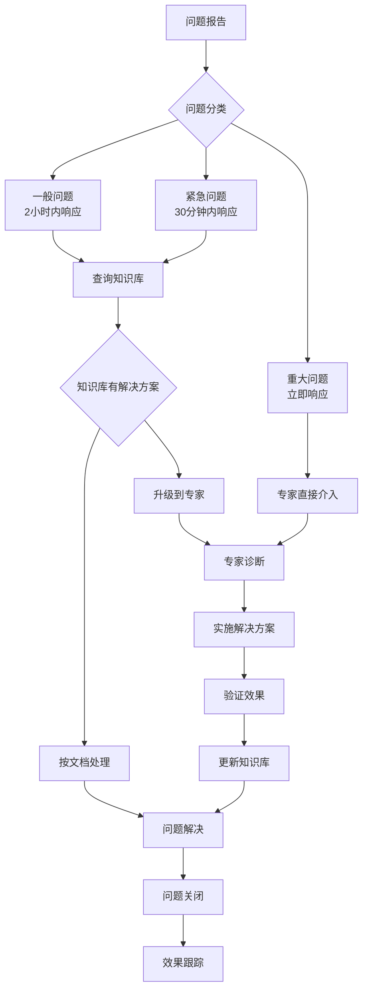

# Task: 文档培训和维护流程建立

## 基本信息
- **任务ID**: 009
- **任务标题**: 文档培训和维护流程建立
- **Epic**: 统一包管理CCPM需求
- **优先级**: 中
- **状态**: 待开始
- **预估工作量**: 2天
- **分配给**: 待分配
- **依赖任务**: []
- **并行执行**: true

## 任务描述

创建全面的操作手册、最佳实践指南、故障排除文档和团队培训材料，建立CPM维护流程，确保团队具备CPM使用和维护能力。

## 目标和成功标准

### 主要目标
- 建立完整的CPM文档体系和知识库
- 制定标准化的CPM最佳实践和操作流程
- 创建系统化的故障排除指南和解决方案库
- 实施有效的团队培训和知识传递机制

### 成功标准
- [ ] 完整的CPM文档体系建立，覆盖率100%
- [ ] 团队培训完成率100%，技能评估通过率≥90%
- [ ] 故障排除指南覆盖≥95%的常见问题
- [ ] 维护流程建立，平均问题解决时间减少≥50%
- [ ] 知识库建立，查询命中率≥85%
- [ ] 文档质量评分≥4.5/5.0

## 任务分解

### 阶段1: 核心文档创建和组织 (1天)
- **输入**: 前期任务的技术文档和经验总结
- **输出**: 系统化的文档体系

**具体任务**:
1. **CPM操作手册编写**
   - 创建 `docs/cpm/CPM-操作手册.md` 综合操作指南
   - 编写 `docs/cpm/CPM-快速开始指南.md` 新手入门材料
   - 制作 `docs/cpm/CPM-命令参考手册.md` 详细命令文档

2. **最佳实践指南**
   - 开发 `docs/cpm/CPM-最佳实践.md` 开发规范和建议
   - 创建 `docs/cpm/CPM-性能优化指南.md` 性能调优手册
   - 编写 `docs/cpm/CPM-安全指南.md` 安全配置和注意事项

3. **架构和配置文档**
   - 整理 `docs/cpm/CPM-架构设计说明.md` 技术架构文档
   - 创建 `docs/cpm/CPM-配置参考.md` 配置项详细说明
   - 制作 `docs/cpm/CPM-迁移指南.md` 完整迁移流程记录

### 阶段2: 故障排除和维护文档 (0.5天)
- **输入**: 实施过程中的问题记录
- **输出**: 故障排除知识库

**具体任务**:
1. **故障排除指南**
   - 创建 `docs/cpm/CPM-故障排除指南.md` 问题诊断和解决手册
   - 建立 `docs/cpm/CPM-常见问题FAQ.md` 问答知识库
   - 制作 `docs/cpm/CPM-错误代码参考.md` 错误信息解释手册

2. **维护流程文档**
   - 编写 `docs/cpm/CPM-维护流程.md` 日常维护操作手册
   - 创建 `docs/cpm/CPM-监控指南.md` 系统监控和告警设置
   - 制作 `docs/cpm/CPM-升级指南.md` 版本升级操作流程

3. **应急响应文档**
   - 开发 `docs/cpm/CPM-应急响应预案.md` 突发问题应对方案
   - 创建 `docs/cpm/CPM-回滚操作指南.md` 紧急回滚操作手册
   - 建立 `docs/cpm/CPM-灾难恢复指南.md` 灾难恢复流程

### 阶段3: 培训材料开发和实施 (0.5天)
- **输入**: 完整的文档体系
- **输出**: 培训课程和材料

**具体任务**:
1. **培训课程设计**
   - 开发 `training/CPM-基础培训课程.pptx` 基础知识培训
   - 创建 `training/CPM-高级培训课程.pptx` 进阶技能培训
   - 制作 `training/CPM-实操演练指南.md` 动手实践教程

2. **培训资源制作**
   - 录制 CPM操作演示视频 (可选)
   - 创建交互式培训教程和检查清单
   - 制作培训评估测试和认证标准

3. **知识传递机制**
   - 建立团队内部知识分享机制
   - 创建 CPM Expert 专家认证体系
   - 设立定期技术分享和经验交流会议

## 文档结构和内容标准

### 文档体系架构

```
docs/cpm/
├── 01-快速开始/
│   ├── CPM-快速开始指南.md
│   ├── CPM-环境配置.md
│   └── CPM-第一个项目.md
├── 02-操作手册/
│   ├── CPM-操作手册.md
│   ├── CPM-命令参考手册.md
│   └── CPM-配置参考.md
├── 03-最佳实践/
│   ├── CPM-最佳实践.md
│   ├── CPM-性能优化指南.md
│   └── CPM-安全指南.md
├── 04-故障排除/
│   ├── CPM-故障排除指南.md
│   ├── CPM-常见问题FAQ.md
│   └── CPM-错误代码参考.md
├── 05-维护运营/
│   ├── CPM-维护流程.md
│   ├── CPM-监控指南.md
│   └── CPM-升级指南.md
└── 06-高级主题/
    ├── CPM-架构设计说明.md
    ├── CPM-自定义扩展.md
    └── CPM-集成开发.md
```

### 文档质量标准

每个文档必须包含：
- **目标读者**: 明确文档适用人群
- **前置条件**: 阅读前需要的基础知识
- **操作步骤**: 清晰的分步操作指南
- **示例代码**: 可运行的代码示例
- **常见问题**: 预期的问题和解决方案
- **参考链接**: 相关资源和深入阅读材料

## 验收标准

### 文档质量验收
- [ ] **完整性**: 文档体系覆盖CPM使用的所有方面，无明显遗漏
- [ ] **准确性**: 所有操作步骤和代码示例经过验证，准确无误
- [ ] **易用性**: 文档结构清晰，查找方便，用户体验良好
- [ ] **时效性**: 文档内容与当前CPM版本和项目状态保持同步

### 培训效果验收
- [ ] **知识掌握**: 培训后团队成员CPM基础知识测试通过率≥90%
- [ ] **实操能力**: 独立完成CPM基本操作任务成功率≥95%
- [ ] **问题解决**: 能够独立解决≥80%的常见CPM问题
- [ ] **知识传递**: 具备向新团队成员传授CPM知识的能力

### 维护流程验收
- [ ] **响应时间**: 问题报告到开始处理时间≤2小时
- [ ] **解决效率**: 常见问题平均解决时间减少≥50%
- [ ] **知识积累**: 新问题和解决方案100%补充到知识库
- [ ] **流程优化**: 维护流程持续改进和优化机制建立

## 培训实施计划

### 培训对象分层

**初级用户** (开发人员):
- CPM基础概念和优势
- 日常开发工作流程变化
- 基本命令和操作
- 常见问题识别和上报

**中级用户** (高级开发、Team Lead):
- CPM高级配置和优化
- 问题诊断和初步解决
- 最佳实践指导和推广
- 团队内部培训和答疑

**专家用户** (架构师、DevOps):
- CPM架构原理和设计思路
- 复杂问题深度诊断和解决
- 系统优化和性能调优
- 企业级部署和维护策略

### 培训方式设计

1. **在线学习**: 自主学习文档和视频材料
2. **集中培训**: 分层次的面对面或在线集中培训
3. **实操练习**: 在真实项目环境中的动手练习
4. **考核认证**: 分级的技能考核和专家认证
5. **持续学习**: 定期技术分享和最新发展跟进

## 维护流程标准化

### 问题分类和处理流程



### 知识库维护机制

1. **内容更新**: 每解决一个新问题，必须更新知识库
2. **定期审查**: 每月审查文档的准确性和完整性
3. **版本同步**: CPM版本更新时同步更新相关文档
4. **用户反馈**: 建立文档反馈机制，持续改进文档质量

## 工具和资源

### 文档创建工具
- **Markdown编辑器**: Typora、Mark Text
- **图表工具**: Draw.io、Mermaid
- **截图工具**: Snipaste、Greenshot
- **视频录制**: OBS Studio、Camtasia (可选)

### 培训支持平台
- **在线学习**: 内部Wiki或学习管理系统
- **视频会议**: Teams、Zoom
- **协作平台**: Microsoft 365、Notion
- **版本控制**: Git (文档版本管理)

### 监控和反馈工具
- **文档访问统计**: Google Analytics (内网适配)
- **反馈收集**: 问卷星、内部反馈系统
- **知识库搜索**: Elasticsearch、内部搜索引擎

## 质量保证

### 文档审查流程
1. **技术审查**: 技术专家审查内容准确性
2. **可用性测试**: 目标用户试用文档完成任务
3. **语言编辑**: 文档格式和语言表达规范化
4. **最终批准**: 项目负责人最终审批发布

### 培训效果评估
1. **知识测试**: 培训前后对比测试
2. **实操评估**: 实际工作中的表现观察
3. **用户反馈**: 培训质量和效果反馈收集
4. **长期跟踪**: 培训效果的长期持续性评估

## 时间计划

| 阶段 | 活动 | 开始时间 | 结束时间 | 负责人 |
|------|------|----------|----------|--------|
| 阶段1 | 核心文档创建 | Day 1 | Day 1.5 | 技术文档工程师 |
| 阶段2 | 故障排除文档 | Day 1.5 | Day 2 | 技术支持专家 |
| 阶段3 | 培训材料开发 | Day 1.5 | Day 2 | 培训专家 |
| 持续 | 团队培训实施 | Day 2 | Day 5 | 全体团队 |

## 相关文档

### 输入文档
- 前期所有任务的输出文档和经验总结
- [CPM官方文档](https://learn.microsoft.com/en-us/nuget/consume-packages/central-package-management)
- 项目实施过程中的问题记录和解决方案

### 输出文档
- `docs/cpm/` 目录下的完整文档体系
- `training/` 目录下的培训课程和材料
- `docs/maintenance/cpm-维护流程手册.md`
- `docs/knowledge-base/cpm-知识库索引.md`

## 成功指标和KPI

### 文档使用指标
- **访问量**: 文档月访问量和用户活跃度
- **查询成功率**: 知识库搜索命中率≥85%
- **用户满意度**: 文档评分≥4.5/5.0

### 培训效果指标
- **培训完成率**: 团队成员培训参与率100%
- **考核通过率**: 技能评估通过率≥90%
- **知识保持率**: 培训3个月后的知识保持测试≥80%

### 维护效率指标
- **问题解决时间**: 平均问题解决时间减少≥50%
- **重复问题率**: 相同问题重复率≤10%
- **自助解决率**: 团队成员自主解决问题比例≥70%

## 备注

### 注意事项
- 文档编写要考虑不同技术水平的读者需求
- 培训内容要与实际工作场景紧密结合
- 维护流程要平衡效率和质量，避免过度复杂化

### 持续改进计划
- 建立定期文档审查和更新机制
- 根据用户反馈持续优化文档结构和内容
- 跟踪CPM技术发展，及时更新相关文档和培训材料
- 建立企业级CPM使用经验知识库，促进最佳实践分享