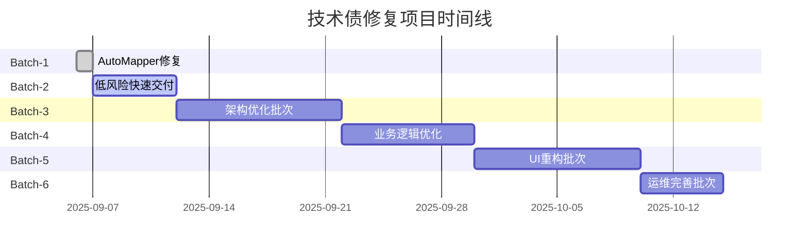

# PRD - 凌隐宝堂中医诊所系统技术债修复项目

**文档版本**: v1.0  
**创建日期**: 2025-09-06  
**最后更新**: 2025-09-06  
**状态**: 待审批  
**项目经理**: ccpm (Claude Code Project Manager)  

---

## 📋 项目概述

### 项目背景

凌隐宝堂中医诊所系统(LYBTZYZS)经过前期开发和多轮重构，已达到零编译错误的生产就绪状态。然而，通过架构设计体检发现了15项技术债务，这些问题虽不影响系统正常运行，但会影响长期维护性、系统性能和代码质量。

**关键驱动因素**:
- 🏥 **目标场景**: 20人以下小诊所，实用主义优先
- 💼 **资源约束**: 1-2人开发团队，兼职维护模式
- 🎯 **业务连续性**: 修复过程不能影响诊所日常运营
- 📊 **数据安全**: 小诊所数据丢失是灾难性问题

### 目标与范围

**项目目标**:
1. **稳定性提升**: 解决Critical级别架构问题，消除内存泄漏风险
2. **可维护性增强**: 统一代码规范，改善架构清晰度  
3. **运维能力建设**: 建立数据备份、监控告警等运维保障
4. **开发效率优化**: 提升查询性能，完善开发工具链

**项目范围**:
- ✅ **包含**: 15项已识别技术债务的修复
- ✅ **包含**: 小诊所特色运维能力建设(备份、监控)
- ❌ **不包含**: 新功能开发
- ❌ **不包含**: 大规模架构重构(避免过度工程化)

**成功标准**:
- 所有Critical级别问题解决
- 系统连续运行7天无重启
- 代码风格统一，编译零警告
- 数据备份和监控告警正常运行

---

## 👥 用户与角色

### 项目干系人

| 角色 | 姓名/标识 | 职责 | 权限级别 |
|------|-----------|------|----------|
| **项目经理** | ccpm | 项目进度管理、任务分配、周报生成 | 完全权限 |
| **技术负责人** | 开发团队Lead | 技术方案评审、代码质量把控 | 技术决策权 |
| **开发工程师** | Dev-1, Dev-2 | 具体技术债修复实施 | 开发权限 |
| **运维工程师** | Ops | 备份脚本、监控告警实施 | 运维权限 |
| **业务用户** | 诊所医生/管理员 | 验收测试、业务连续性确认 | 测试权限 |

### 角色详细定义

**ccpm (项目经理)**:
- **核心职责**: 基于本PRD驱动批次修复与进度跟踪
- **工作内容**: 
  - 执行批次管理(Batch-1/2/3...)严格≤5项控制
  - 生成项目周报，跟踪关键里程碑
  - 风险识别与升级管理
- **决策权限**: 批次优先级调整、资源协调、进度管控

**技术负责人**:
- **核心职责**: 确保技术方案适配小诊所场景，避免过度工程化
- **工作内容**:
  - Critical级别技术债的架构方案设计
  - 代码Review，确保修复质量
  - 技术风险评估与控制

---

## 📝 需求描述

### Critical级别需求 (P0优先级)

#### REQ-DT001: 服务接口职责分离
- **原始ID**: DT-001 🔴
- **优先级**: P0 (Critical)
- **需求描述**: AuthModule类同时实现IAuthService和IAuthenticationService两个职责不同的接口，严重违反单一职责原则，影响架构清晰度
- **Evidence**: `src/Client/Desktop/Modules/Auth/Services/AuthModule.cs:17`
- **验收标准**: 
  - [ ] AuthModule仅实现单一接口
  - [ ] 创建AuthServiceAdapter适配器类实现接口分离
  - [ ] 依赖注入注册正确配置
  - [ ] 编译通过，无功能回退

#### REQ-DT002: 依赖注入生命周期规范化
- **原始ID**: DT-002 🔴  
- **优先级**: P0 (Critical)
- **需求描述**: IoC容器注册使用工厂委托模式，可能导致内存泄漏和服务实例生命周期混乱
- **Evidence**: `src/Client/Desktop/Shell/Extensions/ServiceCollectionExtensions.cs:148-153`
- **验收标准**:
  - [ ] 统一使用标准IoC注册模式
  - [ ] 消除工厂委托注册方式
  - [ ] 服务生命周期明确(Singleton/Transient)
  - [ ] 内存使用监控无异常增长

### Major级别需求 (P1优先级)

#### REQ-DT003: 模块依赖关系梳理
- **原始ID**: DT-003 🟡
- **优先级**: P1 (Major)  
- **需求描述**: Auth/Users/Patients等模块间存在依赖关系，需要明确依赖顺序并添加验证机制
- **Evidence**: `src/Client/Desktop/Shell/Extensions/ServiceCollectionExtensions.cs:143-174`
- **验收标准**:
  - [ ] 建立清晰的模块注册顺序
  - [ ] 添加依赖验证逻辑防止循环引用
  - [ ] 模块依赖关系文档化

#### REQ-DT004: 基础查询性能优化  
- **原始ID**: DT-004 🟡
- **优先级**: P1 (Major)
- **需求描述**: Repository层查询缺乏AsNoTracking()优化，影响内存使用效率
- **Evidence**: `src/Server/Core/LYBT.Infrastructure/Repositories/*.cs`
- **验收标准**:
  - [ ] 实现SmallClinicQueryExtensions扩展类
  - [ ] 所有只读查询使用ForReadOnly()扩展方法
  - [ ] 查询内存使用降低，性能提升可测量

#### REQ-DT005: ViewModel职责重构
- **原始ID**: DT-005 🟡
- **优先级**: P1 (Major)
- **需求描述**: ViewModel包含业务逻辑和数据访问代码，违反MVVM模式，影响可测试性
- **Evidence**: `src/Client/Desktop/Modules/*/ViewModels/*.cs`
- **验收标准**:
  - [ ] 业务逻辑迁移至Service层
  - [ ] ViewModel仅保留UI逻辑
  - [ ] 提升单元测试覆盖率

#### REQ-DT006: 统一异常处理机制
- **原始ID**: DT-006 🟡
- **优先级**: P1 (Major)
- **需求描述**: Service层异常处理不统一，部分有try-catch，部分缺失，影响调试和用户体验
- **Evidence**: 跨多个Service类
- **验收标准**:
  - [ ] 实现统一异常处理装饰器
  - [ ] 所有Service方法标准化异常处理
  - [ ] 异常日志记录完整

### Minor级别需求 (P2优先级)

#### REQ-DT007: 基础代码质量检查
- **原始ID**: DT-007 🟢
- **优先级**: P2 (Minor)
- **需求描述**: 缺乏自动化代码质量检查，适配小诊所团队的简化版本
- **Evidence**: 整体项目缺乏代码检查工具
- **验收标准**:
  - [ ] 实现PowerShell代码检查脚本
  - [ ] 命名约定自动检查
  - [ ] TODO项目扫描功能

#### REQ-DT009: 命名约定统一化
- **原始ID**: DT-009 🟢
- **优先级**: P2 (Minor)
- **需求描述**: Username/UserName命名不一致，影响代码可读性
- **Evidence**: 多个文件中存在命名不一致
- **验收标准**:
  - [ ] 统一使用Username命名
  - [ ] 添加EditorConfig命名规则
  - [ ] 命名检查脚本验证通过

#### REQ-DT010: 结构化日志配置
- **原始ID**: DT-010 🟢
- **优先级**: P2 (Minor)
- **需求描述**: 缺乏结构化日志配置，生产环境调试困难
- **Evidence**: `appsettings.json`, `Program.cs`
- **验收标准**:
  - [ ] 集成Serilog结构化日志
  - [ ] 配置日志级别和文件滚动
  - [ ] 日志输出格式规范

#### REQ-DT011: 取消令牌支持
- **原始ID**: DT-011 🟢
- **优先级**: P2 (Minor)
- **需求描述**: 异步方法缺乏CancellationToken支持，长时间操作无法取消
- **Evidence**: `src/Client/Desktop/Modules/*/Services/*.cs`
- **验收标准**:
  - [ ] 关键异步方法添加CancellationToken参数
  - [ ] ViewModel实现操作取消功能

#### REQ-DT012: 配置验证机制
- **原始ID**: DT-012 🟢
- **优先级**: P2 (Minor)
- **需求描述**: 应用配置缺乏验证机制，配置错误难以提前发现
- **Evidence**: `src/Client/Desktop/Shell/App.xaml.cs`, `appsettings.json`
- **验收标准**:
  - [ ] 实现配置选项类和验证特性
  - [ ] 启动时配置验证
  - [ ] 配置错误快速失败

#### REQ-DT013: 内存泄漏修复
- **原始ID**: DT-013 🟢
- **优先级**: P2 (Minor)
- **需求描述**: ViewModel订阅事件未正确取消，存在内存泄漏风险
- **Evidence**: `src/Client/Desktop/Modules/*/ViewModels/*.cs`
- **验收标准**:
  - [ ] ViewModel实现IDisposable接口
  - [ ] 事件订阅正确清理
  - [ ] 内存使用监控验证

#### REQ-DT014: 数据备份策略 (小诊所关键)
- **原始ID**: DT-014 🟢
- **优先级**: P2 (Minor) - 但对小诊所Impact=5
- **需求描述**: 缺乏数据备份机制，对依赖单一数据库的小诊所风险极高
- **Evidence**: 项目配置缺乏备份策略
- **验收标准**:
  - [ ] 实现数据库每日自动备份脚本
  - [ ] 备份文件7天轮转机制
  - [ ] 备份恢复测试验证

#### REQ-DT015: 系统监控告警 (小诊所实用)
- **原始ID**: DT-015 🟢
- **优先级**: P2 (Minor)
- **需求描述**: 缺乏系统监控告警，小诊所IT人力有限需要自动化监控
- **Evidence**: 系统部署缺乏监控机制
- **验收标准**:
  - [ ] 实现简单健康检查服务
  - [ ] 数据库连接和磁盘空间监控
  - [ ] 异常邮件告警功能

### 已完成需求

#### REQ-DT008: AutoMapper配置修复 ✅
- **原始ID**: DT-008 🟢
- **状态**: ✅ **已完成** (2025-09-06)
- **完成内容**: 迁移到开源版本14.0.0，修复构造函数兼容性问题
- **验证结果**: 编译成功，前端0警告0错误

---

## ⚡ 优先级定义

### P0 (Critical) - 立即处理
- **定义**: 影响系统架构稳定性的Critical级别问题
- **SLA**: 2周内必须完成
- **包含项目**: REQ-DT001, REQ-DT002

### P1 (Major) - 本月处理  
- **定义**: 影响代码质量和可维护性的Major级别问题
- **SLA**: 4-6周内完成
- **包含项目**: REQ-DT003, REQ-DT004, REQ-DT005, REQ-DT006

### P2 (Minor) - 后续优化
- **定义**: 改善开发体验和运维能力的Minor级别问题
- **SLA**: 根据资源情况安排
- **包含项目**: REQ-DT007, REQ-DT009, REQ-DT010, REQ-DT011, REQ-DT012, REQ-DT013, REQ-DT014, REQ-DT015

---

## 🎯 里程碑规划

### Batch-1: 已完成 ✅ (2025-09-06)
- **内容**: REQ-DT008 (AutoMapper配置修复)
- **状态**: ✅ 完成
- **成果**: 迁移到开源版本，编译零错误

### Batch-2: 低风险快速交付 (第39周)
- **策略**: 严格≤5项，优先独立性强、低耦合项目
- **内容**:
  1. REQ-DT004: 基础查询优化 (1人天)
  2. REQ-DT014: 数据备份策略 (1人天) 
  3. REQ-DT009: 命名约定统一 (0.5人天)
  4. REQ-DT010: 日志配置 (0.5人天)
  5. REQ-DT012: 配置验证 (1人天)
- **总工作量**: 4.5人天
- **风险等级**: 低 (全部为低耦合项目)

### Batch-3: 架构优化批次 (第40-41周)  
- **策略**: 专门处理高耦合Critical项目，统一批次避免冲突
- **内容**:
  1. REQ-DT001: 服务接口职责分离
  2. REQ-DT002: 依赖注入规范化
  3. REQ-DT003: 模块依赖梳理
- **总工作量**: 8人天 (2周冲刺)
- **风险等级**: 高 (需要充分测试验证)

### Batch-4: 业务逻辑优化 (第42-43周)
- **策略**: 专注Service层改动
- **内容**:
  1. REQ-DT006: 统一异常处理
  2. REQ-DT013: 内存泄漏修复
- **总工作量**: 4人天

### Batch-5: UI重构批次 (第44-45周)
- **策略**: 前端架构改进，分模块逐步进行
- **内容**:
  1. REQ-DT005: ViewModel职责重构
- **总工作量**: 6人天 (分模块实施)

### Batch-6: 运维完善批次 (第46周)
- **策略**: 完善运维工具链
- **内容**:
  1. REQ-DT015: 系统监控告警
  2. REQ-DT011: 取消令牌支持  
  3. REQ-DT007: 代码质量检查
- **总工作量**: 5人天

---

## ✅ 验收标准

### 功能验收标准

**编译质量**:
- [ ] 前端解决方案编译: 0错误, 0警告
- [ ] 后端解决方案编译: 0错误, StyleCop警告≤当前基线

**性能指标** (小诊所标准):
- [ ] 患者列表加载时间: ≤3秒
- [ ] 处方保存响应时间: ≤2秒  
- [ ] 系统启动时间: ≤30秒
- [ ] 内存使用无异常增长

**稳定性指标**:
- [ ] 系统连续运行: ≥7天无重启
- [ ] 数据库备份: 每日自动执行
- [ ] 关键异常告警: 及时通知

### 小诊所适配验收

**业务连续性**:
- [ ] 所有修改对现有业务流程完全透明
- [ ] 诊所日常操作无影响
- [ ] 用户界面无功能回退

**维护友好性**:
- [ ] 代码风格统一，便于维护
- [ ] 关键操作有完整日志记录
- [ ] 配置错误能在启动时发现

**数据安全**:
- [ ] 数据备份脚本测试恢复成功
- [ ] 监控告警功能正常
- [ ] 无数据丢失风险

---

## 🔧 非功能性要求

### 规则固化

**批次管理规则** (强制执行):
- ✅ 每个Batch **严格≤5项**
- ✅ **严禁跨高耦合模块**大面积改动  
- ✅ Critical级别高耦合项目需要**专门批次**统一处理
- ✅ 优先**低风险、独立性强**的项目
- ✅ **Not Selected项目必须明确原因**

**小诊所适配规则**:
- ✅ 始终考虑20人以下场景约束
- ✅ 避免过度工程化(DDD/CQRS/微服务)
- ✅ 数据安全优先于性能优化
- ✅ 易于维护优先于技术先进

### CI/CD要求

**代码质量门禁**:
- 编译必须通过(0错误)
- 单元测试覆盖率不降低
- StyleCop警告不增加

**部署要求**:
- 支持回滚机制
- 数据库迁移脚本验证
- 生产环境灰度发布

### 可维护性要求

**文档要求**:
- 每个批次完成后更新架构文档
- 重要决策记录在ADR中
- 用户手册同步更新

**监控要求**:
- 关键性能指标监控
- 异常告警机制
- 日志检索能力

---

## 📊 风险与依赖

### 高风险项目

| 风险项目 | 风险等级 | 影响范围 | 缓解措施 |
|---------|---------|---------|----------|
| REQ-DT001 | 高 | 多个高耦合模块 | 专门批次，充分测试 |
| REQ-DT002 | 高 | 全局服务注册 | 与DT-001统一处理 |
| REQ-DT005 | 中高 | 前端MVVM架构 | 分模块渐进式重构 |

### 资源依赖

**人力资源**:
- 技术负责人: 架构设计与评审
- 开发工程师: 2人，负责具体实施  
- 运维工程师: 备份和监控脚本开发

**技术依赖**:
- .NET 8.0 和 C# 12 特性
- Serilog日志框架
- AutoMapper 14.0.0 开源版本

### 外部依赖

**业务依赖**:
- 诊所业务时间窗口(避免工作时间部署)
- 测试数据和环境可用性
- 用户配合验收测试

---

## 📈 成功度量

### 量化指标

**技术指标**:
- Critical问题解决率: 100%
- 编译警告减少率: ≥50%
- 查询性能提升: ≥20%
- 内存使用优化: ≥15%

**质量指标**:  
- 代码覆盖率: 不降低
- 文档覆盖率: ≥80%
- 用户满意度: ≥4.5/5

**运维指标**:
- 系统稳定运行时间: ≥99.5%
- 数据备份成功率: 100%
- 告警及时性: ≤5分钟

### 定性指标

**开发体验**:
- 代码可读性明显改善
- 开发效率提升
- 新人上手难度降低

**运维体验**:  
- 问题排查效率提升
- 运维操作标准化
- 风险预警能力增强

---

## 📅 项目时间线

**项目总工期**: 6-8周  
**资源投入**: 1-2人全时当量  
**关键里程碑**: 每批次完成即为一个里程碑

---

## 📝 附录

### 相关文档

- **技术债务待办清单**: `TECH_DEBT_BACKLOG.md`
- **架构设计文档**: `docs/architecture/`
- **开发规范**: `docs/development/`

### 联系方式

**项目团队**:
- 项目经理(ccpm): 负责项目管控和进度跟踪
- 技术负责人: 架构决策和代码质量
- 开发团队: 具体实施和测试验证

### 变更控制

**PRD变更流程**:
1. 变更请求评估
2. 影响分析和风险评估  
3. 干系人评审批准
4. PRD版本更新

---

*本PRD由 ccpm (Claude Code Project Manager) 基于技术债务待办清单生成*  
*版本: v1.0 | 生成时间: 2025-09-06*