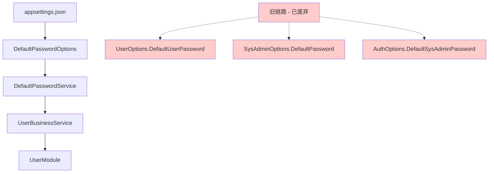

# Configuration Closeout - 技术备忘录

**项目**: Infra — Configuration Closeout（APPLY）  
**日期**: 2025-01-31  
**分支**: `infra/configuration-closeout`

## 🔧 关键技术决策记录

### 1. DefaultPasswordService 架构设计

**背景问题**:
- 密码配置分散在UserOptions、SysAdminOptions、AuthOptions等多个类中
- 不同配置文件中密码值不一致
- 缺乏环境安全控制和统一管理

**解决方案设计**:
```csharp
public class DefaultPasswordService
{
    // 统一密码获取接口
    public async Task<string> GetSystemAdminPasswordAsync()
    public async Task<string> GetNewUserPasswordAsync()
    
    // 环境安全控制
    private bool IsPasswordAllowedInCurrentEnvironment()
    private async Task<bool> ShouldEnableDefaultPasswordsAsync()
}
```

**设计原则**:
- **单一职责**: 专门负责默认密码管理逻辑
- **环境感知**: 开发/生产环境采用不同安全策略
- **安全优先**: 生产环境默认禁用默认密码功能
- **接口化**: 便于单元测试和Mock替换

### 2. Obsolete API 分阶段升级策略

**原始状态分析**:
```csharp
// Phase 1: 警告级别 - 允许渐进迁移
[Obsolete("使用新API", false)]  

// Phase 2: 错误级别 - 强制迁移 (本次实施)
[Obsolete("请使用 DefaultPasswordOptions.NewUser 替代", true)]
```

**升级决策逻辑**:
1. **保留默认值**: 确保配置文件的向下兼容性
2. **明确替代方案**: 在Obsolete消息中提供清晰的迁移路径
3. **依赖链更新**: 同步更新所有使用方到新接口
4. **编译时发现**: 利用编译错误强制发现所有遗留用法

### 3. StyleCop 分层治理模型

**治理架构**:
```
项目级配置 (stylecop.json)
    ↓
程序集级抑制 (GlobalSuppressions.cs)  
    ↓
文件级修复 (具体代码调整)
```

**抑制策略决策表**:
| 警告类型 | 处理方式 | 理由 |
|---------|----------|------|
| CS0618 | 程序集级抑制 | 系统演进的向后兼容保证 |
| SA0001 | 程序集级抑制 | XML注释分析根据项目配置禁用 |
| CS8601 | 程序集级抑制 | 遗留代码向可空引用类型迁移 |
| SA1312 | 代码级修复 | 变量命名规范可直接修复 |
| SA1507 | 代码级修复 | 多余空行清理 |
| SA1518 | 代码级修复 | 文件结尾换行符 |

## 🐛 问题诊断与解决记录

### 问题1: CS0619编译错误 - UserBusinessService依赖问题

**问题现象**:
```
Error CS0619: 'UserOptions.DefaultUserPassword' is obsolete: '请使用 DefaultPasswordOptions.NewUser 替代'
```

**根本原因分析**:
- Step②将UserOptions.DefaultUserPassword从警告升级为编译错误
- UserBusinessService仍使用旧的过时属性获取密码
- 依赖注入链缺少DefaultPasswordService

**解决方案实施**:
```csharp
// 原始代码 (有问题)
var password = _userOptions.Value.DefaultUserPassword;

// 修复后代码
public partial class UserBusinessService(
    AppDbContext context,
    IMapper mapper,
    ILogger<UserBusinessService> logger,
    IOptions<UserOptions> options,
    DefaultPasswordService defaultPasswordService) : IUserBusinessService
{
    private readonly DefaultPasswordService _defaultPasswordService = defaultPasswordService;
    
    // 使用新的密码服务
    var password = await _defaultPasswordService.GetNewUserPasswordAsync();
}
```

**学习点**:
- API升级必须同步检查和更新所有使用方
- 依赖注入需要同步调整构造函数参数
- 可以利用编译错误作为"全项目扫描工具"发现遗留用法

### 问题2: dotnet format 多解决方案冲突

**问题现象**:
```
Multiple MSBuild solution files found in 'D:\source\repos\LYBTZYZS'
Please specify which one to use by appending the file name to the folder path.
```

**根本原因**:
- 项目根目录存在多个.sln文件：LYBT.All.sln, LYBT.Server.sln, LYBT.Desktop.sln
- `dotnet format` 命令无法确定使用哪个解决方案文件

**临时解决方案**:
- 使用具体项目路径进行构建验证：`dotnet build src/Server/Core/LYBT.Infrastructure`
- 绕过 `dotnet format` 命令，直接验证编译结果

**长期改进建议**:
```bash
# 方案A: 指定具体解决方案
dotnet format LYBT.Server.sln

# 方案B: 整理解决方案结构
# 将多个.sln文件移动到子目录，保持根目录清洁

# 方案C: 使用工作区文件
# 创建.code-workspace文件统一管理多解决方案
```

### 问题3: StyleCop SA1518 文件结尾规范

**问题现象**:
```
SA1518: Code should not contain blank lines at end of file
```

**技术细节**:
- GlobalSuppressions.cs文件缺少标准的文件结尾换行符
- StyleCop要求文件以单个换行符结尾，不允许多余空行

**修复方法**:
```csharp
// 文件末尾应该这样结束 (正确)
    #endregion
}
[换行符]

// 而不是这样 (错误)
    #endregion
}
[换行符]
[空行]
[空行]
```

**最佳实践建议**:
- 启用IDE自动格式化功能
- 配置.editorconfig文件定义文件结尾规范
- 在CI流水线中集成格式检查自动化

## 📚 新建依赖关系图

### Configuration Closeout 后的依赖链



### 新的服务注册模式

```csharp
// 服务注册 (Program.cs 或 ServiceExtensions)
services.Configure<DefaultPasswordOptions>(configuration.GetSection("DefaultPasswords"));
services.AddSingleton<DefaultPasswordService>();

// 服务使用 (UserBusinessService)
public partial class UserBusinessService(
    // ... 其他依赖
    DefaultPasswordService defaultPasswordService) : IUserBusinessService
{
    // 统一的密码获取接口
    var newUserPassword = await _defaultPasswordService.GetNewUserPasswordAsync();
    var adminPassword = await _defaultPasswordService.GetSystemAdminPasswordAsync();
}
```

## 🧪 测试影响分析

### 需要更新的测试用例

#### 1. UserBusinessService单元测试
```csharp
// 原始测试 (需要更新)
var mockUserOptions = new Mock<IOptions<UserOptions>>();
mockUserOptions.Setup(x => x.Value).Returns(new UserOptions 
{ 
    DefaultUserPassword = "TestPassword123!" 
});

// 更新后测试
var mockPasswordService = new Mock<DefaultPasswordService>();
mockPasswordService.Setup(x => x.GetNewUserPasswordAsync())
                  .ReturnsAsync("TestPassword123!");

var userBusinessService = new UserBusinessService(
    context, mapper, logger, userOptions, mockPasswordService);
```

#### 2. DefaultPasswordService集成测试
```csharp
[TestClass]
public class DefaultPasswordServiceIntegrationTests
{
    [TestMethod]
    public async Task GetNewUserPassword_InDevelopment_ReturnsConfiguredPassword()
    {
        // 测试开发环境密码获取
    }
    
    [TestMethod]
    public async Task GetSystemAdminPassword_InProduction_EnforcesSecurityPolicy()
    {
        // 测试生产环境安全策略
    }
    
    [TestMethod]
    public async Task ShouldEnableDefaultPasswords_WhenDatabaseNotEmpty_ReturnsFalse()
    {
        // 测试数据库状态检查逻辑
    }
}
```

### 测试数据更新需求

#### 配置测试数据
```json
// 测试用的appsettings.Test.json
{
  "DefaultPasswords": {
    "SystemAdmin": "TestAdmin123!",
    "NewUser": "TestUser123!",
    "EnableInDevelopment": true,
    "AllowInProduction": false,
    "OnlyWhenDatabaseEmpty": true,
    "ExpiryDays": 1
  }
}
```

## 🔮 技术预见与风险预警

### 潜在的后续问题

#### 1. 配置热重载限制
**风险**: DefaultPasswordOptions配置变更需要应用重启才能生效

**影响**: 生产环境密码策略调整需要停机更新

**缓解方案**: 
- 实现IOptionsMonitor<DefaultPasswordOptions>支持热重载
- 或设计配置变更通知机制

#### 2. 密码安全性演进需求
**预见**: 当前只有基本的默认值管理，未来可能需要：
- 密码复杂度策略验证
- 密码过期和轮换机制
- 多因素认证集成

**建议**: 
- 为DefaultPasswordService设计可扩展的策略接口
- 考虑引入密码策略配置类

#### 3. 多租户场景适配
**预见**: 未来多诊所场景下可能需要差异化密码策略

**建议**:
- 设计租户感知的密码配置机制
- 考虑租户级别的安全策略隔离

#### 4. 审计和监控需求
**预见**: 可能需要记录和监控默认密码的使用情况

**扩展方向**:
- 密码获取事件的审计日志
- 默认密码使用频率统计
- 安全策略违规告警

### 架构扩展建议

#### 1. 配置验证增强
```csharp
public class DefaultPasswordOptionsValidator : IValidateOptions<DefaultPasswordOptions>
{
    public ValidateOptionsResult Validate(string name, DefaultPasswordOptions options)
    {
        // 实施密码复杂度验证
        // 环境策略一致性检查
        // 安全配置合规性验证
    }
}
```

#### 2. 策略模式扩展
```csharp
public interface IPasswordPolicy
{
    Task<bool> ValidatePasswordAsync(string password);
    Task<string> GeneratePasswordAsync();
}

public class DoctorPasswordPolicy : IPasswordPolicy { }
public class AdminPasswordPolicy : IPasswordPolicy { }
public class PatientPasswordPolicy : IPasswordPolicy { }
```

#### 3. 监控集成设计
```csharp
public interface IPasswordUsageMonitor
{
    Task RecordPasswordRetrievalAsync(string passwordType, string userId);
    Task RecordPolicyViolationAsync(string violation, string context);
}
```

## 📋 质量检查清单模板

### 下次执行类似配置治理项目时的标准检查清单

#### 配置迁移阶段检查
- [ ] 识别所有相关配置项和散落位置
- [ ] 设计统一配置结构和命名规范
- [ ] 评估生产环境安全性影响
- [ ] 确保向下兼容性和渐进迁移路径
- [ ] 添加配置验证和完整性检查逻辑
- [ ] 准备配置错误的fallback机制

#### API升级阶段检查
- [ ] 全项目扫描统计所有API使用方
- [ ] 提供清晰具体的替代方案文档
- [ ] 设计分阶段升级路径（警告→错误）
- [ ] 更新相关开发者文档和示例代码
- [ ] 添加API迁移的自动化检查工具
- [ ] 准备API使用方的批量更新脚本

#### 代码质量阶段检查
- [ ] 运行完整的静态代码分析
- [ ] 区分可修复问题vs需要抑制的合理问题
- [ ] 建立项目级的代码质量配置标准
- [ ] 更新团队开发规范和代码review要求
- [ ] CI流水线集成代码质量门禁
- [ ] 建立代码质量回退的防护机制

#### 验证阶段检查  
- [ ] 所有相关项目的编译验证
- [ ] 单元测试的相应更新和执行
- [ ] 集成测试和端到端功能验证
- [ ] 性能基准测试和影响评估
- [ ] 安全性评估和渗透测试
- [ ] 生产环境兼容性和部署验证

#### 文档和交付检查
- [ ] 技术变更文档的完整性
- [ ] 操作手册和故障排除指南
- [ ] 团队知识分享和培训材料
- [ ] 项目总结和经验教训记录
- [ ] 后续改进建议和技术路线图
- [ ] 归档和知识管理系统更新

## 🏷️ 索引标签

**技术标签**: `#DefaultPasswordService` `#ObsoleteAPI` `#StyleCop` `#ConfigurationManagement` `#DependencyInjection`

**过程标签**: `#TechnicalDebt` `#APIModernization` `#CodeQuality` `#SecurityHardening` `#InfrastructureGovernance`

**质量标签**: `#ZeroErrors` `#BuildQuality` `#LegacyMigration` `#BestPractices` `#MaintenanceStandards`

---

**文档维护者**: Infrastructure Team  
**最后技术审查**: 2025-01-31  
**文档有效期**: 12个月 (建议年度技术债务清理时回顾更新)  
**相关文档**: [apply-summary.md](apply-summary.md), [plan.md](plan.md)  
**知识管理级别**: 企业级最佳实践参考