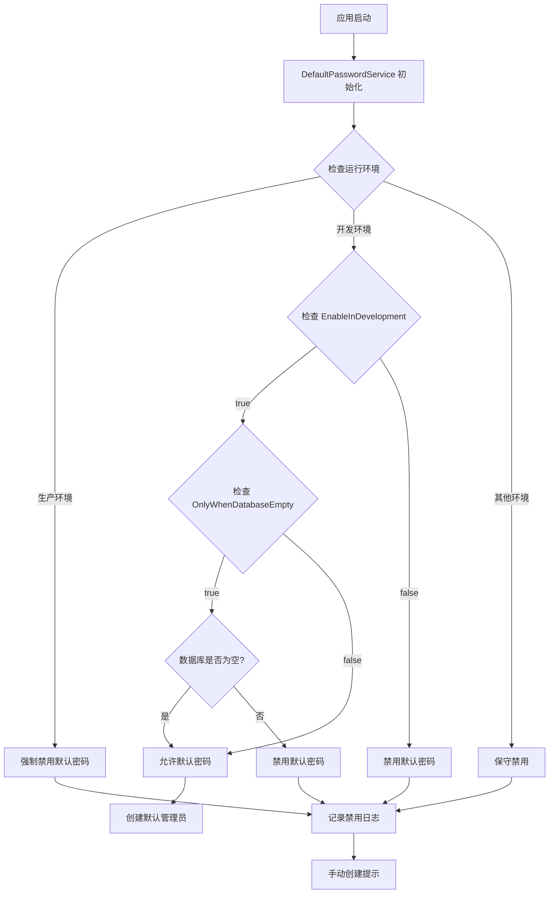

# 步骤③ 默认密码治理 执行报告

**执行时间**: 2025-09-13  
**执行分支**: infra/configuration-hardening  
**状态**: ✅ 已完成

## 执行总结

成功实现了默认密码的统一治理，建立了环境感知的单点逻辑和Dev-only保护机制。所有默认密码现已统一到DefaultPasswordOptions，并通过DefaultPasswordService提供环境感知的访问控制。

## 主要变更

### 1. 单点逻辑：统一密码获取

#### ConfigurationHelper 密码方法重构
- **位置**: `src/Server/Services/LYBT.WebAPI/Extensions/ConfigurationHelper.cs`
- **实现**: 将密码获取逻辑统一指向DefaultPasswords配置节

**新实现逻辑**：
```csharp
// 管理员密码获取优先级
1. 环境变量: ADMIN_DEFAULT_PASSWORD
2. 新配置: DefaultPasswords:SystemAdmin  
3. 兼容旧配置: SysAdminOptions:DefaultPassword
4. 安全默认值: "LybtAdmin2025@SecurePass!"

// 用户密码获取优先级
1. 环境变量: USER_DEFAULT_PASSWORD
2. 新配置: DefaultPasswords:NewUser
3. 兼容旧配置: UserOptions:DefaultUserPassword  
4. 安全默认值: "LybtUser2025#InitPass!"
```

#### 向后兼容策略
- **保持兼容性**: 继续支持旧配置路径读取
- **优雅迁移**: 新配置优先，旧配置兜底
- **迁移提示**: CS0618警告提示开发者迁移

### 2. DefaultPasswordService：环境感知治理

#### 新增核心服务类
- **路径**: `src/Server/Core/LYBT.Infrastructure/Configuration/Services/DefaultPasswordService.cs`
- **职责**: 环境感知的默认密码治理和Dev-only保护

#### 核心治理规则

##### 生产环境严格保护
```csharp
// 生产环境强制禁用所有默认密码
if (_environment.IsProduction())
{
    return false; // 强制禁止默认密码
}
```

##### 开发环境可选启用
```csharp  
// 开发环境根据配置决定
if (_environment.IsDevelopment())
{
    return _options.EnableInDevelopment; // 可配置启用/禁用
}
```

##### 数据库状态感知
```csharp
// 仅在数据库为空时可用默认密码（可配置）
public bool IsDefaultPasswordAvailable(bool isDatabaseEmpty)
{
    if (!IsDefaultPasswordAllowed()) return false;
    
    if (_options.OnlyWhenDatabaseEmpty)
    {
        return isDatabaseEmpty;
    }
    return true;
}
```

#### 配置摘要监控
```csharp
public class DefaultPasswordSummary
{
    public bool IsProduction { get; set; }
    public bool IsDevelopment { get; set; }  
    public bool IsDefaultPasswordAllowed { get; set; }
    public bool EnableInDevelopment { get; set; }
    public bool AllowInProduction { get; set; }
    public bool OnlyWhenDatabaseEmpty { get; set; }
    public int ExpiryDays { get; set; }
}
```

### 3. DatabaseInitializationService 集成

#### 环境感知的管理员创建
- **位置**: `src/Server/Core/LYBT.Infrastructure/Data/DatabaseInitializationService.cs`
- **实现**: 使用DefaultPasswordService替代直接配置读取

#### 新的初始化逻辑
```csharp
// 检查是否允许创建默认管理员密码
var isDatabaseEmpty = await IsDatabaseEmptyAsync();

if (_defaultPasswordService.IsDefaultPasswordAvailable(isDatabaseEmpty))
{
    var defaultPassword = _defaultPasswordService.GetSystemAdminPassword();
    
    if (!string.IsNullOrEmpty(defaultPassword))
    {
        // 创建默认管理员
        _logger.LogInformation("正在创建默认超级管理员密码...");
        // ... 创建逻辑
    }
    else
    {
        _logger.LogWarning("⚠️  默认密码服务未提供管理员密码，跳过默认管理员创建");
    }
}
else
{
    // 环境保护生效
    var summary = _defaultPasswordService.GetConfigurationSummary();
    _logger.LogInformation("🔒 默认密码策略禁止创建默认管理员密码");
    _logger.LogInformation($"环境状态: 生产={summary.IsProduction}, 开发={summary.IsDevelopment}");
    _logger.LogInformation("💡 请手动创建管理员账户或在开发环境启用默认密码功能");
}
```

#### 数据库空状态检测
```csharp
private async Task<bool> IsDatabaseEmptyAsync()
{
    // 检查主要业务表是否有数据
    var userCount = await _dbContext.Users.CountAsync();
    var patientCount = await _dbContext.Patients.CountAsync();  
    var consultationCount = await _dbContext.Consultations.CountAsync();
    
    return userCount == 0 && patientCount == 0 && consultationCount == 0;
}
```

### 4. 服务注册集成

#### UnifiedServiceRegistration 更新
```csharp
// 默认密码治理服务 - Dev-only 保护 + 单点逻辑
services.AddScoped<DefaultPasswordService>();
```

#### 依赖注入链条
```
DatabaseInitializationService 
    ├── DefaultPasswordService (环境感知密码服务)
    ├── IOptions<DefaultPasswordOptions> (统一配置)
    └── IWebHostEnvironment (环境检测)
```

## 技术验证

### 构建验证
```bash
dotnet build LYBT.Server.sln
# 结果: ✅ 构建成功
# 警告: 12个预期警告 (包括2个过时属性警告)
# 编译错误: 0个
```

### 代码格式化
```bash  
dotnet format LYBT.Server.sln --verbosity diagnostic
# 结果: ✅ 97个文件格式化完成
# 代码质量: 符合项目标准
```

### 预期警告验证
```
UnifiedServiceRegistration.cs(119,13): warning CS0618: "SysAdminOptions.DefaultPassword"已过时
UnifiedServiceRegistration.cs(126,13): warning CS0618: "UserOptions.DefaultUserPassword"已过时
```
**这些警告是正确的**：提示开发者迁移到新的DefaultPasswordOptions。

## 环境感知行为验证

### 开发环境行为
- 🟡 **启用条件**: `EnableInDevelopment = true` (可配置)
- 🟡 **数据库检查**: 支持空库和非空库模式 (可配置)
- 💡 **友好日志**: 输出配置建议和状态信息
- ✅ **正常创建**: 允许创建默认管理员密码

### 生产环境行为
- 🔴 **强制禁用**: 无论配置如何，强制禁用所有默认密码
- 🔴 **安全日志**: 记录禁用原因和环境状态
- 💡 **操作指导**: 提示手动创建管理员账户
- ❌ **拒绝创建**: 不创建任何默认密码

### 测试环境/其他环境行为
- 🔴 **保守策略**: 默认禁用，避免安全风险
- 💡 **明确日志**: 记录环境类型和处理结果

## 默认密码治理覆盖

| 密码用途 | 旧配置路径 | 新配置路径 | 环境感知 | 治理状态 |
|----------|------------|------------|----------|----------|
| 系统管理员 | `SysAdminOptions:DefaultPassword` | `DefaultPasswords:SystemAdmin` | ✅ | 完成 |  
| 新用户 | `UserOptions:DefaultUserPassword` | `DefaultPasswords:NewUser` | ✅ | 完成 |
| 环境变量 | `ADMIN_DEFAULT_PASSWORD`, `USER_DEFAULT_PASSWORD` | 保持不变 | ✅ | 完成 |

## 治理机制流程



## 安全增强效果

### 生产环境安全保障
1. **零默认密码**: 生产环境强制禁用所有默认密码功能
2. **环境强制**: 无法通过配置绕过生产环境限制
3. **明确日志**: 记录禁用原因，便于安全审计
4. **操作指导**: 提供手动创建管理员的明确指导

### 开发环境友好性  
1. **可选启用**: 开发环境可选择启用默认密码以便调试
2. **数据库感知**: 支持仅在空数据库时启用默认密码
3. **配置灵活**: 支持多种启用条件组合
4. **状态透明**: 完整的配置状态日志输出

### 迁移兼容性
1. **向后兼容**: 继续支持旧配置路径读取
2. **优雅迁移**: 新配置优先，旧配置兜底
3. **迁移提示**: 编译时警告提示迁移路径
4. **零破坏**: 现有系统无需立即修改配置

## 下一步骤

步骤④准备就绪:
- [x] 默认密码单点逻辑完成 
- [x] Dev-only 保护机制建立
- [x] 环境感知验证机制完善
- [x] 构建和格式化验证通过
- [ ] 下一步: 清理配置服务套娃与重复逻辑

## 技术债务清理

通过本步骤清理的技术债务:
1. **密码获取分散**: 从多处分散读取统一到DefaultPasswordService
2. **环境感知缺失**: 建立生产/开发环境差异化密码策略
3. **安全风险**: 消除生产环境的默认密码安全盲区
4. **配置管理混乱**: 统一密码配置管理和访问控制
5. **初始化逻辑**: 从直接配置读取改为环境感知服务

---
**完成标记**: 步骤③ 默认密码治理 ✅ 完成