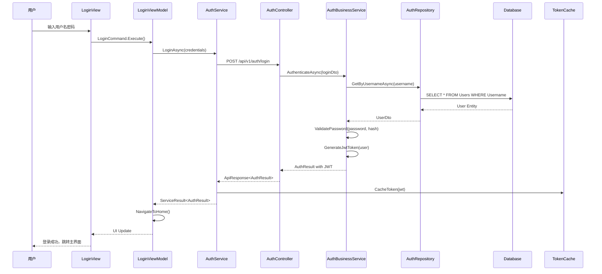
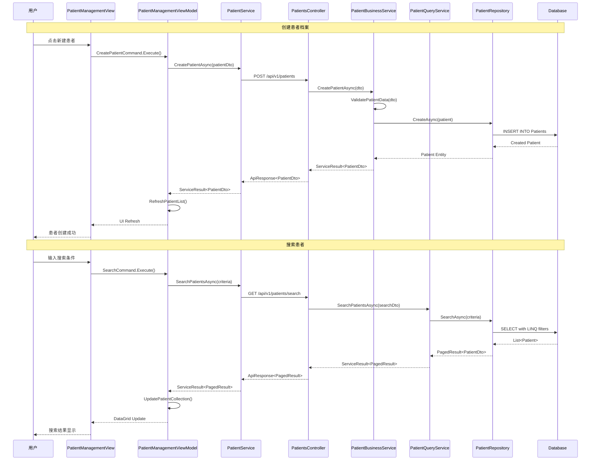
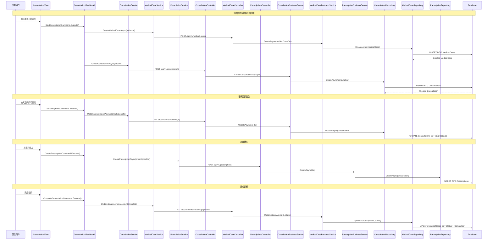
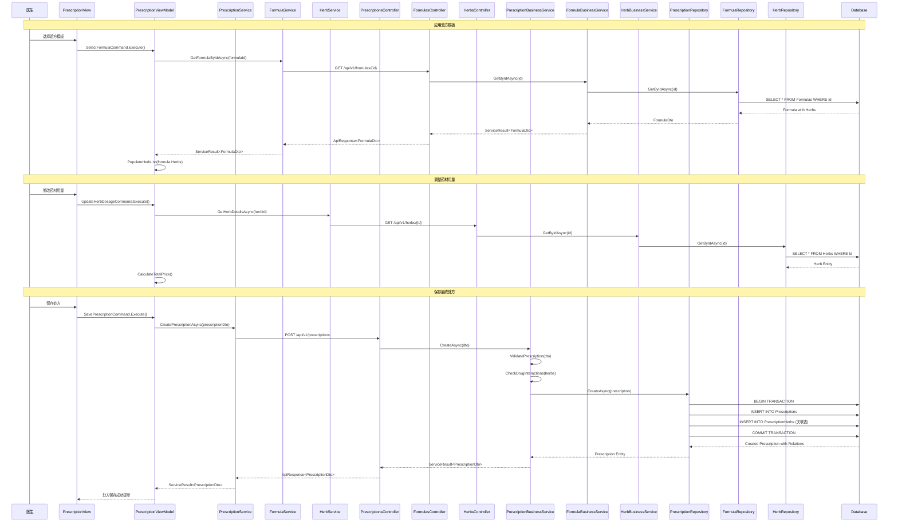
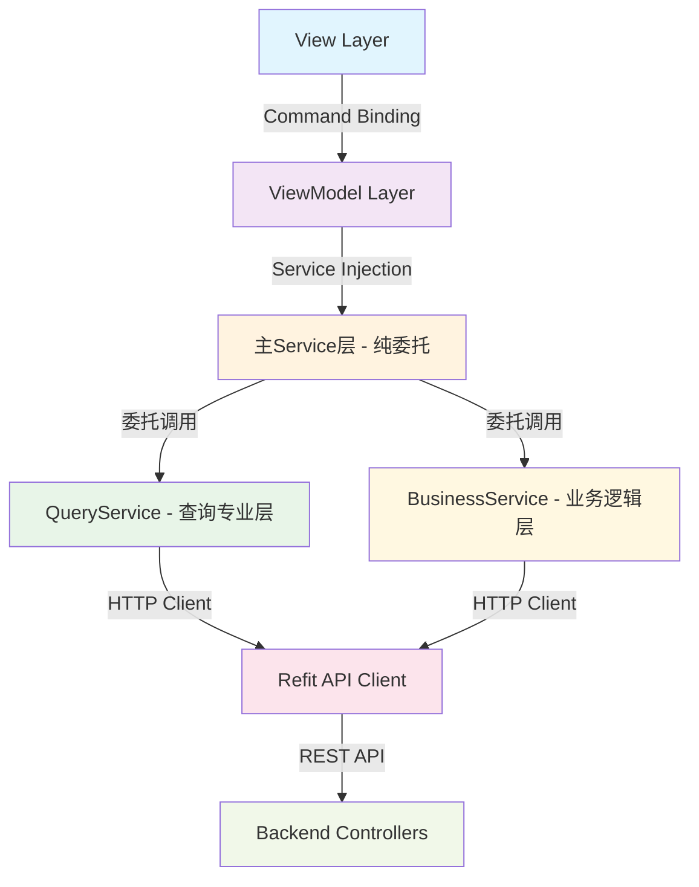
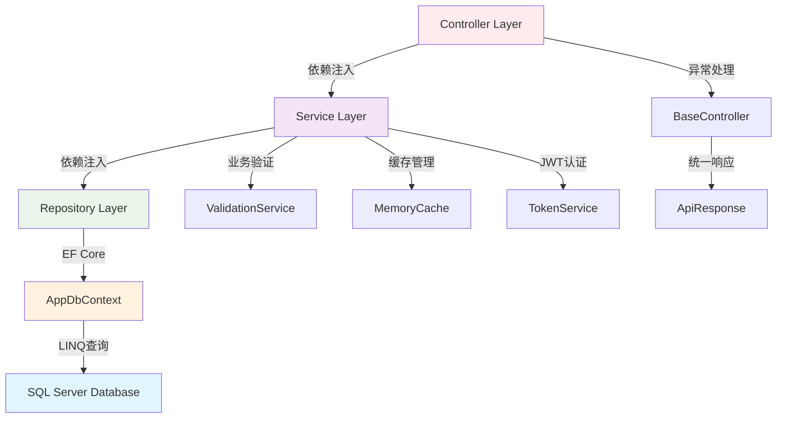
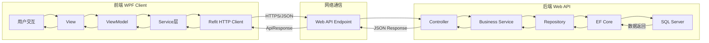
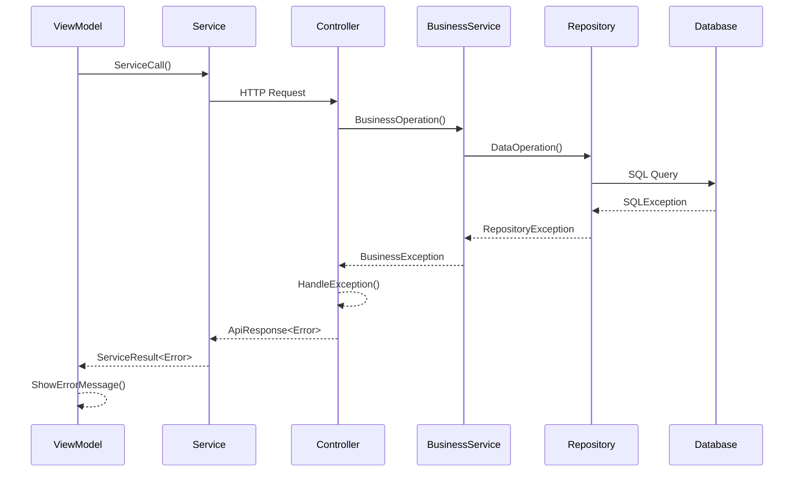
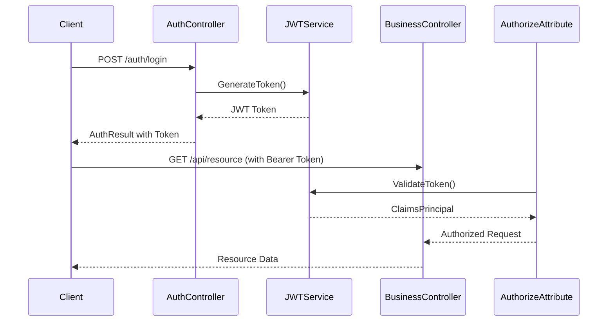

# 端到端调用链和序列图

## 系统概述

本文档提供LYBT中医诊所管理系统的端到端调用链分析，包括从前端WPF用户界面到后端数据库的完整数据流。基于UltraThink双层前端架构和传统三层后端架构的混合设计。

## 核心业务流程调用链

### 1. 用户登录流程

### 2. 患者档案管理流程

### 3. 完整诊疗流程

### 4. 处方管理和验方应用流程

## 关键架构组件调用关系

### 前端UltraThink双层架构调用流

### 后端传统三层架构调用流

### 数据流向图

## 性能关键点分析

### 1. 数据库查询优化点

- **批量操作**: Repository层使用EF Core的ExecuteUpdateAsync避免N+1查询
- **分页查询**: QueryService层实现PagedResult<T>减少内存占用
- **索引策略**: 关键查询字段(Username, PatientId, 电话号码)建立索引
- **连接池**: 配置Max=20, Min=2适合小型诊所规模

### 2. 缓存策略

- **前端缓存**: ViewModel层缓存常用数据(药材列表、验方模板)
- **后端缓存**: MemoryCache缓存静态数据(角色权限、系统配置)
- **API响应缓存**: 对于读多写少的数据应用响应缓存

### 3. 网络通信优化

- **JWT Token**: 8小时有效期减少认证请求
- **压缩传输**: API响应启用Gzip压缩
- **异步调用**: 所有HTTP请求使用async/await模式

## 错误处理链路

## 安全验证链路

## 总结

本系统采用混合架构设计，前端UltraThink双层架构确保了代码的精简和职责清晰，后端传统三层架构保证了系统的稳定性和可维护性。通过端到端的调用链分析，可以看出：

1. **数据流清晰**: 从用户交互到数据持久化的完整链路可追溯
2. **错误处理完善**: 每层都有相应的异常处理机制
3. **性能优化到位**: 关键路径都有相应的缓存和优化策略
4. **安全机制健全**: JWT认证和RBAC权限控制覆盖全链路
5. **架构协调性好**: 前后端架构虽然不同但配合良好

这种混合架构设计适合中小型诊所的业务特点，既保证了开发效率又确保了系统稳定性。