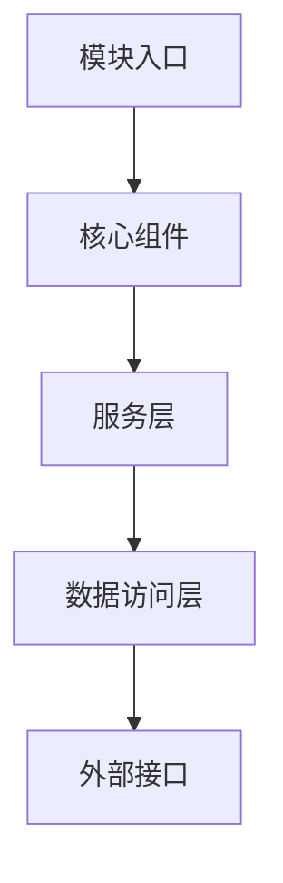

# 模块模板使用指南

> **版本**: 1.0
> **创建日期**: 2025-10-15
> **最后更新**: 2025-10-15
> **维护者**: 开发团队
> **适用范围**: LYBT 项目所有开发人员
> **相关文档**: [快速开发指南](rapid-development-guide.md) | [模块文档模板](../modules/template/module-document-template.md) | [模块文档编写指南](../modules/template/module-document-writing-guide.md)

## 📋 指南概述

本文档为 LYBT 项目开发人员提供详细的模块模板使用指南，帮助开发者快速、准确地创建新模块。指南包含模板选择、定制、使用流程和最佳实践，确保所有模块都符合项目标准。

## 🎯 指南目标

### 主要目标
- **快速上手**: 新开发人员能在短时间内掌握模板使用
- **标准统一**: 确保所有模块结构和命名规范一致
- **效率提升**: 减少重复工作，专注业务逻辑开发
- **质量保证**: 遵循项目架构标准，保证代码质量

### 适用场景
- **新模块开发**: 创建全新的业务功能模块
- **模块重构**: 基于模板重构现有模块
- **团队培训**: 帮助新团队成员了解项目规范
- **代码审查**: 检查模块是否符合模板标准

## 🏗️ 模板架构概览

### 模板结构
```
docs/modules/template/
├── module-document-template.md     # 模块文档模板
├── module-document-writing-guide.md # 文档编写指南
├── module-document-quality-checklist.md # 质量检查清单
└── README.md                        # 模板说明文档
```

### 实际模块示例
```
docs/modules/
├── patients/         # 患者管理模块
├── medicalcase/      # 病案管理模块
├── consultation/     # 诊疗管理模块
├── prescriptions/    # 处方管理模块
├── users/           # 用户管理模块
├── herbs/           # 中药管理模块
├── formula/         # 方剂管理模块
└── auth/            # 认证模块
```

## 🚀 快速开始

### 第一步：选择合适的模板

#### 1.1 确定模块类型
根据功能需求选择合适的参考模块：

| 模块类型 | 参考模块 | 特点 | 适用场景 |
|---------|---------|------|---------|
| **基础CRUD模块** | `patients/` | 标准增删改查，权限控制 | 用户管理、基础数据管理 |
| **业务流程模块** | `medicalcase/` | 复杂业务逻辑，聚合根模式 | 订单管理、审批流程 |
| **专业领域模块** | `consultation/` | 领域专业知识，特殊业务规则 | 医疗诊断、财务管理 |
| **集成模块** | `prescriptions/` | 多模块集成，复杂计算 | 处方管理、报表生成 |

#### 1.2 分析现有模块
查看现有模块的目录结构和文档：

```bash
# 查看患者管理模块结构
tree docs/modules/patients/

# 查看模块文档
cat docs/modules/patients/README.md

# 查看代码结构
tree src/Server/Modules/LYBT.Module.Patients/
tree src/Client/Desktop/Modules/LYBT.Desktop.Patients/
```

### 第二步：复制模板

#### 2.1 复制文档模板
```bash
# 创建新模块目录
mkdir docs/modules/[ModuleName]

# 复制文档模板
cp docs/modules/template/module-document-template.md docs/modules/[ModuleName]/README.md
cp docs/modules/template/module-document-writing-guide.md docs/modules/[ModuleName]/
cp docs/modules/template/module-document-quality-checklist.md docs/modules/[ModuleName]/
```

#### 2.2 更新模块名称
在 `README.md` 中执行以下替换：

```bash
# 替换模块名称占位符
sed -i 's/\[模块名称\]/[ModuleName]/g' docs/modules/[ModuleName]/README.md

# 替换维护者信息
sed -i 's/\[维护者姓名\]/开发团队/g' docs/modules/[ModuleName]/README.md

# 更新日期
sed -i 's/YYYY-MM-DD/$(date +%Y-%m-%d)/g' docs/modules/[ModuleName]/README.md
```

### 第三步：定制模块内容

#### 3.1 基础信息定制
```markdown
# [ModuleName] 文档

> **版本**: 1.0
> **创建日期**: 2025-10-15
> **最后更新**: 2025-10-15
> **维护者**: [你的姓名]
> **相关模块**: [相关模块列表]
```

#### 3.2 功能描述定制
```markdown
### 模块用途
[简明描述模块的主要用途和在系统中的作用]

### 核心功能
- **功能1**: [功能描述]
- **功能2**: [功能描述]
- **功能3**: [功能描述]

### 业务价值
[描述模块为业务带来的价值和好处]
```

#### 3.3 架构设计定制
根据实际模块架构调整 Mermaid 图表：



## 📝 文档编写指南

### 使用模块文档模板

#### 1. 按章节顺序编写
严格按照模板的章节顺序编写文档：
1. 文档概述
2. 模块简介
3. 架构设计
4. 技术实现
5. 数据模型
6. API 接口
7. 用户界面
8. 业务流程
9. 集成指南
10. 配置说明
11. 测试指南
12. 部署指南
13. 故障排除
14. 性能优化
15. 安全考虑
16. 参考资料
17. 版本历史
18. 联系方式

#### 2. 内容质量要求
- **准确性**: 所有技术信息必须准确无误
- **完整性**: 覆盖所有必要的功能点
- **实用性**: 能够指导实际开发工作
- **可读性**: 语言简洁明了，结构清晰

### 编写最佳实践

#### 1. 代码示例
```csharp
/// <summary>
/// 服务接口示例
/// </summary>
public interface I[ModuleName]Service
{
    Task<ServiceResult<[ModuleName]Dto>> GetByIdAsync(Guid id);
    Task<ServiceResult<PagedResult<[ModuleName]Dto>>> GetPagedAsync(int page = 1, int pageSize = 20);
}
```

#### 2. API 文档
```markdown
#### 获取列表
```
GET /api/[controller]
参数:
  - pageNumber: 页码 (从1开始)
  - pageSize: 每页数量 (默认20)
  - keyword: 搜索关键词 (可选)
响应: [响应格式说明]
```

#### 3. 配置示例
```json
{
  "[ModuleName]": {
    "Setting1": "value1",
    "Setting2": "value2"
  }
}
```

## 🔧 代码结构模板

### Server 端模块结构

#### 1. 创建模块目录
```bash
mkdir -p src/Server/Modules/LYBT.Module.[ModuleName]/{Interfaces,Services,Repositories,Mapping,Validators}
```

#### 2. 创建核心文件
```bash
# 创建接口文件
touch src/Server/Modules/LYBT.Module.[ModuleName]/Interfaces/I[ModuleName]Repository.cs
touch src/Server/Modules/LYBT.Module.[ModuleName]/Interfaces/I[ModuleName]Service.cs

# 创建服务文件
touch src/Server/Modules/LYBT.Module.[ModuleName]/Services/[ModuleName]Service.cs

# 创建仓储文件
touch src/Server/Modules/LYBT.Module.[ModuleName]/Repositories/[ModuleName]Repository.cs

# 创建映射文件
touch src/Server/Modules/LYBT.Module.[ModuleName]/Mapping/[ModuleName]MappingProfile.cs

# 创建验证器文件
touch src/Server/Modules/LYBT.Module.[ModuleName]/Validators/[ModuleName]CreateDtoValidator.cs
touch src/Server/Modules/LYBT.Module.[ModuleName]/Validators/[ModuleName]UpdateDtoValidator.cs

# 创建模块注册文件
touch src/Server/Modules/LYBT.Module.[ModuleName]/[ModuleName]Module.cs

# 创建项目文件
touch src/Server/Modules/LYBT.Module.[ModuleName]/LYBT.Module.[ModuleName].csproj
```

#### 3. 文件内容模板

**接口模板**:
```csharp
using LYBT.Shared.Models.Contracts.Common;
using LYBT.Shared.Models.Contracts.[ModuleName];

namespace LYBT.Module.[ModuleName].Interfaces
{
    /// <summary>
    /// [ModuleName] 仓储接口
    /// </summary>
    public interface I[ModuleName]Repository
    {
        Task<[ModuleName]Entity?> GetByIdAsync(Guid id);
        Task<PagedResult<[ModuleName]Entity>> GetPagedAsync(int page, int pageSize, string? keyword = null);
        Task<[ModuleName]Entity> AddAsync([ModuleName]Entity entity);
        Task<[ModuleName]Entity> UpdateAsync([ModuleName]Entity entity);
        Task<bool> DeleteAsync(Guid id);
    }
}
```

**服务模板**:
```csharp
using AutoMapper;
using LYBT.Module.[ModuleName].Interfaces;
using LYBT.Server.Interfaces.Services;
using LYBT.Shared.Models.Contracts.Common;
using LYBT.Shared.Models.Contracts.[ModuleName];
using Microsoft.Extensions.Logging;

namespace LYBT.Module.[ModuleName].Services
{
    /// <summary>
    /// [ModuleName] 服务
    /// </summary>
    public class [ModuleName]Service : I[ModuleName]Service
    {
        private readonly I[ModuleName]Repository _repository;
        private readonly IMapper _mapper;
        private readonly ILogger<[ModuleName]Service> _logger;

        public [ModuleName]Service(
            I[ModuleName]Repository repository,
            IMapper mapper,
            ILogger<[ModuleName]Service> logger)
        {
            _repository = repository;
            _mapper = mapper;
            _logger = logger;
        }

        public async Task<ServiceResult<[ModuleName]Dto>> GetByIdAsync(Guid id)
        {
            try
            {
                var entity = await _repository.GetByIdAsync(id);
                if (entity == null)
                    return ServiceResult<[ModuleName]Dto>.Failure("[模块名称]不存在");

                var dto = _mapper.Map<[ModuleName]Dto>(entity);
                return ServiceResult<[ModuleName]Dto>.Success(dto);
            }
            catch (Exception ex)
            {
                _logger.LogError(ex, "获取[模块名称]失败");
                return ServiceResult<[ModuleName]Dto>.Failure("获取[模块名称]失败");
            }
        }

        // 其他方法实现...
    }
}
```

### Client 端模块结构

#### 1. 创建模块目录
```bash
mkdir -p src/Client/Desktop/Modules/LYBT.Desktop.[ModuleName]/{Interfaces,ViewModels,Views,Models,Repositories}
```

#### 2. 创建核心文件
```bash
# 创建接口文件
touch src/Client/Desktop/Modules/LYBT.Desktop.[ModuleName]/Interfaces/I[ModuleName]Repository.cs

# 创建 ViewModel 文件
touch src/Client/Desktop/Modules/LYBT.Desktop.[ModuleName]/ViewModels/[ModuleName]ManagementViewModel.cs
touch src/Client/Desktop/Modules/LYBT.Desktop.[ModuleName]/ViewModels/[ModuleName]ListViewModel.cs
touch src/Client/Desktop/Modules/LYBT.Desktop.[ModuleName]/ViewModels/[ModuleName]DetailViewModel.cs

# 创建 View 文件
touch src/Client/Desktop/Modules/LYBT.Desktop.[ModuleName]/Views/[ModuleName]ManagementView.xaml
touch src/Client/Desktop/Modules/LYBT.Desktop.[ModuleName]/Views/[ModuleName]ManagementView.xaml.cs

# 创建其他文件
touch src/Client/Desktop/Modules/LYBT.Desktop.[ModuleName]/Models/[ModuleName]Item.cs
touch src/Client/Desktop/Modules/LYBT.Desktop.[ModuleName]/Repositories/[ModuleName]Repository.cs
touch src/Client/Desktop/Modules/LYBT.Desktop.[ModuleName]/[ModuleName]Module.cs
touch src/Client/Desktop/Modules/LYBT.Desktop.[ModuleName]/LYBT.Desktop.[ModuleName].csproj
```

## 🔄 开发工作流程

### 完整开发流程

#### Phase 1: 准备阶段
1. **需求分析**: 明确功能需求和业务规则
2. **架构设计**: 确定模块架构和依赖关系
3. **模板选择**: 选择合适的参考模块
4. **环境准备**: 配置开发环境和工具

#### Phase 2: 实现阶段
1. **目录创建**: 创建模块目录结构
2. **文件生成**: 基于模板创建代码文件
3. **逻辑实现**: 实现业务逻辑和数据处理
4. **接口定义**: 定义 API 接口和数据传输对象
5. **测试编写**: 编写单元测试和集成测试

#### Phase 3: 集成阶段
1. **依赖注入**: 配置模块的依赖注入
2. **API 集成**: 集成到 WebAPI 项目
3. **前端集成**: 集成到桌面应用
4. **数据库集成**: 创建数据库迁移
5. **端到端测试**: 验证完整功能流程

#### Phase 4: 文档阶段
1. **文档编写**: 基于模板编写模块文档
2. **代码注释**: 添加代码注释和 XML 文档
3. **API 文档**: 生成 API 接口文档
4. **用户指南**: 编写用户使用指南
5. **质量检查**: 使用质量检查清单验证

### 开发检查清单

#### 代码质量检查
```bash
□ 命名规范符合项目标准
□ 代码结构符合三层架构
□ 异步编程规范正确使用
□ 异常处理机制完整
□ 单元测试覆盖核心逻辑
□ 代码注释清晰完整
□ 性能考虑合理
□ 安全措施到位
```

#### 文档质量检查
```bash
□ 文档结构符合模板要求
□ 技术信息准确无误
□ API 文档完整详细
□ 代码示例可运行
□ 配置说明清晰
□ 故障排除实用
□ 参考资料齐全
```

## 🛠️ 模板定制和扩展

### 常见定制场景

#### 1. 添加新功能
```markdown
### 新增功能
- **功能描述**: [详细描述新功能]
- **实现方式**: [实现方法说明]
- **API 接口**: [新增 API 端点]
- **数据库变更**: [数据表结构调整]
```

#### 2. 修改现有功能
```markdown
### 功能优化
- **优化内容**: [描述优化内容]
- **性能提升**: [性能改进说明]
- **用户体验**: [用户体验改善]
- **兼容性**: [向后兼容性说明]
```

#### 3. 集成新模块
```markdown
### 集成指南
- **集成方式**: [API 调用/事件订阅/共享数据库]
- **接口定义**: [相关接口和方法]
- **数据格式**: [数据交换格式]
- **错误处理**: [错误处理机制]
```

### 模板维护

#### 1. 定期更新
- **功能更新**: 根据业务发展更新模板内容
- **技术升级**: 跟随技术栈升级更新代码模板
- **最佳实践**: 总结项目经验，更新最佳实践
- **用户反馈**: 收集用户反馈，改进模板可用性

#### 2. 版本管理
- **版本号**: 遵循语义化版本号规范
- **变更日志**: 记录每次变更的内容
- **兼容性**: 明确向前和向后兼容性
- **迁移指南**: 提供版本升级迁移指导

## 📊 模板使用效果评估

### 评估指标

#### 开发效率指标
- **创建时间**: 新模块创建时间
- **代码质量**: 代码符合标准程度
- **文档完整性**: 文档覆盖功能完整性
- **测试覆盖率**: 单元测试和集成测试覆盖率

#### 团队满意度指标
- **易用性**: 模板使用难易程度
- **实用性**: 模板对实际开发帮助程度
- **一致性**: 模块间结构和命名一致性
- **维护性**: 模块维护和扩展便利性

### 收集反馈

#### 反馈渠道
- **团队会议**: 在开发团队会议中收集反馈
- **代码审查**: 在代码审查过程中收集意见
- **用户调研**: 定期对模块使用情况进行调研
- **问题跟踪**: 通过 Issue 跟踪模板使用问题

#### 持续改进
- **定期回顾**: 定期回顾模板使用效果
- **问题分析**: 分析反馈中的共性问题
- **改进实施**: 根据反馈改进模板内容和功能
- **效果验证**: 验证改进措施的效果

## 📚 参考资料

### 技术文档
- [LYBT 项目架构标准](../architecture/)
- [快速开发指南](rapid-development-guide.md)
- [模块文档编写指南](../modules/template/module-document-writing-guide.md)
- [质量检查清单](../modules/template/module-document-quality-checklist.md)

### 示例模块
- [患者管理模块](../patients/README.md) - 基础CRUD模块示例
- [病案管理模块](../medicalcase/README.md) - 业务流程模块示例
- [诊疗管理模块](../consultation/README.md) - 专业领域模块示例
- [处方管理模块](../prescriptions/README.md) - 集成模块示例

### 工具文档
- [Visual Studio Code 使用指南](https://code.visualstudio.com/docs)
- [.NET CLI 参考文档](https://docs.microsoft.com/en-us/dotnet/core/tools/)
- [Git 版本控制指南](https://git-scm.com/doc)

## 📞 技术支持

### 获取帮助
- **团队支持**: 在开发团队群组中提问
- **代码审查**: 提交 PR 获取代码审查
- **文档问题**: 在 Issue 中反馈文档问题
- **模板使用**: 联系模板维护人员

### 常见问题

**Q: 如何选择合适的参考模块？**
A: 根据模块的复杂度和业务特点选择。基础CRUD功能参考 patients 模块，复杂业务流程参考 medicalcase 模块，专业领域功能参考 consultation 模块。

**Q: 模板内容如何定制？**
A: 在模板基础上根据实际需求进行修改，但要保持结构一致性。参考编写指南和现有模块的定制方法。

**Q: 如何确保模板内容的准确性？**
A: 定期与实际代码对比，及时更新模板内容。收集开发人员的反馈，持续改进模板质量。

---

*本文档遵循 LYBT 项目文档标准编写，如有疑问请参考相关模板或联系技术支持团队。*