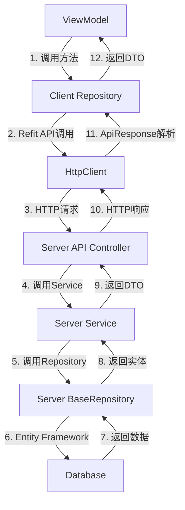

# Repository架构深度分析报告

## 概述

本文档分析LYBTZYZS系统中Client端和Server端Repository的实际实现，确认当前架构的合理性，为后续标准化工作提供基础。

## 架构分析结果

### 1. 整体架构确认 ✅

通过代码分析确认，当前系统Repository架构设计合理且符合三层架构原则：

```
ViewModel → Repository → API(Refit) → HttpClient → Server API → Service → Repository(EF) → Database
```

### 2. Client端Repository分析

#### 2.1 实际实现模式

以 `ConsultationRepository` 为例的Client端Repository实现：

```csharp
public class ConsultationRepository : IConsultationRepository
{
    private readonly IConsultationApi _consultationApi;    // Refit HTTP客户端接口
    private readonly ILogger<ConsultationRepository> _logger;

    // 标准CRUD方法
    public async Task<ConsultationDto> GetByIdAsync(Guid id)
    public async Task<ConsultationDto> CreateAsync(ConsultationCreateDto dto)
    public async Task<ConsultationDto> UpdateAsync(ConsultationUpdateDto dto)
    public async Task<bool> DeleteAsync(Guid id)
    public async Task<PagedResult<ConsultationDto>> GetPagedAsync(int page, int pageSize, string? keyword)
    
    // 业务特定方法
    public async Task<List<ConsultationDto>> GetByMedicalCaseIdAsync(Guid medicalCaseId)
    public async Task<ConsultationDto> StartAsync(Guid patientId)
}
```

#### 2.2 Client端Repository特点

**优势**：
- ✅ **Service层抽象正确定位**：Repository作为HTTP API调用的包装层
- ✅ **Refit集成良好**：使用类型安全的HTTP客户端
- ✅ **错误处理统一**：包含完整的异常处理和日志记录
- ✅ **业务逻辑与数据访问分离**：保持业务特定方法（如StartAsync）

**架构合理性**：
- ✅ Client端Repository作为Service层抽象，包装Refit HTTP客户端，符合桌面应用架构
- ✅ 依赖注入正确：构造函数注入IConsultationApi和ILogger
- ✅ 异步编程规范：所有方法都使用async/await

### 3. Server端Repository分析

#### 3.1 BaseRepository实际实现

Server端 `BaseRepository<TEntity>` 是一个功能完善的Entity Framework包装器：

**核心功能**：
- ✅ **基础CRUD操作**：GetByIdAsync, AddAsync, UpdateAsync, DeleteAsync
- ✅ **复杂查询支持**：FindAsync, GetPaginatedAsync, GetQueryable
- ✅ **Include支持**：支持字符串和表达式两种Include方式
- ✅ **软删除**：内置IsDeleted字段支持
- ✅ **分页查询**：完整的分页实现
- ✅ **批量操作**：AddRangeAsync, DeleteRangeAsync
- ✅ **事务支持**：BeginTransactionAsync, CommitTransactionAsync
- ✅ **性能优化**：AsNoTracking支持

#### 3.2 Server端Repository特点

**优势**：
- ✅ **Entity Framework Core最佳实践**：正确使用DbContext和DbSet
- ✅ **泛型设计完善**：支持任何继承BaseEntity的实体
- ✅ **软删除机制**：内置IsDeleted字段，数据安全
- ✅ **查询性能优化**：支持AsNoTracking和Include预加载
- ✅ **错误处理完善**：并发冲突和数据库更新异常处理
- ✅ **日志记录详细**：操作日志和错误日志

**架构合理性**：
- ✅ Server端Repository作为数据访问层，直接操作数据库，符合服务器端架构
- ✅ 继承BaseEntity确保实体有统一的Id、创建时间、更新时间、软删除字段
- ✅ 异步编程规范和性能优化措施到位

### 4. 完整数据流分析

#### 4.1 标准CRUD操作流程



#### 4.2 架构层次职责

| 层级 | 职责 | 技术实现 |
|------|------|----------|
| **ViewModel** | UI逻辑和状态管理 | WPF MVVM, Prism |
| **Client Repository** | HTTP API调用包装 | Refit, HttpClient |
| **Server API Controller** | HTTP请求处理 | ASP.NET Core Web API |
| **Server Service** | 业务逻辑处理 | .NET Services |
| **Server Repository** | 数据访问层 | Entity Framework Core |
| **Database** | 数据持久化 | SQL Server |

### 5. 架构优势与合理性确认

#### 5.1 设计优势

1. **清晰的分层架构**：每层职责明确，依赖方向正确
2. **Client端抽象合理**：Repository作为HTTP客户端包装，符合桌面应用需求
3. **Server端功能完善**：BaseRepository提供了强大的数据访问能力
4. **类型安全**：使用Refit和Entity Framework的强类型支持
5. **异步编程**：全栈异步，提升性能和用户体验
6. **错误处理完善**：每层都有适当的异常处理机制
7. **日志记录完整**：便于调试和问题追踪

#### 5.2 架构合理性结论

✅ **Client端Repository作为Service层抽象是合理的**：
- 包装Refit HTTP客户端，提供类型安全的API调用
- 统一错误处理和日志记录
- 保留业务特定方法，如ConsultationRepository.StartAsync()

✅ **Server端Repository作为数据访问层是合理的**：
- Entity Framework Core的标准化包装
- 完整的CRUD操作和高级查询功能
- 软删除、分页、批量操作等企业级特性

### 6. 标准化机会与建议

#### 6.1 Client端标准化机会

**当前问题**：
- 各Repository存在重复的CRUD方法实现
- 错误处理模式重复
- 日志记录代码重复

**标准化建议**：
- 创建RepositoryBase<TDto, TCreateDto, TUpdateDto, TApi>基类
- 统一CRUD方法的实现模式
- 标准化错误处理和日志记录
- 保留业务特定方法的扩展能力

#### 6.2 Server端优化机会

**当前优势**：
- BaseRepository功能已经非常完善
- 性能优化措施到位

**优化建议**：
- 添加Specification模式支持复杂查询
- 增强Include的类型安全性
- 添加更多批量操作支持
- 优化查询性能

### 7. 结论

**架构合理性确认**：✅ **当前Repository架构设计合理且实现质量高**

1. **Client端Repository**：正确扮演Service层抽象角色，包装HTTP API调用
2. **Server端Repository**：优秀的数据访问层实现，功能完善且性能优化到位
3. **数据流清晰**：从ViewModel到Database的完整数据流路径明确
4. **技术选型合理**：Refit + Entity Framework Core的组合适合本系统需求

**后续标准化方向**：
1. Client端创建统一基类，消除重复代码
2. Server端小幅优化，增强类型安全和查询能力
3. 统一依赖注入配置
4. 更新架构文档反映最佳实践

---

**分析完成时间**：2025-10-14  
**分析工具**：Serena MCP代码分析  
**文档版本**：v1.0  
**关联GitHub Issue**：#1276