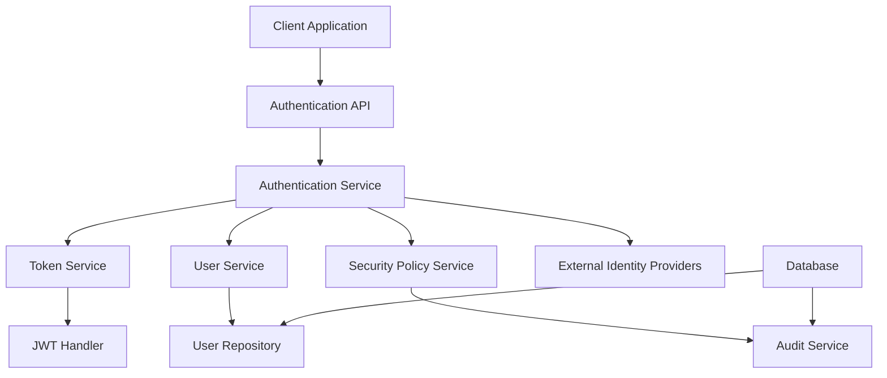
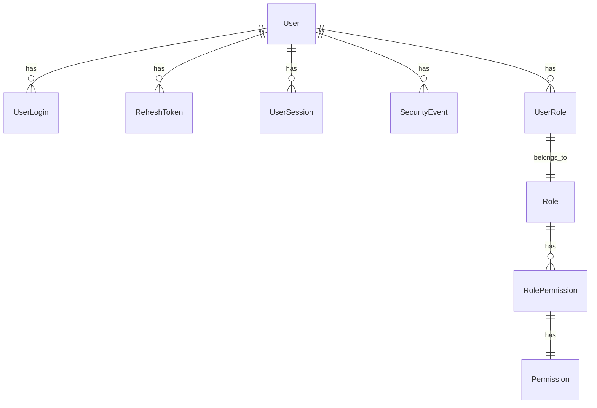
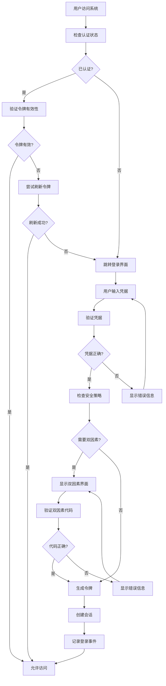

# 认证模块 (Authentication) 文档

> **版本**: 1.0
> **创建日期**: 2025-01-15
> **最后更新**: 2025-01-15
> **维护者**: Claude Code
> **相关模块**: 用户管理 (Users)、患者管理 (Patients)、处方管理 (Prescriptions)

## 📋 文档概述

本文档为 LYBT 中医诊所管理系统的认证模块提供全面的技术文档和使用指南，包括身份验证、授权机制、令牌管理、安全策略等功能的技术实现和集成指南。

## 🎯 模块简介

### 模块用途
认证模块是系统安全架构的核心组件，负责处理用户身份验证、访问授权、会话管理和安全策略执行，确保只有经过授权的用户才能访问系统资源。

### 核心功能
- **身份验证**: 支持用户名密码登录、双因素认证、生物识别认证
- **令牌管理**: JWT 令牌生成、验证、刷新和撤销
- **权限控制**: 基于角色的访问控制 (RBAC) 和细粒度权限管理
- **会话管理**: 用户会话创建、维护、超时和并发控制
- **安全策略**: 密码策略、登录锁定、审计日志和威胁检测
- **单点登录**: SSO 集成和第三方身份提供商支持

### 业务价值
- **安全保障**: 提供企业级安全认证机制，保护患者数据和医疗信息
- **合规要求**: 满足医疗行业数据保护法规和审计要求
- **用户体验**: 提供多种认证方式，优化登录体验和操作效率
- **系统集成**: 支持与现有医院信息系统和第三方认证服务集成

## 🏗️ 架构设计

### 模块架构


### 核心组件

#### Authentication Service
- **用途**: 处理用户身份验证和授权逻辑
- **职责**: 
  - 验证用户凭据
  - 生成和管理访问令牌
  - 执行安全策略
  - 处理登录和登出操作
- **接口**: `IAuthenticationService`
- **依赖**: IUserService, ITokenService, ISecurityPolicyService, I AuditService

#### Token Service
- **用途**: 管理 JWT 令牌的生命周期
- **职责**:
  - 生成访问令牌和刷新令牌
  - 验证令牌有效性
  - 处理令牌刷新和撤销
  - 管理令牌黑名单
- **接口**: `ITokenService`
- **依赖**: IJwtSecurityTokenHandler, ICacheManager

#### Security Policy Service
- **用途**: 执行安全策略和威胁检测
- **职责**:
  - 密码策略验证
  - 登录尝试计数和锁定
  - 异常行为检测
  - 安全事件记录
- **接口**: `ISecurityPolicyService`
- **依赖**: ICacheManager, IAuditService, INotificationService

### 数据流
1. **用户登录**: 客户端提交凭据 → API 验证 → 服务层处理 → 令牌生成 → 响应返回
2. **令牌验证**: 客户端携带令牌 → API 拦截器 → 令牌验证 → 用户身份确立 → 请求处理
3. **令牌刷新**: 客户端提交刷新令牌 → 令牌服务验证 → 生成新令牌 → 响应返回

## 🔧 技术实现

### Server 端实现

#### 实体模型
```csharp
// 用户登录实体
public class UserLogin
{
    public Guid Id { get; set; }
    public Guid UserId { get; set; }
    public string Username { get; set; }
    public string LoginProvider { get; set; }
    public string ProviderKey { get; set; }
    public DateTime LoginTime { get; set; }
    public string? IPAddress { get; set; }
    public string? UserAgent { get; set; }
    public bool IsSuccess { get; set; }
    public string? FailureReason { get; set; }
    
    // Navigation properties
    public virtual User User { get; set; }
}

// 刷新令牌实体
public class RefreshToken
{
    public Guid Id { get; set; }
    public Guid UserId { get; set; }
    public string Token { get; set; }
    public DateTime CreatedAt { get; set; }
    public DateTime ExpiresAt { get; set; }
    public bool IsUsed { get; set; }
    public bool IsRevoked { get; set; }
    public string? IPAddress { get; set; }
    
    // Navigation properties
    public virtual User User { get; set; }
}

// 用户会话实体
public class UserSession
{
    public Guid Id { get; set; }
    public Guid UserId { get; set; }
    public string SessionId { get; set; }
    public DateTime StartedAt { get; set; }
    public DateTime? LastActivityAt { get; set; }
    public DateTime? ExpiresAt { get; set; }
    public bool IsActive { get; set; }
    public string? IPAddress { get; set; }
    public string? UserAgent { get; set; }
    
    // Navigation properties
    public virtual User User { get; set; }
}

// 安全事件实体
public class SecurityEvent
{
    public Guid Id { get; set; }
    public Guid UserId { get; set; }
    public string EventType { get; set; }
    public string Description { get; set; }
    public DateTime EventTime { get; set; }
    public string? IPAddress { get; set; }
    public string? UserAgent { get; set; }
    public bool IsThreat { get; set; }
    public int ThreatLevel { get; set; }
    public string? AdditionalData { get; set; }
    
    // Navigation properties
    public virtual User User { get; set; }
}
```

#### 服务接口
```csharp
// 认证服务接口
public interface IAuthenticationService
{
    Task<AuthenticationResult> AuthenticateAsync(LoginRequest request);
    Task<AuthenticationResult> RefreshTokenAsync(string refreshToken);
    Task<bool> RevokeTokenAsync(string refreshToken);
    Task<bool> ChangePasswordAsync(Guid userId, ChangePasswordRequest request);
    Task<bool> ResetPasswordAsync(ResetPasswordRequest request);
    Task<bool> EnableTwoFactorAsync(Guid userId);
    Task<string> GenerateTwoFactorCodeAsync(Guid userId);
    Task<bool> VerifyTwoFactorCodeAsync(Guid userId, string code);
    Task<SecurityPolicyResult> ValidateSecurityPolicyAsync(Guid userId, string ipAddress);
    Task<List<UserSessionDto>> GetActiveSessionsAsync(Guid userId);
    Task<bool> TerminateSessionAsync(Guid userId, string sessionId);
    Task<bool> TerminateAllSessionsAsync(Guid userId);
}

// 令牌服务接口
public interface ITokenService
{
    Task<string> GenerateAccessTokenAsync(User user, IList<string> roles);
    Task<string> GenerateRefreshTokenAsync(User user);
    Task<TokenValidationResult> ValidateAccessTokenAsync(string token);
    Task<TokenValidationResult> ValidateRefreshTokenAsync(string token);
    Task<bool> RevokeRefreshTokenAsync(string token);
    Task<bool> RevokeAllUserTokensAsync(Guid userId);
    Task<List<Claim>> GetTokenClaimsAsync(string token);
}

// 安全策略服务接口
public interface ISecurityPolicyService
{
    Task<PasswordPolicyResult> ValidatePasswordAsync(string password, Guid userId);
    Task<LoginAttemptResult> RecordLoginAttemptAsync(Guid userId, bool success, string ipAddress);
    Task<bool> IsUserLockedOutAsync(Guid userId);
    Task<SecurityEventResult> RecordSecurityEventAsync(SecurityEventType eventType, Guid userId, string? ipAddress);
    Task<ThreatDetectionResult> DetectSuspiciousActivityAsync(Guid userId, string ipAddress);
    Task<List<SecurityPolicyDto>> GetActivePoliciesAsync();
    Task<bool> UpdateSecurityPolicyAsync(SecurityPolicyDto policy);
}
```

#### 控制器
```csharp
[ApiController]
[Route("api/[controller]")]
public class AuthenticationController : ControllerBase
{
    private readonly IAuthenticationService _authenticationService;
    private readonly ITokenService _tokenService;
    private readonly ILogger<AuthenticationController> _logger;

    public AuthenticationController(
        IAuthenticationService authenticationService,
        ITokenService tokenService,
        ILogger<AuthenticationController> logger)
    {
        _authenticationService = authenticationService;
        _tokenService = tokenService;
        _logger = logger;
    }

    [HttpPost("login")]
    public async Task<ActionResult<AuthenticationResponse>> Login([FromBody] LoginRequest request)
    {
        try
        {
            var result = await _authenticationService.AuthenticateAsync(request);
            
            if (result.IsSuccess)
            {
                return Ok(new AuthenticationResponse
                {
                    Success = true,
                    AccessToken = result.AccessToken,
                    RefreshToken = result.RefreshToken,
                    ExpiresIn = result.ExpiresIn,
                    User = result.User,
                    RequiresTwoFactor = result.RequiresTwoFactor
                });
            }
            
            return BadRequest(new AuthenticationResponse
            {
                Success = false,
                ErrorMessage = result.ErrorMessage,
                RequiresTwoFactor = result.RequiresTwoFactor
            });
        }
        catch (Exception ex)
        {
            _logger.LogError(ex, "Login failed for user: {Username}", request.Username);
            return StatusCode(500, new { message = "登录过程中发生错误" });
        }
    }

    [HttpPost("refresh")]
    public async Task<ActionResult<RefreshTokenResponse>> RefreshToken([FromBody] RefreshTokenRequest request)
    {
        try
        {
            var result = await _authenticationService.RefreshTokenAsync(request.RefreshToken);
            
            if (result.IsSuccess)
            {
                return Ok(new RefreshTokenResponse
                {
                    Success = true,
                    AccessToken = result.AccessToken,
                    RefreshToken = result.RefreshToken,
                    ExpiresIn = result.ExpiresIn
                });
            }
            
            return Unauthorized(new RefreshTokenResponse
            {
                Success = false,
                ErrorMessage = result.ErrorMessage
            });
        }
        catch (Exception ex)
        {
            _logger.LogError(ex, "Token refresh failed");
            return StatusCode(500, new { message = "令牌刷新失败" });
        }
    }

    [HttpPost("logout")]
    [Authorize]
    public async Task<IActionResult> Logout([FromBody] LogoutRequest request)
    {
        try
        {
            var userId = User.GetUserId();
            var result = await _authenticationService.RevokeTokenAsync(request.RefreshToken);
            
            if (result)
            {
                await _authenticationService.RecordSecurityEventAsync(
                    SecurityEventType.UserLogout, userId, HttpContext.GetIpAddress());
            }
            
            return Ok(new { message = "登出成功" });
        }
        catch (Exception ex)
        {
            _logger.LogError(ex, "Logout failed");
            return StatusCode(500, new { message = "登出失败" });
        }
    }

    [HttpPost("change-password")]
    [Authorize]
    public async Task<IActionResult> ChangePassword([FromBody] ChangePasswordRequest request)
    {
        try
        {
            var userId = User.GetUserId();
            var result = await _authenticationService.ChangePasswordAsync(userId, request);
            
            if (result)
            {
                return Ok(new { message = "密码修改成功" });
            }
            
            return BadRequest(new { message = "密码修改失败" });
        }
        catch (Exception ex)
        {
            _logger.LogError(ex, "Change password failed for user: {UserId}", userId);
            return StatusCode(500, new { message = "密码修改失败" });
        }
    }

    [HttpPost("enable-two-factor")]
    [Authorize]
    public async Task<IActionResult> EnableTwoFactor()
    {
        try
        {
            var userId = User.GetUserId();
            var result = await _authenticationService.EnableTwoFactorAsync(userId);
            
            if (result)
            {
                var qrCode = await _authenticationService.GenerateTwoFactorQrCodeAsync(userId);
                return Ok(new { qrCode });
            }
            
            return BadRequest(new { message = "双因素认证启用失败" });
        }
        catch (Exception ex)
        {
            _logger.LogError(ex, "Enable two factor failed for user: {UserId}", userId);
            return StatusCode(500, new { message = "双因素认证启用失败" });
        }
    }

    [HttpPost("verify-two-factor")]
    public async Task<IActionResult> VerifyTwoFactor([FromBody] VerifyTwoFactorRequest request)
    {
        try
        {
            var result = await _authenticationService.VerifyTwoFactorCodeAsync(request.UserId, request.Code);
            
            if (result)
            {
                return Ok(new { message = "双因素认证验证成功" });
            }
            
            return BadRequest(new { message = "双因素认证验证失败" });
        }
        catch (Exception ex)
        {
            _logger.LogError(ex, "Two factor verification failed for user: {UserId}", request.UserId);
            return StatusCode(500, new { message = "双因素认证验证失败" });
        }
    }

    [HttpGet("sessions")]
    [Authorize]
    public async Task<ActionResult<List<UserSessionDto>>> GetActiveSessions()
    {
        try
        {
            var userId = User.GetUserId();
            var sessions = await _authenticationService.GetActiveSessionsAsync(userId);
            return Ok(sessions);
        }
        catch (Exception ex)
        {
            _logger.LogError(ex, "Get active sessions failed for user: {UserId}", userId);
            return StatusCode(500, new { message = "获取活动会话失败" });
        }
    }

    [HttpPost("terminate-session")]
    [Authorize]
    public async Task<IActionResult> TerminateSession([FromBody] TerminateSessionRequest request)
    {
        try
        {
            var userId = User.GetUserId();
            var result = await _authenticationService.TerminateSessionAsync(userId, request.SessionId);
            
            if (result)
            {
                return Ok(new { message = "会话终止成功" });
            }
            
            return BadRequest(new { message = "会话终止失败" });
        }
        catch (Exception ex)
        {
            _logger.LogError(ex, "Terminate session failed for user: {UserId}", userId);
            return StatusCode(500, new { message = "会话终止失败" });
        }
    }
}
```

### Client 端实现

#### Login ViewModel
```csharp
public class LoginViewModel : UnifiedViewModelBase
{
    private readonly IAuthenticationService _authenticationService;
    private readonly IDialogService _dialogService;
    private readonly INavigationService _navigationService;

    [ObservableProperty]
    private string _username = string.Empty;

    [ObservableProperty]
    private string _password = string.Empty;

    [ObservableProperty]
    private bool _rememberMe;

    [ObservableProperty]
    private bool _isLoading;

    [ObservableProperty]
    private bool _requiresTwoFactor;

    [ObservableProperty]
    private string _twoFactorCode = string.Empty;

    [ObservableProperty]
    private string _errorMessage = string.Empty;

    public LoginViewModel(
        IAuthenticationService authenticationService,
        IDialogService dialogService,
        INavigationService navigationService)
    {
        _authenticationService = authenticationService;
        _dialogService = dialogService;
        _navigationService = navigationService;
    }

    [RelayCommand]
    private async Task LoginAsync()
    {
        if (string.IsNullOrWhiteSpace(Username) || string.IsNullOrWhiteSpace(Password))
        {
            ErrorMessage = "请输入用户名和密码";
            return;
        }

        try
        {
            IsLoading = true;
            ErrorMessage = string.Empty;

            var request = new LoginRequest
            {
                Username = Username,
                Password = Password,
                RememberMe = RememberMe,
                IPAddress = NetworkHelper.GetLocalIpAddress(),
                UserAgent = GetUserAgent()
            };

            var result = await _authenticationService.AuthenticateAsync(request);

            if (result.IsSuccess)
            {
                if (result.RequiresTwoFactor)
                {
                    RequiresTwoFactor = true;
                    return;
                }

                // 存储认证信息
                await StoreAuthenticationInfoAsync(result);
                
                // 导航到主界面
                await _navigationService.NavigateToAsync<MainViewModel>();
            }
            else
            {
                ErrorMessage = result.ErrorMessage ?? "登录失败";
            }
        }
        catch (Exception ex)
        {
            ErrorMessage = "登录过程中发生错误";
            Logger.LogError(ex, "Login failed");
        }
        finally
        {
            IsLoading = false;
        }
    }

    [RelayCommand]
    private async Task VerifyTwoFactorAsync()
    {
        if (string.IsNullOrWhiteSpace(TwoFactorCode))
        {
            ErrorMessage = "请输入双因素认证代码";
            return;
        }

        try
        {
            IsLoading = true;
            ErrorMessage = string.Empty;

            var result = await _authenticationService.VerifyTwoFactorCodeAsync(
                Username, TwoFactorCode);

            if (result)
            {
                RequiresTwoFactor = false;
                TwoFactorCode = string.Empty;
                
                // 重新尝试登录
                await LoginAsync();
            }
            else
            {
                ErrorMessage = "双因素认证代码错误";
            }
        }
        catch (Exception ex)
        {
            ErrorMessage = "双因素认证验证失败";
            Logger.LogError(ex, "Two factor verification failed");
        }
        finally
        {
            IsLoading = false;
        }
    }

    [RelayCommand]
    private async Task ForgotPasswordAsync()
    {
        await _navigationService.NavigateToAsync<ForgotPasswordViewModel>();
    }

    [RelayCommand]
    private void Cancel()
    {
        Username = string.Empty;
        Password = string.Empty;
        TwoFactorCode = string.Empty;
        ErrorMessage = string.Empty;
        RequiresTwoFactor = false;
    }

    private async Task StoreAuthenticationInfoAsync(AuthenticationResult result)
    {
        // 存储访问令牌
        SecureStorageHelper.SetSecureValue("access_token", result.AccessToken);
        
        // 存储刷新令牌
        if (result.RememberMe)
        {
            SecureStorageHelper.SetSecureValue("refresh_token", result.RefreshToken);
        }
        
        // 存储用户信息
        await SecureStorageHelper.SetSecureValueAsync("user_info", 
            JsonSerializer.Serialize(result.User));
    }

    private string GetUserAgent()
    {
        return $"LYBT Desktop {Assembly.GetExecutingAssembly().GetName().Version}";
    }
}
```

#### Authentication Repository
```csharp
public class AuthenticationRepository : RepositoryBase<AuthenticationDto, LoginRequest, ChangePasswordRequest, IAuthenticationApi>
{
    private readonly ITokenService _tokenService;

    public AuthenticationRepository(
        IAuthenticationApi api,
        ITokenService tokenService,
        IMapper mapper,
        ILogger<AuthenticationRepository> logger)
        : base(api, mapper, logger)
    {
        _tokenService = tokenService;
    }

    public async Task<AuthenticationResult> AuthenticateAsync(LoginRequest request)
    {
        try
        {
            var response = await Api.LoginAsync(request);
            
            if (response.Success)
            {
                // 存储令牌
                await _tokenService.StoreTokensAsync(
                    response.AccessToken, 
                    response.RefreshToken);

                return new AuthenticationResult
                {
                    IsSuccess = true,
                    AccessToken = response.AccessToken,
                    RefreshToken = response.RefreshToken,
                    ExpiresIn = response.ExpiresIn,
                    User = response.User,
                    RequiresTwoFactor = response.RequiresTwoFactor
                };
            }

            return new AuthenticationResult
            {
                IsSuccess = false,
                ErrorMessage = response.ErrorMessage,
                RequiresTwoFactor = response.RequiresTwoFactor
            };
        }
        catch (Exception ex)
        {
            Logger.LogError(ex, "Authentication failed");
            return new AuthenticationResult
            {
                IsSuccess = false,
                ErrorMessage = "认证过程中发生错误"
            };
        }
    }

    public async Task<AuthenticationResult> RefreshTokenAsync(string refreshToken)
    {
        try
        {
            var response = await Api.RefreshTokenAsync(new RefreshTokenRequest
            {
                RefreshToken = refreshToken
            });

            if (response.Success)
            {
                // 更新令牌
                await _tokenService.StoreTokensAsync(
                    response.AccessToken,
                    response.RefreshToken);

                return new AuthenticationResult
                {
                    IsSuccess = true,
                    AccessToken = response.AccessToken,
                    RefreshToken = response.RefreshToken,
                    ExpiresIn = response.ExpiresIn
                };
            }

            return new AuthenticationResult
            {
                IsSuccess = false,
                ErrorMessage = response.ErrorMessage
            };
        }
        catch (Exception ex)
        {
            Logger.LogError(ex, "Token refresh failed");
            return new AuthenticationResult
            {
                IsSuccess = false,
                ErrorMessage = "令牌刷新失败"
            };
        }
    }

    public async Task<bool> LogoutAsync(string refreshToken)
    {
        try
        {
            await Api.LogoutAsync(new LogoutRequest
            {
                RefreshToken = refreshToken
            });

            // 清除本地令牌
            await _tokenService.ClearTokensAsync();

            return true;
        }
        catch (Exception ex)
        {
            Logger.LogError(ex, "Logout failed");
            return false;
        }
    }

    public async Task<bool> ChangePasswordAsync(ChangePasswordRequest request)
    {
        try
        {
            var response = await Api.ChangePasswordAsync(request);
            return response.IsSuccess;
        }
        catch (Exception ex)
        {
            Logger.LogError(ex, "Change password failed");
            return false;
        }
    }

    public async Task<bool> EnableTwoFactorAsync()
    {
        try
        {
            var response = await Api.EnableTwoFactorAsync();
            return response.IsSuccess;
        }
        catch (Exception ex)
        {
            Logger.LogError(ex, "Enable two factor failed");
            return false;
        }
    }

    public async Task<string> GenerateTwoFactorQrCodeAsync()
    {
        try
        {
            var response = await Api.EnableTwoFactorAsync();
            return response.QrCode;
        }
        catch (Exception ex)
        {
            Logger.LogError(ex, "Generate two factor QR code failed");
            return string.Empty;
        }
    }
}
```

#### Login View
```xml
<UserControl x:Class="LYBT.Desktop.Auth.Views.LoginView"
             xmlns="http://schemas.microsoft.com/winfx/2006/xaml/presentation"
             xmlns:x="http://schemas.microsoft.com/winfx/2006/xaml"
             xmlns:materialDesign="http://materialdesigninxaml.net/winfx/xaml/themes"
             xmlns:prism="http://prismlibrary.com/">
    
    <Grid Background="{DynamicResource MaterialDesignPaper}">
        <Grid.RowDefinitions>
            <RowDefinition Height="Auto"/>
            <RowDefinition Height="*"/>
            <RowDefinition Height="Auto"/>
        </Grid.RowDefinitions>

        <!-- 标题栏 -->
        <Border Grid.Row="0" Background="{DynamicResource PrimaryHueMidBrush}" 
                Height="60" Margin="0,0,0,20">
            <StackPanel Orientation="Horizontal" VerticalAlignment="Center" Margin="20,0">
                <materialDesign:PackIcon Kind="MedicalBag" 
                                         Foreground="White" 
                                         Width="32" Height="32"
                                         Margin="0,0,15,0"/>
                <TextBlock Text="LYBT 中医诊所管理系统" 
                           FontSize="20" 
                           FontWeight="Bold"
                           Foreground="White"
                           VerticalAlignment="Center"/>
            </StackPanel>
        </Border>

        <!-- 登录表单 -->
        <Border Grid.Row="1" 
                Background="White" 
                CornerRadius="8" 
                Padding="40"
                MaxWidth="400"
                Margin="20"
                HorizontalAlignment="Center"
                BoxShadow="0 4 6 2 rgba(0,0,0,0.1)">
            
            <StackPanel>
                <!-- Logo 和标题 -->
                <StackPanel HorizontalAlignment="Center" Margin="0,0,0,30">
                    <materialDesign:PackIcon Kind="Account" 
                                             Width="48" Height="48"
                                             Foreground="{DynamicResource PrimaryHueMidBrush}"
                                             HorizontalAlignment="Center"
                                             Margin="0,0,0,10"/>
                    <TextBlock Text="用户登录" 
                               FontSize="24" 
                               FontWeight="Bold"
                               HorizontalAlignment="Center"
                               Foreground="{DynamicResource MaterialDesignBody}"/>
                </StackPanel>

                <!-- 用户名输入 -->
                <TextBox Text="{Binding Username, UpdateSourceTrigger=PropertyChanged}"
                         materialDesign:HintAssist.Hint="用户名"
                         materialDesign:HintAssist.IsFloating="True"
                         Style="{StaticResource MaterialDesignFloatingHintTextBox}"
                         Margin="0,0,0,20"
                         IsEnabled="{Binding IsLoading, Converter={StaticResource InverseBooleanConverter}}"/>

                <!-- 密码输入 -->
                <PasswordBox x:Name="PasswordBox"
                             materialDesign:HintAssist.Hint="密码"
                             materialDesign:HintAssist.IsFloating="True"
                             Style="{StaticResource MaterialDesignFloatingHintPasswordBox}"
                             Margin="0,0,0,20"
                             IsEnabled="{Binding IsLoading, Converter={StaticResource InverseBooleanConverter}}"/>

                <!-- 双因素认证输入 -->
                <TextBox Text="{Binding TwoFactorCode, UpdateSourceTrigger=PropertyChanged}"
                         materialDesign:HintAssist.Hint="双因素认证代码"
                         materialDesign:HintAssist.IsFloating="True"
                         Style="{StaticResource MaterialDesignFloatingHintTextBox}"
                         Margin="0,0,0,20"
                         Visibility="{Binding RequiresTwoFactor, Converter={StaticResource BooleanToVisibilityConverter}}"
                         IsEnabled="{Binding IsLoading, Converter={StaticResource InverseBooleanConverter}}"/>

                <!-- 记住我 -->
                <CheckBox Content="记住我" 
                          IsChecked="{Binding RememberMe}"
                          Margin="0,0,0,20"
                          IsEnabled="{Binding IsLoading, Converter={StaticResource InverseBooleanConverter}}"/>

                <!-- 错误信息 -->
                <TextBlock Text="{Binding ErrorMessage}"
                           Foreground="Red"
                           FontSize="14"
                           Margin="0,0,0,20"
                           TextWrapping="Wrap"
                           Visibility="{Binding ErrorMessage, Converter={StaticResource StringToVisibilityConverter}}"/>

                <!-- 登录按钮 -->
                <Button Content="登录"
                        Command="{Binding LoginCommand}"
                        Style="{StaticResource MaterialDesignRaisedButton}"
                        Height="48"
                        Margin="0,0,0,10"
                        IsEnabled="{Binding IsLoading, Converter={StaticResource InverseBooleanConverter}}"/>

                <!-- 双因素认证验证按钮 -->
                <Button Content="验证双因素认证"
                        Command="{Binding VerifyTwoFactorCommand}"
                        Style="{StaticResource MaterialDesignRaisedButton}"
                        Height="48"
                        Margin="0,0,0,10"
                        Visibility="{Binding RequiresTwoFactor, Converter={StaticResource BooleanToVisibilityConverter}}"
                        IsEnabled="{Binding IsLoading, Converter={StaticResource InverseBooleanConverter}}"/>

                <!-- 取消按钮 -->
                <Button Content="取消"
                        Command="{Binding CancelCommand}"
                        Style="{StaticResource MaterialDesignOutlinedButton}"
                        Height="48"
                        Margin="0,0,0,20"
                        IsEnabled="{Binding IsLoading, Converter={StaticResource InverseBooleanConverter}}"/>

                <!-- 忘记密码链接 -->
                <Button Content="忘记密码？"
                        Command="{Binding ForgotPasswordCommand}"
                        Style="{StaticResource MaterialDesignFlatButton}"
                        HorizontalAlignment="Center"
                        IsEnabled="{Binding IsLoading, Converter={StaticResource InverseBooleanConverter}}"/>
            </StackPanel>
        </Border>

        <!-- 加载指示器 -->
        <Grid Grid.Row="1" 
              Background="#80000000"
              Visibility="{Binding IsLoading, Converter={StaticResource BooleanToVisibilityConverter}}">
            <StackPanel HorizontalAlignment="Center" VerticalAlignment="Center">
                <ProgressBar IsIndeterminate="True" 
                             Style="{StaticResource MaterialDesignCircularProgressBar}"
                             Width="64" Height="64"
                             Margin="0,0,0,20"/>
                <TextBlock Text="正在登录..." 
                           FontSize="16"
                           Foreground="White"
                           HorizontalAlignment="Center"/>
            </StackPanel>
        </Grid>

        <!-- 底部信息 -->
        <StackPanel Grid.Row="2" 
                    Orientation="Horizontal" 
                    HorizontalAlignment="Center" 
                    Margin="0,20,0,0">
            <TextBlock Text="版本 " 
                       FontSize="12" 
                       Foreground="Gray"/>
            <TextBlock Text="{Binding Source={x:Static properties:Settings.Default.Version}, StringFormat='{}{0}'}" 
                       FontSize="12" 
                       Foreground="Gray"/>
            <TextBlock Text=" | © 2025 LYBT 中医诊所管理系统" 
                       FontSize="12" 
                       Foreground="Gray"
                       Margin="10,0,0,0"/>
        </StackPanel>
    </Grid>
</UserControl>
```

## 📊 数据模型

### 核心实体关系


### 数据传输对象 (DTOs)

#### AuthenticationResult
```csharp
public class AuthenticationResult
{
    public bool IsSuccess { get; set; }
    public string? AccessToken { get; set; }
    public string? RefreshToken { get; set; }
    public int ExpiresIn { get; set; }
    public UserDto? User { get; set; }
    public bool RequiresTwoFactor { get; set; }
    public string? ErrorMessage { get; set; }
    public List<string>? Roles { get; set; }
    public List<string>? Permissions { get; set; }
}

public class LoginRequest
{
    public string Username { get; set; } = string.Empty;
    public string Password { get; set; } = string.Empty;
    public bool RememberMe { get; set; }
    public string? IPAddress { get; set; }
    public string? UserAgent { get; set; }
    public string? TwoFactorCode { get; set; }
}

public class ChangePasswordRequest
{
    public string CurrentPassword { get; set; } = string.Empty;
    public string NewPassword { get; set; } = string.Empty;
    public string ConfirmPassword { get; set; } = string.Empty;
}

public class RefreshTokenRequest
{
    public string RefreshToken { get; set; } = string.Empty;
}

public class LogoutRequest
{
    public string RefreshToken { get; set; } = string.Empty;
}

public class VerifyTwoFactorRequest
{
    public Guid UserId { get; set; }
    public string Code { get; set; } = string.Empty;
}

public class UserSessionDto
{
    public Guid Id { get; set; }
    public string SessionId { get; set; } = string.Empty;
    public DateTime StartedAt { get; set; }
    public DateTime? LastActivityAt { get; set; }
    public DateTime? ExpiresAt { get; set; }
    public bool IsActive { get; set; }
    public string? IPAddress { get; set; }
    public string? UserAgent { get; set; }
    public string DeviceInfo { get; set; } = string.Empty;
    public string Location { get; set; } = string.Empty;
}

public class SecurityEventDto
{
    public Guid Id { get; set; }
    public string EventType { get; set; } = string.Empty;
    public string Description { get; set; } = string.Empty;
    public DateTime EventTime { get; set; }
    public string? IPAddress { get; set; }
    public string? UserAgent { get; set; }
    public bool IsThreat { get; set; }
    public int ThreatLevel { get; set; }
    public string? AdditionalData { get; set; }
}
```

## 🔌 API 接口

### REST API 端点

#### 用户登录
```
POST /api/authentication/login
参数: LoginRequest
响应: AuthenticationResponse
```

#### 刷新令牌
```
POST /api/authentication/refresh
参数: RefreshTokenRequest
响应: RefreshTokenResponse
```

#### 用户登出
```
POST /api/authentication/logout
参数: LogoutRequest
响应: SuccessResponse
```

#### 修改密码
```
POST /api/authentication/change-password
参数: ChangePasswordRequest
响应: SuccessResponse
```

#### 启用双因素认证
```
POST /api/authentication/enable-two-factor
响应: TwoFactorResponse
```

#### 验证双因素认证
```
POST /api/authentication/verify-two-factor
参数: VerifyTwoFactorRequest
响应: SuccessResponse
```

#### 获取活动会话
```
GET /api/authentication/sessions
响应: List<UserSessionDto>
```

#### 终止会话
```
POST /api/authentication/terminate-session
参数: TerminateSessionRequest
响应: SuccessResponse
```

### API 请求/响应示例

#### 登录请求示例
```json
{
  "username": "admin",
  "password": "password123",
  "rememberMe": true,
  "ipAddress": "192.168.1.100",
  "userAgent": "LYBT Desktop 1.0.0"
}
```

#### 登录响应示例
```json
{
  "success": true,
  "accessToken": "eyJhbGciOiJIUzI1NiIsInR5cCI6IkpXVCJ9...",
  "refreshToken": "dGhpcy1pcy1hLXJlZnJlc2gtdG9rZW4=",
  "expiresIn": 3600,
  "user": {
    "id": "123e4567-e89b-12d3-a456-426614174000",
    "username": "admin",
    "email": "admin@lybt.com",
    "displayName": "系统管理员",
    "isActive": true
  },
  "requiresTwoFactor": false,
  "roles": ["Administrator"],
  "permissions": ["user.create", "user.edit", "user.delete"]
}
```

#### 刷新令牌请求示例
```json
{
  "refreshToken": "dGhpcy1pcy1hLXJlZnJlc2gtdG9rZW4="
}
```

#### 刷新令牌响应示例
```json
{
  "success": true,
  "accessToken": "eyJhbGciOiJIUzI1NiIsInR5cCI6IkpXVCJ9...",
  "refreshToken": "bmV3LXJlZnJlc2gtdG9rZW4=",
  "expiresIn": 3600
}
```

## 👥 用户界面

### 主界面功能
认证模块的用户界面主要包括：
- **登录界面**: 提供用户名密码登录、双因素认证、记住我功能
- **双因素认证界面**: 二维码显示、验证码输入、设备信任管理
- **会话管理界面**: 显示当前活动会话、允许用户远程登出其他设备
- **密码修改界面**: 修改当前用户密码、密码强度检查
- **安全设置界面**: 双因素认证启用/禁用、登录通知设置

### 关键用户流程

#### 用户登录流程
1. **输入凭据**: 用户输入用户名和密码
2. **验证凭据**: 系统验证用户凭据的有效性
3. **安全检查**: 检查账户状态、密码策略、登录限制
4. **双因素认证**: 如果启用，要求用户输入双因素认证代码
5. **生成令牌**: 验证成功后生成访问令牌和刷新令牌
6. **建立会话**: 创建用户会话并记录登录事件
7. **界面跳转**: 跳转到主界面或上次访问的页面

#### 令牌刷新流程
1. **检查令牌**: 检查访问令牌是否即将过期
2. **发送刷新请求**: 使用刷新令牌请求新的访问令牌
3. **验证刷新令牌**: 验证刷新令牌的有效性和未撤销状态
4. **生成新令牌**: 生成新的访问令牌和可选的新刷新令牌
5. **更新本地存储**: 更新本地存储的令牌信息
6. **继续操作**: 继续用户的当前操作

#### 会话管理流程
1. **获取会话列表**: 获取当前用户的所有活动会话
2. **显示会话信息**: 显示每个会话的设备信息、IP地址、活动时间
3. **选择操作**: 用户可以选择终止特定会话或所有会话
4. **执行终止**: 向服务器发送终止会话请求
5. **更新界面**: 更新会话列表显示最新状态

### 界面截图
[在此添加认证模块的界面截图]

## 🔄 业务流程

### 核心业务流程


### 业务规则
- **密码策略**: 密码必须至少8位，包含大小写字母、数字和特殊字符
- **登录限制**: 连续失败5次后锁定账户30分钟
- **会话超时**: 空闲时间超过30分钟自动登出
- **令牌有效期**: 访问令牌1小时，刷新令牌7天
- **双因素认证**: 管理员用户必须启用双因素认证
- **设备限制**: 同一用户最多允许3个并发会话
- **安全审计**: 所有认证相关操作必须记录审计日志

## 🔗 集成指南

### 与其他模块的集成

#### 用户管理模块集成
- **集成方式**: API调用
- **接口定义**: 用户信息查询、密码验证、角色权限获取
- **数据格式**: 用户DTO、角色DTO、权限DTO
- **错误处理**: 用户不存在、密码错误、权限不足

#### 审计日志模块集成
- **集成方式**: 事件发布/订阅
- **接口定义**: 安全事件记录、审计信息存储
- **数据格式**: 安全事件DTO、审计日志DTO
- **错误处理**: 日志记录失败、审计信息存储异常

#### 通知服务模块集成
- **集成方式**: 事件发布
- **接口定义**: 安全通知发送、异常行为告警
- **数据格式**: 通知消息DTO、告警信息DTO
- **错误处理**: 通知发送失败、消息队列异常

### 外部系统集成
- **Active Directory**: 支持企业AD认证集成
- **LDAP**: 支持LDAP目录服务认证
- **OAuth2/OpenID Connect**: 支持第三方身份提供商
- **SAML 2.0**: 支持企业单点登录

## ⚙️ 配置说明

### 系统配置
```json
{
  "Authentication": {
    "Jwt": {
      "Issuer": "LYBT",
      "Audience": "LYBT.Users",
      "SecretKey": "your-256-bit-secret-key-here",
      "AccessTokenExpiration": "01:00:00",
      "RefreshTokenExpiration": "7.00:00:00"
    },
    "PasswordPolicy": {
      "MinLength": 8,
      "RequireUppercase": true,
      "RequireLowercase": true,
      "RequireDigit": true,
      "RequireSpecialChar": true,
      "MaxFailedAttempts": 5,
      "LockoutDuration": "00:30:00"
    },
    "TwoFactor": {
      "Issuer": "LYBT",
      "QrCodeSize": 256,
      "CodeLength": 6,
      "TokenValidityPeriod": "00:05:00"
    },
    "Session": {
      "IdleTimeout": "00:30:00",
      "AbsoluteTimeout": "08:00:00",
      "MaxConcurrentSessions": 3
    },
    "Security": {
      "EnableBruteForceProtection": true,
      "EnableSuspiciousActivityDetection": true,
      "FailedAttemptWindow": "00:15:00",
      "IpWhitelist": [],
      "IpBlacklist": []
    }
  }
}
```

### 环境变量
- `JWT_SECRET_KEY`: JWT签名密钥
- `TWO_FACTOR_SECRET_KEY`: 双因素认证密钥
- `ENABLE_TWO_FACTOR`: 是否启用双因素认证
- `SESSION_TIMEOUT_MINUTES`: 会话超时时间（分钟）
- `MAX_LOGIN_ATTEMPTS`: 最大登录尝试次数
- `LOCKOUT_DURATION_MINUTES`: 账户锁定时间（分钟）

### 依赖注入配置
```csharp
// Server 端 DI 配置
services.AddScoped<IAuthenticationService, AuthenticationService>();
services.AddScoped<ITokenService, TokenService>();
services.AddScoped<ISecurityPolicyService, SecurityPolicyService>();
services.AddScoped<IUserService, UserService>();

services.AddAuthentication(JwtBearerDefaults.AuthenticationScheme)
    .AddJwtBearer(options =>
    {
        options.TokenValidationParameters = new TokenValidationParameters
        {
            ValidateIssuer = true,
            ValidateAudience = true,
            ValidateLifetime = true,
            ValidateIssuerSigningKey = true,
            ValidIssuer = configuration["Authentication:Jwt:Issuer"],
            ValidAudience = configuration["Authentication:Jwt:Audience"],
            IssuerSigningKey = new SymmetricSecurityKey(
                Encoding.UTF8.GetBytes(configuration["Authentication:Jwt:SecretKey"]))
        };
    });

services.AddAuthorization(options =>
{
    options.AddPolicy("RequireAdministrator", 
        policy => policy.RequireRole("Administrator"));
    options.AddPolicy("RequireDoctor", 
        policy => policy.RequireRole("Doctor"));
    options.AddPolicy("RequireNurse", 
        policy => policy.RequireRole("Nurse"));
});

// Client 端 DI 配置
services.AddScoped<LoginViewModel>();
services.AddScoped<AuthenticationRepository>();
services.AddScoped<IAuthenticationService, AuthenticationService>();
services.AddScoped<ITokenService, TokenService>();
```

## 🧪 测试指南

### 单元测试
```csharp
[Test]
public async Task AuthenticationService_Authenticate_ShouldReturnSuccess_WhenCredentialsAreValid()
{
    // Arrange
    var userServiceMock = new Mock<IUserService>();
    var tokenServiceMock = new Mock<ITokenService>();
    var securityPolicyServiceMock = new Mock<ISecurityPolicyService>();
    
    var user = new User { Id = Guid.NewGuid(), Username = "testuser", IsActive = true };
    userServiceMock.Setup(x => x.GetByUsernameAsync("testuser")).ReturnsAsync(user);
    userServiceMock.Setup(x => x.ValidatePasswordAsync(user, "password")).ReturnsAsync(true);
    
    var authService = new AuthenticationService(
        userServiceMock.Object,
        tokenServiceMock.Object,
        securityPolicyServiceMock.Object,
        _loggerMock.Object);
    
    var request = new LoginRequest { Username = "testuser", Password = "password" };
    
    // Act
    var result = await authService.AuthenticateAsync(request);
    
    // Assert
    Assert.IsTrue(result.IsSuccess);
    Assert.IsNotNull(result.AccessToken);
    Assert.IsNotNull(result.RefreshToken);
}

[Test]
public async Task TokenService_ValidateAccessToken_ShouldReturnValid_WhenTokenIsValid()
{
    // Arrange
    var tokenHandler = new JwtSecurityTokenHandler();
    var key = Encoding.UTF8.GetBytes("test-secret-key-with-sufficient-length");
    var tokenDescriptor = new SecurityTokenDescriptor
    {
        Subject = new ClaimsIdentity(new[]
        {
            new Claim(ClaimTypes.NameIdentifier, Guid.NewGuid().ToString()),
            new Claim(ClaimTypes.Name, "testuser")
        }),
        Expires = DateTime.UtcNow.AddHours(1),
        SigningCredentials = new SigningCredentials(new SymmetricSecurityKey(key), SecurityAlgorithms.HmacSha256Signature)
    };
    
    var token = tokenHandler.CreateToken(tokenDescriptor);
    var tokenString = tokenHandler.WriteToken(token);
    
    var tokenService = new TokenService(_configuration, _cacheManagerMock.Object, _loggerMock.Object);
    
    // Act
    var result = await tokenService.ValidateAccessTokenAsync(tokenString);
    
    // Assert
    Assert.IsTrue(result.IsValid);
    Assert.IsNotNull(result.UserId);
    Assert.IsNotNull(result.Username);
}
```

### 集成测试
```csharp
[Test]
public async Task AuthenticationController_Login_ShouldReturnToken_WhenCredentialsAreValid()
{
    // Arrange
    var client = _factory.CreateClient();
    
    var loginRequest = new
    {
        username = "testuser",
        password = "password123",
        rememberMe = false
    };
    
    // Act
    var response = await client.PostAsJsonAsync("/api/authentication/login", loginRequest);
    
    // Assert
    response.EnsureSuccessStatusCode();
    var authResponse = await response.Content.ReadFromJsonAsync<AuthenticationResponse>();
    
    Assert.IsTrue(authResponse.Success);
    Assert.IsNotNull(authResponse.AccessToken);
    Assert.IsNotNull(authResponse.RefreshToken);
    Assert.IsNotNull(authResponse.User);
}

[Test]
public async Task AuthenticationController_RefreshToken_ShouldReturnNewToken_WhenRefreshTokenIsValid()
{
    // Arrange
    var client = _factory.CreateClient();
    
    // 先登录获取刷新令牌
    var loginResponse = await client.PostAsJsonAsync("/api/authentication/login", new
    {
        username = "testuser",
        password = "password123",
        rememberMe = true
    });
    
    var authResponse = await loginResponse.Content.ReadFromJsonAsync<AuthenticationResponse>();
    
    var refreshRequest = new
    {
        refreshToken = authResponse.RefreshToken
    };
    
    // Act
    var refreshResponse = await client.PostAsJsonAsync("/api/authentication/refresh", refreshRequest);
    
    // Assert
    refreshResponse.EnsureSuccessStatusCode();
    var refreshAuthResponse = await refreshResponse.Content.ReadFromJsonAsync<RefreshTokenResponse>();
    
    Assert.IsTrue(refreshAuthResponse.Success);
    Assert.IsNotNull(refreshAuthResponse.AccessToken);
    Assert.IsNotNull(refreshAuthResponse.RefreshToken);
}
```

### 测试覆盖率要求
- **身份验证功能**: ≥ 90%
- **令牌管理功能**: ≥ 90%
- **安全策略功能**: ≥ 85%
- **会话管理功能**: ≥ 85%
- **双因素认证功能**: ≥ 80%

## 🚀 部署指南

### 部署要求
- **服务器要求**: 
  - CPU: 2核心以上
  - 内存: 4GB以上
  - 存储: 20GB以上可用空间
- **数据库要求**: 
  - SQL Server 2019或更高版本
  - 支持UTF-8编码
  - 启用事务日志备份
- **网络要求**: 
  - HTTPS端口: 443
  - HTTP端口: 80 (重定向到HTTPS)
  - 数据库端口: 1433
  - Redis端口: 6379 (可选)

### 部署步骤
1. **配置数据库**: 创建认证相关表结构
2. **配置应用程序**: 设置JWT密钥、连接字符串等
3. **部署应用程序**: 将应用部署到IIS或Docker容器
4. **配置SSL**: 安装SSL证书并配置HTTPS
5. **测试认证功能**: 验证登录、登出、令牌刷新等功能
6. **配置监控**: 设置日志记录和性能监控

### 配置验证
- **JWT配置**: 验证JWT密钥是否正确配置
- **数据库连接**: 验证数据库连接是否正常
- **SSL证书**: 验证SSL证书是否有效
- **认证功能**: 验证用户登录、登出功能是否正常
- **令牌验证**: 验证令牌生成和验证功能是否正常

## 🔍 故障排除

### 常见问题

#### 登录失败
- **症状**: 用户输入正确凭据但仍显示登录失败
- **原因**: 
  - 用户账户被禁用
  - 密码已过期
  - 账户被锁定
  - 密码策略不符合要求
- **解决方案**: 
  1. 检查用户账户状态
  2. 重置用户密码
  3. 解锁用户账户
  4. 检查密码策略配置
- **预防措施**: 
  - 定期检查用户账户状态
  - 实施密码过期策略
  - 配置账户自动解锁机制

#### 令牌验证失败
- **症状**: API调用返回401未授权错误
- **原因**: 
  - 令牌已过期
  - 令牌签名无效
  - 令牌被撤销
  - 系统时间不同步
- **解决方案**: 
  1. 检查令牌过期时间
  2. 验证JWT配置
  3. 检查令牌黑名单
  4. 同步系统时间
- **预防措施**: 
  - 实施令牌自动刷新机制
  - 定期更新JWT密钥
  - 配置NTP时间同步

#### 双因素认证问题
- **症状**: 双因素认证代码验证失败
- **原因**: 
  - 时间同步问题
  - 密钥配置错误
  - 应用程序配置错误
- **解决方案**: 
  1. 检查设备时间同步
  2. 重新配置双因素认证
  3. 验证应用程序设置
- **预防措施**: 
  - 使用NTP时间同步
  - 定期测试双因素认证功能

### 调试工具
- **日志查看**: 
  - 应用程序日志: `logs/Authentication-*.log`
  - 安全事件日志: `logs/SecurityEvents-*.log`
  - 系统日志: Windows事件查看器
- **性能监控**: 
  - 应用程序性能监控: Application Insights
  - 数据库性能监控: SQL Server Profiler
  - 网络监控: Wireshark
- **健康检查**: 
  - 健康检查端点: `/api/health/authentication`
  - 数据库连接检查: `/api/health/database`
  - 外部服务检查: `/api/health/external`

## 📈 性能优化

### 性能指标
- **登录响应时间**: ≤ 2秒
- **令牌验证时间**: ≤ 100毫秒
- **并发用户数**: ≥ 1000
- **内存使用**: ≤ 512MB
- **CPU使用率**: ≤ 30%
- **数据库查询时间**: ≤ 500毫秒

### 优化策略
- **缓存策略**: 
  - 用户信息缓存: Redis，过期时间30分钟
  - 令牌黑名单缓存: Redis，过期时间24小时
  - 权限信息缓存: 内存缓存，过期时间1小时
- **数据库优化**: 
  - 用户表索引: 用户名、邮箱、状态
  - 登录日志表索引: 用户ID、登录时间、IP地址
  - 会话表索引: 用户ID、会话ID、过期时间
- **异步处理**: 
  - 登录事件记录异步处理
  - 安全事件审计异步处理
  - 通知发送异步处理
- **资源管理**: 
  - 连接池管理: 数据库连接池
  - 内存管理: 及时释放大型对象
  - 线程池管理: 合理配置线程池大小

## 🔒 安全考虑

### 安全措施
- **身份验证**: 
  - 强密码策略
  - 双因素认证支持
  - 生物识别认证
  - 多因素认证
- **授权控制**: 
  - 基于角色的访问控制(RBAC)
  - 细粒度权限管理
  - 资源级权限控制
  - 动态权限分配
- **数据保护**: 
  - 密码哈希存储
  - 敏感数据加密
  - 传输层安全(TLS)
  - 数据脱敏处理
- **审计日志**: 
  - 登录事件记录
  - 权限变更记录
  - 安全事件记录
  - 异常行为检测

### 安全最佳实践
- **密码安全**: 
  - 使用PBKDF2或Argon2进行密码哈希
  - 定期更新密码哈希算法
  - 实施密码复杂度要求
  - 禁止常见弱密码
- **令牌安全**: 
  - 使用强随机密钥签名JWT
  - 设置合理的令牌过期时间
  - 实施令牌刷新机制
  - 维护令牌撤销列表
- **会话安全**: 
  - 实施会话超时机制
  - 限制并发会话数量
  - 记录会话活动日志
  - 支持会话远程终止
- **网络安全**: 
  - 强制HTTPS传输
  - 实施CORS策略
  - 配置安全头部
  - 实施速率限制

## 📚 参考资料

### 相关文档
- [用户管理模块文档]: `/docs/modules/users/README.md`
- [安全标准文档]: `/docs/security/medical-data-security-standard.md`
- [API设计指南]: `/docs/development/api-design-guidelines.md`
- [数据库设计文档]: `/docs/architecture/database-design.md`

### 外部资源
- [OWASP认证备忘录]: https://cheatsheetseries.owasp.org/cheatsheets/Authentication_Cheat_Sheet.html
- [JWT最佳实践]: https://auth0.com/blog/jwt-best-practices/
- [双因素认证指南]: https://auth0.com/blog/how-to-implement-two-factor-authentication/
- [ASP.NET Core认证指南]: https://docs.microsoft.com/en-us/aspnet/core/security/authentication/

## 🔄 版本历史

| 版本 | 日期 | 更新内容 | 作者 |
|------|------|----------|------|
| 1.0 | 2025-01-15 | 初始版本，包含完整认证功能 | Claude Code |

## 📞 联系方式

- **维护者**: Claude Code
- **邮箱**: claude@anthropic.com
- **文档反馈**: 通过GitHub Issues提交反馈

---

*本文档遵循 LYBT 中医诊所管理系统文档标准，如有疑问请参考相关文档或联系维护者。*