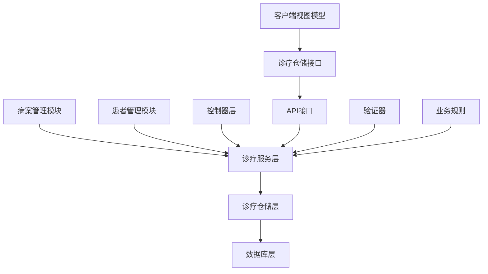
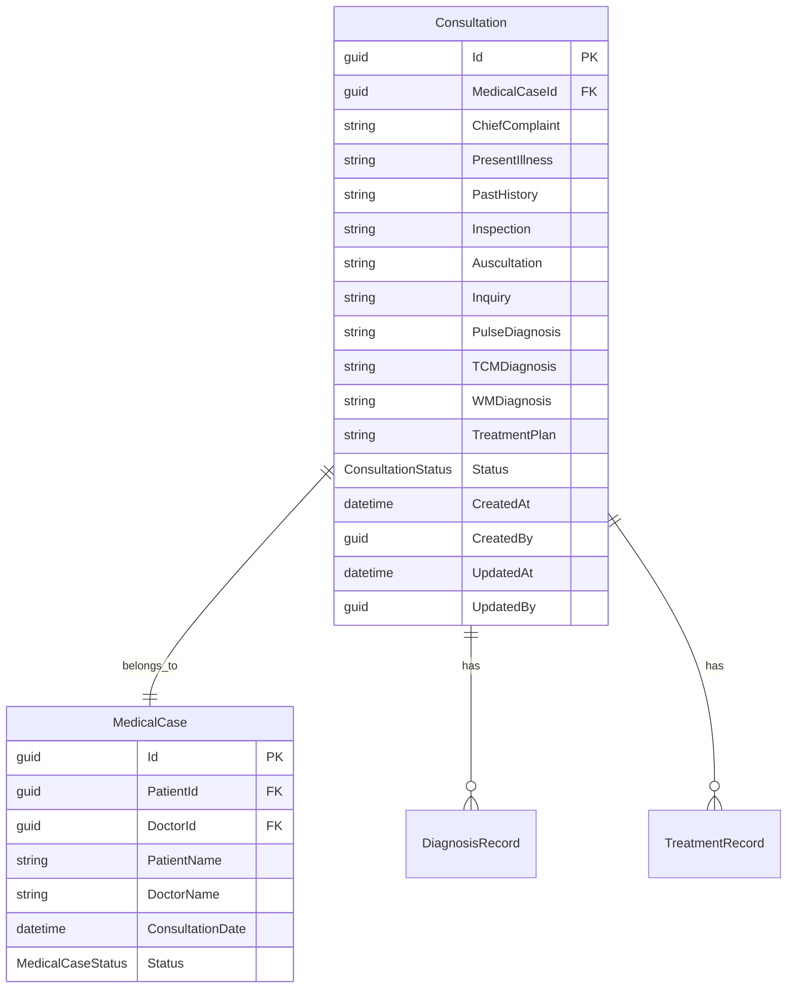
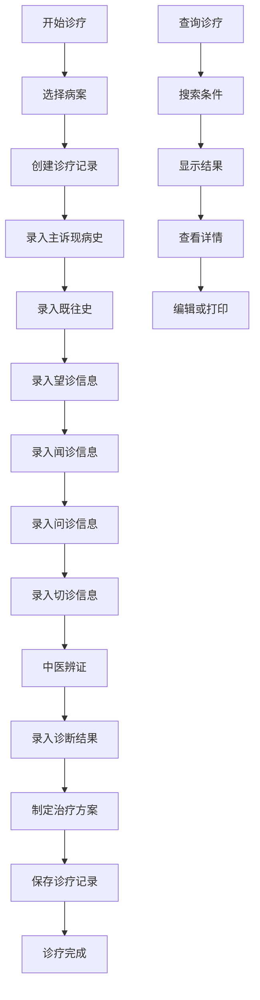

# 诊疗管理模块文档

> **版本**: 1.0
> **创建日期**: 2025-10-15
> **最后更新**: 2025-10-15
> **维护者**: 项目团队
> **相关模块**: [病案管理模块](../medicalcase/README.md) | [患者管理模块](../patients/README.md) | [处方管理模块](../prescriptions/README.md)

## 📋 文档概述

本文档为诊疗管理模块提供全面的技术文档和使用指南，包括模块功能、架构设计、使用方法、集成指南和维护说明。诊疗管理模块是 LYBT 系统的核心业务模块之一，负责管理患者的诊疗记录，支持中医四诊信息录入和管理。

## 🎯 模块简介

### 模块用途
诊疗管理模块负责管理患者的详细诊疗记录，包括中医四诊信息（望、闻、问、切）、诊断结果、治疗方案等核心医疗信息。模块采用聚合根模式，与病案管理模块紧密集成，确保诊疗信息的完整性和一致性。

### 核心功能
- **诊疗记录创建**: 创建和管理患者的详细诊疗记录
- **四诊信息管理**: 支持中医望、闻、问、切四诊信息录入
- **诊断结果管理**: 中医诊断和西医诊断信息管理
- **治疗方案记录**: 治疗方案和用药建议记录
- **诊疗统计**: 多维度诊疗数据统计和分析
- **历史记录查询**: 患者历史诊疗记录查询

### 业务价值
- 标准化诊疗流程，提高医疗服务质量
- 完整的诊疗记录，支持临床决策
- 中医特色功能，传承中医诊疗特色
- 数据统计分析，支持医疗质量改进

## 🏗️ 架构设计

### 模块架构


### 核心组件

#### ConsultationService（诊疗服务）
- **用途**: 核心业务逻辑处理，诊疗记录CRUD操作
- **职责**: 诊疗记录管理、四诊信息处理、诊断结果管理
- **接口**: IConsultationService
- **依赖**: IConsultationRepository, IMedicalCaseRepository, IMapper, ILogger

#### ConsultationRepository（诊疗仓储）
- **用途**: 数据访问抽象，实现诊疗记录持久化操作
- **职责**: 数据库操作、查询优化、关联数据加载
- **接口**: IConsultationRepository
- **依赖**: DbContext, BaseRepository

#### ConsultationValidator（诊疗验证器）
- **用途**: 诊疗记录数据验证
- **职责**: 输入数据验证、业务规则检查
- **接口**: AbstractValidator
- **依赖**: FluentValidation

### 数据流
1. **诊疗创建流程**: 病案创建 → 自动创建诊疗记录 → 录入四诊信息 → 保存诊疗记录
2. **诊疗查询流程**: 查询请求 → 权限检查 → 数据检索 → 关联数据加载 → 返回DTO
3. **诊疗更新流程**: 更新请求 → 数据验证 → 业务规则检查 → 数据更新 → 审计记录

## 🔧 技术实现

### Server 端实现

#### 实体模型
```csharp
/// <summary>
/// 诊疗记录实体 - 支持中医四诊信息管理
/// 与病案实体一对一关系，共享主键
/// </summary>
[Table("Consultations")]
public class Consultation : BaseEntity
{
    [Required]
    public Guid MedicalCaseId { get; set; }
    
    [StringLength(1000)]
    [DisplayName("主诉")]
    public string? ChiefComplaint { get; set; }
    
    [StringLength(2000)]
    [DisplayName("现病史")]
    public string? PresentIllness { get; set; }
    
    [StringLength(1000)]
    [DisplayName("既往史")]
    public string? PastHistory { get; set; }
    
    // 望诊信息
    [StringLength(1000)]
    [DisplayName("望诊")]
    public string? Inspection { get; set; }
    
    // 闻诊信息
    [StringLength(1000)]
    [DisplayName("闻诊")]
    public string? Auscultation { get; set; }
    
    // 问诊信息
    [StringLength(2000)]
    [DisplayName("问诊")]
    public string? Inquiry { get; set; }
    
    // 切诊信息
    [StringLength(1000)]
    [DisplayName("切诊")]
    public string? PulseDiagnosis { get; set; }
    
    [StringLength(1000)]
    [DisplayName("中医诊断")]
    public string? TCMDiagnosis { get; set; }
    
    [StringLength(1000)]
    [DisplayName("西医诊断")]
    public string? WMDiagnosis { get; set; }
    
    [StringLength(2000)]
    [DisplayName("治疗方案")]
    public string? TreatmentPlan { get; set; }
    
    [DisplayName("诊疗状态")]
    public ConsultationStatus Status { get; set; } = ConsultationStatus.InProgress;
    
    // 导航属性
    public virtual MedicalCase? MedicalCase { get; set; }
}
```

#### 服务接口
```csharp
public interface IConsultationService
{
    Task<ServiceResult<PagedResult<ConsultationDto>>> GetPagedAsync(int page = 1, int pageSize = 20, string? keyword = null);
    Task<ServiceResult<ConsultationDto>> GetByIdAsync(Guid id);
    Task<ServiceResult<ConsultationDto>> CreateAsync(ConsultationCreateDto dto);
    Task<ServiceResult<ConsultationDto>> UpdateAsync(Guid id, ConsultationUpdateDto dto);
    Task<ServiceResult> DeleteAsync(Guid id);
    Task<ServiceResult<List<ConsultationDto>>> GetByMedicalCaseIdAsync(Guid medicalCaseId);
    Task<ServiceResult<ConsultationDto>> StartAsync(Guid patientId);
    Task<ServiceResult<List<ConsultationDto>>> SearchAsync(string keyword);
    Task<ServiceResult<ConsultationStatisticsDto>> GetStatisticsAsync(DateTime? startDate = null, DateTime? endDate = null);
}
```

#### 控制器
```csharp
[ApiController]
[Route("api/[controller]")]
public class ConsultationController : BaseApiController
{
    private readonly IConsultationService _consultationService;
    
    [HttpGet]
    public async Task<ActionResult<ApiResult<PagedResult<ConsultationDto>>>> GetPaged([FromQuery] ConsultationQueryDto query)
    {
        var result = await _consultationService.GetPagedAsync(query.PageNumber, query.PageSize, query.Keyword);
        return Ok(ApiResult<PagedResult<ConsultationDto>>.Success(result.Data));
    }
    
    [HttpGet("{id}")]
    public async Task<ActionResult<ApiResult<ConsultationDto>>> GetById(Guid id)
    {
        var result = await _consultationService.GetByIdAsync(id);
        return result.IsSuccess ? Ok(ApiResult<ConsultationDto>.Success(result.Data)) : BadRequest(ApiResult<ConsultationDto>.Failure(result.Message));
    }
    
    [HttpPost]
    public async Task<ActionResult<ApiResult<ConsultationDto>>> Create([FromBody] ConsultationCreateDto dto)
    {
        var result = await _consultationService.CreateAsync(dto);
        return result.IsSuccess ? Ok(ApiResult<ConsultationDto>.Success(result.Data)) : BadRequest(ApiResult<ConsultationDto>.Failure(result.Message));
    }
    
    [HttpGet("medical-case/{medicalCaseId}")]
    public async Task<ActionResult<ApiResult<List<ConsultationDto>>>> GetByMedicalCaseId(Guid medicalCaseId)
    {
        var result = await _consultationService.GetByMedicalCaseIdAsync(medicalCaseId);
        return Ok(ApiResult<List<ConsultationDto>>.Success(result.Data));
    }
    
    [HttpGet("statistics")]
    public async Task<ActionResult<ApiResult<ConsultationStatisticsDto>>> GetStatistics([FromQuery] DateTime? startDate, [FromQuery] DateTime? endDate)
    {
        var result = await _consultationService.GetStatisticsAsync(startDate, endDate);
        return Ok(ApiResult<ConsultationStatisticsDto>.Success(result.Data));
    }
}
```

### Client 端实现

#### ViewModel
```csharp
/// <summary>
/// 诊疗管理视图模型
/// </summary>
public class ConsultationManagementViewModel : UnifiedViewModelBase
{
    private readonly IConsultationRepository _consultationRepository;
    
    #region 属性
    private ObservableCollection<ConsultationDto> _consultations;
    public ObservableCollection<ConsultationDto> Consultations
    {
        get => _consultations;
        set => SetProperty(ref _consultations, value);
    }
    
    private ConsultationDto? _selectedConsultation;
    public ConsultationDto? SelectedConsultation
    {
        get => _selectedConsultation;
        set => SetProperty(ref _selectedConsultation, value);
    }
    
    private string _searchKeyword = string.Empty;
    public string SearchKeyword
    {
        get => _searchKeyword;
        set => SetProperty(ref _searchKeyword, value);
    }
    #endregion
    
    #region 命令
    public DelegateCommand LoadConsultationsCommand { get; }
    public DelegateCommand SearchCommand { get; }
    public DelegateCommand CreateCommand { get; }
    public DelegateCommand EditCommand { get; }
    public DelegateCommand DeleteCommand { get; }
    public DelegateCommand RefreshCommand { get; }
    #endregion
    
    // 核心方法
    private async Task LoadConsultationsAsync()
    {
        try
        {
            SetIsBusy(true, "正在加载诊疗记录...");
            
            var result = await _consultationService.GetPagedAsync(1, 50);
            if (result.IsSuccess)
            {
                Consultations = new ObservableCollection<ConsultationDto>(result.Data.Items);
            }
            else
            {
                ShowErrorMessage(result.Message);
            }
        }
        catch (Exception ex)
        {
            Logger.LogError(ex, "加载诊疗记录失败");
            ShowErrorMessage("加载诊疗记录失败");
        }
        finally
        {
            SetIsBusy(false);
        }
    }
    
    private async Task SearchConsultationsAsync()
    {
        try
        {
            SetIsBusy(true, "正在搜索...");
            
            var result = await _consultationService.SearchAsync(SearchKeyword);
            if (result.IsSuccess)
            {
                Consultations = new ObservableCollection<ConsultationDto>(result.Data);
            }
            else
            {
                ShowErrorMessage(result.Message);
            }
        }
        catch (Exception ex)
        {
            Logger.LogError(ex, "搜索诊疗记录失败");
            ShowErrorMessage("搜索失败");
        }
        finally
        {
            SetIsBusy(false);
        }
    }
}
```

#### Repository
```csharp
/// <summary>
/// 诊疗仓储 - 客户端数据访问层
/// </summary>
public class ConsultationRepository : RepositoryBase<ConsultationDto, ConsultationCreateDto, ConsultationUpdateDto, IConsultationApi>, IConsultationRepository
{
    public ConsultationRepository(IConsultationApi api, IMapper mapper, ILogger<ConsultationRepository> logger)
        : base(api, mapper, logger)
    {
    }
    
    public async Task<ServiceResult<List<ConsultationDto>>> GetByMedicalCaseIdAsync(Guid medicalCaseId)
    {
        try
        {
            var result = await Api.GetByMedicalCaseIdAsync(medicalCaseId);
            return ServiceResult<List<ConsultationDto>>.Success(result);
        }
        catch (Exception ex)
        {
            _logger.LogError(ex, "根据病案ID获取诊疗记录失败");
            return ServiceResult<List<ConsultationDto>>.Failure("获取诊疗记录失败");
        }
    }
    
    public async Task<ServiceResult<ConsultationStatisticsDto>> GetStatisticsAsync(DateTime? startDate = null, DateTime? endDate = null)
    {
        try
        {
            var result = await Api.GetStatisticsAsync(startDate, endDate);
            return ServiceResult<ConsultationStatisticsDto>.Success(result);
        }
        catch (Exception ex)
        {
            _logger.LogError(ex, "获取诊疗统计失败");
            return ServiceResult<ConsultationStatisticsDto>.Failure("获取统计失败");
        }
    }
}
```

## 📊 数据模型

### 核心实体关系


### 数据传输对象 (DTOs)

#### ConsultationDto
```csharp
/// <summary>
/// 诊疗记录DTO
/// </summary>
public class ConsultationDto : StatusDto, IRemarkable
{
    [DisplayName("病案ID")]
    public Guid MedicalCaseId { get; set; }

    [DisplayName("患者ID")]
    public Guid PatientId { get; set; }

    [DisplayName("患者姓名")]
    public string PatientName { get; set; } = string.Empty;

    [DisplayName("医生ID")]
    public Guid DoctorId { get; set; }

    [DisplayName("医生姓名")]
    public string DoctorName { get; set; } = string.Empty;

    [DisplayName("主诉")]
    [StringLength(1000, ErrorMessage = "主诉长度不能超过1000个字符")]
    public string? ChiefComplaint { get; set; }

    [DisplayName("现病史")]
    [StringLength(2000, ErrorMessage = "现病史长度不能超过2000个字符")]
    public string? PresentIllness { get; set; }

    [DisplayName("既往史")]
    [StringLength(1000, ErrorMessage = "既往史长度不能超过1000个字符")]
    public string? PastHistory { get; set; }

    [DisplayName("望诊")]
    [StringLength(1000, ErrorMessage = "望诊长度不能超过1000个字符")]
    public string? Inspection { get; set; }

    [DisplayName("闻诊")]
    [StringLength(1000, ErrorMessage = "闻诊长度不能超过1000个字符")]
    public string? Auscultation { get; set; }

    [DisplayName("问诊")]
    [StringLength(2000, ErrorMessage = "问诊长度不能超过2000个字符")]
    public string? Inquiry { get; set; }

    [DisplayName("切诊")]
    [StringLength(1000, ErrorMessage = "切诊长度不能超过1000个字符")]
    public string? PulseDiagnosis { get; set; }

    [DisplayName("中医诊断")]
    [StringLength(1000, ErrorMessage = "中医诊断长度不能超过1000个字符")]
    public string? TCMDiagnosis { get; set; }

    [DisplayName("西医诊断")]
    [StringLength(1000, ErrorMessage = "西医诊断长度不能超过1000个字符")]
    public string? WMDiagnosis { get; set; }

    [DisplayName("治疗方案")]
    [StringLength(2000, ErrorMessage = "治疗方案长度不能超过2000个字符")]
    public string? TreatmentPlan { get; set; }

    [DisplayName("诊疗状态")]
    public ConsultationStatus Status { get; set; } = ConsultationStatus.InProgress;

    [DisplayName("备注")]
    [StringLength(500, ErrorMessage = "备注长度不能超过500个字符")]
    public string? Remark { get; set; }
}
```

#### ConsultationCreateDto
```csharp
/// <summary>
/// 创建诊疗记录DTO
/// </summary>
public class ConsultationCreateDto
{
    [Required(ErrorMessage = "病案ID不能为空")]
    [DisplayName("病案ID")]
    public Guid MedicalCaseId { get; set; }

    [DisplayName("主诉")]
    [StringLength(1000, ErrorMessage = "主诉长度不能超过1000个字符")]
    public string? ChiefComplaint { get; set; }

    [DisplayName("现病史")]
    [StringLength(2000, ErrorMessage = "现病史长度不能超过2000个字符")]
    public string? PresentIllness { get; set; }

    [DisplayName("既往史")]
    [StringLength(1000, ErrorMessage = "既往史长度不能超过1000个字符")]
    public string? PastHistory { get; set; }

    [DisplayName("望诊")]
    [StringLength(1000, ErrorMessage = "望诊长度不能超过1000个字符")]
    public string? Inspection { get; set; }

    [DisplayName("闻诊")]
    [StringLength(1000, ErrorMessage = "闻诊长度不能超过1000个字符")]
    public string? Auscultation { get; set; }

    [DisplayName("问诊")]
    [StringLength(2000, ErrorMessage = "问诊长度不能超过2000个字符")]
    public string? Inquiry { get; set; }

    [DisplayName("切诊")]
    [StringLength(1000, ErrorMessage = "切诊长度不能超过1000个字符")]
    public string? PulseDiagnosis { get; set; }

    [DisplayName("中医诊断")]
    [StringLength(1000, ErrorMessage = "中医诊断长度不能超过1000个字符")]
    public string? TCMDiagnosis { get; set; }

    [DisplayName("西医诊断")]
    [StringLength(1000, ErrorMessage = "西医诊断长度不能超过1000个字符")]
    public string? WMDiagnosis { get; set; }

    [DisplayName("治疗方案")]
    [StringLength(2000, ErrorMessage = "治疗方案长度不能超过2000个字符")]
    public string? TreatmentPlan { get; set; }

    [DisplayName("诊疗状态")]
    public ConsultationStatus Status { get; set; } = ConsultationStatus.InProgress;
}
```

#### ConsultationUpdateDto
```csharp
/// <summary>
/// 更新诊疗记录DTO
/// </summary>
public class ConsultationUpdateDto : IIdentifiable<Guid>, IRemarkable
{
    [Required(ErrorMessage = "诊疗记录ID不能为空")]
    [DisplayName("诊疗记录ID")]
    public Guid Id { get; set; }

    [DisplayName("主诉")]
    [StringLength(1000, ErrorMessage = "主诉长度不能超过1000个字符")]
    public string? ChiefComplaint { get; set; }

    [DisplayName("现病史")]
    [StringLength(2000, ErrorMessage = "现病史长度不能超过2000个字符")]
    public string? PresentIllness { get; set; }

    [DisplayName("既往史")]
    [StringLength(1000, ErrorMessage = "既往史长度不能超过1000个字符")]
    public string? PastHistory { get; set; }

    [DisplayName("望诊")]
    [StringLength(1000, ErrorMessage = "望诊长度不能超过1000个字符")]
    public string? Inspection { get; set; }

    [DisplayName("闻诊")]
    [StringLength(1000, ErrorMessage = "闻诊长度不能超过1000个字符")]
    public string? Auscultation { get; set; }

    [DisplayName("问诊")]
    [StringLength(2000, ErrorMessage = "问诊长度不能超过2000个字符")]
    public string? Inquiry { get; set; }

    [DisplayName("切诊")]
    [StringLength(1000, ErrorMessage = "切诊长度不能超过1000个字符")]
    public string? PulseDiagnosis { get; set; }

    [DisplayName("中医诊断")]
    [StringLength(1000, ErrorMessage = "中医诊断长度不能超过1000个字符")]
    public string? TCMDiagnosis { get; set; }

    [DisplayName("西医诊断")]
    [StringLength(1000, ErrorMessage = "西医诊断长度不能超过1000个字符")]
    public string? WMDiagnosis { get; set; }

    [DisplayName("治疗方案")]
    [StringLength(2000, ErrorMessage = "治疗方案长度不能超过2000个字符")]
    public string? TreatmentPlan { get; set; }

    [DisplayName("诊疗状态")]
    public ConsultationStatus Status { get; set; }

    [DisplayName("备注")]
    [StringLength(500, ErrorMessage = "备注长度不能超过500个字符")]
    public string? Remark { get; set; }
}
```

## 🔌 API 接口

### REST API 端点

#### 获取诊疗记录列表
```
GET /api/consultation
参数:
  - pageNumber: 页码 (从1开始)
  - pageSize: 每页数量 (默认20)
  - searchKeyword: 搜索关键词 (可选)
响应:
  - data: 诊疗记录列表
  - totalCount: 总记录数
  - pageNumber: 当前页码
  - pageSize: 每页数量
```

#### 获取诊疗记录详情
```
GET /api/consultation/{id}
参数: id (Guid)
响应: 诊疗记录详细信息
```

#### 创建诊疗记录
```
POST /api/consultation
请求体: 
{
  "medicalCaseId": "guid",
  "chiefComplaint": "主诉内容",
  "presentIllness": "现病史",
  "pastHistory": "既往史",
  "inspection": "望诊信息",
  "auscultation": "闻诊信息",
  "inquiry": "问诊信息",
  "pulseDiagnosis": "切诊信息",
  "tcmDiagnosis": "中医诊断",
  "wmDiagnosis": "西医诊断",
  "treatmentPlan": "治疗方案",
  "status": "InProgress"
}
响应: 创建成功的诊疗记录信息
```

#### 根据病案ID获取诊疗记录
```
GET /api/consultation/medical-case/{medicalCaseId}
参数: medicalCaseId (Guid)
响应: 对应病案的诊疗记录列表
```

#### 搜索诊疗记录
```
POST /api/consultation/search
请求体:
{
  "keyword": "搜索关键词"
}
响应: 匹配的诊疗记录列表
```

#### 获取诊疗统计数据
```
GET /api/consultation/statistics
参数:
  - startDate: 开始日期 (可选)
  - endDate: 结束日期 (可选)
响应: 诊疗统计信息
```

### API 请求/响应示例

#### 创建诊疗记录请求示例
```json
{
  "medicalCaseId": "a1b2c3d4-e5f6-7890-abcd-ef1234567890",
  "chiefComplaint": "发热、咳嗽3天",
  "presentIllness": "患者3天前无明显诱因出现发热，体温最高38.5℃，伴有咳嗽、咳痰",
  "pastHistory": "既往体健，无特殊病史",
  "inspection": "面色略红，咽部充血，扁桃体II度肿大",
  "auscultation": "双肺呼吸音粗，可闻及少量湿性啰音",
  "inquiry": "食欲不振，睡眠尚可，二便正常",
  "pulseDiagnosis": "脉浮数，舌质红，苔薄黄",
  "tcmDiagnosis": "风热犯肺证",
  "wmDiagnosis": "急性上呼吸道感染",
  "treatmentPlan": "清热宣肺，化痰止咳。处方：银翘散加减",
  "status": "InProgress"
}
```

#### 响应示例
```json
{
  "success": true,
  "data": {
    "id": "b2c3d4e5-f6a7-8901-bcde-f23456789012",
    "medicalCaseId": "a1b2c3d4-e5f6-7890-abcd-ef1234567890",
    "patientId": "c3d4e5f6-a7b8-9012-cdef-345678901234",
    "patientName": "张三",
    "doctorId": "d4e5f6a7-b8c9-0123-def0-456789012345",
    "doctorName": "李医生",
    "chiefComplaint": "发热、咳嗽3天",
    "presentIllness": "患者3天前无明显诱因出现发热，体温最高38.5℃，伴有咳嗽、咳痰",
    "pastHistory": "既往体健，无特殊病史",
    "inspection": "面色略红，咽部充血，扁桃体II度肿大",
    "auscultation": "双肺呼吸音粗，可闻及少量湿性啰音",
    "inquiry": "食欲不振，睡眠尚可，二便正常",
    "pulseDiagnosis": "脉浮数，舌质红，苔薄黄",
    "tcmDiagnosis": "风热犯肺证",
    "wmDiagnosis": "急性上呼吸道感染",
    "treatmentPlan": "清热宣肺，化痰止咳。处方：银翘散加减",
    "status": "InProgress",
    "createdAt": "2025-10-15T10:30:00Z",
    "updatedAt": "2025-10-15T10:30:00Z"
  },
  "message": "创建诊疗记录成功"
}
```

## 👥 用户界面

### 主界面功能
诊疗管理模块提供完整的诊疗记录管理界面，包括：
- **诊疗列表**: 分页显示诊疗记录，支持搜索和筛选
- **诊疗详情**: 显示完整的四诊信息和诊断结果
- **诊疗录入**: 结构化的四诊信息录入界面
- **诊疗编辑**: 编辑诊疗记录信息
- **统计分析**: 诊疗数据统计图表

### 关键用户流程

#### 诊疗录入流程
1. **选择病案**: 从病案列表中选择要录入诊疗的病案
2. **基础信息**: 录入主诉、现病史、既往史
3. **四诊信息**: 分别录入望、闻、问、切四诊信息
4. **诊断结果**: 录入中医诊断和西医诊断
5. **治疗方案**: 录入治疗方案和用药建议
6. **保存记录**: 保存完整的诊疗记录

#### 诊疗查询流程
1. **进入列表**: 显示诊疗记录列表
2. **条件筛选**: 按医生、患者、时间等条件筛选
3. **关键词搜索**: 在诊断、症状中搜索关键词
4. **查看详情**: 查看完整的四诊信息和诊断
5. **关联操作**: 查看相关的病案和处方信息

#### 四诊信息录入流程
1. **望诊**: 录入面色、舌苔、精神状态等望诊信息
2. **闻诊**: 录入声音、气味等闻诊信息
3. **问诊**: 录入症状、病史、生活习惯等问诊信息
4. **切诊**: 录入脉象、触诊等切诊信息
5. **综合分析**: 基于四诊信息进行综合分析

## 🔄 业务流程

### 核心业务流程


### 业务规则
- **创建规则**: 诊疗记录必须关联到有效的病案
- **一对一规则**: 每个病案只能有一个诊疗记录
- **完整性规则**: 诊疗记录必须包含基本的诊断信息
- **权限规则**: 只有主治医生可以编辑诊疗记录
- **审核规则**: 重要诊断变更需要审核确认

## 🔗 集成指南

### 与其他模块的集成

#### 病案管理模块集成
- **集成方式**: 聚合根内部管理
- **接口定义**: 病案创建时自动创建诊疗记录
- **数据格式**: 共享主键，1:1关系
- **错误处理**: 病案不存在时拒绝创建诊疗记录

#### 患者管理模块集成
- **集成方式**: API调用获取患者信息
- **接口定义**: 患者基本信息查询、历史诊疗记录
- **数据格式**: 患者DTO，包含基本医疗信息
- **错误处理**: 患者信息不完整时的提醒

#### 处方管理模块集成
- **集成方式**: 数据关联，诊疗记录指导处方
- **接口定义**: 诊疗信息查询、治疗方案关联
- **数据格式**: 诊疗DTO，包含诊断和治疗建议
- **错误处理**: 诊断信息不完整时限制处方创建

#### 用户管理模块集成
- **集成方式**: 服务调用获取医生信息
- **接口定义**: 医生权限验证、专业信息查询
- **数据格式**: 用户DTO，包含专业资质信息
- **错误处理**: 医生权限不足时的拒绝访问

### 外部系统集成
- **电子病历系统**: HL7标准接口，诊疗信息交换
- **检验系统**: LIS接口，检验结果关联
- **影像系统**: PACS接口，影像资料关联
- **医保系统**: 诊疗项目和费用编码对接

## ⚙️ 配置说明

### 系统配置
```json
{
  "Consultation": {
    "MaxConsultationLength": 10000,
    "RequireCompleteTCMDiagnosis": true,
    "EnableAutoSave": true,
    "AutoSaveIntervalMinutes": 5,
    "EnableStatistics": true,
    "CacheEnabled": true,
    "CacheExpirationMinutes": 15
  }
}
```

### 环境变量
- `CONSULTATION_MAX_LENGTH`: 诊疗记录最大长度
- `CONSULTATION_ENABLE_AUTO_SAVE`: 是否启用自动保存
- `CONSULTATION_CACHE_ENABLED`: 是否启用缓存
- `CONSULTATION_REQUIRE_TCM_DIAGNOSIS`: 是否要求完整中医诊断

### 依赖注入配置
```csharp
// Server 端 DI 配置
services.AddScoped<IConsultationService, ConsultationService>();
services.AddScoped<IConsultationRepository, ConsultationRepository>();
services.AddValidatorsFromAssemblyContaining<ConsultationCreateDtoValidator>();

// AutoMapper 配置
services.AddAutoMapper(typeof(ConsultationMappingProfile));

// Client 端 DI 配置
services.AddScoped<IConsultationRepository, ConsultationRepository>();
services.AddScoped<ConsultationManagementViewModel>();
services.AddScoped<ConsultationDetailViewModel>();
```

## 🧪 测试指南

### 单元测试
```csharp
[Test]
public async Task ConsultationService_Create_ShouldReturnCorrectData()
{
    // Arrange
    var createDto = new ConsultationCreateDto
    {
        MedicalCaseId = _testMedicalCaseId,
        ChiefComplaint = "测试主诉",
        TCMDiagnosis = "测试诊断"
    };
    
    // Act
    var result = await _service.CreateAsync(createDto);
    
    // Assert
    Assert.IsTrue(result.IsSuccess);
    Assert.IsNotNull(result.Data);
    Assert.AreEqual(createDto.ChiefComplaint, result.Data.ChiefComplaint);
}

[Test]
public async Task ConsultationService_GetByMedicalCaseId_ShouldReturnCorrectConsultation()
{
    // Arrange
    var medicalCaseId = _testMedicalCaseId;
    
    // Act
    var result = await _service.GetByMedicalCaseIdAsync(medicalCaseId);
    
    // Assert
    Assert.IsTrue(result.IsSuccess);
    Assert.IsTrue(result.Data.Count > 0);
    Assert.AreEqual(medicalCaseId, result.Data[0].MedicalCaseId);
}
```

### 集成测试
```csharp
[Test]
public async Task ConsultationController_Create_ShouldReturn201()
{
    // Arrange
    var request = new ConsultationCreateDto
    {
        MedicalCaseId = _testMedicalCaseId,
        ChiefComplaint = "测试主诉",
        TCMDiagnosis = "测试诊断"
    };
    
    // Act
    var response = await _controller.Create(request);
    
    // Assert
    var createdResult = response as CreatedAtActionResult;
    Assert.IsNotNull(createdResult);
    Assert.AreEqual(201, createdResult.StatusCode);
}
```

### 测试覆盖率要求
- **服务层逻辑**: ≥ 90%
- **数据访问层**: ≥ 85%
- **控制器层**: ≥ 80%
- **验证器**: ≥ 95%
- **客户端ViewModel**: ≥ 75%

## 🚀 部署指南

### 部署要求
- **服务器要求**: 
  - CPU: 4核心以上
  - 内存: 8GB以上
  - 存储: 100GB以上可用空间
- **数据库要求**: 
  - SQL Server 2019+
  - 支持事务和关联查询
  - 配置适当的连接池
- **网络要求**: 
  - 内网带宽100Mbps以上
  - 支持HTTPS
  - API端口访问配置

### 部署步骤
1. **数据库迁移**: 运行Consultation相关的数据库迁移脚本
2. **配置更新**: 更新appsettings.json中的Consultation配置
3. **服务注册**: 在DI容器中注册Consultation相关服务
4. **权限配置**: 配置诊疗管理相关的用户权限
5. **验证测试**: 验证所有API接口和业务流程

### 配置验证
- **数据库连接**: 验证Consultation表和关联表创建成功
- **API接口**: 验证所有Consultation API端点正常响应
- **权限检查**: 验证医生权限控制正确
- **业务规则**: 验证诊疗创建和关联规则正确

## 🔍 故障排除

### 常见问题

#### 诊疗记录创建失败
- **症状**: 创建诊疗记录时返回错误
- **原因**: 病案不存在或已有诊疗记录
- **解决方案**: 
  1. 检查病案是否存在且有效
  2. 检查是否已有关联的诊疗记录
  3. 验证用户权限
- **预防措施**: 在创建前验证病案状态

#### 诊疗信息保存失败
- **症状**: 保存诊疗信息时出现异常
- **原因**: 数据验证失败或数据库连接问题
- **解决方案**: 
  1. 检查输入数据的格式和长度
  2. 验证必填字段是否完整
  3. 检查数据库连接状态
- **预防措施**: 前端数据验证和错误提示

#### 统计数据不准确
- **症状**: 统计查询结果与实际数据不符
- **原因**: 数据过滤条件错误或时间范围问题
- **解决方案**: 
  1. 检查查询条件和时间范围
  2. 验证数据库中的数据状态
  3. 检查统计逻辑算法
- **预防措施**: 定期数据校验和测试

#### 四诊信息显示异常
- **症状**: 四诊信息显示不完整或格式错误
- **原因**: 数据编码问题或前端显示逻辑错误
- **解决方案**: 
  1. 检查数据库字符集配置
  2. 验证前端数据绑定逻辑
  3. 检查数据传输格式
- **预防措施**: 统一字符编码和格式标准

### 调试工具
- **日志查看**: 
  - 位置: `logs/consultation*.log`
  - 级别: Debug, Information, Warning, Error
  - 格式: JSON格式，包含详细诊疗信息
- **性能监控**: 
  - API响应时间监控
  - 数据库查询性能分析
  - 内存使用情况监控
- **健康检查**: 
  - 端点: `/health/consultation`
  - 检查项目: 数据库连接、缓存状态、服务可用性

## 📈 性能优化

### 性能指标
- **响应时间**: 
  - 诊疗查询: < 300ms
  - 诊疗创建: < 500ms
  - 统计查询: < 1s
- **并发处理**: 
  - 支持50+并发用户
  - 数据库连接池: 10-30个连接
- **内存使用**: 
  - 单个诊疗记录: < 10KB
  - 查询结果缓存: < 50MB

### 优化策略
- **缓存策略**: 
  - Redis缓存热点诊疗数据
  - 本地缓存基础医疗数据
  - 缓存过期时间: 15分钟
- **数据库优化**: 
  - 病案ID索引优化
  - 诊断关键词索引
  - 分页查询优化
- **异步处理**: 
  - 诊疗统计异步计算
  - 大批量数据导出异步处理
  - 后台任务处理历史数据

## 🔒 安全考虑

### 安全措施
- **身份验证**: 
  - JWT Token验证
  - 医生资质认证
  - 会话管理和超时
- **授权控制**: 
  - 基于角色的访问控制
  - 诊疗记录访问权限
  - 敏感信息脱敏
- **数据保护**: 
  - 诊疗数据加密存储
  - 传输层TLS加密
  - 患者隐私保护
- **审计日志**: 
  - 完整的诊疗操作记录
  - 数据访问日志
  - 异常行为监控

### 安全最佳实践
- **隐私保护**: 严格保护患者隐私信息
- **数据完整性**: 确保诊疗记录的完整性和准确性
- **访问控制**: 实现细粒度的权限控制
- **合规要求**: 符合医疗数据管理法规要求
- **定期审计**: 定期审查访问日志和权限配置

## 📚 参考资料

### 相关文档
- [模块文档模板](../template/module-document-template.md)
- [模块文档编写指南](../template/module-document-writing-guide.md)
- [模块文档质量检查清单](../template/module-document-quality-checklist.md)
- [病案管理模块](../medicalcase/README.md)
- [患者管理模块](../patients/README.md)
- [处方管理模块](../prescriptions/README.md)

### 技术文档
- [Server端三层架构标准](../../../architecture/server-module-design-standard.md)
- [Client端MVVM设计标准](../../../architecture/client/unified-design-standard.md)
- [依赖注入配置指南](../../../development/repository-dependency-injection-guide.md)
- [测试架构标准](../../../development/test-architecture-standard.md)

### API文档
- [Consultation API Reference](../../../api/consultation-api.md)
- [MedicalCase API Reference](../../../api/medicalcase-api.md)
- [Patient API Reference](../../../api/patient-api.md)

## 🔄 版本历史

| 版本 | 日期 | 更新内容 | 作者 |
|------|------|----------|------|
| 1.0 | 2025-10-15 | 初始版本，包含完整的诊疗管理模块文档 | Claude Code |

## 📞 联系方式

- **维护者**: 项目开发团队
- **技术支持**: 诊疗管理模块开发组
- **文档反馈**: GitHub Issues 或内部文档反馈系统

---

*本文档遵循 LYBT 项目文档标准编写，如有疑问请参考相关模板或联系维护者。*