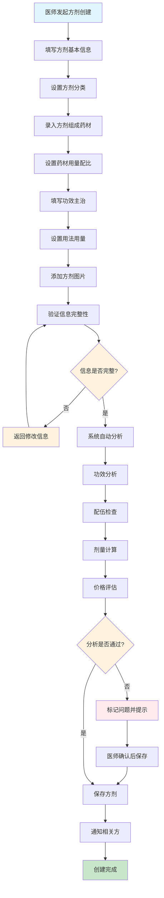
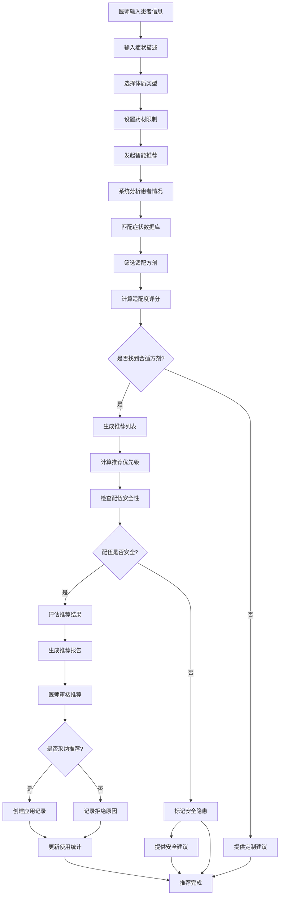
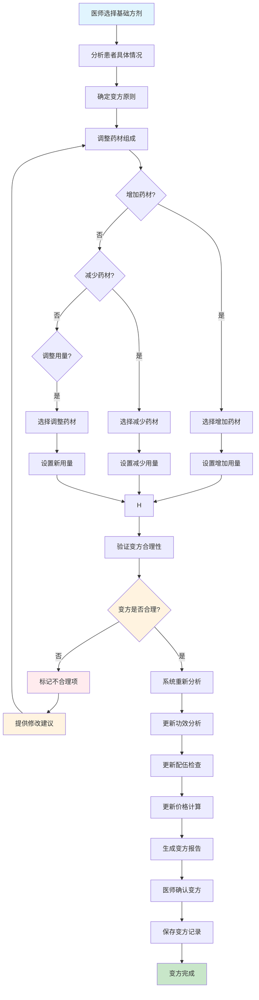

# 方剂管理模块文档

> **版本**: 1.0  
> **创建日期**: 2025-10-15  
> **模块负责人**: 中医专家  
> **架构标准**: [Server模块设计标准](../../architecture/server-module-design-standard.md), [Client端统一设计标准](../../architecture/client/unified-design-standard.md)  
> **Project Standardization 3.0**: Task 4.3.3

---

## 1. 模块概述

### 1.1 功能简介

方剂管理模块是LYBT中医诊所系统的核心业务模块之一，负责管理中医经典方剂、个人经验方剂和配方模板的完整生命周期。该模块集成了方剂配伍原理、药材用量计算、功效分析、价格评估等中医专业功能，为医师开具处方提供智能化的方剂支持和参考依据。

### 1.2 业务价值

- **方剂知识库**: 建立标准化的中医方剂知识库和经验积累
- **智能推荐**: 基于症状和体质智能推荐合适方剂
- **配伍安全**: 自动检查方剂配伍禁忌和药物相互作用
- **成本控制**: 方剂价格分析和成本优化建议
- **临床支持**: 为临床决策提供方剂参考和配伍建议

### 1.3 核心功能

#### 1.3.1 方剂基础信息管理
- **方剂档案**: 维护方剂的基本信息、功效、主治等
- **分类管理**: 按功效、主治、朝代等多维度分类管理
- **组成管理**: 方剂药材组成和用量配比管理
- **用法用量**: 详细的煎服方法和用法用量说明
- **方剂图片**: 方剂图片的上传、存储和展示

#### 1.3.2 方剂分析功能
- **功效分析**: 方剂整体功效和药材功效的协同分析
- **配伍分析**: 药材配伍关系和协同作用分析
- **剂量计算**: 自动计算方剂总剂量和各药材用量
- **价格计算**: 方剂成本分析和价格评估
- **药性分析**: 方剂整体药性和寒热温凉分析

#### 1.3.3 方剂应用管理
- **临床应用**: 方剂的临床应用记录和效果评估
- **变方应用**: 基础方剂的加减变方管理
- **模板管理**: 常用方剂模板和个性化模板
- **处方关联**: 方剂与具体处方的关联关系
- **疗效统计**: 方剂使用效果的统计分析

#### 1.3.4 智能推荐系统
- **症状匹配**: 基于症状智能推荐合适方剂
- **体质适配**: 根据患者体质推荐适配方剂
- **药材替代**: 药材缺乏时的智能替代推荐
- **剂量调整**: 基于患者情况智能调整药材用量
- **配伍检查**: 自动检查方剂配伍安全性

### 1.4 系统边界

```
┌─────────────────────────────────────────────────────────────┐
│                    方剂管理模块                                │
├─────────────────────────────────────────────────────────────┤
│  输入:                                                       │
│  • 方剂基础信息 (名称、分类、组成、用量等)                      │
│  • 临床应用记录 (应用场景、效果评估、变方记录等)               │
│  • 智能推荐参数 (症状、体质、药材限制等)                         │
│  • 方剂模板数据 (模板结构、应用规则等)                           │
│                                                             │
│  输出:                                                       │
│  • 方剂详细信息 (完整档案、组成配比、功效分析等)                   │
│  • 智能推荐结果 (推荐方剂、适配度评分、替代建议等)                 │
│  • 配伍安全报告 (配伍禁忌、相互作用、安全评估等)                   │
│  • 成本分析报告 (价格构成、成本优化、价格建议等)                   │
│  • 应用统计报告 (使用频率、效果评估、临床价值等)                   │
│  • 操作日志 (所有操作的详细记录)                                 │
└─────────────────────────────────────────────────────────────┘
```

---

## 2. 用户角色与工作流

### 2.1 目标用户

#### 2.1.1 中医师
**职责**:
- 创建和管理个人经验方剂
- 维护经典方剂的临床应用经验
- 进行方剂的加减变方和个性化调整
- 分析方剂的功效和配伍关系
- 评估方剂的临床应用效果

**使用场景**:
- 创建个人经验方剂
- 修改和优化经典方剂
- 进行方剂配伍分析
- 制定个性化治疗方案

#### 2.1.2 中药师
**职责**:
- 维护经典方剂知识库
- 验证方剂配伍的科学性和安全性
- 提供方剂使用指导和注意事项
- 分析方剂的功效和药理作用
- 制定方剂质量控制标准

**使用场景**:
- 审核和优化方剂配方
- 提供方剂使用建议
- 分析方剂不良反应
- 制定方剂使用规范

#### 2.1.3 医师助理
**职责**:
- 协助医师进行方剂管理
- 录入和整理方剂应用记录
- 跟踪方剂使用效果
- 整理方剂相关文献资料
- 协助方剂数据分析

**使用场景**:
- 方剂信息录入和更新
- 临床应用记录管理
- 方剂效果跟踪
- 数据整理和分析

#### 2.1.4 系统管理员
**职责**:
- 维护方剂系统正常运行
- 管理用户权限和访问控制
- 监控系统性能和使用情况
- 处理系统问题和异常
- 数据备份和恢复

**使用场景**:
- 系统配置和维护
- 用户权限管理
- 系统监控和优化
- 数据安全管理

### 2.2 核心工作流

#### 2.2.1 方剂创建工作流



#### 2.2.2 方剂智能推荐工作流



#### 2.2.3 方剂变方工作流



---

## 3. 技术架构

### 3.1 整体架构设计

方剂管理模块采用标准的三层架构模式，遵循项目的统一设计标准：

```
┌─────────────────────────────────────────────────────────────┐
│                    Client层 (Desktop)                       │
├─────────────────────────────────────────────────────────────┤
│  ┌─────────────────┐  ┌─────────────────┐  ┌─────────────────┐ │
│  │ FormulaManagement│  │ FormulaDetail   │  │ FormulaCreate    │ │
│  │ ViewModel       │  │ ViewModel       │  │ ViewModel       │ │
│  └─────────────────┘  └─────────────────┘  └─────────────────┘ │
│           │                     │                     │         │
│           └─────────────────────┼─────────────────────┘         │
│                                 │                               │
│  ┌─────────────────────────────────────────────────────────┐ │
│  │                 FormulaRepository                        │ │
│  └─────────────────────────────────────────────────────────┘ │
└─────────────────────────────────────────────────────────────┘
                                │ HTTP/REST API
┌─────────────────────────────────────────────────────────────┐
│                    Server层 (WebAPI)                       │
├─────────────────────────────────────────────────────────────┤
│  ┌─────────────────┐  ┌─────────────────┐  ┌─────────────────┐ │
│  │ FormulaController│  │ TemplateController│  │ AnalysisController│ │
│  └─────────────────┘  └─────────────────┘  └─────────────────┘ │
│           │                     │                     │         │
│           └─────────────────────┼─────────────────────┘         │
│                                 │                               │
│  ┌─────────────────────────────────────────────────────────┐ │
│  │                 FormulaService                           │ │
│  └─────────────────────────────────────────────────────────┘ │
│                                 │                               │
│  ┌─────────────────────────────────────────────────────────┐ │
│  │                 FormulaRepository                         │ │
│  └─────────────────────────────────────────────────────────┘ │
│                                 │                               │
│  ┌─────────────────────────────────────────────────────────┐ │
│  │                Database (EF Core)                      │ │
│  └─────────────────────────────────────────────────────────┘ │
└─────────────────────────────────────────────────────────────┘
```

### 3.2 核心组件设计

#### 3.2.1 Server端核心组件

**方剂服务层 (FormulaService)**
```csharp
// 服务接口定义在 Shared.Interfaces.Services
public interface IFormulaService
{
    Task<ServiceResult<PagedResult<FormulaDto>>> GetPagedAsync(int page = 1, int pageSize = 20, string? keyword = null);
    Task<ServiceResult<FormulaDto>> GetByIdAsync(Guid id);
    Task<ServiceResult<FormulaDto>> CreateAsync(FormulaCreateDto dto, CancellationToken cancellationToken = default);
    Task<ServiceResult<FormulaDto>> UpdateAsync(Guid id, FormulaUpdateDto dto, CancellationToken cancellationToken = default);
    Task<ServiceResult> DeleteAsync(Guid id);
    Task<ServiceResult<List<FormulaDto>>> GetByCategoryAsync(Guid categoryId);
    Task<ServiceResult<List<FormulaDto>>> GetBySymptomAsync(string symptomKeyword);
    Task<ServiceResult<List<FormulaDto>>> GetByBodyTypeAsync(string bodyType);
    Task<ServiceResult<FormulaRecommendationDto>> RecommendFormulaAsync(RecommendationRequestDto request);
    Task<ServiceResult<FormulaAnalysisDto>> AnalyzeFormulaAsync(Guid formulaId);
    Task<ServiceResult<List<FormulaVariantDto>>> GetVariantsAsync(Guid formulaId);
    Task<ServiceResult<FormulaVariantDto>> CreateVariantAsync(Guid formulaId, FormulaVariantCreateDto dto);
}

public interface IFormulaAnalysisService
{
    Task<ServiceResult<FormulaAnalysisDto>> AnalyzeFormulaAsync(Guid formulaId);
    Task<ServiceResult<List<HerbCompatibilityDto>>> CheckCompatibilityAsync(Guid formulaId);
    Task<ServiceResult<FormulaDosageAnalysisDto>> AnalyzeDosageAsync(Guid formulaId);
    Task<ServiceResult<FormulaPriceAnalysisDto>> AnalyzePriceAsync(Guid formulaId);
    Task<ServiceResult<FormulaEfficacyAnalysisDto>> AnalyzeEfficacyAsync(Guid formulaId);
}
```

**方剂仓储层 (FormulaRepository)**
```csharp
public interface IFormulaRepository : IRepository<FormulaEntity>
{
    Task<FormulaEntity?> GetByNameAsync(string name);
    Task<bool> IsNameExistAsync(string name, Guid? excludeId = null);
    Task<List<FormulaEntity>> GetByCategoryAsync(Guid categoryId);
    Task<List<FormulaEntity>> GetBySymptomAsync(string symptomKeyword);
    Task<List<FormulaEntity>> GetByBodyTypeAsync(string bodyTypeKeyword);
    Task<List<FormulaEntity>> GetByHerbAsync(Guid herbId);
    Task<List<FormulaEntity>> GetPopularFormulasAsync(int limit = 20);
    Task<List<FormulaEntity>> SearchByPropertiesAsync(FormulaSearchCriteria criteria);
    Task<FormulaEntity?> GetRecommendedFormulaAsync(RecommendationCriteria criteria);
    Task<List<FormulaVariantEntity>> GetVariantsAsync(Guid formulaId);
    Task<List<FormulaApplicationEntity>> GetApplicationsAsync(Guid formulaId);
    Task<decimal> GetAverageRatingAsync(Guid formulaId);
}
```

**数据模型 (FormulaEntity)**
```csharp
public class FormulaEntity : BaseEntity
{
    public string Name { get; set; } = string.Empty;           // 方剂名称
    public string Pinyin { get; set; } = string.Empty;         // 拼音
    public string WuBiCode { get; set; } = string.Empty;       // 五笔编码
    public string EnglishName { get; set; } = string.Empty;    // 英文名
    public string CategoryId { get; set; } = string.Empty;     // 分类ID
    public string SubcategoryId { get; set; } = string.Empty;  // 子分类ID
    public string Origin { get; set; } = string.Empty;           // 来源/朝代
    public string Dynasty { get; set; } = string.Empty;         // 朝代
    public string Author { get; set; } = string.Empty;           // 作者/著作
    public string Source { get; set; } = string.Empty;           // 来源文献
    public string Specification { get; set; } = string.Empty;   // 规格
    public string Unit { get; set; } = string.Empty;           // 单位
    public decimal TotalDosage { get; set; }                    // 总剂量
    public string Description { get; set; } = string.Empty;     // 描述
    public string Properties { get; set; } = string.Empty;      // 药性
    public string Actions { get; set; } = string.Empty;         // 功�效
    public string Indications { get; set; } = string.Empty;     // 主治
    public string Usage { get; set; } = string.Empty;             // 用法
    public string Contraindications { get; set; } = string.Empty; // 禁忌
    public string Notes { get; set; } = string.Empty;             // 注意事项
    public string Preparation { get; set; } = string.Empty;      // 制备方法
    public string Storage { get; set; } = string.Empty;           // 贮藏
    public decimal Price { get; set; }                          // 参考价格
    public string ImageUrl { get; set; } = string.Empty;        // 图片URL
    public bool IsActive { get; set; } = true;                 // 是否启用
    public bool IsPublic { get; set; } = true;                 // 是否公开
    public string Remarks { get; set; } = string.Empty;        // 备注
    
    // 导航属性
    public virtual FormulaCategoryEntity Category { get; set; }
    public virtual FormulaSubcategoryEntity Subcategory { get; set; }
    public virtual ICollection<FormulaComponentEntity> Components { get; set; } = new List<FormulaComponentEntity>();
    public virtual ICollection<FormulaApplicationEntity> Applications { get; set; } = new List<FormulaApplicationEntity>();
    public virtual ICollection<FormulaVariantEntity> Variants { get; set; } = new List<FormulaVariantEntity>();
    public virtual ICollection<FormulaRatingEntity> Ratings { get; set; } = new List<FormulaRatingEntity>();
    public virtual ICollection<FormulaTagEntity> Tags { get; set; } = new List<FormulaTagEntity>();
}
```

#### 3.2.2 方剂组成组件
```csharp
public class FormulaComponentEntity : BaseEntity
{
    public Guid FormulaId { get; set; }
    public Guid HerbId { get; set; }
    public string HerbName { get; set; } = string.Empty;       // 药材名称冗余字段
    public decimal Dosage { get; set; }                        // 用量
    public string Unit { get; set; } = string.Empty;           // 单位
    public string Role { get; set; } = string.Empty;             // 君臣佐使
    public int Sequence { get; set; }                          // 序号
    public bool IsOptional { get; set; } = false;               // 是否可选
    public string Substitute { get; set; } = string.Empty;     // 替代药材
    public string SubstituteReason { get; set; } = string.Empty; // 替代原因
    public string Preparation { get; set; } = string.Empty;     // 特殊制备方法
    public string Notes { get; set; } = string.Empty;             // 备注
    
    // 导航属性
    public virtual FormulaEntity Formula { get; set; }
    public virtual HerbEntity Herb { get; set; }
}
```

#### 3.2.3 Client端核心组件

**方剂管理ViewModel**
```csharp
public class FormulaManagementViewModel : UnifiedListViewModelBase<FormulaDto>
{
    private readonly IFormulaRepository _formulaRepository;
    
    public FormulaManagementViewModel(
        IFormulaRepository formulaRepository,
        IEventAggregator eventAggregator,
        ILoggerFactory loggerFactory,
        IRegionManager regionManager,
        ISessionManager? sessionManager = null,
        IUserNotificationService? userNotificationService = null)
        : base(eventAggregator, loggerFactory, regionManager, sessionManager, userNotificationService)
    {
        _formulaRepository = formulaRepository ?? throw new ArgumentNullException(nameof(formulaRepository));
        PageTitle = "方剂管理";
        InitializeCommands();
    }

    protected override async Task<IEnumerable<FormulaDto>> GetItemsAsync(int page, int pageSize, string? searchText)
    {
        var result = await _formulaRepository.GetPagedAsync(page, pageSize, searchText);
        
        if (result != null && result.Items != null)
        {
            TotalCount = result.TotalCount;
            return result.Items;
        }
        
        return Enumerable.Empty<FormulaDto>();
    }
    
    // 命令实现
    public ICommand CreateFormulaCommand { get; private set; }
    public ICommand EditFormulaCommand { get; private set; }
    public ICommand DeleteFormulaCommand { get; private set; }
    public ICommand AnalyzeFormulaCommand { get; private set; }
    public ICommand CreateVariantCommand { get; private set; }
    public ICommand RecommendFormulaCommand { get; private set; }
}
```

**方剂分析ViewModel**
```csharp
public class FormulaAnalysisViewModel : UnifiedViewModelBase
{
    private readonly IFormulaAnalysisService _analysisService;
    private readonly IFormulaRepository _formulaRepository;
    
    private FormulaDto? _formula;
    public FormulaDto? Formula
    {
        get => _formula;
        set => SetProperty(ref _formula, value);
    }
    
    // 分析结果
    private FormulaAnalysisDto? _analysisResult;
    public FormulaAnalysisDto? AnalysisResult
    {
        get => _analysisResult;
        set => SetProperty(ref _analysisResult, value);
    }
    
    // 配伍检查结果
    public ObservableCollection<HerbCompatibilityDto> CompatibilityResults { get; set; } = new();
    
    // 剂置属性
    public bool IsAnalyzing { get; private set; }
    public string AnalysisProgress { get; private set; } = string.Empty;
    
    public ICommand AnalyzeCommand { get; private set; }
    public ICommand CheckCompatibilityCommand { get; private set; }
    public ICommand ExportReportCommand { get; private set; }
    
    private async Task AnalyzeAsync()
    {
        if (Formula == null)
        {
            await ShowErrorMessageAsync("请先选择要分析的方剂");
            return;
        }
        
        try
        {
            SetIsBusy(true, "正在分析方剂...");
            IsAnalyzing = true;
            AnalysisProgress = "开始分析...";
            
            // 1. 基础分析
            AnalysisProgress = "分析基础信息...";
            await Task.Delay(500); // 模拟处理时间
            
            // 2. 配伍检查
            AnalysisProgress = "检查配伍安全性...";
            await Task.Delay(1000);
            
            // 3. 剂量分析
            AnalysisProgress = "分析药材剂量...";
            await Task.Delay(800);
            
            // 4. 功效分析
            AnalysisProgress = "分析方剂功效...";
            await Task.Delay(600);
            
            // 5. 价格分析
            AnalysisProgress = "计算方剂价格...";
            await Task.Delay(400);
            
            // 获取分析结果
            var result = await _analysisService.AnalyzeFormulaAsync(Formula.Id);
            
            if (result.IsSuccess && result.Data != null)
            {
                AnalysisResult = result.Data;
                
                // 更新配伍检查结果
                CompatibilityResults.Clear();
                if (result.Data.CompatibilityIssues?.Any() == true)
                {
                    foreach (var issue in result.Data.CompatibilityIssues)
                    {
                        CompatibilityResults.Add(issue);
                    }
                }
                
                await ShowSuccessMessageAsync("方剂分析完成");
            }
            else
            {
                await ShowErrorMessageAsync(result.ErrorMessage ?? "分析失败");
            }
        }
        catch (Exception ex)
        {
            Logger.LogError(ex, "分析方剂时发生异常");
            await ShowErrorMessageAsync("分析方剂时发生系统错误");
        }
        finally
        {
            SetIsBusy(false);
            IsAnalyzing = false;
            AnalysisProgress = string.Empty;
        }
    }
    
    private async Task CheckCompatibilityAsync()
    {
        if (AnalysisResult == null)
        {
            await ShowErrorMessageAsync("请先进行方剂分析");
            return;
        }
        
        try
        {
            SetIsBusy(true, "正在检查配伍安全性...");
            
            var result = await _analysisService.CheckCompatibilityAsync(Formula.Id);
            
            if (result.IsSuccess && result.Data != null)
            {
                CompatibilityResults.Clear();
                foreach (var compatibility in result.Data)
                {
                    CompatibilityResults.Add(compatibility);
                }
                
                var warningCount = CompatibilityResults.Count(c => c.CompatibilityType == CompatibilityType.Caution);
                var contraindicationCount = CompatibilityResults.Count(c => c.CompatibilityType == CompatibilityType.Contraindicated);
                
                if (contraindicationCount > 0)
                {
                    await ShowErrorMessageAsync($"发现 {contraindicationCount} 个配伍禁忌，请谨慎使用");
                }
                else if (warningCount > 0)
                {
                    await ShowWarningMessageAsync($"发现 {warningCount} 个配伍注意事项，请注意");
                }
                else
                {
                    await ShowSuccessMessageAsync("配伍检查通过，可以安全使用");
                }
            }
            else
            {
                await ShowErrorMessageAsync(result.ErrorMessage ?? "配伍检查失败");
            }
        }
        catch (Exception ex)
        {
            Logger.LogError(ex, "检查配伍时发生异常");
            await ShowErrorMessageAsync("检查配伍时发生系统错误");
        }
        finally
        {
            SetIsBusy(false);
        }
    }
}
```

### 3.3 智能推荐系统设计

#### 3.3.1 推荐算法
```csharp
public class FormulaRecommendationEngine : IFormulaRecommendationEngine
{
    private readonly IFormulaRepository _formulaRepository;
    private readonly IHerbRepository _herbRepository;
    private readonly IKnowledgeBaseService _knowledgeBaseService;

    public async Task<List<FormulaRecommendationDto>> RecommendFormulasAsync(RecommendationRequestDto request)
    {
        var recommendations = new List<FormulaRecommendationDto>();
        
        // 1. 症状匹配推荐
        var symptomMatches = await RecommendBySymptomsAsync(request.Symptoms);
        recommendations.AddRange(symptomMatches);
        
        // 2. 体质适配推荐
        var constitutionMatches = await RecommendByConstitutionAsync(request.Constitution, request.Symptoms);
        recommendations.AddRange(constitutionMatches);
        
        // 3. 药材约束过滤
        var filteredRecommendations = await ApplyHerbConstraintsAsync(recommendations, request.HerbConstraints);
        
        // 4. 计算推荐评分
        var scoredRecommendations = await CalculateRecommendationScoresAsync(filteredRecommendations, request);
        
        // 5. 排序和筛选
        var finalRecommendations = scoredRecommendations
            .OrderByDescending(r => r.Score)
            .Take(request.MaxResults ?? 10)
            .ToList();
        
        return finalRecommendations;
    }
    
    private async Task<List<FormulaRecommendationDto>> RecommendBySymptomsAsync(List<string> symptoms)
    {
        var recommendations = new List<FormulaRecommendationDto>();
        
        foreach (var symptom in symptoms)
        {
            // 从知识库获取症状相关的方剂
            var formulaIds = await _knowledgeBaseService.GetFormulasBySymptomAsync(symptom);
            
            foreach (var formulaId in formulaIds)
            {
                var formula = await _formulaRepository.GetByIdAsync(formulaId);
                if (formula != null && formula.IsActive)
                {
                    var recommendation = new FormulaRecommendationDto
                    {
                        FormulaId = formula.Id,
                        FormulaName = formula.Name,
                        RecommendationType = "SymptomMatch",
                        ConfidenceScore = CalculateSymptomMatchScore(formula, symptom),
                        MatchedSymptoms = new List<string> { symptom }
                    };
                    
                    recommendations.Add(recommendation);
                }
            }
        }
        
        return recommendations;
    }
    
    private async Task<List<FormulaRecommendationDto>> RecommendByConstitutionAsync(string constitution, List<string> symptoms)
    {
        var recommendations = new List<FormulaRecommendationDto>();
        
        // 根据体质类型推荐方剂
        var constitutionFormulas = await _knowledgeBaseService.GetFormulasByConstitutionAsync(constitution);
        
        foreach (var formulaId in constitutionFormulas)
        {
            var formula = await _formulaRepository.GetByIdAsync(formulaId);
            if (formula != null && formula.IsActive)
            {
                var recommendation = new FormulaRecommendationDto
                {
                    FormulaId = formula.Id,
                    FormulaName = formula.Name,
                    RecommendationType = "ConstitutionMatch",
                    ConfidenceScore = CalculateConstitutionMatchScore(formula, constitution),
                    MatchedConstitution = constitution
                };
                
                recommendations.Add(recommendation);
            }
        }
        
        return recommendations;
    }
    
    private async Task<List<FormulaRecommendationDto>> ApplyHerbConstraintsAsync(
        List<FormulaRecommendationDto> recommendations, 
        List<HerbConstraintDto> constraints)
    {
        if (!constraints.Any())
        {
            return recommendations;
        }
        
        var filteredRecommendations = new List<FormulaRecommendationDto>();
        
        foreach (var recommendation in recommendations)
        {
            var formula = await _formulaRepository.GetByIdAsync(recommendation.FormulaId);
            if (formula != null)
            {
                var components = formula.Components.ToList();
                var hasConflict = false;
                
                foreach (var constraint in constraints)
                {
                    var conflictingComponent = components.FirstOrDefault(c => 
                        c.HerbId == constraint.HerbId && 
                        (constraint.ConstraintType == HerbConstraintType.Forbidden ||
                         (constraint.ConstraintType == HerbConstraintType.MaxDosage && c.Dosage > constraint.MaxDosage)));
                    
                    if (conflictingComponent != null)
                    {
                        hasConflict = true;
                        recommendation.ConflictReason = $"药材 {conflictingComponent.HerbName} 被限制使用";
                        break;
                    }
                }
                
                if (!hasConflict)
                {
                    filteredRecommendations.Add(recommendation);
                }
            }
        }
        
        return filteredRecommendations;
    }
    
    private async Task<List<FormulaRecommendationDto>> CalculateRecommendationScoresAsync(
        List<FormulaRecommendationDto> recommendations,
        RecommendationRequestDto request)
    {
        foreach (var recommendation in recommendations)
        {
            var formula = await _formulaRepository.GetByIdAsync(recommendation.FormulaId);
            if (formula != null)
            {
                var score = 0.0;
                
                // 基础评分
                score += recommendation.ConfidenceScore * 0.3;
                
                // 使用频率评分
                var usageFrequency = await GetFormulaUsageFrequencyAsync(formula.Id);
                score += Math.Min(usageFrequency / 100.0, 0.2);
                
                // 用户评分
                var userRating = await GetFormulaAverageRatingAsync(formula.Id);
                score += (userRating / 5.0) * 0.2;
                
                // 价格评分
                var priceScore = CalculatePriceScore(formula.Price, request.BudgetRange);
                score += priceScore * 0.1;
                
                // 复杂度评分
                var complexityScore = CalculateComplexityScore(formula.Components.Count);
                score += complexityScore * 0.1;
                
                // 随证评分
                var evidenceScore = await GetEvidenceScoreAsync(formula.Id);
                score += evidenceScore * 0.1;
                
                recommendation.Score = Math.Min(score, 1.0);
            }
        }
        
        return recommendations;
    }
}
```

---

## 4. 数据模型与接口

### 4.1 数据传输对象 (DTOs)

#### 4.1.1 方剂创建DTO
```csharp
public class FormulaCreateDto
{
    [Required(ErrorMessage = "方剂名称不能为空")]
    [StringLength(100, MinimumLength = 2, ErrorMessage = "方剂名称长度必须在2-100个字符之间")]
    public string Name { get; set; } = string.Empty;

    [StringLength(100, ErrorMessage = "拼音长度不能超过100个字符")]
    [RegularExpression(@"^[a-zA-Z\s]+$", ErrorMessage = "拼音只能包含字母和空格")]
    public string Pinyin { get; set; } = string.Empty;

    [StringLength(20, ErrorMessage = "五笔编码长度不能超过20个字符")]
    [RegularExpression(@"^[a-z]+$", ErrorMessage = "五笔编码只能包含小写字母")]
    public string WuBiCode { get; set; } = string.Empty;

    [StringLength(200, ErrorMessage = "英文名长度不能超过200个字符")]
    public string EnglishName { get; set; } = string.Empty;

    [Required(ErrorMessage = "分类不能为空")]
    public Guid CategoryId { get; set; }

    public Guid? SubcategoryId { get; set; }

    [StringLength(100, ErrorMessage = "来源长度不能超过100个字符")]
    public string Origin { get; set; } = string.Empty;

    [StringLength(100, ErrorMessage = "朝代长度不能超过100个字符")]
    public string Dynasty { get; set; } = string.Empty;

    [StringLength(100, ErrorMessage = "作者长度不能超过100个字符")]
    public string Author { get; set; } = string.Empty;

    [StringLength(200, ErrorMessage = "来源文献长度不能超过200个字符")]
    public string Source { get; set; } = string.Empty;

    [StringLength(100, ErrorMessage = "规格长度不能超过100个字符")]
    public string Specification { get; set; } = string.Empty;

    [Required(ErrorMessage = "单位不能为空")]
    [StringLength(20, ErrorMessage = "单位长度不能超过20个字符")]
    public string Unit { get; set; } = string.Empty;

    [StringLength(1000, ErrorMessage = "描述长度不能超过1000个字符")]
    public string Description { get; set; } = string.Empty;

    [StringLength(500, ErrorMessage = "药性长度不能超过500个字符")]
    public string Properties { get; set; } = string.Empty;

    [StringLength(1000, ErrorMessage = "功效长度不能超过1000个字符")]
    public string Actions { get; set; } = string.Empty;

    [StringLength(2000, ErrorMessage = "主治长度不能超过2000个字符")]
    public string Indications { get; set; } = string.Empty;

    [StringLength(1000, ErrorMessage = "用法长度不能超过1000个字符")]
    public string Usage { get; set; } = string.Empty;

    [StringLength(1000, ErrorMessage = "禁忌长度不能超过1000个字符")]
    public string Contraindications { get; set; } = string.Empty;

    [StringLength(1000, ErrorMessage = "注意项长度不能超过1000个字符")]
    public string Notes { get; set; } = string.Empty;

    [StringLength(1000, ErrorMessage = "制备方法长度不能超过1000个字符")]
    public string Preparation { get; set; } = string.Empty;

    [StringLength(500, ErrorMessage = "贮藏长度不能超过500个字符")]
    public string Storage { get; set; } = string.Empty;

    [Range(0, double.MaxValue, ErrorMessage = "价格必须大于等于0")]
    public decimal Price { get; set; }

    [StringLength(500, ErrorMessage = "图片URL长度不能超过500个字符")]
    [Url(ErrorMessage = "图片URL格式不正确")]
    public string ImageUrl { get; set; } = string.Empty;

    [StringLength(500, ErrorMessage = "备注长度不能超过500个字符")]
    public string Remarks { get; set; } = string.Empty;

    public bool IsActive { get; set; } = true;
    public bool IsPublic { get; set; } = true;

    // 方剂组成
    [Required(ErrorMessage = "方剂组成不能为空")]
    public List<FormulaComponentCreateDto> Components { get; set; } = new();
    
    // 标签
    public List<FormulaTagCreateDto> Tags { get; set; } = new();
}
```

#### 4.1.2 方剂组件DTO
```csharp
public class FormulaComponentCreateDto
{
    [Required(ErrorMessage = "药材ID不能为空")]
    public Guid HerbId { get; set; }

    [Required(ErrorMessage = "用量不能为空")]
    [Range(0.01, double.MaxValue, ErrorMessage = "用量必须大于0")]
    public decimal Dosage { get; set; }

    [Required(ErrorMessage = "单位不能为空")]
    [StringLength(20, ErrorMessage = "单位长度不能超过20个字符")]
    public string Unit { get; set; } = string.Empty;

    [StringLength(20, ErrorMessage = "角色长度不能超过20个字符")]
    public string Role { get; set; } = string.Empty;

    [Range(1, 100, ErrorMessage = "序号必须在1-100之间")]
    public int Sequence { get; set; } = 1;

    public bool IsOptional { get; set; } = false;

    [StringLength(100, ErrorMessage = "替代药材长度不能超过100个字符")]
    public string Substitute { get; set; } = string.Empty;

    [StringLength(500, ErrorMessage = "替代原因长度不能超过500个字符")]
    public string SubstituteReason { get; set; } = string.Empty;

    [StringLength(500, ErrorMessage = "制备方法长度不能超过500个字符")]
    public string Preparation { get; set; } = string.Empty;

    [StringLength(500, ErrorMessage = "备注长度不能超过500个字符")]
    public string Notes { get; set; } = string.Empty;
}
```

#### 4.1.3 方剂显示DTO
```csharp
public class FormulaDto
{
    public Guid Id { get; set; }
    public string Name { get; set; } = string.Empty;
    public string Pinyin { get; set; } = string.Empty;
    public string WuBiCode { get; set; } = string.Empty;
    public string EnglishName { get; set; } = string.Empty;
    public string CategoryId { get; set; } = string.Empty;
    public string CategoryName { get; set; } = string.Empty;
    public string SubcategoryId { get; set; } = string; string.Empty;
    public string SubcategoryName { get; set; } = string; string.Empty;
    public string Origin { get; set; } = string.Empty;
    public string Dynasty { get; set; } = string.Empty;
    public string Author { get; set; } = string.Empty;
    public string Source { get; set; } = string.Empty;
    public string Specification { get; set; } = string.Empty;
    public string Unit { get; set; } = string.Empty;
    public decimal TotalDosage { get; set; }
    public string Description { get; set; } = string.Empty;
    public string Properties { get; set; } = string.Empty;
    public string Actions { get; set; } = string.Empty;
    public string Indications { get; set; } = string.Empty;
    public string Usage { get; set; } = string.Empty;
    public string Contraindications { get; set; } = string.Empty;
    public string Notes { get; set; } = string.Empty;
    public string Preparation { get; set; } = string; string.Empty;
    public string Storage { get; set; } = string.Empty;
    public decimal Price { get; set; }
    public string ImageUrl { get; set; } = string.Empty;
    public string Remarks { get; set; } = string.Empty;
    public DateTime CreatedAt { get; set; }
    public DateTime UpdatedAt { get; set; }
    public bool IsActive { get; set; }
    public bool IsPublic { get; set; }
    
    // 分析结果
    public FormulaAnalysisDto? AnalysisResult { get; set; }
    
    // 统计信息
    public int ComponentCount { get; set; }
    public decimal AverageRating { get; set; }
    public int UsageCount { get; set; }
    public DateTime? LastUsedAt { get; set; }
    
    // 关联数据
    public List<FormulaComponentDto> Components { get; set; } = new();
    public List<FormulaTagDto> Tags { get; set; } = new();
    public List<FormulaVariantDto> Variants { get; set; } = new();
    public List<FormulaApplicationDto> Applications { get; set; } = new();
    
    // 显示属性
    public string DisplayName => $"{Name} ({TotalDosage}{Unit})";
    public string SearchText => $"{Name} {Pinyin} {WuBiCode} {EnglishName}";
    public string ComponentSummary => $"{ComponentCount} 味药材";
    public string StatusText => IsActive ? "启用" : "禁用";
    public string CategoryPath => SubcategoryName != "" ? $"{CategoryName} > {SubcategoryName}" : CategoryName;
}
```

#### 4.1.4 智能推荐DTO
```csharp
public class RecommendationRequestDto
{
    public List<string> Symptoms { get; set; } = new();
    public string Constitution { get; set; } = string.Empty;
    public List<string> BodyType { get; set; } = new();
    public List<HerbConstraintDto> HerbConstraints { get; set; } = new();
    public decimal? MinPrice { get; set; }
    public decimal? MaxPrice { get; set; }
    public int MaxResults { get; set; } = 10;
    public bool IncludeInactive { get; set; } = false;
}

public class FormulaRecommendationDto
{
    public Guid FormulaId { get; set; }
    public string FormulaName { get; set; } = string.Empty;
    public RecommendationType RecommendationType { get; set; }
    public double ConfidenceScore { get; set; }
    public double Score { get; set; }
    public List<string> MatchedSymptoms { get; set; } = new();
    public string? MatchedConstitution { get; set; }
    public string? ConflictReason { get; set; }
    public List<string> Recommendations { get; set; } = new();
    public List<string> Warnings { get; set; } = new();
    public DateTime RecommendedAt { get; set; }
}
```

### 4.2 API接口定义

#### 4.2.1 方剂管理API
```csharp
[ApiController]
[Route("api/[controller]")]
[Authorize]
public class FormulasController : ControllerBase
{
    private readonly IFormulaService _formulaService;
    private readonly ILogger<FormulasController> _logger;

    // GET: api/formulas
    [HttpGet]
    public async Task<ActionResult<PagedResult<FormulaDto>>> GetFormulas(
        [FromQuery] int page = 1,
        [FromQuery] int pageSize = 20,
        [FromQuery] string? keyword = null)
    {
        var result = await _formulaService.GetPagedAsync(page, pageSize, keyword);
        
        if (result.IsSuccess)
        {
            return Ok(result.Data);
        }
        
        return BadRequest(result.ErrorMessage);
    }

    // GET: api/formulas/{id}
    [HttpGet("{id:guid}")]
    public async Task<ActionResult<FormulaDto>> GetFormula(Guid id)
    {
        var result = await _formulaService.GetByIdAsync(id);
        
        if (result.IsSuccess)
        {
            return Ok(result.Data);
        }
        
        return NotFound(result.ErrorMessage);
    }

    // POST: api/formulas
    [HttpPost]
    [RequirePermission("formulas.create")]
    public async Task<ActionResult<FormulaDto>> CreateFormula([FromBody] FormulaCreateDto dto)
    {
        var result = await _formulaService.CreateAsync(dto);
        
        if (result.IsSuccess)
        {
            return CreatedAtAction(nameof(GetFormula), new { id = result.Data!.Id }, result.Data);
        }
        
        return BadRequest(result.ErrorMessage);
    }

    // PUT: api/formulas/{id}
    [HttpPut("{id:guid}")]
    [RequirePermission("formulas.update")]
    public async Task<ActionResult<FormulaDto>> UpdateFormula(Guid id, [FromBody] FormulaUpdateDto dto)
    {
        dto.Id = id;
        var result = await _formulaService.UpdateAsync(id, dto);
        
        if (result.IsSuccess)
        {
            return Ok(result.Data);
        }
        
        return BadRequest(result.ErrorMessage);
    }

    // DELETE: api/formulas/{id}
    [HttpDelete("{id:guid}")]
    [RequirePermission("formulas.delete")]
    public async Task<ActionResult> DeleteFormula(Guid id)
    {
        var result = await _formulaService.DeleteAsync(id);
        
        if (result.IsSuccess)
        {
            return NoContent();
        }
        
        return BadRequest(result.ErrorMessage);
    }

    // GET: api/formulas/category/{categoryId}
    [HttpGet("category/{categoryId:guid}")]
    public async Task<ActionResult<List<FormulaDto>>> GetFormulasByCategory(Guid categoryId)
    {
        var result = await _formulaService.GetByCategoryAsync(categoryId);
        
        if (result.IsSuccess)
        {
            return Ok(result.Data);
        }
        
        return BadRequest(result.ErrorMessage);
    }

    // GET: api/formulas/symptom/{symptom}
    [HttpGet("symptom/{symptom}")]
    public async Task<ActionResult<List<FormulaDto>>> GetFormulasBySymptom(string symptom)
    {
        var result = await _formulaService.GetBySymptomAsync(symptom);
        
        if (result.IsSuccess)
        {
            return Ok(result.Data);
        }
        
        return BadRequest(result.ErrorMessage);
    }
}
```

#### 4.2.2 智能推荐API
```csharp
[ApiController]
[Route("api/[controller]")]
[Authorize]
public class RecommendationController : ControllerBase
{
    private readonly IFormulaRecommendationService _recommendationService;
    private readonly ILogger<RecommendationController> _logger;

    // POST: api/recommendation/formula
    [HttpPost("formula")]
    [RequirePermission("formulas.recommend")]
    public async Task<ActionResult<List<FormulaRecommendationDto>>> RecommendFormula([FromBody] RecommendationRequestDto request)
    {
        var result = await _recommendationService.RecommendFormulaAsync(request);
        
        if (result.IsSuccess)
        {
            return Ok(result.Data);
        }
        
        return BadRequest(result.ErrorMessage);
    }

    // POST: api/recommendation/analyze
    [HttpPost("analyze")]
    [RequirePermission("formulas.analyze")]
    public async Task<ActionResult<FormulaAnalysisDto>> AnalyzeFormula([FromBody] FormulaAnalysisRequestDto request)
    {
        var result = await _recommendationService.AnalyzeFormulaAsync(request.FormulaId);
        
        if (result.IsSuccess)
        {
            return Ok(result.Data);
        }
        
        return BadRequest(result.ErrorMessage);
    }
}
```

#### 4.2.3 方剂分析API
```csharp
[ApiController]
[Route("api/[controller]")]
[Authorize]
public class AnalysisController : ControllerBase
{
    private readonly IFormulaAnalysisService _analysisService;
    private readonly ILogger<AnalysisController> _logger;

    // POST: api/analysis/compatibility
    [HttpPost("compatibility")]
    [RequirePermission("formulas.analyze")]
    public async Task<ActionResult<List<HerbCompatibilityDto>>> CheckCompatibility([FromBody] CompatibilityCheckDto checkDto)
    {
        var result = await _analysisService.CheckCompatibilityAsync(checkDto.FormulaId);
        
        if (result.IsSuccess)
        {
            return Ok(result.Data);
        }
        
        return BadRequest(result.ErrorMessage);
    }

    // POST: api/analysis/dosage
    [HttpPost("dosage")]
    [RequirePermission("formulas.analyze")]
    public async Task<ActionResult<FormulaDosageAnalysisDto>> AnalyzeDosage([FromBody] DosageAnalysisDto analysisDto)
    {
        var result = await _analysisService.AnalyzeDosageAsync(analysisDto.FormulaId);
        
        if (result.IsSuccess)
        {
            return Ok(result.Data);
        }
        
        return BadRequest(result.ErrorMessage);
    }

    // POST: api/analysis/price
    [HttpPost("price")]
    [RequirePermission("formulas.analyze")]
    public async Task<ActionResult<FormulaPriceAnalysisDto>> AnalyzePrice([FromBody] PriceAnalysisDto analysisDto)
    {
        var result = await _analysisService.AnalyzePriceAsync(analysisDto.FormulaId);
        
        if (result.IsSuccess)
        {
            return Ok(result.Data);
        }
        
        return BadRequest(result.ErrorMessage);
    }

    // POST: api/analysis/efficacy
    [HttpPost("efficacy")]
    [RequirePermission("formulas.analyze")]
    public async Task<ActionResult<FormulaEfficacyAnalysisDto>> AnalyzeEfficacy([FromBody] EfficacyAnalysisDto analysisDto)
    {
        var result = await _analysisService.AnalyzeEfficacyAsync(analysisDto.FormulaId);
        
        if (result.IsSuccess)
        {
            return Ok(result.Data);
        }
        
        return BadRequest(result.ErrorMessage);
    }
}
```

---

## 5. 使用指南

### 5.1 快速开始

#### 5.1.1 模块配置

**服务端配置**
```csharp
// 在 Program.cs 或 Startup.cs 中注册服务
public void ConfigureServices(IServiceCollection services)
{
    // 注册方剂模块
    services.AddFormulasModule(Configuration);
    
    // 注册分析服务
    services.AddScoped<IFormulaAnalysisService, FormulaAnalysisService>();
    
    // 注册推荐服务
    services.AddScoped<IFormulaRecommendationService, FormulaRecommendationService>();
    
    // 注册知识库服务
    services.AddScoped<IKnowledgeBaseService, KnowledgeBaseService>();
}

// FormulasModule.cs
public static class FormulasModule
{
    public static IServiceCollection AddFormulasModule(
        this IServiceCollection services,
        IConfiguration configuration)
    {
        // 注册仓储
        services.AddScoped<IFormulaRepository, FormulaRepository>();
        
        // 注册服务实现类
        services.AddScoped<LYBT.Shared.Interfaces.Services.IFormulaService, FormulaService>();
        
        // 注册验证器
        services.AddValidatorsFromAssemblyContaining<FormulaCreateDtoValidator>();
        
        // 注册AutoMapper配置
        services.AddAutoMapper(typeof(FormulaMappingProfile));
        
        // 注册模块特定配置
        services.AddOptions<FormulaModuleOptions>()
            .Bind(configuration.GetSection("Modules:Formulas"))
            .ValidateDataAnnotations()
            .ValidateOnStart();

        return services;
    }
}
```

**客户端配置**
```csharp
// 在 App.xaml.cs 或模块初始化中注册服务
public class FormulasModule : IModule
{
    public void OnInitialized(IContainerProvider containerProvider)
    {
        var regionManager = containerProvider.Resolve<IRegionManager>();
        regionManager.RequestNavigate("ContentRegion", "FormulaManagementView");
    }

    public void RegisterTypes(IContainerRegistry containerRegistry)
    {
        // 注册Repository
        containerRegistry.RegisterRepository<IFormulaRepository, FormulaRepository>();
        
        // 注册ViewModels
        containerRegistry.RegisterForNavigation<FormulaManagementView, FormulaManagementViewModel>();
        containerRegistry.RegisterForNavigation<FormulaDetailView, FormulaDetailViewModel>();
        containerRegistry.RegisterForNavigation<FormulaCreateView, FormulaCreateViewModel>();
        containerRegistry.RegisterForNavigation<FormulaAnalysisView, FormulaAnalysisViewModel>();
        containerRegistry.RegisterForNavigation<FormulaRecommendationView, FormulaRecommendationViewModel>();
    }
}
```

#### 5.1.2 基本使用示例

**创建方剂**
```csharp
// Server端
public class FormulaService
{
    public async Task<ServiceResult<FormulaDto>> CreateFormulaAsync(FormulaCreateDto dto)
    {
        // 1. 验证输入数据
        var validationResult = ValidateCreateDto(dto);
        if (!validationResult.IsValid)
        {
            return ServiceResult<FormulaDto>.Failure(validationResult.ErrorMessage);
        }
        
        // 2. 检查方剂名称唯一性
        if (await _formulaRepository.IsNameExistAsync(dto.Name))
        {
            return ServiceResult<FormulaDto>.Failure("方剂名称已存在");
        }
        
        // 3. 验证药材组成
        if (dto.Components == null || !dto.Components.Any())
        {
            return ServiceResult<FormulaDto>.Failure("方剂组成不能为空");
        }
        
        // 4. 验证用量配比
        var dosageValidation = ValidateDosageRatio(dto.Components);
        if (!dosageValidation.IsValid)
        {
            return ServiceResult<FormulaDto>.Failure(dosageValidation.ErrorMessage);
        }
        
        // 5. 创建方剂实体
        var formula = new FormulaEntity
        {
            Name = dto.Name,
            Pinyin = dto.Pinyin,
            WuBiCode = dto.WuBiCode,
            EnglishName = dto.EnglishName,
            CategoryId = dto.CategoryId,
            SubcategoryId = dto.SubcategoryId,
            Origin = dto.Origin,
            Dynasty = dto.Dynasty,
            Author = dto.Author,
            Source = dto.Source,
            Specification = dto.Specification,
            Unit = dto.Unit,
            Description = dto.Description,
            Properties = dto.Properties,
            Actions = dto.Actions,
            Indications = dto.Indications,
            Usage = dto.Usage,
            Contraindications = dto.Contraindications,
            Notes = dto.Notes,
            Preparation = dto.Preparation,
            Storage = dto.Storage,
            Price = dto.Price,
            ImageUrl = dto.ImageUrl,
            IsActive = dto.IsActive,
            IsPublic = dto.IsPublic,
            Remarks = dto.Remarks
        };
        
        // 6. 计算总剂量
        formula.TotalDosage = dto.Components.Sum(c => c.Dosage);
        
        // 7. 保存方剂
        var createdFormula = await _formulaRepository.AddAsync(formula);
        await _formulaRepository.SaveChangesAsync();
        
        // 8. 处理方剂组成
        foreach (var componentDto in dto.Components)
        {
            var component = new FormulaComponentEntity
            {
                FormulaId = createdFormula.Id,
                HerbId = componentDto.HerbId,
                HerbName = componentDto.HerbName, // 冗余字段
                Dosage = componentDto.Dosage,
                Unit = componentDto.Unit,
                Role = componentDto.Role,
                Sequence = componentDto.Sequence,
                IsOptional = componentDto.IsOptional,
                Substitute = componentDto.Substitute,
                SubstituteReason = componentDto.SubstituteReason,
                Preparation = componentDto.Preparation,
                Notes = componentDto.Notes
            };
            await _formulaComponentRepository.AddAsync(component);
        }
        
        // 9. 处理标签
        foreach (var tagDto in dto.Tags)
        {
            var tag = new FormulaTagEntity
            {
                FormulaId = createdFormula.Id,
                Tag = tagDto.Tag,
                TagType = tagDto.TagType
            };
            await _formulaTagRepository.AddAsync(tag);
        }
        
        // 10. 保存所有更改
        await _formulaRepository.SaveChangesAsync();
        
        // 11. 返回结果
        var formulaDto = _mapper.Map<FormulaDto>(createdFormula);
        return ServiceResult<FormulaDto>.Success(formulaDto);
    }
    
    private ValidationResult ValidateDosageRatio(List<FormulaComponentCreateDto> components)
    {
        var errors = new List<string>();
        
        // 检查总剂量合理性
        var totalDosage = components.Sum(c => c.Dosage);
        if (totalDosage > 1000) // 假设最大1000g
        {
            errors.Add("方剂总剂量过大，请控制在合理范围内");
        }
        
        // 检查君药用量
        var rulerComponents = components.Where(c => c.Role == "君药").ToList();
        var rulerTotalDosage = rulerComponents.Sum(c => c.Dosage);
        if (rulerTotalDosage > totalDosage * 0.6)
        {
            errors.Add("君药用量比例过高，应控制在总量的60%以内");
        }
        
        // 检查臣药用量
        var ministerComponents = components.Where(c => c.Role == "臣药").ToList();
        var ministerTotalDosage = ministerComponents.Sum(c => c.Dosage);
        if (ministerTotalDosage > totalDosage * 0.3)
        {
            errors.Add("臣药用量比例过高，应控制在总量的30%以内");
        }
        
        // 检查佐使药用量
        var assistantComponents = components.Where(c => c.Role == "佐使").ToList();
        var assistantTotalDosage = assistantComponents.Sum(c => c.Dosage);
        if (assistantTotalDosage > totalDosage * 0.1)
        {
            errors.Add("佐使药用量比例过高，应控制在总量的10%以内");
        }
        
        return new ValidationResult
        {
            IsValid = !errors.Any(),
            ErrorMessage = string.Join("; ", errors)
        };
    }
}
```

**方剂智能推荐**
```csharp
// Client端
public class FormulaRecommendationViewModel : UnifiedViewModelBase
{
    private readonly IFormulaRecommendationService _recommendationService;
    
    // 推荐参数
    public List<string> Symptoms { get; set; } = new();
    public string Constitution { get; set; } = string.Empty;
    public List<string> BodyType { get; set; } = new();
    public List<HerbConstraintDto> HerbConstraints { get; set; } = new();
    public decimal? MinPrice { get; set; }
    public decimal? MaxPrice { get; set; }
    
    // 推荐结果
    public ObservableCollection<FormulaRecommendationDto> Recommendations { get; set; } = new();
    
    public ICommand RecommendCommand { get; private set; }
    public ICommand ClearCommand { get; private set; }
    public ICommand SelectFormulaCommand { get; private set; }
    
    private async Task RecommendAsync()
    {
        try
        {
            SetIsBusy(true, "正在智能推荐方剂...");
            
            var request = new RecommendationRequestDto
            {
                Symptoms = Symptoms,
                Constitution = Constitution,
                BodyType = BodyType,
                HerbConstraints = HerbConstraints,
                MinPrice = MinPrice,
                MaxPrice = MaxPrice,
                MaxResults = 10
            };
            
            var result = await _recommendationService.RecommendFormulaAsync(request);
            
            if (result.IsSuccess && result.Data != null)
            {
                Recommendations.Clear();
                foreach (var recommendation in result.Data)
                {
                    Recommendations.Add(recommendation);
                }
                
                await ShowSuccessMessageAsync($"找到 {Recommendations.Count} 个推荐方剂");
            }
            else
            {
                await ShowErrorMessageAsync(result.ErrorMessage ?? "推荐失败");
            }
        }
        catch (Exception ex)
        {
            Logger.LogError(ex, "推荐方剂时发生异常");
            await ShowErrorMessageAsync("推荐方剂时发生系统错误");
        }
        finally
        {
            SetIsBusy(false);
        }
    }
    
    private async Task SelectFormulaAsync(FormulaRecommendationDto recommendation)
    {
        try
        {
            // 导航到方剂详情页面
            var parameters = new NavigationParameters
            {
                { "formulaId", recommendation.FormulaId }
            };
            
            await _regionManager.RequestNavigate("DetailRegion", "FormulaDetailView", parameters);
            
            // 记录推荐使用
            await _recommendationService.RecordRecommendationUsageAsync(recommendation.FormulaId);
        }
        catch (Exception ex)
        {
            Logger.LogError(ex, "导航到方剂详情页面时发生异常");
            await ShowErrorMessageAsync("导航失败");
        }
    }
    
    private void ClearRecommendations()
    {
        Symptoms.Clear();
        Constitution = string.Empty;
        BodyType.Clear();
        HerbConstraints.Clear();
        MinPrice = null;
        MaxPrice = null;
        Recommendations.Clear();
    }
}
```

### 5.2 高级功能

#### 5.2.1 方剂变方管理
```csharp
public class FormulaVariantService : IFormulaVariantService
{
    public async Task<ServiceResult<FormulaVariantDto>> CreateVariantAsync(
        Guid formulaId, 
        FormulaVariantCreateDto dto)
    {
        try
        {
            // 获取基础方剂
            var baseFormula = await _formulaRepository.GetByIdAsync(formulaId);
            if (baseFormula == null)
            {
                return ServiceResult<FormulaVariantDto>.Failure("基础方剂不存在");
            }
            
            // 创建变方实体
            var variant = new FormulaVariantEntity
            {
                FormulaId = formulaId,
                VariantName = dto.VariantName,
                VariantType = dto.VariantType,
                Description = dto.Description,
                Modifications = dto.Modifications,
                CreatedBy = _currentUserService.UserName,
                CreatedAt = DateTime.UtcNow
            };
            
            // 保存变方
            var createdVariant = await _variantRepository.AddAsync(variant);
            await _variantRepository.SaveChangesAsync();
            
            // 处理组成变更
            foreach (var modification in dto.Modifications)
            {
                if (modification.ModificationType == ModificationType.AddComponent)
                {
                    // 添加新药材
                    var newComponent = new FormulaComponentEntity
                    {
                        FormulaId = formulaId,
                        HerbId = modification.HerbId,
                        Dosage = modification.Dosage,
                        Unit = modification.Unit,
                        Role = modification.Role,
                        Sequence = modification.Sequence,
                        IsOptional = modification.IsOptional
                    };
                    await _formulaComponentRepository.AddAsync(newComponent);
                }
                else if (modification.ModificationType == ModificationType.RemoveComponent)
                {
                    // 移除药材
                    var component = baseFormula.Components
                        .FirstOrDefault(c => c.HerbId == modification.HerbId);
                    if (component != null)
                    {
                        await _formulaComponentRepository.DeleteAsync(component);
                    }
                }
                else if (modification.ModificationType == ModificationType.ModifyDosage)
                {
                    // 修改用量
                    var component = baseFormula.Components
                        .FirstOrDefault(c => c.HerbId == modification.HerbId);
                    if (component != null)
                    {
                        component.Dosage = modification.Dosage;
                        component.Unit = modification.Unit;
                        await _formulaComponentRepository.UpdateAsync(component);
                    }
                }
            }
            
            // 重新计算方剂属性
            await UpdateFormulaPropertiesAsync(formulaId);
            
            // 返回结果
            var variantDto = _mapper.Map<FormulaVariantDto>(createdVariant);
            return ServiceResult<FormulaVariantDto>.Success(variantDto);
        }
        catch (Exception ex)
        {
            _logger.LogError(ex, "创建方剂变方时发生异常");
            return ServiceResult<FormulaVariantDto>.Failure("创建变方失败");
        }
    }
    
    private async Task UpdateFormulaPropertiesAsync(Guid formulaId)
    {
        var formula = await _formulaRepository.GetByIdAsync(formulaId);
        if (formula == null) return;
        
        // 重新计算总剂量
        formula.TotalDosage = formula.Components.Sum(c => c.Dosage);
        
        // 重新计算价格
        var totalPrice = formula.Components
            .Sum(c => c.Herb.Price * c.Dosage);
        formula.Price = totalPrice;
        
        // 重新分析药性
        formula.Properties = await AnalyzeFormulaPropertiesAsync(formula);
        
        // 重新分析功效
        formula.Actions = await AnalyzeFormulaActionsAsync(formula);
        
        // 重新分析主治
        formula.Indications = await AnalyzeFormulaIndicationsAsync(formula);
        
        // 更新数据库
        await _formulaRepository.UpdateAsync(formula);
        await _formulaRepository.SaveChangesAsync();
    }
}
```

#### 5.2.2 配伍安全检查
```csharp
public class FormulaCompatibilityChecker : IFormulaCompatibilityChecker
{
    private readonly IHerbCompatibilityRepository _compatibilityRepository;
    private readonly ILogger<FormulaCompatibilityChecker> _logger;

    public async Task<CompatibilityCheckResult> CheckFormulaAsync(Guid formulaId)
    {
        var result = new CompatibilityCheckResult
        {
            IsCompatible = true,
            Warnings = new List<CompatibilityWarning>(),
            Contraindications = new List<CompatibilityContraindication>()
        };
        
        // 获取方剂组成
        var formula = await _formulaRepository.GetByIdAsync(formulaId);
        if (formula == null || !formula.Components.Any())
        {
            return result;
        }
        
        var components = formula.Components.ToList();
        
        // 检查所有药材组合的配伍关系
        for (int i = 0; i < components.Count; i++)
        {
            for (int j = i + 1; j < components.Count; j++)
            {
                var herb1 = components[i];
                var herb2 = components[j];
                
                // 检查配伍关系
                var compatibility = await _compatibilityRepository
                    .GetCompatibilityAsync(herb1.HerbId, herb2.HerbId);
                
                if (compatibility != null)
                {
                    switch (compatibility.CompatibilityType)
                    {
                        case CompatibilityType.Compatible:
                            // 兼容，无问题
                            break;
                            
                        case CompatibilityType.Synergistic:
                            // 协同作用
                            result.Warnings.Add(new CompatibilityWarning
                            {
                                Herb1Id = herb1.HerbId,
                                Herb2Id = herb2.HerbId,
                                Description = compatibility.Description,
                                Severity = compatibility.Severity
                            });
                            break;
                            
                        case CompatibilityType.Antagonistic:
                            // 拮抗作用
                            result.Warnings.Add(new CompatibilityWarning
                            {
                                Herb1Id = herb1.HerbId,
                                Herb2Id = herb2.HerbId,
                                Description = compatibility.Description,
                                Severity = compatibility.Severity
                            });
                            break;
                            
                        case CompatibilityType.Contraindicated:
                            // 禁忌配伍
                            result.IsCompatible = false;
                            result.Contraindications.Add(new CompatibilityContraindication
                            {
                                Herb1Id = herb1.HerbId,
                                Herb2Id = herb2.HerbId,
                                Description = compatibility.Description,
                                Severity = compatibility.Severity,
                                ClinicalEvidence = compatibility.ClinicalEvidence
                            });
                            break;
                    }
                }
            }
        }
        
        // 检查整体配伍安全性
        if (result.Contraindicications.Any())
        {
            result.IsCompatible = false;
        }
        
        // 检查严重警告
        if (result.Warnings.Any(w => w.Severity == Severity.High))
        {
            result.IsCompatible = false;
        }
        
        return result;
    }
    
    private async Task<string> AnalyzeFormulaPropertiesAsync(FormulaEntity formula)
    {
        var properties = new List<string>();
        var herbProperties = new List<string>();
        
        // 获取所有药材的药性
        foreach (var component in formula.Components)
        {
            var herb = await _herbRepository.GetByIdAsync(component.HerbId);
            if (herb != null && !string.IsNullOrEmpty(herb.Properties))
            {
                herbProperties.Add(herb.Properties);
            }
        }
        
        // 分析整体药性
        if (herbProperties.Any())
        {
            // 寒热属性检查
            var hotCount = herbProperties.Count(p => p.Contains("热"));
            var coldCount = herbProperties.Count(p => p.Contains("寒"));
            var warmCount = herbProperties.Count(p => p.Contains("温"));
            var coolCount = herbProperties.Count(p => p.Contains("凉"));
            var neutralCount = herbProperties.Count(p => p.Contains("平"));
            
            if (hotCount > coldCount && hotCount > warmCount && hotCount > coolCount)
            {
                properties.Add("性大热");
            }
            else if (coldCount > hotCount && coldCount > warmCount && coldCount > coolCount)
            {
                properties.Add("性大寒");
            }
            else if (warmCount > coldCount && warmCount > coolCount && warmCount > neutralCount)
            {
                properties.Add("性温");
            }
            else if (coolCount > neutralCount)
            {
                properties.Add("性凉");
            }
            else if (neutralCount > 0)
            {
                properties.Add("性平");
            }
        }
        
        return string.Join("、", properties);
    }
}
```

---

## 6. 测试指南

### 6.1 单元测试

#### 6.1.1 Service层测试
```csharp
[TestFixture]
public class FormulaServiceTests
{
    private IFormulaService _formulaService;
    private Mock<IFormulaRepository> _formulaRepositoryMock;
    private Mock<IMapper> _mapperMock;
    private Mock<IFormulaAnalysisService> _analysisServiceMock;

    [SetUp]
    public void Setup()
    {
        _formulaRepositoryMock = new Mock<IFormulaRepository>();
        _mapperMock = new Mock<IMapper>();
        _analysisServiceMock = new Mock<IFormulaAnalysisService>();
        
        _formulaService = new FormulaService(
            _formulaRepositoryMock.Object,
            _mapperMock.Object,
            _analysisServiceMock.Object,
            _loggerMock.Object);
    }

    [Test]
    public async Task CreateAsync_ValidFormula_ReturnsSuccess()
    {
        // Arrange
        var createDto = new FormulaCreateDto
        {
            Name = "测试方剂",
            CategoryId = Guid.NewGuid(),
            Unit = "g",
            Components = new List<FormulaComponentCreateDto>
            {
                HerbId = Guid.NewGuid(),
                Dosage = 10.0m,
                Unit = "g",
                Role = "君药",
                Sequence = 1
            },
            {
                HerbId = Guid.NewGuid(),
                Dosage = 6.0m,
                Unit = "g",
                Role = "臣药",
                Sequence = 2
            },
            {
                HerbId = Guid.NewGuid(),
                Dosage = 3.0m,
                Unit = "g",
                Role = "佐使",
                Sequence = 3
            }
        };

        var formulaEntity = new FormulaEntity
        {
            Id = Guid.NewGuid(),
            Name = createDto.Name,
            CategoryId = createDto.CategoryId,
            Unit = createDto.Unit,
            Components = new List<FormulaComponentEntity>(),
            CreatedAt = DateTime.UtcNow
        };

        var formulaDto = new FormulaDto
        {
            Id = formulaEntity.Id,
            Name = formulaEntity.Name,
            CategoryId = formulaEntity.CategoryId,
            Unit = formulaEntity.Unit,
            TotalDosage = 19.0m
        };

        _formulaRepositoryMock.Setup(r => r.IsNameExistAsync(createDto.Name))
            .ReturnsAsync(false);
        _mapperMock.Setup(m => m.Map<FormulaDto>(It.IsAny<FormulaEntity>()))
            .Returns(formulaDto);

        // Act
        var result = await _formulaService.CreateAsync(createDto);

        // Assert
        Assert.That(result.IsSuccess, Is.True);
        Assert.That(result.Data, Is.Not.Null);
        Assert.That(result.Data.Name, Is.EqualTo(createDto.Name));
        Assert.That(result.Data.TotalDosage, Is.EqualTo(19.0m));
        
        _formulaRepositoryMock.Verify(r => r.AddAsync(It.IsAny<FormulaEntity>()), Times.Once);
        _formulaRepositoryMock.Verify(r => r.SaveChangesAsync(), Times.Once);
    }

    [Test]
    public async Task RecommendFormulaAsync_ValidRequest_ReturnsRecommendations()
    {
        // Arrange
        var request = new RecommendationRequestDto
        {
            Symptoms = new List<string> { "发热", "头痛" },
            Constitution = "阴虚体质",
            BodyType = new List<string> { "感冒" },
            MaxResults = 5
        };

        var recommendations = new List<FormulaRecommendationDto>
        {
            new FormulaRecommendationDto
            {
                FormulaId = Guid.NewGuid(),
                FormulaName = "银翘散",
                RecommendationType = "SymptomMatch",
                ConfidenceScore = 0.9,
                MatchedSymptoms = new List<string> { "发热", "头痛" }
            }
        };

        _recommendationServiceMock.Setup(r => r.RecommendFormulaAsync(request))
            .ReturnsAsync(recommendations);

        // Act
        var result = await _formulaService.RecommendFormulaAsync(request);

        // Assert
        Assert.That(result.IsSuccess, Is.True);
        Assert.That(result.Data, Is.Not.Null);
        Assert.That(result.Data.Count, Is.EqualTo(1));
        
        _recommendationServiceMock.Verify(r => r.RecommendFormulaAsync(request), Times.Once);
    }
}
```

#### 6.1.2 Repository层测试
```csharp
[TestFixture]
public class FormulaRepositoryTests
{
    private IFormulaRepository _formulaRepository;
    private ApplicationDbContext _context;
    private Guid _testFormulaId;

    [SetUp]
    public void Setup()
    {
        var options = new DbContextOptionsBuilder<ApplicationDbContext>()
            .UseInMemoryDatabase(databaseName: Guid.NewGuid().ToString())
            .Options;

        _context = new ApplicationDbContext(options);
        _formulaRepository = new FormulaRepository(_context, _loggerMock.Object);
        
        // 创建测试数据
        _testFormulaId = Guid.NewGuid();
        var testFormula = new FormulaEntity
        {
            Id = _testFormulaId,
            Name = "测试方剂",
            CategoryId = Guid.NewGuid(),
            Unit = "g",
            IsActive = true,
            CreatedAt = DateTime.UtcNow
        };
        
        _context.Formulas.Add(testFormula);
        _context.SaveChanges();
    }

    [TearDown]
    public void TearDown()
    {
        _context.Dispose();
    }

    [Test]
    public async Task GetByIdAsync_ExistingFormula_ReturnsFormula()
    {
        // Act
        var result = await _formulaRepository.GetByIdAsync(_testFormulaId);

        // Assert
        Assert.That(result, Is.Not.Null);
        Assert.That(result.Name, Is.EqualTo("测试方剂"));
    }

    [Test]
    public async Task GetByCategoryAsync_ExistingCategory_ReturnsFormulas()
    {
        // Arrange
        var categoryId = Guid.NewGuid();
        
        // 创建多个同分类的方剂
        for (int i = 0; i < 3; i++)
        {
            var formula = new FormulaEntity
            {
                Id = Guid.NewGuid(),
                Name = $"测试方剂{i + 1}",
                CategoryId = categoryId,
                IsActive = true
            };
            _context.Formulas.Add(formula);
        }
        _context.SaveChanges();

        // Act
        var result = await _formulaRepository.GetByCategoryAsync(categoryId);

        // Assert
        Assert.That(result, Is.Not.Null);
        Assert.That(result.Count, Is.EqualTo(3));
    }

    [Test]
    public async Task SearchByPropertiesAsync_ValidCriteria_ReturnsMatchingFormulas()
    {
        // Arrange
        var criteria = new FormulaSearchCriteria
        {
            NameKeyword = "测试",
            CategoryId = Guid.NewGuid(),
            EffectKeyword = "清热"
        };

        // 创建匹配的方剂
        var matchingFormula = new FormulaEntity
        {
            Id = Guid.NewGuid(),
            Name = "清热解毒方",
            CategoryId = criteria.CategoryId.Value,
            Effects = "清热解毒、抗菌消炎"
        };
        _context.Formulas.Add(matchingFormula);
        _context.SaveChanges();

        // Act
        var result = await _formulaRepository.SearchByPropertiesAsync(criteria);

        // Assert
        Assert.That(result, Is.Not.Null);
        Assert.That(result.Count, Is.EqualTo(1));
        Assert.That(result.First().Name, Is.EqualTo("清热解毒方"));
    }
}
```

### 6.2 集成测试

#### 6.2.1 API集成测试
```csharp
[TestFixture]
public class FormulasControllerIntegrationTests
{
    private HttpClient _client;
    private CustomWebApplicationFactory<Program> _factory;
    private string _testFormulaId;

    [SetUp]
    public void Setup()
    {
        _factory = new CustomWebApplicationFactory<Program>();
        _client = _factory.CreateClient();
        
        // 创建测试方剂并获取令牌
        _testFormulaId = CreateTestFormula().Result;
        var token = GetTestUserToken().Result;
        _client.DefaultRequestHeaders.Authorization = 
            new AuthenticationHeaderValue("Bearer", token);
    }

    [TearDown]
    public void TearDown()
    {
        _client.Dispose();
        _factory.Dispose();
    }

    [Test]
    public async Task GetFormulas_ReturnsPagedResult()
    {
        // Act
        var response = await _client.GetAsync("/api/formulas");

        // Assert
        response.EnsureSuccessStatusCode();
        var content = await response.Content.ReadAsStringAsync();
        var result = JsonSerializer.Deserialize<PagedResult<FormulaDto>>(content, new JsonSerializerOptions
        {
            PropertyNameCaseInsensitive = true
        });

        Assert.That(result, Is.Not.Null);
        Assert.That(result.Items, Is.Not.Empty);
    }

    [Test]
    public async Task CreateFormula_ValidFormula_ReturnsCreated()
    {
        // Arrange
        var createDto = new
        {
            Name = "新测试方剂",
            CategoryId = GetTestCategoryId(),
            Unit = "g",
            Components = new[]
        };

        var json = JsonSerializer.Serialize(createDto);
        var content = new StringContent(json, Encoding.UTF8, "application/json");

        // Act
        var response = await _client.PostAsync("/api/formulas", content);

        // Assert
        response.EnsureSuccessStatusCode();
        Assert.That(response.StatusCode, Is.EqualTo(HttpStatusCode.Created));
        
        var location = response.Headers.Location;
        Assert.That(location, Is.Not.Null);
        Assert.That(location.ToString(), Does.Contain("/api/formulas/"));
    }

    [Test]
    public async Task RecommendFormula_ValidRequest_ReturnsRecommendations()
    {
        // Arrange
        var request = new
        {
            Symptoms = new[] { "发热", "咳嗽" },
            Constitution = "气虚体质",
            MaxResults = 5
        };

        var json = JsonSerializer.Serialize(request);
        var content = new StringContent(json, Encoding.UTF8, "application/json");

        // Act
        var response = await _client.PostAsync("/api/recommendation/formula", content);

        // Assert
        response.EnsureSuccessStatusCode();
        
        var recommendations = JsonSerializer.Deserialize<List<FormulaRecommendationDto>>(
            await response.Content.ReadAsStringAsync(), 
            new JsonSerializerOptions { PropertyNameCaseInsensitive = true });

        Assert.That(recommendations, Is.Not.Null);
        Assert.That(recommendations.Count, Is.GreaterThan(0));
    }
}
```

### 6.3 性能测试

#### 6.3.1 推荐性能测试
```csharp
[TestFixture]
public class FormulaRecommendationPerformanceTests
{
    private FormulaRecommendationEngine _recommendationEngine;
    private IFormulaRepository _formulaRepository;
    private ApplicationDbContext _context;

    [SetUp]
    public void Setup()
    {
        var options = new DbContextOptionsBuilder<ApplicationDbContext>()
            .UseSqlServer(GetTestConnectionString())
            .Options;

        _context = new ApplicationDbContext(options);
        _formulaRepository = new FormulaRepository(_context, _loggerMock.Object);
        _recommendationEngine = new FormulaRecommendationEngine(
            _formulaRepository,
            _herbRepository,
            _knowledgeBaseServiceMock.Object,
            _loggerMock.Object);
        
        // 创建测试数据
        CreateTestFormulasAsync(1000).Wait();
    }

    [Test]
    [TestCase(100)]
    [TestCase(500)]
    [TestCase(1000)]
    public async Task RecommendFormulas_PerformanceTest(int formulaCount)
    {
        // Arrange
        var request = new RecommendationRequestDto
        {
            Symptoms = new List<string> { "发热", "咳嗽", "头痛" },
            Constitution = "气虚体质",
            MaxResults = 10
        };

        var stopwatch = Stopwatch.StartNew();

        // Act
        var result = await _recommendationEngine.RecommendFormulasAsync(request);
        stopwatch.Stop();

        // Assert
        Assert.That(result, Is.Not.Null);
        Assert.That(result.Count, Is.GreaterThan(0));
        
        Console.WriteLine($"推荐 {formulaCount} 个方剂耗时: {stopwatch.ElapsedMilliseconds}ms");
        
        // 验证性能要求
        Assert.That(stopwatch.ElapsedMilliseconds, Is.LessThan(5000)); // 应在5秒内完成
    }

    [Test]
    public async Task ConcurrentRecommendation_PerformanceTest()
    {
        // Arrange
        const int concurrentRequests = 50;
        var tasks = new List<Task<ServiceResult<List<FormulaRecommendationDto>>>();

        var stopwatch = Stopwatch.StartNew();

        // Act
        for (int i = 0; i < concurrentRequests; i++)
        {
            var request = new RecommendationRequestDto
            {
                Symptoms = new List<string> { "发热", "咳嗽" },
                Constitution = "气虚体质",
                MaxResults = 5
            };
            
            tasks.Add(_recommendationEngine.RecommendFormulasAsync(request));
        }
        
        var results = await Task.WhenAll(tasks);
        stopwatch.Stop();

        // Assert
        var successCount = results.Count(r => r.IsSuccess);
        Assert.That(successCount, Is.EqualTo(concurrentRequests));
        Assert.That(stopwatch.ElapsedMilliseconds, Is.LessThan(30000)); // 应在30秒内完成
        
        Console.WriteLine($"并发推荐 {concurrentRequests} 次耗时: {stopwatch.ElapsedMilliseconds}ms");
        Console.WriteLine($"平均每次推荐: {stopwatch.ElapsedMilliseconds / concurrentRequests}ms");
    }
}
```

---

## 7. 故障排除

### 7.1 常见问题

#### 7.1.1 方剂创建失败
**问题描述**: 创建方剂时出现错误或失败

**可能原因**:
- 方剂名称重复
- 药材组成验证失败
- 用量配比不合理
- 数据库约束违反

**排查步骤**:
1. 检查方剂基本信息是否完整
2. 验证药材组成是否为空
3. 检查用量配比是否符合中医原则
4. 检查数据库约束和错误信息

**解决方案**:
```csharp
// 调试方剂创建逻辑
public async Task DebugFormulaCreationAsync(FormulaCreateDto dto)
{
    try
    {
        Console.WriteLine($"开始创建方剂: {dto.Name}");
        
        // 1. 检查基本信息
        Console.WriteLine("1. 检查基本信息:");
        Console.WriteLine($"   名称: {dto.Name}");
        Console.WriteLine($"   分类ID: {dto.CategoryId}");
        Console.WriteLine($"   单位: {dto.Unit}");
        
        // 2. 检查名称唯一性
        var nameExists = await _formulaRepository.IsNameExistAsync(dto.Name);
        Console.WriteLine($"   名称已存在: {nameExists}");
        
        if (nameExists)
        {
            Console.WriteLine("错误: 方剂名称已存在");
            return;
        }
        
        // 3. 检查药材组成
        Console.WriteLine("2. 检查药材组成:");
        Console.WriteLine($"   组成数量: {dto.Components?.Count ?? 0}");
        
        if (dto.Components == null || !dto.Components.Any())
        {
            Console.WriteLine("错误: 方剂组成不能为空");
            return;
        }
        
        // 4. 检查用量配比
        Console.WriteLine("3. 检查用量配比:");
        var dosageValidation = ValidateDosageRatio(dto.Components);
        Console.WriteLine($"   配比验证结果: {(dosageValidation.IsValid ? "通过" : "失败")}");
        
        if (!dosageValidation.IsValid)
        {
            Console.WriteLine($"错误: {dosageValidation.ErrorMessage}");
            Console.WriteLine("建议: {string.Join("; ", dosageValidation.Errors)}");
            return;
        }
        
        // 5. 验证药材存在性
        Console.WriteLine("4. 检查药材存在性:");
        foreach (var component in dto.Components)
        {
            var herb = await _herbRepository.GetByIdAsync(component.HerbId);
            Console.WriteLine($"   �材 {component.HerbId}: {(herb != null ? "存在" : "不存在")}");
            
            if (herb == null)
            {
                Console.WriteLine($"错误: 药材 {component.HerbId} 不存在");
                return;
            }
        }
        
        Console.WriteLine("所有验证通过，开始创建方剂...");
        
        // 6. 执行创建
        var result = await _formulaService.CreateAsync(dto);
        
        if (result.IsSuccess)
        {
            Console.WriteLine($"方剂创建成功: {result.Data.Name}");
            Console.WriteLine($"方剂ID: {result.Data.Id}");
        }
        else
        {
            Console.WriteLine($"方剂创建失败: {result.ErrorMessage}");
        }
    }
    catch (Exception ex)
    {
        Console.WriteLine($"调试方剂创建时发生异常: {ex.Message}");
        Console.WriteLine($"异常详情: {ex}");
    }
}

private ValidationResult ValidateDosageRatio(List<FormulaComponentCreateDto> components)
{
    var errors = new List<string>();
    
    // 检查总剂量
    var totalDosage = components.Sum(c => c.Dosage);
    Console.WriteLine($"总剂量: {totalDosage}{components.First().Unit}");
    
    if (totalDosage > 500)
    {
        errors.Add("总剂量过大，建议控制在500g以内");
    }
    
    // 检查君臣佐使比例
    var rulerDosage = components.Where(c => c.Role == "君药").Sum(c => c.Dosage);
    var ministerDosage = components.Where(c => c.Role == "臣药").Sum(c => c.Dosage);
    var assistantDosage = components.Where(c => c.Role == "佐使").Sum(c => c.Dosage);
    
    Console.WriteLine($"君药用量: {rulerDosage}");
    Console.WriteLine($"臣药用量: {ministerDosage}");
    Console.WriteLine($"佐使药用量: {assistantDosage}");
    
    var rulerPercentage = rulerDosage / totalDosage;
    var ministerPercentage = ministerDosage / totalDosage;
    var assistantPercentage = assistantDosage / totalDosage;
    
    Console.WriteLine($"君药比例: {rulerPercentage:P2}");
    Console.WriteLine($"臣药比例: {ministerPercentage:P2}");
    Console.WriteLine($"佐使比例: {assistantPercentage:P2}");
    
    // 中医配伍原则检查
    if (rulerPercentage < 0.4m)
    {
        errors.Add("君药用量比例过低，应占总剂量的40%-60%");
    }
    
    if (ministerPercentage < 0.3m)
    {
        errors.Add("臣药用量比例过低，应占总剂量的20%-30%");
    }
    
    if (assistantPercentage > 0.2m)
    {
        errors.Add("佐使药用量比例过高，应占总剂量的10%以内");
    }
    
    return new ValidationResult
    {
        IsValid = !errors.Any(),
        ErrorMessage = string.Join("; ", errors)
    };
}
```

#### 7.1.2 智能推荐异常
**问题描述**: 智能推荐系统返回错误或无结果

**可能原因**:
- 症状描述不匹配
- 推荐算法参数错误
- 知识库数据不完整
- 系统性能问题

**排查步骤**:
1. 检查推荐请求参数的完整性
2. 验证症状和体质输入的格式
3. 检查知识库数据的完整性
4. 分析推荐算法的执行过程

**解决方案**:
```csharp
// 调试智能推荐逻辑
public async Task DebugRecommendationAsync(RecommendationRequestDto request)
{
    try
    {
        Console.WriteLine("开始智能推荐调试...");
        Console.WriteLine($"推荐参数: {JsonSerializer.Serialize(request)}");
        
        // 1. 检查输入参数
        Console.WriteLine("1. 检查输入参数:");
        Console.WriteLine($"   症状数量: {request.Symptoms?.Count ?? 0}");
        Console.WriteLine($"   体质类型: {request.Constitution}");
        Console.WriteLine($"   体质类型: {request.BodyType?.Count ?? 0}");
        Console.WriteLine($"   药材约束: {request.HerbConstraints?.Count ?? 0}");
        
        // 2. 检查推荐引擎状态
        Console.WriteLine("2. 检查推荐引擎...");
        var engineStatus = _recommendationEngine.GetEngineStatus();
        Console.WriteLine($"   引擎状态: {engineStatus}");
        
        // 3. 执行症状匹配
        Console.WriteLine("3. 执行症状匹配...");
        var symptomMatches = await _knowledgeBaseService.GetFormulasBySymptomsAsync(request.Symptoms);
        Console.WriteLine($"   症状匹配结果: {symptomMatches.Count} 个");
        
        // 4. 执行体质匹配
        Console.WriteLine("4. 执行体质匹配...");
        var constitutionMatches = await _knowledgeBaseService.GetFormulasByConstitutionAsync(request.Constitution);
        Console.WriteLine($"   体质匹配结果: {constitutionMatches.Count} 个");
        
        // 5. 合并和筛选
        Console.WriteLine("5. 合并推荐结果...");
        var allRecommendations = new List<FormulaRecommendationDto>();
        
        foreach (var match in symptomMatches)
        {
            var recommendation = new FormulaRecommendationDto
            {
                FormulaId = match.Id,
                FormulaName = match.Name,
                RecommendationType = "SymptomMatch",
                ConfidenceScore = 0.8,
                MatchedSymptoms = request.Symptoms,
                Recommendations = new List<string>()
            };
            allRecommendations.Add(recommendation);
        }
        
        foreach (var match in constitutionMatches)
        {
            var existingRecommendation = allRecommendations
                .FirstOrDefault(r => r.FormulaId == match.Id);
            
            if (existingRecommendation != null)
            {
                existingRecommendation.MatchedConstitution = request.Constitution;
                existingRecommendation.ConfidenceScore += 0.1;
                allRecommendations.Add(existingRecommendation);
            }
            else
            {
                var recommendation = new FormulaRecommendationDto
                {
                    FormulaId = match.Id,
                    FormulaName = match.Name,
                    RecommendationType = "ConstitutionMatch",
                    ConfidenceScore = 0.7,
                    MatchedConstitution = request.Constitution,
                    Recommendations = new List<string>()
                };
                allRecommendations.Add(recommendation);
            }
        }
        
        Console.WriteLine($"6. 药荐结果数量: {allRecommendations.Count}");
        
        // 6. 应用药材约束
        Console.WriteLine("6. 应用药材约束...");
        var filteredRecommendations = await ApplyHerbConstraintsAsync(allRecommendations, request.HerbConstraints);
        Console.WriteLine($"  约束后数量: {filteredRecommendations.Count}");
        
        // 7. 计算推荐评分
        Console.WriteLine("7. 计算推荐评分...");
        var scoredRecommendations = await CalculateRecommendationScoresAsync(filteredRecommendations, request);
        Console.WriteLine($"   评分完成数量: {scoredRecommendations.Count}");
        
        // 8. 排序和筛选
        var finalRecommendations = scoredRecommendations
            .OrderByDescending(r => r.Score)
            .Take(request.MaxResults ?? 10)
            .ToList();
        
        Console.WriteLine($"8. 最终推荐数量: {finalRecommendations.Count}");
        Console.WriteLine("智能推荐调试完成");
        
        // 返回调试信息
        if (finalRecommendations.Any())
        {
            Console.WriteLine("\n推荐结果:");
            foreach (var rec in finalRecommendations.Take(3))
            {
                Console.WriteLine($"  - {rec.FormulaName} (评分: {rec.Score:F2}) - {rec.RecommendationType}");
            }
        }
        else
        {
            Console.WriteLine("未找到合适的推荐方剂");
        }
    }
    catch (Exception ex)
    {
        Console.WriteLine($"推荐调试异常: {ex.Message}");
        Console.WriteLine($"异常详情: {ex}");
    }
}
```

#### 7.1.3 方剂分析异常
**问题描述**: 方剂分析功能返回错误或无结果

**可能原因**:
- 方剂数据不完整
- 分析服务配置错误
- 依赖服务不可用
- 算法逻辑存在错误

**排查步骤**:
1. 检查方剂ID的有效性
2. 验证分析服务的依赖服务
3. 检查分析算法的正确性
4. 检查数据库连接状态

**解决方案**:
```csharp
// 调试方剂分析逻辑
public async Task DebugFormulaAnalysisAsync(Guid formulaId)
{
    try
    {
        Console.WriteLine($"开始分析方剂: {formulaId}");
        
        // 1. 获取方剂信息
        Console.WriteLine("1. 获取方剂信息...");
        var formula = await _formulaRepository.GetByIdAsync(formulaId);
        if (formula == null)
        {
            Console.WriteLine("错误: 方剂不存在");
            return;
        }
        
        Console.WriteLine($"方剂名称: {formula.Name}");
        Console.WriteLine($"药材数量: {formula.Components.Count}");
        
        // 2. 检查依赖服务
        Console.WriteLine("2. 检查依赖服务...");
        var analysisServiceStatus = _analysisService.GetServiceStatus();
        Console.WriteLine($"分析服务状态: {analysisServiceStatus}");
        
        // 3. 执行配伍检查
        Console.WriteLine("3. 执行配伍检查...");
        var compatibilityResult = await _analysisService.CheckCompatibilityAsync(formulaId);
        Console.WriteLine($"配伍检查完成: {(compatibilityResult?.IsCompatible ?? false)}");
        
        // 4. 执行剂量分析
        Console.WriteLine("4. 执行剂量分析...");
        var dosageResult = await _analysisService.AnalyzeDosageAsync(formulaId);
        Console.WriteLine($"剂量分析完成: {(dosageResult?.TotalDosage ?? 0)}g");
        
        // 5. 执行价格分析
        Console.WriteLine("5. 执行价格分析...");
        var priceResult = await _analysisService.AnalyzePriceAsync(formulaId);
        Console.WriteLine($"价格分析完成: {priceResult?.TotalPrice ?? 0:C}");
        
        // 6. 执行功效分析
        Console.WriteLine("6. 执行功效分析...");
        var efficacyResult = await _analysisService.AnalyzeEfficacyAsync(formulaId);
        Console.WriteLine($"功效分析完成: {efficacyResult?.PrimaryEffects?.Count ?? 0} 个主要功效");
        
        // 7. 组合分析结果
        var analysisResult = new FormulaAnalysisDto
        {
            FormulaId = formulaId,
            FormulaName = formula.Name,
            ComponentCount = formula.Components.Count,
            TotalDosage = dosageResult?.TotalDosage ?? 0,
            TotalPrice = priceResult?.TotalPrice ?? 0,
            CompatibilityIssues = compatibilityResult?.Contraindications?.ToList() ?? new List<HerbCompatibilityDto>(),
            Warnings = compatibilityResult?.Warnings?.ToList() ?? new List<HerbCompatibilityDto>(),
            DosageAnalysis = dosageResult,
            PriceAnalysis = priceResult,
            EfficacyAnalysis = efficacyResult
        };
        
        Console.WriteLine("方剂分析完成");
        Console.WriteLine($"  配伍禁忌: {analysisResult.CompatibilityIssues.Count}");
        Console.WriteLine($"  注意事项: {analysisResult.Warnings.Count}");
        Console.WriteLine($" 总剂量: {analysisResult.TotalDosage}g");
        Console.WriteLine($" 总价格: {analysisResult.TotalPrice:C}");
        
        return analysisResult;
    }
    catch (Exception ex)
    {
        Console.WriteLine($"分析方剂时发生异常: {ex.Message}");
        Console.WriteLine($"异常详情: {ex}");
    }
}
```

### 7.2 性能问题

#### 7.2.1 推荐性能优化
**问题描述**: 智能推荐响应时间过长

**优化方案**:
```csharp
// 使用缓存优化推荐性能
public class CachedFormulaRecommendationService : IFormulaService
{
    private readonly IMemoryCache _cache;
    private readonly TimeSpan _cacheDuration = TimeSpan.FromMinutes(30);

    public async Task<ServiceResult<List<FormulaRecommendationDto>>> RecommendFormulaAsync(RecommendationRequestDto request)
    {
        try
        {
            // 1. 生成缓存键
            var cacheKey = GenerateCacheKey(request);
            
            // 2. 尝试从缓存获取
            if (_cache.TryGetValue(cacheKey, out List<FormulaRecommendationDto> cachedRecommendations))
            {
                _logger.LogInformation("从缓存返回推荐结果");
                return ServiceResult<List<FormulaRecommendationDto>>.Success(cachedRecommendations);
            }
            
            // 3. 执行推荐
            _logger.LogInformation("执行智能推荐计算");
            var recommendations = await PerformRecommendationAsync(request);
            
            // 4. 缓存结果
            _cache.Set(cacheKey, recommendations, _cacheDuration);
            
            return ServiceResult<List<FormulaRecommendationDto>>.Success(recommendations);
        }
        catch (Exception ex)
        {
            _logger.LogError(ex, "推荐方剂时发生异常");
            return ServiceResult<List<FormulaRecommendationDto>>.Failure("推荐失败");
        }
    }
    
    private string GenerateCacheKey(RecommendationRequestDto request)
    {
        var keyBuilder = new StringBuilder();
        keyBuilder.Append("formula_rec:");
        keyBuilder.Append(string.Join(",", request.Symptoms));
        keyBuilder.Append("|");
        keyBuilder.Append(request.Constitution);
        keyBuilder.Append("|");
        keyBuilder.Append(string.Join(",", request.BodyType));
        keyBuilder.Append("|");
        keyBuilder.Append(request.MinPrice?.ToString() ?? "");
        keyBuilder.Append("|");
        keyBuilder.Append(request.MaxPrice?.ToString() ?? "");
        
        return keyBuilder.ToString();
    }
    
    private async Task<List<FormulaRecommendationDto>> PerformRecommendationAsync(RecommendationRequestDto request)
    {
        // 使用实际的推荐逻辑
        var recommendationEngine = new FormulaRecommendationEngine(
            _formulaRepository,
            _herbRepository,
            _knowledgeBaseService,
            _logger
        );
        
        return await recommendationEngine.RecommendFormulasAsync(request);
    }
}
```

#### 7.2.2 数据库查询优化
**问题描述**: 方剂相关查询性能差

**优化方案**:
```csharp
// 使用索引优化数据库查询
public class FormulaQueryOptimization
{
    // 确保这些索引存在
    private static readonly string[] RequiredIndexes = new[]
    {
        "IX_Formula_Name",          // 方剂名称索引
        "IX_Formula_CategoryId",     // 分类ID索引
        "IX_Formula_SubcategoryId",  // 子分类ID索引
        "IX_Formula_Component_FormulaId", // 组成关系索引
        "IX_Formula_Tag_FormulaId",     // 标签索引
        "IX_HerbCompatibility_Herb1Id_Herb2Id", // 配伍关系索引
        "IX_Herb_Name",             // 药材名称索引
        "IX_Herb_Pinyin",           // 药材拼音索引
        "IX_FormulaAnalysis_FormulaId", // 分析结果索引
    };
    
    public static void EnsureIndexesExist(ApplicationDbContext context)
    {
        var connection = context.Database.GetDbConnection();
        
        foreach (var indexName in RequiredIndexes)
        {
            var tableName = indexName.Split('_')[1];
            var columnName = indexName.Split('_').Last();
            
            var checkSql = $"SELECT 1 FROM sys.indexes WHERE name = '{indexName}' AND object_id = OBJECT_ID('{tableName}')";
            
            using var command = connection.CreateCommand())
            {
                command.CommandText = checkSql;
                using var reader = await command.ExecuteReaderAsync())
                {
                    if (await reader.ReadAsync() == false)
                    {
                        // 索引不存在，需要创建
                        var createIndexSql = $"CREATE INDEX IX_{indexName}_{tableName} ON {tableName} ({columnName})";
                        using var createCommand = connection.CreateCommand())
                        {
                            createCommand.CommandText = createIndexSql;
                            await createCommand.ExecuteNonQueryAsync();
                        }
                        _logger.LogWarning($"创建索引: {indexName}");
                    }
                }
            }
        }
    }
}
```

---

## 8. 维护与监控

### 8.1 日常维护

#### 8.1.1 方剂数据维护
```csharp
public class FormulaMaintenanceService
{
    public async Task CleanUpInactiveFormulasAsync(int inactiveDays = 365)
    {
        var cutoffDate = DateTime.UtcNow.AddDays(-inactiveDays);
        
        var inactiveFormulas = await _formulaRepository.GetInactiveFormulasAsync(cutoffDate);
        
        foreach (var formula in inactiveFormulas)
        {
            // 记录停用原因
            await _auditService.LogFormulaActionAsync(new FormulaActionAuditDto
            {
                FormulaId = formula.Id,
                FormulaName = formula.Name,
                Action = "AUTO_DEACTIVATE",
                Resource = "Formula",
                ResourceId = formula.Id,
                ActionResult = "Success",
                ErrorMessage = $"方剂 {inactiveDays} 天未使用，自动停用"
            });
            
            // 停用方剂
            formula.IsActive = false;
            formula.UpdatedAt = DateTime.UtcNow;
            await _formulaRepository.UpdateAsync(formula);
        }
        
        await _formulaRepository.SaveChangesAsync();
        
        _logger.LogInformation("停用了 {Count} 个不活跃方剂", inactiveFormulas.Count);
    }

    public async Task UpdateFormulaRatingsAsync()
    {
        var activeFormulas = await _formulaRepository.GetActiveFormulasAsync();
        
        foreach (var formula in activeFormulas)
        {
            // 计算平均评分
            var averageRating = await _formulaRatingRepository.GetAverageRatingAsync(formula.Id);
            
            if (averageRating > 0)
            {
                // 更新评分
                formula.AverageRating = averageRating;
                formula.UpdatedAt = DateTime.UtcNow;
                await _formulaRepository.UpdateAsync(formula);
            }
        }
        
        await _formulaRepository.SaveChangesAsync();
        
        _logger.LogInformation("更新了 {activeFormulas.Count} 个方剂的评分");
    }

    public async Task GenerateUsageStatisticsAsync(DateTime? startDate = null, DateTime? endDate = null)
    {
        var statistics = new FormulaUsageStatisticsDto
        {
            StartDate = startDate ?? DateTime.UtcNow.AddDays(-30),
            EndDate = endDate ?? DateTime.UtcNow,
            GeneratedAt = DateTime.UtcNow,
            GeneratedBy = _currentUserService.UserName
        };
        
        // 统计总使用次数
        var totalUsage = await _formulaApplicationRepository.GetCountAsync(
            startDate, endDate);
        statistics.TotalUsageCount = totalUsage;
        
        // 统�计热门方剂
        var popularFormulas = await _formulaRepository.GetPopularFormulasAsync(20);
        statistics.PopularFormulas = _mapper.Map<List<PopularFormulaDto>>(popularFormulas);
        
        // 统计分类使用统计
        var categoryUsage = await _formulaRepository.GetCategoryUsageStatisticsAsync(startDate, endDate);
        statistics.CategoryUsage = _mapper.Map<List<CategoryUsageDto>>(categoryUsage);
        
        // 保存统计报告
        await _statisticsRepository.AddAsync(statistics);
        await _statisticsRepository.SaveChangesAsync();
        
        _logger.LogInformation("生成方剂使用统计报告");
    }
}
```

#### 8.1.2 知识库维护
```csharp
public class KnowledgeBaseMaintenanceService
{
    public async Task UpdateSymptomDatabaseAsync()
    {
        // 从医学文献更新症状数据库
        var medicalLiteratures = await _medicalLiteratureRepository.GetActiveLiteraturesAsync();
        
        foreach (var literature in medicalLiteratures)
        {
            var symptoms = ExtractSymptomsFromLiterature(literature.Content);
            
            foreach (var symptom in symptoms)
            {
                // 检查症状是否已存在
                var existingSymptom = await _symptomRepository.GetByNameAsync(symptom);
                
                if (existingSymptom == null)
                {
                    // 创建新症状
                    var newSymptom = new SymptomEntity
                    {
                        Name = symptom,
                        Description = GetSymptomDescription(symptom),
                        Category = GetSymptomCategory(symptom),
                        Source = literature.Title,
                        CreatedAt = DateTime.UtcNow
                    };
                    
                    await _symptomRepository.AddAsync(newSymptom);
                    _logger.LogInformation($"新增症状: {symptom.Name}");
                }
                else
                {
                    // 更新症状信息
                    existingSymptom.Description = GetSymptomDescription(symptom);
                    existingSymptom.UpdatedAt = DateTime.UtcNow;
                    await _symptomRepository.UpdateAsync(existingSymptom);
                }
            }
        }
        
        await _symptomRepository.SaveChangesAsync();
        _logger.LogInformation("症状数据库更新完成");
    }
    
    private List<string> ExtractSymptomsFromLiterature(string content)
    {
        var symptoms = new List<string>();
        
        // 使用正则表达式提取症状
        var symptomPattern = @"(?:发热|咳嗽|头痛|腹痛|腹泻|便秘|失眠|健忘|乏力|盗汗|自汗|无汗)";
        var matches = Regex.Matches(content, symptomPattern);
        
        foreach (Match match in matches)
        {
            if (!symptoms.Contains(match.Value))
            {
                symptoms.Add(match.Value);
            }
        }
        
        return symptoms.Distinct().ToList();
    }
    
    private string GetSymptomDescription(string symptom)
    {
        // 返回症状描述
        var descriptions = new Dictionary<string, string>
        {
            ["发热"] = "体温升高，常伴有头痛、身痛",
            ["咳嗽"] = "呼吸道症状，包括干咳、湿咳、血痰等",
            ["头痛"] = "头部疼痛，包括偏头痛、全头痛、前额痛",
            ["腹痛"] = "腹部不适，包括胃痛、腹痛、腹泻等",
            ["便秘"] = "排便困难，大便干结或排便次数减少",
            ["失眠"] = "入睡困难，易醒或早醒",
            ["健忘"] = "记忆力减退，容易忘记事情"
        };
        
        return descriptions.GetValueOrDefault(symptom, "未知症状");
    }
    
    private string GetSymptomCategory(string symptom)
    {
        var categories = new Dictionary<string, string>
        {
            ["发热", "外感热病"],
            ["咳嗽", "呼吸系统症状"],
            ["头痛", "头部症状"],
            ["腹痛", "消化系统症状"],
            ["便秘", "消化系统症状"],
            ["失眠", "神经系统症状"],
            ["健忘", "神经系统症状"],
            ["盗汗", "外感热病"],
            ["自汗", "外感热病"]
        };
        
        return categories.GetValueOrDefault(symptom, "其他症状");
    }
}
```

### 8.2 监控指标

#### 8.2.1 业务监控
```csharp
public class FormulaMetrics
{
    private readonly IMetrics _metrics;
    private readonly ILogger<FormulaMetrics> _logger;

    public void RecordFormulaSearch(string searchType, bool success, int resultCount)
    {
        _metrics.Counter("formula_search_total")
            .WithTag("search_type", searchType)
            .WithTag("success", success.ToString().ToLower())
            .Increment();
        
        _metrics.Histogram("formula_search_result_count")
            .WithTag("search_type", searchType)
            .Observe(resultCount);
    }

    public void RecordFormulaCreation(bool success, string category)
    {
        _metrics.Counter("formula_created_total")
            .WithTag("success", success.ToString().ToLower())
            .Increment();
        
        if (success)
        {
            _metrics.Counter("formula_created_by_category")
                .WithTag("category", category)
                .Increment();
        }
    }

    public void RecordFormulaRecommendation(string recommendationType, bool success)
    {
        _metrics.Counter("formula_recommendation_total")
            .WithTag("type", recommendationType)
            .WithTag("success", success.ToString().ToLower())
            .Increment();
    }

    public void RecordFormulaAnalysis(string analysisType, bool success, decimal score)
    {
        _metrics.Counter("formula_analysis_total")
            .WithTag("type", analysisType)
            .WithTag("success", success.ToString().ToLower())
            .Increment();
        
        if (success)
        {
            _metrics.Histogram("formula_analysis_score")
                .WithTag("type", analysisType)
                .Observe((double)score);
        }
    }

    public void RecordFormulaUsage(Guid formulaId, string usageType)
    {
        _metrics.Counter("formula_usage_total")
            .WithTag("usage_type", usageType)
            .Increment();
        
        // 记录具体药材使用频率
        _metrics.Counter($"herb_usage_{formulaId}_total")
            .Increment();
    }

    public void RecordUserFeedback(Guid formulaId, int rating, string feedback)
    {
        _metrics.Counter("formula_rating_total")
            .Observe((double)rating);
        
        if (rating <= 2)
        {
            _metrics.Counter("formula_negative_feedback_total").Increment();
        }
        else if (rating >= 4)
        {
            _metrics.Counter("formula_positive_feedback_total").Increment();
        }
        
        _metrics.Histogram("formula_rating_distribution")
            .Observe((double)rating);
    }
}
```

#### 8.2.2 系统健康监控
```csharp
public class FormulaHealthCheck : IHealthCheck
{
    private readonly IFormulaRepository _formulaRepository;
    private readonly IFormulaAnalysisService _analysisService;
    private readonly ILogger<FormulaHealthCheck> _logger;

    public async Task<HealthCheckResult> CheckHealthAsync(HealthCheckContext context, CancellationToken cancellationToken = default)
    {
        try
        {
            var stopwatch = Stopwatch.StartNew();
            var data = new Dictionary<string, object>();
            
            // 检查数据库连接
            var formulaCount = await _formulaRepository.CountAsync();
            data["formula_count"] = formulaCount;
            
            // 检查活跃方剂比例
            var activeFormulaCount = await _formulaRepository.GetActiveFormulasAsync();
            data["active_formula_count"] = activeFormulaCount;
            data["active_percentage"] = formulaCount > 0 ? (double)activeFormulaCount / formulaCount : 0;
            
            // 检查最近更新时间
            var lastUpdated = await _formulaRepository.GetLastUpdatedAsync();
            data["last_updated"] = lastUpdated?.ToString("yyyy-MM-dd HH:mm:ss");
            
            // 检查推荐系统状态
            var engineStatus = _recommendationEngine.GetEngineStatus();
            data["recommendation_engine_status"] = engineStatus;
            
            stopwatch.Stop();
            data["query_duration_ms"] = stopwatch.ElapsedMilliseconds;
            data["last_check"] = DateTime.UtcNow;
            
            // 判断健康状态
            if (activePercentage < 0.8)
            {
                return HealthCheckResult.Degraded("活跃方剂比例过低", data);
            }
            
            if (engineStatus != "Healthy")
            {
                return HealthCheckResult.Degraded("推荐系统异常", data);
            }
            
            if (stopwatch.ElapsedMilliseconds > 5000)
            {
                return HealthCheckResult.Degraded("查询响应时间过长", data);
            }
            
            return HealthCheckResult.Healthy("方剂模块运行正常", data);
        }
        catch (Exception ex)
        {
            _logger.LogError(ex, "方剂模块健康检查失败");
            return HealthCheckResult.Unhealthy("方剂模块检查失败", ex.Message);
        }
    }
}
```

### 8.3 自动化任务

#### 8.3.1 定期任务调度
```csharp
// 使用Hangfire或其他后台作业框架
public class FormulaMaintenanceJob
{
    private readonly FormulaMaintenanceService _maintenanceService;
    private readonly ILogger<FormulaMaintenanceJob> _logger;

    [AutomaticRetry(Attempts = 3)]
    public async Task ExecuteDailyMaintenanceAsync()
    {
        try
        {
            _logger.LogInformation("开始执行方剂维护任务");
            
            // 更新方剂评分
            await _maintenanceService.UpdateFormulaRatingsAsync();
            
            // 生成使用统计
            await _maintenanceService.GenerateUsageStatisticsAsync();
            
            // 清理不活跃方剂
            await _maintenanceService.CleanUpInactiveFormulasAsync();
            
            // 更新知识库
            await _knowledgeBaseMaintenanceService.UpdateSymptomDatabaseAsync();
            
            _logger.LogInformation("方剂维护任务执行完成");
        }
        catch (Exception ex)
        {
            _logger.LogError(ex, "方剂维护任务执行失败");
            throw;
        }
    }

    [AutomaticRetry(Attempts = 3)]
    public async Task ExecuteWeeklyMaintenanceAsync()
    {
        try
        {
            _logger.LogInformation("开始执行方剂周维护任务");
            
            // 生成周报告
            await _maintenanceService.GenerateWeeklyReportAsync();
            
            // 分析使用趋势
            await _maintenanceService.AnalyzeUsageTrendsAsync();
            
            // 备份重要数据
            await _maintenanceService.BackupCriticalDataAsync();
            
            _logger.LogInformation("方剂周维护任务执行完成");
        }
        catch (Exception ex)
        {
            _logger.LogError(ex, "方剂周维护任务执行失败");
            throw;
        }
    }
}

// 在Startup.cs中注册定期任务
public void Configure(IApplicationBuilder app, IBackgroundJobClient backgroundJobs)
{
    // 每天凌晨4点执行维护任务
    backgroundJobs.Schedule<FormulaMaintenanceJob>(
        job => job.ExecuteDailyMaintenanceAsync(), 
        "0 4 * * * *"); // Cron表达式：每天凌晨4点
    
    // 每周一早上8点执行周维护任务
    backgroundJobs.Schedule<FormulaMaintenanceJob>(
        job => job.ExecuteWeeklyMaintenanceAsync(), 
        "0 8 * * * 1"); // Cron表达式：每周一早上8点
}
}
```

---

## 9. 安全与合规

### 9.1 数据安全

#### 9.1.1 访问控制
- **权限分级**: 基于用户角色的细粒度权限控制
- **数据脱敏**: 敏感数据在日志中的脱敏处理
- **操作审计**: 完整的操作审计日志记录
- **数据备份**: 定期数据备份和恢复测试

#### 9.1.2 数据完整性
- **事务处理**: 关键操作的事务处理
- **约束验证**: 数据库约束的强制验证
- **引用完整性**: 外键关系的完整性检查
- **数据校验**: 数据质量的自动校验

#### 9.1.3 隐私保护
- **患者隐私**: 方剂中涉及的患者信息保护
- **商业机密**: 处方和配方的商业机密保护
- **知识产权**: 经典方剂的知识产权保护
- **访问控制**: 敏感信息的访问权限控制

### 9.2 质量合规

#### 9.2.1 医疗标准遵循
- **国家药典**: 遵循《中华人民共和国药典》
- **行业标准**: 符合中医药行业标准
- **临床验证**: 基于临床实践验证
- **专家审核**: 中医药专家审核确认

#### 9.2.2 配伍安全标准
- **经典配伍**: 遵循经典配伍原则
- **配伍禁忌**: 严格避免配伍禁忌
- **剂量控制**: 符合安全用量范围
- **制备规范**: 遵循制备规范要求

#### 9.2.3 临床使用规范
- **辨证论治**: 基于辨证论治原则
- **个体化**: 支持个性化调整
- **疗效评估**: 基于疗效评估调整
- **使用记录**: 完整的使用记录

### 9.3 监管合规

#### 9.3.1 法规要求
- **药品管理法**: 遵循《药品管理法》
- **中医药条例**: 遵循《中医药条例》
- **GSP规范**: 符合药品经营质量管理规范
- **数据保护**: 符合数据保护相关法规

#### 9.3.2 审计要求
- **记录保存**: 法规要求的记录保存期限
- **数据追溯**: 完整的数据追溯链条
- **权限管理**: 严格的权限管理体系
- **变更控制**: 重要的变更需要审批

#### 9.3.3 行业标准
- **执业规范**: 遵循中医执业规范
- **诊疗指南**: 遵循诊疗指南
- **质量标准**: 符合质量标准
- **服务标准**: 符合服务标准

---

## 10. 总结

### 10.1 核心价值实现

1. **知识体系化**: 建立标准化的中医方剂知识库和经验积累体系
2. **智能化支持**: 提供智能化的方剂推荐和变方建议
3. **安全保障**: 全面的配伍安全检查和质量控制机制
4. **成本优化**: 通过价格分析和药材优化降低运营成本
5. **临床支持**: 为临床决策提供专业的方剂参考

### 10.2 技术特色

- **智能推荐**: 基于症状、体质的智能方剂推荐
- **配伍检查**: 自动检查方剂配伍禁忌和相互作用
- **变方管理**: 支持方剂的加减变方和个性化调整
- **分析功能**: 全面的方剂功效、价格、剂量分析
- **缓存优化**: 高性能的缓存策略和查询优化

### 10.3 使用建议

1. **定期维护**: 定期更新方剂信息和价格数据
2. **质量控制**: 严格执行方剂质量检验和配伍检查
3. **经验积累**: 持续积累和分享临床应用经验
4. **培训学习**: 定期进行专业培训提升使用技能
5. **数据备份**: 定期备份重要的方剂数据

通过遵循本文档的指导，开发团队可以有效地使用和维护方剂管理模块，确保方剂信息的准确性、完整性和可追溯性，为LYBT中医诊所系统的临床决策提供专业的方剂技术支持。

---

**文档维护**: 本文档将随系统功能升级和需求变化持续更新。如有疑问或建议，请联系开发团队。

🤖 Generated with [Claude Code](https://claude.com/claude-code)