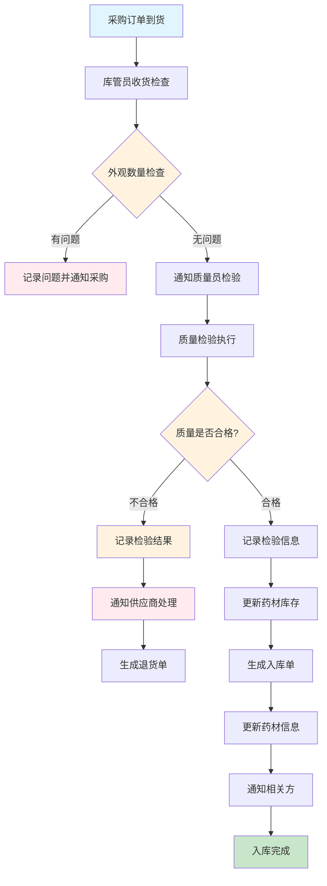
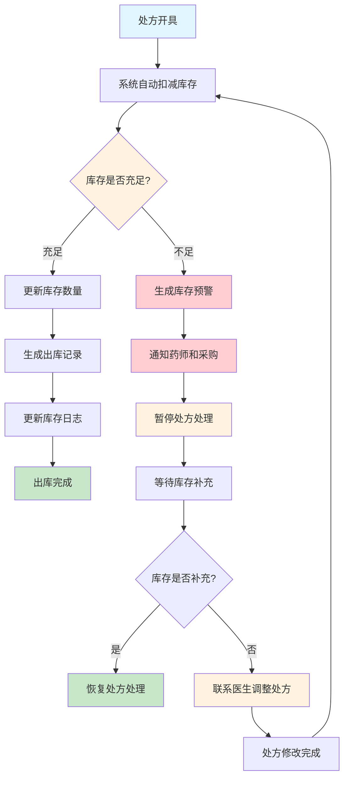
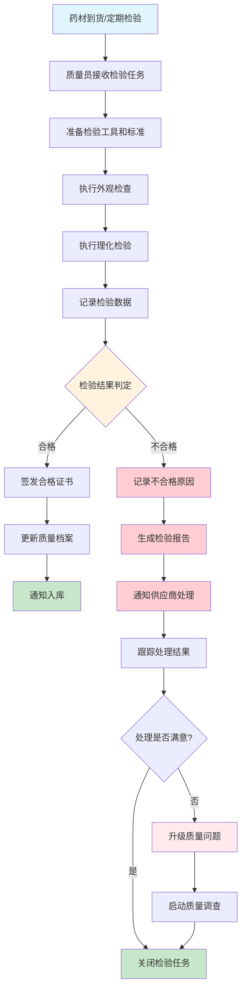

# 药材管理模块文档

> **版本**: 1.0  
> **创建日期**: 2025-10-15  
> **模块负责人**: 药材管理专员  
> **架构标准**: [Server模块设计标准](../../architecture/server-module-design-standard.md), [Client端统一设计标准](../../architecture/client/unified-design-standard.md)  
> **Project Standardization 3.0**: Task 4.3.2

---

## 1. 模块概述

### 1.1 功能简介

药材管理模块是LYBT中医诊所系统的核心基础模块之一，负责管理系统中所有中药材的详细信息、库存状况、质量控制和供应商信息。该模块为处方开具、配方管理、药材采购等业务功能提供基础的药材数据支持，确保药材信息的准确性、完整性和可追溯性。

### 1.2 业务价值

- **药材信息标准化**: 建立统一的药材信息数据库，确保信息一致性
- **库存管理优化**: 实时监控药材库存，避免缺货或积压
- **质量控制保障**: 支持药材质量管理，确保用药安全
- **成本控制优化**: 通过供应商管理和价格分析优化采购成本
- **合规性支持**: 满足中药材管理的法规要求和行业标准

### 1.3 核心功能

#### 1.3.1 药材基础信息管理
- **药材档案**: 维护药材的基本信息、药性、功效等
- **分类管理**: 支持药材的多级分类体系管理
- **别名管理**: 维护药材的多种别名和俗称
- **图片管理**: 药材图片的上传、存储和展示
- **规格管理**: 药材的不同规格和包装形式管理

#### 1.3.2 库存管理
- **实时库存**: 库存数量的实时跟踪和更新
- **入库管理**: 药材采购入库、退货入库等流程
- **出库管理**: 药材处方消耗、报损出库等流程
- **库存预警**: 库存不足预警和积压预警机制
- **盘点管理**: 定期库存盘点和差异处理

#### 1.3.3 质量控制
- **质量标准**: 药材质量标准的设定和管理
- **检验记录**: 药材质量检验结果记录
- **供应商评估**: 供应商质量评估和认证管理
- **批号追溯**: 药材批号的全程追溯管理
- **效期管理**: 药材有效期的监控和预警

#### 1.3.4 供应商管理
- **供应商档案**: 供应商基本信息和资质管理
- **采购记录**: 采购历史记录和价格分析
- **供应商评估**: 供应商绩效评估体系
- **合同管理**: 供应商合同和协议管理
- **价格管理**: 药材价格的维护和分析

### 1.4 系统边界

```
┌─────────────────────────────────────────────────────────────┐
│                    药材管理模块                                │
├─────────────────────────────────────────────────────────────┤
│  输入:                                                       │
│  • 药材基础信息 (名称、分类、规格、价格等)                      │
│  • 库存变动记录 (入库、出库、盘点等)                           │
│  • 质量检验结果 (检验数据、合格证书等)                         │
│  • 供应商信息 (基本信息、资质、价格等)                          │
│                                                             │
│  输出:                                                       │
│  • 药材详细信息 (完整档案、库存状态、价格等)                     │
│  • 库存状态报告 (实时库存、预警信息、盘点结果)                     │
│  • 质量分析报告 (质量统计、供应商评估、问题分析)                   │
│  • 采购建议 (基于库存和需求的采购建议)                           │
│  • 操作日志 (所有操作的详细记录)                                 │
└─────────────────────────────────────────────────────────────┘
```

---

## 2. 用户角色与工作流

### 2.1 目标用户

#### 2.1.1 药师/中药师
**职责**:
- 维护药材基础信息和分类
- 管理药材质量和检验标准
- 审核药材入库质量
- 提供药材专业咨询

**使用场景**:
- 新药材信息录入和维护
- 药材分类体系管理
- 质量标准制定和更新
- 药材配伍禁忌检查

#### 2.1.2 采购人员
**职责**:
- 管理供应商信息和关系
- 执行药材采购流程
- 监控库存状态和采购需求
- 分析价格趋势和成本

**使用场景**:
- 供应商信息维护
- 采购订单创建和跟踪
- 库存预警处理
- 价格对比和分析

#### 2.1.3 库管员
**职责**:
- 执行药材入库和出库操作
- 定期库存盘点
- 库存状态监控
- 库存差异处理

**使用场景**:
- 药材入库验收和登记
- 处方消耗出库记录
- 库存盘点和调整
- 库存异常处理

#### 2.1.4 质量管理员
**职责**:
- 制定药材质量标准
- 执行质量检验
- 供应商质量评估
- 质量问题处理

**使用场景**:
- 质量检验标准制定
- 药材质量检验执行
- 供应商质量审核
- 质量问题调查

### 2.2 核心工作流

#### 2.2.1 药材入库工作流



#### 2.2.2 药材出库工作流



#### 2.2.3 质量检验工作流



---

## 3. 技术架构

### 3.1 整体架构设计

药材管理模块采用标准的三层架构模式，遵循项目的统一设计标准：

```
┌─────────────────────────────────────────────────────────────┐
│                    Client层 (Desktop)                       │
├─────────────────────────────────────────────────────────────┤
│  ┌─────────────────┐  ┌─────────────────┐  ┌─────────────────┐ │
│  │ HerbManagement  │  │ HerbDetail      │  │ HerbInventory   │ │
│  │ ViewModel       │  │ ViewModel       │  │ ViewModel       │ │
│  └─────────────────┘  └─────────────────┘  └─────────────────┘ │
│           │                     │                     │         │
│           └─────────────────────┼─────────────────────┘         │
│                                 │                               │
│  ┌─────────────────────────────────────────────────────────┐ │
│  │                 HerbRepository                         │ │
│  └─────────────────────────────────────────────────────────┘ │
└─────────────────────────────────────────────────────────────┘
                                │ HTTP/REST API
┌─────────────────────────────────────────────────────────────┐
│                    Server层 (WebAPI)                       │
├─────────────────────────────────────────────────────────────┤
│  ┌─────────────────┐  ┌─────────────────┐  ┌─────────────────┐ │
│  │ HerbController   │  │ InventoryController│ │ QualityController │ │
│  └─────────────────┘  └─────────────────┘  └─────────────────┘ │
│           │                     │                     │         │
│           └─────────────────────┼─────────────────────┘         │
│                                 │                               │
│  ┌─────────────────────────────────────────────────────────┐ │
│  │                 HerbService                            │ │
│  └─────────────────────────────────────────────────────────┘ │
│                                 │                               │
│  ┌─────────────────────────────────────────────────────────┐ │
│  │                 HerbRepository                         │ │
│  └─────────────────────────────────────────────────────────┘ │
│                                 │                               │
│  ┌─────────────────────────────────────────────────────────┐ │
│  │                Database (EF Core)                      │ │
│  └─────────────────────────────────────────────────────────┘ │
└─────────────────────────────────────────────────────────────┘
```

### 3.2 核心组件设计

#### 3.2.1 Server端核心组件

**药材服务层 (HerbService)**
```csharp
// 服务接口定义在 Shared.Interfaces.Services
public interface IHerbService
{
    Task<ServiceResult<PagedResult<HerbDto>>> GetPagedAsync(int page = 1, int pageSize = 20, string? keyword = null);
    Task<ServiceResult<HerbDto>> GetByIdAsync(Guid id);
    Task<ServiceResult<HerbDto>> CreateAsync(HerbCreateDto dto, CancellationToken cancellationToken = default);
    Task<ServiceResult<HerbDto>> UpdateAsync(Guid id, HerbUpdateDto dto, CancellationToken cancellationToken = default);
    Task<ServiceResult> DeleteAsync(Guid id);
    Task<ServiceResult<List<HerbDto>>> GetByCategoryAsync(Guid categoryId);
    Task<ServiceResult<List<HerbDto>>> SearchByPropertiesAsync(HerbSearchDto searchDto);
    Task<ServiceResult> UpdateInventoryAsync(Guid herbId, InventoryUpdateDto updateDto);
    Task<ServiceResult<List<HerbInventoryDto>>> GetLowStockHerbsAsync(int threshold = 10);
    Task<ServiceResult> AddQualityRecordAsync(QualityRecordCreateDto dto);
    Task<ServiceResult<List<QualityRecordDto>>> GetQualityHistoryAsync(Guid herbId);
}
```

**药材仓储层 (HerbRepository)**
```csharp
public interface IHerbRepository : IRepository<HerbEntity>
{
    Task<HerbEntity?> GetByCodeAsync(string code);
    Task<HerbEntity?> GetByNameAsync(string name);
    Task<bool> IsCodeExistAsync(string code, Guid? excludeId = null);
    Task<bool> IsNameExistAsync(string name, Guid? excludeId = null);
    Task<List<HerbEntity>> GetByCategoryAsync(Guid categoryId);
    Task<List<HerbEntity>> GetLowStockHerbsAsync(int threshold);
    Task<List<HerbEntity>> SearchByPropertiesAsync(HerbSearchCriteria criteria);
    Task<HerbInventoryEntity?> GetInventoryAsync(Guid herbId);
    Task<List<QualityRecordEntity>> GetQualityHistoryAsync(Guid herbId);
    Task<List<SupplierEntity>> GetSuppliersByHerbAsync(Guid herbId);
    Task<decimal> GetAveragePriceAsync(Guid herbId, DateTime? startDate = null);
    Task<HerbCompatibilityEntity?> GetCompatibilityAsync(Guid herbId1, Guid herbId2);
}
```

**数据模型 (HerbEntity)**
```csharp
public class HerbEntity : BaseEntity
{
    public string Code { get; set; } = string.Empty;           // 药材编码
    public string Name { get; set; } = string.Empty;           // 药材名称
    public string Pinyin { get; set; } = string.Empty;         // 拼音
    public string WuBiCode { get; set; } = string.Empty;       // 五笔编码
    public string EnglishName { get; set; } = string.Empty;    // 英文名
    public string LatinName { get; set; } = string.Empty;       // 拉丁学名
    public string CategoryId { get; set; } = string.Empty;     // 分类ID
    public string Specification { get; set; } = string.Empty;   // 规格
    public string Unit { get; set; } = string.Empty;           // 单位
    public decimal Price { get; set; }                          // 参考价格
    public string Description { get; set; } = string.Empty;     // 描述
    public string Properties { get; set; } = string.Empty;      // 药性
    public string Effects { get; set; } = string.Empty;         // 功效
    public string Indications { get; set; } = string.Empty;     // 主治
    public string UsageDosage { get; set; } = string.Empty;     // 用法用量
    public string Contraindications { get; set; } = string.Empty; // 禁忌
    public string Storage { get; set; } = string.Empty;         // 贮藏
    public string Source { get; set; } = string.Empty;          // 产地
    public bool IsActive { get; set; } = true;                 // 是否启用
    public string ImageUrl { get; set; } = string.Empty;        // 图片URL
    public string Remarks { get; set; } = string.Empty;        // 备注
    
    // 导航属性
    public virtual HerbCategoryEntity Category { get; set; }
    public virtual HerbInventoryEntity Inventory { get; set; }
    public virtual ICollection<HerbAliasEntity> Aliases { get; set; } = new List<HerbAliasEntity>();
    public virtual ICollection<HerbSpecificationEntity> Specifications { get; set; } = new List<HerbSpecificationEntity>();
    public virtual ICollection<QualityRecordEntity> QualityRecords { get; set; } = new List<QualityRecordEntity>();
    public virtual ICollection<HerbSupplierEntity> Suppliers { get; set; } = new List<HerbSupplierEntity>();
    public virtual ICollection<HerbCompatibilityEntity> Compatibilities { get; set; } = new List<HerbCompatibilityEntity>();
}
```

#### 3.2.2 Client端核心组件

**药材管理ViewModel**
```csharp
public class HerbManagementViewModel : UnifiedListViewModelBase<HerbDto>
{
    private readonly IHerbRepository _herbRepository;
    
    public HerbManagementViewModel(
        IHerbRepository herbRepository,
        IEventAggregator eventAggregator,
        ILoggerFactory loggerFactory,
        IRegionManager regionManager,
        ISessionManager? sessionManager = null,
        IUserNotificationService? userNotificationService = null)
        : base(eventAggregator, loggerFactory, regionManager, sessionManager, userNotificationService)
    {
        _herbRepository = herbRepository ?? throw new ArgumentNullException(nameof(herbRepository));
        PageTitle = "药材管理";
        InitializeCommands();
    }

    protected override async Task<IEnumerable<HerbDto>> GetItemsAsync(int page, int pageSize, string? searchText)
    {
        var result = await _herbRepository.GetPagedAsync(page, pageSize, searchText);
        
        if (result != null && result.Items != null)
        {
            TotalCount = result.TotalCount;
            return result.Items;
        }
        
        return Enumerable.Empty<HerbDto>();
    }
    
    // 命令实现
    public ICommand CreateHerbCommand { get; private set; }
    public ICommand EditHerbCommand { get; private set; }
    public ICommand DeleteHerbCommand { get; private set; }
    public ICommand ViewInventoryCommand { get; private set; }
    public ICommand ViewQualityCommand { get; private set; }
    public ICommand SearchByPropertiesCommand { get; private set; }
}
```

**药材搜索ViewModel**
```csharp
public class HerbSearchViewModel : UnifiedViewModelBase
{
    private readonly IHerbRepository _herbRepository;
    
    // 搜索条件
    public string NameKeyword { get; set; } = string.Empty;
    public string PinyinKeyword { get; set; } = string.Empty;
    public string WuBiKeyword { get; set; } = string.Empty;
    public Guid? SelectedCategoryId { get; set; }
    public string PropertyKeyword { get; set; } = string.Empty;
    public string EffectKeyword { get; set; } = string.Empty;
    public string IndicationKeyword { get; set; } = string.Empty;
    
    // 搜索结果
    public ObservableCollection<HerbDto> SearchResults { get; set; } = new();
    
    public ICommand SearchCommand { get; private set; }
    public ICommand ClearCommand { get; private set; }
    public ICommand SelectHerbCommand { get; private set; }
    
    private async Task SearchAsync()
    {
        try
        {
            SetIsBusy(true, "正在搜索药材...");
            
            var searchDto = new HerbSearchDto
            {
                NameKeyword = NameKeyword,
                PinyinKeyword = PinyinKeyword,
                WuBiKeyword = WuBiKeyword,
                CategoryId = SelectedCategoryId,
                PropertyKeyword = PropertyKeyword,
                EffectKeyword = EffectKeyword,
                IndicationKeyword = IndicationKeyword
            };
            
            var result = await _herbRepository.SearchByPropertiesAsync(searchDto);
            
            SearchResults.Clear();
            if (result != null && result.Any())
            {
                foreach (var herb in result)
                {
                    SearchResults.Add(herb);
                }
            }
            
            await ShowSuccessMessageAsync($"找到 {SearchResults.Count} 个匹配的药材");
        }
        catch (Exception ex)
        {
            Logger.LogError(ex, "搜索药材时发生异常");
            await ShowErrorMessageAsync("搜索药材时发生系统错误");
        }
        finally
        {
            SetIsBusy(false);
        }
    }
}
```

### 3.3 库存管理设计

#### 3.3.1 库存实体设计
```csharp
public class HerbInventoryEntity : BaseEntity
{
    public Guid HerbId { get; set; }
    public decimal CurrentStock { get; set; }                    // 当前库存
    public decimal ReservedStock { get; set; }                   // 预留库存
    public decimal AvailableStock => CurrentStock - ReservedStock; // 可用库存
    public decimal SafetyStock { get; set; }                     // 安全库存
    public decimal MaxStock { get; set; }                        // 最大库存
    public decimal AveragePrice { get; set; }                    // 平均价格
    public DateTime LastUpdated { get; set; }                   // 最后更新时间
    public string LastUpdatedBy { get; set; } = string.Empty;    // 最后更新人
    public string Location { get; set; } = string.Empty;        // 存放位置
    public string BatchNumber { get; set; } = string.Empty;      // 批号
    public DateTime? ExpiryDate { get; set; }                   // 有效期
    public string Remarks { get; set; } = string.Empty;         // 备注
    
    // 导航属性
    public virtual HerbEntity Herb { get; set; }
    public virtual ICollection<InventoryTransactionEntity> Transactions { get; set; } = new List<InventoryTransactionEntity>();
}
```

#### 3.3.2 库存变动记录
```csharp
public class InventoryTransactionEntity : BaseEntity
{
    public Guid HerbId { get; set; }
    public TransactionType TransactionType { get; set; }        // 交易类型
    public decimal Quantity { get; set; }                        // 数量
    public decimal UnitPrice { get; set; }                       // 单价
    public decimal TotalAmount { get; set; }                     // 总金额
    public decimal StockBefore { get; set; }                     // 变动前库存
    public decimal StockAfter { get; set; }                      // 变动后库存
    public string BatchNumber { get; set; } = string.Empty;     // 批号
    public DateTime? ExpiryDate { get; set; }                   // 有效期
    public string SupplierName { get; set; } = string.Empty;     // 供应商
    public string ReferenceNumber { get; set; } = string.Empty; // 参考单号
    public string Reason { get; set; } = string.Empty;          // 变动原因
    public string OperatedBy { get; set; } = string.Empty;       // 操作人
    public DateTime OperationDate { get; set; }                 // 操作日期
    public string Remarks { get; set; } = string.Empty;         // 备注
    
    // 导航属性
    public virtual HerbEntity Herb { get; set; }
}

public enum TransactionType
{
    PurchaseIn = 1,        // 采购入库
    PrescriptionOut = 2,   // 处方消耗
    ReturnIn = 3,          // 退货入库
    DamageOut = 4,         // 报损出库
    AdjustmentIn = 5,      // 盘盈入库
    AdjustmentOut = 6,     // 盘亏出库
    TransferIn = 7,        // 调拨入库
    TransferOut = 8        // 调拨出库
}
```

---

## 4. 数据模型与接口

### 4.1 数据传输对象 (DTOs)

#### 4.1.1 药材创建DTO
```csharp
public class HerbCreateDto
{
    [Required(ErrorMessage = "药材编码不能为空")]
    [StringLength(20, MinimumLength = 2, ErrorMessage = "药材编码长度必须在2-20个字符之间")]
    [RegularExpression(@"^[A-Z0-9_]+$", ErrorMessage = "药材编码只能包含大写字母、数字和下划线")]
    public string Code { get; set; } = string.Empty;

    [Required(ErrorMessage = "药材名称不能为空")]
    [StringLength(100, MinimumLength = 2, ErrorMessage = "药材名称长度必须在2-100个字符之间")]
    public string Name { get; set; } = string.Empty;

    [StringLength(100, ErrorMessage = "拼音长度不能超过100个字符")]
    [RegularExpression(@"^[a-zA-Z\s]+$", ErrorMessage = "拼音只能包含字母和空格")]
    public string Pinyin { get; set; } = string.Empty;

    [StringLength(20, ErrorMessage = "五笔编码长度不能超过20个字符")]
    [RegularExpression(@"^[a-z]+$", ErrorMessage = "五笔编码只能包含小写字母")]
    public string WuBiCode { get; set; } = string.Empty;

    [StringLength(200, ErrorMessage = "英文名长度不能超过200个字符")]
    public string EnglishName { get; set; } = string.Empty;

    [StringLength(200, ErrorMessage = "拉丁学名长度不能超过200个字符")]
    public string LatinName { get; set; } = string.Empty;

    [Required(ErrorMessage = "分类不能为空")]
    public Guid CategoryId { get; set; }

    [StringLength(100, ErrorMessage = "规格长度不能超过100个字符")]
    public string Specification { get; set; } = string.Empty;

    [Required(ErrorMessage = "单位不能为空")]
    [StringLength(20, ErrorMessage = "单位长度不能超过20个字符")]
    public string Unit { get; set; } = string.Empty;

    [Range(0, double.MaxValue, ErrorMessage = "价格必须大于等于0")]
    public decimal Price { get; set; }

    [StringLength(1000, ErrorMessage = "描述长度不能超过1000个字符")]
    public string Description { get; set; } = string.Empty;

    [StringLength(500, ErrorMessage = "药性长度不能超过500个字符")]
    public string Properties { get; set; } = string.Empty;

    [StringLength(1000, ErrorMessage = "功效长度不能超过1000个字符")]
    public string Effects { get; set; } = string.Empty;

    [StringLength(2000, ErrorMessage = "主治长度不能超过2000个字符")]
    public string Indications { get; set; } = string.Empty;

    [StringLength(1000, ErrorMessage = "用法用量长度不能超过1000个字符")]
    public string UsageDosage { get; set; } = string.Empty;

    [StringLength(1000, ErrorMessage = "禁忌长度不能超过1000个字符")]
    public string Contraindications { get; set; } = string.Empty;

    [StringLength(500, ErrorMessage = "贮藏长度不能超过500个字符")]
    public string Storage { get; set; } = string.Empty;

    [StringLength(200, ErrorMessage = "产地长度不能超过200个字符")]
    public string Source { get; set; } = string.Empty;

    public bool IsActive { get; set; } = true;

    [StringLength(500, ErrorMessage = "图片URL长度不能超过500个字符")]
    [Url(ErrorMessage = "图片URL格式不正确")]
    public string ImageUrl { get; set; } = string.Empty;

    [StringLength(500, ErrorMessage = "备注长度不能超过500个字符")]
    public string Remarks { get; set; } = string.Empty;

    // 别名列表
    public List<HerbAliasCreateDto> Aliases { get; set; } = new();
    
    // 规格列表
    public List<HerbSpecificationCreateDto> Specifications { get; set; } = new();
}
```

#### 4.1.2 药材更新DTO
```csharp
public class HerbUpdateDto
{
    public Guid Id { get; set; }

    [StringLength(20, MinimumLength = 2, ErrorMessage = "药材编码长度必须在2-20个字符之间")]
    [RegularExpression(@"^[A-Z0-9_]+$", ErrorMessage = "药材编码只能包含大写字母、数字和下划线")]
    public string? Code { get; set; }

    [StringLength(100, MinimumLength = 2, ErrorMessage = "药材名称长度必须在2-100个字符之间")]
    public string? Name { get; set; }

    [StringLength(100, ErrorMessage = "拼音长度不能超过100个字符")]
    public string? Pinyin { get; set; }

    [StringLength(20, ErrorMessage = "五笔编码长度不能超过20个字符")]
    public string? WuBiCode { get; set; }

    public Guid? CategoryId { get; set; }

    [StringLength(100, ErrorMessage = "规格长度不能超过100个字符")]
    public string? Specification { get; set; }

    [StringLength(20, ErrorMessage = "单位长度不能超过20个字符")]
    public string? Unit { get; set; }

    [Range(0, double.MaxValue, ErrorMessage = "价格必须大于等于0")]
    public decimal? Price { get; set; }

    public string? Description { get; set; }
    public string? Properties { get; set; }
    public string? Effects { get; set; }
    public string? Indications { get; set; }
    public string? UsageDosage { get; set; }
    public string? Contraindications { get; set; }
    public string? Storage { get; set; }
    public string? Source { get; set; }
    public bool? IsActive { get; set; }
    public string? ImageUrl { get; set; }
    public string? Remarks { get; set; }
}
```

#### 4.1.3 药材显示DTO
```csharp
public class HerbDto
{
    public Guid Id { get; set; }
    public string Code { get; set; } = string.Empty;
    public string Name { get; set; } = string.Empty;
    public string Pinyin { get; set; } = string.Empty;
    public string WuBiCode { get; set; } = string.Empty;
    public string EnglishName { get; set; } = string.Empty;
    public string LatinName { get; set; } = string.Empty;
    public string CategoryId { get; set; } = string.Empty;
    public string CategoryName { get; set; } = string.Empty;
    public string Specification { get; set; } = string.Empty;
    public string Unit { get; set; } = string.Empty;
    public decimal Price { get; set; }
    public string Description { get; set; } = string.Empty;
    public string Properties { get; set; } = string.Empty;
    public string Effects { get; set; } = string.Empty;
    public string Indications { get; set; } = string.Empty;
    public string UsageDosage { get; set; } = string.Empty;
    public string Contraindications { get; set; } = string.Empty;
    public string Storage { get; set; } = string.Empty;
    public string Source { get; set; } = string.Empty;
    public bool IsActive { get; set; }
    public string ImageUrl { get; set; } = string.Empty;
    public string Remarks { get; set; } = string.Empty;
    public DateTime CreatedAt { get; set; }
    public DateTime UpdatedAt { get; set; }
    
    // 库存信息
    public HerbInventoryDto Inventory { get; set; } = new();
    
    // 关联数据
    public List<HerbAliasDto> Aliases { get; set; } = new();
    public List<HerbSpecificationDto> Specifications { get; set; } = new();
    public List<SupplierDto> Suppliers { get; set; } = new();
    
    // 显示属性
    public string DisplayName => $"{Name} ({Code})";
    public string SearchText => $"{Name} {Code} {Pinyin} {WuBiCode} {EnglishName}";
    public bool IsLowStock => Inventory != null && Inventory.CurrentStock <= Inventory.SafetyStock;
    public string StockStatus => IsLowStock ? "库存不足" : "库存正常";
    public string StatusText => IsActive ? "启用" : "禁用";
}
```

#### 4.1.4 药材搜索DTO
```csharp
public class HerbSearchDto
{
    public string NameKeyword { get; set; } = string.Empty;
    public string PinyinKeyword { get; set; } = string.Empty;
    public string WuBiKeyword { get; set; } = string.Empty;
    public Guid? CategoryId { get; set; }
    public string PropertyKeyword { get; set; } = string.Empty;
    public string EffectKeyword { get; set; } = string.Empty;
    public string IndicationKeyword { get; set; } = string.Empty;
    public bool IncludeInactive { get; set; } = false;
    public int MaxResults { get; set; } = 100;
}

public class HerbSearchCriteria
{
    public string? NameKeyword { get; set; }
    public string? PinyinKeyword { get; set; }
    public string? WuBiKeyword { get; set; }
    public Guid? CategoryId { get; set; }
    public string? PropertyKeyword { get; set; }
    public string? EffectKeyword { get; set; }
    public string? IndicationKeyword { get; set; }
    public bool IncludeInactive { get; set; } = false;
}
```

### 4.2 API接口定义

#### 4.2.1 药材管理API
```csharp
[ApiController]
[Route("api/[controller]")]
[Authorize]
public class HerbsController : ControllerBase
{
    private readonly IHerbService _herbService;
    private readonly ILogger<HerbsController> _logger;

    // GET: api/herbs
    [HttpGet]
    public async Task<ActionResult<PagedResult<HerbDto>>> GetHerbs(
        [FromQuery] int page = 1,
        [FromQuery] int pageSize = 20,
        [FromQuery] string? keyword = null)
    {
        var result = await _herbService.GetPagedAsync(page, pageSize, keyword);
        
        if (result.IsSuccess)
        {
            return Ok(result.Data);
        }
        
        return BadRequest(result.ErrorMessage);
    }

    // GET: api/herbs/{id}
    [HttpGet("{id:guid}")]
    public async Task<ActionResult<HerbDto>> GetHerb(Guid id)
    {
        var result = await _herbService.GetByIdAsync(id);
        
        if (result.IsSuccess)
        {
            return Ok(result.Data);
        }
        
        return NotFound(result.ErrorMessage);
    }

    // POST: api/herbs
    [HttpPost]
    [RequirePermission("herbs.create")]
    public async Task<ActionResult<HerbDto>> CreateHerb([FromBody] HerbCreateDto dto)
    {
        var result = await _herbService.CreateAsync(dto);
        
        if (result.IsSuccess)
        {
            return CreatedAtAction(nameof(GetHerb), new { id = result.Data!.Id }, result.Data);
        }
        
        return BadRequest(result.ErrorMessage);
    }

    // PUT: api/herbs/{id}
    [HttpPut("{id:guid}")]
    [RequirePermission("herbs.update")]
    public async Task<ActionResult<HerbDto>> UpdateHerb(Guid id, [FromBody] HerbUpdateDto dto)
    {
        dto.Id = id;
        var result = await _herbService.UpdateAsync(id, dto);
        
        if (result.IsSuccess)
        {
            return Ok(result.Data);
        }
        
        return BadRequest(result.ErrorMessage);
    }

    // DELETE: api/herbs/{id}
    [HttpDelete("{id:guid}")]
    [RequirePermission("herbs.delete")]
    public async Task<ActionResult> DeleteHerb(Guid id)
    {
        var result = await _herbService.DeleteAsync(id);
        
        if (result.IsSuccess)
        {
            return NoContent();
        }
        
        return BadRequest(result.ErrorMessage);
    }

    // GET: api/herbs/category/{categoryId}
    [HttpGet("category/{categoryId:guid}")]
    public async Task<ActionResult<List<HerbDto>>> GetHerbsByCategory(Guid categoryId)
    {
        var result = await _herbService.GetByCategoryAsync(categoryId);
        
        if (result.IsSuccess)
        {
            return Ok(result.Data);
        }
        
        return BadRequest(result.ErrorMessage);
    }

    // POST: api/herbs/search
    [HttpPost("search")]
    public async Task<ActionResult<List<HerbDto>>> SearchHerbs([FromBody] HerbSearchDto searchDto)
    {
        var result = await _herbService.SearchByPropertiesAsync(searchDto);
        
        if (result.IsSuccess)
        {
            return Ok(result.Data);
        }
        
        return BadRequest(result.ErrorMessage);
    }
}
```

#### 4.2.2 库存管理API
```csharp
[ApiController]
[Route("api/[controller]")]
[Authorize]
public class InventoryController : ControllerBase
{
    private readonly IInventoryService _inventoryService;
    private readonly ILogger<InventoryController> _logger;

    // GET: api/inventory/low-stock
    [HttpGet("low-stock")]
    [RequirePermission("inventory.view")]
    public async Task<ActionResult<List<HerbInventoryDto>>> GetLowStockHerbs(
        [FromQuery] int threshold = 10)
    {
        var result = await _inventoryService.GetLowStockHerbsAsync(threshold);
        
        if (result.IsSuccess)
        {
            return Ok(result.Data);
        }
        
        return BadRequest(result.ErrorMessage);
    }

    // POST: api/inventory/update
    [HttpPost("update")]
    [RequirePermission("inventory.update")]
    public async Task<ActionResult> UpdateInventory([FromBody] InventoryUpdateDto updateDto)
    {
        var result = await _inventoryService.UpdateInventoryAsync(updateDto);
        
        if (result.IsSuccess)
        {
            return Ok();
        }
        
        return BadRequest(result.ErrorMessage);
    }

    // GET: api/inventory/{herbId}/transactions
    [HttpGet("{herbId:guid}/transactions")]
    [RequirePermission("inventory.view")]
    public async Task<ActionResult<List<InventoryTransactionDto>>> GetInventoryTransactions(
        Guid herbId,
        [FromQuery] DateTime? startDate = null,
        [FromQuery] DateTime? endDate = null)
    {
        var result = await _inventoryService.GetInventoryTransactionsAsync(herbId, startDate, endDate);
        
        if (result.IsSuccess)
        {
            return Ok(result.Data);
        }
        
        return BadRequest(result.ErrorMessage);
    }
}
```

---

## 5. 使用指南

### 5.1 快速开始

#### 5.1.1 模块配置

**服务端配置**
```csharp
// 在 Program.cs 或 Startup.cs 中注册服务
public void ConfigureServices(IServiceCollection services)
{
    // 注册药材模块
    services.AddHerbsModule(Configuration);
    
    // 注册库存服务
    services.AddScoped<IInventoryService, InventoryService>();
    
    // 注册质量服务
    services.AddScoped<IQualityService, QualityService>();
}

// HerbsModule.cs
public static class HerbsModule
{
    public static IServiceCollection AddHerbsModule(
        this IServiceCollection services,
        IConfiguration configuration)
    {
        // 注册仓储
        services.AddScoped<IHerbRepository, HerbRepository>();
        
        // 注册服务实现类
        services.AddScoped<LYBT.Shared.Interfaces.Services.IHerbService, HerbService>();
        
        // 注册验证器
        services.AddValidatorsFromAssemblyContaining<HerbCreateDtoValidator>();
        
        // 注册AutoMapper配置
        services.AddAutoMapper(typeof(HerbMappingProfile));
        
        // 注册模块特定配置
        services.AddOptions<HerbModuleOptions>()
            .Bind(configuration.GetSection("Modules:Herbs"))
            .ValidateDataAnnotations()
            .ValidateOnStart();

        return services;
    }
}
```

**客户端配置**
```csharp
// 在 App.xaml.cs 或模块初始化中注册服务
public class HerbsModule : IModule
{
    public void OnInitialized(IContainerProvider containerProvider)
    {
        var regionManager = containerProvider.Resolve<IRegionManager>();
        regionManager.RequestNavigate("ContentRegion", "HerbManagementView");
    }

    public void RegisterTypes(IContainerRegistry containerRegistry)
    {
        // 注册Repository
        containerRegistry.RegisterRepository<IHerbRepository, HerbRepository>();
        
        // 注册ViewModels
        containerRegistry.RegisterForNavigation<HerbManagementView, HerbManagementViewModel>();
        containerRegistry.RegisterForNavigation<HerbDetailView, HerbDetailViewModel>();
        containerRegistry.RegisterForNavigation<HerbCreateView, HerbCreateViewModel>();
        containerRegistry.RegisterForNavigation<HerbSearchView, HerbSearchViewModel>();
        containerRegistry.RegisterForNavigation<InventoryView, InventoryViewModel>();
    }
}
```

#### 5.1.2 基本使用示例

**创建药材**
```csharp
// Server端
public class HerbService
{
    public async Task<ServiceResult<HerbDto>> CreateHerbAsync(HerbCreateDto dto)
    {
        // 1. 验证输入数据
        var validationResult = ValidateCreateDto(dto);
        if (!validationResult.IsValid)
        {
            return ServiceResult<HerbDto>.Failure(validationResult.ErrorMessage);
        }
        
        // 2. 检查药材编码和名称唯一性
        if (await _herbRepository.IsCodeExistAsync(dto.Code))
        {
            return ServiceResult<HerbDto>.Failure("药材编码已存在");
        }
        
        if (await _herbRepository.IsNameExistAsync(dto.Name))
        {
            return ServiceResult<HerbDto>.Failure("药材名称已存在");
        }
        
        // 3. 创建药材实体
        var herb = new HerbEntity
        {
            Code = dto.Code,
            Name = dto.Name,
            Pinyin = dto.Pinyin,
            WuBiCode = dto.WuBiCode,
            EnglishName = dto.EnglishName,
            LatinName = dto.LatinName,
            CategoryId = dto.CategoryId,
            Specification = dto.Specification,
            Unit = dto.Unit,
            Price = dto.Price,
            Description = dto.Description,
            Properties = dto.Properties,
            Effects = dto.Effects,
            Indications = dto.Indications,
            UsageDosage = dto.UsageDosage,
            Contraindications = dto.Contraindications,
            Storage = dto.Storage,
            Source = dto.Source,
            IsActive = dto.IsActive,
            ImageUrl = dto.ImageUrl,
            Remarks = dto.Remarks
        };
        
        // 4. 保存药材
        var createdHerb = await _herbRepository.AddAsync(herb);
        await _herbRepository.SaveChangesAsync();
        
        // 5. 处理别名
        foreach (var aliasDto in dto.Aliases)
        {
            var alias = new HerbAliasEntity
            {
                HerbId = createdHerb.Id,
                Alias = aliasDto.Alias,
                AliasType = aliasDto.AliasType,
                IsActive = true
            };
            await _herbAliasRepository.AddAsync(alias);
        }
        
        // 6. 处理规格
        foreach (var specDto in dto.Specifications)
        {
            var specification = new HerbSpecificationEntity
            {
                HerbId = createdHerb.Id,
                Specification = specDto.Specification,
                Unit = specDto.Unit,
                Price = specDto.Price,
                IsActive = true
            };
            await _herbSpecificationRepository.AddAsync(specification);
        }
        
        // 7. 创建库存记录
        var inventory = new HerbInventoryEntity
        {
            HerbId = createdHerb.Id,
            CurrentStock = 0,
            SafetyStock = 10, // 默认安全库存
            MaxStock = 1000, // 默认最大库存
            AveragePrice = dto.Price,
            LastUpdated = DateTime.UtcNow,
            LastUpdatedBy = _currentUserService.UserName
        };
        await _inventoryRepository.AddAsync(inventory);
        
        // 8. 保存所有更改
        await _herbRepository.SaveChangesAsync();
        
        // 9. 返回结果
        var herbDto = _mapper.Map<HerbDto>(createdHerb);
        return ServiceResult<HerbDto>.Success(herbDto);
    }
}
```

**药材搜索**
```csharp
// Client端
public class HerbSearchViewModel : UnifiedViewModelBase
{
    private readonly IHerbRepository _herbRepository;
    
    // 搜索条件
    public string NameKeyword { get; set; } = string.Empty;
    public string PinyinKeyword { get; set; } = string.Empty;
    public string WuBiKeyword { get; set; } = string.Empty;
    public Guid? SelectedCategoryId { get; set; }
    public string PropertyKeyword { get; set; } = string.Empty;
    public string EffectKeyword { get; set; } = string.Empty;
    public string IndicationKeyword { get; set; } = string.Empty;
    
    // 搜索结果
    public ObservableCollection<HerbDto> SearchResults { get; set; } = new();
    
    public ICommand SearchCommand { get; private set; }
    public ICommand ClearCommand { get; private set; }
    public ICommand SelectHerbCommand { get; private set; }
    
    private async Task SearchAsync()
    {
        try
        {
            SetIsBusy(true, "正在搜索药材...");
            
            var searchDto = new HerbSearchDto
            {
                NameKeyword = NameKeyword,
                PinyinKeyword = PinyinKeyword,
                WuBiKeyword = WuBiKeyword,
                CategoryId = SelectedCategoryId,
                PropertyKeyword = PropertyKeyword,
                EffectKeyword = EffectKeyword,
                IndicationKeyword = IndicationKeyword
            };
            
            var result = await _herbRepository.SearchByPropertiesAsync(searchDto);
            
            SearchResults.Clear();
            if (result != null && result.Any())
            {
                foreach (var herb in result)
                {
                    SearchResults.Add(herb);
                }
            }
            
            await ShowSuccessMessageAsync($"找到 {SearchResults.Count} 个匹配的药材");
        }
        catch (Exception ex)
        {
            Logger.LogError(ex, "搜索药材时发生异常");
            await ShowErrorMessageAsync("搜索药材时发生系统错误");
        }
        finally
        {
            SetIsBusy(false);
        }
    }
    
    private void ClearSearch()
    {
        NameKeyword = string.Empty;
        PinyinKeyword = string.Empty;
        WuBiKeyword = string.Empty;
        SelectedCategoryId = null;
        PropertyKeyword = string.Empty;
        EffectKeyword = string.Empty;
        IndicationKeyword = string.Empty;
        SearchResults.Clear();
    }
    
    private async Task SelectHerbAsync(HerbDto herb)
    {
        try
        {
            // 导航到药材详情页面
            var parameters = new NavigationParameters
            {
                { "herbId", herb.Id }
            };
            
            await _regionManager.RequestNavigate("DetailRegion", "HerbDetailView", parameters);
        }
        catch (Exception ex)
        {
            Logger.LogError(ex, "导航到药材详情页面时发生异常");
            await ShowErrorMessageAsync("导航失败");
        }
    }
}
```

### 5.2 高级功能

#### 5.2.1 库存预警系统
```csharp
public class InventoryAlertService : IInventoryAlertService
{
    private readonly IHerbRepository _herbRepository;
    private readonly IEmailService _emailService;
    private readonly ILogger<InventoryAlertService> _logger;

    public async Task CheckInventoryAlertsAsync()
    {
        try
        {
            // 检查低库存预警
            var lowStockThreshold = 10; // 可配置
            var lowStockHerbs = await _herbRepository.GetLowStockHerbsAsync(lowStockThreshold);
            
            if (lowStockHerbs.Any())
            {
                await ProcessLowStockAlertsAsync(lowStockHerbs);
            }
            
            // 检查积压库存预警
            var overstockThreshold = 1000; // 可配置
            var overstockHerbs = await _herbRepository.GetOverstockHerbsAsync(overstockThreshold);
            
            if (overstockHerbs.Any())
            {
                await ProcessOverstockAlertsAsync(overstockHerbs);
            }
            
            // 检查即将过期药材
            var expiryWarningDays = 30; // 可配置
            var expiringSoonHerbs = await _herbRepository.GetExpiringSoonHerbsAsync(expiryWarningDays);
            
            if (expiringSoonHerbs.Any())
            {
                await ProcessExpiryAlertsAsync(expiringSoonHerbs);
            }
        }
        catch (Exception ex)
        {
            _logger.LogError(ex, "检查库存预警时发生异常");
        }
    }
    
    private async Task ProcessLowStockAlertsAsync(List<HerbEntity> lowStockHerbs)
    {
        var alertData = new InventoryAlertData
        {
            AlertType = "LowStock",
            Herbs = lowStockHerbs.Select(h => new HerbAlertItem
            {
                Id = h.Id,
                Name = h.Name,
                Code = h.Code,
                CurrentStock = h.Inventory?.CurrentStock ?? 0,
                SafetyStock = h.Inventory?.SafetyStock ?? 0
            }).ToList(),
            AlertTime = DateTime.UtcNow
        };
        
        // 记录预警日志
        _logger.LogWarning("库存不足预警: {Count} 个药材库存不足", lowStockHerbs.Count);
        
        // 发送邮件通知
        await _emailService.SendInventoryAlertAsync(alertData);
        
        // 发布事件通知
        await _eventAggregator.PublishAsync(new InventoryAlertEvent { AlertData = alertData });
    }
}
```

#### 5.2.2 药材配伍检查
```csharp
public class HerbCompatibilityService : IHerbCompatibilityService
{
    private readonly IHerbRepository _herbRepository;
    private readonly ILogger<HerbCompatibilityService> _logger;

    public async Task<CompatibilityCheckResult> CheckCompatibilityAsync(List<Guid> herbIds)
    {
        var result = new CompatibilityCheckResult
        {
            IsCompatible = true,
            Warnings = new List<CompatibilityWarning>(),
            Contraindications = new List<CompatibilityContraindication>()
        };
        
        // 检查所有药材组合的配伍关系
        for (int i = 0; i < herbIds.Count; i++)
        {
            for (int j = i + 1; j < herbIds.Count; j++)
            {
                var compatibility = await _herbRepository.GetCompatibilityAsync(herbIds[i], herbIds[j]);
                
                if (compatibility != null)
                {
                    switch (compatibility.CompatibilityType)
                    {
                        case CompatibilityType.Contraindicated:
                            result.IsCompatible = false;
                            result.Contraindications.Add(new CompatibilityContraindication
                            {
                                Herb1Id = herbIds[i],
                                Herb2Id = herbIds[j],
                                Description = compatibility.Description,
                                Severity = compatibility.Severity
                            });
                            break;
                            
                        case CompatibilityType.Caution:
                            result.Warnings.Add(new CompatibilityWarning
                            {
                                Herb1Id = herbIds[i],
                                Herb2Id = herbIds[j],
                                Description = compatibility.Description,
                                Recommendation = compatibility.Recommendation
                            });
                            break;
                    }
                }
            }
        }
        
        return result;
    }
    
    public async Task<List<HerbCompatibilityDto>> GetIncompatibleHerbsAsync(Guid herbId)
    {
        var incompatibleHerbs = await _herbRepository.GetIncompatibleHerbsAsync(herbId);
        return _mapper.Map<List<HerbCompatibilityDto>>(incompatibleHerbs);
    }
}
```

---

## 6. 测试指南

### 6.1 单元测试

#### 6.1.1 Service层测试
```csharp
[TestFixture]
public class HerbServiceTests
{
    private IHerbService _herbService;
    private Mock<IHerbRepository> _herbRepositoryMock;
    private Mock<IMapper> _mapperMock;
    private Mock<IInventoryService> _inventoryServiceMock;

    [SetUp]
    public void Setup()
    {
        _herbRepositoryMock = new Mock<IHerbRepository>();
        _mapperMock = new Mock<IMapper>();
        _inventoryServiceMock = new Mock<IInventoryService>();
        
        _herbService = new HerbService(
            _herbRepositoryMock.Object,
            _mapperMock.Object,
            _inventoryServiceMock.Object,
            _loggerMock.Object);
    }

    [Test]
    public async Task CreateAsync_ValidHerb_ReturnsSuccess()
    {
        // Arrange
        var createDto = new HerbCreateDto
        {
            Code = "TEST001",
            Name = "测试药材",
            CategoryId = Guid.NewGuid(),
            Unit = "g",
            Price = 50.0m,
            Aliases = new List<HerbAliasCreateDto>
            {
                new HerbAliasCreateDto { Alias = "测试别名", AliasType = "Common" }
            }
        };

        var herbEntity = new HerbEntity
        {
            Id = Guid.NewGuid(),
            Code = createDto.Code,
            Name = createDto.Name,
            CategoryId = createDto.CategoryId,
            Unit = createDto.Unit,
            Price = createDto.Price
        };

        var herbDto = new HerbDto
        {
            Id = herbEntity.Id,
            Code = herbEntity.Code,
            Name = herbEntity.Name,
            CategoryId = herbEntity.CategoryId,
            Unit = herbEntity.Unit,
            Price = herbEntity.Price
        };

        _herbRepositoryMock.Setup(r => r.IsCodeExistAsync(createDto.Code))
            .ReturnsAsync(false);
        _herbRepositoryMock.Setup(r => r.IsNameExistAsync(createDto.Name))
            .ReturnsAsync(false);
        _herbRepositoryMock.Setup(r => r.AddAsync(It.IsAny<HerbEntity>()))
            .ReturnsAsync(herbEntity);
        _mapperMock.Setup(m => m.Map<HerbDto>(It.IsAny<HerbEntity>()))
            .Returns(herbDto);

        // Act
        var result = await _herbService.CreateAsync(createDto);

        // Assert
        Assert.That(result.IsSuccess, Is.True);
        Assert.That(result.Data, Is.Not.Null);
        Assert.That(result.Data.Code, Is.EqualTo(createDto.Code));
        
        _herbRepositoryMock.Verify(r => r.AddAsync(It.IsAny<HerbEntity>()), Times.Once);
        _herbRepositoryMock.Verify(r => r.SaveChangesAsync(), Times.Once);
    }

    [Test]
    public async Task SearchByPropertiesAsync_ValidCriteria_ReturnsResults()
    {
        // Arrange
        var searchDto = new HerbSearchDto
        {
            NameKeyword = "测试",
            CategoryId = Guid.NewGuid(),
            EffectKeyword = "清热"
        };

        var herbs = new List<HerbEntity>
        {
            new HerbEntity
            {
                Id = Guid.NewGuid(),
                Name = "测试药材1",
                CategoryId = searchDto.CategoryId.Value,
                Effects = "清热解毒"
            },
            new HerbEntity
            {
                Id = Guid.NewGuid(),
                Name = "测试药材2",
                CategoryId = searchDto.CategoryId.Value,
                Effects = "清热利湿"
            }
        };

        var herbDtos = _mapper.Map<List<HerbDto>>(herbs);

        _herbRepositoryMock.Setup(r => r.SearchByPropertiesAsync(It.IsAny<HerbSearchCriteria>()))
            .ReturnsAsync(herbs);

        // Act
        var result = await _herbService.SearchByPropertiesAsync(searchDto);

        // Assert
        Assert.That(result.IsSuccess, Is.True);
        Assert.That(result.Data, Is.Not.Null);
        Assert.That(result.Data.Count, Is.EqualTo(2));
        
        _herbRepositoryMock.Verify(r => r.SearchByPropertiesAsync(It.IsAny<HerbSearchCriteria>()), Times.Once);
    }
}
```

#### 6.1.2 Repository层测试
```csharp
[TestFixture]
public class HerbRepositoryTests
{
    private IHerbRepository _herbRepository;
    private ApplicationDbContext _context;
    private Guid _testHerbId;

    [SetUp]
    public void Setup()
    {
        var options = new DbContextOptionsBuilder<ApplicationDbContext>()
            .UseInMemoryDatabase(databaseName: Guid.NewGuid().ToString())
            .Options;

        _context = new ApplicationDbContext(options);
        _herbRepository = new HerbRepository(_context, _loggerMock.Object);
        
        // 创建测试数据
        _testHerbId = Guid.NewGuid();
        var testHerb = new HerbEntity
        {
            Id = _testHerbId,
            Code = "TEST001",
            Name = "测试药材",
            Pinyin = "ceshiyaocai",
            WuBiCode = "yc",
            CategoryId = Guid.NewGuid(),
            Unit = "g",
            Price = 50.0m,
            IsActive = true,
            CreatedAt = DateTime.UtcNow
        };
        
        _context.Herbs.Add(testHerb);
        _context.SaveChanges();
    }

    [TearDown]
    public void TearDown()
    {
        _context.Dispose();
    }

    [Test]
    public async Task GetByIdAsync_ExistingHerb_ReturnsHerb()
    {
        // Act
        var result = await _herbRepository.GetByIdAsync(_testHerbId);

        // Assert
        Assert.That(result, Is.Not.Null);
        Assert.That(result.Code, Is.EqualTo("TEST001"));
        Assert.That(result.Name, Is.EqualTo("测试药材"));
    }

    [Test]
    public async Task GetByCodeAsync_ExistingCode_ReturnsHerb()
    {
        // Act
        var result = await _herbRepository.GetByCodeAsync("TEST001");

        // Assert
        Assert.That(result, Is.Not.Null);
        Assert.That(result.Id, Is.EqualTo(_testHerbId));
    }

    [Test]
    public async Task GetByCodeAsync_NonExistingCode_ReturnsNull()
    {
        // Act
        var result = await _herbRepository.GetByCodeAsync("NONEXISTENT");

        // Assert
        Assert.That(result, Is.Null);
    }

    [Test]
    public async Task SearchByPropertiesAsync_NameKeyword_ReturnsMatchingHerbs()
    {
        // Arrange
        var criteria = new HerbSearchCriteria
        {
            NameKeyword = "测试"
        };

        // Act
        var result = await _herbRepository.SearchByPropertiesAsync(criteria);

        // Assert
        Assert.That(result, Is.Not.Null);
        Assert.That(result.Count, Is.EqualTo(1));
        Assert.That(result.First().Name, Does.Contain("测试"));
    }
}
```

### 6.2 集成测试

#### 6.2.1 API集成测试
```csharp
[TestFixture]
public class HerbsControllerIntegrationTests
{
    private HttpClient _client;
    private CustomWebApplicationFactory<Program> _factory;
    private string _testHerbId;

    [SetUp]
    public void Setup()
    {
        _factory = new CustomWebApplicationFactory<Program>();
        _client = _factory.CreateClient();
        
        // 创建测试药材并获取令牌
        _testHerbId = CreateTestHerb().Result;
        var token = GetTestUserToken().Result;
        _client.DefaultRequestHeaders.Authorization = 
            new AuthenticationHeaderValue("Bearer", token);
    }

    [TearDown]
    public void TearDown()
    {
        _client.Dispose();
        _factory.Dispose();
    }

    [Test]
    public async Task GetHerbs_ReturnsPagedResult()
    {
        // Act
        var response = await _client.GetAsync("/api/herbs");

        // Assert
        response.EnsureSuccessStatusCode();
        var content = await response.Content.ReadAsStringAsync();
        var result = JsonSerializer.Deserialize<PagedResult<HerbDto>>(content, new JsonSerializerOptions
        {
            PropertyNameCaseInsensitive = true
        });

        Assert.That(result, Is.Not.Null);
        Assert.That(result.Items, Is.Not.Empty);
    }

    [Test]
    public async Task CreateHerb_ValidHerb_ReturnsCreated()
    {
        // Arrange
        var createDto = new
        {
            Code = "NEWHERB001",
            Name = "新测试药材",
            CategoryId = GetTestCategoryId(),
            Unit = "g",
            Price = 75.0m,
            Properties = "性温",
            Effects = "补气养血"
        };

        var json = JsonSerializer.Serialize(createDto);
        var content = new StringContent(json, Encoding.UTF8, "application/json");

        // Act
        var response = await _client.PostAsync("/api/herbs", content);

        // Assert
        response.EnsureSuccessStatusCode();
        Assert.That(response.StatusCode, Is.EqualTo(HttpStatusCode.Created));
        
        var location = response.Headers.Location;
        Assert.That(location, Is.Not.Null);
        Assert.That(location.ToString(), Does.Contain("/api/herbs/"));
    }

    [Test]
    public async Task SearchHerbs_ValidCriteria_ReturnsResults()
    {
        // Arrange
        var searchDto = new
        {
            NameKeyword = "测试",
            CategoryId = GetTestCategoryId(),
            EffectKeyword = "补气"
        };

        var json = JsonSerializer.Serialize(searchDto);
        var content = new StringContent(json, Encoding.UTF8, "application/json");

        // Act
        var response = await _client.PostAsync("/api/herbs/search", content);

        // Assert
        response.EnsureSuccessStatusCode();
        
        var searchResults = await response.Content.ReadAsStringAsync();
        var results = JsonSerializer.Deserialize<List<HerbDto>>(searchResults, new JsonSerializerOptions
        {
            PropertyNameCaseInsensitive = true
        });

        Assert.That(results, Is.Not.Null);
        Assert.That(results.Count, Is.GreaterThan(0));
    }
}
```

### 6.3 性能测试

#### 6.3.1 搜索性能测试
```csharp
[TestFixture]
public class HerbSearchPerformanceTests
{
    private HerbService _herbService;
    private ApplicationDbContext _context;

    [SetUp]
    public void Setup()
    {
        var options = new DbContextOptionsBuilder<ApplicationDbContext>()
            .UseSqlServer(GetTestConnectionString())
            .Options;

        _context = new ApplicationDbContext(options);
        _herbService = new HerbService(_context, _mapper, _inventoryService, _logger);
    }

    [Test]
    [TestCase(1000)]
    [TestCase(5000)]
    [TestCase(10000)]
    public async Task SearchByPropertiesAsync_PerformanceTest(int herbCount)
    {
        // Arrange
        await CreateTestHerbsAsync(herbCount);
        var stopwatch = Stopwatch.StartNew();

        var searchDto = new HerbSearchDto
        {
            NameKeyword = "测试",
            EffectKeyword = "清热"
        };

        // Act
        var result = await _herbService.SearchByPropertiesAsync(searchDto);
        stopwatch.Stop();

        // Assert
        Assert.That(result.IsSuccess, Is.True);
        Assert.That(stopwatch.ElapsedMilliseconds, Is.LessThan(2000)); // 应在2秒内完成
        
        Console.WriteLine($"搜索 {herbCount} 个药材耗时: {stopwatch.ElapsedMilliseconds}ms");
    }

    [Test]
    public async Task ConcurrentSearch_PerformanceTest()
    {
        // Arrange
        const int concurrentSearches = 50;
        const int herbCount = 5000;
        
        await CreateTestHerbsAsync(herbCount);
        var tasks = new List<Task<ServiceResult<List<HerbDto>>>>();
        var searchKeywords = new[] { "清热", "补气", "活血", "解毒", "利尿" };

        // Act
        var stopwatch = Stopwatch.StartNew();
        
        for (int i = 0; i < concurrentSearches; i++)
        {
            var keyword = searchKeywords[i % searchKeywords.Length];
            var searchDto = new HerbSearchDto
            {
                NameKeyword = keyword,
                EffectKeyword = keyword
            };
            
            tasks.Add(_herbService.SearchByPropertiesAsync(searchDto));
        }
        
        var results = await Task.WhenAll(tasks);
        stopwatch.Stop();

        // Assert
        var successCount = results.Count(r => r.IsSuccess);
        Assert.That(successCount, Is.EqualTo(concurrentSearches));
        Assert.That(stopwatch.ElapsedMilliseconds, Is.LessThan(10000)); // 应在10秒内完成
        
        Console.WriteLine($"并发搜索 {concurrentSearches} 次耗时: {stopwatch.ElapsedMilliseconds}ms");
        Console.WriteLine($"平均每次搜索: {stopwatch.ElapsedMilliseconds / concurrentSearches}ms");
    }
}
```

---

## 7. 故障排除

### 7.1 常见问题

#### 7.1.1 药材搜索结果不准确
**问题描述**: 搜索药材时结果不完整或不准确

**可能原因**:
- 搜索条件设置不正确
- 药材数据不完整或格式错误
- 数据库索引缺失或失效
- 搜索逻辑存在错误

**排查步骤**:
1. 检查搜索条件的传递和解析
2. 验证数据库中药材数据的完整性
3. 检查数据库索引的创建情况
4. 分析搜索SQL的执行计划

**解决方案**:
```csharp
// 调试药材搜索逻辑
public async Task DebugHerbSearchAsync(HerbSearchDto searchDto)
{
    try
    {
        // 1. 构建搜索条件
        var criteria = new HerbSearchCriteria
        {
            NameKeyword = searchDto.NameKeyword,
            PinyinKeyword = searchDto.PinyinKeyword,
            WuBiKeyword = searchDto.WuBiKeyword,
            CategoryId = searchDto.CategoryId,
            PropertyKeyword = searchDto.PropertyKeyword,
            EffectKeyword = searchDto.EffectKeyword,
            IndicationKeyword = searchDto.IndicationKeyword,
            IncludeInactive = searchDto.IncludeInactive
        };
        
        Console.WriteLine($"搜索条件: {JsonSerializer.Serialize(criteria)}");
        
        // 2. 执行搜索
        var herbs = await _herbRepository.SearchByPropertiesAsync(criteria);
        
        Console.WriteLine($"搜索结果数量: {herbs.Count}");
        
        // 3. 分析搜索结果
        foreach (var herb in herbs.Take(5)) // 只显示前5个
        {
            Console.WriteLine($"药材: {herb.Name} ({herb.Code}) - {herb.Category?.Name}");
            Console.WriteLine($"  匹配字段: Name={herb.Name.Contains(searchDto.NameKeyword ?? "")}, " +
                           $"Pinyin={herb.Pinyin.Contains(searchDto.PinyinKeyword ?? "")}, " +
                           $"Effects={herb.Effects.Contains(searchDto.EffectKeyword ?? "")}");
        }
        
        // 4. 检查数据库统计
        var totalHerbs = await _herbRepository.CountAsync();
        Console.WriteLine($"数据库总药材数量: {totalHerbs}");
        
        var categoryHerbs = searchDto.CategoryId.HasValue 
            ? await _herbRepository.GetByCategoryAsync(searchDto.CategoryId.Value).ContinueWith(t => t.Result.Count)
            : 0;
        Console.WriteLine($"分类药材数量: {categoryHerbs}");
    }
    catch (Exception ex)
    {
        Console.WriteLine($"调试搜索时发生异常: {ex.Message}");
        Console.WriteLine($"异常详情: {ex}");
    }
}
```

#### 7.1.2 库存更新失败
**问题描述**: 库存数量更新不正确或失败

**可能原因**:
- 并发更新冲突
- 库存数量计算错误
- 事务处理失败
- 数据完整性约束违反

**排查步骤**:
1. 检查库存更新的业务逻辑
2. 验证并发控制机制
3. 检查事务的提交和回滚
4. 分析数据库约束和触发器

**解决方案**:
```csharp
// 调试库存更新逻辑
public async Task DebugInventoryUpdateAsync(Guid herbId, InventoryUpdateDto updateDto)
{
    try
    {
        // 1. 获取当前库存
        var currentInventory = await _inventoryRepository.GetByHerbIdAsync(herbId);
        if (currentInventory == null)
        {
            Console.WriteLine("库存记录不存在");
            return;
        }
        
        Console.WriteLine($"当前库存: {currentInventory.CurrentStock}");
        Console.WriteLine($"预留库存: {currentInventory.ReservedStock}");
        Console.WriteLine($"可用库存: {currentInventory.AvailableStock}");
        
        // 2. 检查更新数量
        Console.WriteLine($"更新数量: {updateDto.Quantity}");
        Console.WriteLine($"更新类型: {updateDto.TransactionType}");
        
        // 3. 验证库存充足性
        if (updateDto.TransactionType == TransactionType.PrescriptionOut)
        {
            if (currentInventory.AvailableStock < updateDto.Quantity)
            {
                Console.WriteLine("库存不足，无法出库");
                return;
            }
        }
        
        // 4. 创建库存变动记录
        var transaction = new InventoryTransactionEntity
        {
            Id = Guid.NewGuid(),
            HerbId = herbId,
            TransactionType = updateDto.TransactionType,
            Quantity = updateDto.Quantity,
            UnitPrice = updateDto.UnitPrice,
            StockBefore = currentInventory.CurrentStock,
            StockAfter = currentInventory.CurrentStock + updateDto.Quantity,
            OperatedBy = _currentUserService.UserName,
            OperationDate = DateTime.UtcNow
        };
        
        Console.WriteLine($"库存变动前: {transaction.StockBefore}");
        Console.WriteLine($"库存变动后: {transaction.StockAfter}");
        
        // 5. 更新库存
        using var transactionScope = new TransactionScope();
        {
            currentInventory.CurrentStock = transaction.StockAfter;
            currentInventory.LastUpdated = DateTime.UtcNow;
            currentInventory.LastUpdatedBy = _currentUserService.UserName;
            
            await _inventoryRepository.UpdateAsync(currentInventory);
            await _inventoryRepository.SaveChangesAsync();
            
            await _transactionRepository.AddAsync(transaction);
            await _transactionRepository.SaveChangesAsync();
            
            transactionScope.Complete();
        }
        
        Console.WriteLine("库存更新成功");
    }
    catch (Exception ex)
    {
        Console.WriteLine($"库存更新失败: {ex.Message}");
        Console.WriteLine($"异常详情: {ex}");
    }
}
```

#### 7.1.3 药材配伍检查异常
**问题描述**: 药材配伍检查返回错误结果或性能问题

**可能原因**:
- 配伍数据不完整或错误
- 配伍检查逻辑复杂
- 数据库查询性能差
- 配伍规则定义不清晰

**排查步骤**:
1. 检查配伍数据库的完整性
2. 验证配伍检查算法的正确性
3. 分析查询性能问题
4. 检查配伍规则的逻辑定义

**解决方案**:
```csharp
// 调试药材配伍检查
public async Task DebugHerbCompatibilityAsync(List<Guid> herbIds)
{
    try
    {
        Console.WriteLine($"检查药材配伍，药材数量: {herbIds.Count}");
        
        var result = new CompatibilityCheckResult
        {
            IsCompatible = true,
            Warnings = new List<CompatibilityWarning>(),
            Contraindications = new List<CompatibilityContraindication>()
        };
        
        // 1. 获取药材名称
        var herbs = await _herbRepository.GetListAsync(herbIds);
        var herbNames = herbs.ToDictionary(h => h.Id, h => h.Name);
        
        Console.WriteLine("检查的药材:");
        foreach (var herb in herbs)
        {
            Console.WriteLine($"  - {herb.Name} ({herb.Code})");
        }
        
        // 2. 检查所有药材组合
        for (int i = 0; i < herbIds.Count; i++)
        {
            for (int j = i + 1; j < herbIds.Count; j++)
            {
                var herb1Id = herbIds[i];
                var herb2Id = herbIds[j];
                var herb1Name = herbNames[herb1Id];
                var herb2Name = herbNames[herb2Id];
                
                Console.WriteLine($"检查配伍: {herb1Name} - {herb2Name}");
                
                var compatibility = await _herbRepository.GetCompatibilityAsync(herb1Id, herb2Id);
                
                if (compatibility != null)
                {
                    Console.WriteLine($"  配伍类型: {compatibility.CompatibilityType}");
                    Console.WriteLine($"  描述: {compatibility.Description}");
                    
                    switch (compatibility.CompatibilityType)
                    {
                        case CompatibilityType.Contraindicated:
                            result.IsCompatible = false;
                            result.Contraindications.Add(new CompatibilityContraindication
                            {
                                Herb1Id = herb1Id,
                                Herb2Id = herb2Id,
                                Description = compatibility.Description,
                                Severity = compatibility.Severity
                            });
                            Console.WriteLine("  ❌ 禁忌配伍");
                            break;
                            
                        case CompatibilityType.Caution:
                            result.Warnings.Add(new CompatibilityWarning
                            {
                                Herb1Id = herb1Id,
                                Herb2Id = herb2Id,
                                Description = compatibility.Description,
                                Recommendation = compatibility.Recommendation
                            });
                            Console.WriteLine("  ⚠️ 谨慎配伍");
                            break;
                            
                        default:
                            Console.WriteLine("  ✅ 可以配伍");
                            break;
                    }
                }
                else
                {
                    Console.WriteLine("  ✅ 无配伍限制");
                }
            }
        }
        
        // 3. 输出检查结果
        Console.WriteLine($"\n配伍检查结果:");
        Console.WriteLine($"  是否兼容: {(result.IsCompatible ? "是" : "否")}");
        Console.WriteLine($"  警告数量: {result.Warnings.Count}");
        Console.WriteLine($"  禁忌数量: {result.Contraindications.Count}");
        
        if (result.Contraindications.Any())
        {
            Console.WriteLine("\n禁忌配伍:");
            foreach (var contraindication in result.Contraindications)
            {
                var herb1Name = herbNames[contraindication.Herb1Id];
                var herb2Name = herbNames[contraindication.Herb2Id];
                Console.WriteLine($"  ❌ {herb1Name} - {herb2Name}: {contraindication.Description}");
            }
        }
        
        if (result.Warnings.Any())
        {
            Console.WriteLine("\n谨慎配伍:");
            foreach (var warning in result.Warnings)
            {
                var herb1Name = herbNames[warning.Herb1Id];
                var herb2Name = herbNames[warning.Herb2Id];
                Console.WriteLine($"  ⚠️ {herb1Name} - {herb2Name}: {warning.Description}");
                Console.WriteLine($"     建议: {warning.Recommendation}");
            }
        }
    }
    catch (Exception ex)
    {
        Console.WriteLine($"配伍检查异常: {ex.Message}");
        Console.WriteLine($"异常详情: {ex}");
    }
}
```

### 7.2 性能问题

#### 7.2.1 搜索性能优化
**问题描述**: 药材搜索响应时间过长

**优化方案**:
```csharp
// 使用索引优化搜索
public class HerbSearchSpecification : BaseSpecification<HerbEntity>
{
    public HerbSearchSpecification(HerbSearchCriteria criteria)
        : base(h => !h.IsDeleted)
    {
        // 构建搜索条件
        if (!string.IsNullOrWhiteSpace(criteria.NameKeyword))
        {
            Criteria = Criteria.And(h => h.Name.Contains(criteria.NameKeyword));
        }

        if (!string.IsNullOrWhiteSpace(criteria.PinyinKeyword))
        {
            Criteria = Criteria.And(h => h.Pinyin.Contains(criteria.PinyinKeyword));
        }

        if (!string.IsNullOrWhiteSpace(criteria.WuBiKeyword))
        {
            Criteria = Criteria.And(h => h.WuBiCode.Contains(criteria.WuBiKeyword));
        }

        if (criteria.CategoryId.HasValue)
        {
            Criteria = Criteria.And(h => h.CategoryId == criteria.CategoryId.Value);
        }

        if (!string.IsNullOrWhiteSpace(criteria.PropertyKeyword))
        {
            Criteria = Criteria.And(h => h.Properties.Contains(criteria.PropertyKeyword));
        }

        if (!string.IsNullOrWhiteSpace(criteria.EffectKeyword))
        {
            Criteria = Criteria.And(h => h.Effects.Contains(criteria.EffectKeyword));
        }

        if (!string.IsNullOrWhiteSpace(criteria.IndicationKeyword))
        {
            Criteria = Criteria.And(h => h.Indications.Contains(criteria.IndicationKeyword));
        }

        if (!criteria.IncludeInactive)
        {
            Criteria = Criteria.And(h => h.IsActive);
        }

        // 添加排序
        OrderBy(h => h.Name);

        // 优化性能
        DisableTracking();
        EnableCache(600); // 缓存10分钟

        // 限制结果数量
        Take(criteria.MaxResults ?? 100);
    }
}

// 在Service中使用优化搜索
public async Task<ServiceResult<List<HerbDto>>> SearchByPropertiesAsync(HerbSearchDto searchDto)
{
    try
    {
        var criteria = new HerbSearchCriteria
        {
            NameKeyword = searchDto.NameKeyword,
            PinyinKeyword = searchDto.PinyinKeyword,
            WuBiKeyword = searchDto.WuBiKeyword,
            CategoryId = searchDto.CategoryId,
            PropertyKeyword = searchDto.PropertyKeyword,
            EffectKeyword = searchDto.EffectKeyword,
            IndicationKeyword = searchDto.IndicationKeyword,
            IncludeInactive = searchDto.IncludeInactive,
            MaxResults = searchDto.MaxResults
        };

        var specification = new HerbSearchSpecification(criteria);
        var herbs = await _herbRepository.ListAsync(specification);
        var herbDtos = _mapper.Map<List<HerbDto>>(herbs);

        return ServiceResult<List<HerbDto>>.Success(herbDtos);
    }
    catch (Exception ex)
    {
        _logger.LogError(ex, "搜索药材时发生异常");
        return ServiceResult<List<HerbDto>>.Failure("搜索药材失败");
    }
}
```

#### 7.2.2 库存更新性能优化
```csharp
// 批量库存更新优化
public class BatchInventoryUpdateService
{
    public async Task<bool> BatchUpdateInventoryAsync(List<InventoryUpdateDto> updates)
    {
        using var transaction = _context.Database.BeginTransaction();
        
        try
        {
            // 按药材ID分组更新
            var groupedUpdates = updates.GroupBy(u => u.HerbId);
            
            foreach (var group in groupedUpdates)
            {
                var herbId = group.Key;
                var inventory = await _inventoryRepository.GetByHerbIdAsync(herbId);
                
                if (inventory != null)
                {
                    // 计算总变动量
                    var totalChange = group.Sum(u => u.Quantity);
                    
                    // 更新库存
                    inventory.CurrentStock += totalChange;
                    inventory.LastUpdated = DateTime.UtcNow;
                    inventory.LastUpdatedBy = _currentUserService.UserName;
                    
                    // 创建批量变动记录
                    var transactions = group.Select(u => new InventoryTransactionEntity
                    {
                        Id = Guid.NewGuid(),
                        HerbId = herbId,
                        TransactionType = u.TransactionType,
                        Quantity = u.Quantity,
                        UnitPrice = u.UnitPrice,
                        StockBefore = inventory.CurrentStock - totalChange,
                        StockAfter = inventory.CurrentStock,
                        OperatedBy = _currentUserService.UserName,
                        OperationDate = DateTime.UtcNow,
                        ReferenceNumber = u.ReferenceNumber,
                        Reason = u.Reason
                    }).ToList();
                    
                    await _transactionRepository.AddRangeAsync(transactions);
                    await _inventoryRepository.UpdateAsync(inventory);
                }
            }
            
            await _context.SaveChangesAsync();
            await transaction.CommitAsync();
            
            return true;
        }
        catch (Exception ex)
        {
            await transaction.RollbackAsync();
            _logger.LogError(ex, "批量更新库存时发生异常");
            return false;
        }
    }
}
```

---

## 8. 维护与监控

### 8.1 日常维护

#### 8.1.1 药材数据维护
```csharp
public class HerbMaintenanceService
{
    public async Task CleanUpInactiveHerbsAsync(int inactiveDays = 365)
    {
        var cutoffDate = DateTime.UtcNow.AddDays(-inactiveDays);
        
        var inactiveHerbs = await _herbRepository.GetInactiveHerbsAsync(cutoffDate);
        
        foreach (var herb in inactiveHerbs)
        {
            // 记录停用原因
            await _auditService.LogHerbActionAsync(new HerbActionAuditDto
            {
                HerbId = herb.Id,
                HerbCode = herb.Code,
                HerbName = herb.Name,
                Action = "AUTO_DEACTIVATE",
                Resource = "Herb",
                ResourceId = herb.Id,
                ActionResult = "Success",
                ErrorMessage = $"药材 {inactiveDays} 天未使用，自动停用"
            });
            
            // 停用药材
            herb.IsActive = false;
            herb.UpdatedAt = DateTime.UtcNow;
            await _herbRepository.UpdateAsync(herb);
        }
        
        await _herbRepository.SaveChangesAsync();
        
        _logger.LogInformation("停用了 {Count} 个不活跃药材", inactiveHerbs.Count);
    }

    public async Task UpdateHerbPricesAsync()
    {
        // 获取所有活跃药材
        var activeHerbs = await _herbRepository.GetActiveHerbsAsync();
        
        foreach (var herb in activeHerbs)
        {
            // 计算最近6个月的平均价格
            var avgPrice = await _herbRepository.GetAveragePriceAsync(herb.Id, 
                DateTime.UtcNow.AddMonths(-6));
            
            if (avgPrice > 0 && avgPrice != herb.Price)
            {
                // 记录价格变更
                await _auditService.LogHerbActionAsync(new HerbActionAuditDto
                {
                    HerbId = herb.Id,
                    HerbCode = herb.Code,
                    HerbName = herb.Name,
                    Action = "AUTO_PRICE_UPDATE",
                    Resource = "HerbPrice",
                    ResourceId = herb.Id,
                    ActionResult = "Success",
                    AdditionalData = $"价格从 {herb.Price} 更新为 {avgPrice}"
                });
                
                // 更新价格
                herb.Price = avgPrice;
                herb.UpdatedAt = DateTime.UtcNow;
                await _herbRepository.UpdateAsync(herb);
            }
        }
        
        await _herbRepository.SaveChangesAsync();
        
        _logger.LogInformation("更新了 {Count} 个药材的价格", activeHerbs.Count);
    }
}
```

#### 8.1.2 库存维护
```csharp
public class InventoryMaintenanceService
{
    public async Task GenerateInventoryReportAsync()
    {
        var report = new InventoryReport
        {
            ReportDate = DateTime.UtcNow,
            GeneratedBy = _currentUserService.UserName
        };
        
        // 统计总库存价值
        var totalValue = await _inventoryRepository.GetTotalInventoryValueAsync();
        report.TotalInventoryValue = totalValue;
        
        // 统计低库存药材
        var lowStockHerbs = await _herbRepository.GetLowStockHerbsAsync(10);
        report.LowStockCount = lowStockHerbs.Count;
        report.LowStockHerbs = _mapper.Map<List<HerbDto>>(lowStockHerbs);
        
        // 统计积压库存
        var overstockHerbs = await _herbRepository.GetOverstockHerbsAsync(1000);
        report.OverstockCount = overstockHerbs.Count;
        report.OverstockHerbs = _mapper.Map<List<HerbDto>>(overstockHerbs);
        
        // 统计即将过期药材
        var expiringSoonHerbs = await _herbRepository.GetExpiringSoonHerbsAsync(30);
        report.ExpiringSoonCount = expiringSoonHerbs.Count;
        report.ExpiringSoonHerbs = _mapper.Map<List<HerbDto>>(expiringSoonHerbs);
        
        // 保存报告
        await _reportRepository.AddAsync(report);
        await _reportRepository.SaveChangesAsync();
        
        // 发送邮件通知
        await _emailService.SendInventoryReportAsync(report);
        
        _logger.LogInformation("生成库存报告完成");
    }
}
```

### 8.2 监控指标

#### 8.2.1 业务监控
```csharp
public class HerbMetrics
{
    private readonly IMetrics _metrics;
    private readonly ILogger<HerbMetrics> _logger;

    public void RecordHerbSearch(string searchType, bool success, int resultCount)
    {
        _metrics.Counter("herb_search_total")
            .WithTag("search_type", searchType)
            .WithTag("success", success.ToString().ToLower())
            .Increment();
            
        _metrics.Histogram("herb_search_result_count")
            .WithTag("search_type", searchType)
            .Observe(resultCount);
    }

    public void RecordInventoryTransaction(string transactionType, decimal quantity)
    {
        _metrics.Counter("inventory_transaction_total")
            .WithTag("transaction_type", transactionType)
            .Increment();
            
        _metrics.Histogram("inventory_transaction_quantity")
            .WithTag("transaction_type", transactionType)
            .Observe((double)quantity);
    }

    public void RecordQualityCheck(string qualityGrade, bool passed)
    {
        _metrics.Counter("quality_check_total")
            .WithTag("grade", qualityGrade)
            .WithTag("passed", passed.ToString().ToLower())
            .Increment();
    }

    public void RecordPriceChange(decimal percentageChange)
    {
        _metrics.Histogram("herb_price_change_percentage")
            .Observe((double)percentageChange);
    }

    public void RecordHerbUsage(Guid herbId, string usageType)
    {
        _metrics.Counter("herb_usage_total")
            .WithTag("usage_type", usageType)
            .Increment();
        
        // 记录具体药材使用频率
        _metrics.Counter($"herb_{herbId}_usage_total")
            .WithTag("usage_type", usageType)
            .Increment();
    }
}
```

#### 8.2.2 系统健康监控
```csharp
public class HerbHealthCheck : IHealthCheck
{
    private readonly IHerbRepository _herbRepository;
    private readonly IInventoryRepository _inventoryRepository;
    private readonly ILogger<HerbHealthCheck> _logger;

    public async Task<HealthCheckResult> CheckHealthAsync(HealthCheckContext context, CancellationToken cancellationToken = default)
    {
        try
        {
            var stopwatch = Stopwatch.StartNew();
            var data = new Dictionary<string, object>();
            
            // 检查数据库连接
            var herbCount = await _herbRepository.CountAsync();
            data["herb_count"] = herbCount;
            
            // 检查库存状态
            var lowStockCount = await _herbRepository.GetLowStockHerbsAsync(10)
                .ContinueWith(t => t.Result.Count);
            data["low_stock_count"] = lowStockCount;
            
            // 检查库存一致性
            var inventoryInconsistencies = await CheckInventoryConsistencyAsync();
            data["inventory_inconsistencies"] = inventoryInconsistencies;
            
            stopwatch.Stop();
            data["query_duration_ms"] = stopwatch.ElapsedMilliseconds;
            data["last_check"] = DateTime.UtcNow;
            
            // 判断健康状态
            if (lowStockCount > herbCount * 0.1) // 低库存药材超过10%
            {
                return HealthCheckResult.Degraded("库存不足药材过多", data);
            }
            
            if (inventoryInconsistencies > 0)
            {
                return HealthCheckResult.Degraded("库存数据不一致", data);
            }
            
            if (stopwatch.ElapsedMilliseconds > 3000)
            {
                return HealthCheckResult.Degraded("查询响应时间过长", data);
            }
            
            return HealthCheckResult.Healthy("药材模块运行正常", data);
        }
        catch (Exception ex)
        {
            _logger.LogError(ex, "药材模块健康检查失败");
            return HealthCheckResult.Unhealthy("药材模块检查失败", ex.Message);
        }
    }
    
    private async Task<int> CheckInventoryConsistencyAsync()
    {
        // 检查库存数据一致性
        var inconsistencies = 0;
        
        // 这里可以实现具体的库存一致性检查逻辑
        // 例如：检查库存数量与交易记录的一致性
        
        return inconsistencies;
    }
}
```

### 8.3 自动化任务

#### 8.3.1 定期任务调度
```csharp
// 使用Hangfire或其他后台作业框架
public class HerbMaintenanceJob
{
    private readonly HerbMaintenanceService _maintenanceService;
    private readonly ILogger<HerbMaintenanceJob> _logger;

    [AutomaticRetry(Attempts = 3)]
    public async Task ExecuteDailyMaintenanceAsync()
    {
        try
        {
            _logger.LogInformation("开始执行药材维护任务");
            
            // 清理不活跃药材
            await _maintenanceService.CleanUpInactiveHerbsAsync();
            
            // 更新药材价格
            await _maintenanceService.UpdateHerbPricesAsync();
            
            // 生成库存报告
            await _maintenanceService.GenerateInventoryReportAsync();
            
            // 检查库存预警
            await _maintenanceService.CheckInventoryAlertsAsync();
            
            _logger.LogInformation("药材维护任务执行完成");
        }
        catch (Exception ex)
        {
            _logger.LogError(ex, "药材维护任务执行失败");
            throw;
        }
    }

    [AutomaticRetry(Attempts = 3)]
    public async Task ExecuteWeeklyMaintenanceAsync()
    {
        try
        {
            _logger.LogInformation("开始执行药材周维护任务");
            
            // 数据备份
            await _maintenanceService.BackupHerbDataAsync();
            
            // 性能分析
            await _maintenanceService.AnalyzeUsagePatternsAsync();
            
            // 质量统计
            await _maintenanceService.GenerateQualityReportAsync();
            
            _logger.LogInformation("药材周维护任务执行完成");
        }
        catch (Exception ex)
        {
            _logger.LogError(ex, "药材周维护任务执行失败");
            throw;
        }
    }
}

// 在Startup.cs中注册定期任务
public void Configure(IApplicationBuilder app, IBackgroundJobClient backgroundJobs)
{
    // 每天凌晨3点执行维护任务
    backgroundJobs.Schedule<HerbMaintenanceJob>(
        job => job.ExecuteDailyMaintenanceAsync(), 
        "0 3 * * *"); // Cron表达式：每天凌晨3点
    
    // 每周日凌晨4点执行周维护任务
    backgroundJobs.Schedule<HerbMaintenanceJob>(
        job => job.ExecuteWeeklyMaintenanceAsync(), 
        "0 4 * * 0"); // Cron表达式：每周日凌晨4点
}
```

---

## 9. 安全与合规

### 9.1 数据安全

#### 9.1.1 药材数据保护
- **访问控制**: 基于角色的药材信息访问控制
- **数据加密**: 敏感药材信息的加密存储
- **操作审计**: 完整的药材操作日志记录
- **备份策略**: 定期数据备份和恢复测试

#### 9.1.2 库存安全
- **权限分离**: 库存操作的权限分离
- **变更审批**: 重要库存变更的审批流程
- **异常监控**: 库存异常的实时监控和告警
- **数据完整性**: 库存数据的完整性检查

### 9.2 质量合规

#### 9.2.1 药材质量标准
- **国家标准**: 遵循国家药材质量标准
- **企业标准**: 建立企业内部质量标准
- **检验流程**: 标准化的检验流程
- **记录管理**: 完整的质量记录管理

#### 9.2.2 供应商管理
- **资质审核**: 供应商资质的严格审核
- **质量评估**: 供应商质量的定期评估
- **合同管理**: 供应商合同的规范管理
- **关系维护**: 供应商关系的维护管理

### 9.3 监管合规

#### 9.3.1 法规要求
- **药品管理法**: 遵循药品管理相关法规
- **GSP要求**: 符合药品经营质量管理规范
- **追溯要求**: 药材追溯体系的建立
- **记录保存**: 法规要求的记录保存期限

#### 9.3.2 行业标准
- **中医标准**: 遵循中医药行业标准
- **质量标准**: 行业质量标准的执行
- **操作规范**: 行业操作规范的建立
- **持续改进**: 质量管理的持续改进

---

## 10. 总结

药材管理模块作为LYBT中医诊所系统的核心基础模块，提供了完整的药材信息管理、库存管理、质量控制和供应商管理功能。通过本模块的实施，系统能够：

### 10.1 核心价值实现

1. **信息标准化**: 建立统一、标准的药材信息数据库
2. **库存优化**: 实现库存的实时监控和智能预警
3. **质量保障**: 提供完整的质量控制和管理体系
4. **成本控制**: 通过优化采购和管理降低运营成本
5. **合规支持**: 满足药材管理的法规和标准要求

### 10.2 技术特色

- **高性能搜索**: 支持多维度、多条件的药材搜索
- **智能预警**: 库存预警和质量预警机制
- **配伍检查**: 中药配伍禁忌的自动检查
- **批量操作**: 支持高效的批量库存操作
- **完整审计**: 全面的操作审计和追踪

### 10.3 使用建议

1. **定期维护**: 定期更新药材信息和价格数据
2. **质量控制**: 严格执行药材质量检验标准
3. **库存监控**: 持续监控库存状态和预警信息
4. **供应商管理**: 定期评估和优化供应商关系
5. **合规检查**: 定期检查法规合规性

通过遵循本文档的指导，开发团队可以有效地使用和维护药材管理模块，确保药材信息的准确性、完整性和可追溯性，为LYBT中医诊所系统的正常运营提供可靠的药材基础数据支持。

---

**文档维护**: 本文档将随系统功能升级和需求变化持续更新。如有疑问或建议，请联系开发团队。

🤖 Generated with [Claude Code](https://claude.com/claude-code)