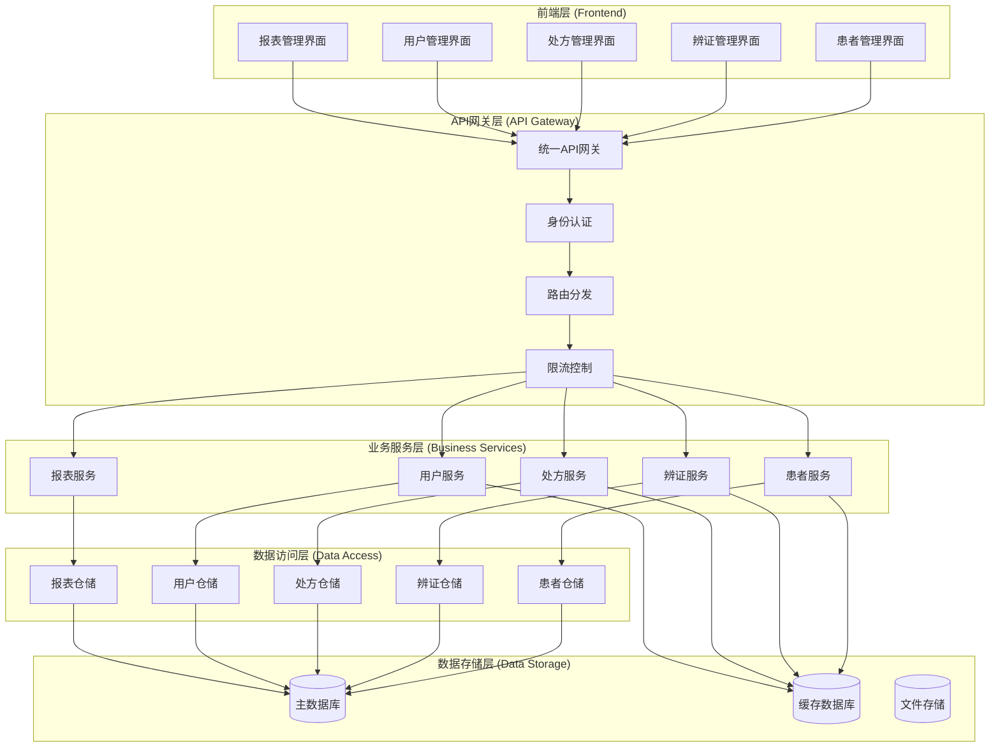
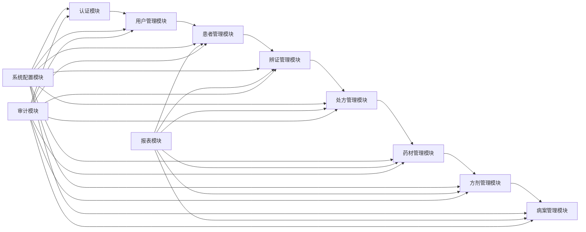

# 模块集成指南 (Module Integration Guide)

> **版本**: 1.0
> **创建日期**: 2025-01-15
> **最后更新**: 2025-01-15
> **维护者**: Claude Code
> **目标用户**: 开发人员、系统集成工程师、架构师
> **相关文档**: [患者管理模块](../patients/README.md) | [辨证管理模块](../consultation/README.md) | [处方管理模块](../prescriptions/README.md) | [系统架构文档](../../architecture/)

## 📋 文档概述

本文档详细描述了 LYBT 中医诊所管理系统各模块之间的集成方式、API接口规范、数据交换格式、依赖管理和集成测试策略。本指南旨在为开发人员提供完整的技术参考，确保模块间集成的规范性、一致性和可维护性。

## 🎯 集成目标

### 主要目标
- **模块解耦**: 确保模块间的松散耦合，提高系统灵活性
- **接口标准化**: 建立统一的API接口规范，降低集成复杂度
- **数据一致性**: 保证模块间数据交换的一致性和完整性
- **性能优化**: 优化模块间通信，提高系统整体性能

### 次要目标
- **可测试性**: 提高模块集成的可测试性和可维护性
- **可扩展性**: 支持模块的独立开发和部署
- **容错处理**: 建立完善的错误处理和恢复机制
- **监控支持**: 提供集成过程的监控和调试支持

## 🏗️ 系统架构概览

### 整体架构


### 模块依赖关系


## 🔌 API接口规范

### 统一接口规范

#### 请求格式
```json
{
  "requestId": "string",
  "timestamp": "2025-01-15T10:30:00Z",
  "version": "1.0",
  "data": {
    // 具体请求数据
  },
  "metadata": {
    "userId": "string",
    "sessionId": "string",
    "clientInfo": {
      "version": "string",
      "platform": "string"
    }
  }
}
```

#### 响应格式
```json
{
  "requestId": "string",
  "timestamp": "2025-01-15T10:30:00Z",
  "success": true,
  "code": 200,
  "message": "string",
  "data": {
    // 具体响应数据
  },
  "metadata": {
    "processingTime": 150,
    "version": "1.0",
    "pagination": {
      "pageNumber": 1,
      "pageSize": 20,
      "totalCount": 100,
      "totalPages": 5
    }
  }
}
```

#### 错误响应格式
```json
{
  "requestId": "string",
  "timestamp": "2025-01-15T10:30:00Z",
  "success": false,
  "code": 400,
  "message": "错误描述",
  "error": {
    "type": "ValidationError",
    "details": [
      {
        "field": "patientName",
        "message": "患者姓名不能为空"
      }
    ]
  },
  "metadata": {
    "processingTime": 50,
    "version": "1.0"
  }
}
```

### 模块间API接口

#### 1. 患者管理模块接口

##### 获取患者信息
```
GET /api/patients/{id}
Authorization: Bearer {token}
Content-Type: application/json

响应:
{
  "success": true,
  "data": {
    "id": "guid",
    "name": "张三",
    "gender": "男",
    "birthDate": "1980-01-01",
    "phone": "13800138000",
    "address": "北京市朝阳区",
    "medicalInfo": {
      "allergies": ["青霉素"],
      "medicalHistory": ["高血压"],
      "familyHistory": ["糖尿病"]
    }
  }
}
```

##### 创建患者
```
POST /api/patients
Authorization: Bearer {token}
Content-Type: application/json

请求:
{
  "name": "张三",
  "gender": "男",
  "birthDate": "1980-01-01",
  "phone": "13800138000",
  "address": "北京市朝阳区",
  "medicalInfo": {
    "allergies": ["青霉素"],
    "medicalHistory": ["高血压"],
    "familyHistory": ["糖尿病"]
  }
}

响应:
{
  "success": true,
  "data": {
    "id": "guid",
    "createdAt": "2025-01-15T10:30:00Z"
  }
}
```

#### 2. 辨证管理模块接口

##### 获取辨证记录
```
GET /api/consultations/{id}
Authorization: Bearer {token}
Content-Type: application/json

响应:
{
  "success": true,
  "data": {
    "id": "guid",
    "patientId": "guid",
    "consultationDate": "2025-01-15",
    "symptoms": {
      "chiefComplaint": "头痛",
      "presentIllness": "头痛3天",
      "inquiry": "头痛、恶心、呕吐",
      "observation": "面色苍白",
      "listening": "语音低微",
      "pulseTaking": "脉弦数"
    },
    "diagnosis": {
      "tcmDiagnosis": "肝阳上亢",
      "westernDiagnosis": "高血压"
    },
    "treatment": {
      "principle": "平肝潜阳",
      "method": "镇肝熄风"
    }
  }
}
```

##### 创建辨证记录
```
POST /api/consultations
Authorization: Bearer {token}
Content-Type: application/json

请求:
{
  "patientId": "guid",
  "consultationDate": "2025-01-15",
  "symptoms": {
    "chiefComplaint": "头痛",
    "presentIllness": "头痛3天",
    "inquiry": "头痛、恶心、呕吐",
    "observation": "面色苍白",
    "listening": "语音低微",
    "pulseTaking": "脉弦数"
  },
  "diagnosis": {
    "tcmDiagnosis": "肝阳上亢",
    "westernDiagnosis": "高血压"
  },
  "treatment": {
    "principle": "平肝潜阳",
    "method": "镇肝熄风"
  }
}

响应:
{
  "success": true,
  "data": {
    "id": "guid",
    "createdAt": "2025-01-15T10:30:00Z"
  }
}
```

#### 3. 处方管理模块接口

##### 获取处方信息
```
GET /api/prescriptions/{id}
Authorization: Bearer {token}
Content-Type: application/json

响应:
{
  "success": true,
  "data": {
    "id": "guid",
    "patientId": "guid",
    "consultationId": "guid",
    "prescriptionDate": "2025-01-15",
    "diagnosis": "肝阳上亢",
    "formula": {
      "baseFormula": "天麻钩藤饮",
      "modifications": [
        {
          "herb": "天麻",
          "dosage": 10,
          "unit": "g"
        },
        {
          "herb": "钩藤",
          "dosage": 15,
          "unit": "g"
        }
      ]
    },
    "instructions": "每日一剂，水煎分两次服用",
    "status": "待发药"
  }
}
```

##### 创建处方
```
POST /api/prescriptions
Authorization: Bearer {token}
Content-Type: application/json

请求:
{
  "patientId": "guid",
  "consultationId": "guid",
  "diagnosis": "肝阳上亢",
  "formula": {
    "baseFormula": "天麻钩藤饮",
    "modifications": [
      {
        "herb": "天麻",
        "dosage": 10,
        "unit": "g"
      },
      {
        "herb": "钩藤",
        "dosage": 15,
        "unit": "g"
      }
    ]
  },
  "instructions": "每日一剂，水煎分两次服用"
}

响应:
{
  "success": true,
  "data": {
    "id": "guid",
    "prescriptionNumber": "PR20250115001",
    "createdAt": "2025-01-15T10:30:00Z",
    "status": "待发药"
  }
}
```

## 📦 依赖管理

### 依赖注入配置

#### Server端依赖注入
```csharp
// Program.cs
var builder = WebApplication.CreateBuilder(args);

// 注册数据库上下文
builder.Services.AddDbContext<LybtDbContext>(options =>
    options.UseSqlServer(builder.Configuration.GetConnectionString("DefaultConnection")));

// 注册仓储层
builder.Services.AddScoped<IPatientRepository, PatientRepository>();
builder.Services.AddScoped<IConsultationRepository, ConsultationRepository>();
builder.Services.AddScoped<IPrescriptionRepository, PrescriptionRepository>();
builder.Services.AddScoped<IUserRepository, UserRepository>();
builder.Services.AddScoped<IHerbRepository, HerbRepository>();
builder.Services.AddScoped<IFormulaRepository, FormulaRepository>();

// 注册服务层
builder.Services.AddScoped<IPatientService, PatientService>();
builder.Services.AddScoped<IConsultationService, ConsultationService>();
builder.Services.AddScoped<IPrescriptionService, PrescriptionService>();
builder.Services.AddScoped<IUserService, UserService>();
builder.Services.AddScoped<IHerbService, HerbService>();
builder.Services.AddScoped<IFormulaService, FormulaService>();

// 注册外部服务
builder.Services.AddSingleton<ICacheService, RedisCacheService>();
builder.Services.AddSingleton<IEmailService, SmtpEmailService>();
builder.Services.AddSingleton<ISmsService, AliyunSmsService>();
builder.Services.AddSingleton<IFileStorageService, LocalFileStorageService>();

// 注册认证服务
builder.Services.AddAuthentication(JwtBearerDefaults.AuthenticationScheme)
    .AddJwtBearer(options =>
    {
        options.TokenValidationParameters = new TokenValidationParameters
        {
            ValidateIssuer = true,
            ValidateAudience = true,
            ValidateLifetime = true,
            ValidateIssuerSigningKey = true,
            ValidIssuer = builder.Configuration["Jwt:Issuer"],
            ValidAudience = builder.Configuration["Jwt:Audience"],
            IssuerSigningKey = new SymmetricSecurityKey(
                Encoding.UTF8.GetBytes(builder.Configuration["Jwt:SecretKey"]))
        };
    });

var app = builder.Build();
```

#### Client端依赖注入
```csharp
// App.xaml.cs
public partial class App : Application
{
    private IHost? _host;

    protected override void OnStartup(StartupEventArgs e)
    {
        _host = Host.CreateDefaultBuilder()
            .ConfigureServices((context, services) =>
            {
                // 注册服务
                services.AddSingleton<IAuthenticationService, AuthenticationService>();
                services.AddSingleton<IPatientService, PatientService>();
                services.AddSingleton<IConsultationService, ConsultationService>();
                services.AddSingleton<IPrescriptionService, PrescriptionService>();
                services.AddSingleton<IUserService, UserService>();
                
                // 注册仓储
                services.AddSingleton<IPatientRepository, PatientRepository>();
                services.AddSingleton<IConsultationRepository, ConsultationRepository>();
                services.AddSingleton<IPrescriptionRepository, PrescriptionRepository>();
                services.AddSingleton<IUserRepository, UserRepository>();
                
                // 注册ViewModel
                services.AddTransient<LoginViewModel>();
                services.AddTransient<PatientListViewModel>();
                services.AddTransient<PatientDetailViewModel>();
                services.AddTransient<ConsultationViewModel>();
                services.AddTransient<PrescriptionViewModel>();
                
                // 注册Views
                services.AddTransient<LoginView>();
                services.AddTransient<PatientListView>();
                services.AddTransient<PatientDetailView>();
                services.AddTransient<ConsultationView>();
                services.AddTransient<PrescriptionView>();
                
                // 注册导航服务
                services.AddSingleton<INavigationService, NavigationService>();
                services.AddSingleton<IDialogService, DialogService>();
            })
            .Build();

        _host.Start();
    }
}
```

### 模块间通信

#### 事件驱动通信
```csharp
// 事件定义
public class PatientCreatedEvent
{
    public Guid PatientId { get; set; }
    public string PatientName { get; set; }
    public DateTime CreatedAt { get; set; }
}

public class ConsultationCompletedEvent
{
    public Guid ConsultationId { get; set; }
    public Guid PatientId { get; set; }
    public string Diagnosis { get; set; }
    public DateTime CompletedAt { get; set; }
}

public class PrescriptionCreatedEvent
{
    public Guid PrescriptionId { get; set; }
    public Guid PatientId { get; set; }
    public Guid ConsultationId { get; set; }
    public string Formula { get; set; }
    public DateTime CreatedAt { get; set; }
}

// 事件发布服务
public interface IEventPublisher
{
    Task PublishAsync<T>(T eventData) where T : class;
    Task PublishAsync<T>(T eventData, string topic) where T : class;
}

// 事件订阅服务
public interface IEventSubscriber
{
    Task SubscribeAsync<T>(Func<T, Task> handler) where T : class;
    Task SubscribeAsync<T>(string topic, Func<T, Task> handler) where T : class;
}
```

#### 事件处理示例
```csharp
// 患者服务发布事件
public class PatientService : IPatientService
{
    private readonly IPatientRepository _repository;
    private readonly IEventPublisher _eventPublisher;

    public async Task<PatientDto> CreateAsync(CreatePatientDto createDto)
    {
        var patient = new Patient
        {
            Name = createDto.Name,
            Gender = createDto.Gender,
            BirthDate = createDto.BirthDate,
            Phone = createDto.Phone,
            Address = createDto.Address
        };

        var createdPatient = await _repository.AddAsync(patient);
        
        // 发布患者创建事件
        await _eventPublisher.PublishAsync(new PatientCreatedEvent
        {
            PatientId = createdPatient.Id,
            PatientName = createdPatient.Name,
            CreatedAt = DateTime.UtcNow
        });

        return _mapper.Map<PatientDto>(createdPatient);
    }
}

// 审计服务订阅事件
public class AuditService : IEventSubscriber
{
    private readonly IAuditRepository _repository;

    public AuditService(IEventSubscriber subscriber, IAuditRepository repository)
    {
        _repository = repository;
        
        // 订阅患者创建事件
        subscriber.SubscribeAsync<PatientCreatedEvent>(HandlePatientCreated);
    }

    private async Task HandlePatientCreated(PatientCreatedEvent eventData)
    {
        var auditLog = new AuditLog
        {
            EventType = "PatientCreated",
            EntityId = eventData.PatientId,
            Description = $"患者 {eventData.PatientName} 创建成功",
            Timestamp = eventData.CreatedAt,
            UserId = GetCurrentUserId()
        };

        await _repository.AddAsync(auditLog);
    }
}
```

## 🔄 数据同步策略

### 数据一致性保证

#### 事务管理
```csharp
public class PrescriptionService : IPrescriptionService
{
    private readonly IPrescriptionRepository _prescriptionRepository;
    private readonly IHerbRepository _herbRepository;
    private readonly IUnitOfWork _unitOfWork;

    public async Task<PrescriptionDto> CreateAsync(CreatePrescriptionDto createDto)
    {
        using var transaction = await _unitOfWork.BeginTransactionAsync();
        
        try
        {
            // 创建处方
            var prescription = new Prescription
            {
                PatientId = createDto.PatientId,
                ConsultationId = createDto.ConsultationId,
                Diagnosis = createDto.Diagnosis,
                Instructions = createDto.Instructions,
                Status = PrescriptionStatus.Pending
            };

            var createdPrescription = await _prescriptionRepository.AddAsync(prescription);

            // 更新药材库存
            foreach (var herb in createDto.Herbs)
            {
                var herbEntity = await _herbRepository.GetByIdAsync(herb.HerbId);
                herbEntity.StockQuantity -= herb.Dosage;
                await _herbRepository.UpdateAsync(herbEntity);
            }

            // 提交事务
            await _unitOfWork.CommitAsync();

            return _mapper.Map<PrescriptionDto>(createdPrescription);
        }
        catch (Exception ex)
        {
            // 回滚事务
            await _unitOfWork.RollbackAsync();
            throw new ServiceException("创建处方失败", ex);
        }
    }
}
```

#### 数据缓存策略
```csharp
public interface ICacheService
{
    Task<T?> GetAsync<T>(string key);
    Task SetAsync<T>(string key, T value, TimeSpan? expiry = null);
    Task RemoveAsync(string key);
    Task RemoveByPatternAsync(string pattern);
}

public class PatientService : IPatientService
{
    private readonly IPatientRepository _repository;
    private readonly ICacheService _cacheService;

    public async Task<PatientDto?> GetByIdAsync(Guid id)
    {
        var cacheKey = $"patient:{id}";
        
        // 先从缓存获取
        var cachedPatient = await _cacheService.GetAsync<PatientDto>(cacheKey);
        if (cachedPatient != null)
        {
            return cachedPatient;
        }

        // 缓存未命中，从数据库获取
        var patient = await _repository.GetByIdAsync(id);
        if (patient == null)
        {
            return null;
        }

        var patientDto = _mapper.Map<PatientDto>(patient);
        
        // 存入缓存，设置过期时间
        await _cacheService.SetAsync(cacheKey, patientDto, TimeSpan.FromMinutes(30));
        
        return patientDto;
    }

    public async Task<PatientDto> UpdateAsync(Guid id, UpdatePatientDto updateDto)
    {
        var patient = await _repository.GetByIdAsync(id);
        if (patient == null)
        {
            throw new NotFoundException("患者不存在");
        }

        _mapper.Map(updateDto, patient);
        var updatedPatient = await _repository.UpdateAsync(patient);

        var patientDto = _mapper.Map<PatientDto>(updatedPatient);
        
        // 更新缓存
        var cacheKey = $"patient:{id}";
        await _cacheService.SetAsync(cacheKey, patientDto, TimeSpan.FromMinutes(30));
        
        return patientDto;
    }
}
```

### 异步数据同步

#### 消息队列集成
```csharp
public interface IMessageQueueService
{
    Task PublishAsync<T>(string topic, T message);
    Task SubscribeAsync<T>(string topic, Func<T, Task> handler);
}

public class DataSyncService
{
    private readonly IMessageQueueService _messageQueue;
    private readonly ILogger<DataSyncService> _logger;

    public DataSyncService(IMessageQueueService messageQueue, ILogger<DataSyncService> logger)
    {
        _messageQueue = messageQueue;
        _logger = logger;
    }

    public async Task PublishPatientUpdateAsync(PatientDto patient)
    {
        try
        {
            await _messageQueue.PublishAsync("patient-updated", patient);
            _logger.LogInformation("患者更新消息已发布: {PatientId}", patient.Id);
        }
        catch (Exception ex)
        {
            _logger.LogError(ex, "发布患者更新消息失败: {PatientId}", patient.Id);
            throw;
        }
    }

    public async Task SubscribeToPatientUpdatesAsync()
    {
        await _messageQueue.SubscribeAsync<PatientDto>("patient-updated", async (patient) =>
        {
            try
            {
                // 处理患者更新事件
                await ProcessPatientUpdateAsync(patient);
                _logger.LogInformation("患者更新事件处理完成: {PatientId}", patient.Id);
            }
            catch (Exception ex)
            {
                _logger.LogError(ex, "处理患者更新事件失败: {PatientId}", patient.Id);
                throw;
            }
        });
    }

    private async Task ProcessPatientUpdateAsync(PatientDto patient)
    {
        // 同步到外部系统
        await SyncToExternalSystemAsync(patient);
        
        // 更新搜索引擎
        await UpdateSearchIndexAsync(patient);
        
        // 清理相关缓存
        await ClearRelatedCacheAsync(patient.Id);
    }
}
```

## 🧪 集成测试

### 测试策略

#### 单元测试
```csharp
[TestFixture]
public class PatientServiceTests
{
    private readonly Mock<IPatientRepository> _repositoryMock;
    private readonly Mock<IEventPublisher> _eventPublisherMock;
    private readonly Mock<IMapper> _mapperMock;
    private readonly PatientService _service;

    public PatientServiceTests()
    {
        _repositoryMock = new Mock<IPatientRepository>();
        _eventPublisherMock = new Mock<IEventPublisher>();
        _mapperMock = new Mock<IMapper>();
        _service = new PatientService(_repositoryMock.Object, _eventPublisherMock.Object, _mapperMock.Object);
    }

    [Test]
    public async Task CreateAsync_ShouldCreatePatient_WhenValidData()
    {
        // Arrange
        var createDto = new CreatePatientDto
        {
            Name = "张三",
            Gender = "男",
            BirthDate = new DateTime(1980, 1, 1),
            Phone = "13800138000"
        };

        var patient = new Patient
        {
            Id = Guid.NewGuid(),
            Name = createDto.Name,
            Gender = createDto.Gender,
            BirthDate = createDto.BirthDate,
            Phone = createDto.Phone
        };

        var patientDto = new PatientDto
        {
            Id = patient.Id,
            Name = patient.Name,
            Gender = patient.Gender,
            BirthDate = patient.BirthDate,
            Phone = patient.Phone
        };

        _repositoryMock.Setup(r => r.AddAsync(It.IsAny<Patient>())).ReturnsAsync(patient);
        _mapperMock.Setup(m => m.Map<PatientDto>(patient)).Returns(patientDto);

        // Act
        var result = await _service.CreateAsync(createDto);

        // Assert
        Assert.IsNotNull(result);
        Assert.AreEqual(createDto.Name, result.Name);
        _repositoryMock.Verify(r => r.AddAsync(It.IsAny<Patient>()), Times.Once);
        _eventPublisherMock.Verify(p => p.PublishAsync(It.IsAny<PatientCreatedEvent>()), Times.Once);
    }
}
```

#### 集成测试
```csharp
[TestFixture]
public class PatientIntegrationTests
{
    private readonly HttpClient _client;
    private readonly TestApplicationFactory _factory;

    public PatientIntegrationTests()
    {
        _factory = new TestApplicationFactory();
        _client = _factory.CreateClient();
    }

    [Test]
    public async Task CreatePatient_ShouldReturnCreatedPatient_WhenValidData()
    {
        // Arrange
        var createDto = new
        {
            name = "张三",
            gender = "男",
            birthDate = "1980-01-01",
            phone = "13800138000",
            address = "北京市朝阳区"
        };

        // Act
        var response = await _client.PostAsJsonAsync("/api/patients", createDto);
        
        // Assert
        response.EnsureSuccessStatusCode();
        var patient = await response.Content.ReadFromJsonAsync<PatientDto>();
        
        Assert.IsNotNull(patient);
        Assert.AreEqual(createDto.name, patient.Name);
        Assert.AreEqual(createDto.gender, patient.Gender);
    }

    [Test]
    public async Task GetPatient_ShouldReturnPatient_WhenPatientExists()
    {
        // Arrange
        var patient = new Patient
        {
            Id = Guid.NewGuid(),
            Name = "张三",
            Gender = "男",
            BirthDate = new DateTime(1980, 1, 1),
            Phone = "13800138000"
        };

        await _factory.SeedDataAsync(patient);

        // Act
        var response = await _client.GetAsync($"/api/patients/{patient.Id}");
        
        // Assert
        response.EnsureSuccessStatusCode();
        var result = await response.Content.ReadFromJsonAsync<PatientDto>();
        
        Assert.IsNotNull(result);
        Assert.AreEqual(patient.Name, result.Name);
        Assert.AreEqual(patient.Gender, result.Gender);
    }
}
```

#### 端到端测试
```csharp
[TestFixture]
public class EndToEndTests
{
    private readonly TestApplicationFactory _factory;
    private readonly HttpClient _client;

    public EndToEndTests()
    {
        _factory = new TestApplicationFactory();
        _client = _factory.CreateClient();
    }

    [Test]
    public async Task CompleteWorkflow_ShouldWorkCorrectly_WhenAllStepsExecuted()
    {
        // 1. 用户登录
        var loginResponse = await _client.PostAsJsonAsync("/api/auth/login", new
        {
            username = "admin",
            password = "password"
        });
        
        loginResponse.EnsureSuccessStatusCode();
        var authResult = await loginResponse.Content.ReadFromJsonAsync<AuthResponse>();
        _client.DefaultRequestHeaders.Authorization = 
            new System.Net.Http.Headers.AuthenticationHeaderValue("Bearer", authResult.AccessToken);

        // 2. 创建患者
        var patientResponse = await _client.PostAsJsonAsync("/api/patients", new
        {
            name = "张三",
            gender = "男",
            birthDate = "1980-01-01",
            phone = "13800138000"
        });
        
        patientResponse.EnsureSuccessStatusCode();
        var patient = await patientResponse.Content.ReadFromJsonAsync<PatientDto>();

        // 3. 创建辨证记录
        var consultationResponse = await _client.PostAsJsonAsync("/api/consultations", new
        {
            patientId = patient.Id,
            chiefComplaint = "头痛",
            tcmDiagnosis = "肝阳上亢"
        });
        
        consultationResponse.EnsureSuccessStatusCode();
        var consultation = await consultationResponse.Content.ReadFromJsonAsync<ConsultationDto>();

        // 4. 创建处方
        var prescriptionResponse = await _client.PostAsJsonAsync("/api/prescriptions", new
        {
            patientId = patient.Id,
            consultationId = consultation.Id,
            diagnosis = "肝阳上亢",
            formula = new
            {
                baseFormula = "天麻钩藤饮",
                modifications = new[]
                {
                    new { herb = "天麻", dosage = 10, unit = "g" },
                    new { herb = "钩藤", dosage = 15, unit = "g" }
                }
            }
        });
        
        prescriptionResponse.EnsureSuccessStatusCode();
        var prescription = await prescriptionResponse.Content.ReadFromJsonAsync<PrescriptionDto>();

        // 验证完整流程
        Assert.IsNotNull(patient);
        Assert.IsNotNull(consultation);
        Assert.IsNotNull(prescription);
        Assert.AreEqual(patient.Id, consultation.PatientId);
        Assert.AreEqual(consultation.Id, prescription.ConsultationId);
    }
}
```

## 📊 性能优化

### 缓存策略

#### 多级缓存
```csharp
public class MultiLevelCacheService : ICacheService
{
    private readonly IMemoryCache _memoryCache;
    private readonly IDistributedCache _distributedCache;
    private readonly ILogger<MultiLevelCacheService> _logger;

    public async Task<T?> GetAsync<T>(string key)
    {
        // 1. 检查内存缓存
        if (_memoryCache.TryGetValue(key, out T? memoryValue))
        {
            _logger.LogDebug("命中内存缓存: {Key}", key);
            return memoryValue;
        }

        // 2. 检查分布式缓存
        var distributedValue = await _distributedCache.GetStringAsync(key);
        if (distributedValue != null)
        {
            var deserializedValue = JsonSerializer.Deserialize<T>(distributedValue);
            if (deserializedValue != null)
            {
                // 将数据放入内存缓存
                _memoryCache.Set(key, deserializedValue, TimeSpan.FromMinutes(5));
                _logger.LogDebug("命中分布式缓存: {Key}", key);
                return deserializedValue;
            }
        }

        _logger.LogDebug("缓存未命中: {Key}", key);
        return default(T);
    }

    public async Task SetAsync<T>(string key, T value, TimeSpan? expiry = null)
    {
        var expiryTime = expiry ?? TimeSpan.FromHours(1);
        
        // 1. 存入内存缓存
        _memoryCache.Set(key, value, expiryTime);
        
        // 2. 存入分布式缓存
        var serializedValue = JsonSerializer.Serialize(value);
        await _distributedCache.SetStringAsync(key, serializedValue, new DistributedCacheEntryOptions
        {
            AbsoluteExpirationRelativeToNow = expiryTime
        });
        
        _logger.LogDebug("缓存已设置: {Key}", key);
    }
}
```

#### 缓存预热
```csharp
public class CacheWarmupService : BackgroundService
{
    private readonly IServiceProvider _serviceProvider;
    private readonly ILogger<CacheWarmupService> _logger;

    protected override async Task ExecuteAsync(CancellationToken stoppingToken)
    {
        while (!stoppingToken.IsCancellationRequested)
        {
            try
            {
                using var scope = _serviceProvider.CreateScope();
                var cacheService = scope.ServiceProvider.GetRequiredService<ICacheService>();
                var patientService = scope.ServiceProvider.GetRequiredService<IPatientService>();
                var herbService = scope.ServiceProvider.GetRequiredService<IHerbService>();

                // 预热常用数据
                await WarmupPatientCacheAsync(patientService, cacheService);
                await WarmupHerbCacheAsync(herbService, cacheService);

                _logger.LogInformation("缓存预热完成");
            }
            catch (Exception ex)
            {
                _logger.LogError(ex, "缓存预热失败");
            }

            // 每小时预热一次
            await Task.Delay(TimeSpan.FromHours(1), stoppingToken);
        }
    }

    private async Task WarmupPatientCacheAsync(IPatientService patientService, ICacheService cacheService)
    {
        var activePatients = await patientService.GetActivePatientsAsync();
        
        foreach (var patient in activePatients)
        {
            await cacheService.SetAsync($"patient:{patient.Id}", patient, TimeSpan.FromHours(2));
        }
    }
}
```

### 数据库优化

#### 查询优化
```csharp
public class PatientRepository : IPatientRepository
{
    private readonly LybtDbContext _context;
    private readonly ILogger<PatientRepository> _logger;

    public async Task<PagedResult<Patient>> GetPagedAsync(PatientSearchRequest request)
    {
        var query = _context.Patients.AsQueryable();

        // 应用过滤条件
        if (!string.IsNullOrEmpty(request.Name))
        {
            query = query.Where(p => p.Name.Contains(request.Name));
        }

        if (!string.IsNullOrEmpty(request.Phone))
        {
            query = query.Where(p => p.Phone.Contains(request.Phone));
        }

        if (request.Gender.HasValue)
        {
            query = query.Where(p => p.Gender == request.Gender.Value);
        }

        // 应用排序
        query = request.SortBy switch
        {
            "name" => request.SortDescending ? query.OrderByDescending(p => p.Name) : query.OrderBy(p => p.Name),
            "createdAt" => request.SortDescending ? query.OrderByDescending(p => p.CreatedAt) : query.OrderBy(p => p.CreatedAt),
            _ => query.OrderBy(p => p.CreatedAt)
        };

        // 执行分页查询
        var totalCount = await query.CountAsync();
        var items = await query
            .Skip((request.PageNumber - 1) * request.PageSize)
            .Take(request.PageSize)
            .AsNoTracking()
            .ToListAsync();

        return new PagedResult<Patient>
        {
            Items = items,
            TotalCount = totalCount,
            PageNumber = request.PageNumber,
            PageSize = request.PageSize
        };
    }
}
```

#### 批量操作优化
```csharp
public class PrescriptionRepository : IPrescriptionRepository
{
    private readonly LybtDbContext _context;
    private readonly ILogger<PrescriptionRepository> _logger;

    public async Task<int> BulkUpdateStatusAsync(List<Guid> prescriptionIds, PrescriptionStatus status)
    {
        return await _context.Prescriptions
            .Where(p => prescriptionIds.Contains(p.Id))
            .ExecuteUpdateAsync(p => p.SetProperty(x => x.Status, status));
    }

    public async Task BulkInsertAsync(List<Prescription> prescriptions)
    {
        await _context.Prescriptions.AddRangeAsync(prescriptions);
        await _context.SaveChangesAsync();
    }
}
```

## 📈 监控与调试

### 性能监控

#### 应用程序监控
```csharp
public class PerformanceMonitoringMiddleware
{
    private readonly RequestDelegate _next;
    private readonly ILogger<PerformanceMonitoringMiddleware> _logger;
    private readonly IMetrics _metrics;

    public async Task InvokeAsync(HttpContext context)
    {
        var stopwatch = Stopwatch.StartNew();
        
        try
        {
            await _next(context);
        }
        finally
        {
            stopwatch.Stop();
            
            // 记录请求耗时
            _logger.LogInformation("请求 {Method} {Path} 耗时 {ElapsedMilliseconds}ms",
                context.Request.Method,
                context.Request.Path,
                stopwatch.ElapsedMilliseconds);
            
            // 更新指标
            _metrics.Counter("http_requests_total").WithLabels(
                context.Request.Method,
                context.Response.StatusCode.ToString()).Increment();
            
            _metrics.Histogram("http_request_duration_seconds").Observe(stopwatch.Elapsed.TotalSeconds);
        }
    }
}
```

#### 数据库监控
```csharp
public class DatabaseMonitoringService
{
    private readonly LybtDbContext _context;
    private readonly ILogger<DatabaseMonitoringService> _logger;
    private readonly IMetrics _metrics;

    public async Task MonitorDatabasePerformanceAsync()
    {
        var stopwatch = Stopwatch.StartNew();
        
        try
        {
            // 测试数据库连接
            await _context.Database.CanConnectAsync();
            
            // 获取数据库统计信息
            var connectionCount = await GetActiveConnectionsAsync();
            var slowQueries = await GetSlowQueriesAsync();
            
            // 记录指标
            _metrics.Gauge("database_active_connections").Set(connectionCount);
            _metrics.Gauge("database_slow_queries").Set(slowQueries.Count);
            
            _logger.LogInformation("数据库监控完成，活跃连接数: {ConnectionCount}, 慢查询数: {SlowQueryCount}",
                connectionCount, slowQueries.Count);
        }
        catch (Exception ex)
        {
            _logger.LogError(ex, "数据库监控失败");
        }
        finally
        {
            stopwatch.Stop();
            _metrics.Histogram("database_monitoring_duration_seconds").Observe(stopwatch.Elapsed.TotalSeconds);
        }
    }
}
```

### 日志记录

#### 结构化日志
```csharp
public class PatientService : IPatientService
{
    private readonly IPatientRepository _repository;
    private readonly ILogger<PatientService> _logger;

    public async Task<PatientDto> CreateAsync(CreatePatientDto createDto)
    {
        _logger.LogInformation("开始创建患者，姓名: {Name}, 电话: {Phone}", 
            createDto.Name, createDto.Phone);

        try
        {
            var patient = new Patient
            {
                Name = createDto.Name,
                Gender = createDto.Gender,
                BirthDate = createDto.BirthDate,
                Phone = createDto.Phone,
                Address = createDto.Address
            };

            var createdPatient = await _repository.AddAsync(patient);
            
            _logger.LogInformation("患者创建成功，ID: {PatientId}, 姓名: {Name}", 
                createdPatient.Id, createdPatient.Name);

            return _mapper.Map<PatientDto>(createdPatient);
        }
        catch (Exception ex)
        {
            _logger.LogError(ex, "患者创建失败，姓名: {Name}, 电话: {Phone}", 
                createDto.Name, createDto.Phone);
            throw;
        }
    }
}
```

#### 分布式追踪
```csharp
public class DistributedTracingService
{
    private readonly ILogger<DistributedTracingService> _logger;
    private readonly IActivitySource _activitySource;

    public async Task<T> TraceOperationAsync<T>(string operationName, Func<Task<T>> operation)
    {
        using var activity = _activitySource.StartActivity(operationName);
        
        try
        {
            _logger.LogInformation("开始操作: {OperationName}, 追踪ID: {TraceId}", 
                operationName, activity?.TraceId);

            var result = await operation();
            
            _logger.LogInformation("操作完成: {OperationName}, 追踪ID: {TraceId}", 
                operationName, activity?.TraceId);
            
            return result;
        }
        catch (Exception ex)
        {
            _logger.LogError(ex, "操作失败: {OperationName}, 追踪ID: {TraceId}", 
                operationName, activity?.TraceId);
            throw;
        }
    }
}
```

## 🔧 开发工具

### API测试工具

#### Swagger集成
```csharp
public class SwaggerConfiguration
{
    public static void ConfigureSwagger(IServiceCollection services)
    {
        services.AddSwaggerGen(c =>
        {
            c.SwaggerDoc("v1", new OpenApiInfo
            {
                Title = "LYBT 中医诊所管理系统 API",
                Version = "v1",
                Description = "LYBT 中医诊所管理系统 RESTful API 文档"
            });

            // 添加JWT认证
            c.AddSecurityDefinition("Bearer", new OpenApiSecurityScheme
            {
                Description = "JWT Authorization header using the Bearer scheme. Example: \"Authorization: Bearer {token}\"",
                Name = "Authorization",
                In = ParameterLocation.Header,
                Type = SecuritySchemeType.ApiKey,
                Scheme = "Bearer"
            });

            c.AddSecurityRequirement(new OpenApiSecurityRequirement
            {
                {
                    new OpenApiSecurityScheme
                    {
                        Reference = new OpenApiReference
                        {
                            Type = ReferenceType.SecurityScheme,
                            Id = "Bearer"
                        }
                    },
                    Array.Empty<string>()
                }
            });

            // 包含XML注释
            var xmlFile = $"{Assembly.GetExecutingAssembly().GetName().Name}.xml";
            var xmlPath = Path.Combine(AppContext.BaseDirectory, xmlFile);
            c.IncludeXmlComments(xmlPath);
        });
    }
}
```

#### Postman集合
```json
{
  "info": {
    "name": "LYBT API Collection",
    "description": "LYBT 中医诊所管理系统 API 测试集合"
  },
  "auth": {
    "type": "bearer",
    "bearer": [
      {
        "key": "token",
        "value": "{{jwt_token}}",
        "type": "string"
      }
    ]
  },
  "variable": [
    {
      "key": "base_url",
      "value": "https://api.lybt.com"
    },
    {
      "key": "jwt_token",
      "value": ""
    }
  ],
  "item": [
    {
      "name": "认证",
      "item": [
        {
          "name": "用户登录",
          "request": {
            "method": "POST",
            "header": [
              {
                "key": "Content-Type",
                "value": "application/json"
              }
            ],
            "body": {
              "mode": "raw",
              "raw": "{\n  \"username\": \"admin\",\n  \"password\": \"password\"\n}"
            },
            "url": {
              "raw": "{{base_url}}/api/auth/login",
              "host": ["{{base_url}}"],
              "path": ["api", "auth", "login"]
            }
          }
        }
      ]
    },
    {
      "name": "患者管理",
      "item": [
        {
          "name": "获取患者列表",
          "request": {
            "method": "GET",
            "header": [],
            "url": {
              "raw": "{{base_url}}/api/patients?pageNumber=1&pageSize=20",
              "host": ["{{base_url}}"],
              "path": ["api", "patients"],
              "query": [
                {
                  "key": "pageNumber",
                  "value": "1"
                },
                {
                  "key": "pageSize",
                  "value": "20"
                }
              ]
            }
          }
        }
      ]
    }
  ]
}
```

## 📚 参考资料

### 技术文档
- [ASP.NET Core 文档](https://docs.microsoft.com/en-us/aspnet/core/)
- [Entity Framework Core 文档](https://docs.microsoft.com/en-us/ef/core/)
- [MediatR 文档](https://github.com/jbogard/MediatR/wiki)
- [AutoMapper 文档](https://automapper.readthedocs.io/)

### 架构模式
- [清洁架构](https://blog.cleancoder.com/uncle-bob/2012/08/13/the-clean-architecture.html)
- [CQRS 模式](https://docs.microsoft.com/en-us/azure/architecture/patterns/cqrs)
- [事件驱动架构](https://docs.microsoft.com/en-us/azure/architecture/patterns/event-driven-architecture)
- [微服务架构](https://docs.microsoft.com/en-us/azure/architecture/microservices/)

### 测试框架
- [xUnit 文档](https://xunit.net/docs/getting-started)
- [Moq 文档](https://github.com/moq/moq4/wiki)
- [FluentAssertions 文档](https://fluentassertions.com/)
- [SpecFlow 文档](https://specflow.org/)

## 🔄 版本历史

| 版本 | 日期 | 更新内容 | 作者 |
|------|------|----------|------|
| 1.0 | 2025-01-15 | 初始版本，包含完整的模块集成指南 | Claude Code |

## 📞 技术支持

- **架构师**: 系统架构团队
- **开发团队**: 开发团队
- **技术支持**: support@lybt.com
- **服务时间**: 工作日 9:00-18:00
- **紧急联系**: 400-XXX-XXXX

---

*本文档遵循 LYBT 中医诊所管理系统文档标准，如有疑问请参考相关文档或联系技术支持。*

**注意事项**:
1. 集成开发时请严格按照本指南执行，确保接口一致性
2. 所有API调用都需要进行适当的错误处理和重试机制
3. 敏感数据传输必须使用HTTPS加密
4. 定期检查和更新依赖包版本，确保安全性
5. 本文档将定期更新，请关注最新版本