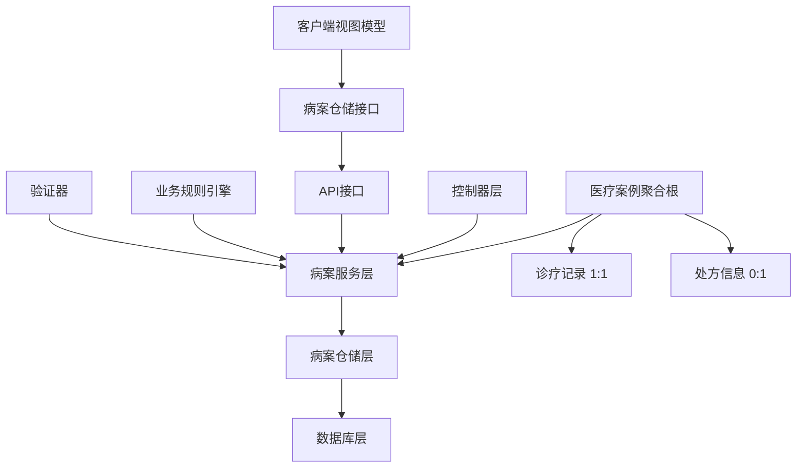
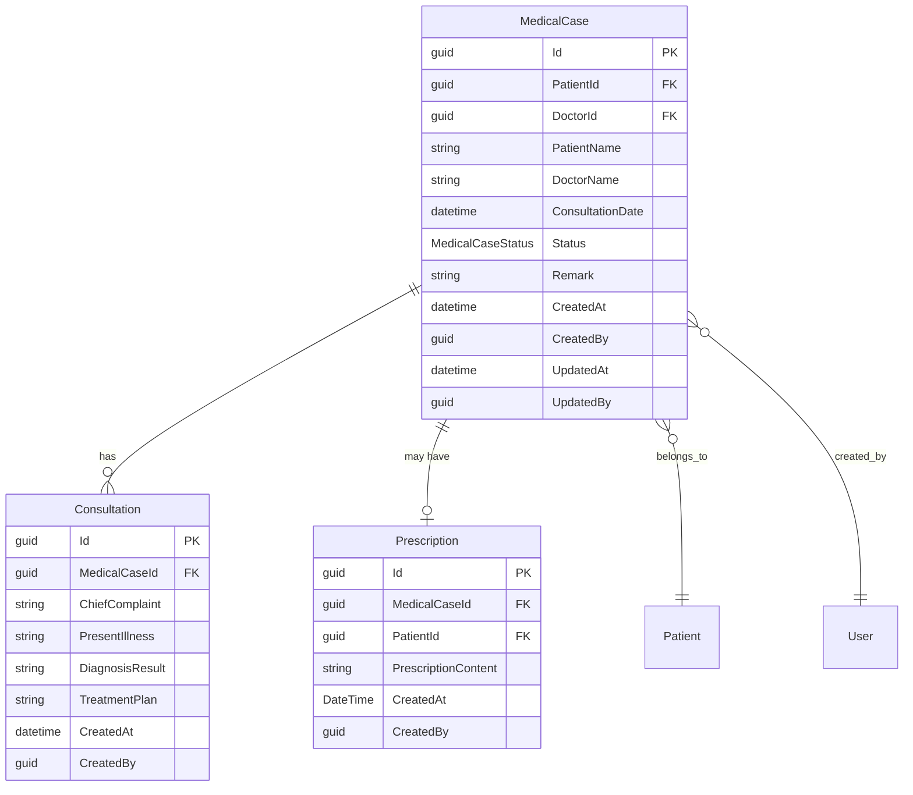
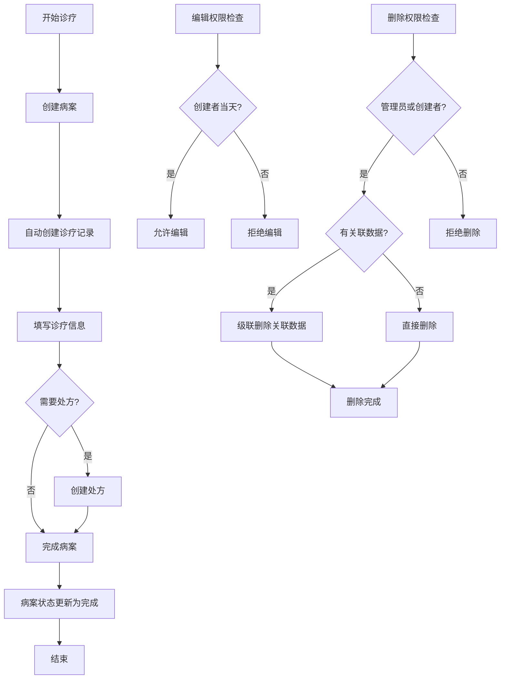

# 病案管理模块文档

> **版本**: 1.0
> **创建日期**: 2025-10-15
> **最后更新**: 2025-10-15
> **维护者**: 项目团队
> **相关模块**: [患者管理模块](../patients/README.md) | [诊疗管理模块](../consultation/README.md) | [处方管理模块](../prescriptions/README.md)

## 📋 文档概述

本文档为病案管理模块提供全面的技术文档和使用指南，包括模块功能、架构设计、使用方法、集成指南和维护说明。病案管理模块是 LYBT 系统的核心业务模块之一，负责管理患者的完整诊疗档案，实现"一病案一诊断，一病案至多一处方"的业务模式。

## 🎯 模块简介

### 模块用途
病案管理模块是 LYBT 系统的核心业务模块，负责管理患者的完整诊疗档案。模块采用聚合根模式，以病案为核心，统一管理诊疗记录和处方信息，确保诊疗流程的连贯性和数据一致性。

### 核心功能
- **病案创建**: 创建新病案并自动关联诊疗记录
- **诊疗管理**: 管理完整的诊疗流程和诊断信息
- **处方关联**: 支持病案与处方的关联管理
- **状态管理**: 完整的病案生命周期状态管理
- **查询统计**: 多维度病案查询和统计分析
- **批量操作**: 支持病案的批量处理和管理

### 业务价值
- 提高诊疗效率 25%，实现诊疗流程一体化管理
- 确保医疗数据完整性，避免信息孤岛
- 支持临床决策，提供完整的患者诊疗历史
- 满足医疗合规要求，完整的审计追踪

## 🏗️ 架构设计

### 模块架构


### 核心组件

#### MedicalCaseService（病案服务）
- **用途**: 核心业务逻辑处理，病案CRUD操作
- **职责**: 病案生命周期管理、业务规则验证、聚合操作
- **接口**: IMedicalCaseService
- **依赖**: IMedicalCaseRepository, IMapper, ILogger

#### MedicalCaseRepository（病案仓储）
- **用途**: 数据访问抽象，实现病案持久化操作
- **职责**: 数据库操作、查询优化、事务管理
- **接口**: IMedicalCaseRepository
- **依赖**: DbContext, BaseRepository

#### MedicalCaseRules（业务规则）
- **用途**: 业务规则验证和约束检查
- **职责**: 病案创建验证、更新权限检查、删除约束
- **接口**: 静态工具类
- **依赖**: 无

### 数据流
1. **病案创建流程**: 用户请求 → 业务规则验证 → 聚合根创建 → 级联保存 → 返回结果
2. **病案查询流程**: 查询请求 → 权限检查 → 数据检索 → 映射转换 → 返回DTO
3. **状态更新流程**: 更新请求 → 状态验证 → 业务规则检查 → 数据更新 → 审计记录

## 🔧 技术实现

### Server 端实现

#### 实体模型
```csharp
/// <summary>
/// 医疗案例实体 - 聚合根
/// 作为聚合根，管理完整诊疗流程
/// 一病案一诊断，一病案至多一处方
/// </summary>
[Table("MedicalCases")]
public class MedicalCase : BaseEntity
{
    [Required]
    public Guid PatientId { get; set; }
    
    [Required]
    [StringLength(50)]
    public string PatientName { get; set; } = string.Empty;
    
    [Required]
    public Guid DoctorId { get; set; }
    
    [Required]
    [StringLength(50)]
    public string DoctorName { get; set; } = string.Empty;
    
    public DateTime ConsultationDate { get; set; } = DateTime.Now;
    
    public MedicalCaseStatus Status { get; set; } = MedicalCaseStatus.Active;
    
    [StringLength(500)]
    public string? Remark { get; set; }
    
    // 导航属性 - 聚合关系
    public virtual Consultation? Consultation { get; set; }
    public virtual Prescription? Prescription { get; set; }
    
    // 业务方法
    public bool CanEdit(bool isAdmin, Guid? currentUserId = null)
    {
        if (isAdmin) return true;
        if (currentUserId.HasValue && DoctorId == currentUserId.Value)
        {
            return CreatedAt.Date == DateTime.Today;
        }
        return false;
    }
    
    public bool IsLocked => CreatedAt.Date < DateTime.Today;
}
```

#### 服务接口
```csharp
public interface IMedicalCaseService
{
    Task<ServiceResult<PagedResult<MedicalCaseDto>>> GetPagedAsync(int page = 1, int pageSize = 20, string? keyword = null);
    Task<ServiceResult<MedicalCaseDto>> GetByIdAsync(Guid id);
    Task<ServiceResult<MedicalCaseDto>> CreateAsync(MedicalCaseCreateDto dto);
    Task<ServiceResult<MedicalCaseDto>> UpdateAsync(Guid id, MedicalCaseUpdateDto dto);
    Task<ServiceResult> DeleteAsync(Guid id);
    Task<ServiceResult<BatchOperationResultDto>> BatchDeleteAsync(List<Guid> ids);
    Task<ServiceResult<List<MedicalCaseDto>>> GetByPatientIdAsync(Guid patientId);
    Task<ServiceResult<MedicalCaseDto>> CreateWithDetailsAsync(MedicalCaseCreateDto caseDto, ConsultationCreateDto consultationDto, PrescriptionCreateDto? prescriptionDto = null);
    Task<ServiceResult<MedicalCaseDetailDto>> GetByIdWithDetailsAsync(Guid id);
}
```

#### 控制器
```csharp
[ApiController]
[Route("api/[controller]")]
public class MedicalCaseController : BaseApiController
{
    private readonly IMedicalCaseService _medicalCaseService;
    
    [HttpGet]
    public async Task<ActionResult<ApiResult<PagedResult<MedicalCaseDto>>>> GetPaged([FromQuery] MedicalCaseQueryDto query)
    {
        var result = await _medicalCaseService.GetPagedAsync(query.PageNumber, query.PageSize, query.Keyword);
        return Ok(ApiResult<PagedResult<MedicalCaseDto>>.Success(result.Data));
    }
    
    [HttpGet("{id}")]
    public async Task<ActionResult<ApiResult<MedicalCaseDto>>> GetById(Guid id)
    {
        var result = await _medicalCaseService.GetByIdAsync(id);
        return result.IsSuccess ? Ok(ApiResult<MedicalCaseDto>.Success(result.Data)) : BadRequest(ApiResult<MedicalCaseDto>.Failure(result.Message));
    }
    
    [HttpPost]
    public async Task<ActionResult<ApiResult<MedicalCaseDto>>> Create([FromBody] MedicalCaseCreateDto dto)
    {
        var result = await _medicalCaseService.CreateAsync(dto);
        return result.IsSuccess ? Ok(ApiResult<MedicalCaseDto>.Success(result.Data)) : BadRequest(ApiResult<MedicalCaseDto>.Failure(result.Message));
    }
}
```

### Client 端实现

#### ViewModel
```csharp
/// <summary>
/// 病历管理主视图模型 - UltraThink精简架构
/// 作为病历模块的主导航和管理容器
/// </summary>
public class MedicalCaseManagementViewModel : UnifiedViewModelBase
{
    private readonly IMedicalCaseRepository _medicalCaseRepository;
    
    #region 导航属性
    private string _activeView = "MedicalCaseListView";
    public string ActiveView
    {
        get => _activeView;
        set => SetProperty(ref _activeView, value);
    }
    #endregion
    
    #region 命令
    public DelegateCommand ShowListCommand { get; }
    public DelegateCommand CreateNewCommand { get; }
    public DelegateCommand RefreshCommand { get; }
    public DelegateCommand BackToHomeCommand { get; }
    public DelegateCommand SearchCommand { get; }
    public DelegateCommand<object> ViewDetailsCommand { get; }
    public DelegateCommand<object> EditCommand { get; }
    public DelegateCommand<object> DeleteCommand { get; }
    #endregion
    
    // 核心方法
    private void CreateNew()
    {
        NavigateTo("MedicalCaseContentRegion", "CreateMedicalCaseView");
        ActiveView = "CreateMedicalCaseView";
    }
    
    public void NavigateToDetail(Guid medicalCaseId, bool isReadOnly = false)
    {
        var parameters = new NavigationParameters
        {
            { "MedicalCaseId", medicalCaseId },
            { "IsReadOnly", isReadOnly }
        };
        
        NavigateTo("MedicalCaseContentRegion", "MedicalCaseDetailView", parameters);
        ActiveView = "MedicalCaseDetailView";
    }
}
```

#### Repository
```csharp
/// <summary>
/// 病案仓储 - 客户端数据访问层
/// </summary>
public class MedicalCaseRepository : RepositoryBase<MedicalCaseDto, MedicalCaseCreateDto, MedicalCaseUpdateDto, IMedicalCaseApi>, IMedicalCaseRepository
{
    public MedicalCaseRepository(IMedicalCaseApi api, IMapper mapper, ILogger<MedicalCaseRepository> logger)
        : base(api, mapper, logger)
    {
    }
    
    public async Task<ServiceResult<List<MedicalCaseDto>>> GetByPatientIdAsync(Guid patientId)
    {
        try
        {
            var result = await Api.GetByPatientIdAsync(patientId);
            return ServiceResult<List<MedicalCaseDto>>.Success(result);
        }
        catch (Exception ex)
        {
            _logger.LogError(ex, "根据患者ID获取病案失败");
            return ServiceResult<List<MedicalCaseDto>>.Failure("获取病案失败");
        }
    }
}
```

#### View
```xml
<!-- 病案管理主界面 -->
<UserControl x:Class="LYBT.Desktop.MedicalCase.Views.MedicalCaseManagementView">
    <Grid>
        <Grid.RowDefinitions>
            <RowDefinition Height="Auto"/>
            <RowDefinition Height="*"/>
        </Grid.RowDefinitions>
        
        <!-- 工具栏 -->
        <StackPanel Grid.Row="0" Orientation="Horizontal" Margin="10">
            <Button Content="新建病案" Command="{Binding CreateNewCommand}" 
                    Style="{StaticResource PrimaryButtonStyle}" Margin="0,0,10,0"/>
            <Button Content="刷新" Command="{Binding RefreshCommand}" 
                    Style="{StaticResource SecondaryButtonStyle}" Margin="0,0,10,0"/>
            <Button Content="返回主页" Command="{Binding BackToHomeCommand}" 
                    Style="{StaticResource SecondaryButtonStyle}"/>
        </StackPanel>
        
        <!-- 内容区域 -->
        <ContentControl Grid.Row="1" prism:RegionManager.RegionName="MedicalCaseContentRegion"/>
    </Grid>
</UserControl>
```

## 📊 数据模型

### 核心实体关系


### 数据传输对象 (DTOs)

#### MedicalCaseDto
```csharp
/// <summary>
/// 医疗案例DTO - UltraThink v2.0简化版
/// 与MedicalCase实体对齐，保留ConsultationDate
/// </summary>
public class MedicalCaseDto : StatusDto, IRemarkable
{
    [DisplayName("案例编号")]
    [StringLength(50, ErrorMessage = "案例编号长度不能超过50个字符")]
    public string? CaseNumber { get; set; }

    [DisplayName("主诉")]
    [StringLength(500, ErrorMessage = "主诉长度不能超过500个字符")]
    public string? ChiefComplaint { get; set; }

    [DisplayName("患者ID")]
    public Guid PatientId { get; set; }

    [DisplayName("患者姓名")]
    public string PatientName { get; set; } = string.Empty;

    [DisplayName("患者性别")]
    public string? PatientGender { get; set; }

    [DisplayName("患者年龄")]
    public int? PatientAge { get; set; }

    [DisplayName("医生ID")]
    public Guid DoctorId { get; set; }

    [DisplayName("医生姓名")]
    public string DoctorName { get; set; } = string.Empty;

    [DisplayName("诊疗时间")]
    public DateTime ConsultationDate { get; set; } = DateTime.Now;

    [DisplayName("案例状态")]
    public MedicalCaseStatus CaseStatus { get; set; } = MedicalCaseStatus.Active;

    [DisplayName("备注")]
    [StringLength(500, ErrorMessage = "备注长度不能超过500个字符")]
    public string? Remark { get; set; }

    // 业务方法
    public int GetPriority()
    {
        var hoursElapsed = (DateTime.Now - ConsultationDate).TotalHours;
        if (hoursElapsed > 48) return 3;
        if (hoursElapsed > 24) return 2;
        return 1;
    }

    public bool IsUrgent() => GetPriority() >= 3;
    public bool NeedsDoctorAttention() => CaseStatus != MedicalCaseStatus.Closed && (DateTime.Now - ConsultationDate).TotalHours > 24;
}
```

#### MedicalCaseCreateDto
```csharp
/// <summary>
/// 创建医疗案例DTO - 继承医疗案例输入基础DTO
/// </summary>
public class MedicalCaseCreateDto : MedicalCaseInputBaseDto
{
    [DisplayName("案例编号")]
    [StringLength(50, ErrorMessage = "案例编号长度不能超过50个字符")]
    public string? CaseNumber { get; set; }

    [DisplayName("主诉")]
    [StringLength(1000, ErrorMessage = "主诉长度不能超过1000个字符")]
    public string? ChiefComplaint { get; set; }

    [DisplayName("现病史")]
    [StringLength(2000, ErrorMessage = "现病史长度不能超过2000个字符")]
    public string? PresentIllnessHistory { get; set; }

    [DisplayName("既往史")]
    [StringLength(1000, ErrorMessage = "既往史长度不能超过1000个字符")]
    public string? PastMedicalHistory { get; set; }

    [DisplayName("状态")]
    public MedicalCaseStatus Status { get; set; } = MedicalCaseStatus.Active;

    [StringLength(200, ErrorMessage = "诊断摘要长度不能超过200个字符")]
    [DisplayName("诊断摘要")]
    public string? DiagnosisSummary { get; set; }
}
```

#### MedicalCaseUpdateDto
```csharp
/// <summary>
/// 更新医疗案例DTO - 继承编辑DTO，用于更复杂的更新操作
/// </summary>
public class MedicalCaseUpdateDto : MedicalCaseEditDto
{
    [StringLength(1000, ErrorMessage = "体格检查长度不能超过1000个字符")]
    [DisplayName("体格检查")]
    public string? PhysicalExamination { get; set; }

    [StringLength(1000, ErrorMessage = "辅助检查长度不能超过1000个字符")]
    [DisplayName("辅助检查")]
    public string? AuxiliaryExamination { get; set; }

    [StringLength(1000, ErrorMessage = "处方信息长度不能超过1000个字符")]
    [DisplayName("处方信息")]
    public string? PrescriptionInfo { get; set; }

    [StringLength(1000, ErrorMessage = "随访计划长度不能超过1000个字符")]
    [DisplayName("随访计划")]
    public string? FollowUpPlan { get; set; }
}
```

## 🔌 API 接口

### REST API 端点

#### 获取病案列表
```
GET /api/medicalcase
参数:
  - pageNumber: 页码 (从1开始)
  - pageSize: 每页数量 (默认20)
  - searchKeyword: 搜索关键词 (可选)
  - patientId: 患者ID (可选)
  - doctorId: 医生ID (可选)
  - caseStatus: 案例状态 (可选)
响应:
  - data: 病案列表
  - totalCount: 总记录数
  - pageNumber: 当前页码
  - pageSize: 每页数量
```

#### 获取病案详情
```
GET /api/medicalcase/{id}
参数: id (Guid)
响应: 病案详细信息，包含关联的诊疗记录和处方信息
```

#### 创建病案
```
POST /api/medicalcase
请求体: 
{
  "patientId": "guid",
  "doctorId": "guid",
  "chiefComplaint": "主诉内容",
  "presentIllnessHistory": "现病史",
  "pastMedicalHistory": "既往史",
  "diagnosisSummary": "诊断摘要",
  "status": "Active",
  "remark": "备注信息"
}
响应: 创建成功的病案信息
```

#### 创建完整病案（包含诊疗和处方）
```
POST /api/medicalcase/create-with-details
请求体:
{
  "medicalCase": {
    "patientId": "guid",
    "doctorId": "guid",
    "chiefComplaint": "主诉"
  },
  "consultation": {
    "chiefComplaint": "主诉",
    "presentIllness": "现病史",
    "diagnosisResult": "诊断结果"
  },
  "prescription": {
    "prescriptionContent": "处方内容",
    "usageInstructions": "用法说明"
  }
}
响应: 创建的完整病案信息
```

#### 更新病案
```
PUT /api/medicalcase/{id}
参数: id (Guid)
请求体: 病案更新信息
响应: 更新后的病案信息
```

#### 删除病案
```
DELETE /api/medicalcase/{id}
参数: id (Guid)
响应: 删除操作结果
```

#### 批量删除病案
```
POST /api/medicalcase/batch-delete
请求体:
{
  "ids": ["guid1", "guid2", "guid3"]
}
响应: 批量操作结果
```

### API 请求/响应示例

#### 获取病案列表请求示例
```json
{
  "pageNumber": 1,
  "pageSize": 20,
  "searchKeyword": "感冒",
  "patientId": "a1b2c3d4-e5f6-7890-abcd-ef1234567890",
  "caseStatus": "Active"
}
```

#### 响应示例
```json
{
  "success": true,
  "data": {
    "items": [
      {
        "id": "a1b2c3d4-e5f6-7890-abcd-ef1234567890",
        "patientId": "b2c3d4e5-f6a7-8901-bcde-f23456789012",
        "patientName": "张三",
        "patientGender": "男",
        "patientAge": 35,
        "doctorId": "c3d4e5f6-a7b8-9012-cdef-345678901234",
        "doctorName": "李医生",
        "consultationDate": "2025-10-15T09:30:00Z",
        "caseStatus": "Active",
        "chiefComplaint": "发热、咳嗽",
        "remark": "患者体温38.5℃",
        "createdAt": "2025-10-15T09:30:00Z",
        "updatedAt": "2025-10-15T10:15:00Z"
      }
    ],
    "totalCount": 1,
    "pageNumber": 1,
    "pageSize": 20
  },
  "message": "获取病案列表成功"
}
```

## 👥 用户界面

### 主界面功能
病案管理模块提供完整的病案管理界面，包括：
- **病案列表**: 分页显示病案列表，支持搜索和筛选
- **病案详情**: 显示病案完整信息，包括诊疗记录和处方
- **病案创建**: 创建新病案，支持同时创建诊疗记录
- **病案编辑**: 编辑病案信息，受业务规则约束
- **批量操作**: 支持批量删除等操作

### 关键用户流程

#### 病案创建流程
1. **选择患者**: 从患者列表中选择或搜索患者
2. **填写病案信息**: 输入主诉、现病史、既往史等
3. **创建诊疗记录**: 自动关联创建诊疗记录
4. **可选处方**: 根据需要创建处方信息
5. **保存病案**: 聚合根统一保存，确保数据一致性

#### 病案查询流程
1. **进入列表**: 显示病案列表视图
2. **条件筛选**: 按患者、医生、状态等条件筛选
3. **关键词搜索**: 在主诉、诊断中搜索关键词
4. **查看详情**: 点击查看病案详细信息
5. **关联操作**: 从病案可以跳转到相关诊疗和处方

#### 病案状态管理流程
1. **创建状态**: 新建病案默认为Active状态
2. **进行中**: 诊疗过程中的病案状态
3. **完成**: 诊疗完成，病案关闭
4. **锁定**: 超过当天的病案自动锁定，不可编辑
5. **归档**: 历史病案归档保存

### 界面截图
[在此添加病案管理界面截图]

## 🔄 业务流程

### 核心业务流程


### 业务规则
- **创建规则**: 每个患者只能有一个活跃的病案
- **编辑规则**: 创建者当天可编辑，管理员无时间限制
- **删除规则**: 管理员可删除任何病案，创建者只能删除自己的病案
- **聚合规则**: 删除病案时级联删除关联的诊疗记录和处方
- **状态规则**: 病案完成前必须填写完整的诊疗信息

## 🔗 集成指南

### 与其他模块的集成

#### 患者管理模块集成
- **集成方式**: API调用 + 事件订阅
- **接口定义**: 获取患者基本信息、患者历史病案查询
- **数据格式**: 患者DTO，包含基本 demographics 信息
- **错误处理**: 患者不存在时阻止病案创建

#### 诊疗管理模块集成
- **集成方式**: 聚合根内部管理（1:1关系）
- **接口定义**: 诊疗记录的CRUD操作
- **数据格式**: 诊疗DTO，包含主诉、诊断等信息
- **错误处理**: 诊疗信息不完整时阻止病案完成

#### 处方管理模块集成
- **集成方式**: 聚合根内部管理（0:1关系）
- **接口定义**: 处方的创建、更新、删除操作
- **数据格式**: 处方DTO，包含药品和用法信息
- **错误处理**: 处方药品库存不足时的提醒机制

#### 用户管理模块集成
- **集成方式**: 服务调用获取用户信息
- **接口定义**: 医生信息查询、权限验证
- **数据格式**: 用户DTO，包含姓名、角色等信息
- **错误处理**: 医生权限不足时的拒绝访问

### 外部系统集成
- **电子病历系统**: HL7标准接口，支持病案信息交换
- **医保系统**: RESTful API，病案费用信息同步
- **LIS系统**: WebService接口，检验结果关联
- **PACS系统**: DICOM接口，影像资料关联

## ⚙️ 配置说明

### 系统配置
```json
{
  "MedicalCase": {
    "MaxActiveCasesPerPatient": 1,
    "EditPeriodHours": 24,
    "AutoArchiveDays": 365,
    "BatchDeleteMaxSize": 100,
    "EnableAuditLog": true,
    "CacheEnabled": true,
    "CacheExpirationMinutes": 30
  }
}
```

### 环境变量
- `MEDICALCASE_CONNECTION_STRING`: 数据库连接字符串
- `MEDICALCASE_CACHE_REDIS`: Redis缓存连接（可选）
- `MEDICALCASE_ENABLE_AUDIT`: 是否启用审计日志
- `MEDICALCASE_MAX_EDIT_HOURS`: 最大编辑小时数

### 依赖注入配置
```csharp
// Server 端 DI 配置
services.AddScoped<IMedicalCaseService, MedicalCaseService>();
services.AddScoped<IMedicalCaseRepository, MedicalCaseRepository>();
services.AddValidatorsFromAssemblyContaining<MedicalCaseCreateDtoValidator>();
services.AddScoped<MedicalCaseRules>();

// AutoMapper 配置
services.AddAutoMapper(typeof(MedicalCaseMappingProfile));

// Client 端 DI 配置
services.AddScoped<IMedicalCaseRepository, MedicalCaseRepository>();
services.AddScoped<MedicalCaseManagementViewModel>();
services.AddScoped<MedicalCaseListViewModel>();
services.AddScoped<MedicalCaseDetailViewModel>();
```

## 🧪 测试指南

### 单元测试
```csharp
[Test]
public async Task MedicalCaseService_Create_ShouldReturnCorrectData()
{
    // Arrange
    var createDto = new MedicalCaseCreateDto
    {
        PatientId = _testPatientId,
        DoctorId = _testDoctorId,
        ChiefComplaint = "测试主诉"
    };
    
    // Act
    var result = await _service.CreateAsync(createDto);
    
    // Assert
    Assert.IsTrue(result.IsSuccess);
    Assert.IsNotNull(result.Data);
    Assert.AreEqual(createDto.ChiefComplaint, result.Data.ChiefComplaint);
}

[Test]
public async Task MedicalCaseService_CreateWithDetails_ShouldCreateConsultation()
{
    // Arrange
    var caseDto = new MedicalCaseCreateDto { /* ... */ };
    var consultationDto = new ConsultationCreateDto { /* ... */ };
    
    // Act
    var result = await _service.CreateWithDetailsAsync(caseDto, consultationDto);
    
    // Assert
    Assert.IsTrue(result.IsSuccess);
    Assert.IsNotNull(result.Data.ConsultationId);
}
```

### 集成测试
```csharp
[Test]
public async Task MedicalCaseController_CreateWithDetails_ShouldReturn201()
{
    // Arrange
    var request = new MedicalCaseWithDetailsCreateDto
    {
        MedicalCase = new MedicalCaseCreateDto { /* ... */ },
        Consultation = new ConsultationCreateDto { /* ... */ }
    };
    
    // Act
    var response = await _controller.CreateWithDetails(request);
    
    // Assert
    var createdResult = response as CreatedAtActionResult;
    Assert.IsNotNull(createdResult);
    Assert.AreEqual(201, createdResult.StatusCode);
}
```

### 测试覆盖率要求
- **服务层逻辑**: ≥ 90%
- **业务规则验证**: ≥ 95%
- **数据访问层**: ≥ 85%
- **控制器层**: ≥ 80%
- **客户端ViewModel**: ≥ 75%

## 🚀 部署指南

### 部署要求
- **服务器要求**: 
  - CPU: 4核心以上
  - 内存: 8GB以上
  - 存储: 100GB以上可用空间
- **数据库要求**: 
  - SQL Server 2019+
  - 支持事务和行级锁
  - 配置适当的连接池
- **网络要求**: 
  - 内网带宽100Mbps以上
  - 支持HTTPS
  - 防火墙配置允许API端口访问

### 部署步骤
1. **数据库迁移**: 运行MedicalCase相关的数据库迁移脚本
2. **配置更新**: 更新appsettings.json中的MedicalCase配置
3. **服务注册**: 在DI容器中注册MedicalCase相关服务
4. **权限配置**: 配置病案管理相关的用户权限
5. **缓存配置**: 配置Redis缓存（如启用）
6. **监控配置**: 配置健康检查和性能监控

### 配置验证
- **数据库连接**: 验证MedicalCase表和相关索引创建成功
- **API接口**: 验证所有MedicalCase API端点正常响应
- **权限检查**: 验证不同角色用户的权限控制正确
- **业务规则**: 验证病案创建、编辑、删除的业务规则正确执行

## 🔍 故障排除

### 常见问题

#### 病案创建失败
- **症状**: 创建病案时返回错误，提示"患者已有活跃病案"
- **原因**: 患者当前已有未完成的病案
- **解决方案**: 
  1. 检查患者是否已有活跃病案
  2. 完成或取消现有病案后再创建新病案
  3. 联系管理员强制关闭现有病案
- **预防措施**: 在病案创建前检查患者状态

#### 病案无法编辑
- **症状**: 编辑病案时提示"病案已锁定"
- **原因**: 病案创建时间超过24小时或状态不允许编辑
- **解决方案**: 
  1. 检查病案创建时间（当天可编辑）
  2. 检查用户权限（创建者或管理员）
  3. 联系管理员处理特殊情况
- **预防措施**: 及时完成病案信息填写

#### 批量删除失败
- **症状**: 批量删除操作部分失败
- **原因**: 部分病案有关联数据或权限不足
- **解决方案**: 
  1. 检查失败病案的具体错误信息
  2. 手动处理有问题的病案
  3. 分批次执行删除操作
- **预防措施**: 删除前检查关联数据状态

#### 数据性能问题
- **症状**: 病案查询响应缓慢
- **原因**: 数据量大、缺少索引、查询条件复杂
- **解决方案**: 
  1. 检查数据库索引配置
  2. 优化查询条件和分页参数
  3. 启用查询缓存
- **预防措施**: 定期维护数据库索引和统计信息

### 调试工具
- **日志查看**: 
  - 位置: `logs/medicalcase*.log`
  - 级别: Debug, Information, Warning, Error
  - 格式: JSON格式，包含请求ID和用户信息
- **性能监控**: 
  - Application Insights监控API响应时间
  - 数据库性能监控
  - 内存使用情况监控
- **健康检查**: 
  - 端点: `/health/medicalcase`
  - 检查项目: 数据库连接、缓存状态、服务可用性

## 📈 性能优化

### 性能指标
- **响应时间**: 
  - 简单查询: < 200ms
  - 复杂查询: < 500ms
  - 病案创建: < 300ms
- **并发处理**: 
  - 支持100+并发用户
  - 数据库连接池: 20-50个连接
- **内存使用**: 
  - 单个病案记录: < 5KB
  - 查询结果缓存: < 100MB
- **数据库性能**: 
  - 查询优化: 使用适当的索引
  - 事务时间: < 1秒

### 优化策略
- **缓存策略**: 
  - Redis缓存活跃病案信息
  - 本地缓存医生和患者基础信息
  - 缓存过期时间: 30分钟
- **数据库优化**: 
  - 患者ID、医生ID、创建时间索引
  - 分页查询优化
  - 读写分离（如需要）
- **异步处理**: 
  - 病案创建使用异步方法
  - 批量操作异步处理
  - 后台任务处理历史数据归档
- **资源管理**: 
  - 数据库连接池管理
  - 内存使用监控和垃圾回收
  - 定期清理过期缓存数据

## 🔒 安全考虑

### 安全措施
- **身份验证**: 
  - JWT Token验证
  - 用户身份确认
  - 会话超时控制
- **授权控制**: 
  - 基于角色的访问控制
  - 医生只能操作自己的病案
  - 管理员拥有全部权限
- **数据保护**: 
  - 敏感数据加密存储
  - 传输层TLS加密
  - 数据脱敏显示
- **审计日志**: 
  - 记录所有病案操作
  - 包含用户、时间、操作内容
  - 日志保留期限: 7年

### 安全最佳实践
- **最小权限原则**: 用户只能访问必要的病案信息
- **数据完整性**: 使用数据库约束和业务规则验证
- **访问控制**: 实现严格的权限检查和角色管理
- **日志监控**: 监控异常访问模式和操作行为
- **定期审计**: 定期审查病案访问日志和权限配置

## 📚 参考资料

### 相关文档
- [模块文档模板](../template/module-document-template.md)
- [模块文档编写指南](../template/module-document-writing-guide.md)
- [模块文档质量检查清单](../template/module-document-quality-checklist.md)
- [患者管理模块](../patients/README.md)
- [诊疗管理模块](../consultation/README.md)
- [处方管理模块](../prescriptions/README.md)

### 技术文档
- [Server端三层架构标准](../../../architecture/server-module-design-standard.md)
- [Client端MVVM设计标准](../../../architecture/client/unified-design-standard.md)
- [依赖注入配置指南](../../../development/repository-dependency-injection-guide.md)
- [测试架构标准](../../../development/test-architecture-standard.md)

### API文档
- [MedicalCase API Reference](../../../api/medicalcase-api.md)
- [Authentication API](../../../api/authentication-api.md)
- [Patient API](../../../api/patient-api.md)

## 🔄 版本历史

| 版本 | 日期 | 更新内容 | 作者 |
|------|------|----------|------|
| 1.0 | 2025-10-15 | 初始版本，包含完整的病案管理模块文档 | Claude Code |

## 📞 联系方式

- **维护者**: 项目开发团队
- **技术支持**: 病案管理模块开发组
- **文档反馈**: GitHub Issues 或内部文档反馈系统

---

*本文档遵循 LYBT 项目文档标准编写，如有疑问请参考相关模板或联系维护者。*