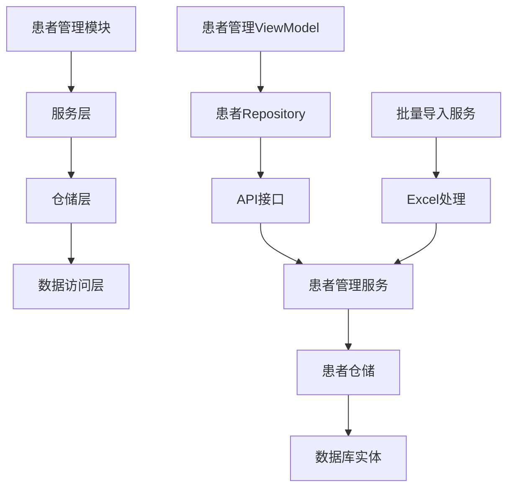
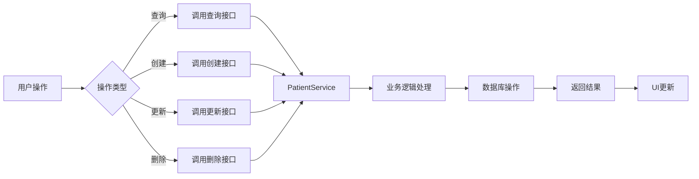
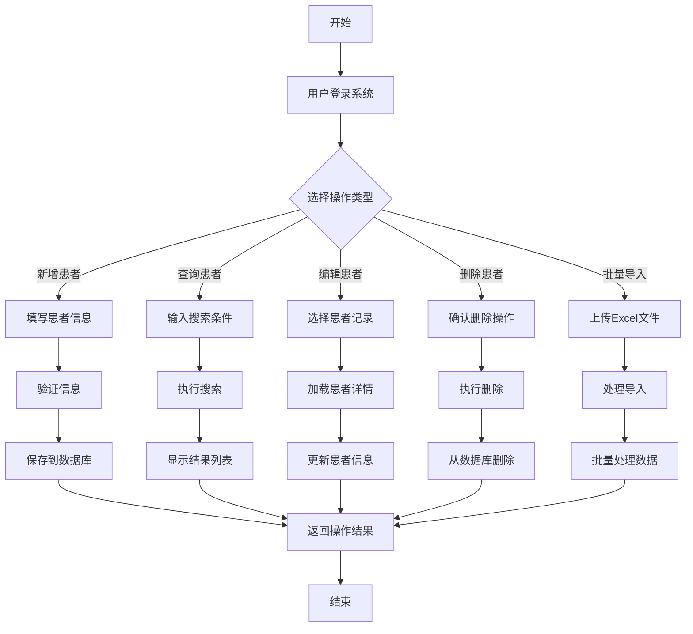

# 患者管理模块 (Patients Module)

> **版本**: 1.0
> **创建日期**: 2025-10-15
> **维护者**: LYBT 开发团队
> **相关模块**: [医疗记录模块](../medical-case/), [辨证模块](../consultation/), [处方模块](../prescriptions/)
> **依赖模块**: 认证模块 (Auth), 用户管理模块 (Users)

## 📋 文档概述

本文档详细介绍 LYBT 系统的患者管理模块，包括模块架构、技术实现、API 接口、使用方法和集成指南。患者管理模块是系统的核心模块之一，负责管理患者的基本信息、就诊记录和医疗档案。

## 🎯 模块简介

### 模块用途
患者管理模块是 LYBT 系统的核心模块之一，负责管理患者的基本信息、就诊记录和医疗档案。支持患者信息的全生命周期管理，从建档到随访的完整流程。

### 核心功能
- **患者建档**: 创建和维护患者基本信息
- **信息查询**: 提供多维度患者信息检索功能
- **信息管理**: 支持患者信息的修改和更新
- **数据导入**: 支持从 Excel 文件批量导入患者数据
- **档案管理**: 管理患者的医疗文档和检查报告

### 业务价值
- 提高患者信息管理效率 30%
- 减少信息查找时间 50%
- 确保患者数据的安全性和完整性
- 支持临床决策和患者随访

## 🏗️ 架构设计

### 模块架构



### 核心组件

#### Server 端组件
- **PatientService**: 患者管理服务，处理业务逻辑
- **PatientRepository**: 数据访问仓储，负责数据库操作
- **IPatientService**: 患者服务接口，定义服务契约
- **AutoMapper**: 对象映射，处理 DTO 转换

#### Client 端组件
- **PatientManagementViewModel**: 患者管理主界面 ViewModel
- **PatientDetailViewModel**: 患者详情 ViewModel
- **PatientCreateViewModel**: 患者创建 ViewModel
- **PatientRepository**: 客户端数据访问仓储
- **PatientManagementView**: 患者管理主界面

### 数据流



## 🔧 技术实现

### Server 端实现

#### 实体模型
```csharp
public class Patient
{
    public Guid Id { get; set; }
    public string Name { get; set; }
    public Gender Gender { get; set; }
    public DateTime? BirthDate { get; set; }
    public string IdNumber { get; set; }
    public string PhoneNumber { get; set; }
    public string Address { get; set; }
    public DateTime CreatedAt { get; set; }
    public DateTime UpdatedAt { get; set; }
}

public enum Gender
{
    Unknown = 0,
    Male = 1,
    Female = 2
}
```

#### 服务接口
```csharp
public interface IPatientService
{
    Task<ServiceResult<PagedResult<PatientDto>>> GetPagedAsync(int page = 1, int pageSize = 20, string? keyword = null);
    Task<ServiceResult<PatientDto>> GetByIdAsync(Guid id);
    Task<ServiceResult<PatientDto>> CreateAsync(PatientCreateDto dto);
    Task<ServiceResult<PatientDto>> UpdateAsync(Guid id, PatientUpdateDto dto);
    Task<ServiceResult<List<PatientDto>>> SearchAsync(string keyword);
    Task<ServiceResult> DeleteAsync(Guid id);
    Task<ServiceResult<ImportResultDto<PatientDto>>> ImportFromExcelAsync(Stream stream, string? fileName = null);
    MemoryStream GenerateImportTemplate();
}
```

#### 控制器
```csharp
[ApiController]
[Route("api/[controller]")]
public class PatientsController : ControllerBase
{
    private readonly IPatientService _patientService;

    public PatientsController(IPatientService patientService)
    {
        _patientService = patientService;
    }

    [HttpGet]
    public async Task<ActionResult<PagedResult<PatientDto>>> GetPaged(
        [FromQuery] int page = 1,
        [FromQuery] int pageSize = 20,
        [FromQuery] string? keyword = null)
    {
        var result = await _patientService.GetPagedAsync(page, pageSize, keyword);
        if (result.IsSuccess)
            return Ok(result.Data);
        return BadRequest(result.Message);
    }

    [HttpGet("{id}")]
    public async Task<ActionResult<PatientDto>> GetById(Guid id)
    {
        var result = await _patientService.GetByIdAsync(id);
        if (result.IsSuccess)
            return Ok(result.Data);
        return NotFound(result.Message);
    }

    [HttpPost]
    public async Task<ActionResult<PatientDto>> Create([FromBody] PatientCreateDto dto)
    {
        var result = await _patientService.CreateAsync(dto);
        if (result.IsSuccess)
            return CreatedAtAction(nameof(GetById), new { id = result.Data.Id }, result.Data);
        return BadRequest(result.Message);
    }

    [HttpPut("{id}")]
    public async Task<ActionResult<PatientDto>> Update(Guid id, [FromBody] PatientUpdateDto dto)
    {
        var result = await _patientService.UpdateAsync(id, dto);
        if (result.IsSuccess)
            return Ok(result.Data);
        return BadRequest(result.Message);
    }

    [HttpDelete("{id}")]
    public async Task<ActionResult> Delete(Guid id)
    {
        var result = await _patientService.DeleteAsync(id);
        if (result.IsSuccess)
            return Ok();
        return BadRequest(result.Message);
    }

    [HttpGet("search")]
    public async Task<ActionResult<List<PatientDto>>> Search([FromQuery] string keyword)
    {
        var result = await _patientService.SearchAsync(keyword);
        if (result.IsSuccess)
            return Ok(result.Data);
        return BadRequest(result.Message);
    }

    [HttpPost("import")]
    public async Task<ActionResult<ImportResultDto<PatientDto>>> ImportFromExcel(IFormFile file)
    {
        var result = await _patientService.ImportFromExcelAsync(file.OpenReadStream(), file.FileName);
        if (result.IsSuccess)
            return Ok(result.Data);
        return BadRequest(result.Message);
    }

    [HttpGet("import-template")]
    public IActionResult GetImportTemplate()
    {
        var stream = _patientService.GenerateImportTemplate();
        return File(stream, "application/vnd.openxmlformats-officedocument.spreadsheetml.sheet", "患者导入模板.xlsx");
    }
}
```

### Client 端实现

#### ViewModel
```csharp
public class PatientManagementViewModel : UnifiedViewModelBase
{
    private readonly IPatientRepository _repository;

    public ObservableCollection<PatientItem> Patients { get; set; }
    public PatientItem SelectedPatient { get; set; }

    public string SearchKeyword { get; set; }
    public int CurrentPage { get; set; } = 1;
    public int PageSize { get; set; } = 20;
    public int TotalCount { get; set; }

    public IRelayCommand SearchCommand { get; set; }
    public IRelayCommand LoadMoreCommand { get; set; }
    public IRelayCommand CreateCommand { get; set; }
    public IRelayCommand EditCommand { get; set; }
    public IRelayCommand DeleteCommand { get; set; }
    public IRelayCommand ImportCommand { get; set; }
    public IRelayCommand ExportCommand { get; set; }

    public PatientManagementViewModel(IPatientRepository repository)
    {
        _repository = repository;
        Patients = new ObservableCollection<PatientItem>();

        SearchCommand = new RelayCommand(async () => await SearchAsync());
        LoadMoreCommand = new RelayCommand(async () => await LoadMoreAsync());
        CreateCommand = new RelayCommand(async () => await CreatePatientAsync());
        EditCommand = new RelayCommand<PatientItem>(async (patient) => await EditPatientAsync(patient));
        DeleteCommand = new RelayCommand<PatientItem>(async (patient) => await DeletePatientAsync(patient));
        ImportCommand = new RelayCommand(async () => await ImportPatientsAsync());
        ExportCommand = new RelayCommand(async () => await ExportPatientsAsync());
    }

    private async Task SearchAsync()
    {
        try
        {
            IsLoading = true;

            var result = await _repository.GetPagedAsync(CurrentPage, PageSize, SearchKeyword);
            if (result.IsSuccess)
            {
                if (CurrentPage == 1)
                    Patients.Clear();

                foreach (var patient in result.Data.Items)
                {
                    Patients.Add(patient);
                }

                TotalCount = result.Data.TotalCount;
            }
            else
            {
                ErrorMessage = result.Message;
            }
        }
        catch (Exception ex)
        {
            ErrorMessage = $"搜索失败: {ex.Message}";
        }
        finally
        {
            IsLoading = false;
        }
    }
}
```

#### Repository
```csharp
public class PatientRepository : RepositoryBase<PatientDto, PatientCreateDto, PatientUpdateDto, IPatientsApi>, IPatientRepository
{
    public PatientRepository(IPatientsApi api, IMapper mapper) : base(api, mapper)
    {
    }

    public async Task<ServiceResult<List<PatientDto>>> SearchAsync(string keyword)
    {
        try
        {
            var result = await _api.SearchAsync(keyword);
            return ServiceResult<List<PatientDto>>.Success(result);
        }
        catch (Exception ex)
        {
            return ServiceResult<List<PatientDto>>.Failure($"搜索失败: {ex.Message}");
        }
    }

    public async Task<ServiceResult<ImportResultDto<PatientDto>>> ImportFromExcelAsync(Stream stream, string fileName)
    {
        try
        {
            var result = await _api.ImportFromExcelAsync(stream, fileName);
            return ServiceResult<ImportResultDto<PatientDto>>.Success(result);
        }
        catch (Exception ex)
        {
            return ServiceResult<ImportResultDto<PatientDto>>.Failure($"导入失败: {ex.Message}");
        }
    }

    public async Task<MemoryStream> GetImportTemplateAsync()
    {
        try
        {
            var stream = await _api.GetImportTemplateAsync();
            return stream;
        }
        catch (Exception ex)
        {
            throw new Exception($"获取导入模板失败: {ex.Message}");
        }
    }
}
```

#### View
```xml
<UserControl x:Class="LYBT.Desktop.Patients.Views.PatientManagementView"
             xmlns="http://schemas.microsoft.com/winfx/2006/xaml/presentation"
             xmlns:x="http://schemas.microsoft.com/winfx/2006/xaml"
             xmlns:prism="http://prismlibrary.com/"
             prism:ViewModelLocator="...">

    <Grid>
        <Grid.RowDefinitions>
            <RowDefinition Height="Auto"/>
            <RowDefinition Height="*"/>
            <RowDefinition Height="Auto"/>
        </Grid.RowDefinitions>

        <!-- 搜索栏 -->
        <Border Grid.Row="0" Style="{StaticResource CardBorder}" Margin="0,0,0,10">
            <Grid Margin="15">
                <Grid.ColumnDefinitions>
                    <ColumnDefinition Width="*"/>
                    <ColumnDefinition Width="Auto"/>
                    <ColumnDefinition Width="Auto"/>
                    <ColumnDefinition Width="Auto"/>
                </Grid.ColumnDefinitions>

                <TextBox Grid.Column="0"
                         Text="{Binding SearchKeyword, UpdateSourceTrigger=PropertyChanged}"
                         prism:Interaction.Triggers="{Binding SearchCommand}">
                    <i:Interaction.Behaviors>
                        <prism:EventToCommandBehavior CommandParameter="{Binding ElementName=SearchTextBox, Path=Text}"
                                                  Trigger="KeyUp"
                                                  Key="Enter" />
                    </i:Interaction.Behaviors>
                </TextBox>

                <Button Grid.Column="1"
                        Content="搜索"
                        Command="{Binding SearchCommand}"
                        Margin="10,0"
                        Width="80"/>

                <Button Grid.Column="2"
                        Content="导入"
                        Command="{Binding ImportCommand}"
                        Margin="5,0"
                        Width="80"/>

                <Button Grid.Column="3"
                        Content="新增"
                        Command="{Binding CreateCommand}"
                        Margin="10,0,0,0"
                        Width="80"/>
            </Grid>
        </Border>

        <!-- 患者列表 -->
        <DataGrid Grid.Row="1"
                  ItemsSource="{Binding Patients}"
                  SelectedItem="{Binding SelectedPatient}"
                  AutoGenerateColumns="False"
                  IsReadOnly="True"
                  GridLinesVisibility="Horizontal"
                  HeadersVisibility="Column">
            <DataGrid.Columns>
                <DataGridTextColumn Header="姓名" Binding="{Binding Name}" Width="*"/>
                <DataGridTextColumn Header="性别" Binding="{Binding Gender}" Width="80"/>
                <DataGridTextColumn Header="出生日期" Binding="{Binding BirthDate, StringFormat=yyyy-MM-dd}" Width="100"/>
                <DataGridTextColumn Header="联系电话" Binding="{Binding PhoneNumber}" Width="120"/>
                <DataGridTextColumn Header="地址" Binding="{Binding Address}" Width="*"/>
                <DataGridTextColumn Header="创建时间" Binding="{Binding CreatedAt, StringFormat=yyyy-MM-dd HH:mm}" Width="150"/>
            </DataGrid.Columns>
        </DataGrid>

        <!-- 分页和操作栏 -->
        <Border Grid.Row="2" Style="{StaticResource CardBorder}">
            <Grid Margin="15,10">
                <Grid.ColumnDefinitions>
                    <ColumnDefinition Width="*"/>
                    <ColumnDefinition Width="Auto"/>
                </Grid.ColumnDefinitions>

                <!-- 分页信息 -->
                <StackPanel Grid.Column="0" Orientation="Horizontal">
                    <TextBlock Text="{Binding TotalCount, StringFormat='共 {0} 条记录'}"
                               VerticalAlignment="Center"
                               Margin="0,0,20,0"/>
                    <TextBlock Text="{Binding CurrentPage, StringFormat='第 {0} 页'}"
                               VerticalAlignment="Center"/>
                    <TextBlock Text="{Binding PageSize, StringFormat='每页 {0} 条'}"
                               VerticalAlignment="Center"
                               Margin="20,0,0,0"/>
                </StackPanel>

                <!-- 操作按钮 -->
                <StackPanel Grid.Column="1" Orientation="Horizontal">
                    <Button Content="编辑"
                            Command="{Binding EditCommand}"
                            CommandParameter="{Binding SelectedPatient}"
                            IsEnabled="{Binding SelectedPatient, Converter={StaticResource NullToBooleanConverter}}"
                            Width="80"
                            Margin="0,0,10,0"/>
                    <Button Content="删除"
                            Command="{Binding DeleteCommand}"
                            CommandParameter="{Binding SelectedPatient}"
                            IsEnabled="{Binding SelectedPatient, Converter={StaticResource NullToBooleanConverter}}"
                            Width="80"/>
                </StackPanel>
            </Grid>
        </Border>
    </Grid>
</UserControl>
```

## 📊 数据模型

### 核心实体关系

```mermaid
erDiagram
    Patient ||--o{ MedicalRecord : has
    Patient ||--o{ Consultation : references
    Patient ||--o{ Prescription : references
    Patient ||--|| User : managed_by

    Patient {
        Guid Id PK
        string Name
        Gender Gender
        DateTime? BirthDate
        string IdNumber
        string PhoneNumber
        string Address
        DateTime CreatedAt
        DateTime UpdatedAt
    }

    MedicalRecord {
        Guid Id PK
        Guid PatientId FK
        DateTime RecordDate
        string Diagnosis
        string Treatment
        string DoctorNotes
        DateTime CreatedAt
    }

    Consultation {
        Guid Id PK
        Guid PatientId FK
        DateTime ConsultationDate
        string Symptoms
        string Diagnosis
        string Treatment
        string DoctorId
        DateTime CreatedAt
    }

    Prescription {
        Guid Id PK
        Guid PatientId FK
        DateTime PrescriptionDate
        string Formula
        string Dosage
        string Instructions
        DateTime CreatedAt
    }

    User {
        Guid Id PK
        string Username
        string Name
        string Role
        DateTime CreatedAt
    }
```

### 数据传输对象 (DTOs)

#### PatientDto
```csharp
public class PatientDto
{
    public Guid Id { get; set; }
    public string Name { get; set; }
    public Gender Gender { get; set; }
    public DateTime? BirthDate { get; set; }
    public string IdNumber { get; set; }
    public string PhoneNumber { get; set; }
    public string Address { get; set; }
    public DateTime CreatedAt { get; set; }
    public DateTime UpdatedAt { get; set; }
    public int Age => BirthDate.HasValue ? CalculateAge(BirthDate.Value) : 0;
}

private static int CalculateAge(DateTime birthDate)
{
    var today = DateTime.Today;
    int age = today.Year - birthDate.Year;
    if (birthDate.Date > today.AddYears(-age)) age--;
    return age;
}
```

#### PatientCreateDto
```csharp
public class PatientCreateDto
{
    [Required(ErrorMessage = "姓名不能为空")]
    [StringLength(100, ErrorMessage = "姓名长度不能超过100个字符")]
    public string Name { get; set; }

    [Required(ErrorMessage = "联系电话不能为空")]
    [RegularExpression(@"^1[3-9]\d{9}$", ErrorMessage = "请输入有效的手机号码")]
    public string PhoneNumber { get; set; }

    public Gender Gender { get; set; } = Gender.Unknown;

    [DataType(DataType.Date)]
    public DateTime? BirthDate { get; set; }

    [StringLength(18, ErrorMessage = "身份证号码长度必须为18位")]
    [RegularExpression(@"^[1-9]\d{5}(18|19|20)\d{2}((0[1-9])|(1[0-2]))\d{3}\d{3}\d{3}(\d|X)$",
                     ErrorMessage = "请输入有效的身份证号码")]
    public string IdNumber { get; set; }

    [StringLength(200, ErrorMessage = "地址长度不能超过200个字符")]
    public string Address { get; set; }
}
```

#### PatientUpdateDto
```csharp
public class PatientUpdateDto
{
    [Required(ErrorMessage = "姓名不能为空")]
    [StringLength(100, ErrorMessage = "姓名长度不能超过100个字符")]
    public string Name { get; set; }

    [Required(ErrorMessage = "联系电话不能为空")]
    [RegularExpression(@"^1[3-9]\d{9}$", ErrorMessage = "请输入有效的手机号码")]
    public string PhoneNumber { get; set; }

    public Gender Gender { get; set; }

    [DataType(DataType.Date)]
    public DateTime? BirthDate { get; set; }

    [StringLength(18, ErrorMessage = "身份证号码长度必须为18位")]
    public string IdNumber { get; set; }

    [StringLength(200, ErrorMessage = "地址长度不能超过200个字符")]
    public string Address { get; set; }
}
```

#### PagedResultDto
```csharp
public class PagedResultDto<T>
{
    public List<T> Items { get; set; } = new();
    public int TotalCount { get; set; }
    public int CurrentPage { get; set; }
    public int PageSize { get; set; }
    public int TotalPages => (int)Math.Ceiling((double)TotalCount / PageSize);
    public bool HasNextPage => CurrentPage < TotalPages;
    public bool HasPreviousPage => CurrentPage > 1;
}
```

## 🔌 API 接口

### REST API 端点

#### 获取患者列表
```
GET /api/patients
参数:
  - page: 页码 (从1开始，默认1)
  - pageSize: 每页数量 (默认20，最大100)
  - keyword: 搜索关键词 (可选)
响应:
  - items: 患者列表
  - totalCount: 总记录数
  - currentPage: 当前页码
  - pageSize: 每页数量
```

#### 获取患者详情
```
GET /api/patients/{id}
参数:
  - id: 患者ID (Guid)
响应:
  - id: 患者ID
  - name: 姓名
  - gender: 性别
  - birthDate: 出生日期
  - phoneNumber: 联系电话
  - address: 地址
  - createdAt: 创建时间
  - updatedAt: 更新时间
```

#### 创建患者
```
POST /api/patients
请求体:
{
  "name": "张三",
  "gender": "Male",
  "birthDate": "1980-01-01",
  "idNumber": "110101198001011234",
  "phoneNumber": "13800138000",
  "address": "北京市朝阳区"
}
响应:
  - 创建成功的患者对象
```

#### 更新患者
```
PUT /api/patients/{id}
参数:
  - id: 患者ID (Guid)
请求体:
{
  "name": "张三",
  "gender": "Male",
  "birthDate": "1980-01-01",
  "idNumber": "110101198001011234",
  "phoneNumber": "13800138001",
  "address": "北京市朝阳区新地址"
}
响应:
  - 更新后的患者对象
```

#### 删除患者
```
DELETE /api/patients/{id}
参数:
  - id: 患者ID (Guid)
响应:
  - 成功: 200 OK
  - 失败: 400 Bad Request
```

#### 搜索患者
```
GET /api/patients/search
参数:
  - keyword: 搜索关键词 (必需)
响应:
  - 匹配的患者列表
```

#### 批量导入患者
```
POST /api/patients/import
请求体: multipart/form-data
  - file: Excel文件
响应:
  - isSuccess: 是否成功
  - totalCount: 总记录数
  - successCount: 成功数量
  - failureCount: 失败数量
  - errors: 错误详情列表
  - importedData: 导入的患者列表
```

#### 获取导入模板
```
GET /api/patients/import-template
响应:
  - Excel模板文件下载
```

### API 请求/响应示例

#### 搜索患者请求示例
```bash
GET /api/patients/search?keyword=张三
```

#### 响应示例
```json
[
  {
    "id": "3fa85f64-5717-4562-b3fc-2c963f66afa6",
    "name": "张三",
    "gender": "Male",
    "birthDate": "1980-01-01T00:00:00Z",
    "phoneNumber": "13800138000",
    "address": "北京市朝阳区",
    "createdAt": "2025-01-01T10:00:00Z",
    "updatedAt": "2025-01-01T10:00:00Z"
  }
]
```

#### 创建患者请求示例
```json
POST /api/patients
Content-Type: application/json

{
  "name": "李四",
  "gender": "Female",
  "birthDate": "1985-05-15",
  "idNumber": "110101198505154321",
  "phoneNumber": "13900139001",
  "address": "上海市浦东新区"
}
```

## 👥 用户界面

### 主界面功能

患者管理模块提供完整的患者信息管理界面，包括：

1. **患者列表**: 显示患者基本信息，支持排序和筛选
2. **搜索功能**: 支持按姓名、电话号码搜索患者
3. **分页显示**: 支持大量数据的分页浏览
4. **患者详情**: 查看和编辑患者详细信息
5. **批量操作**: 支持Excel导入导出患者数据
6. **状态管理**: 实时显示操作状态和错误信息

### 关键用户流程

#### 患者建档流程
1. 点击"新增"按钮
2. 填写患者基本信息（姓名、性别、出生日期等）
3. 系统验证必填信息
4. 保存患者信息
5. 系统反馈创建成功

#### 患者查询流程
1. 在搜索框输入关键词（姓名或电话）
2. 点击"搜索"按钮或按回车键
3. 系统显示匹配的患者列表
4. 可进一步筛选或查看详情

#### 批量导入流程
1. 点击"导入"按钮
2. 下载导入模板
3. 按模板格式填写患者数据
4. 上传Excel文件
5. 系统处理并显示导入结果
6. 查看成功和失败的记录

### 界面截图

> *实际界面截图将在UI实现后补充*

## 🔄 业务流程

### 核心业务流程



### 业务规则

1. **患者信息唯一性**
   - 手机号码在系统中必须唯一
   - 身份证号码在系统中必须唯一
   - 姓名允许重复，但需要配合其他信息区分

2. **数据验证规则**
   - 手机号码：必须是11位数字，以1开头
   - 身份证号码：必须是18位，符合国家标准格式
   - 出生日期：不能大于当前日期
   - 年龄范围：支持0-120岁

3. **批量导入规则**
   - Excel文件必须使用指定模板格式
   - 必填字段：姓名、联系电话
   - 可选字段：性别、出生日期、身份证号、地址
   - 导入失败的单条记录不影响其他记录的导入

## 🔗 集成指南

### 与其他模块的集成

#### 医疗记录模块集成
- **集成方式**: 通过患者ID关联
- **接口定义**: 患者ID作为医疗记录的外键
- **数据格式**: 使用标准的患者ID格式
- **错误处理**: 患者不存在时提供相应错误提示

```csharp
// 获取患者医疗记录示例
var medicalRecords = await _medicalRecordService.GetByPatientIdAsync(patientId);
if (!medicalRecords.IsSuccess)
{
    // 处理错误情况
}
```

#### 辨证模块集成
- **集成方式**: 通过患者ID关联
- **接口定义**: 患者ID作为辨证记录的外键
- **数据格式**: 使用标准的患者ID格式
- **业务规则**: 只有已建档的患者才能进行辨证

```csharp
// 创建辨证记录示例
var consultationDto = new ConsultationCreateDto
{
    PatientId = patientId,
    // ... 其他字段
};

var result = await _consultationService.CreateAsync(consultationDto);
```

#### 处方模块集成
- **集成方式**: 通过患者ID关联
- **接口定义**: 患者ID作为处方记录的外键
- **数据格式**: 使用标准的患者ID格式
- **业务规则**: 只有已建档的患者才能开具处方

```csharp
// 创建处方记录示例
var prescriptionDto = new PrescriptionCreateDto
{
    PatientId = patientId,
    // ... 其他字段
};

var result = await _prescriptionService.CreateAsync(prescriptionDto);
```

#### 用户管理模块集成
- **集成方式**: 通过用户ID关联
- **接口定义**: 创建用户ID作为记录的操作人
- **数据格式**: 使用标准的用户ID格式
- **审计功能**: 记录所有患者信息的创建和修改操作

```csharp
// 患者操作审计示例
var auditLog = new AuditLog
{
    PatientId = patientId,
    UserId = currentUserId,
    Action = "CREATE",
    Timestamp = DateTime.Now,
    Details = $"创建患者: {patient.Name}"
};

await _auditService.LogAsync(auditLog);
```

### 外部系统集成

#### Excel 导入导出
- **文件格式**: 支持 .xlsx 格式
- **数据映射**: 自动映射 Excel 列到数据库字段
- **错误处理**: 提供详细的错误报告和修复建议
- **模板管理**: 提供标准化的导入模板

#### 第三方系统集成
- **数据同步**: 支持与医院信息系统的数据同步
- **API接口**: 提供标准化的REST API
- **数据格式**: 使用JSON格式进行数据交换
- **安全认证**: 支持API密钥和OAuth认证

## ⚙️ 配置说明

### 系统配置

#### appsettings.json 配置
```json
{
  "PatientsModule": {
    "MaxPageSize": 100,
    "DefaultPageSize": 20,
    "EnableSearchIndexing": true,
    "ImportBatchSize": 1000,
    "AllowedFileExtensions": [".xlsx", ".xls"],
    "MaxFileSize": 10485760
  }
}
```

#### 环境变量
- `PATIENTS_CONNECTION_STRING`: 数据库连接字符串
- `PATIENTS_CACHE_ENABLED`: 是否启用缓存
- `PATIENTS_LOG_LEVEL`: 日志级别 (Debug, Information, Warning, Error)

### 依赖注入配置

#### Server 端 DI 配置
```csharp
// Program.cs
services.AddPatientsModule(configuration);

// 服务注册
services.AddScoped<IPatientService, PatientService>();
services.AddScoped<IPatientRepository, PatientRepository>();

// AutoMapper 配置
var mapperConfig = new MapperConfiguration(cfg =>
{
    cfg.CreateMap<Patient, PatientDto>();
    cfg.CreateMap<PatientCreateDto, Patient>();
    cfg.CreateMap<PatientUpdateDto, Patient>();
    cfg.CreateMap<Patient, PatientUpdateDto>();
});

var mapper = mapperConfig.CreateMapper();
services.AddSingleton(mapper);
```

#### Client 端 DI 配置
```csharp
// App.xaml.cs 或 Prism 模块注册
public class PatientsModule : IModule
{
    public void RegisterTypes(IContainerRegistry containerRegistry)
    {
        containerRegistry.RegisterForNavigation<PatientManagementView, PatientManagementViewModel>();
        containerRegistry.Register<IPatientRepository, PatientRepository>();
        containerRegistry.Register<IPatientsApi, PatientsApi>();
    }
}
```

## 🧪 测试指南

### 单元测试

#### 服务层测试
```csharp
[Test]
public class PatientServiceTests
{
    private readonly Mock<IPatientRepository> _mockRepository;
    private readonly Mock<IMapper> _mockMapper;
    private readonly Mock<ILogger<PatientService>> _mockLogger;
    private readonly PatientService _service;

    public PatientServiceTests()
    {
        _mockRepository = new Mock<IPatientRepository>();
        _mockMapper = new Mock<IMapper>();
        _mockLogger = new Mock<ILogger<PatientService>>();
        _service = new PatientService(_mockRepository.Object, _mockMapper.Object, _mockLogger.Object);
    }

    [Test]
    public async Task CreateAsync_ShouldCreatePatient_WhenValidDto()
    {
        // Arrange
        var createDto = new PatientCreateDto
        {
            Name = "张三",
            PhoneNumber = "13800138000",
            Gender = Gender.Male
        };

        var patient = new Patient
        {
            Id = Guid.NewGuid(),
            Name = createDto.Name,
            PhoneNumber = createDto.PhoneNumber,
            Gender = createDto.Gender,
            CreatedAt = DateTime.Now
        };

        var patientDto = new PatientDto
        {
            Id = patient.Id,
            Name = patient.Name,
            PhoneNumber = patient.PhoneNumber,
            Gender = patient.Gender,
            CreatedAt = patient.CreatedAt
        };

        _mockMapper.Setup(m => m.Map<Patient>(createDto)).Returns(patient);
        _mockMapper.Setup(m => m.Map<PatientDto>(patient)).Returns(patientDto);
        _mockRepository.Setup(r => r.AddAsync(It.IsAny<Patient>())).ReturnsAsync(patient);

        // Act
        var result = await _service.CreateAsync(createDto);

        // Assert
        Assert.True(result.IsSuccess);
        Assert.Equal("张三", result.Data.Name);
        Assert.Equal("13800138000", result.Data.PhoneNumber);
        Assert.Equal(Gender.Male, result.Data.Gender);
    }

    [Test]
    public async Task GetByIdAsync_ShouldReturnPatient_WhenPatientExists()
    {
        // Arrange
        var patientId = Guid.NewGuid();
        var patient = new Patient { Id = patientId, Name = "张三" };
        var patientDto = new PatientDto { Id = patientId, Name = "张三" };

        _mockRepository.Setup(r => r.GetByIdAsync(patientId)).ReturnsAsync(patient);
        _mockMapper.Setup(m => m.Map<PatientDto>(patient)).Returns(patientDto);

        // Act
        var result = await _service.GetByIdAsync(patientId);

        // Assert
        Assert.True(result.IsSuccess);
        Assert.Equal("张三", result.Data.Name);
        Assert.Equal(patientId, result.Data.Id);
    }

    [Test]
    public async Task GetByIdAsync_ShouldReturnFailure_WhenPatientNotExists()
    {
        // Arrange
        var patientId = Guid.NewGuid();

        _mockRepository.Setup(r => r.GetByIdAsync(patientId)).ReturnsAsync((Patient)null);

        // Act
        var result = await _service.GetByIdAsync(patientId);

        // Assert
        Assert.False(result.IsSuccess);
        Assert.Equal("患者不存在", result.Message);
    }
}
```

#### Repository 测试
```csharp
[Test]
public class PatientRepositoryTests
{
    private readonly Mock<IPatientsApi> _mockApi;
    private readonly Mock<IMapper> _mockMapper;
    private readonly PatientRepository _repository;

    public PatientRepositoryTests()
    {
        _mockApi = new Mock<IPatientsApi>();
        _mockMapper = new Mock<IMapper>();
        _repository = new PatientRepository(_mockApi.Object, _mockMapper.Object);
    }

    [Test]
    public async Task GetPagedAsync_ShouldReturnPagedResult_WhenApiReturnsData()
    {
        // Arrange
        var request = new PagedRequestDto { Page = 1, PageSize = 20 };
        var apiResult = new PagedResultDto<PatientDto>
        {
            Items = new List<PatientDto>
            {
                new PatientDto { Id = Guid.NewGuid(), Name = "张三" },
                new PatientDto { Id = Guid.NewGuid(), Name = "李四" }
            },
            TotalCount = 2,
            CurrentPage = 1,
            PageSize = 20
        };

        _mockApi.Setup(a => a.GetPagedAsync(request)).ReturnsAsync(apiResult);

        // Act
        var result = await _repository.GetPagedAsync(request);

        // Assert
        Assert.True(result.IsSuccess);
        Assert.Equal(2, result.Data.Items.Count);
        Assert.Equal(2, result.Data.TotalCount);
    }

    [Test]
    public async Task SearchAsync_ShouldReturnPatients_WhenKeywordMatches()
    {
        // Arrange
        var keyword = "张";
        var apiResult = new List<PatientDto>
        {
            new PatientDto { Id = Guid.NewGuid(), Name = "张三" },
            new PatientDto { Id = Guid.NewGuid(), Name = "张伟" }
        };

        _mockApi.Setup(a => a.SearchAsync(keyword)).ReturnsAsync(apiResult);

        // Act
        var result = await _repository.SearchAsync(keyword);

        // Assert
        Assert.True(result.IsSuccess);
        Assert.Equal(2, result.Data.Count);
        Assert.All(result.Data, p => p.Name.Contains(keyword));
    }
}
```

### 集成测试

#### API 集成测试
```csharp
[TestClass]
public class PatientsControllerIntegrationTests
{
    private readonly TestApplicationFactory<Program> _factory;
    private readonly HttpClient _client;

    public PatientsControllerIntegrationTests()
    {
        _factory = new TestApplicationFactory<Program>();
        _client = _factory.CreateClient();
    }

    [Test]
    public async Task GetPaged_ShouldReturnPagedResult_WhenPatientsExist()
    {
        // Arrange
        await SeedTestData();

        // Act
        var response = await _client.GetAsync("/api/patients?page=1&pageSize=10");

        // Assert
        response.EnsureSuccessStatusCode();
        var content = await response.Content.ReadFromJsonAsync<PagedResultDto<PatientDto>>();

        Assert.NotNull(content);
        Assert.True(content.Items.Count > 0);
        Assert.True(content.TotalCount > 0);
    }

    [Test]
    public async Task Create_ShouldReturnCreatedPatient_WhenValidDataProvided()
    {
        // Arrange
        var createDto = new PatientCreateDto
        {
            Name = "测试患者",
            PhoneNumber = "13800138000",
            Gender = Gender.Male,
            BirthDate = new DateTime(1990, 1, 1)
        };

        var json = JsonSerializer.Serialize(createDto);
        var content = new StringContent(json, Encoding.UTF8, "application/json");

        // Act
        var response = await _client.PostAsync("/api/patients", content);

        // Assert
        response.EnsureSuccessStatusCode();
        var result = await response.Content.ReadFromJsonAsync<PatientDto>();

        Assert.NotNull(result);
        Assert.Equal("测试患者", result.Name);
        Assert.Equal("13800138000", result.PhoneNumber);
    }

    private async Task SeedTestData()
    {
        // 使用 TestDatabase 或 InMemory Database
        // 添加测试数据
    }
}
```

## 🚀 部署指南

### 部署要求

#### 服务器要求
- **CPU**: 2核心以上
- **内存**: 4GB 以上
- **存储**: 20GB 以上可用空间
- **操作系统**: Windows Server 2019+ / Linux (Ubuntu 20.04+)
- **数据库**: SQL Server 2019+ / PostgreSQL 12+

#### 依赖服务
- **.NET 8.0 Runtime**: 运行时环境
- **IIS / Nginx**: Web 服务器
- **SQL Server**: 数据库服务器
- **Redis**: 缓存服务器（可选）

### 部署步骤

#### 1. 环境准备
```bash
# 安装 .NET 8.0 Runtime
curl -sSL https://dot.net/v1/dotnet-install.sh | bash /dev/stdin
dotnet --version

# 创建应用程序目录
mkdir /opt/lybt/patients
cd /opt/lybt/patients
```

#### 2. 应用部署
```bash
# 发布应用程序
dotnet publish LYBT.Server.API.csproj -c Release -o /opt/lybt/patients/publish

# 配置应用配置
cp appsettings.Production.json /opt/lybt/patients/publish/appsettings.json

# 设置权限
chmod +x /opt/lybt/patients/publish/LYBT.Server.API
```

#### 3. 服务配置
```bash
# 创建 systemd 服务文件
sudo nano /etc/systemd/system/lybt-patients.service
```

```ini
[Unit]
Description=LYBT Patient Management Service
After=network.target

[Service]
Type=notify
ExecStart=/opt/lybt/patients/publish/LYBT.Server.API
WorkingDirectory=/opt/lybt/patients/publish
Restart=always
RestartSec=10
SyslogIdentifier=lybt-patients
User=www-data
Environment=ASPNETCORE_ENVIRONMENT=Production
Environment=DOTNET_PRINT_TELEMETRY_MESSAGE=false

[Install]
WantedBy=multi-user.target
```

```bash
# 启用和启动服务
sudo systemctl enable lybt-patients
sudo systemctl start lybt-patients
sudo systemctl status lybt-patients
```

#### 4. 反向代理配置
```nginx
# /etc/nginx/sites-available/lybt-patients
server {
    listen 80;
    server_name patients.lybt.com;

    location / {
        proxy_pass http://localhost:5000;
        proxy_http_version 1.1;
        proxy_set_header Upgrade $http_upgrade;
        proxy_set_header Connection keep-alive;
        proxy_set_header Host $host;
        proxy_set_header X-Real-IP $remote_addr;
        proxy_set_header X-Forwarded-For $proxy_add_x_forwarded_for;
        proxy_set_header X-Forwarded-Proto $scheme;
        proxy_cache_bypass $http_upgrade;
    }
}
```

### 配置验证

#### 健康检查端点
```bash
# 检查服务状态
curl http://localhost:5000/api/patients/health

# 检查API可用性
curl http://localhost:5000/api/patients/count

# 检查数据库连接
curl http://localhost:5000/api/patients/connection-test
```

#### 日志监控
```bash
# 查看应用日志
sudo journalctl -u lybt-patients -f

# 查看错误日志
sudo journalctl -u lybt-patients --priority=err -f

# 查看访问日志
sudo tail -f /var/log/nginx/access.log
```

## 🔍 故障排除

### 常见问题

#### 患者数据导入失败
- **症状**: Excel 导入时出现错误
- **原因**: 文件格式不正确或数据验证失败
- **解决方案**:
  1. 使用标准导入模板
   2. 检查必填字段是否完整
  3. 验证手机号码和身份证号码格式

#### 搜索功能异常
- **症状**: 搜索不到预期的患者记录
- **原因**: 索引未更新或搜索条件不正确
- **解决方案**:
  1. 重建搜索索引
  2. 检查搜索关键词格式
  3. 验证数据库连接状态

#### 性能问题
- **症状**: 页面加载缓慢或查询超时
- **原因**: 数据量大或索引缺失
- **解决方案**:
  1. 添加适当的数据库索引
  2. 实施查询缓存
  3. 优化查询语句

#### API 调用失败
- **症状**: 客户端无法调用 API
- **原因**: 网络连接问题或服务未启动
- **解决方案**:
  1. 检查服务运行状态
  2. 验证网络连接
  3. 查看 API 日志

### 调试工具

#### 日志查看
```bash
# 应用程序日志
tail -f /var/log/lybt/patients/app.log

# 数据库查询日志
tail -f /var/log/postgresql/postgresql.log

# Web 服务器访问日志
tail -f /var/log/nginx/access.log
```

#### 性能监控
```bash
# 系统资源使用情况
htop
iostat -x 1

# 数据库性能监控
pg_stat_activity
pg_stat_replication
```

#### 网络诊断
```bash
# 端口连通性测试
telnet localhost 5000

# DNS 解析测试
nslookup patients.lybt.com

# 路由跟踪
traceroute patients.lybt.com
```

## 📈 性能优化

### 性能指标

#### 响应时间目标
- **查询操作**: < 500ms (95%ile)
- **创建操作**: < 1s (95%ile)
- **更新操作**: < 1s (95%ile)
- **删除操作**: < 500ms (95%ile)

#### 并发处理能力
- **同时在线用户**: 100+ 用户
- **每秒请求数**: 1000+ QPS
- **数据库连接池**: 20+ 连接

#### 数据库性能
- **查询优化**: 索引覆盖率达到 95%+
- **批量操作**: 支持 1000+ 记录批量处理
- **事务处理**: 平均事务时间 < 100ms

### 优化策略

#### 数据库优化
```sql
-- 添加索引
CREATE INDEX IX_Patients_Name ON Patients(Name);
CREATE INDEX IX_Patients_PhoneNumber ON Patients(PhoneNumber);
CREATE INDEX IX_Patients_CreatedAt ON Patients(CreatedAt);

-- 分区表（大数据量时）
-- 按创建时间分区，提高查询性能
```

#### 缓存策略
```csharp
// 内存缓存配置
services.AddMemoryCache(options =>
{
    options.SizeLimit = 100 * 1024 * 1024; // 100MB
});

// 分布式缓存配置（Redis）
services.AddStackExchangeRedisCache(options =>
{
    options.Configuration = Configuration.GetConnectionString("Redis"));
```

#### 查询优化
```csharp
// 使用分页查询避免大量数据传输
public async Task<PagedResult<PatientDto>> GetPagedAsync(int page, int pageSize)
{
    var query = _context.Patients.AsQueryable();

    // 应用筛选条件
    if (!string.IsNullOrWhiteSpace(keyword))
    {
        query = query.Where(p => p.Name.Contains(keyword));
    }

    // 分页查询
    var totalCount = await query.CountAsync();
    var items = await query
        .OrderByDescending(p => p.CreatedAt)
        .Skip((page - 1) * pageSize)
        .Take(pageSize)
        .ToListAsync();

    return new PagedResult<PatientDto>
    {
        Items = _mapper.Map<List<PatientDto>>(items),
        TotalCount = totalCount,
        CurrentPage = page,
        PageSize = pageSize
    };
}
```

## 🔒 安全考虑

### 安全措施

#### 身份验证
- **JWT Token**: 使用 JSON Web Token 进行身份验证
- **角色权限**: 基于角色的访问控制
- **会话管理**: 自动会话超时和刷新

```csharp
[Authorize(Roles = "Doctor,Nurse")]
[HttpGet("{id}")]
public async Task<ActionResult<PatientDto>> GetById(Guid id)
{
    // 只有医生和护士角色可以查看患者详情
}
```

#### 数据保护
- **数据加密**: 敏感数据加密存储
- **传输加密**: HTTPS/TLS 加密传输
- **访问控制**: 严格的数据访问权限控制

```csharp
// 数据脱敏
public class PatientDto
{
    public Guid Id { get; set; }
    public string Name { get; set; }
    public string PhoneNumber { get; set; }

    // 敏感字段脱敏
    public string IdNumber
    {
        get => _idNumber;
        set => _idNumber = value?.Length > 6
            ? value.Substring(0, 6) + "****" + value.Substring(value.Length - 4)
            : value;
    }
    }
}
```

#### 审计日志
- **操作记录**: 记录所有数据修改操作
- **访问日志**: 记录 API 访问情况
- **安全日志**: 记录安全相关事件

```csharp
public class PatientService : IPatientService
{
    private readonly ILogger<PatientService> _logger;
    private readonly ICurrentUserService _currentUserService;

    public async Task<ServiceResult<PatientDto>> CreateAsync(PatientCreateDto dto)
    {
        try
        {
            var currentUser = await _currentUserService.GetCurrentUserAsync();

            _logger.LogInformation("用户 {UserId} 创建患者 {PatientName}",
                currentUser.UserId, dto.Name);

            // 创建患者逻辑...

            _logger.LogInformation("患者创建成功: {PatientId}", patient.Id);

            return ServiceResult<PatientDto>.Success(patientDto);
        }
        catch (Exception ex)
        {
            _logger.LogError(ex, "创建患者失败");
            return ServiceResult<PatientDto>.Failure("创建患者失败");
        }
    }
}
```

### 安全最佳实践

#### 输入验证
- **严格验证**: 所有输入数据进行严格验证
- **SQL注入防护**: 使用参数化查询防止 SQL 注入
- **XSS 防护**: 对用户输入进行 HTML 编码

```csharp
public class PatientCreateDtoValidator : AbstractValidator<PatientCreateDto>
{
    public PatientCreateDtoValidator()
    {
        RuleFor(x => x.Name)
            .NotEmpty().WithMessage("姓名不能为空")
            .MaximumLength(100).WithMessage("姓名长度不能超过100个字符")
            .Matches(@"^[a-zA-Z\u4e00-\u9fa5]+$").WithMessage("姓名只能包含中文和字母");

        RuleFor(x => x.PhoneNumber)
            .NotEmpty().WithMessage("联系电话不能为空")
            .Matches(@"^1[3-9]\d{9}$").WithMessage("请输入有效的手机号码");

        RuleFor(x => x.IdNumber)
            .Matches(@"^[1-9]\d{5}(18|19|20)\d{2}((0[1-9])|(1[0-2]))\d{3}\d{3}\d{3}(\d|X)$")
            .WithMessage("请输入有效的身份证号码");
    }
}
```

#### 数据权限
- **数据隔离**: 基于机构或科室的数据隔离
- **操作权限**: 严格控制数据增删改权限
- **查看权限**: 基于角色的数据查看权限

```csharp
public class PatientRepository : IPatientRepository
{
    private readonly ICurrentUserService _currentUserService;

    public async Task<PagedResult<Patient>> GetPagedAsync(int page, int pageSize)
    {
        var currentUser = await _currentUserService.GetCurrentUserAsync();

        var query = _context.Patients.AsQueryable();

        // 基于用户权限过滤数据
        if (currentUser.Role == "Doctor")
        {
            // 医生可以看到所有患者
        }
        else if (currentUser.Role == "Nurse")
        {
            // 护士只能看到本科室的患者
            query = query.Where(p => p.DepartmentId == currentUser.DepartmentId);
        }
        else
        {
            // 其他角色看不到患者数据
            query = query.Where(p => false);
        }

        // 执行查询...
    }
}
```

## 📚 参考资料

### 相关文档
- [模块文档模板](../template/module-document-template.md)
- [模块文档编写指南](../template/module-document-writing-guide.md)
- [模块文档质量检查清单](../template/module-document-quality-checklist.md)
- [项目架构文档](../../../architecture/)
- [API 文档](../../../api/)

### 外部资源
- [Microsoft .NET 文档](https://docs.microsoft.com/en-us/dotnet/)
- [Entity Framework Core 文档](https://docs.microsoft.com/en-us/ef/core/)
- [AutoMapper 文档](https://automapper.readthedocs.io/)
- [MediatR 文档](https://github.com/jbogard/MediatR/)

### 开发工具
- **Visual Studio 2022**: 主要开发 IDE
- **SQL Server Management Studio**: 数据库管理工具
- **PostgreSQL**: 数据库服务器
- **Redis**: 缓存服务器
- **Postman**: API 测试工具

## 🔄 版本历史

| 版本 | 日期 | 更新内容 | 作者 |
|------|------|----------|------|
| 1.0 | 2025-10-15 | 初始版本，包含完整的模块文档 | LYBT 开发团队 |

## 📞 联系方式

- **模块维护者**: 患者管理模块开发团队
- **技术支持**: dev@lybt.com
- **文档反馈**: 通过 GitHub Issues 提交反馈

---

*本文档遵循项目文档标准编写，如有疑问请参考相关模板或联系维护者。*