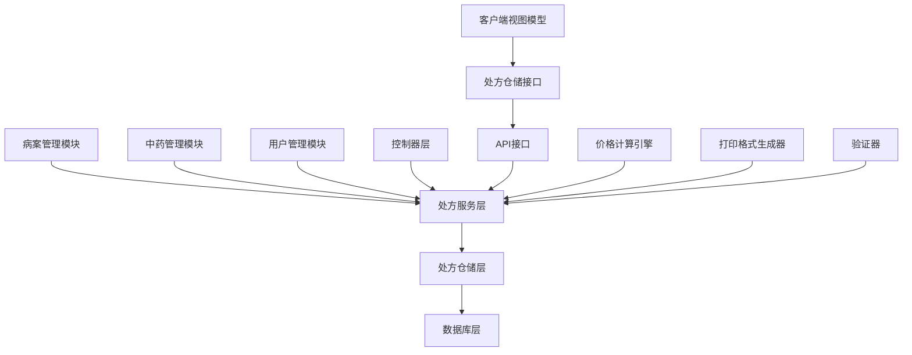
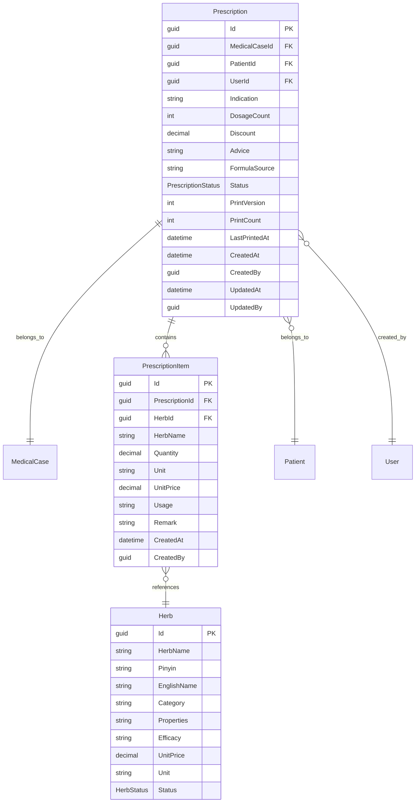
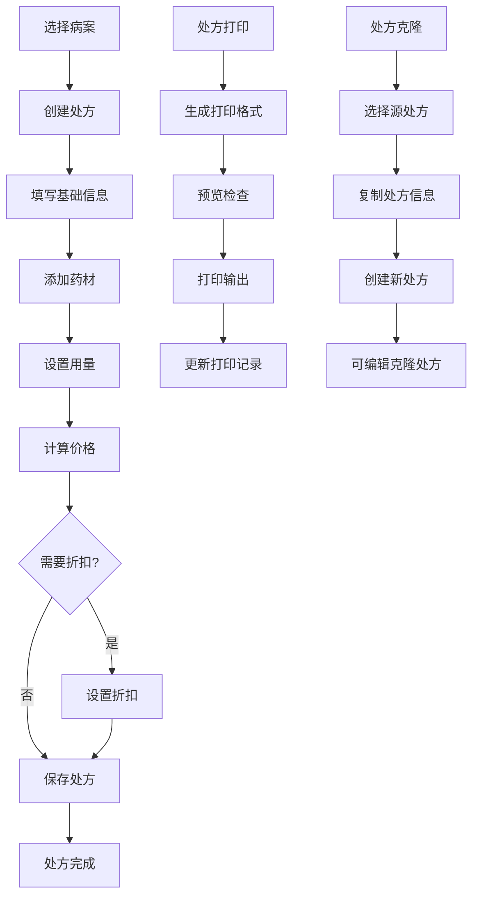

# 处方管理模块文档

> **版本**: 1.0
> **创建日期**: 2025-10-15
> **最后更新**: 2025-10-15
> **维护者**: 项目团队
> **相关模块**: [病案管理模块](../medicalcase/README.md) | [诊疗管理模块](../consultation/README.md) | [中药管理模块](../herbs/README.md)

## 📋 文档概述

本文档为处方管理模块提供全面的技术文档和使用指南，包括模块功能、架构设计、使用方法、集成指南和维护说明。处方管理模块是 LYBT 系统的核心业务模块之一，负责管理中药处方的创建、编辑、价格计算、打印和统计等功能。

## 🎯 模块简介

### 模块用途
处方管理模块负责管理中药处方的完整生命周期，包括处方创建、药材管理、价格计算、打印输出和统计分析等功能。模块支持中医特色的开方方式，提供准确的价格计算和规范的打印格式。

### 核心功能
- **处方创建**: 支持四种开方方式，创建完整的中药处方
- **药材管理**: 管理处方中的药材明细、用量和价格
- **价格计算**: 自动计算处方总价，支持折扣和多帖计算
- **处方打印**: 生成规范的处方打印格式
- **处方克隆**: 支持处方复制和模板化创建
- **统计分析**: 处方数量、金额等多维度统计分析

### 业务价值
- 标准化处方管理，提高医疗质量和安全性
- 自动化价格计算，减少人工错误和计费争议
- 规范化打印格式，符合医疗文书要求
- 数据统计分析，支持药学服务和管理决策

## 🏗️ 架构设计

### 模块架构


### 核心组件

#### PrescriptionService（处方服务）
- **用途**: 核心业务逻辑处理，处方CRUD操作
- **职责**: 处方管理、价格计算、打印格式生成、统计分析
- **接口**: IPrescriptionService
- **依赖**: IPrescriptionRepository, IMapper, ILogger

#### PrescriptionRepository（处方仓储）
- **用途**: 数据访问抽象，实现处方持久化操作
- **职责**: 数据库操作、关联数据加载、事务管理
- **接口**: IPrescriptionRepository
- **依赖**: DbContext, BaseRepository

#### PrescriptionItem（处方项）
- **用途**: 处方药材明细管理
- **职责**: 药材信息、用量、单价、小计计算
- **接口**: 实体类
- **依赖**: Prescription实体

### 数据流
1. **处方创建流程**: 选择病案 → 添加药材 → 计算价格 → 保存处方
2. **价格计算流程**: 药材单价 × 数量 × 帖数 → 应用折扣 → 计算总价
3. **处方打印流程**: 处方数据 → 格式化生成 → 打印输出
4. **统计分析流程**: 查询处方数据 → 按维度聚合 → 生成统计结果

## 🔧 技术实现

### Server 端实现

#### 实体模型
```csharp
/// <summary>
/// 处方实体 - 中药处方管理
/// 支持药材明细、价格计算和打印功能
/// </summary>
[Table("Prescriptions")]
public class Prescription : BaseEntity
{
    [Required]
    public Guid MedicalCaseId { get; set; }
    
    [Required]
    public Guid PatientId { get; set; }
    
    [Required]
    public Guid UserId { get; set; }
    
    [StringLength(200)]
    [DisplayName("适应症")]
    public string Indication { get; set; } = string.Empty;
    
    [DisplayName("帖数")]
    public int DosageCount { get; set; } = 1;
    
    [DisplayName("折扣")]
    [Column(TypeName = "decimal(18,2)")]
    public decimal Discount { get; set; } = 1.0m;
    
    [StringLength(500)]
    [DisplayName("医嘱")]
    public string Advice { get; set; }
    
    [StringLength(100)]
    [DisplayName("方剂来源")]
    public string FormulaSource { get; set; }
    
    [DisplayName("处方状态")]
    public PrescriptionStatus Status { get; set; } = PrescriptionStatus.Draft;
    
    [DisplayName("打印版本")]
    public int PrintVersion { get; set; } = 1;
    
    [DisplayName("打印次数")]
    public int PrintCount { get; set; } = 0;
    
    public DateTime? LastPrintedAt { get; set; }
    
    // 导航属性
    public virtual MedicalCase? MedicalCase { get; set; }
    public virtual ICollection<PrescriptionItem> Items { get; set; } = new List<PrescriptionItem>();
}

/// <summary>
/// 处方药材项实体
/// </summary>
[Table("PrescriptionItems")]
public class PrescriptionItem : BaseEntity
{
    [Required]
    public Guid PrescriptionId { get; set; }
    
    [Required]
    public Guid HerbId { get; set; }
    
    [Required]
    [StringLength(100)]
    [DisplayName("药材名称")]
    public string HerbName { get; set; } = string.Empty;
    
    [DisplayName("数量")]
    [Column(TypeName = "decimal(18,2)")]
    public decimal Quantity { get; set; }
    
    [StringLength(20)]
    [DisplayName("单位")]
    public string Unit { get; set; } = string.Empty;
    
    [DisplayName("单价")]
    [Column(TypeName = "decimal(18,2)")]
    public decimal UnitPrice { get; set; }
    
    [StringLength(500)]
    [DisplayName("用法")]
    public string Usage { get; set; }
    
    [StringLength(200)]
    [DisplayName("备注")]
    public string Remark { get; set; }
    
    // 导航属性
    public virtual Prescription Prescription { get; set; }
    public virtual Herb? Herb { get; set; }
}
```

#### 服务接口
```csharp
public interface IPrescriptionService
{
    Task<ServiceResult<PagedResult<PrescriptionDto>>> GetPagedAsync(int page = 1, int pageSize = 20, string? keyword = null, DateTime? startDate = null, DateTime? endDate = null);
    Task<ServiceResult<PrescriptionDto>> GetByIdAsync(Guid id);
    Task<ServiceResult<PrescriptionDto>> CreateAsync(PrescriptionCreateDto dto);
    Task<ServiceResult<PrescriptionDto>> UpdateAsync(Guid id, PrescriptionUpdateDto dto);
    Task<ServiceResult> DeleteAsync(Guid id);
    Task<ServiceResult<List<PrescriptionDto>>> GetByMedicalCaseIdAsync(Guid medicalCaseId);
    Task<ServiceResult<PrescriptionDto>> RecalculatePriceAsync(Guid prescriptionId);
    Task<ServiceResult<string>> GeneratePrintFormatAsync(Guid prescriptionId);
    Task<ServiceResult<string>> GeneratePrescriptionNoAsync();
    Task<ServiceResult<PrescriptionMainStatisticsDto>> GetStatisticsAsync();
    Task<ServiceResult<PrescriptionRangeStatisticsDto>> GetRangeStatisticsAsync(DateTime startDate, DateTime endDate);
    Task<ServiceResult<PrescriptionDto>> CloneAsync(Guid prescriptionId);
}
```

#### 控制器
```csharp
[ApiController]
[Route("api/[controller]")]
public class PrescriptionController : BaseApiController
{
    private readonly IPrescriptionService _prescriptionService;
    
    [HttpGet]
    public async Task<ActionResult<ApiResult<PagedResult<PrescriptionDto>>>> GetPaged([FromQuery] PrescriptionQueryDto query)
    {
        var result = await _prescriptionService.GetPagedAsync(query.PageNumber, query.PageSize, query.Keyword, query.StartDate, query.EndDate);
        return Ok(ApiResult<PagedResult<PrescriptionDto>>.Success(result.Data));
    }
    
    [HttpGet("{id}")]
    public async Task<ActionResult<ApiResult<PrescriptionDto>>> GetById(Guid id)
    {
        var result = await _prescriptionService.GetByIdAsync(id);
        return result.IsSuccess ? Ok(ApiResult<PrescriptionDto>.Success(result.Data)) : BadRequest(ApiResult<PrescriptionDto>.Failure(result.Message));
    }
    
    [HttpPost]
    public async Task<ActionResult<ApiResult<PrescriptionDto>>> Create([FromBody] PrescriptionCreateDto dto)
    {
        var result = await _prescriptionService.CreateAsync(dto);
        return result.IsSuccess ? Ok(ApiResult<PrescriptionDto>.Success(result.Data)) : BadRequest(ApiResult<PrescriptionDto>.Failure(result.Message));
    }
    
    [HttpPost("{id}/recalculate-price")]
    public async Task<ActionResult<ApiResult<PrescriptionDto>>> RecalculatePrice(Guid id)
    {
        var result = await _prescriptionService.RecalculatePriceAsync(id);
        return Ok(ApiResult<PrescriptionDto>.Success(result.Data));
    }
    
    [HttpPost("{id}/print-format")]
    public async Task<ActionResult<ApiResult<string>>> GeneratePrintFormat(Guid id)
    {
        var result = await _prescriptionService.GeneratePrintFormatAsync(id);
        return Ok(ApiResult<string>.Success(result.Data));
    }
    
    [HttpPost("{id}/clone")]
    public async Task<ActionResult<ApiResult<PrescriptionDto>>> Clone(Guid id)
    {
        var result = await _prescriptionService.CloneAsync(id);
        return result.IsSuccess ? Ok(ApiResult<PrescriptionDto>.Success(result.Data)) : BadRequest(ApiResult<PrescriptionDto>.Failure(result.Message));
    }
    
    [HttpGet("statistics")]
    public async Task<ActionResult<ApiResult<PrescriptionMainStatisticsDto>>> GetStatistics()
    {
        var result = await _prescriptionService.GetStatisticsAsync();
        return Ok(ApiResult<PrescriptionMainStatisticsDto>.Success(result.Data));
    }
    
    [HttpGet("range-statistics")]
    public async Task<ActionResult<ApiResult<PrescriptionRangeStatisticsDto>>> GetRangeStatistics([FromQuery] DateTime startDate, [FromQuery] DateTime endDate)
    {
        var result = await _prescriptionService.GetRangeStatisticsAsync(startDate, endDate);
        return Ok(ApiResult<PrescriptionRangeStatisticsDto>.Success(result.Data));
    }
}
```

### Client 端实现

#### ViewModel
```csharp
/// <summary>
/// 处方管理视图模型
/// </summary>
public class PrescriptionManagementViewModel : UnifiedViewModelBase
{
    private readonly IPrescriptionRepository _prescriptionRepository;
    
    #region 属性
    private ObservableCollection<PrescriptionDto> _prescriptions;
    public ObservableCollection<PrescriptionDto> Prescriptions
    {
        get => _prescriptions;
        set => SetProperty(ref _prescriptions, value);
    }
    
    private PrescriptionDto? _selectedPrescription;
    public PrescriptionDto? SelectedPrescription
    {
        get => _selectedPrescription;
        set => SetProperty(ref _selectedPrescription, value);
    }
    
    private DateTime? _startDate;
    public DateTime? StartDate
    {
        get => _startDate;
        set => SetProperty(ref _startDate, value);
    }
    
    private DateTime? _endDate;
    public DateTime? EndDate
    {
        get => _endDate;
        set => SetProperty(ref _endDate, value);
    }
    
    private string _searchKeyword = string.Empty;
    public string SearchKeyword
    {
        get => _searchKeyword;
        set => SetProperty(ref _searchKeyword, value);
    }
    #endregion
    
    #region 命令
    public DelegateCommand LoadPrescriptionsCommand { get; }
    public DelegateCommand SearchCommand { get; }
    public DelegateCommand CreateCommand { get; }
    public DelegateCommand EditCommand { get; }
    public DelegateCommand DeleteCommand { get; }
    public DelegateCommand CloneCommand { get; }
    public DelegateCommand PrintCommand { get; }
    public DelegateCommand RefreshCommand { get; }
    public DelegateCommand ViewStatisticsCommand { get; }
    #endregion
    
    // 核心方法
    private async Task LoadPrescriptionsAsync()
    {
        try
        {
            SetIsBusy(true, "正在加载处方...");
            
            var result = await _prescriptionService.GetPagedAsync(1, 50, SearchKeyword, StartDate, EndDate);
            if (result.IsSuccess)
            {
                Prescriptions = new ObservableCollection<PrescriptionDto>(result.Data.Items);
            }
            else
            {
                ShowErrorMessage(result.Message);
            }
        }
        catch (Exception ex)
        {
            Logger.LogError(ex, "加载处方失败");
            ShowErrorMessage("加载处方失败");
        }
        finally
        {
            SetIsBusy(false);
        }
    }
    
    private async Task ClonePrescriptionAsync()
    {
        if (SelectedPrescription == null)
        {
            ShowErrorMessage("请先选择要复制的处方");
            return;
        }
        
        try
        {
            SetIsBusy(true, "正在复制处方...");
            
            var result = await _prescriptionService.CloneAsync(SelectedPrescription.Id);
            if (result.IsSuccess)
            {
                await ShowSuccessMessageAsync("处方复制成功");
                await LoadPrescriptionsAsync();
            }
            else
            {
                ShowErrorMessage(result.Message);
            }
        }
        catch (Exception ex)
        {
            Logger.LogError(ex, "复制处方失败");
            ShowErrorMessage("复制处方失败");
        }
        finally
        {
            SetIsBusy(false);
        }
    }
    
    private async Task PrintPrescriptionAsync()
    {
        if (SelectedPrescription == null)
        {
            ShowErrorMessage("请先选择要打印的处方");
            return;
        }
        
        try
        {
            SetIsBusy(true, "正在生成打印格式...");
            
            var result = await _prescriptionService.GeneratePrintFormatAsync(SelectedPrescription.Id);
            if (result.IsSuccess)
            {
                // 调用打印服务
                await _printService.PrintAsync(result.Data);
                await ShowSuccessMessageAsync("处方打印成功");
            }
            else
            {
                ShowErrorMessage(result.Message);
            }
        }
        catch (Exception ex)
        {
            Logger.LogError(ex, "打印处方失败");
            ShowErrorMessage("打印处方失败");
        }
        finally
        {
            SetIsBusy(false);
        }
    }
}
```

#### Repository
```csharp
/// <summary>
/// 处方仓储 - 客户端数据访问层
/// </summary>
public class PrescriptionRepository : RepositoryBase<PrescriptionDto, PrescriptionCreateDto, PrescriptionUpdateDto, IPrescriptionApi>, IPrescriptionRepository
{
    public PrescriptionRepository(IPrescriptionApi api, IMapper mapper, ILogger<PrescriptionRepository> logger)
        : base(api, mapper, logger)
    {
    }
    
    public async Task<ServiceResult<PrescriptionDto>> RecalculatePriceAsync(Guid prescriptionId)
    {
        try
        {
            var result = await Api.RecalculatePriceAsync(prescriptionId);
            return ServiceResult<PrescriptionDto>.Success(result);
        }
        catch (Exception ex)
        {
            _logger.LogError(ex, "重新计算处方价格失败");
            return ServiceResult<PrescriptionDto>.Failure("重新计算价格失败");
        }
    }
    
    public async Task<ServiceResult<string>> GeneratePrintFormatAsync(Guid prescriptionId)
    {
        try
        {
            var result = await Api.GeneratePrintFormatAsync(prescriptionId);
            return ServiceResult<string>.Success(result);
        }
        catch (Exception ex)
        {
            _logger.LogError(ex, "生成处方打印格式失败");
            return ServiceResult<string>.Failure("生成打印格式失败");
        }
    }
    
    public async Task<ServiceResult<PrescriptionDto>> CloneAsync(Guid prescriptionId)
    {
        try
        {
            var result = await Api.CloneAsync(prescriptionId);
            return ServiceResult<PrescriptionDto>.Success(result);
        }
        catch (Exception ex)
        {
            _logger.LogError(ex, "克隆处方失败");
            return ServiceResult<PrescriptionDto>.Failure("克隆处方失败");
        }
    }
    
    public async Task<ServiceResult<PrescriptionMainStatisticsDto>> GetStatisticsAsync()
    {
        try
        {
            var result = await Api.GetStatisticsAsync();
            return ServiceResult<PrescriptionMainStatisticsDto>.Success(result);
        }
        catch (Exception ex)
        {
            _logger.LogError(ex, "获取处方统计失败");
            return ServiceResult<PrescriptionMainStatisticsDto>.Failure("获取统计失败");
        }
    }
}
```

## 📊 数据模型

### 核心实体关系


### 数据传输对象 (DTOs)

#### PrescriptionDto
```csharp
/// <summary>
/// 处方DTO - 包含价格计算和药材明细
/// </summary>
public class PrescriptionDto : StatusDto, IRemarkable
{
    [DisplayName("处方编号")]
    public string? PrescriptionNo { get; set; }

    [DisplayName("病案ID")]
    public Guid MedicalCaseId { get; set; }

    [DisplayName("患者ID")]
    public Guid PatientId { get; set; }

    [DisplayName("患者姓名")]
    public string PatientName { get; set; } = string.Empty;

    [DisplayName("医生ID")]
    public Guid DoctorId { get; set; }

    [DisplayName("医生姓名")]
    public string DoctorName { get; set; } = string.Empty;

    [DisplayName("适应症")]
    [StringLength(200, ErrorMessage = "适应症长度不能超过200个字符")]
    public string Indication { get; set; } = string.Empty;

    [DisplayName("帖数")]
    [Range(1, 100, ErrorMessage = "帖数必须在1-100之间")]
    public int DosageCount { get; set; } = 1;

    [DisplayName("折扣")]
    [Range(0, 1, ErrorMessage = "折扣必须在0-1之间")]
    public decimal Discount { get; set; } = 1.0m;

    [DisplayName("医嘱")]
    [StringLength(500, ErrorMessage = "医嘱长度不能超过500个字符")]
    public string? Advice { get; set; }

    [DisplayName("方剂来源")]
    [StringLength(100, ErrorMessage = "方剂来源长度不能超过100个字符")]
    public string? FormulaSource { get; set; }

    [DisplayName("处方状态")]
    public PrescriptionStatus Status { get; set; } = PrescriptionStatus.Draft;

    [DisplayName("打印版本")]
    public int PrintVersion { get; set; } = 1;

    [DisplayName("打印次数")]
    public int PrintCount { get; set; } = 0;

    [DisplayName("最后打印时间")]
    public DateTime? LastPrintedAt { get; set; }

    [DisplayName("备注")]
    [StringLength(500, ErrorMessage = "备注长度不能超过500个字符")]
    public string? Remark { get; set; }

    /// <summary>处方药材明细</summary>
    public List<PrescriptionItemDto> Items { get; set; } = new();

    /// <summary>处方总金额（计算属性）</summary>
    [DisplayName("总金额")]
    [Column(TypeName = "decimal(18,2)")]
    public decimal TotalAmount => CalculateTotalAmount();

    /// <summary>计算处方总金额</summary>
    private decimal CalculateTotalAmount()
    {
        decimal total = 0;
        foreach (var item in Items)
        {
            total += item.UnitPrice * item.Quantity * DosageCount;
        }
        return total * Discount;
    }

    /// <summary>是否可以编辑</summary>
    public bool CanEdit() => Status == PrescriptionStatus.Draft;

    /// <summary>是否可以打印</summary>
    public bool CanPrint() => Items.Any() && Status != PrescriptionStatus.Cancelled;

    /// <summary>是否可以删除</summary>
    public bool CanDelete() => Status == PrescriptionStatus.Draft;
}
```

#### PrescriptionCreateDto
```csharp
/// <summary>
/// 创建处方DTO
/// </summary>
public class PrescriptionCreateDto
{
    [Required(ErrorMessage = "病案ID不能为空")]
    [DisplayName("病案ID")]
    public Guid MedicalCaseId { get; set; }

    [Required(ErrorMessage = "患者ID不能为空")]
    [DisplayName("患者ID")]
    public Guid PatientId { get; set; }

    [Required(ErrorMessage = "医生ID不能为空")]
    [DisplayName("医生ID")]
    public Guid UserId { get; set; }

    [Required(ErrorMessage = "适应症不能为空")]
    [StringLength(200, ErrorMessage = "适应症长度不能超过200个字符")]
    [DisplayName("适应症")]
    public string Indication { get; set; } = string.Empty;

    [DisplayName("帖数")]
    [Range(1, 100, ErrorMessage = "帖数必须在1-100之间")]
    public int DosageCount { get; set; } = 1;

    [DisplayName("折扣")]
    [Range(0, 1, ErrorMessage = "折扣必须在0-1之间")]
    public decimal Discount { get; set; } = 1.0m;

    [DisplayName("医嘱")]
    [StringLength(500, ErrorMessage = "医嘱长度不能超过500个字符")]
    public string? Advice { get; set; }

    [DisplayName("方剂来源")]
    [StringLength(100, ErrorMessage = "方剂来源长度不能超过100个字符")]
    public string? FormulaSource { get; set; }

    [DisplayName("备注")]
    [StringLength(500, ErrorMessage = "备注长度不能超过500个字符")]
    public string? Remark { get; set; }

    /// <summary>处方药材项</summary>
    public List<PrescriptionItemCreateDto> Items { get; set; } = new();
}
```

#### PrescriptionItemDto
```csharp
/// <summary>
/// 处方药材项DTO
/// </summary>
public class PrescriptionItemDto : IIdentifiable<Guid>
{
    [Required(ErrorMessage = "处方项ID不能为空")]
    [DisplayName("处方项ID")]
    public Guid Id { get; set; }

    [Required(ErrorMessage = "处方ID不能为空")]
    [DisplayName("处方ID")]
    public Guid PrescriptionId { get; set; }

    [Required(ErrorMessage = "药材ID不能为空")]
    [DisplayName("药材ID")]
    public Guid HerbId { get; set; }

    [Required(ErrorMessage = "药材名称不能为空")]
    [StringLength(100, ErrorMessage = "药材名称长度不能超过100个字符")]
    [DisplayName("药材名称")]
    public string HerbName { get; set; } = string.Empty;

    [Required(ErrorMessage = "数量不能为空")]
    [Range(0.01, 1000, ErrorMessage = "数量必须在0.01-1000之间")]
    [DisplayName("数量")]
    public decimal Quantity { get; set; }

    [Required(ErrorMessage = "单位不能为空")]
    [StringLength(20, ErrorMessage = "单位长度不能超过20个字符")]
    [DisplayName("单位")]
    public string Unit { get; set; } = string.Empty;

    [Required(ErrorMessage = "单价不能为空")]
    [Range(0, 10000, ErrorMessage = "单价必须在0-10000之间")]
    [DisplayName("单价")]
    public decimal UnitPrice { get; set; }

    [DisplayName("用法")]
    [StringLength(500, ErrorMessage = "用法长度不能超过500个字符")]
    public string? Usage { get; set; }

    [DisplayName("备注")]
    [StringLength(200, ErrorMessage = "备注长度不能超过200个字符")]
    public string? Remark { get; set; }

    /// <summary>小计金额（数量 × 单价 × 帖数）</summary>
    [DisplayName("小计")]
    public decimal SubtotalAmount => UnitPrice * Quantity;

    /// <summary>总价金额（小计 × 帖数）</summary>
    [DisplayName("总价")]
    public decimal TotalAmount => SubtotalAmount * (DosageCount ?? 1);

    /// <summary>帖数（从父级处方获取）</summary>
    public int? DosageCount { get; set; }
}
```

## 🔌 API 接口

### REST API 端点

#### 获取处方列表
```
GET /api/prescription
参数:
  - pageNumber: 页码 (从1开始)
  - pageSize: 每页数量 (默认20)
  - searchKeyword: 搜索关键词 (可选)
  - startDate: 开始日期 (可选)
  - endDate: 结束日期 (可选)
响应:
  - data: 处方列表
  - totalCount: 总记录数
  - pageNumber: 当前页码
  - pageSize: 每页数量
```

#### 获取处方详情
```
GET /api/prescription/{id}
参数: id (Guid)
响应: 处方详细信息，包含药材明细
```

#### 创建处方
```
POST /api/prescription
请求体: 
{
  "medicalCaseId": "guid",
  "patientId": "guid",
  "userId": "guid",
  "indication": "适应症",
  "dosageCount": 7,
  "discount": 1.0,
  "advice": "医嘱内容",
  "formulaSource": "方剂来源",
  "items": [
    {
      "herbId": "guid",
      "herbName": "药材名称",
      "quantity": 10,
      "unit": "g",
      "unitPrice": 15.50,
      "usage": "用法说明"
    }
  ]
}
响应: 创建成功的处方信息
```

#### 重新计算价格
```
POST /api/prescription/{id}/recalculate-price
参数: id (Guid)
响应: 重新计算后的处方信息
```

#### 生成打印格式
```
POST /api/prescription/{id}/print-format
参数: id (Guid)
响应: 处方打印格式字符串
```

#### 克隆处方
```
POST /api/prescription/{id}/clone
参数: id (Guid)
响应: 克隆后的新处方信息
```

#### 获取统计数据
```
GET /api/prescription/statistics
响应: 
{
  "totalCount": 总处方数,
  "todayCount": 今日处方数,
  "todayTotalAmount": 今日总金额
}
```

#### 获取日期范围统计
```
GET /api/prescription/range-statistics
参数:
  - startDate: 开始日期
  - endDate: 结束日期
响应:
{
  "count": 处方数量,
  "totalAmount": 总金额,
  "avgAmount": 平均金额
}
```

### API 请求/响应示例

#### 创建处方请求示例
```json
{
  "medicalCaseId": "a1b2c3d4-e5f6-7890-abcd-ef1234567890",
  "patientId": "b2c3d4e5-f6a7-8901-bcde-f23456789012",
  "userId": "c3d4e5f6-a7b8-9012-cdef-345678901234",
  "indication": "感冒发热",
  "dosageCount": 7,
  "discount": 0.9,
  "advice": "水煎服，每日三次，饭后服用",
  "formulaSource": "银翘散加减",
  "items": [
    {
      "herbId": "d4e5f6a7-b8c9-0123-def0-456789012345",
      "herbName": "金银花",
      "quantity": 15,
      "unit": "g",
      "unitPrice": 2.50,
      "usage": "清热解毒"
    },
    {
      "herbId": "e5f6a7b8-c9d0-1234-ef01-567890123456",
      "herbName": "连翘",
      "quantity": 12,
      "unit": "g",
      "unitPrice": 3.20,
      "usage": "清热解毒"
    },
    {
      "herbId": "f6a7b8c9-d0e1-2345-f012-678901234567",
      "herbName": "桔梗",
      "quantity": 10,
      "unit": "g",
      "unitPrice": 1.80,
      "usage": "宣肺利咽"
    }
  ]
}
```

#### 响应示例
```json
{
  "success": true,
  "data": {
    "id": "g7h8i9j0-e1f2-3456-0123-789012345678",
    "prescriptionNo": "RX20251015001",
    "medicalCaseId": "a1b2c3d4-e5f6-7890-abcd-ef1234567890",
    "patientId": "b2c3d4e5-f6a7-8901-bcde-f23456789012",
    "patientName": "张三",
    "doctorId": "c3d4e5f6-a7b8-9012-cdef-345678901234",
    "doctorName": "李医生",
    "indication": "感冒发热",
    "dosageCount": 7,
    "discount": 0.9,
    "advice": "水煎服，每日三次，饭后服用",
    "formulaSource": "银翘散加减",
    "status": "Draft",
    "printVersion": 1,
    "printCount": 0,
    "totalAmount": 54.63,
    "items": [
      {
        "id": "h8i9j0k1-f2g3-4567-1234-890123456789",
        "prescriptionId": "g7h8i9j0-e1f2-3456-0123-789012345678",
        "herbId": "d4e5f6a7-b8c9-0123-def0-456789012345",
        "herbName": "金银花",
        "quantity": 15,
        "unit": "g",
        "unitPrice": 2.50,
        "usage": "清热解毒",
        "subtotalAmount": 37.50,
        "totalAmount": 262.50
      }
    ],
    "createdAt": "2025-10-15T14:30:00Z",
    "updatedAt": "2025-10-15T14:30:00Z"
  },
  "message": "创建处方成功"
}
```

## 👥 用户界面

### 主界面功能
处方管理模块提供完整的处方管理界面，包括：
- **处方列表**: 分页显示处方列表，支持日期范围筛选
- **处方详情**: 显示处方完整信息，包括药材明细
- **处方创建**: 拖拽式药材选择，实时价格计算
- **处方编辑**: 修改处方信息和药材明细
- **处方打印**: 生成标准打印格式，支持打印预览
- **统计分析**: 处方数量、金额等统计图表

### 关键用户流程

#### 处方创建流程
1. **选择病案**: 从病案列表中选择要开具处方的病案
2. **填写基础信息**: 适应症、帖数、医嘱等基础信息
3. **添加药材**: 从药材库中选择药材，输入用量
4. **实时计算**: 系统自动计算价格和总金额
5. **设置折扣**: 根据需要设置折扣比例
6. **保存处方**: 保存完整的处方信息

#### 处方编辑流程
1. **选择处方**: 从处方列表中选择要编辑的处方
2. **检查状态**: 确认处方处于可编辑状态（草稿状态）
3. **修改信息**: 修改基础信息或药材明细
4. **重新计算**: 系统自动重新计算价格
5. **保存更改**: 保存修改后的处方信息

#### 处方打印流程
1. **选择处方**: 选择要打印的处方
2. **生成格式**: 系统生成标准打印格式
3. **预览检查**: 预览打印内容，检查完整性
4. **打印输出**: 发送到打印机或生成PDF
5. **记录打印**: 更新打印次数和时间

## 🔄 业务流程

### 核心业务流程


### 业务规则
- **创建规则**: 处方必须关联到有效的病案
- **药材规则**: 药材必须来自药材库，数量和单位必须合理
- **价格规则**: 价格基于药材库单价计算，支持折扣设置
- **打印规则**: 只有包含药材的处方才能打印
- **编辑规则**: 只有草稿状态的处方可以编辑

## 🔗 集成指南

### 与其他模块的集成

#### 病案管理模块集成
- **集成方式**: 数据关联，处方关联到病案
- **接口定义**: 病案信息查询、处方关联管理
- **数据格式**: 病案DTO，包含患者和医生信息
- **错误处理**: 病案不存在或状态异常时拒绝创建处方

#### 诊疗管理模块集成
- **集成方式**: 数据关联，处方基于诊疗诊断
- **接口定义**: 诊疗信息查询、诊断结果获取
- **数据格式**: 诊疗DTO，包含诊断和治疗建议
- **错误处理**: 诊断信息不完整时限制处方创建

#### 中药管理模块集成
- **集成方式**: 数据引用，处方项引用药材信息
- **接口定义**: 药材信息查询、价格获取
- **数据格式**: 药材DTO，包含名称、价格、属性等
- **错误处理**: 药材不存在或库存不足时的提醒

#### 用户管理模块集成
- **集成方式**: 服务调用获取医生信息
- **接口定义**: 医生权限验证、资质信息查询
- **数据格式**: 用户DTO，包含专业资质信息
- **错误处理**: 医生权限不足时的拒绝访问

### 外部系统集成
- **医保系统**: 处方项目和费用编码对接
- **药品供应商系统**: 药材库存和价格同步
- **财务系统**: 处方费用结算和统计
- **电子处方系统**: 处方电子化传输和存储

## ⚙️ 配置说明

### 系统配置
```json
{
  "Prescription": {
    "MaxItemsPerPrescription": 50,
    "MaxDosageCount": 100,
    "DefaultDiscount": 1.0,
    "PrintVersionEnabled": true,
    "AutoSaveIntervalMinutes": 3,
    "PriceUpdateEnabled": true,
    "CacheEnabled": true,
    "CacheExpirationMinutes": 30,
    "PrescriptionNoFormat": "RX{yyyyMMdd}{0000}"
  }
}
```

### 环境变量
- `PRESCRIPTION_MAX_ITEMS`: 单个处方最大药材数量
- `PRESCRIPTION_DEFAULT_DOSAGE`: 默认帖数
- `PRESCRIPTION_CACHE_ENABLED`: 是否启用缓存
- `PRESCRIPTION_PRINT_ENABLED`: 是否启用打印功能

### 依赖注入配置
```csharp
// Server 端 DI 配置
services.AddScoped<IPrescriptionService, PrescriptionService>();
services.AddScoped<IPrescriptionRepository, PrescriptionRepository>();
services.AddValidatorsFromAssemblyContaining<PrescriptionCreateDtoValidator>();

// AutoMapper 配置
services.AddAutoMapper(typeof(PrescriptionMappingProfile));

// Client 端 DI 配置
services.AddScoped<IPrescriptionRepository, PrescriptionRepository>();
services.AddScoped<PrescriptionManagementViewModel>();
services.AddScoped<PrescriptionDetailViewModel>();
services.AddScoped<PrescriptionCreateViewModel>();
```

## 🧪 测试指南

### 单元测试
```csharp
[Test]
public async Task PrescriptionService_Create_ShouldReturnCorrectData()
{
    // Arrange
    var createDto = new PrescriptionCreateDto
    {
        MedicalCaseId = _testMedicalCaseId,
        PatientId = _testPatientId,
        UserId = _testDoctorId,
        Indication = "感冒发热",
        DosageCount = 7,
        Items = new List<PrescriptionItemCreateDto>
        {
            new PrescriptionItemCreateDto
            {
                HerbId = _testHerbId,
                HerbName = "金银花",
                Quantity = 15,
                Unit = "g",
                UnitPrice = 2.50m
            }
        }
    };
    
    // Act
    var result = await _service.CreateAsync(createDto);
    
    // Assert
    Assert.IsTrue(result.IsSuccess);
    Assert.IsNotNull(result.Data);
    Assert.AreEqual(createDto.Indication, result.Data.Indication);
    Assert.IsTrue(result.Data.TotalAmount > 0);
}

[Test]
public async Task PrescriptionService_Clone_ShouldCreateNewPrescription()
{
    // Arrange
    var prescriptionId = _testPrescriptionId;
    
    // Act
    var result = await _service.CloneAsync(prescriptionId);
    
    // Assert
    Assert.IsTrue(result.IsSuccess);
    Assert.IsNotNull(result.Data);
    Assert.AreNotEqual(prescriptionId, result.Data.Id);
    Assert.AreEqual(PrescriptionStatus.Draft, result.Data.Status);
}
```

### 集成测试
```csharp
[Test]
public async Task PrescriptionController_Create_ShouldReturn201()
{
    // Arrange
    var request = new PrescriptionCreateDto
    {
        MedicalCaseId = _testMedicalCaseId,
        PatientId = _testPatientId,
        UserId = _testDoctorId,
        Indication = "感冒发热",
        DosageCount = 7
    };
    
    // Act
    var response = await _controller.Create(request);
    
    // Assert
    var createdResult = response as CreatedAtActionResult;
    Assert.IsNotNull(createdResult);
    Assert.AreEqual(201, createdResult.StatusCode);
}
```

### 测试覆盖率要求
- **服务层逻辑**: ≥ 90%
- **价格计算逻辑**: ≥ 95%
- **数据访问层**: ≥ 85%
- **控制器层**: ≥ 80%
- **客户端ViewModel**: ≥ 75%

## 🚀 部署指南

### 部署要求
- **服务器要求**: 
  - CPU: 4核心以上
  - 内存: 8GB以上
  - 存储: 100GB以上可用空间
- **数据库要求**: 
  - SQL Server 2019+
  - 支持事务和关联查询
  - 配置适当的连接池
- **网络要求**: 
  - 内网带宽100Mbps以上
  - 支持HTTPS
  - 打印服务端口配置

### 部署步骤
1. **数据库迁移**: 运行Prescription相关的数据库迁移脚本
2. **配置更新**: 更新appsettings.json中的Prescription配置
3. **服务注册**: 在DI容器中注册Prescription相关服务
4. **权限配置**: 配置处方管理相关的用户权限
5. **打印配置**: 配置打印服务和模板
6. **验证测试**: 验证所有API接口和业务流程

### 配置验证
- **数据库连接**: 验证Prescription和PrescriptionItems表创建成功
- **API接口**: 验证所有Prescription API端点正常响应
- **权限检查**: 验证医生权限控制正确
- **价格计算**: 验证价格计算逻辑准确
- **打印功能**: 验证打印格式和输出正确

## 🔍 故障排除

### 常见问题

#### 处方创建失败
- **症状**: 创建处方时返回错误
- **原因**: 病案不存在、医生权限不足、药材信息错误
- **解决方案**: 
  1. 检查病案是否存在且有效
  2. 验证医生权限和资质
  3. 检查药材信息的完整性
- **预防措施**: 前端数据验证和权限检查

#### 价格计算错误
- **症状**: 处方总价计算不正确
- **原因**: 药材单价错误、数量计算错误、折扣应用错误
- **解决方案**: 
  1. 检查药材库中的单价信息
  2. 验证数量和单位的计算逻辑
  3. 检查折扣应用的算法
- **预防措施**: 价格计算逻辑的单元测试覆盖

#### 打印格式异常
- **症状**: 打印格式显示不正确
- **原因**: 格式模板错误、数据绑定问题、字体配置问题
- **解决方案**: 
  1. 检查打印格式模板
  2. 验证数据绑定逻辑
  3. 检查打印机和字体配置
- **预防措施**: 打印预览功能和格式验证

#### 处方克隆失败
- **症状**: 克隆处方时出现异常
- **原因**: 源处方不存在、权限不足、数据完整性问题
- **解决方案**: 
  1. 检查源处方是否存在
  2. 验证用户克隆权限
  3. 检查处方数据的完整性
- **预防措施**: 克隆前的数据验证和权限检查

### 调试工具
- **日志查看**: 
  - 位置: `logs/prescription*.log`
  - 级别: Debug, Information, Warning, Error
  - 格式: JSON格式，包含详细处方信息
- **性能监控**: 
  - API响应时间监控
  - 价格计算性能分析
  - 数据库查询优化
- **健康检查**: 
  - 端点: `/health/prescription`
  - 检查项目: 数据库连接、打印服务状态、缓存状态

## 📈 性能优化

### 性能指标
- **响应时间**: 
  - 处方查询: < 300ms
  - 处方创建: < 500ms
  - 价格计算: < 100ms
  - 打印格式生成: < 200ms
- **并发处理**: 
  - 支持50+并发用户
  - 数据库连接池: 10-30个连接
- **内存使用**: 
  - 单个处方记录: < 20KB
  - 查询结果缓存: < 100MB

### 优化策略
- **缓存策略**: 
  - Redis缓存热点处方数据
  - 本地缓存药材价格信息
  - 缓存过期时间: 30分钟
- **数据库优化**: 
  - 处方ID索引优化
  - 日期范围查询优化
  - 分页查询优化
- **异步处理**: 
  - 价格计算异步处理
  - 打印格式异步生成
  - 统计数据异步计算
- **批量操作**: 
  - 批量价格更新
  - 批量打印处理
  - 批量数据导出

## 🔒 安全考虑

### 安全措施
- **身份验证**: 
  - JWT Token验证
  - 医生资质认证
  - 处方操作权限控制
- **授权控制**: 
  - 基于角色的访问控制
  - 处方修改权限限制
  - 敏感操作审计
- **数据保护**: 
  - 处方数据加密存储
  - 传输层TLS加密
  - 患者隐私保护
- **审计日志**: 
  - 完整的处方操作记录
  - 数据访问日志
  - 价格变更追踪

### 安全最佳实践
- **权限最小化**: 用户只能访问必要的处方功能
- **数据完整性**: 确保处方数据的完整性和准确性
- **处方安全**: 防止处方篡改和伪造
- **合规要求**: 符合医疗处方管理法规要求
- **定期审计**: 定期审查处方操作和权限配置

## 📚 参考资料

### 相关文档
- [模块文档模板](../template/module-document-template.md)
- [模块文档编写指南](../template/module-document-writing-guide.md)
- [模块文档质量检查清单](../template/module-document-quality-checklist.md)
- [病案管理模块](../medicalcase/README.md)
- [诊疗管理模块](../consultation/README.md)
- [中药管理模块](../herbs/README.md)

### 技术文档
- [Server端三层架构标准](../../../architecture/server-module-design-standard.md)
- [Client端MVVM设计标准](../../../architecture/client/unified-design-standard.md)
- [依赖注入配置指南](../../../development/repository-dependency-injection-guide.md)
- [测试架构标准](../../../development/test-architecture-standard.md)

### API文档
- [Prescription API Reference](../../../api/prescription-api.md)
- [MedicalCase API Reference](../../../api/medicalcase-api.md)
- [Herb API Reference](../../../api/herb-api.md)

## 🔄 版本历史

| 版本 | 日期 | 更新内容 | 作者 |
|------|------|----------|------|
| 1.0 | 2025-10-15 | 初始版本，包含完整的处方管理模块文档 | Claude Code |

## 📞 联系方式

- **维护者**: 项目开发团队
- **技术支持**: 处方管理模块开发组
- **文档反馈**: GitHub Issues 或内部文档反馈系统

---

*本文档遵循 LYBT 项目文档标准编写，如有疑问请参考相关模板或联系维护者。*