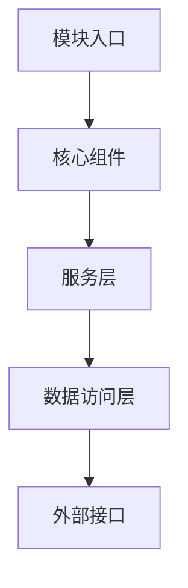
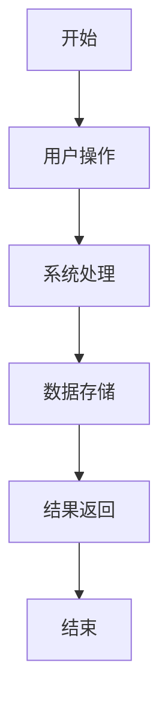

# [模块名称] 文档模板

> **版本**: 1.0
> **创建日期**: YYYY-MM-DD
> **最后更新**: YYYY-MM-DD
> **维护者**: [维护者姓名]
> **相关模块**: [关联的其他模块]

## 📋 文档概述

本文档为 [模块名称] 模块提供全面的技术文档和使用指南，包括模块功能、架构设计、使用方法、集成指南和维护说明。

## 🎯 模块简介

### 模块用途
[简要描述模块的主要用途和在系统中的作用]

### 核心功能
- [功能1]: [功能描述]
- [功能2]: [功能描述]
- [功能3]: [功能描述]

### 业务价值
[描述模块为业务带来的价值和好处]

## 🏗️ 架构设计

### 模块架构


### 核心组件

#### [组件1名称]
- **用途**: [组件的主要功能]
- **职责**: [组件的具体职责]
- **接口**: [主要接口和方法]
- **依赖**: [依赖的其他组件或服务]

#### [组件2名称]
- **用途**: [组件的主要功能]
- **职责**: [组件的具体职责]
- **接口**: [主要接口和方法]
- **依赖**: [依赖的其他组件或服务]

### 数据流
[描述模块内部的数据流转过程]

## 🔧 技术实现

### Server 端实现

#### 实体模型
```csharp
// 示例实体代码
public class [EntityName]
{
    public Guid Id { get; set; }
    public string Name { get; set; }
    // 其他属性...
}
```

#### 服务接口
```csharp
// 示例服务接口
public interface I[ServiceName]Service
{
    Task<[DtoName]Dto> GetByIdAsync(Guid id);
    Task<PagedResult<[DtoName]Dto>> GetPagedAsync([DtoName]ListRequest request);
    Task<[DtoName]Dto> CreateAsync([DtoName]CreateDto createDto);
    Task<[DtoName]Dto> UpdateAsync(Guid id, [DtoName]UpdateDto updateDto);
    Task<bool> DeleteAsync(Guid id);
}
```

#### 控制器
```csharp
// 示例控制器代码
[ApiController]
[Route("api/[controller]")]
public class [ControllerName]Controller : ControllerBase
{
    // 控制器实现...
}
```

### Client 端实现

#### ViewModel
```csharp
// 示例 ViewModel 代码
public class [ViewModelName]ViewModel : UnifiedViewModelBase
{
    // ViewModel 属性和命令...
}
```

#### Repository
```csharp
// 示例 Repository 代码
public class [RepositoryName]Repository : RepositoryBase<[DtoName]Dto, [DtoName]CreateDto, [DtoName]UpdateDto, I[ApiName]Api>
{
    // Repository 实现...
}
```

#### View
```xml
<!-- 示例 XAML 视图代码 -->
<UserControl x:Class="[Namespace].[ViewName]View">
    <!-- XAML 界面定义... -->
</UserControl>
```

## 📊 数据模型

### 核心实体关系
```mermaid
erDiagram
    [Entity1] ||--o{ [Entity2] : has
    [Entity1] ||--o{ [Entity3] : contains
    [Entity2] ||--o{ [Entity4] : references
```

### 数据传输对象 (DTOs)

#### [DtoName]Dto
```csharp
public class [DtoName]Dto
{
    public Guid Id { get; set; }
    public string Name { get; set; }
    public DateTime CreatedAt { get; set; }
    public DateTime UpdatedAt { get; set; }
    // 其他属性...
}
```

#### [DtoName]CreateDto
```csharp
public class [DtoName]CreateDto
{
    public string Name { get; set; }
    // 创建所需的属性...
}
```

#### [DtoName]UpdateDto
```csharp
public class [DtoName]UpdateDto
{
    public string Name { get; set; }
    // 更新所需的属性...
}
```

## 🔌 API 接口

### REST API 端点

#### 获取列表
```
GET /api/[controller]
参数: [查询参数说明]
响应: [响应格式说明]
```

#### 获取详情
```
GET /api/[controller]/{id}
参数: id (Guid)
响应: [响应格式说明]
```

#### 创建
```
POST /api/[controller]
请求体: [请求体格式]
响应: [响应格式说明]
```

#### 更新
```
PUT /api/[controller]/{id}
参数: id (Guid)
请求体: [请求体格式]
响应: [响应格式说明]
```

#### 删除
```
DELETE /api/[controller]/{id}
参数: id (Guid)
响应: [响应格式说明]
```

### API 请求/响应示例

#### 获取列表请求示例
```json
{
  "pageNumber": 1,
  "pageSize": 20,
  "searchKeyword": "搜索关键词"
}
```

#### 响应示例
```json
{
  "data": [
    {
      "id": "guid",
      "name": "名称",
      "createdAt": "2025-01-01T00:00:00Z"
    }
  ],
  "totalCount": 100,
  "pageNumber": 1,
  "pageSize": 20
}
```

## 👥 用户界面

### 主界面功能
[描述用户界面的主要功能和布局]

### 关键用户流程

#### [流程1名称]
1. [步骤1]: [步骤描述]
2. [步骤2]: [步骤描述]
3. [步骤3]: [步骤描述]

#### [流程2名称]
1. [步骤1]: [步骤描述]
2. [步骤2]: [步骤描述]
3. [步骤3]: [步骤描述]

### 界面截图
[在此添加界面截图]

## 🔄 业务流程

### 核心业务流程


### 业务规则
- [规则1]: [规则描述]
- [规则2]: [规则描述]
- [规则3]: [规则描述]

## 🔗 集成指南

### 与其他模块的集成

#### [模块A] 集成
- **集成方式**: [API调用/事件订阅/共享数据库等]
- **接口定义**: [相关接口和方法]
- **数据格式**: [数据交换格式]
- **错误处理**: [错误处理机制]

#### [模块B] 集成
- **集成方式**: [API调用/事件订阅/共享数据库等]
- **接口定义**: [相关接口和方法]
- **数据格式**: [数据交换格式]
- **错误处理**: [错误处理机制]

### 外部系统集成
[描述与外部系统的集成方式]

## ⚙️ 配置说明

### 系统配置
```json
{
  "[ModuleName]": {
    "Setting1": "value1",
    "Setting2": "value2"
  }
}
```

### 环境变量
- `[VARIABLE_NAME]`: [变量说明]

### 依赖注入配置
```csharp
// Server 端 DI 配置
services.AddScoped<I[ServiceName]Service, [ServiceName]Service>();
services.AddScoped<[RepositoryName]Repository>();

// Client 端 DI 配置
services.AddScoped<[ViewModelName]ViewModel>();
services.AddScoped<[RepositoryName]Repository>();
```

## 🧪 测试指南

### 单元测试
```csharp
// 示例单元测试代码
[Test]
public async Task [ServiceName]Service_GetById_ShouldReturnCorrectData()
{
    // Arrange
    // Act
    // Assert
}
```

### 集成测试
```csharp
// 示例集成测试代码
[Test]
public async Task [ControllerName]Controller_GetById_ShouldReturnCorrectData()
{
    // Arrange
    // Act
    // Assert
}
```

### 测试覆盖率要求
- [功能1]: ≥ 80%
- [功能2]: ≥ 80%
- [功能3]: ≥ 80%

## 🚀 部署指南

### 部署要求
- **服务器要求**: [CPU、内存、存储等要求]
- **数据库要求**: [数据库版本和配置要求]
- **网络要求**: [端口、协议等网络要求]

### 部署步骤
1. [步骤1]: [步骤描述]
2. [步骤2]: [步骤描述]
3. [步骤3]: [步骤描述]

### 配置验证
- [验证项1]: [验证方法]
- [验证项2]: [验证方法]
- [验证项3]: [验证方法]

## 🔍 故障排除

### 常见问题

#### [问题1]
- **症状**: [问题表现]
- **原因**: [问题原因]
- **解决方案**: [解决方法]
- **预防措施**: [预防方法]

#### [问题2]
- **症状**: [问题表现]
- **原因**: [问题原因]
- **解决方案**: [解决方法]
- **预防措施**: [预防方法]

### 调试工具
- **日志查看**: [日志位置和查看方法]
- **性能监控**: [性能监控工具和方法]
- **健康检查**: [健康检查端点和方法]

## 📈 性能优化

### 性能指标
- **响应时间**: [目标响应时间]
- **并发处理**: [并发处理能力]
- **内存使用**: [内存使用优化]
- **数据库性能**: [数据库查询优化]

### 优化策略
- **缓存策略**: [缓存实现方式]
- **数据库优化**: [查询优化方法]
- **异步处理**: [异步处理实现]
- **资源管理**: [资源管理最佳实践]

## 🔒 安全考虑

### 安全措施
- **身份验证**: [身份验证方式]
- **授权控制**: [权限控制机制]
- **数据保护**: [数据加密和保护]
- **审计日志**: [审计日志记录]

### 安全最佳实践
- [安全实践1]: [实践描述]
- [安全实践2]: [实践描述]
- [安全实践3]: [实践描述]

## 📚 参考资料

### 相关文档
- [相关文档1]: [文档链接]
- [相关文档2]: [文档链接]
- [相关文档3]: [文档链接]

### 外部资源
- [外部资源1]: [资源链接]
- [外部资源2]: [资源链接]

## 🔄 版本历史

| 版本 | 日期 | 更新内容 | 作者 |
|------|------|----------|------|
| 1.0 | YYYY-MM-DD | 初始版本 | [作者] |

## 📞 联系方式

- **维护者**: [维护者姓名]
- **邮箱**: [联系邮箱]
- **文档反馈**: [反馈方式]

---

*本文档遵循 [项目名称] 文档标准，如有疑问请参考相关文档或联系维护者。*