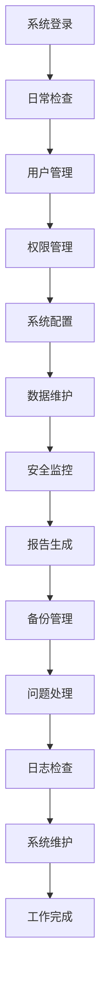

# 管理员工作流程文档 (Admin Workflow Documentation)

> **版本**: 1.0
> **创建日期**: 2025-01-15
> **最后更新**: 2025-01-15
> **维护者**: Claude Code
> **目标用户**: 系统管理员、诊所管理者、IT支持人员
> **相关文档**: [用户管理模块](../users/README.md) | [认证模块](../auth/README.md) | [系统配置指南](../development/configuration-optimization.md) | [运维监控指南](../operations/monitoring-guide.md)

## 📋 文档概述

本文档详细描述了 LYBT 中医诊所管理系统的管理员工作流程，涵盖用户管理、系统配置、数据维护、安全监控、报告生成等核心管理任务。工作流程旨在为系统管理员提供标准化的操作指导，确保系统安全、稳定、高效运行。

## 🎯 工作流程目标

### 主要目标
- **系统安全管理**: 确保系统数据安全和访问控制
- **用户权限管理**: 合理分配用户权限，保障系统安全
- **系统性能监控**: 监控系统运行状态，及时发现和解决问题
- **数据完整性维护**: 确保数据的准确性和完整性

### 次要目标
- **提高管理效率**: 标准化管理流程，减少重复操作
- **降低操作风险**: 规范操作流程，减少人为错误
- **支持业务决策**: 提供准确的数据报告和分析
- **保障系统稳定**: 确保系统持续稳定运行

## 🏢 管理员工作流程概览

### 整体工作流程


### 核心管理领域
1. **用户与权限管理**: 用户账户管理、角色权限分配
2. **系统配置管理**: 系统参数配置、功能模块管理
3. **数据维护管理**: 数据备份、数据清理、数据迁移
4. **安全监控管理**: 安全事件监控、威胁检测、应急响应
5. **报告分析管理**: 业务报告生成、数据分析、趋势预测

## 📋 详细工作流程

### 领域一：用户与权限管理 (User & Permission Management)

#### 1.1 用户账户管理
**负责人员**: 系统管理员
**操作频率**: 日常操作
**预计时间**: 10-30分钟/次
**操作步骤**:

1. **新用户创建**
   ```
   系统操作路径: 用户管理 → 用户账户 → 新建用户
   必填信息:
   - 用户名（唯一标识）
   - 姓名
   - 邮箱地址
   - 手机号码
   - 所属部门
   - 职位
   - 初始密码
   - 账户状态
   ```

   **创建流程**:
   - 步骤1: 填写用户基本信息
   - 步骤2: 设置初始密码和密码策略
   - 步骤3: 分配基本角色权限
   - 步骤4: 发送账户激活邮件
   - 步骤5: 记录创建操作日志

2. **用户信息修改**
   ```
   系统操作路径: 用户管理 → 用户账户 → 编辑用户
   可修改内容:
   - 基本信息（姓名、邮箱、电话）
   - 所属部门
   - 职位信息
   - 账户状态
   - 密码重置
   ```

3. **用户账户禁用/启用**
   ```
   系统操作路径: 用户管理 → 用户账户 → 账户状态
   操作类型:
   - 临时禁用（原因明确）
   - 永久禁用（离职、违规等）
   - 账户启用（重新激活）
   - 账户锁定（安全原因）
   ```

4. **用户账户删除**
   ```
   系统操作路径: 用户管理 → 用户账户 → 删除用户
   前置条件:
   - 确认用户无未完成任务
   - 备份用户相关数据
   - 获得授权批准
   - 记录删除原因
   ```

**质量要求**:
- 用户信息准确率 ≥ 99%
- 账户创建响应时间 ≤ 5分钟
- 权限分配正确率 = 100%

#### 1.2 角色权限管理
**负责人员**: 系统管理员
**操作频率**: 按需操作
**预计时间**: 15-45分钟/次
**操作步骤**:

1. **角色创建与配置**
   ```
   系统操作路径: 用户管理 → 角色管理 → 新建角色
   配置内容:
   - 角色名称
   - 角色描述
   - 权限范围
   - 数据访问级别
   - 操作权限
   - 有效期限
   ```

2. **权限分配管理**
   ```
   系统操作路径: 用户管理 → 权限管理 → 权限分配
   权限类型:
   - 功能权限（模块访问、操作权限）
   - 数据权限（查看、修改、删除权限）
   - 范围权限（部门、个人、全局权限）
   - 时间权限（工作时间限制）
   ```

3. **权限审核与调整**
   ```
   系统操作路径: 用户管理 → 权限管理 → 权限审核
   审核内容:
   - 权限分配合理性
   - 最小权限原则遵循
   - 权限使用频率
   - 权限过期检查
   - 异常权限检测
   ```

**质量要求**:
- 权限配置正确率 = 100%
- 权限审核及时率 ≥ 95%
- 最小权限原则遵循率 ≥ 98%

#### 1.3 用户培训与支持
**负责人员**: 系统管理员/培训专员
**操作频率**: 定期操作
**预计时间**: 30-120分钟/次
**操作步骤**:

1. **新用户培训**
   ```
   培训内容:
   - 系统基本操作
   - 功能模块介绍
   - 安全操作规范
   - 常见问题解决
   - 应急处理流程
   ```

2. **用户支持服务**
   ```
   支持内容:
   - 操作问题解答
   - 系统故障处理
   - 功能使用指导
   - 权限申请处理
   - 密码重置服务
   ```

**质量要求**:
- 用户培训覆盖率 = 100%
- 用户满意度 ≥ 90%
- 问题解决及时率 ≥ 95%

### 领域二：系统配置管理 (System Configuration Management)

#### 2.1 系统参数配置
**负责人员**: 系统管理员
**操作频率**: 配置变更时
**预计时间**: 20-60分钟/次
**操作步骤**:

1. **基础配置管理**
   ```
   系统操作路径: 系统配置 → 基础设置
   配置项:
   - 诊所基本信息
   - 系统运行参数
   - 数据连接配置
   - 邮件服务配置
   - 文件存储配置
   - 备份策略配置
   ```

2. **业务参数配置**
   ```
   系统操作路径: 系统配置 → 业务设置
   配置项:
   - 诊疗项目设置
   - 收费标准配置
   - 药材信息配置
   - 方剂模板管理
   - 诊疗流程配置
   ```

3. **安全参数配置**
   ```
   系统操作路径: 系统配置 → 安全设置
   配置项:
   - 密码策略配置
   - 会话管理配置
   - 访问控制配置
   - 审计日志配置
   - 威胁检测配置
   ```

**质量要求**:
- 配置参数准确率 = 100%
- 配置变更响应时间 ≤ 30分钟
- 配置错误率 ≤ 0.1%

#### 2.2 功能模块管理
**负责人员**: 系统管理员
**操作频率**: 按需操作
**预计时间**: 15-45分钟/次
**操作步骤**:

1. **模块启用/禁用**
   ```
   系统操作路径: 系统配置 → 模块管理
   操作内容:
   - 模块状态控制
   - 模块权限配置
   - 模块参数设置
   - 模块依赖检查
   - 模块版本管理
   ```

2. **模块更新管理**
   ```
   更新流程:
   - 更新包下载
   - 更新前备份
   - 更新包验证
   - 更新执行
   - 更新后验证
   - 回滚准备
   ```

**质量要求**:
- 模块更新成功率 ≥ 99%
- 系统停机时间 ≤ 10分钟
- 更新后验证覆盖率 = 100%

### 领域三：数据维护管理 (Data Maintenance Management)

#### 3.1 数据备份管理
**负责人员**: 系统管理员
**操作频率**: 日常操作
**预计时间**: 10-30分钟/次
**操作步骤**:

1. **自动备份监控**
   ```
   系统操作路径: 数据管理 → 备份管理 → 备份监控
   监控内容:
   - 备份任务执行状态
   - 备份文件完整性
   - 备份存储空间
   - 备份成功率统计
   - 备份异常告警
   ```

2. **手动备份执行**
   ```
   系统操作路径: 数据管理 → 备份管理 → 手动备份
   操作步骤:
   - 选择备份范围
   - 设置备份参数
   - 执行备份任务
   - 验证备份结果
   - 记录备份日志
   ```

3. **备份恢复测试**
   ```
   系统操作路径: 数据管理 → 备份管理 → 恢复测试
   测试内容:
   - 备份文件可读性
   - 数据完整性验证
   - 恢复时间测试
   - 恢复流程验证
   - 测试结果记录
   ```

**质量要求**:
- 数据备份成功率 ≥ 99.9%
- 备份完整性检查率 = 100%
- 恢复测试成功率 ≥ 95%

#### 3.2 数据清理与归档
**负责人员**: 系统管理员
**操作频率**: 定期操作（月度/季度）
**预计时间**: 30-90分钟/次
**操作步骤**:

1. **过期数据清理**
   ```
   系统操作路径: 数据管理 → 数据清理 → 过期数据
   清理范围:
   - 过期日志文件
   - 临时数据文件
   - 过期会话数据
   - 已删除数据
   - 缓存数据
   ```

2. **历史数据归档**
   ```
   系统操作路径: 数据管理 → 数据归档 → 历史数据
   归档策略:
   - 按时间归档
   - 按业务类型归档
   - 按数据重要性归档
   - 归档数据验证
   - 归档记录管理
   ```

**质量要求**:
- 数据清理准确率 = 100%
- 归档数据完整性 ≥ 99%
- 数据清理及时率 ≥ 95%

### 领域四：安全监控管理 (Security Monitoring Management)

#### 4.1 安全事件监控
**负责人员**: 系统管理员
**操作频率**: 实时监控
**预计时间**: 持续监控
**操作步骤**:

1. **实时安全监控**
   ```
   系统操作路径: 安全管理 → 实时监控
   监控内容:
   - 异常登录检测
   - 权限滥用监控
   - 数据访问异常
   - 系统入侵检测
   - 恶意行为识别
   ```

2. **安全事件分析**
   ```
   系统操作路径: 安全管理 → 事件分析
   分析内容:
   - 事件类型分类
   - 威胁等级评估
   - 影响范围分析
   - 处理优先级确定
   - 应急响应方案
   ```

**质量要求**:
- 安全事件检测率 ≥ 95%
- 误报率 ≤ 5%
- 响应时间 ≤ 5分钟

#### 4.2 审计日志管理
**负责人员**: 系统管理员
**操作频率**: 日常操作
**预计时间**: 15-30分钟/次
**操作步骤**:

1. **日志收集与分析**
   ```
   系统操作路径: 安全管理 → 日志管理 → 日志收集
   日志类型:
   - 系统操作日志
   - 用户行为日志
   - 安全事件日志
   - 错误异常日志
   - 性能监控日志
   ```

2. **日志审计分析**
   ```
   系统操作路径: 安全管理 → 日志管理 → 日志审计
   审计内容:
   - 异常行为识别
   - 合规性检查
   - 安全趋势分析
   - 风险评估报告
   - 改进建议提出
   ```

**质量要求**:
- 日志收集完整性 ≥ 99%
- 日志分析准确率 ≥ 90%
- 异常行为识别率 ≥ 85%

### 领域五：报告分析管理 (Report & Analytics Management)

#### 5.1 业务报告生成
**负责人员**: 系统管理员/业务分析师
**操作频率**: 定期操作（日报/周报/月报）
**预计时间**: 20-60分钟/次
**操作步骤**:

1. **日常运营报告**
   ```
   系统操作路径: 报告管理 → 运营报告 → 日报
   报告内容:
   - 患者就诊统计
   - 医师工作量统计
   - 收费收入统计
   - 药材使用统计
   - 系统使用情况
   ```

2. **业务分析报告**
   ```
   系统操作路径: 报告管理 → 分析报告 → 业务分析
   分析维度:
   - 患者流量分析
   - 病种分布分析
   - 疗效统计分析
   - 收入结构分析
   - 趋势预测分析
   ```

**质量要求**:
- 报告生成及时率 ≥ 95%
- 数据准确性 ≥ 99%
- 报告完整性 ≥ 98%

#### 5.2 系统性能报告
**负责人员**: 系统管理员
**操作频率**: 定期操作（周报/月报）
**预计时间**: 15-45分钟/次
**操作步骤**:

1. **系统性能监控**
   ```
   系统操作路径: 报告管理 → 性能报告 → 性能监控
   监控指标:
   - 系统响应时间
   - 数据库性能
   - 内存使用率
   - CPU使用率
   - 网络流量
   - 存储空间使用
   ```

2. **性能优化建议**
   ```
   系统操作路径: 报告管理 → 性能报告 → 优化建议
   分析内容:
   - 性能瓶颈识别
   - 资源使用优化
   - 配置调整建议
   - 容量规划建议
   - 升级需求评估
   ```

**质量要求**:
- 性能监控覆盖率 = 100%
- 性能问题识别率 ≥ 90%
- 优化建议采纳率 ≥ 70%

## 📊 工作流程质量控制

### 质量控制指标

#### 效率指标
- **用户账户创建时间**: ≤ 30分钟
- **权限变更响应时间**: ≤ 15分钟
- **系统配置变更时间**: ≤ 60分钟
- **备份执行时间**: ≤ 30分钟
- **报告生成时间**: ≤ 45分钟

#### 质量指标
- **操作准确率**: ≥ 99%
- **配置正确率**: ≥ 99.5%
- **数据完整性**: ≥ 99.9%
- **安全事件检测率**: ≥ 95%
- **用户满意度**: ≥ 90%

#### 安全指标
- **安全漏洞修复时间**: ≤ 24小时
- **权限滥用检测率**: ≥ 90%
- **数据泄露事件**: 0例
- **系统入侵事件**: 0例
- **合规性检查通过率**: = 100%

### 质量控制措施

#### 预防措施
1. **标准化操作流程**: 制定详细的操作标准
2. **权限最小化原则**: 严格控制权限分配
3. **双人复核机制**: 重要操作需要复核
4. **定期培训考核**: 提升管理员技能水平

#### 检测措施
1. **自动化监控**: 系统自动监控异常操作
2. **审计日志检查**: 定期检查审计日志
3. **性能监控**: 实时监控系统性能
4. **安全扫描**: 定期进行安全漏洞扫描

#### 纠正措施
1. **问题快速响应**: 建立快速响应机制
2. **根因分析**: 深入分析问题原因
3. **改进措施制定**: 制定针对性改进措施
4. **效果评估**: 评估改进措施效果

## 🔧 系统操作指南

### 常用操作快捷键

#### 用户管理模块
- `Ctrl+N`: 新建用户
- `Ctrl+E`: 编辑用户
- `Ctrl+D`: 删除用户
- `Ctrl+R`: 刷新用户列表
- `Ctrl+F`: 搜索用户

#### 系统配置模块
- `Ctrl+S`: 保存配置
- `Ctrl+Z`: 撤销操作
- `Ctrl+R`: 重置配置
- `F5`: 刷新配置
- `Ctrl+T`: 测试配置

#### 数据管理模块
- `Ctrl+B`: 执行备份
- `Ctrl+C`: 清理数据
- `Ctrl+A`: 归档数据
- `Ctrl+V`: 验证数据
- `Ctrl+R`: 恢复数据

#### 报告管理模块
- `Ctrl+G`: 生成报告
- `Ctrl+E`: 导出报告
- `Ctrl+P`: 打印报告
- `Ctrl+S`: 保存报告
- `Ctrl+R`: 刷新报告

### 常见问题解决

#### 问题1: 用户无法登录
**可能原因**:
- 用户名或密码错误
- 账户被禁用或锁定
- 权限配置错误
- 网络连接问题

**解决步骤**:
1. 验证用户身份信息
2. 检查账户状态
3. 重置用户密码
4. 检查权限配置
5. 测试网络连接

#### 问题2: 系统配置保存失败
**可能原因**:
- 配置参数格式错误
- 权限不足
- 系统资源不足
- 数据库连接问题

**解决步骤**:
1. 检查配置参数格式
2. 验证管理员权限
3. 检查系统资源
4. 测试数据库连接
5. 重新尝试保存

#### 问题3: 数据备份失败
**可能原因**:
- 存储空间不足
- 数据库连接问题
- 备份任务冲突
- 权限不足

**解决步骤**:
1. 检查存储空间
2. 测试数据库连接
3. 停止冲突任务
4. 验证备份权限
5. 重新执行备份

#### 问题4: 系统性能异常
**可能原因**:
- 系统资源不足
- 数据库性能问题
- 网络连接问题
- 程序异常

**解决步骤**:
1. 检查系统资源使用
2. 分析数据库性能
3. 测试网络连接
4. 检查程序日志
5. 重启相关服务

## 📈 工作流程优化建议

### 效率优化措施

#### 自动化改进
1. **自动化脚本**: 编写自动化脚本处理重复任务
2. **定时任务**: 设置定时任务自动执行定期操作
3. **智能提醒**: 配置智能提醒减少遗漏
4. **批量操作**: 支持批量操作提高效率

#### 流程优化
1. **简化流程**: 简化不必要的操作步骤
2. **并行处理**: 支持并行处理提高效率
3. **模板化操作**: 使用模板减少重复配置
4. **快速操作**: 设置快速操作入口

### 安全优化措施

#### 访问控制
1. **多因素认证**: 启用多因素认证提高安全性
2. **权限细分**: 细化权限控制降低风险
3. **会话管理**: 加强会话安全管理
4. **IP限制**: 设置IP访问限制

#### 监控预警
1. **实时监控**: 加强实时安全监控
2. **异常检测**: 提高异常行为检测能力
3. **预警机制**: 建立完善的预警机制
4. **应急响应**: 制定应急响应预案

## 📚 参考资料

### 相关规范标准
- [系统管理员操作规范](../standards/admin-operation-standards.md)
- [信息安全管理规范](../standards/information-security-standards.md)
- [数据备份恢复规范](../standards/backup-recovery-standards.md)
- [系统运维管理规范](../standards/system-operations-standards.md)

### 系统操作手册
- [用户管理系统操作指南](../users/admin-guide.md)
- [系统配置管理指南](../development/configuration-optimization.md)
- [数据备份恢复指南](../operations/backup-recovery-guide.md)
- [安全监控管理指南](../security/security-monitoring-guide.md)

### 培训材料
- [系统管理员培训手册](../training/admin-training-manual.md)
- [安全操作培训视频](../training/security-training-videos/)
- [应急响应处理指南](../help/emergency-response-guide.md)
- [最佳实践案例](../best-practices/admin-cases.md)

## 🔄 版本历史

| 版本 | 日期 | 更新内容 | 作者 |
|------|------|----------|------|
| 1.0 | 2025-01-15 | 初始版本，包含完整管理员工作流程 | Claude Code |

## 📞 技术支持

- **系统管理员**: 系统管理团队
- **技术支持**: 技术支持团队
- **联系方式**: admin-support@lybt.com
- **服务时间**: 7×24小时
- **紧急联系**: 400-XXX-XXXX

---

*本文档遵循 LYBT 中医诊所管理系统文档标准，如有疑问请参考相关文档或联系技术支持。*

**注意事项**:
1. 管理员应严格遵守操作规范，确保系统安全稳定运行
2. 重要操作前应做好数据备份，防止数据丢失
3. 定期更新系统和补丁，保持系统安全性
4. 发现安全问题应立即报告并采取相应措施
5. 本文档将定期更新，请关注最新版本