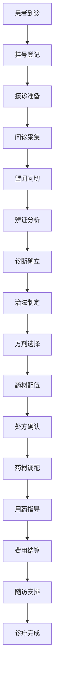

# 临床工作流程文档 (Clinical Workflow Documentation)

> **版本**: 1.0
> **创建日期**: 2025-01-15
> **最后更新**: 2025-01-15
> **维护者**: Claude Code
> **目标用户**: 中医执业医师、临床助理、护士
> **相关文档**: [患者管理模块](../patients/README.md) | [辨证管理模块](../consultation/README.md) | [处方管理模块](../prescriptions/README.md) | [病案管理模块](../medicalcase/README.md)

## 📋 文档概述

本文档详细描述了 LYBT 中医诊所管理系统的临床工作流程，涵盖从患者接诊到处方开具的完整诊疗过程。工作流程基于传统中医诊疗模式，结合现代医疗信息化管理实践，为执业医师提供标准化的临床操作指导。

## 🎯 工作流程目标

### 主要目标
- **提高诊疗效率**: 通过信息化手段优化诊疗流程，减少等待时间
- **确保医疗质量**: 标准化诊疗流程，确保医疗服务质量
- **规范操作流程**: 为医师提供标准化的操作指导和参考
- **促进临床研究**: 完整记录诊疗数据，支持临床研究和经验总结

### 次要目标
- **简化文书工作**: 减少手动记录，提高工作效率
- **改善患者体验**: 优化流程，提升患者满意度
- **支持质量控制**: 为医疗质量控制提供数据支持
- **便于教学培训**: 为新医师提供标准化的培训材料

## 🏥 临床工作流程概览

### 整体工作流程


### 核心诊疗阶段
1. **患者接诊阶段**: 挂号登记、基本信息采集
2. **四诊合参阶段**: 望闻问切、症状体征采集
3. **辨证论治阶段**: 病因病机分析、辨证分型
4. **方药治疗阶段**: 治法治则确立、方剂药材选择
5. **随访管理阶段**: 疗效评估、随访安排

## 📋 详细工作流程

### 阶段一：患者接诊 (Patient Reception)

#### 1.1 挂号登记
**负责人员**: 前台接待/临床助理
**预计时间**: 3-5分钟
**操作步骤**:

1. **患者身份确认**
   - 询问患者姓名、年龄、联系方式
   - 核对患者身份信息
   - 确认初诊/复诊情况

2. **挂号信息录入**
   ```
   系统操作路径: 患者管理 → 挂号登记
   必填信息:
   - 患者姓名
   - 性别
   - 年龄/出生日期
   - 联系电话
   - 主诉（简述）
   ```

3. **分诊安排**
   - 根据主诉进行初步分诊
   - 安排接诊医师
   - 告知患者等候时间和注意事项

**质量要求**:
- 信息录入准确率 ≥ 99%
- 挂号完成时间 ≤ 5分钟
- 患者满意度 ≥ 90%

#### 1.2 接诊准备
**负责人员**: 临床助理/医师
**预计时间**: 2-3分钟
**操作步骤**:

1. **病历资料准备**
   - 调取患者历史病历
   - 准备相关检查报告
   - 整理既往用药记录

2. **诊室准备**
   - 检查诊疗设备状态
   - 准备必要的检查工具
   - 确保诊室环境适宜

**系统操作**:
```
系统操作路径: 患者管理 → 患者详情 → 历史病历
查看内容:
- 基本信息
- 既往病史
- 过敏史
- 用药史
- 既往诊疗记录
```

### 阶段二：四诊合参 (Four Diagnostic Methods)

#### 2.1 问诊采集 (Inquiry)
**负责人员**: 执业医师
**预计时间**: 10-15分钟
**操作步骤**:

1. **主诉详细采集**
   ```
   系统录入路径: 辨证管理 → 问诊记录 → 主诉
   录入内容:
   - 主要症状描述
   - 症状发生时间
   - 症状演变过程
   - 伴随症状
   - 症状严重程度
   ```

2. **现病史采集**
   ```
   系统录入路径: 辨证管理 → 问诊记录 → 现病史
   录入内容:
   - 起病情况
   - 病情发展
   - 诊疗经过
   - 目前状况
   ```

3. **既往史采集**
   ```
   系统录入路径: 辨证管理 → 问诊记录 → 既往史
   录入内容:
   - 既往疾病史
   - 手术史
   - 外伤史
   - 输血史
   ```

4. **个人史采集**
   ```
   系统录入路径: 辨证管理 → 问诊记录 → 个人史
   录入内容:
   - 工作性质
   - 生活习惯
   - 饮食习惯
   - 睡眠情况
   - 精神状态
   ```

5. **家族史采集**
   ```
   系统录入路径: 辨证管理 → 问诊记录 → 家族史
   录入内容:
   - 家族遗传病史
   - 家族成员健康状况
   ```

**质量要求**:
- 问诊内容完整率 ≥ 95%
- 重要信息遗漏率 ≤ 5%
- 病史记录准确性 ≥ 98%

#### 2.2 望诊 (Observation)
**负责人员**: 执业医师
**预计时间**: 5-8分钟
**操作步骤**:

1. **全身望诊**
   ```
   系统录入路径: 辨证管理 → 望诊记录 → 全身望诊
   观察内容:
   - 神色状态
   - 形态体态
   - 动态表现
   - 皮肤状况
   - 毛发状态
   ```

2. **局部望诊**
   ```
   系统录入路径: 辨证管理 → 望诊记录 → 局部望诊
   观察内容:
   - 头面部状态
   - 五官状况
   - 舌象（重点）
   - 四肢状态
   ```

3. **舌诊记录**
   ```
   系统录入路径: 辨证管理 → 望诊记录 → 舌诊
   记录内容:
   - 舌质颜色
   - 舌体形态
   - 舌苔颜色
   - 舌苔厚薄
   - 舌下络脉
   - 舌象照片（可选）
   ```

**质量要求**:
- 望诊记录完整性 ≥ 90%
- 舌诊描述准确性 ≥ 95%
- 重要体征遗漏率 ≤ 3%

#### 2.3 闻诊 (Listening & Smelling)
**负责人员**: 执业医师
**预计时间**: 3-5分钟
**操作步骤**:

1. **听诊**
   ```
   系统录入路径: 辨证管理 → 闻诊记录 → 听诊
   听诊内容:
   - 语音语调
   - 呼吸声音
   - 咳嗽声音
   - 其他异常声音
   ```

2. **嗅诊**
   ```
   系统录入路径: 辨证管理 → 闻诊记录 → 嗅诊
   嗅诊内容:
   - 口气气味
   - 汗液气味
   - 排泄物气味
   - 其他异常气味
   ```

**质量要求**:
- 闻诊记录完整性 ≥ 85%
- 异常体征识别率 ≥ 90%

#### 2.4 切诊 (Pulse Taking & Palpation)
**负责人员**: 执业医师
**预计时间**: 5-8分钟
**操作步骤**:

1. **脉诊**
   ```
   系统录入路径: 辨证管理 → 切诊记录 → 脉诊
   脉诊内容:
   - 寸口脉位
   - 脉象特征
   - 脉率记录
   - 脉势强弱
   - 左右手脉象对比
   - 脉象描述（浮沉迟数等）
   ```

2. **按诊**
   ```
   系统录入路径: 辨证管理 → 切诊记录 → 按诊
   按诊内容:
   - 疼痛部位
   - 压痛程度
   - 肿块情况
   - 皮肤温度
   - 其他异常体征
   ```

**质量要求**:
- 脉诊描述准确性 ≥ 85%
- 按诊记录完整性 ≥ 90%
- 重要体征遗漏率 ≤ 5%

### 阶段三：辨证论治 (Pattern Differentiation & Treatment)

#### 3.1 病因病机分析
**负责人员**: 执业医师
**预计时间**: 5-10分钟
**操作步骤**:

1. **病因分析**
   ```
   系统录入路径: 辨证管理 → 病因病机 → 病因分析
   分析内容:
   - 外感因素（风寒暑湿燥火）
   - 内伤因素（情志饮食劳逸）
   - 病理产物因素
   - 其他致病因素
   ```

2. **病机分析**
   ```
   系统录入路径: 辨证管理 → 病因病机 → 病机分析
   分析内容:
   - 发病机理
   - 病变部位
   - 病理性质
   - 病势演变
   - 预后判断
   ```

**质量要求**:
- 病因病机分析完整性 ≥ 90%
- 逻辑性合理性 ≥ 95%
- 中医理论基础符合性 ≥ 98%

#### 3.2 辨证分型
**负责人员**: 执业医师
**预计时间**: 5-8分钟
**操作步骤**:

1. **证候诊断**
   ```
   系统录入路径: 辨证管理 → 辨证分型 → 证候诊断
   诊断内容:
   - 主要证候
   - 兼夹证候
   - 证候分型
   - 诊断依据
   - 鉴别诊断
   ```

2. **证候要素提取**
   ```
   系统录入路径: 辨证管理 → 辨证分型 → 证候要素
   提取内容:
   - 病位证素
   - 病性证素
   - 病机证素
   - 证候组合
   ```

**质量要求**:
- 证候诊断准确性 ≥ 90%
- 辨证分型合理性 ≥ 95%
- 诊断依据充分性 ≥ 85%

#### 3.3 治法治则
**负责人员**: 执业医师
**预计时间**: 3-5分钟
**操作步骤**:

1. **治法确立**
   ```
   系统录入路径: 辨证管理 → 治法治则 → 治法
   治法内容:
   - 基本治法
   - 具体治法
   - 治法组合
   - 治法优先级
   ```

2. **治则制定**
   ```
   系统录入路径: 辨证管理 → 治法治则 → 治则
   治则内容:
   - 标本缓急
   - 扶正祛邪
   - 调理阴阳
   - 三因制宜
   ```

**质量要求**:
- 治法治则合理性 ≥ 95%
- 与辨证匹配度 ≥ 90%
- 中医理论符合性 ≥ 98%

### 阶段四：方药治疗 (Formula & Herbal Medicine)

#### 4.1 方剂选择
**负责人员**: 执业医师
**预计时间**: 5-10分钟
**操作步骤**:

1. **基础方选择**
   ```
   系统操作路径: 方剂管理 → 方剂查询
   选择依据:
   - 主要证候
   - 兼夹证候
   - 患者体质
   - 病情轻重
   ```

2. **方剂化裁**
   ```
   系统操作路径: 方剂管理 → 方剂化裁
   化裁内容:
   - 药味加减
   - 剂量调整
   - 煎服方法
   - 注意事项
   ```

**质量要求**:
- 方剂选择合理性 ≥ 95%
- 化裁依据充分性 ≥ 90%
- 配伍禁忌符合性 = 100%

#### 4.2 药材配伍
**负责人员**: 执业医师
**预计时间**: 5-8分钟
**操作步骤**:

1. **药材选择**
   ```
   系统操作路径: 药材管理 → 药材查询
   选择标准:
   - 药材道地性
   - 质量等级
   - 价格因素
   - 库存情况
   ```

2. **配伍验证**
   ```
   系统操作路径: 方剂管理 → 配伍检查
   检查内容:
   - 君臣佐使
   - 药性配伍
   - 禁忌配伍
   - 剂量合理性
   ```

**质量要求**:
- 药材选择合理性 ≥ 95%
- 配伍禁忌检查 = 100%
- 剂量合理性 ≥ 90%

#### 4.3 处方确认
**负责人员**: 执业医师
**预计时间**: 3-5分钟
**操作步骤**:

1. **处方生成**
   ```
   系统操作路径: 处方管理 → 处方开具
   处方内容:
   - 患者信息
   - 诊断信息
   - 药材清单
   - 用法用量
   - 煎服方法
   - 注意事项
   ```

2. **处方审核**
   ```
   系统操作路径: 处方管理 → 处方审核
   审核内容:
   - 用药合理性
   - 配伍禁忌
   - 剂量安全
   - 特殊人群
   - 药物相互作用
   ```

**质量要求**:
- 处方规范性 = 100%
- 用药安全性 ≥ 99%
- 配伍合理性 ≥ 95%

### 阶段五：随访管理 (Follow-up Management)

#### 5.1 疗效评估
**负责人员**: 执业医师/临床助理
**预计时间**: 5-10分钟
**操作步骤**:

1. **症状评估**
   ```
   系统录入路径: 病案管理 → 随访记录 → 症状评估
   评估内容:
   - 主要症状变化
   - 伴随症状变化
   - 生活质量改善
   - 不良反应情况
   ```

2. **体征检查**
   ```
   系统录入路径: 病案管理 → 随访记录 → 体征检查
   检查内容:
   - 舌象变化
   - 脉象变化
   - 其他体征变化
   ```

**质量要求**:
- 疗效评估完整性 ≥ 95%
- 客观性准确性 ≥ 90%

#### 5.2 随访安排
**负责人员**: 临床助理
**预计时间**: 2-3分钟
**操作步骤**:

1. **随访计划**
   ```
   系统操作路径: 病案管理 → 随访管理
   计划内容:
   - 随访时间
   - 随访方式
   - 随访内容
   - 负责人员
   ```

2. **提醒设置**
   ```
   系统操作路径: 病案管理 → 提醒设置
   提醒内容:
   - 复诊时间
   - 用药提醒
   - 生活注意事项
   ```

**质量要求**:
- 随访安排及时性 ≥ 95%
- 患者依从性 ≥ 80%

## 📊 工作流程质量控制

### 质量控制指标

#### 效率指标
- **平均接诊时间**: 30-45分钟
- **病历书写时间**: 10-15分钟
- **处方开具时间**: 5-10分钟
- **患者等待时间**: ≤ 30分钟

#### 质量指标
- **病历完整率**: ≥ 95%
- **诊断准确率**: ≥ 90%
- **处方合格率**: ≥ 98%
- **患者满意度**: ≥ 90%

#### 安全指标
- **用药安全事件**: 0例
- **医疗差错率**: ≤ 0.1%
- **医疗纠纷率**: ≤ 0.05%
- **不良事件报告率**: 100%

### 质量控制措施

#### 事前控制
1. **培训认证**: 医师必须经过系统操作培训
2. **权限管理**: 严格按照职责分工设置权限
3. **流程标准化**: 制定标准操作流程
4. **质量标准**: 建立质量评价标准

#### 事中控制
1. **实时监控**: 系统实时监控操作流程
2. **异常提醒**: 异常情况自动提醒
3. **质量检查**: 关键环节质量检查
4. **指导支持**: 系统提供操作指导

#### 事后控制
1. **质量评价**: 定期质量评价
2. **问题分析**: 问题原因分析
3. **改进措施**: 持续改进措施
4. **经验总结**: 最佳实践总结

## 🔧 系统操作指南

### 常用操作快捷键

#### 患者管理模块
- `Ctrl+N`: 新建患者
- `Ctrl+S`: 保存患者信息
- `Ctrl+F`: 搜索患者
- `F5`: 刷新患者列表

#### 辨证管理模块
- `Ctrl+D`: 新建辨证记录
- `Ctrl+W`: 望诊记录
- `Ctrl+I`: 问诊记录
- `Ctrl+P`: 脉诊记录

#### 方剂管理模块
- `Ctrl+R`: 方剂查询
- `Ctrl+A`: 添加方剂
- `Ctrl+E`: 编辑方剂
- `Ctrl+T`: 方剂化裁

#### 处方管理模块
- `Ctrl+P`: 新建处方
- `Ctrl+Enter`: 保存处方
- `Ctrl+Print`: 打印处方
- `F9`: 处方审核

### 常见问题解决

#### 问题1: 系统登录失败
**解决步骤**:
1. 检查用户名和密码是否正确
2. 确认网络连接正常
3. 清除浏览器缓存
4. 联系系统管理员

#### 问题2: 患者信息无法保存
**解决步骤**:
1. 检查必填项是否完整
2. 确认信息格式是否正确
3. 检查网络连接状态
4. 重新尝试保存

#### 问题3: 处方开具失败
**解决步骤**:
1. 检查药材库存是否充足
2. 确认配伍是否有禁忌
3. 检查剂量是否合理
4. 联系药师审核

#### 问题4: 打印处方失败
**解决步骤**:
1. 检查打印机连接状态
2. 确认打印机纸张充足
3. 重启打印机
4. 联系技术支持

## 📈 工作流程优化建议

### 效率优化措施

#### 流程优化
1. **并行处理**: 问诊和体格检查并行进行
2. **模板使用**: 使用常见病种模板
3. **快捷操作**: 设置常用操作快捷键
4. **自动填充**: 自动填充常见信息

#### 技术优化
1. **语音识别**: 使用语音识别录入病史
2. **智能辅助**: 智能辨证辅助系统
3. **移动应用**: 使用移动设备进行操作
4. **云端同步**: 数据云端实时同步

### 质量优化措施

#### 标准化建设
1. **诊疗规范**: 制定诊疗规范
2. **质量标准**: 建立质量标准
3. **培训体系**: 完善培训体系
4. **考核机制**: 建立考核机制

#### 持续改进
1. **数据分析**: 定期数据分析
2. **问题反馈**: 建立反馈机制
3. **经验分享**: 经验交流分享
4. **技术升级**: 定期技术升级

## 📚 参考资料

### 相关规范标准
- [中医病历书写规范](../standards/medical-record-standards.md)
- [中医诊疗规范](../standards/tcm-diagnosis-standards.md)
- [处方管理办法](../standards/prescription-management-standards.md)
- [医疗质量安全核心制度](../standards/medical-quality-standards.md)

### 系统操作手册
- [患者管理系统操作指南](../patients/user-guide.md)
- [辨证管理系统操作指南](../consultation/user-guide.md)
- [方剂管理系统操作指南](../formula/user-guide.md)
- [处方管理系统操作指南](../prescriptions/user-guide.md)

### 培训材料
- [新医师培训手册](../training/new-doctor-manual.md)
- [系统操作培训视频](../training/video-tutorials/)
- [常见问题解答](../help/faq.md)
- [最佳实践案例](../best-practices/clinical-cases.md)

## 🔄 版本历史

| 版本 | 日期 | 更新内容 | 作者 |
|------|------|----------|------|
| 1.0 | 2025-01-15 | 初始版本，包含完整临床工作流程 | Claude Code |

## 📞 技术支持

- **系统管理员**: 技术支持团队
- **联系方式**: support@lybt.com
- **服务时间**: 工作日 8:00-18:00
- **紧急联系**: 400-XXX-XXXX

---

*本文档遵循 LYBT 中医诊所管理系统文档标准，如有疑问请参考相关文档或联系技术支持。*

**注意事项**:
1. 本文档描述的标准工作流程仅供参考，实际诊疗应根据患者具体情况灵活调整
2. 医师在诊疗过程中应严格遵守医疗法规和职业道德
3. 系统操作过程中发现任何问题应及时向技术支持部门反馈
4. 本文档将定期更新，请关注最新版本