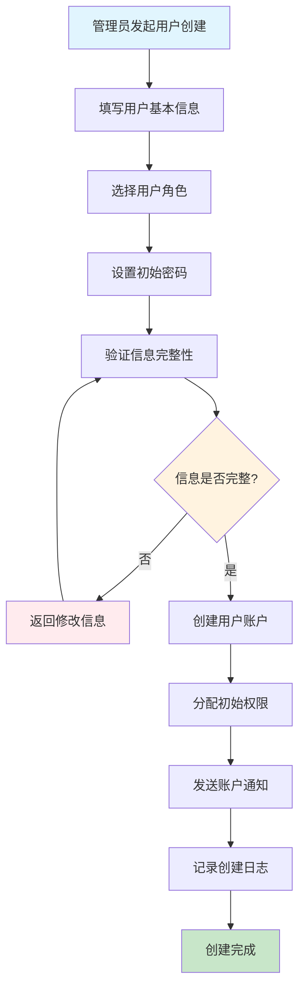
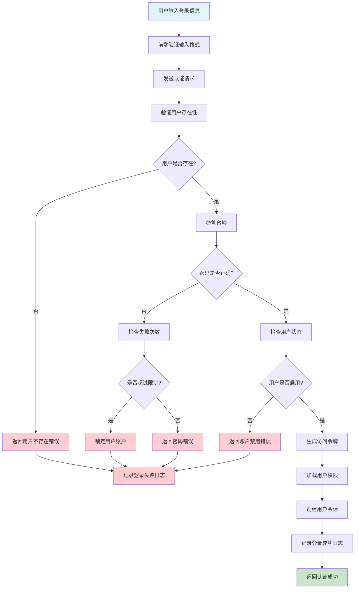
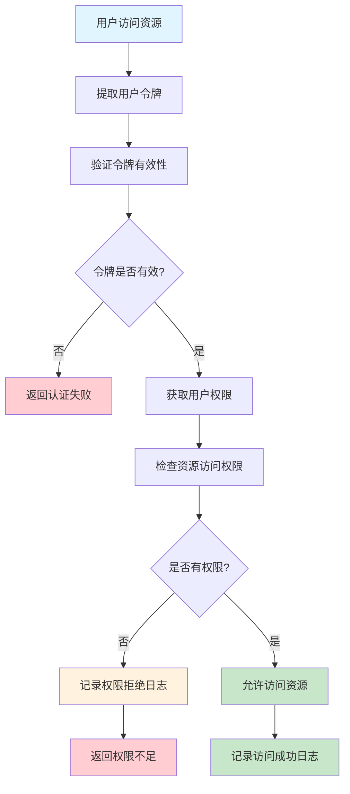

# 用户管理模块文档

> **版本**: 1.0  
> **创建日期**: 2025-10-15  
> **模块负责人**: 系统管理员  
> **架构标准**: [Server模块设计标准](../../architecture/server-module-design-standard.md), [Client端统一设计标准](../../architecture/client/unified-design-standard.md)  
> **Project Standardization 3.0**: Task 4.3.1

---

## 1. 模块概述

### 1.1 功能简介

用户管理模块是LYBT中医诊所系统的核心基础模块，负责管理系统中的所有用户账户、角色权限和访问控制。该模块为整个系统提供用户身份认证、授权管理和用户生命周期管理功能，确保系统的安全性和合规性。

### 1.2 业务价值

- **安全访问控制**: 通过基于角色的访问控制（RBAC）确保系统安全性
- **用户生命周期管理**: 提供完整的用户创建、管理、禁用、删除流程
- **权限精细化控制**: 支持细粒度的功能权限和数据权限管理
- **合规性支持**: 满足医疗行业对用户访问控制的合规要求
- **审计追踪**: 完整的用户操作日志和权限变更记录

### 1.3 核心功能

#### 1.3.1 用户账户管理
- **用户创建**: 创建新的系统用户账户
- **用户信息管理**: 维护用户基本信息、联系方式等
- **用户状态管理**: 启用、禁用、锁定用户账户
- **密码管理**: 密码重置、密码策略 enforcement
- **用户删除**: 软删除用户账户，保留审计信息

#### 1.3.2 角色权限管理
- **角色定义**: 创建和管理系统角色
- **权限分配**: 为角色分配具体的系统权限
- **用户角色关联**: 将用户分配到相应角色
- **权限继承**: 支持角色权限的继承机制
- **动态权限**: 基于业务场景的动态权限控制

#### 1.3.3 认证授权
- **用户登录**: 用户身份验证和会话管理
- **权限验证**: 实时权限检查和授权
- **会话管理**: 用户会话的创建、维护和销毁
- **单点登录**: 支持系统内的单点登录
- **安全策略**: 登录失败锁定、会话超时等安全策略

### 1.4 系统边界

```
┌─────────────────────────────────────────────────────────────┐
│                    用户管理模块                                │
├─────────────────────────────────────────────────────────────┤
│  输入:                                                       │
│  • 用户创建请求 (用户名、密码、角色等)                        │
│  • 用户登录请求 (用户名、密码)                                │
│  • 权限检查请求 (用户ID、操作类型、资源ID)                     │
│  • 角色分配请求 (用户ID、角色ID)                              │
│                                                             │
│  输出:                                                       │
│  • 用户信息 (用户详情、权限列表)                               │
│  • 认证结果 (成功/失败、访问令牌)                              │
│  • 授权结果 (允许/拒绝、权限范围)                               │
│  • 操作日志 (审计记录)                                         │
└─────────────────────────────────────────────────────────────┘
```

---

## 2. 用户角色与工作流

### 2.1 目标用户

#### 2.1.1 系统管理员
**职责**:
- 创建和管理所有用户账户
- 分配和调整用户角色
- 配置系统安全策略
- 监控用户活动和安全事件

**使用场景**:
- 新员工入职时创建账户
- 员工离职时禁用账户
- 定期审查用户权限
- 处理用户账户安全问题

#### 2.1.2 诊所管理员
**职责**:
- 管理诊所内部用户账户
- 分配业务相关权限
- 查看用户活动报告

**使用场景**:
- 医生权限分配
- 护士账户管理
- 前台用户权限调整

#### 2.1.3 医生用户
**职责**:
- 管理个人账户信息
- 查看个人权限范围
- 处理患者相关业务

**使用场景**:
- 登录系统查看患者信息
- 开具处方和诊疗记录
- 查看个人工作统计

#### 2.1.4 护士用户
**职责**:
- 协助医生处理患者信息
- 管理预约和基础信息
- 执行医嘱和护理记录

**使用场景**:
- 患者信息录入
- 预约管理
- 护理记录维护

### 2.2 核心工作流

#### 2.2.1 用户创建工作流



**关键步骤说明**:
1. **信息收集**: 收集用户基本信息，包括姓名、邮箱、手机号等
2. **角色分配**: 根据用户职责分配相应角色
3. **密码设置**: 设置符合安全策略的初始密码
4. **权限验证**: 验证角色权限配置的正确性
5. **通知发送**: 向用户发送账户信息和登录指引
6. **审计记录**: 记录完整的创建过程用于审计

#### 2.2.2 用户登录认证工作流



#### 2.2.3 权限验证工作流



---

## 3. 技术架构

### 3.1 整体架构设计

用户管理模块采用标准的三层架构模式，遵循项目的统一设计标准：

```
┌─────────────────────────────────────────────────────────────┐
│                    Client层 (Desktop)                       │
├─────────────────────────────────────────────────────────────┤
│  ┌─────────────────┐  ┌─────────────────┐  ┌─────────────────┐ │
│  │ UserManagement  │  │ UserDetail      │  │ UserCreate      │ │
│  │ ViewModel       │  │ ViewModel       │  │ ViewModel       │ │
│  └─────────────────┘  └─────────────────┘  └─────────────────┘ │
│           │                     │                     │         │
│           └─────────────────────┼─────────────────────┘         │
│                                 │                               │
│  ┌─────────────────────────────────────────────────────────┐ │
│  │                 UserRepository                        │ │
│  └─────────────────────────────────────────────────────────┘ │
└─────────────────────────────────────────────────────────────┘
                                │ HTTP/REST API
┌─────────────────────────────────────────────────────────────┐
│                    Server层 (WebAPI)                       │
├─────────────────────────────────────────────────────────────┤
│  ┌─────────────────┐  ┌─────────────────┐  ┌─────────────────┐ │
│  │ UserController  │  │ RoleController   │  │ AuthController   │ │
│  └─────────────────┘  └─────────────────┘  └─────────────────┘ │
│           │                     │                     │         │
│           └─────────────────────┼─────────────────────┘         │
│                                 │                               │
│  ┌─────────────────────────────────────────────────────────┐ │
│  │                 UserService                           │ │
│  └─────────────────────────────────────────────────────────┘ │
│                                 │                               │
│  ┌─────────────────────────────────────────────────────────┐ │
│  │                 UserRepository                        │ │
│  └─────────────────────────────────────────────────────────┘ │
│                                 │                               │
│  ┌─────────────────────────────────────────────────────────┐ │
│  │                Database (EF Core)                      │ │
│  └─────────────────────────────────────────────────────────┘ │
└─────────────────────────────────────────────────────────────┘
```

### 3.2 核心组件设计

#### 3.2.1 Server端核心组件

**用户服务层 (UserService)**
```csharp
// 服务接口定义在 Shared.Interfaces.Services
public interface IUserService
{
    Task<ServiceResult<PagedResult<UserDto>>> GetPagedAsync(int page = 1, int pageSize = 20, string? keyword = null);
    Task<ServiceResult<UserDto>> GetByIdAsync(Guid id);
    Task<ServiceResult<UserDto>> CreateAsync(UserCreateDto dto, CancellationToken cancellationToken = default);
    Task<ServiceResult<UserDto>> UpdateAsync(Guid id, UserUpdateDto dto, CancellationToken cancellationToken = default);
    Task<ServiceResult> DeleteAsync(Guid id);
    Task<ServiceResult> DisableAsync(Guid id);
    Task<ServiceResult> EnableAsync(Guid id);
    Task<ServiceResult> ChangePasswordAsync(Guid id, string oldPassword, string newPassword);
    Task<ServiceResult> ResetPasswordAsync(Guid id, string newPassword);
    Task<ServiceResult<List<RoleDto>>> GetUserRolesAsync(Guid userId);
    Task<ServiceResult> AssignRoleAsync(Guid userId, Guid roleId);
    Task<ServiceResult> RemoveRoleAsync(Guid userId, Guid roleId);
}
```

**用户仓储层 (UserRepository)**
```csharp
public interface IUserRepository : IRepository<UserEntity>
{
    Task<UserEntity?> GetByUsernameAsync(string username);
    Task<UserEntity?> GetByEmailAsync(string email);
    Task<bool> IsUsernameExistAsync(string username, Guid? excludeId = null);
    Task<bool> IsEmailExistAsync(string email, Guid? excludeId = null);
    Task<List<RoleEntity>> GetUserRolesAsync(Guid userId);
    Task<List<UserEntity>> GetActiveUsersAsync();
    Task<List<UserEntity>> GetUsersByRoleAsync(Guid roleId);
    Task<UserLoginHistoryEntity?> GetLastLoginAsync(Guid userId);
    Task LogLoginAttemptAsync(UserLoginHistoryEntity loginHistory);
}
```

**数据模型 (UserEntity)**
```csharp
public class UserEntity : BaseEntity
{
    public string UserName { get; set; } = string.Empty;
    public string Email { get; set; } = string.Empty;
    public string RealName { get; set; } = string.Empty;
    public string PhoneNumber { get; set; } = string.Empty;
    public string PasswordHash { get; set; } = string.Empty;
    public bool IsActive { get; set; } = true;
    public bool IsLocked { get; set; } = false;
    public DateTime? LastLoginAt { get; set; }
    public int FailedLoginAttempts { get; set; } = 0;
    public DateTime? LockedUntil { get; set; }
    public string? RefreshToken { get; set; }
    public DateTime? RefreshTokenExpiry { get; set; }
    
    // 导航属性
    public virtual ICollection<UserRoleEntity> UserRoles { get; set; } = new List<UserRoleEntity>();
    public virtual ICollection<UserLoginHistoryEntity> LoginHistory { get; set; } = new List<UserLoginHistoryEntity>();
}
```

#### 3.2.2 Client端核心组件

**用户管理ViewModel**
```csharp
public class UserManagementViewModel : UnifiedListViewModelBase<UserDto>
{
    private readonly IUserRepository _userRepository;
    
    public UserManagementViewModel(
        IUserRepository userRepository,
        IEventAggregator eventAggregator,
        ILoggerFactory loggerFactory,
        IRegionManager regionManager,
        ISessionManager? sessionManager = null,
        IUserNotificationService? userNotificationService = null)
        : base(eventAggregator, loggerFactory, regionManager, sessionManager, userNotificationService)
    {
        _userRepository = userRepository ?? throw new ArgumentNullException(nameof(userRepository));
        PageTitle = "用户管理";
        InitializeCommands();
    }

    protected override async Task<IEnumerable<UserDto>> GetItemsAsync(int page, int pageSize, string? searchText)
    {
        var result = await _userRepository.GetPagedAsync(page, pageSize, searchText);
        
        if (result != null && result.Items != null)
        {
            TotalCount = result.TotalCount;
            return result.Items;
        }
        
        return Enumerable.Empty<UserDto>();
    }
    
    // 命令实现
    public ICommand CreateUserCommand { get; private set; }
    public ICommand EditUserCommand { get; private set; }
    public ICommand DisableUserCommand { get; private set; }
    public ICommand EnableUserCommand { get; private set; }
    public ICommand ResetPasswordCommand { get; private set; }
    public ICommand AssignRoleCommand { get; private set; }
}
```

**用户仓储实现 (Client端)**
```csharp
public class UserRepository : RepositoryBase<UserDto, UserCreateDto, UserUpdateDto, IUserApi>
{
    private readonly ILogger<UserRepository> _logger;
    private const string ApiBase = "/api/users";

    public UserRepository(
        IApiClientManager apiClientManager,
        ILogger<UserRepository> logger)
        : base(apiClientManager)
    {
        _logger = logger ?? throw new ArgumentNullException(nameof(logger));
    }

    protected override Task<ApiResponse<UserDto>> CallApiGetByIdAsync(Guid id)
    {
        return _apiClient.GetAsync<UserDto>($"{ApiBase}/{id}");
    }

    protected override Task<ApiResponse<PagedResult<UserDto>>> CallApiGetPagedAsync(int page, int pageSize, string? keyword)
    {
        var query = new PagedQueryBaseDto
        {
            PageIndex = page,
            PageSize = pageSize,
            Keyword = keyword
        };
        
        return _apiClient.GetPagedAsync<UserDto>(ApiBase, query);
    }

    protected override Task<ApiResponse<UserDto>> CallApiCreateAsync(UserCreateDto dto)
    {
        return _apiClient.PostAsync<UserDto>(ApiBase, dto);
    }

    protected override Task<ApiResponse<UserDto>> CallApiUpdateAsync(Guid id, UserUpdateDto dto)
    {
        return _apiClient.PutAsync<UserDto>($"{ApiBase}/{id}", dto);
    }

    protected override Task<ApiResponse<ApiResponse>> CallApiDeleteAsync(Guid id)
    {
        return _apiClient.DeleteAsync($"{ApiBase}/{id}");
    }

    protected override Guid? GetIdFromUpdateDto(UserUpdateDto dto)
    {
        return dto.Id;
    }

    // 扩展方法
    public async Task<bool> DisableUserAsync(Guid id)
    {
        try
        {
            var response = await _apiClient.PostAsync($"{ApiBase}/{id}/disable");
            return response.IsSuccessStatusCode;
        }
        catch (Exception ex)
        {
            _logger.LogError(ex, "禁用用户失败: {UserId}", id);
            throw;
        }
    }

    public async Task<bool> EnableUserAsync(Guid id)
    {
        try
        {
            var response = await _apiClient.PostAsync($"{ApiBase}/{id}/enable");
            return response.IsSuccessStatusCode;
        }
        catch (Exception ex)
        {
            _logger.LogError(ex, "启用用户失败: {UserId}", id);
            throw;
        }
    }

    public async Task<bool> ResetPasswordAsync(Guid id, string newPassword)
    {
        try
        {
            var request = new { Password = newPassword };
            var response = await _apiClient.PostAsync($"{ApiBase}/{id}/reset-password", request);
            return response.IsSuccessStatusCode;
        }
        catch (Exception ex)
        {
            _logger.LogError(ex, "重置密码失败: {UserId}", id);
            throw;
        }
    }
}
```

### 3.3 安全设计

#### 3.3.1 密码安全策略
```csharp
public class PasswordPolicy
{
    public const int MinLength = 8;
    public const int MaxLength = 128;
    public const int MaxFailedAttempts = 5;
    public const int LockoutDurationMinutes = 30;
    
    public static bool ValidatePassword(string password, out List<string> errors)
    {
        errors = new List<string>();
        
        if (password.Length < MinLength)
            errors.Add($"密码长度不能少于{MinLength}位");
            
        if (password.Length > MaxLength)
            errors.Add($"密码长度不能超过{MaxLength}位");
            
        if (!password.Any(char.IsUpper))
            errors.Add("密码必须包含大写字母");
            
        if (!password.Any(char.IsLower))
            errors.Add("密码必须包含小写字母");
            
        if (!password.Any(char.IsDigit))
            errors.Add("密码必须包含数字");
            
        // 特殊字符验证
        if (!password.Any(c => !char.IsLetterOrDigit(c)))
            errors.Add("密码必须包含特殊字符");
            
        // 禁止常见弱密码
        var commonPasswords = new[] { "123456", "password", "admin", "qwerty" };
        if (commonPasswords.Any(p => password.ToLower().Contains(p)))
            errors.Add("密码不能包含常见弱密码");
            
        return errors.Count == 0;
    }
}
```

#### 3.3.2 访问控制实现
```csharp
public class AccessControlService : IAccessControlService
{
    private readonly IUserRepository _userRepository;
    private readonly ICacheService _cacheService;
    private readonly ILogger<AccessControlService> _logger;

    public async Task<bool> HasPermissionAsync(Guid userId, string permission, Guid? resourceId = null)
    {
        // 从缓存获取用户权限
        var cacheKey = $"user_permissions_{userId}";
        var permissions = await _cacheService.GetAsync<List<string>>(cacheKey);
        
        if (permissions == null)
        {
            // 从数据库加载权限
            permissions = await LoadUserPermissionsAsync(userId);
            await _cacheService.SetAsync(cacheKey, permissions, TimeSpan.FromMinutes(30));
        }
        
        // 检查权限
        var hasPermission = permissions.Contains(permission);
        
        if (resourceId.HasValue)
        {
            // 检查资源级权限
            hasPermission = hasPermission && await CheckResourcePermissionAsync(userId, permission, resourceId.Value);
        }
        
        _logger.LogDebug("权限检查结果: UserId={UserId}, Permission={Permission}, HasPermission={HasPermission}", 
            userId, permission, hasPermission);
            
        return hasPermission;
    }
}
```

---

## 4. 数据模型与接口

### 4.1 数据传输对象 (DTOs)

#### 4.1.1 用户创建DTO
```csharp
public class UserCreateDto
{
    [Required(ErrorMessage = "用户名不能为空")]
    [StringLength(50, MinimumLength = 3, ErrorMessage = "用户名长度必须在3-50个字符之间")]
    [RegularExpression(@"^[a-zA-Z0-9_]+$", ErrorMessage = "用户名只能包含字母、数字和下划线")]
    public string UserName { get; set; } = string.Empty;

    [Required(ErrorMessage = "邮箱不能为空")]
    [EmailAddress(ErrorMessage = "邮箱格式不正确")]
    public string Email { get; set; } = string.Empty;

    [Required(ErrorMessage = "真实姓名不能为空")]
    [StringLength(100, ErrorMessage = "真实姓名长度不能超过100个字符")]
    public string RealName { get; set; } = string.Empty;

    [StringLength(20, ErrorMessage = "手机号长度不能超过20个字符")]
    [Phone(ErrorMessage = "手机号格式不正确")]
    public string? PhoneNumber { get; set; }

    [Required(ErrorMessage = "密码不能为空")]
    [StringLength(128, MinimumLength = 8, ErrorMessage = "密码长度必须在8-128个字符之间")]
    public string Password { get; set; } = string.Empty;

    [Required(ErrorMessage = "确认密码不能为空")]
    [Compare(nameof(Password), ErrorMessage = "两次输入的密码不一致")]
    public string ConfirmPassword { get; set; } = string.Empty;

    public List<Guid> RoleIds { get; set; } = new();
    public bool IsActive { get; set; } = true;
    public string? Remarks { get; set; }
}
```

#### 4.1.2 用户更新DTO
```csharp
public class UserUpdateDto
{
    public Guid Id { get; set; }

    [StringLength(50, MinimumLength = 3, ErrorMessage = "用户名长度必须在3-50个字符之间")]
    [RegularExpression(@"^[a-zA-Z0-9_]+$", ErrorMessage = "用户名只能包含字母、数字和下划线")]
    public string? UserName { get; set; }

    [EmailAddress(ErrorMessage = "邮箱格式不正确")]
    public string? Email { get; set; }

    [StringLength(100, ErrorMessage = "真实姓名长度不能超过100个字符")]
    public string? RealName { get; set; }

    [StringLength(20, ErrorMessage = "手机号长度不能超过20个字符")]
    [Phone(ErrorMessage = "手机号格式不正确")]
    public string? PhoneNumber { get; set; }

    public List<Guid> RoleIds { get; set; } = new();
    public bool? IsActive { get; set; }
    public string? Remarks { get; set; }
}
```

#### 4.1.3 用户显示DTO
```csharp
public class UserDto
{
    public Guid Id { get; set; }
    public string UserName { get; set; } = string.Empty;
    public string Email { get; set; } = string.Empty;
    public string RealName { get; set; } = string.Empty;
    public string PhoneNumber { get; set; } = string.Empty;
    public bool IsActive { get; set; }
    public bool IsLocked { get; set; }
    public DateTime? LastLoginAt { get; set; }
    public DateTime CreatedAt { get; set; }
    public DateTime UpdatedAt { get; set; }
    public string? Remarks { get; set; }
    
    // 关联数据
    public List<RoleDto> Roles { get; set; } = new();
    public string StatusText => IsActive ? (IsLocked ? "已锁定" : "正常") : "已禁用";
    public string RoleNames => string.Join(", ", Roles.Select(r => r.Name));
}
```

#### 4.1.4 角色相关DTO
```csharp
public class RoleDto
{
    public Guid Id { get; set; }
    public string Name { get; set; } = string.Empty;
    public string Description { get; set; } = string.Empty;
    public bool IsActive { get; set; }
    public DateTime CreatedAt { get; set; }
    public List<PermissionDto> Permissions { get; set; } = new();
}

public class PermissionDto
{
    public Guid Id { get; set; }
    public string Name { get; set; } = string.Empty;
    public string Code { get; set; } = string.Empty;
    public string Description { get; set; } = string.Empty;
    public string Module { get; set; } = string.Empty;
    public string? Resource { get; set; }
}
```

### 4.2 API接口定义

#### 4.2.1 用户管理API
```csharp
[ApiController]
[Route("api/[controller]")]
[Authorize]
public class UsersController : ControllerBase
{
    private readonly IUserService _userService;
    private readonly ILogger<UsersController> _logger;

    // GET: api/users
    [HttpGet]
    public async Task<ActionResult<PagedResult<UserDto>>> GetUsers(
        [FromQuery] int page = 1,
        [FromQuery] int pageSize = 20,
        [FromQuery] string? keyword = null)
    {
        var result = await _userService.GetPagedAsync(page, pageSize, keyword);
        
        if (result.IsSuccess)
        {
            return Ok(result.Data);
        }
        
        return BadRequest(result.ErrorMessage);
    }

    // GET: api/users/{id}
    [HttpGet("{id:guid}")]
    public async Task<ActionResult<UserDto>> GetUser(Guid id)
    {
        var result = await _userService.GetByIdAsync(id);
        
        if (result.IsSuccess)
        {
            return Ok(result.Data);
        }
        
        return NotFound(result.ErrorMessage);
    }

    // POST: api/users
    [HttpPost]
    [RequirePermission("users.create")]
    public async Task<ActionResult<UserDto>> CreateUser([FromBody] UserCreateDto dto)
    {
        var result = await _userService.CreateAsync(dto);
        
        if (result.IsSuccess)
        {
            return CreatedAtAction(nameof(GetUser), new { id = result.Data!.Id }, result.Data);
        }
        
        return BadRequest(result.ErrorMessage);
    }

    // PUT: api/users/{id}
    [HttpPut("{id:guid}")]
    [RequirePermission("users.update")]
    public async Task<ActionResult<UserDto>> UpdateUser(Guid id, [FromBody] UserUpdateDto dto)
    {
        dto.Id = id;
        var result = await _userService.UpdateAsync(id, dto);
        
        if (result.IsSuccess)
        {
            return Ok(result.Data);
        }
        
        return BadRequest(result.ErrorMessage);
    }

    // DELETE: api/users/{id}
    [HttpDelete("{id:guid}")]
    [RequirePermission("users.delete")]
    public async Task<ActionResult> DeleteUser(Guid id)
    {
        var result = await _userService.DeleteAsync(id);
        
        if (result.IsSuccess)
        {
            return NoContent();
        }
        
        return BadRequest(result.ErrorMessage);
    }

    // POST: api/users/{id}/disable
    [HttpPost("{id:guid}/disable")]
    [RequirePermission("users.manage")]
    public async Task<ActionResult> DisableUser(Guid id)
    {
        var result = await _userService.DisableAsync(id);
        
        if (result.IsSuccess)
        {
            return Ok();
        }
        
        return BadRequest(result.ErrorMessage);
    }

    // POST: api/users/{id}/enable
    [HttpPost("{id:guid}/enable")]
    [RequirePermission("users.manage")]
    public async Task<ActionResult> EnableUser(Guid id)
    {
        var result = await _userService.EnableAsync(id);
        
        if (result.IsSuccess)
        {
            return Ok();
        }
        
        return BadRequest(result.ErrorMessage);
    }

    // POST: api/users/{id}/reset-password
    [HttpPost("{id:guid}/reset-password")]
    [RequirePermission("users.manage")]
    public async Task<ActionResult> ResetPassword(Guid id, [FromBody] ResetPasswordDto dto)
    {
        var result = await _userService.ResetPasswordAsync(id, dto.NewPassword);
        
        if (result.IsSuccess)
        {
            return Ok();
        }
        
        return BadRequest(result.ErrorMessage);
    }
}
```

#### 4.2.2 认证API
```csharp
[ApiController]
[Route("api/[controller]")]
public class AuthController : ControllerBase
{
    private readonly IAuthService _authService;
    private readonly ILogger<AuthController> _logger;

    // POST: api/auth/login
    [HttpPost("login")]
    public async Task<ActionResult<LoginResponseDto>> Login([FromBody] LoginRequestDto request)
    {
        var result = await _authService.LoginAsync(request.UserName, request.Password);
        
        if (result.IsSuccess)
        {
            return Ok(result.Data);
        }
        
        return Unauthorized(result.ErrorMessage);
    }

    // POST: api/auth/refresh
    [HttpPost("refresh")]
    public async Task<ActionResult<RefreshTokenResponseDto>> RefreshToken([FromBody] RefreshTokenDto dto)
    {
        var result = await _authService.RefreshTokenAsync(dto.RefreshToken);
        
        if (result.IsSuccess)
        {
            return Ok(result.Data);
        }
        
        return Unauthorized(result.ErrorMessage);
    }

    // POST: api/auth/logout
    [HttpPost("logout")]
    [Authorize]
    public async Task<ActionResult> Logout()
    {
        var userId = User.GetUserId();
        await _authService.LogoutAsync(userId);
        
        return Ok();
    }

    // GET: api/auth/me
    [HttpGet("me")]
    [Authorize]
    public async Task<ActionResult<UserDto>> GetCurrentUser()
    {
        var userId = User.GetUserId();
        var result = await _authService.GetCurrentUserAsync(userId);
        
        if (result.IsSuccess)
        {
            return Ok(result.Data);
        }
        
        return NotFound();
    }
}
```

---

## 5. 使用指南

### 5.1 快速开始

#### 5.1.1 模块配置

**服务端配置**
```csharp
// 在 Program.cs 或 Startup.cs 中注册服务
public void ConfigureServices(IServiceCollection services)
{
    // 注册用户模块
    services.AddUsersModule(Configuration);
    
    // 注册认证服务
    services.AddAuthentication(JwtBearerDefaults.AuthenticationScheme)
        .AddJwtBearer(options =>
        {
            options.TokenValidationParameters = new TokenValidationParameters
            {
                ValidateIssuer = true,
                ValidateAudience = true,
                ValidateLifetime = true,
                ValidateIssuerSigningKey = true,
                ValidIssuer = Configuration["Jwt:Issuer"],
                ValidAudience = Configuration["Jwt:Audience"],
                IssuerSigningKey = new SymmetricSecurityKey(Encoding.UTF8.GetBytes(Configuration["Jwt:SecretKey"]))
            };
        });
    
    services.AddAuthorization(options =>
    {
        options.AddPolicy("AdminOnly", policy => policy.RequireRole("Admin"));
        options.AddPolicy("DoctorOnly", policy => policy.RequireRole("Doctor"));
    });
}
```

**客户端配置**
```csharp
// 在 App.xaml.cs 或模块初始化中注册服务
public class UsersModule : IModule
{
    public void OnInitialized(IContainerProvider containerProvider)
    {
        var regionManager = containerProvider.Resolve<IRegionManager>();
        regionManager.RequestNavigate("ContentRegion", "UserManagementView");
    }

    public void RegisterTypes(IContainerRegistry containerRegistry)
    {
        // 注册Repository
        containerRegistry.RegisterRepository<IUserRepository, UserRepository>();
        
        // 注册ViewModels
        containerRegistry.RegisterForNavigation<UserManagementView, UserManagementViewModel>();
        containerRegistry.RegisterForNavigation<UserDetailView, UserDetailViewModel>();
        containerRegistry.RegisterForNavigation<UserCreateView, UserCreateViewModel>();
    }
}
```

#### 5.1.2 基本使用示例

**创建用户**
```csharp
// Server端
public class UserService
{
    public async Task<ServiceResult<UserDto>> CreateUserAsync(UserCreateDto dto)
    {
        // 1. 验证输入数据
        var validationResult = ValidateCreateDto(dto);
        if (!validationResult.IsValid)
        {
            return ServiceResult<UserDto>.Failure(validationResult.ErrorMessage);
        }
        
        // 2. 检查用户名和邮箱唯一性
        if (await _userRepository.IsUsernameExistAsync(dto.UserName))
        {
            return ServiceResult<UserDto>.Failure("用户名已存在");
        }
        
        if (await _userRepository.IsEmailExistAsync(dto.Email))
        {
            return ServiceResult<UserDto>.Failure("邮箱已存在");
        }
        
        // 3. 创建用户实体
        var user = new UserEntity
        {
            UserName = dto.UserName,
            Email = dto.Email,
            RealName = dto.RealName,
            PhoneNumber = dto.PhoneNumber,
            PasswordHash = _passwordHasher.HashPassword(dto.Password),
            IsActive = dto.IsActive
        };
        
        // 4. 保存用户
        var createdUser = await _userRepository.AddAsync(user);
        await _userRepository.SaveChangesAsync();
        
        // 5. 分配角色
        foreach (var roleId in dto.RoleIds)
        {
            await AssignRoleAsync(createdUser.Id, roleId);
        }
        
        // 6. 返回结果
        var userDto = _mapper.Map<UserDto>(createdUser);
        return ServiceResult<UserDto>.Success(userDto);
    }
}
```

**用户登录**
```csharp
// Client端
public class LoginViewModel : UnifiedViewModelBase
{
    private readonly IAuthService _authService;
    
    public string UserName { get; set; } = string.Empty;
    public string Password { get; set; } = string.Empty;
    public bool RememberMe { get; set; }
    
    public ICommand LoginCommand { get; private set; }
    
    private async Task LoginAsync()
    {
        try
        {
            SetIsBusy(true, "正在登录...");
            
            var request = new LoginRequestDto
            {
                UserName = UserName,
                Password = Password,
                RememberMe = RememberMe
            };
            
            var result = await _authService.LoginAsync(request);
            
            if (result.IsSuccess && result.Data != null)
            {
                // 保存令牌
                await _sessionManager.SetTokenAsync(result.Data.AccessToken);
                await _sessionManager.SetRefreshTokenAsync(result.Data.RefreshToken);
                await _sessionManager.SetUserAsync(result.Data.User);
                
                // 导航到主界面
                await _regionManager.RequestNavigate("MainRegion", "ShellView");
                
                await ShowSuccessMessageAsync("登录成功");
            }
            else
            {
                await ShowErrorMessageAsync(result.ErrorMessage ?? "登录失败");
            }
        }
        catch (Exception ex)
        {
            Logger.LogError(ex, "登录时发生异常");
            await ShowErrorMessageAsync("登录时发生系统错误");
        }
        finally
        {
            SetIsBusy(false);
        }
    }
}
```

### 5.2 高级功能

#### 5.2.1 权限检查
```csharp
// 自定义权限检查属性
[AttributeUsage(AttributeTargets.Class | AttributeTargets.Method)]
public class RequirePermissionAttribute : Attribute
{
    public string Permission { get; }
    public string? Resource { get; }

    public RequirePermissionAttribute(string permission, string? resource = null)
    {
        Permission = permission;
        Resource = resource;
    }
}

// 权限检查中间件
public class PermissionAuthorizationHandler : AuthorizationHandler<PermissionRequirement>
{
    private readonly IAccessControlService _accessControlService;

    protected override async Task HandleRequirementAsync(
        AuthorizationHandlerContext context,
        PermissionRequirement requirement)
    {
        if (context.User.Identity?.IsAuthenticated != true)
        {
            context.Fail();
            return;
        }

        var userId = context.User.GetUserId();
        var hasPermission = await _accessControlService.HasPermissionAsync(
            userId, requirement.Permission, requirement.ResourceId);

        if (hasPermission)
        {
            context.Succeed(requirement);
        }
        else
        {
            context.Fail();
        }
    }
}
```

#### 5.2.2 审计日志
```csharp
public class UserAuditService : IUserAuditService
{
    private readonly IAuditRepository _auditRepository;
    private readonly ILogger<UserAuditService> _logger;

    public async Task LogUserActionAsync(UserActionAuditDto audit)
    {
        var auditEntity = new UserAuditEntity
        {
            UserId = audit.UserId,
            UserName = audit.UserName,
            Action = audit.Action,
            Resource = audit.Resource,
            ResourceId = audit.ResourceId,
            IpAddress = audit.IpAddress,
            UserAgent = audit.UserAgent,
            ActionResult = audit.ActionResult,
            ErrorMessage = audit.ErrorMessage,
            ActionTime = DateTime.UtcNow,
            AdditionalData = audit.AdditionalData
        };

        await _auditRepository.AddAsync(auditEntity);
        await _auditRepository.SaveChangesAsync();

        _logger.LogInformation("用户操作审计: {UserId} - {Action} - {Resource} - {Result}", 
            audit.UserId, audit.Action, audit.Resource, audit.ActionResult);
    }

    public async Task<List<UserAuditDto>> GetUserAuditHistoryAsync(Guid userId, DateTime? startDate = null, DateTime? endDate = null)
    {
        var audits = await _auditRepository.GetUserAuditsAsync(userId, startDate, endDate);
        return _mapper.Map<List<UserAuditDto>>(audits);
    }
}
```

---

## 6. 测试指南

### 6.1 单元测试

#### 6.1.1 Service层测试
```csharp
[TestFixture]
public class UserServiceTests
{
    private IUserService _userService;
    private Mock<IUserRepository> _userRepositoryMock;
    private Mock<IMapper> _mapperMock;
    private Mock<IPasswordHasher<UserEntity>> _passwordHasherMock;

    [SetUp]
    public void Setup()
    {
        _userRepositoryMock = new Mock<IUserRepository>();
        _mapperMock = new Mock<IMapper>();
        _passwordHasherMock = new Mock<IPasswordHasher<UserEntity>>();
        
        _userService = new UserService(
            _userRepositoryMock.Object,
            _mapperMock.Object,
            _passwordHasherMock.Object,
            _loggerMock.Object);
    }

    [Test]
    public async Task CreateAsync_ValidUser_ReturnsSuccess()
    {
        // Arrange
        var createDto = new UserCreateDto
        {
            UserName = "testuser",
            Email = "test@example.com",
            RealName = "Test User",
            Password = "Password123!",
            RoleIds = new List<Guid> { Guid.NewGuid() }
        };

        var userEntity = new UserEntity
        {
            Id = Guid.NewGuid(),
            UserName = createDto.UserName,
            Email = createDto.Email,
            RealName = createDto.RealName
        };

        var userDto = new UserDto
        {
            Id = userEntity.Id,
            UserName = userEntity.UserName,
            Email = userEntity.Email,
            RealName = userEntity.RealName
        };

        _userRepositoryMock.Setup(r => r.IsUsernameExistAsync(createDto.UserName))
            .ReturnsAsync(false);
        _userRepositoryMock.Setup(r => r.IsEmailExistAsync(createDto.Email))
            .ReturnsAsync(false);
        _passwordHasherMock.Setup(p => p.HashPassword(createDto.Password))
            .Returns("hashed_password");
        _userRepositoryMock.Setup(r => r.AddAsync(It.IsAny<UserEntity>()))
            .ReturnsAsync(userEntity);
        _mapperMock.Setup(m => m.Map<UserDto>(It.IsAny<UserEntity>()))
            .Returns(userDto);

        // Act
        var result = await _userService.CreateAsync(createDto);

        // Assert
        Assert.That(result.IsSuccess, Is.True);
        Assert.That(result.Data, Is.Not.Null);
        Assert.That(result.Data.UserName, Is.EqualTo(createDto.UserName));
        
        _userRepositoryMock.Verify(r => r.AddAsync(It.IsAny<UserEntity>()), Times.Once);
        _userRepositoryMock.Verify(r => r.SaveChangesAsync(), Times.Once);
    }

    [Test]
    public async Task CreateAsync_DuplicateUsername_ReturnsFailure()
    {
        // Arrange
        var createDto = new UserCreateDto
        {
            UserName = "existinguser",
            Email = "test@example.com",
            RealName = "Test User",
            Password = "Password123!"
        };

        _userRepositoryMock.Setup(r => r.IsUsernameExistAsync(createDto.UserName))
            .ReturnsAsync(true);

        // Act
        var result = await _userService.CreateAsync(createDto);

        // Assert
        Assert.That(result.IsSuccess, Is.False);
        Assert.That(result.ErrorMessage, Is.EqualTo("用户名已存在"));
        
        _userRepositoryMock.Verify(r => r.AddAsync(It.IsAny<UserEntity>()), Times.Never);
    }
}
```

#### 6.1.2 Repository层测试
```csharp
[TestFixture]
public class UserRepositoryTests
{
    private IUserRepository _userRepository;
    private ApplicationDbContext _context;
    private Guid _testUserId;

    [SetUp]
    public void Setup()
    {
        var options = new DbContextOptionsBuilder<ApplicationDbContext>()
            .UseInMemoryDatabase(databaseName: Guid.NewGuid().ToString())
            .Options;

        _context = new ApplicationDbContext(options);
        _userRepository = new UserRepository(_context, _loggerMock.Object);
        
        // 创建测试数据
        _testUserId = Guid.NewGuid();
        var testUser = new UserEntity
        {
            Id = _testUserId,
            UserName = "testuser",
            Email = "test@example.com",
            RealName = "Test User",
            IsActive = true,
            CreatedAt = DateTime.UtcNow
        };
        
        _context.Users.Add(testUser);
        _context.SaveChanges();
    }

    [TearDown]
    public void TearDown()
    {
        _context.Dispose();
    }

    [Test]
    public async Task GetByIdAsync_ExistingUser_ReturnsUser()
    {
        // Act
        var result = await _userRepository.GetByIdAsync(_testUserId);

        // Assert
        Assert.That(result, Is.Not.Null);
        Assert.That(result.UserName, Is.EqualTo("testuser"));
        Assert.That(result.Email, Is.EqualTo("test@example.com"));
    }

    [Test]
    public async Task GetByUsernameAsync_ExistingUsername_ReturnsUser()
    {
        // Act
        var result = await _userRepository.GetByUsernameAsync("testuser");

        // Assert
        Assert.That(result, Is.Not.Null);
        Assert.That(result.Id, Is.EqualTo(_testUserId));
    }

    [Test]
    public async Task IsUsernameExistAsync_ExistingUsername_ReturnsTrue()
    {
        // Act
        var result = await _userRepository.IsUsernameExistAsync("testuser");

        // Assert
        Assert.That(result, Is.True);
    }

    [Test]
    public async Task IsUsernameExistAsync_NonExistingUsername_ReturnsFalse()
    {
        // Act
        var result = await _userRepository.IsUsernameExistAsync("nonexistinguser");

        // Assert
        Assert.That(result, Is.False);
    }
}
```

### 6.2 集成测试

#### 6.2.1 API集成测试
```csharp
[TestFixture]
public class UsersControllerIntegrationTests
{
    private HttpClient _client;
    private CustomWebApplicationFactory<Program> _factory;
    private string _testUserId;

    [SetUp]
    public void Setup()
    {
        _factory = new CustomWebApplicationFactory<Program>();
        _client = _factory.CreateClient();
        
        // 创建测试用户并获取令牌
        _testUserId = CreateTestUser().Result;
        var token = GetTestUserToken().Result;
        _client.DefaultRequestHeaders.Authorization = 
            new AuthenticationHeaderValue("Bearer", token);
    }

    [TearDown]
    public void TearDown()
    {
        _client.Dispose();
        _factory.Dispose();
    }

    [Test]
    public async Task GetUsers_ReturnsPagedResult()
    {
        // Act
        var response = await _client.GetAsync("/api/users");

        // Assert
        response.EnsureSuccessStatusCode();
        var content = await response.Content.ReadAsStringAsync();
        var result = JsonSerializer.Deserialize<PagedResult<UserDto>>(content, new JsonSerializerOptions
        {
            PropertyNameCaseInsensitive = true
        });

        Assert.That(result, Is.Not.Null);
        Assert.That(result.Items, Is.Not.Empty);
    }

    [Test]
    public async Task CreateUser_ValidUser_ReturnsCreated()
    {
        // Arrange
        var createDto = new
        {
            UserName = "newuser",
            Email = "newuser@example.com",
            RealName = "New User",
            Password = "Password123!",
            RoleIds = new List<Guid> { GetTestRoleId() }
        };

        var json = JsonSerializer.Serialize(createDto);
        var content = new StringContent(json, Encoding.UTF8, "application/json");

        // Act
        var response = await _client.PostAsync("/api/users", content);

        // Assert
        response.EnsureSuccessStatusCode();
        Assert.That(response.StatusCode, Is.EqualTo(HttpStatusCode.Created));
        
        var location = response.Headers.Location;
        Assert.That(location, Is.Not.Null);
        Assert.That(location.ToString(), Does.Contain("/api/users/"));
    }

    [Test]
    public async Task UpdateUser_ValidUser_ReturnsOk()
    {
        // Arrange
        var updateDto = new
        {
            RealName = "Updated Name",
            PhoneNumber = "1234567890"
        };

        var json = JsonSerializer.Serialize(updateDto);
        var content = new StringContent(json, Encoding.UTF8, "application/json");

        // Act
        var response = await _client.PutAsync($"/api/users/{_testUserId}", content);

        // Assert
        response.EnsureSuccessStatusCode();
        
        var updatedContent = await response.Content.ReadAsStringAsync();
        var updatedUser = JsonSerializer.Deserialize<UserDto>(updatedContent, new JsonSerializerOptions
        {
            PropertyNameCaseInsensitive = true
        });

        Assert.That(updatedUser, Is.Not.Null);
        Assert.That(updatedUser.RealName, Is.EqualTo("Updated Name"));
        Assert.That(updatedUser.PhoneNumber, Is.EqualTo("1234567890"));
    }
}
```

### 6.3 性能测试

#### 6.3.1 负载测试
```csharp
[TestFixture]
public class UserPerformanceTests
{
    private UserService _userService;
    private ApplicationDbContext _context;

    [SetUp]
    public void Setup()
    {
        var options = new DbContextOptionsBuilder<ApplicationDbContext>()
            .UseSqlServer(GetTestConnectionString())
            .Options;

        _context = new ApplicationDbContext(options);
        _userService = new UserService(_context, _mapper, _passwordHasher, _logger);
    }

    [Test]
    [TestCase(100)]
    [TestCase(1000)]
    [TestCase(10000)]
    public async Task GetPagedAsync_PerformanceTest(int userCount)
    {
        // Arrange
        await CreateTestUsersAsync(userCount);
        var stopwatch = Stopwatch.StartNew();

        // Act
        var result = await _userService.GetPagedAsync(1, 20);
        stopwatch.Stop();

        // Assert
        Assert.That(result.IsSuccess, Is.True);
        Assert.That(stopwatch.ElapsedMilliseconds, Is.LessThan(1000)); // 应在1秒内完成
        
        Console.WriteLine($"查询 {userCount} 个用户耗时: {stopwatch.ElapsedMilliseconds}ms");
    }

    [Test]
    public async Task ConcurrentUserCreation_PerformanceTest()
    {
        // Arrange
        const int concurrentUsers = 100;
        var tasks = new List<Task<ServiceResult<UserDto>>>();

        // Act
        var stopwatch = Stopwatch.StartNew();
        
        for (int i = 0; i < concurrentUsers; i++)
        {
            var createDto = new UserCreateDto
            {
                UserName = $"user{i}",
                Email = $"user{i}@example.com",
                RealName = $"User {i}",
                Password = "Password123!"
            };
            
            tasks.Add(_userService.CreateAsync(createDto));
        }
        
        var results = await Task.WhenAll(tasks);
        stopwatch.Stop();

        // Assert
        var successCount = results.Count(r => r.IsSuccess);
        Assert.That(successCount, Is.EqualTo(concurrentUsers));
        Assert.That(stopwatch.ElapsedMilliseconds, Is.LessThan(5000)); // 应在5秒内完成
        
        Console.WriteLine($"并发创建 {concurrentUsers} 个用户耗时: {stopwatch.ElapsedMilliseconds}ms");
        Console.WriteLine($"平均每个用户: {stopwatch.ElapsedMilliseconds / concurrentUsers}ms");
    }
}
```

---

## 7. 故障排除

### 7.1 常见问题

#### 7.1.1 用户登录失败
**问题描述**: 用户无法登录，提示用户名或密码错误

**可能原因**:
- 用户输入的用户名或密码不正确
- 用户账户已被禁用或锁定
- 密码哈希验证失败
- 数据库连接问题

**排查步骤**:
1. 检查用户是否存在于数据库中
2. 验证用户账户状态（IsActive, IsLocked）
3. 检查密码哈希是否正确
4. 查看登录日志确认失败原因

**解决方案**:
```csharp
// 调试用户登录逻辑
public async Task DebugUserLoginAsync(string username, string password)
{
    // 1. 检查用户是否存在
    var user = await _userRepository.GetByUsernameAsync(username);
    if (user == null)
    {
        Console.WriteLine("用户不存在");
        return;
    }
    
    // 2. 检查用户状态
    Console.WriteLine($"用户状态: IsActive={user.IsActive}, IsLocked={user.IsLocked}");
    Console.WriteLine($"锁定时间: {user.LockedUntil}");
    
    // 3. 检查密码验证
    var passwordResult = _passwordHasher.VerifyHashedPassword(user, user.PasswordHash, password);
    Console.WriteLine($"密码验证结果: {passwordResult}");
    
    // 4. 检查失败次数
    Console.WriteLine($"失败登录次数: {user.FailedLoginAttempts}");
    
    // 5. 检查最后登录时间
    Console.WriteLine($"最后登录时间: {user.LastLoginAt}");
}
```

#### 7.1.2 权限验证失败
**问题描述**: 用户无法访问某些功能，提示权限不足

**可能原因**:
- 用户没有被分配相应的角色
- 角色没有配置相应的权限
- 权限缓存未更新
- 权限检查逻辑错误

**排查步骤**:
1. 检查用户的角色分配
2. 验证角色的权限配置
3. 清除权限缓存重新加载
4. 检查权限检查代码逻辑

**解决方案**:
```csharp
// 调试权限验证
public async Task DebugUserPermissionsAsync(Guid userId, string permission)
{
    // 1. 获取用户角色
    var userRoles = await _userRepository.GetUserRolesAsync(userId);
    Console.WriteLine($"用户角色: {string.Join(", ", userRoles.Select(r => r.Name))}");
    
    // 2. 获取角色权限
    foreach (var role in userRoles)
    {
        var rolePermissions = await _roleRepository.GetRolePermissionsAsync(role.Id);
        var hasPermission = rolePermissions.Any(p => p.Code == permission);
        Console.WriteLine($"角色 {role.Name} 包含权限 {permission}: {hasPermission}");
        
        if (hasPermission)
        {
            Console.WriteLine($"权限详情: {string.Join(", ", rolePermissions.Select(p => p.Code))}");
        }
    }
    
    // 3. 检查缓存
    var cacheKey = $"user_permissions_{userId}";
    var cachedPermissions = await _cacheService.GetAsync<List<string>>(cacheKey);
    Console.WriteLine($"缓存权限数量: {cachedPermissions?.Count ?? 0}");
    Console.WriteLine($"缓存包含目标权限: {cachedPermissions?.Contains(permission) ?? false}");
}
```

#### 7.1.3 用户创建失败
**问题描述**: 创建新用户时出现错误

**可能原因**:
- 用户名或邮箱已存在
- 密码不符合安全策略
- 角色分配失败
- 数据库约束违反

**排查步骤**:
1. 检查用户名和邮箱唯一性
2. 验证密码复杂度
3. 检查角色是否存在
4. 查看数据库错误日志

**解决方案**:
```csharp
// 调试用户创建
public async Task DebugUserCreationAsync(UserCreateDto dto)
{
    try
    {
        // 1. 检查用户名唯一性
        var usernameExists = await _userRepository.IsUsernameExistAsync(dto.UserName);
        Console.WriteLine($"用户名 {dto.UserName} 已存在: {usernameExists}");
        
        // 2. 检查邮箱唯一性
        var emailExists = await _userRepository.IsEmailExistAsync(dto.Email);
        Console.WriteLine($"邮箱 {dto.Email} 已存在: {emailExists}");
        
        // 3. 验证密码策略
        var passwordErrors = new List<string>();
        var isPasswordValid = PasswordPolicy.ValidatePassword(dto.Password, out passwordErrors);
        Console.WriteLine($"密码验证通过: {isPasswordValid}");
        if (!isPasswordValid)
        {
            Console.WriteLine($"密码错误: {string.Join(", ", passwordErrors)}");
        }
        
        // 4. 检查角色有效性
        foreach (var roleId in dto.RoleIds)
        {
            var role = await _roleRepository.GetByIdAsync(roleId);
            Console.WriteLine($"角色 {roleId} 存在: {role != null}");
            if (role != null)
            {
                Console.WriteLine($"角色名称: {role.Name}");
            }
        }
    }
    catch (Exception ex)
    {
        Console.WriteLine($"调试过程中发生异常: {ex.Message}");
        Console.WriteLine($"异常详情: {ex}");
    }
}
```

### 7.2 性能问题

#### 7.2.1 用户查询缓慢
**问题描述**: 用户列表查询响应时间过长

**优化方案**:
```csharp
// 使用Specification优化查询
public class UserSearchSpecification : BaseSpecification<UserEntity>
{
    public UserSearchSpecification(string? keyword = null, bool? isActive = null)
        : base(u => !u.IsDeleted)
    {
        // 添加搜索条件
        if (!string.IsNullOrWhiteSpace(keyword))
        {
            Criteria = u => !u.IsDeleted && 
                           (u.UserName.Contains(keyword) || 
                            u.RealName.Contains(keyword) || 
                            u.Email.Contains(keyword));
        }

        if (isActive.HasValue)
        {
            Criteria = Criteria.And(u => u.IsActive == isActive.Value);
        }

        // 添加排序
        OrderBy(u => u.CreatedAt);

        // 优化性能
        DisableTracking();
        EnableCache(300); // 缓存5分钟

        // 包含关联数据
        Include(u => u.UserRoles).ThenInclude(ur => ur.Role);
    }
}

// 在Service中使用
public async Task<ServiceResult<PagedResult<UserDto>>> GetPagedAsync(int page, int pageSize, string? keyword)
{
    var specification = new UserSearchSpecification(keyword)
        .Skip((page - 1) * pageSize)
        .Take(pageSize);

    var users = await _userRepository.ListAsync(specification);
    var totalCount = await _userRepository.CountAsync(specification);

    var userDtos = _mapper.Map<List<UserDto>>(users);

    var pagedResult = new PagedResult<UserDto>
    {
        Items = userDtos,
        TotalCount = totalCount,
        Page = page,
        PageSize = pageSize,
        TotalPages = (int)Math.Ceiling((double)totalCount / pageSize)
    };

    return ServiceResult<PagedResult<UserDto>>.Success(pagedResult);
}
```

#### 7.2.2 权限检查性能优化
```csharp
// 权限缓存优化
public class OptimizedAccessControlService : IAccessControlService
{
    private readonly IMemoryCache _cache;
    private readonly IUserRepository _userRepository;
    private readonly TimeSpan _cacheDuration = TimeSpan.FromMinutes(30);

    public async Task<bool> HasPermissionAsync(Guid userId, string permission, Guid? resourceId = null)
    {
        var cacheKey = $"user_permissions_{userId}";
        
        // 尝试从缓存获取
        if (!_cache.TryGetValue(cacheKey, out UserPermissionCache? permissionCache))
        {
            // 从数据库加载
            permissionCache = await LoadUserPermissionsAsync(userId);
            
            // 设置缓存
            var cacheOptions = new MemoryCacheEntryOptions
            {
                AbsoluteExpirationRelativeToNow = _cacheDuration,
                SlidingExpiration = TimeSpan.FromMinutes(10),
                Priority = CacheItemPriority.High
            };
            
            _cache.Set(cacheKey, permissionCache, cacheOptions);
        }

        // 检查权限
        var hasPermission = permissionCache.Permissions.Contains(permission);
        
        if (hasPermission && resourceId.HasValue)
        {
            // 检查资源级权限
            var resourceKey = $"resource_permission_{userId}_{resourceId}";
            hasPermission = await _cache.GetOrCreateAsync(resourceKey, 
                async () => await CheckResourcePermissionAsync(userId, permission, resourceId.Value),
                _cacheDuration);
        }

        return hasPermission;
    }

    // 权限失效处理
    public void InvalidateUserPermissionsCache(Guid userId)
    {
        var cacheKey = $"user_permissions_{userId}";
        _cache.Remove(cacheKey);
        
        // 清除相关的资源权限缓存
        var resourceKeys = _cache.GetKeys<string>()
            .Where(k => k.StartsWith($"resource_permission_{userId}_"));
            
        foreach (var key in resourceKeys)
        {
            _cache.Remove(key);
        }
    }
}
```

---

## 8. 维护与监控

### 8.1 日常维护

#### 8.1.1 用户数据清理
```csharp
public class UserMaintenanceService
{
    public async Task CleanupInactiveUsersAsync(int inactiveDays = 90)
    {
        var cutoffDate = DateTime.UtcNow.AddDays(-inactiveDays);
        
        var inactiveUsers = await _userRepository.GetInactiveUsersAsync(cutoffDate);
        
        foreach (var user in inactiveUsers)
        {
            // 记录清理原因
            await _auditService.LogUserActionAsync(new UserActionAuditDto
            {
                UserId = user.Id,
                UserName = user.UserName,
                Action = "AUTO_DISABLE",
                Resource = "User",
                ResourceId = user.Id,
                ActionResult = "Success",
                ErrorMessage = $"用户 {inactiveDays} 天未活跃，自动禁用"
            });
            
            // 禁用用户
            user.IsActive = false;
            user.UpdatedAt = DateTime.UtcNow;
            await _userRepository.UpdateAsync(user);
        }
        
        await _userRepository.SaveChangesAsync();
        
        _logger.LogInformation("清理了 {Count} 个不活跃用户", inactiveUsers.Count);
    }

    public async Task CleanupLoginHistoryAsync(int retentionDays = 30)
    {
        var cutoffDate = DateTime.UtcNow.AddDays(-retentionDays);
        
        var deletedCount = await _loginHistoryRepository.DeleteHistoryBeforeAsync(cutoffDate);
        
        _logger.LogInformation("清理了 {Count} 条登录历史记录", deletedCount);
    }
}
```

#### 8.1.2 定期任务调度
```csharp
// 使用Hangfire或其他后台作业框架
public class UserMaintenanceJob
{
    private readonly UserMaintenanceService _maintenanceService;
    private readonly ILogger<UserMaintenanceJob> _logger;

    [AutomaticRetry(Attempts = 3)]
    public async Task ExecuteDailyMaintenanceAsync()
    {
        try
        {
            _logger.LogInformation("开始执行用户维护任务");
            
            // 清理不活跃用户
            await _maintenanceService.CleanupInactiveUsersAsync();
            
            // 清理登录历史
            await _maintenanceService.CleanupLoginHistoryAsync();
            
            // 生成用户统计报告
            await _maintenanceService.GenerateUserStatisticsAsync();
            
            _logger.LogInformation("用户维护任务执行完成");
        }
        catch (Exception ex)
        {
            _logger.LogError(ex, "用户维护任务执行失败");
            throw;
        }
    }
}

// 在Startup.cs中注册定期任务
public void Configure(IApplicationBuilder app, IBackgroundJobClient backgroundJobs)
{
    // 每天凌晨2点执行维护任务
    var recurringJobId = backgroundJobs.Schedule<UserMaintenanceJob>(
        job => job.ExecuteDailyMaintenanceAsync(), 
        "0 2 * * *"); // Cron表达式：每天凌晨2点
}
```

### 8.2 监控指标

#### 8.2.1 性能监控
```csharp
public class UserMetrics
{
    private readonly IMetrics _metrics;
    private readonly ILogger<UserMetrics> _logger;

    public void RecordUserLogin(string userType, bool success)
    {
        _metrics.Counter("user_login_total")
            .WithTag("user_type", userType)
            .WithTag("success", success.ToString().ToLower())
            .Increment();
    }

    public void RecordUserCreation(string source)
    {
        _metrics.Counter("user_created_total")
            .WithTag("source", source)
            .Increment();
    }

    public void RecordPasswordReset()
    {
        _metrics.Counter("password_reset_total").Increment();
    }

    public void RecordPermissionCheck(string permission, bool granted)
    {
        _metrics.Counter("permission_check_total")
            .WithTag("permission", permission)
            .WithTag("granted", granted.ToString().ToLower())
            .Increment();
    }

    public void RecordUserQueryDuration(TimeSpan duration)
    {
        _metrics.Histogram("user_query_duration_seconds").Observe(duration.TotalSeconds);
    }
}
```

#### 8.2.2 健康检查
```csharp
public class UserHealthCheck : IHealthCheck
{
    private readonly IUserRepository _userRepository;
    private readonly ILogger<UserHealthCheck> _logger;

    public async Task<HealthCheckResult> CheckHealthAsync(HealthCheckContext context, CancellationToken cancellationToken = default)
    {
        try
        {
            var stopwatch = Stopwatch.StartNew();
            
            // 检查数据库连接
            var userCount = await _userRepository.CountAsync();
            stopwatch.Stop();
            
            var data = new Dictionary<string, object>
            {
                ["user_count"] = userCount,
                ["query_duration_ms"] = stopwatch.ElapsedMilliseconds,
                ["last_check"] = DateTime.UtcNow
            };

            if (stopwatch.ElapsedMilliseconds > 1000)
            {
                return HealthCheckResult.Degraded("用户查询响应时间过长", data);
            }

            return HealthCheckResult.Healthy("用户模块运行正常", data);
        }
        catch (Exception ex)
        {
            _logger.LogError(ex, "用户模块健康检查失败");
            return HealthCheckResult.Unhealthy("用户模块检查失败", ex.Message);
        }
    }
}
```

### 8.3 日志管理

#### 8.3.1 结构化日志
```csharp
public class UserLoggingService
{
    private readonly ILogger<UserLoggingService> _logger;

    public void LogUserAction(Guid userId, string action, string resource, bool success, string? errorMessage = null)
    {
        using (var scope = _logger.BeginScope(new Dictionary<string, object>
        {
            ["UserId"] = userId,
            ["Action"] = action,
            ["Resource"] = resource,
            ["Success"] = success,
            ["Timestamp"] = DateTime.UtcNow
        }))
        {
            if (success)
            {
                _logger.LogInformation("用户操作成功: {Action} on {Resource}", action, resource);
            }
            else
            {
                _logger.LogWarning("用户操作失败: {Action} on {Resource} - {Error}", action, resource, errorMessage);
            }
        }
    }

    public void LogSecurityEvent(Guid userId, string eventType, string description, string? ipAddress = null)
    {
        using (var scope = _logger.BeginScope(new Dictionary<string, object>
        {
            ["UserId"] = userId,
            ["EventType"] = eventType,
            ["Description"] = description,
            ["IpAddress"] = ipAddress ?? "Unknown",
            ["Timestamp"] = DateTime.UtcNow
        }))
        {
            _logger.LogWarning("安全事件: {EventType} - {Description}", eventType, description);
        }
    }
}
```

---

## 9. 安全最佳实践

### 9.1 认证安全

#### 9.1.1 密码策略实施
- **最小长度**: 8个字符
- **复杂度要求**: 包含大小写字母、数字和特殊字符
- **历史密码检查**: 禁止重复使用最近5次密码
- **密码过期**: 定期要求用户更换密码（可选）
- **密码加密**: 使用BCrypt或Argon2进行哈希

#### 9.1.2 会话管理
- **令牌过期**: 访问令牌15分钟，刷新令牌7天
- **令牌撤销**: 支持主动撤销用户令牌
- **并发会话限制**: 限制用户同时登录的设备数量
- **会话监控**: 记录用户登录和登出事件

### 9.2 授权安全

#### 9.2.1 最小权限原则
- **默认拒绝**: 未明确授权的访问默认拒绝
- **权限分离**: 业务权限和管理权限分离
- **临时权限**: 支持临时权限授予和自动回收
- **权限审计**: 定期审查用户权限分配

#### 9.2.2 数据保护
- **敏感数据加密**: 用户密码等敏感数据加密存储
- **传输加密**: 所有API通信使用HTTPS
- **数据脱敏**: 日志中不记录敏感信息
- **数据备份**: 定期备份用户数据

### 9.3 监控与审计

#### 9.3.1 安全事件监控
- **异常登录检测**: 监控异常登录行为
- **权限变更审计**: 记录所有权限变更操作
- **数据访问监控**: 监控敏感数据访问
- **实时告警**: 安全事件实时通知管理员

#### 9.3.2 合规性要求
- **数据保留**: 根据法规要求保留用户数据
- **访问记录**: 完整的用户操作访问日志
- **隐私保护**: 遵循用户隐私保护法规
- **安全评估**: 定期进行安全评估和渗透测试

---

## 10. 总结

用户管理模块作为LYBT中医诊所系统的基础核心模块，提供了完整的用户身份认证、授权管理和用户生命周期管理功能。通过本模块的实施，系统能够：

### 10.1 核心价值实现

1. **安全保障**: 通过多层安全机制确保系统安全
2. **用户体验**: 提供直观易用的用户管理界面
3. **扩展性**: 支持灵活的角色权限配置
4. **合规性**: 满足医疗行业的安全合规要求
5. **可维护性**: 清晰的架构设计和完善的文档

### 10.2 技术特色

- **标准化架构**: 遵循项目统一的三层架构标准
- **安全设计**: 完整的认证授权机制
- **性能优化**: 缓存策略和查询优化
- **测试覆盖**: 全面的单元测试和集成测试
- **监控完善**: 详细的日志记录和性能监控

### 10.3 使用建议

1. **定期维护**: 定期清理不活跃用户和过期数据
2. **权限审查**: 定期审查用户权限分配的合理性
3. **安全更新**: 及时更新安全策略和密码要求
4. **性能监控**: 持续监控系统性能指标
5. **备份恢复**: 定期备份用户数据并测试恢复流程

通过遵循本文档的指导，开发团队可以有效地使用和维护用户管理模块，确保系统的安全性和可靠性，为LYBT中医诊所系统的稳定运行提供坚实的基础。

---

**文档维护**: 本文档将随系统功能升级和需求变化持续更新。如有疑问或建议，请联系开发团队。

🤖 Generated with [Claude Code](https://claude.com/claude-code)