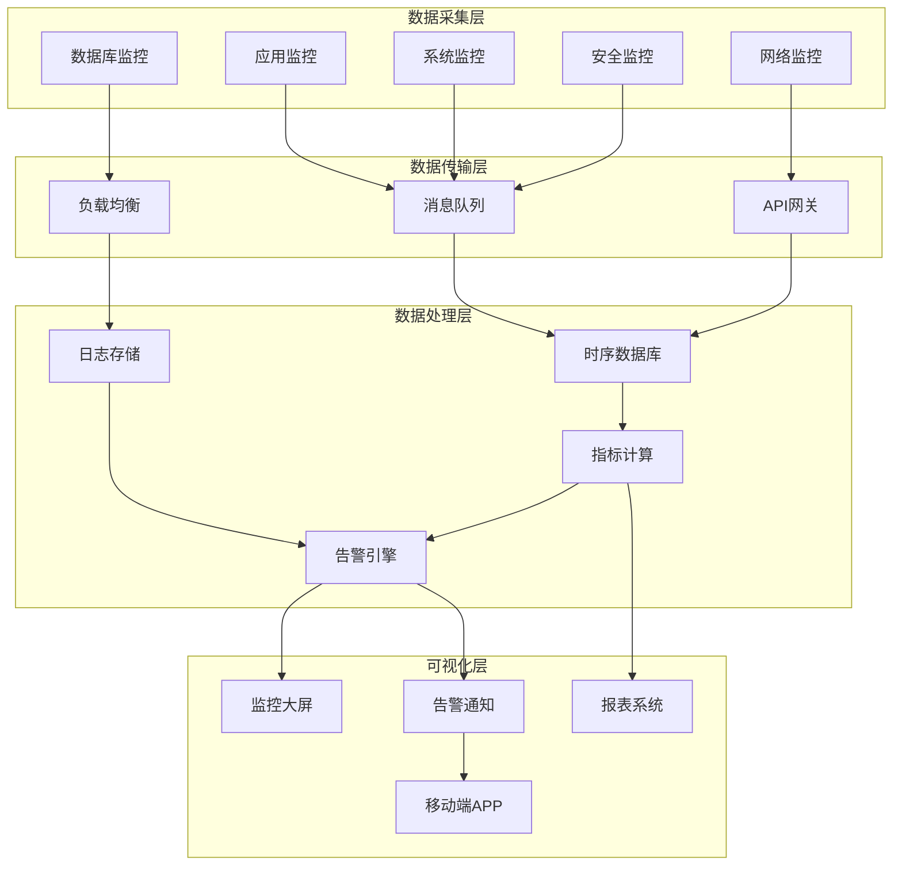
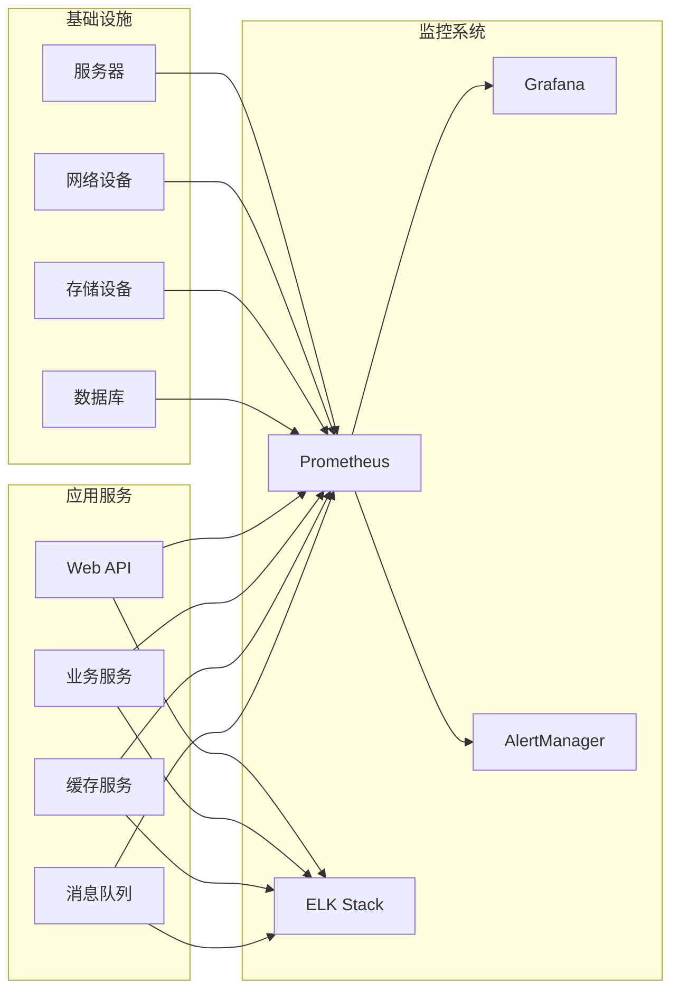
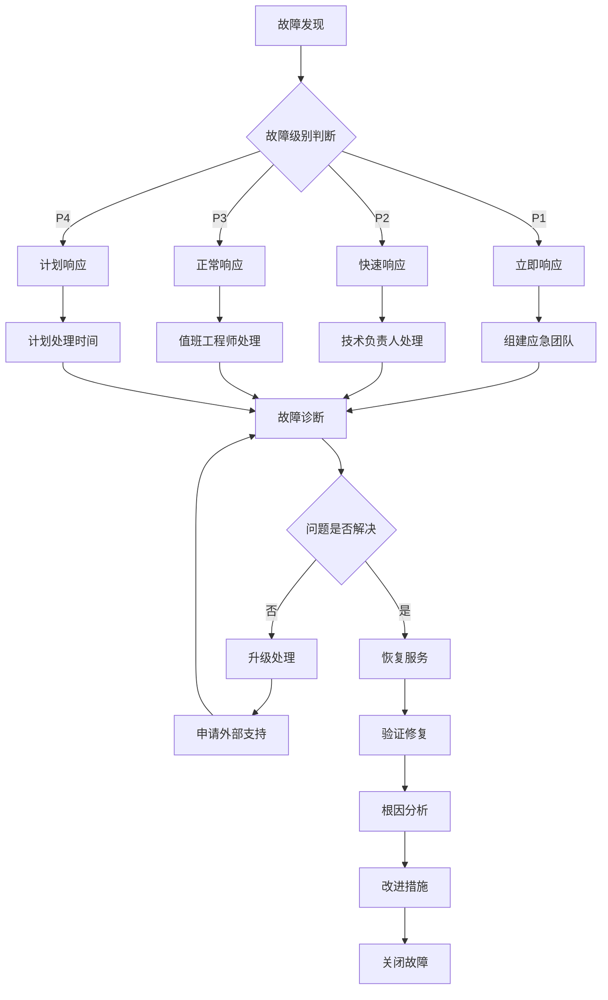

# 运维监控指南 (Operations Monitoring Guide)

> **版本**: 1.0
> **创建日期**: 2025-01-15
> **最后更新**: 2025-01-15
> **维护者**: Claude Code
> **目标用户**: 系统管理员、运维工程师、DevOps工程师
> **相关文档**: [系统架构文档](../architecture/) | [安全标准文档](../security/medical-data-security-standard.md) | [模块集成指南](../modules/integration/module-integration-guide.md)

## 📋 文档概述

本文档提供了 LYBT 中医诊所管理系统的完整运维监控指南，涵盖系统监控、告警管理、性能优化、故障处理、日志管理、备份恢复等关键运维环节。本指南旨在确保系统的高可用性、高性能和高安全性，为医疗业务的稳定运行提供技术保障。

## 🎯 监控目标

### 主要目标
- **系统可用性**: 确保系统7×24小时稳定运行，可用性达到99.9%
- **性能监控**: 实时监控系统性能指标，及时发现性能瓶颈
- **故障预警**: 建立完善的预警机制，提前发现潜在问题
- **快速响应**: 建立快速故障响应机制，最小化业务影响

### 次要目标
- **容量规划**: 提供容量分析和规划建议，支持业务增长
- **成本优化**: 通过监控分析优化资源配置，降低运营成本
- **合规审计**: 满足医疗行业合规要求和审计需求
- **用户体验**: 通过监控优化提升用户体验

## 🏗️ 监控架构

### 整体监控架构


### 监控组件关系


## 📊 监控指标体系

### 基础设施监控

#### 服务器监控
```yaml
# 服务器监控指标
server_metrics:
  cpu:
    - cpu_usage_percent
    - cpu_load_average_1m
    - cpu_load_average_5m
    - cpu_load_average_15m
    - cpu_cores_total
    - cpu_cores_available
  
  memory:
    - memory_usage_percent
    - memory_available_bytes
    - memory_used_bytes
    - memory_cached_bytes
    - memory_swap_usage_percent
    - memory_swap_used_bytes
  
  disk:
    - disk_usage_percent
    - disk_available_bytes
    - disk_used_bytes
    - disk_io_read_bytes_per_sec
    - disk_io_write_bytes_per_sec
    - disk_io_read_ops_per_sec
    - disk_io_write_ops_per_sec
  
  network:
    - network_receive_bytes_per_sec
    - network_transmit_bytes_per_sec
    - network_receive_packets_per_sec
    - network_transmit_packets_per_sec
    - network_errors_per_sec
    - network_connections_total
```

#### 网络监控
```yaml
# 网络监控指标
network_metrics:
  bandwidth:
    - interface_bandwidth_utilization
    - interface_throughput_mbps
    - interface_packet_loss_rate
    - interface_error_rate
  
  connectivity:
    - ping_response_time_ms
    - tcp_connection_success_rate
    - dns_resolution_time_ms
    - http_response_time_ms
  
  security:
    - firewall_blocked_connections
    - intrusion_detection_events
    - ddos_attack_detected
    - ssl_certificate_expiry_days
```

### 应用程序监控

#### 应用性能监控
```yaml
# 应用性能指标
application_metrics:
  performance:
    - http_request_duration_seconds
    - http_request_size_bytes
    - http_response_size_bytes
    - http_requests_total
    - http_request_errors_total
  
  business:
    - user_login_total
    - patient_registration_total
    - prescription_created_total
    - consultation_completed_total
    - api_response_time_p95
    - api_response_time_p99
  
  resources:
    - thread_pool_active_threads
    - thread_pool_queue_size
    - database_connection_pool_active
    - database_connection_pool_idle
    - cache_hit_ratio
    - cache_miss_ratio
```

#### 业务监控
```yaml
# 业务监控指标
business_metrics:
  user_activity:
    - active_users_total
    - user_sessions_total
    - user_login_success_rate
    - user_login_failure_rate
  
  medical_operations:
    - patient_visits_per_day
    - prescriptions_per_day
    - consultations_per_day
    - average_consultation_duration_minutes
    - prescription_accuracy_rate
  
  system_health:
    - service_availability_percent
    - error_rate_percent
    - response_time_p95_ms
    - throughput_per_second
```

### 数据库监控

#### 数据库性能监控
```yaml
# 数据库监控指标
database_metrics:
  performance:
    - query_duration_seconds
    - query_executions_total
    - query_errors_total
    - slow_queries_total
    - connection_pool_usage_percent
  
  resources:
    - database_size_bytes
    - table_size_bytes
    - index_size_bytes
    - cache_hit_ratio
    - buffer_pool_usage_percent
    - disk_io_wait_time_seconds
  
  availability:
    - database_uptime_seconds
    - replication_lag_seconds
    - backup_success_rate
    - failover_time_seconds
```

## 🔔 告警管理

### 告警策略

#### 告警级别定义
```yaml
# 告警级别
alert_levels:
  critical:
    description: "严重告警，需要立即处理"
    response_time: "5分钟内"
    notification_channels: ["电话", "短信", "邮件", "钉钉"]
    escalation_time: "15分钟"
    
  warning:
    description: "警告告警，需要关注"
    response_time: "30分钟内"
    notification_channels: ["邮件", "钉钉", "微信"]
    escalation_time: "2小时"
    
  info:
    description: "信息告警，需要了解"
    response_time: "2小时内"
    notification_channels: ["邮件", "钉钉"]
    escalation_time: "24小时"
```

#### 告警规则配置
```yaml
# 告警规则示例
alert_rules:
  - name: "系统CPU使用率过高"
    expr: "cpu_usage_percent > 80"
    for: "5m"
    labels:
      severity: "warning"
      component: "server"
    annotations:
      summary: "服务器CPU使用率过高"
      description: "服务器 {{ $labels.instance }} CPU使用率超过80%，当前值: {{ $value }}%"
      
  - name: "应用响应时间过长"
    expr: "http_request_duration_seconds{quantile=\"0.95\"} > 2"
    for: "2m"
    labels:
      severity: "critical"
      component: "application"
    annotations:
      summary: "应用响应时间过长"
      description: "应用 {{ $labels.service }} 95%分位响应时间超过2秒，当前值: {{ $value }}秒"
      
  - name: "数据库连接池耗尽"
    expr: "database_connection_pool_active / database_connection_pool_max > 0.9"
    for: "1m"
    labels:
      severity: "critical"
      component: "database"
    annotations:
      summary: "数据库连接池即将耗尽"
      description: "数据库连接池使用率超过90%，当前值: {{ $value }}%"
```

### 告警通知

#### 通知渠道配置
```yaml
# 通知渠道配置
notification_channels:
  email:
    smtp_server: "smtp.lybt.com"
    smtp_port: 587
    username: "monitoring@lybt.com"
    password: "${SMTP_PASSWORD}"
    recipients:
      - "admin@lybt.com"
      - "ops@lybt.com"
      
  sms:
    provider: "aliyun"
    access_key: "${ALIYUN_ACCESS_KEY}"
    secret_key: "${ALIYUN_SECRET_KEY}"
    phone_numbers:
      - "13800138000"
      - "13900139000"
      
  dingtalk:
    webhook_url: "${DINGTALK_WEBHOOK_URL}"
    secret: "${DINGTALK_SECRET}"
    
  slack:
    webhook_url: "${SLACK_WEBHOOK_URL}"
    channel: "#monitoring"
```

#### 告警消息模板
```yaml
# 告警消息模板
alert_templates:
  email:
    subject: "[{{ .Labels.severity | upper }}] {{ .Annotations.summary }}"
    body: |
      告警详情:
      
      告警级别: {{ .Labels.severity }}
      告警名称: {{ .Labels.alertname }}
      影响组件: {{ .Labels.component }}
      实例名称: {{ .Labels.instance }}
      
      告警描述: {{ .Annotations.description }}
      触发时间: {{ .StartsAt }}
      持续时间: {{ since .StartsAt }}
      
      查看详情: {{ .GeneratorURL }}
      
  dingtalk:
    title: "🚨 {{ .Labels.severity | upper }} 告警"
    text: |
      **告警名称**: {{ .Labels.alertname }}
      **告警级别**: {{ .Labels.severity }}
      **影响组件**: {{ .Labels.component }}
      **实例名称**: {{ .Labels.instance }}
      
      **告警描述**: {{ .Annotations.description }}
      **触发时间**: {{ .StartsAt }}
      **持续时间**: {{ since .StartsAt }}
      
      [查看详情]({{ .GeneratorURL }})
```

## 📈 性能优化

### 性能监控分析

#### 性能瓶颈识别
```python
# 性能瓶颈分析脚本
import psutil
import time
from datetime import datetime
from prometheus_client import start_http_server, Gauge, Counter

# 定义性能指标
cpu_gauge = Gauge('system_cpu_usage_percent', 'System CPU usage percentage')
memory_gauge = Gauge('system_memory_usage_percent', 'System memory usage percentage')
disk_gauge = Gauge('system_disk_usage_percent', 'System disk usage percentage')
network_counter = Counter('network_bytes_total', 'Network bytes total', ['direction'])

def collect_system_metrics():
    """收集系统性能指标"""
    # CPU使用率
    cpu_percent = psutil.cpu_percent(interval=1)
    cpu_gauge.set(cpu_percent)
    
    # 内存使用率
    memory = psutil.virtual_memory()
    memory_gauge.set(memory.percent)
    
    # 磁盘使用率
    disk = psutil.disk_usage('/')
    disk_gauge.set(disk.percent)
    
    # 网络流量
    network = psutil.net_io_counters()
    network_counter.labels(direction='recv').inc(network.bytes_recv)
    network_counter.labels(direction='sent').inc(network.bytes_sent)

def analyze_performance_bottlenecks():
    """分析性能瓶颈"""
    bottlenecks = []
    
    # 检查CPU使用率
    if psutil.cpu_percent(interval=1) > 80:
        bottlenecks.append({
            'type': 'cpu',
            'severity': 'high',
            'message': f'CPU使用率过高: {psutil.cpu_percent()}%'
        })
    
    # 检查内存使用率
    memory = psutil.virtual_memory()
    if memory.percent > 85:
        bottlenecks.append({
            'type': 'memory',
            'severity': 'high',
            'message': f'内存使用率过高: {memory.percent}%'
        })
    
    # 检查磁盘使用率
    disk = psutil.disk_usage('/')
    if disk.percent > 90:
        bottlenecks.append({
            'type': 'disk',
            'severity': 'critical',
            'message': f'磁盘使用率过高: {disk.percent}%'
        })
    
    return bottlenecks

if __name__ == "__main__":
    start_http_server(8000)
    
    while True:
        collect_system_metrics()
        bottlenecks = analyze_performance_bottlenecks()
        
        if bottlenecks:
            for bottleneck in bottlenecks:
                print(f"[{datetime.now()}] 性能瓶颈发现: {bottleneck}")
        
        time.sleep(30)
```

#### 应用性能优化建议
```yaml
# 应用性能优化建议
performance_optimization:
  database:
    - 使用连接池管理数据库连接
    - 实施查询缓存策略
    - 优化慢查询语句
    - 建立适当的索引
    - 实施读写分离
    
  application:
    - 使用异步编程提高并发性能
    - 实施缓存策略减少数据库访问
    - 使用CDN加速静态资源
    - 实施负载均衡
    - 优化序列化和反序列化
    
  infrastructure:
    - 使用SSD提高I/O性能
    - 增加内存容量
    - 优化网络配置
    - 使用容器化部署
    - 实施自动扩缩容
```

### 容量规划

#### 容量分析模型
```python
# 容量规划分析脚本
import pandas as pd
import numpy as np
from datetime import datetime, timedelta
import matplotlib.pyplot as plt

class CapacityPlanning:
    def __init__(self):
        self.historical_data = []
        
    def analyze_resource_trends(self, resource_type):
        """分析资源使用趋势"""
        # 假设从监控系统获取历史数据
        data = self.get_historical_data(resource_type)
        
        # 计算趋势
        trend = np.polyfit(range(len(data)), data, 1)
        trend_line = np.poly1d(trend)
        
        # 预测未来30天使用量
        future_days = 30
        future_predictions = trend_line(range(len(data), len(data) + future_days))
        
        return {
            'current_usage': data[-1],
            'trend_slope': trend[0],
            'predicted_usage_30d': future_predictions[-1],
            'growth_rate_percent': (future_predictions[-1] - data[-1]) / data[-1] * 100
        }
    
    def calculate_capacity_requirements(self, service_name, projected_users):
        """计算容量需求"""
        # 基准性能指标
        baseline_metrics = {
            'cpu_per_user': 0.1,  # 每用户CPU使用率百分比
            'memory_per_user': 50,  # 每用户内存使用量MB
            'storage_per_user': 100,  # 每用户存储使用量MB
            'bandwidth_per_user': 1,  # 每用户带宽使用量Mbps
        }
        
        # 计算总需求
        total_cpu = projected_users * baseline_metrics['cpu_per_user']
        total_memory = projected_users * baseline_metrics['memory_per_user']
        total_storage = projected_users * baseline_metrics['storage_per_user']
        total_bandwidth = projected_users * baseline_metrics['bandwidth_per_user']
        
        # 添加安全边际（20%）
        safety_margin = 1.2
        
        return {
            'cpu_cores_required': total_cpu * safety_margin,
            'memory_gb_required': (total_memory * safety_margin) / 1024,
            'storage_gb_required': (total_storage * safety_margin) / 1024,
            'bandwidth_mbps_required': total_bandwidth * safety_margin
        }
    
    def generate_capacity_report(self):
        """生成容量规划报告"""
        report = {
            'timestamp': datetime.now().isoformat(),
            'analysis_period': '30 days',
            'services': []
        }
        
        # 分析各个服务的容量需求
        services = ['patient-service', 'consultation-service', 'prescription-service']
        
        for service in services:
            service_analysis = {}
            
            # 分析当前趋势
            for resource in ['cpu', 'memory', 'storage']:
                trend_analysis = self.analyze_resource_trends(f"{service}_{resource}")
                service_analysis[f"{resource}_trend"] = trend_analysis
            
            # 计算未来需求
            projected_users = 1000  # 假设未来用户数
            capacity_requirements = self.calculate_capacity_requirements(service, projected_users)
            service_analysis['capacity_requirements'] = capacity_requirements
            
            report['services'].append({
                'name': service,
                'analysis': service_analysis
            })
        
        return report

# 使用示例
if __name__ == "__main__":
    planner = CapacityPlanning()
    report = planner.generate_capacity_report()
    print("容量规划报告:")
    print(f"生成时间: {report['timestamp']}")
    print(f"分析周期: {report['analysis_period']}")
    
    for service in report['services']:
        print(f"\n服务名称: {service['name']}")
        for key, value in service['analysis'].items():
            print(f"  {key}: {value}")
```

## 🔧 故障处理

### 故障响应流程

#### 故障分类和处理
```yaml
# 故障分类和处理流程
incident_management:
  severity_levels:
    P1:
      description: "关键故障，业务完全中断"
      response_time: "5分钟"
      resolution_time: "1小时"
      escalation_time: "30分钟"
      examples: ["系统完全宕机", "数据库无法访问", "核心功能异常"]
      
    P2:
      description: "重要故障，业务严重受影响"
      response_time: "15分钟"
      resolution_time: "4小时"
      escalation_time: "2小时"
      examples: ["系统性能严重下降", "部分功能异常", "数据同步失败"]
      
    P3:
      description: "一般故障，业务轻微受影响"
      response_time: "30分钟"
      resolution_time: "24小时"
      escalation_time: "8小时"
      examples: ["系统性能轻微下降", "非核心功能异常", "报表生成失败"]
      
    P4:
      description: "轻微故障，业务基本不受影响"
      response_time: "2小时"
      resolution_time: "72小时"
      escalation_time: "24小时"
      examples: ["界面显示问题", "日志异常", "配置需要调整"]
```

#### 故障处理流程


### 故障处理脚本

#### 自动故障检测
```python
# 自动故障检测脚本
import requests
import time
import smtplib
from email.mime.text import MIMEText
from datetime import datetime
import logging

class HealthChecker:
    def __init__(self):
        self.services = {
            'patient-api': 'https://api.lybt.com/patient/health',
            'consultation-api': 'https://api.lybt.com/consultation/health',
            'prescription-api': 'https://api.lybt.com/prescription/health',
            'web-frontend': 'https://www.lybt.com/health'
        }
        
        self.notification_threshold = 3  # 连续失败次数阈值
        self.check_interval = 60  # 检查间隔（秒）
        
    def check_service_health(self, service_name, service_url):
        """检查服务健康状态"""
        try:
            response = requests.get(service_url, timeout=10)
            if response.status_code == 200:
                return {'status': 'healthy', 'response_time': response.elapsed.total_seconds()}
            else:
                return {'status': 'unhealthy', 'response_time': response.elapsed.total_seconds(), 'status_code': response.status_code}
        except requests.exceptions.RequestException as e:
            return {'status': 'error', 'error': str(e)}
    
    def send_alert(self, service_name, health_status):
        """发送告警通知"""
        alert_message = f"""
        服务告警通知
        
        服务名称: {service_name}
        健康状态: {health_status['status']}
        检测时间: {datetime.now().strftime('%Y-%m-%d %H:%M:%S')}
        
        详细信息:
        {health_status}
        
        请立即检查服务状态并采取相应措施。
        """
        
        # 发送邮件通知
        self.send_email_alert(f"[{health_status['status'].upper()}] 服务告警: {service_name}", alert_message)
        
        # 发送短信通知（针对关键服务）
        if service_name in ['patient-api', 'consultation-api', 'prescription-api']:
            self.send_sms_alert(f"服务{service_name}状态异常: {health_status['status']}")
    
    def send_email_alert(self, subject, message):
        """发送邮件告警"""
        try:
            msg = MIMEText(message)
            msg['Subject'] = subject
            msg['From'] = 'monitoring@lybt.com'
            msg['To'] = 'ops@lybt.com'
            
            with smtplib.SMTP('smtp.lybt.com', 587) as server:
                server.starttls()
                server.login('monitoring@lybt.com', 'password')
                server.send_message(msg)
        except Exception as e:
            logging.error(f"发送邮件告警失败: {e}")
    
    def send_sms_alert(self, message):
        """发送短信告警"""
        # 这里可以集成短信服务提供商的API
        logging.info(f"短信告警: {message}")
    
    def run_health_check(self):
        """运行健康检查"""
        service_status = {}
        
        for service_name, service_url in self.services.items():
            health_status = self.check_service_health(service_name, service_url)
            service_status[service_name] = health_status
            
            # 检查是否需要发送告警
            if health_status['status'] != 'healthy':
                failure_count = self.get_failure_count(service_name)
                if failure_count >= self.notification_threshold:
                    self.send_alert(service_name, health_status)
                    self.reset_failure_count(service_name)
                else:
                    self.increment_failure_count(service_name)
            else:
                self.reset_failure_count(service_name)
        
        return service_status
    
    def start_monitoring(self):
        """开始监控"""
        logging.info("开始服务健康监控...")
        
        while True:
            try:
                status = self.run_health_check()
                self.log_status(status)
                time.sleep(self.check_interval)
            except Exception as e:
                logging.error(f"监控过程中发生错误: {e}")
                time.sleep(self.check_interval)
    
    def log_status(self, status):
        """记录服务状态"""
        for service_name, health_status in status.items():
            logging.info(f"服务 {service_name}: {health_status['status']}")
            if 'response_time' in health_status:
                logging.info(f"响应时间: {health_status['response_time']}秒")

if __name__ == "__main__":
    logging.basicConfig(level=logging.INFO)
    checker = HealthChecker()
    checker.start_monitoring()
```

## 📝 日志管理

### 日志收集配置

#### ELK Stack 配置
```yaml
# Elasticsearch 配置
elasticsearch:
  cluster.name: "lybt-logs"
  node.name: "node-1"
  path.data: "/var/lib/elasticsearch"
  path.logs: "/var/log/elasticsearch"
  network.host: "0.0.0.0"
  http.port: 9200
  discovery.type: "single-node"

# Logstash 配置
logstash:
  input:
    beats:
      port: 5044
    tcp:
      port: 5000
      codec: json_lines
  
  filter:
    - grok:
        match:
          message: "%{TIMESTAMP_ISO8601:timestamp} %{LOGLEVEL:level} %{GREEDYDATA:message}"
    - date:
        match: [ "timestamp", "ISO8601" ]
    - mutate:
        add_field:
          service: "lybt-system"
          environment: "${ENVIRONMENT}"
  
  output:
    elasticsearch:
      hosts: ["localhost:9200"]
      index: "lybt-logs-%{+YYYY.MM.dd}"

# Kibana 配置
kibana:
  server.name: "kibana"
  server.host: "0.0.0.0"
  server.port: 5601
  elasticsearch.url: "http://localhost:9200"
```

#### 应用日志配置
```csharp
// 日志配置 (appsettings.json)
{
  "Logging": {
    "LogLevel": {
      "Default": "Information",
      "Microsoft": "Warning",
      "Microsoft.Hosting.Lifetime": "Information",
      "LyBT": "Debug"
    },
    "Console": {
      "IncludeScopes": true,
      "TimestampFormat": "yyyy-MM-dd HH:mm:ss "
    },
    "File": {
      "Path": "logs/lybt-.log",
      "RollingInterval": "Day",
      "RetainedFileCountLimit": 30,
      "OutputTemplate": "{Timestamp:yyyy-MM-dd HH:mm:ss.fff zzz} [{Level:u3}] {SourceContext}: {Message:lj}{NewLine}{Exception}"
    },
    "Seq": {
      "ServerUrl": "http://localhost:5341",
      "ApiKey": "your-api-key"
    }
  }
}

// 日志使用示例
public class PatientService
{
    private readonly ILogger<PatientService> _logger;
    
    public async Task<PatientDto> CreateAsync(CreatePatientDto createDto)
    {
        _logger.LogInformation("开始创建患者，姓名: {Name}, 电话: {Phone}", 
            createDto.Name, createDto.Phone);

        try
        {
            var patient = new Patient
            {
                Name = createDto.Name,
                Gender = createDto.Gender,
                BirthDate = createDto.BirthDate,
                Phone = createDto.Phone,
                Address = createDto.Address
            };

            var createdPatient = await _repository.AddAsync(patient);
            
            _logger.LogInformation("患者创建成功，ID: {PatientId}, 姓名: {Name}", 
                createdPatient.Id, createdPatient.Name);

            return _mapper.Map<PatientDto>(createdPatient);
        }
        catch (Exception ex)
        {
            _logger.LogError(ex, "患者创建失败，姓名: {Name}, 电话: {Phone}", 
                createDto.Name, createDto.Phone);
            throw;
        }
    }
}
```

### 日志分析

#### 日志查询示例
```json
// Kibana 查询示例
{
  "query": {
    "bool": {
      "must": [
        {
          "range": {
            "@timestamp": {
              "gte": "now-1h",
              "lte": "now"
            }
          }
        },
        {
          "term": {
            "level": "ERROR"
          }
        }
      ]
    }
  },
  "aggs": {
    "services": {
      "terms": {
        "field": "service"
      },
      "aggs": {
        "error_count": {
          "value_count": {
            "field": "message"
          }
        }
      }
    }
  }
}
```

#### 日志监控脚本
```python
# 日志监控脚本
import re
import json
from datetime import datetime, timedelta
from elasticsearch import Elasticsearch

class LogMonitor:
    def __init__(self):
        self.es = Elasticsearch(['http://localhost:9200'])
        self.error_patterns = [
            r'Exception',
            r'Error',
            r'Failed',
            r'Timeout',
            r'Connection refused'
        ]
        
    def search_error_logs(self, time_range_hours=1):
        """搜索错误日志"""
        query = {
            "query": {
                "bool": {
                    "must": [
                        {
                            "range": {
                                "@timestamp": {
                                    "gte": f"now-{time_range_hours}h",
                                    "lte": "now"
                                }
                            }
                        },
                        {
                            "regexp": {
                                "message": "Exception|Error|Failed|Timeout"
                            }
                        }
                    ]
                }
            },
            "sort": [
                {
                    "@timestamp": {
                        "order": "desc"
                    }
                }
            ],
            "size": 100
        }
        
        response = self.es.search(index="lybt-logs-*", body=query)
        return response['hits']['hits']
    
    def analyze_error_patterns(self, logs):
        """分析错误模式"""
        error_patterns = {}
        
        for log in logs:
            message = log['_source']['message']
            timestamp = log['_source']['@timestamp']
            
            for pattern in self.error_patterns:
                if re.search(pattern, message, re.IGNORECASE):
                    if pattern not in error_patterns:
                        error_patterns[pattern] = []
                    
                    error_patterns[pattern].append({
                        'timestamp': timestamp,
                        'message': message,
                        'service': log['_source'].get('service', 'unknown')
                    })
        
        return error_patterns
    
    def generate_error_report(self):
        """生成错误报告"""
        error_logs = self.search_error_logs()
        error_patterns = self.analyze_error_patterns(error_logs)
        
        report = {
            'timestamp': datetime.now().isoformat(),
            'total_errors': len(error_logs),
            'error_patterns': {},
            'top_errors': []
        }
        
        for pattern, errors in error_patterns.items():
            report['error_patterns'][pattern] = {
                'count': len(errors),
                'services': list(set([error['service'] for error in errors])),
                'latest_error': errors[0]['timestamp'] if errors else None
            }
            
            # 添加到top_errors
            if len(errors) > 5:
                report['top_errors'].extend(errors[:5])
        
        return report

if __name__ == "__main__":
    monitor = LogMonitor()
    report = monitor.generate_error_report()
    
    print("错误日志报告:")
    print(f"生成时间: {report['timestamp']}")
    print(f"总错误数: {report['total_errors']}")
    
    for pattern, info in report['error_patterns'].items():
        print(f"\n错误模式: {pattern}")
        print(f"  出现次数: {info['count']}")
        print(f"  影响服务: {', '.join(info['services'])}")
        print(f"  最新错误: {info['latest_error']}")
```

## 💾 备份恢复

### 备份策略

#### 数据库备份配置
```bash
#!/bin/bash
# 数据库备份脚本

# 配置变量
DB_HOST="localhost"
DB_PORT="5432"
DB_NAME="lybt_production"
DB_USER="lybt_user"
DB_PASSWORD="your_password"
BACKUP_DIR="/backup/database"
RETENTION_DAYS=30

# 创建备份目录
mkdir -p $BACKUP_DIR

# 生成备份文件名
BACKUP_FILE="$BACKUP_DIR/lybt_backup_$(date +%Y%m%d_%H%M%S).sql"

# 执行备份
echo "开始备份数据库: $DB_NAME"
pg_dump -h $DB_HOST -p $DB_PORT -U $DB_USER -d $DB_NAME > $BACKUP_FILE

# 检查备份是否成功
if [ $? -eq 0 ]; then
    echo "数据库备份成功: $BACKUP_FILE"
    
    # 压缩备份文件
    gzip $BACKUP_FILE
    echo "备份文件已压缩: $BACKUP_FILE.gz"
    
    # 删除过期的备份文件
    find $BACKUP_DIR -name "*.gz" -mtime +$RETENTION_DAYS -delete
    echo "已删除 $RETENTION_DAYS 天前的备份文件"
    
    # 验证备份文件
    BACKUP_SIZE=$(stat -c%s "$BACKUP_FILE.gz")
    if [ $BACKUP_SIZE -gt 0 ]; then
        echo "备份文件验证成功，大小: $BACKUP_SIZE 字节"
    else
        echo "警告: 备份文件大小为0，可能备份失败"
    fi
else
    echo "数据库备份失败"
    exit 1
fi

# 上传到云存储（可选）
# aws s3 cp $BACKUP_FILE.gz s3://lybt-backups/database/

echo "备份任务完成"
```

#### 应用备份配置
```bash
#!/bin/bash
# 应用文件备份脚本

# 配置变量
APP_DIR="/var/www/lybt"
BACKUP_DIR="/backup/application"
RETENTION_DAYS=7

# 创建备份目录
mkdir -p $BACKUP_DIR

# 生成备份文件名
BACKUP_FILE="$BACKUP_DIR/lybt_app_backup_$(date +%Y%m%d_%H%M%S).tar.gz"

# 备份应用文件
echo "开始备份应用文件"
tar -czf $BACKUP_FILE -C $APP_DIR .

# 检查备份是否成功
if [ $? -eq 0 ]; then
    echo "应用备份成功: $BACKUP_FILE"
    
    # 删除过期的备份文件
    find $BACKUP_DIR -name "*.tar.gz" -mtime +$RETENTION_DAYS -delete
    echo "已删除 $RETENTION_DAYS 天前的应用备份"
else
    echo "应用备份失败"
    exit 1
fi

echo "应用备份任务完成"
```

### 恢复流程

#### 数据库恢复脚本
```bash
#!/bin/bash
# 数据库恢复脚本

# 配置变量
DB_HOST="localhost"
DB_PORT="5432"
DB_NAME="lybt_production"
DB_USER="lybt_user"
DB_PASSWORD="your_password"
BACKUP_FILE=$1

# 检查参数
if [ -z "$BACKUP_FILE" ]; then
    echo "用法: $0 <备份文件路径>"
    exit 1
fi

# 检查备份文件是否存在
if [ ! -f "$BACKUP_FILE" ]; then
    echo "错误: 备份文件不存在: $BACKUP_FILE"
    exit 1
fi

# 如果是压缩文件，先解压
if [[ $BACKUP_FILE == *.gz ]]; then
    echo "解压备份文件..."
    gunzip -c $BACKUP_FILE > /tmp/restore.sql
    RESTORE_FILE="/tmp/restore.sql"
else
    RESTORE_FILE=$BACKUP_FILE
fi

# 创建恢复前备份
echo "创建恢复前备份..."
PRE_RESTORE_BACKUP="$BACKUP_DIR/pre_restore_$(date +%Y%m%d_%H%M%S).sql"
pg_dump -h $DB_HOST -p $DB_PORT -U $DB_USER -d $DB_NAME > $PRE_RESTORE_BACKUP
echo "恢复前备份完成: $PRE_RESTORE_BACKUP"

# 执行恢复
echo "开始恢复数据库..."
psql -h $DB_HOST -p $DB_PORT -U $DB_USER -d $DB_NAME < $RESTORE_FILE

# 检查恢复是否成功
if [ $? -eq 0 ]; then
    echo "数据库恢复成功"
    
    # 清理临时文件
    if [ -f "/tmp/restore.sql" ]; then
        rm /tmp/restore.sql
    fi
    
    # 验证恢复
    echo "验证数据库恢复..."
    TABLE_COUNT=$(psql -h $DB_HOST -p $DB_PORT -U $DB_USER -d $DB_NAME -t -c "SELECT COUNT(*) FROM information_schema.tables WHERE table_schema = 'public';")
    echo "恢复后的表数量: $TABLE_COUNT"
    
    if [ $TABLE_COUNT -gt 0 ]; then
        echo "数据库恢复验证成功"
    else
        echo "警告: 数据库恢复验证失败，表数量为0"
    fi
else
    echo "数据库恢复失败"
    exit 1
fi

echo "恢复任务完成"
```

#### 应用恢复脚本
```bash
#!/bin/bash
# 应用恢复脚本

# 配置变量
APP_DIR="/var/www/lybt"
BACKUP_FILE=$1

# 检查参数
if [ -z "$BACKUP_FILE" ]; then
    echo "用法: $0 <备份文件路径>"
    exit 1
fi

# 检查备份文件是否存在
if [ ! -f "$BACKUP_FILE" ]; then
    echo "错误: 备份文件不存在: $BACKUP_FILE"
    exit 1
fi

# 停止应用服务
echo "停止应用服务..."
systemctl stop lybt-api
systemctl stop lybt-web

# 创建当前应用备份
echo "创建当前应用备份..."
CURRENT_BACKUP="$BACKUP_DIR/current_backup_$(date +%Y%m%d_%H%M%S).tar.gz"
tar -czf $CURRENT_BACKUP -C $APP_DIR .

# 恢复应用文件
echo "恢复应用文件..."
tar -xzf $BACKUP_FILE -C $APP_DIR

# 设置文件权限
echo "设置文件权限..."
chown -R www-data:www-data $APP_DIR
chmod -R 755 $APP_DIR

# 启动应用服务
echo "启动应用服务..."
systemctl start lybt-api
systemctl start lybt-web

# 检查服务状态
echo "检查服务状态..."
sleep 10
API_STATUS=$(systemctl is-active lybt-api)
WEB_STATUS=$(systemctl is-active lybt-web)

echo "API服务状态: $API_STATUS"
echo "Web服务状态: $WEB_STATUS"

if [ "$API_STATUS" = "active" ] && [ "$WEB_STATUS" = "active" ]; then
    echo "应用恢复成功"
else
    echo "应用恢复失败，尝试恢复原版本..."
    tar -xzf $CURRENT_BACKUP -C $APP_DIR
    systemctl start lybt-api
    systemctl start lybt-web
    echo "已恢复到原版本"
fi

echo "恢复任务完成"
```

## 📊 监控大屏

### Grafana 仪表板配置

#### 系统监控仪表板
```json
{
  "dashboard": {
    "title": "LYBT 系统监控仪表板",
    "tags": ["lybt", "system", "monitoring"],
    "timezone": "browser",
    "panels": [
      {
        "title": "系统概览",
        "type": "stat",
        "targets": [
          {
            "expr": "up{job=\"lybt-system\"}",
            "legendFormat": "{{instance}}"
          }
        ],
        "fieldConfig": {
          "defaults": {
            "mappings": [
              {
                "options": {
                  "0": {
                    "text": "离线",
                    "color": "red"
                  },
                  "1": {
                    "text": "在线",
                    "color": "green"
                  }
                },
                "type": "value"
              }
            ]
          }
        }
      },
      {
        "title": "CPU使用率",
        "type": "graph",
        "targets": [
          {
            "expr": "100 - (avg by(instance) (irate(node_cpu_seconds_total{mode=\"idle\"}[5m])) * 100)",
            "legendFormat": "{{instance}}"
          }
        ],
        "yAxes": [
          {
            "max": 100,
            "min": 0,
            "unit": "percent"
          }
        ]
      },
      {
        "title": "内存使用率",
        "type": "graph",
        "targets": [
          {
            "expr": "(1 - (node_memory_MemAvailable_bytes / node_memory_MemTotal_bytes)) * 100",
            "legendFormat": "{{instance}}"
          }
        ],
        "yAxes": [
          {
            "max": 100,
            "min": 0,
            "unit": "percent"
          }
        ]
      },
      {
        "title": "磁盘使用率",
        "type": "graph",
        "targets": [
          {
            "expr": "(1 - (node_filesystem_avail_bytes{fstype!=\"tmpfs\"} / node_filesystem_size_bytes{fstype!=\"tmpfs\"})) * 100",
            "legendFormat": "{{instance}}: {{mountpoint}}"
          }
        ],
        "yAxes": [
          {
            "max": 100,
            "min": 0,
            "unit": "percent"
          }
        ]
      }
    ],
    "time": {
      "from": "now-1h",
      "to": "now"
    },
    "refresh": "30s"
  }
}
```

#### 应用性能仪表板
```json
{
  "dashboard": {
    "title": "LYBT 应用性能仪表板",
    "tags": ["lybt", "application", "performance"],
    "timezone": "browser",
    "panels": [
      {
        "title": "请求量",
        "type": "graph",
        "targets": [
          {
            "expr": "rate(http_requests_total[5m])",
            "legendFormat": "{{method}} {{status}}"
          }
        ]
      },
      {
        "title": "响应时间",
        "type": "graph",
        "targets": [
          {
            "expr": "histogram_quantile(0.95, rate(http_request_duration_seconds_bucket[5m]))",
            "legendFormat": "95th percentile"
          },
          {
            "expr": "histogram_quantile(0.99, rate(http_request_duration_seconds_bucket[5m]))",
            "legendFormat": "99th percentile"
          }
        ]
      },
      {
        "title": "错误率",
        "type": "graph",
        "targets": [
          {
            "expr": "rate(http_requests_total{status=~\"5..\"}[5m]) / rate(http_requests_total[5m]) * 100",
            "legendFormat": "5xx 错误率"
          },
          {
            "expr": "rate(http_requests_total{status=~\"4..\"}[5m]) / rate(http_requests_total[5m]) * 100",
            "legendFormat": "4xx 错误率"
          }
        ],
        "yAxes": [
          {
            "max": 100,
            "min": 0,
            "unit": "percent"
          }
        ]
      }
    ],
    "time": {
      "from": "now-1h",
      "to": "now"
    },
    "refresh": "30s"
  }
}
```

## 📚 参考资料

### 监控工具文档
- [Prometheus 官方文档](https://prometheus.io/docs/)
- [Grafana 官方文档](https://grafana.com/docs/)
- [Elasticsearch 官方文档](https://www.elastic.co/guide/)
- [Kibana 官方文档](https://www.elastic.co/guide/en/kibana/)

### 运维最佳实践
- [DevOps 最佳实践](https://docs.microsoft.com/en-us/azure/devops/learn/)
- [容器化运维](https://kubernetes.io/docs/concepts/)
- [云原生监控](https://prometheus.io/docs/practices/)
- [故障排查指南](https://docs.microsoft.com/en-us/azure/architecture/framework/resiliency/)

### 医疗行业合规
- [HIPAA 合规指南](https://www.hhs.gov/hipaa/)
- [医疗数据安全标准](../security/medical-data-security-standard.md)
- [系统可用性要求](../requirements/)
- [审计日志规范](../security/audit-logging-standards.md)

## 🔄 版本历史

| 版本 | 日期 | 更新内容 | 作者 |
|------|------|----------|------|
| 1.0 | 2025-01-15 | 初始版本，包含完整的运维监控指南 | Claude Code |

## 📞 技术支持

- **运维团队**: operations@lybt.com
- **技术支持**: support@lybt.com
- **紧急联系**: 400-XXX-XXXX
- **服务时间**: 7×24小时

---

*本文档遵循 LYBT 中医诊所管理系统文档标准，如有疑问请参考相关文档或联系技术支持。*

**注意事项**:
1. 监控配置需要根据实际环境进行调整
2. 告警阈值需要根据业务需求设置
3. 备份策略需要定期测试和验证
4. 故障处理流程需要定期演练
5. 本文档将定期更新，请关注最新版本