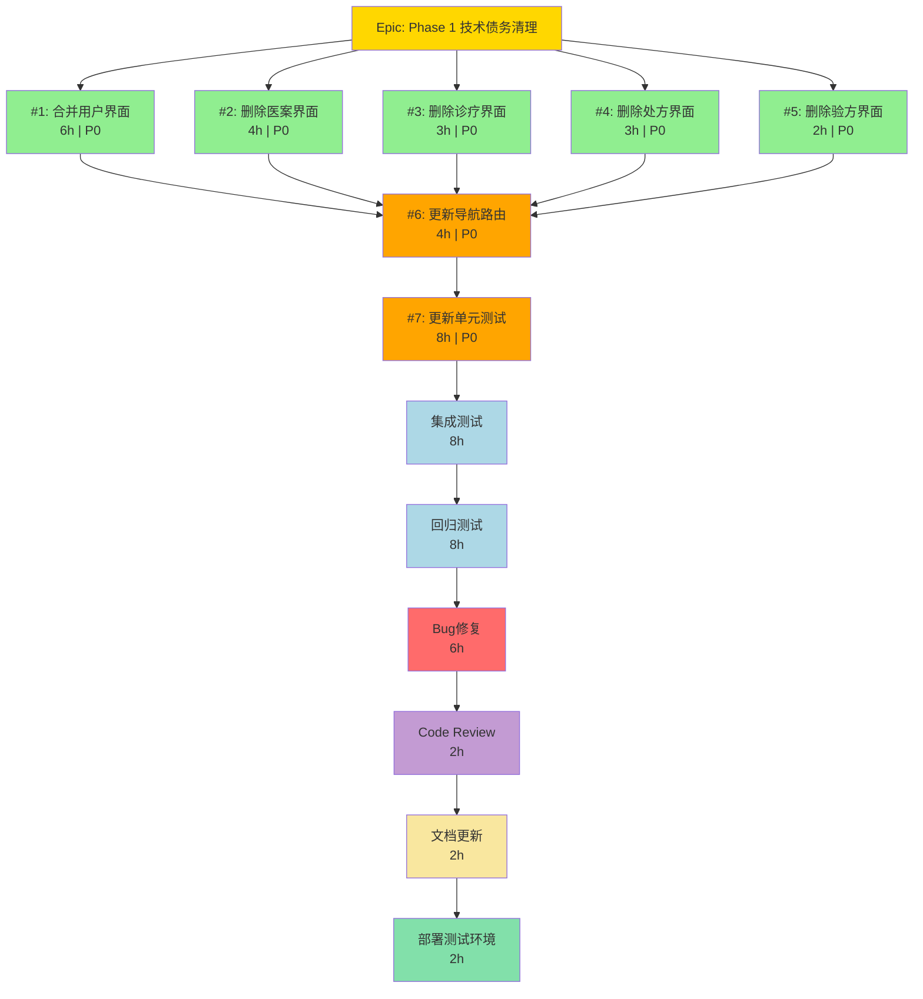

# Desktop端UI重构 Phase 1 - 实施时间表与依赖关系

**Epic**: Desktop端UI重构 Phase 1 - 技术债务清理
**创建日期**: 2025-11-04
**总工期**: 1.5周 (7.5个工作日 / 60小时)
**开始日期**: 待定
**结束日期**: 开始后 +10个自然日

---

## 📅 时间表概览

### Week 1: 开发和单元测试 (5个工作日)

```
Day 1-2 (16小时) - 并行开发阶段1
├── Issue #1: 合并用户界面 (6h) ────────┐
├── Issue #2: 删除医案冗余界面 (4h) ─────┼─ 可并行
└── Issue #3: 删除诊疗独立界面 (3h) ─────┘

Day 3-4 (10小时) - 并行开发阶段2
├── Issue #4: 删除处方冗余界面 (3h) ────┐
└── Issue #5: 删除验方对话框 (2h) ───────┘ 可并行

Day 4-5 (4小时) - 顺序开发阶段
└── Issue #6: 更新导航路由 (4h) ────────── 依赖 #1-5

Week 1总计: 30小时
```

### Week 2: 测试和部署 (2.5个工作日)

```
Day 1-2 (16小时) - 测试阶段
├── Issue #7: 更新单元测试 (8h) ───────── 依赖 #1-6
└── 集成测试执行 (8h) ─────────────────── 依赖 #7

Day 3 (12小时) - 回归测试和修复
├── 回归测试执行 (8h) ─────────────────── 依赖集成测试
└── Bug修复 + Code Review (4h) ────────── 依赖回归测试

Day 3 (半天) - 部署和文档
├── 文档更新 (2h)
└── 部署测试环境 (2h)

Week 2总计: 28小时
```

---

## 🗓️ 详细甘特图 (文本版)

```
┌─────────────────────────────────────────────────────────────────┐
│ Task                      │ Week 1                │ Week 2        │
│                           │ M T W T F M T W T F   │ M T W T F     │
├─────────────────────────────────────────────────────────────────┤
│ Issue #1: 用户界面        │ ██████                │               │
│ Issue #2: 医案界面        │ ████                  │               │
│ Issue #3: 诊疗界面        │ ███                   │               │
│ Issue #4: 处方界面        │       ███             │               │
│ Issue #5: 验方界面        │       ██              │               │
│ Issue #6: 导航路由        │         ████          │               │
│ Issue #7: 单元测试        │                       │ ████████      │
│ 集成测试                  │                       │         ████  │
│ 回归测试                  │                       │             ████
│ Bug修复                   │                       │               ██
│ Code Review              │                       │               ██
│ 文档更新                  │                       │                █
│ 部署                      │                       │                █
└─────────────────────────────────────────────────────────────────┘

图例:
█ = 1小时工作量
每天8小时工作量
```

---

## 🔀 依赖关系图

### 完整依赖关系



### ASCII依赖关系图

```
                           ┌─────────────┐
                           │   Epic      │
                           │  Phase 1    │
                           └──────┬──────┘
                                  │
                 ┌────────────────┼────────────────┐
                 │                │                │
          ┌──────▼──────┐  ┌─────▼─────┐  ┌──────▼──────┐
          │ Issue #1    │  │ Issue #2  │  │ Issue #3    │
          │ 用户界面    │  │ 医案界面  │  │ 诊疗界面    │
          │   (6h)      │  │   (4h)    │  │   (3h)      │
          └──────┬──────┘  └─────┬─────┘  └──────┬──────┘
                 │                │                │
                 │         ┌──────▼──────┐  ┌──────▼──────┐
                 │         │ Issue #4    │  │ Issue #5    │
                 │         │ 处方界面    │  │ 验方界面    │
                 │         │   (3h)      │  │   (2h)      │
                 │         └──────┬──────┘  └──────┬──────┘
                 │                │                │
                 └────────────────┼────────────────┘
                                  │
                           ┌──────▼──────┐
                           │ Issue #6    │
                           │ 导航路由    │
                           │   (4h)      │
                           └──────┬──────┘
                                  │
                           ┌──────▼──────┐
                           │ Issue #7    │
                           │ 单元测试    │
                           │   (8h)      │
                           └──────┬──────┘
                                  │
                          ┌───────▼───────┐
                          │  集成测试     │
                          │    (8h)       │
                          └───────┬───────┘
                                  │
                          ┌───────▼───────┐
                          │  回归测试     │
                          │    (8h)       │
                          └───────┬───────┘
                                  │
                          ┌───────▼───────┐
                          │  Bug修复      │
                          │    (6h)       │
                          └───────┬───────┘
                                  │
                          ┌───────▼───────┐
                          │ Code Review   │
                          │    (2h)       │
                          └───────┬───────┘
                                  │
              ┌───────────────────┴───────────────────┐
              │                                       │
      ┌───────▼───────┐                     ┌────────▼────────┐
      │  文档更新     │                     │  部署测试环境  │
      │    (2h)       │                     │     (2h)        │
      └───────────────┘                     └─────────────────┘
```

---

## 📊 任务详细时间表

### Phase 1.1: 并行开发阶段1 (Day 1-2)

| Task | 工作量 | 开始 | 结束 | 负责人 | 状态 | 依赖 |
|------|--------|------|------|--------|------|------|
| **Issue #1**: 合并用户界面 | 6h | Day1 08:00 | Day1 14:00 | 待分配 | 🔲 Pending | 无 |
| **Issue #2**: 删除医案冗余界面 | 4h | Day1 08:00 | Day1 12:00 | 待分配 | 🔲 Pending | 无 |
| **Issue #3**: 删除诊疗独立界面 | 3h | Day2 08:00 | Day2 11:00 | 待分配 | 🔲 Pending | 无 |

**里程碑**: Day 2 EOD - 3个冗余界面组已删除

---

### Phase 1.2: 并行开发阶段2 (Day 3-4)

| Task | 工作量 | 开始 | 结束 | 负责人 | 状态 | 依赖 |
|------|--------|------|------|--------|------|------|
| **Issue #4**: 删除处方冗余界面 | 3h | Day3 08:00 | Day3 11:00 | 待分配 | 🔲 Pending | 无 |
| **Issue #5**: 删除验方查看对话框 | 2h | Day3 08:00 | Day3 10:00 | 待分配 | 🔲 Pending | 无 |

**里程碑**: Day 3 EOD - 所有冗余界面已删除

---

### Phase 1.3: 顺序开发阶段 (Day 4-5)

| Task | 工作量 | 开始 | 结束 | 负责人 | 状态 | 依赖 |
|------|--------|------|------|--------|------|------|
| **Issue #6**: 更新导航路由和菜单 | 4h | Day4 13:00 | Day4 17:00 | 待分配 | 🔲 Pending | Issue #1-5 |

**里程碑**: Day 4 EOD - 导航路由全部更新

---

### Phase 1.4: 单元测试阶段 (Day 6-7)

| Task | 工作量 | 开始 | 结束 | 负责人 | 状态 | 依赖 |
|------|--------|------|------|--------|------|------|
| **Issue #7**: 更新单元测试 | 8h | Day6 08:00 | Day6 17:00 | 待分配 | 🔲 Pending | Issue #6 |

**里程碑**: Day 6 EOD - 单元测试覆盖率≥80%

---

### Phase 1.5: 集成测试阶段 (Day 7-8)

| Task | 工作量 | 开始 | 结束 | 负责人 | 状态 | 依赖 |
|------|--------|------|------|--------|------|------|
| 集成测试执行 | 8h | Day7 08:00 | Day7 17:00 | QA团队 | 🔲 Pending | Issue #7 |

**里程碑**: Day 7 EOD - 集成测试通过率100%

---

### Phase 1.6: 回归测试和修复阶段 (Day 8-9)

| Task | 工作量 | 开始 | 结束 | 负责人 | 状态 | 依赖 |
|------|--------|------|------|--------|------|------|
| 回归测试执行 | 8h | Day8 08:00 | Day8 17:00 | QA团队 | 🔲 Pending | 集成测试 |
| Bug修复 | 6h | Day9 08:00 | Day9 14:00 | 开发团队 | 🔲 Pending | 回归测试 |

**里程碑**: Day 9 EOD - 回归测试通过率≥95%，无P0/P1 Bug

---

### Phase 1.7: 审查和部署阶段 (Day 9-10)

| Task | 工作量 | 开始 | 结束 | 负责人 | 状态 | 依赖 |
|------|--------|------|------|--------|------|------|
| Code Review | 2h | Day9 14:00 | Day9 16:00 | 架构师 | 🔲 Pending | Bug修复 |
| 文档更新 | 2h | Day9 16:00 | Day9 18:00 | 文档团队 | 🔲 Pending | Code Review |
| 部署到测试环境 | 2h | Day10 08:00 | Day10 10:00 | 运维团队 | 🔲 Pending | 文档更新 |

**里程碑**: Day 10 上午 - Phase 1完成，测试环境部署成功

---

## ⚠️ 关键路径分析

### 关键路径 (Critical Path)
```
Epic → Issue #1 → Issue #6 → Issue #7 → 集成测试 → 回归测试 → Bug修复 → Code Review → 部署

总工期: 6h + 4h + 8h + 8h + 8h + 6h + 2h + 2h = 44小时 (5.5天)
```

**关键路径任务** (影响总工期):
- Issue #1 (6h) - 最长的独立开发任务
- Issue #6 (4h) - 必须顺序执行
- Issue #7 (8h) - 必须顺序执行
- 集成测试 (8h) - 必须顺序执行
- 回归测试 (8h) - 必须顺序执行

**非关键路径任务** (可并行，不影响总工期):
- Issue #2, #3, #4, #5 (可与Issue #1并行)

---

## 🚨 风险与缓冲时间

### 预留缓冲时间

| 阶段 | 计划工期 | 缓冲时间 | 总工期 |
|------|----------|----------|--------|
| 开发阶段 | 30h | +6h (20%) | 36h |
| 测试阶段 | 16h | +4h (25%) | 20h |
| 修复和审查 | 12h | +4h (33%) | 16h |
| **总计** | **58h** | **+14h** | **72h (9天)** |

### 风险时间估算

| 风险 | 概率 | 影响 | 额外时间 |
|------|------|------|----------|
| Issue #1实现复杂度超预期 | 30% | 中 | +4h |
| 单元测试编写困难 | 20% | 中 | +4h |
| 回归测试失败率高 | 40% | 高 | +8h |
| Bug修复发现新问题 | 30% | 中 | +6h |
| 导航路由配置错误 | 20% | 低 | +2h |

**最坏情况总工期**: 72h + 24h = 96h (12天)

---

## 📈 进度跟踪指标

### 每日进度报告模板

```markdown
## Phase 1 进度报告 - Day X

**日期**: YYYY-MM-DD
**工作日**: X/10

### 今日完成
- [ ] Issue #X: 任务名称 (X/Xh)
- [ ] Issue #X: 任务名称 (X/Xh)

### 今日问题
- 问题描述1
- 问题描述2

### 明日计划
- [ ] Issue #X: 任务名称 (预计Xh)

### 整体进度
- 已完成Issues: X/7
- 已完成工时: XXh/60h (XX%)
- 是否按计划: ✅ 是 / ⚠️ 延误 / ❌ 严重延误

### 风险预警
- ⚠️ 风险1: 描述 + 缓解措施
- ✅ 无风险
```

### 关键指标追踪

| 指标 | 目标 | 当前 | 状态 |
|------|------|------|------|
| Issues完成率 | 100% | 0% | 🔲 |
| 工时完成率 | 100% | 0% | 🔲 |
| 单元测试覆盖率 | ≥80% | - | 🔲 |
| 集成测试通过率 | 100% | - | 🔲 |
| 回归测试通过率 | ≥95% | - | 🔲 |
| P0/P1 Bug数量 | 0 | - | 🔲 |
| Code Review通过 | ✅ | - | 🔲 |

---

## 🎯 里程碑检查点

### Milestone 1: 并行开发完成 (Day 3 EOD)
- [ ] Issue #1-5 已完成
- [ ] 编译通过，无错误
- [ ] 基本功能可用

### Milestone 2: 导航路由更新完成 (Day 4 EOD)
- [ ] Issue #6 已完成
- [ ] 所有菜单可点击，无死链接
- [ ] 手动测试通过

### Milestone 3: 单元测试完成 (Day 6 EOD)
- [ ] Issue #7 已完成
- [ ] 单元测试覆盖率≥80%
- [ ] 所有测试通过

### Milestone 4: 集成测试完成 (Day 7 EOD)
- [ ] 集成测试通过率100%
- [ ] 核心功能验证通过

### Milestone 5: 回归测试完成 (Day 9 EOD)
- [ ] 回归测试通过率≥95%
- [ ] 无P0/P1级别Bug

### Milestone 6: Phase 1完成 (Day 10 上午)
- [ ] Code Review通过
- [ ] 文档已更新
- [ ] 测试环境部署成功

---

## 📝 团队协作

### 角色分配建议

| 角色 | 负责任务 | 人数 | 技能要求 |
|------|----------|------|----------|
| 开发工程师 | Issue #1-6 | 2-3人 | WPF, Prism, MVVM |
| 测试工程师 | Issue #7, 集成测试, 回归测试 | 1-2人 | xUnit, NSubstitute |
| 架构师 | Code Review | 1人 | 架构设计经验 |
| 文档工程师 | 文档更新 | 1人 | 技术写作 |
| 运维工程师 | 部署 | 1人 | CI/CD, 环境配置 |

### 沟通计划

| 会议 | 频率 | 时长 | 参与者 | 目的 |
|------|------|------|--------|------|
| 晨会 (Daily Standup) | 每日 | 15分钟 | 全员 | 进度同步、问题暴露 |
| 代码评审会 | Week 2 | 1小时 | 开发+架构师 | Code Review |
| 回顾会 (Retrospective) | Phase结束 | 1小时 | 全员 | 总结经验教训 |

---

## 🔗 相关资源

- **PRD文档**: `docs/requirements/ui-refactoring-phase1-prd.md`
- **Issues清单**: `docs/requirements/ui-refactoring-phase1-issues.md`
- **重构方案**: `docs/reports/ui-ux-refactoring-plan-2025-11-04.md`
- **ADR-009**: `docs/explanation/architecture/decisions/ADR-009-desktop-component-pattern.md`

---

## 📊 附录: 工时详细分解

### Issue #1: 合并用户界面 (6h)
- UserFormDialog.xaml设计: 1.5h
- UserFormDialogViewModel实现: 2h
- UserManagementViewModel调用更新: 1h
- Module注册更新: 0.5h
- 手动测试: 1h

### Issue #2: 删除医案冗余界面 (4h)
- 删除文件: 0.5h
- Module注册更新: 0.5h
- 主菜单更新: 0.5h
- MedicalCaseManagementView功能确认: 1.5h
- 手动测试: 1h

### Issue #3: 删除诊疗独立界面 (3h)
- 删除文件: 0.5h
- Module注册更新: 0.5h
- 主菜单更新: 0.5h
- 架构合规性检查: 0.5h
- 手动测试: 1h

### Issue #4: 删除处方冗余界面 (3h)
- 删除文件: 0.5h
- Module注册更新: 0.5h
- 主菜单更新: 0.5h
- PrescriptionManagementView功能确认: 0.5h
- 手动测试: 1h

### Issue #5: 删除验方对话框 (2h)
- 删除文件: 0.5h
- FormulaDetailView模式扩展: 0.5h
- 调用方更新: 0.5h
- 手动测试: 0.5h

### Issue #6: 更新导航路由 (4h)
- 5个Module.cs更新: 1h
- 主菜单XAML更新: 1h
- ShellViewModel快捷导航更新: 0.5h
- 编译测试: 0.5h
- 手动测试所有导航: 1h

### Issue #7: 更新单元测试 (8h)
- UserFormDialogViewModelTests编写: 3h
- UserManagementViewModelTests更新: 1h
- 其他ViewModel测试更新: 2h
- 测试覆盖率报告: 1h
- 测试调试和修复: 1h

---

**文档状态**: ✅ 完成
**维护频率**: 每日更新（实施期间）
**更新者**: 项目经理 / Scrum Master
