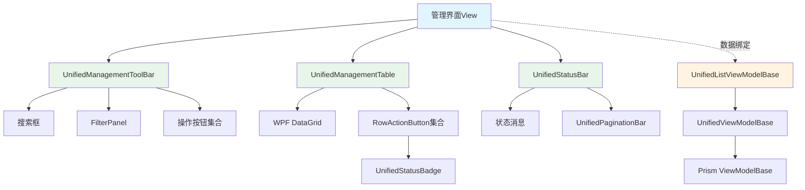
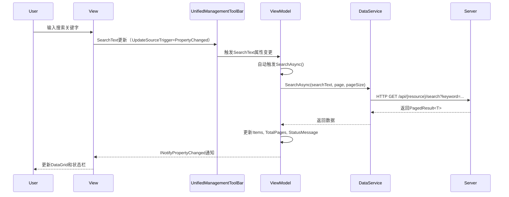
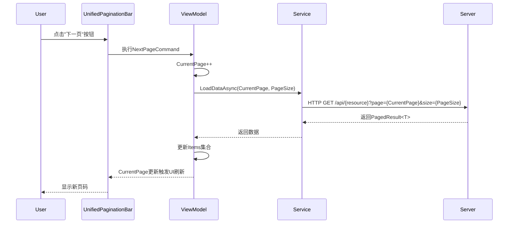
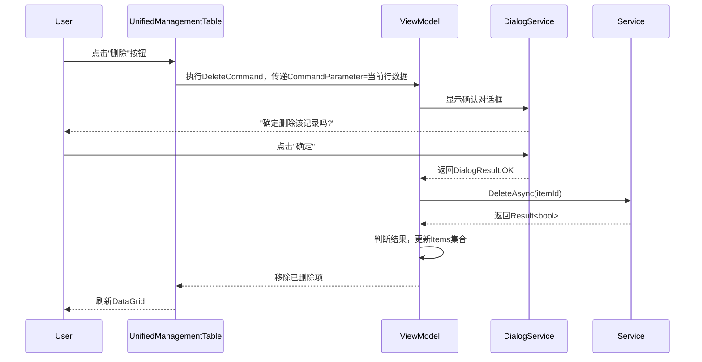

# Desktop端管理界面UI统一化设计文档

**文档类型**: Design（技术设计）
**创建时间**: 2025-11-06
**文档版本**: v1.0
**作者**: Claude Code
**关联文档**:
- 需求文档: `docs/explanation/requirements/ui-unification-requirements.md`
- 分析报告: `docs/explanation/design/ui-unification-analysis.md`
- 架构指南: `docs/explanation/architecture/client/README.md`

---

## 目录

1. [架构设计](#1-架构设计)
2. [组件详细设计](#2-组件详细设计)
3. [样式资源设计](#3-样式资源设计)
4. [数据流与交互设计](#4-数据流与交互设计)
5. [Phase实施计划](#5-phase实施计划)
6. [技术选型与决策](#6-技术选型与决策)
7. [测试策略](#7-测试策略)
8. [附录](#8-附录)

---

## 1. 架构设计

### 1.1 整体架构

```
┌─────────────────────────────────────────────────────────────┐
│                    管理界面（View）                           │
├─────────────────────────────────────────────────────────────┤
│  ┌─────────────────────────────────────────────────────┐   │
│  │       UnifiedManagementToolBar                       │   │ ← 工具栏组件
│  │  ┌──────────┐  ┌──────────┐  ┌──────────────────┐  │   │
│  │  │搜索区    │  │筛选区    │  │操作按钮区        │  │   │
│  │  └──────────┘  └──────────┘  └──────────────────┘  │   │
│  └─────────────────────────────────────────────────────┘   │
│  ┌─────────────────────────────────────────────────────┐   │
│  │       UnifiedManagementTable                         │   │ ← 表格组件
│  │  ┌────────────────────────────────────────────┐     │   │
│  │  │ DataGrid (BaseDataGrid Style)              │     │   │
│  │  │  - Columns (自定义/自动生成)                │     │   │
│  │  │  - RowActions (行级操作按钮集合)            │     │   │
│  │  └────────────────────────────────────────────┘     │   │
│  └─────────────────────────────────────────────────────┘   │
│  ┌─────────────────────────────────────────────────────┐   │
│  │       UnifiedStatusBar                               │   │ ← 状态栏组件
│  │  ┌──────────────┐              ┌──────────────────┐ │   │
│  │  │左侧状态摘要  │              │UnifiedPaginationBar│ │   │
│  │  └──────────────┘              └──────────────────┘ │   │
│  └─────────────────────────────────────────────────────┘   │
└─────────────────────────────────────────────────────────────┘
                           ↕ Data Binding
┌─────────────────────────────────────────────────────────────┐
│              ViewModel (继承UnifiedListViewModelBase<T>)      │
├─────────────────────────────────────────────────────────────┤
│  Properties:                                                 │
│    - Items, SelectedItem, SearchText                         │
│    - CurrentPage, TotalPages, StatusMessage                  │
│  Commands:                                                   │
│    - SearchCommand, RefreshCommand, AddCommand               │
│    - EditCommand, DeleteCommand, ViewDetailsCommand          │
│    - FirstPageCommand, PreviousPageCommand, ...              │
└─────────────────────────────────────────────────────────────┘
```

### 1.2 组件层次结构

```
LYBT.Desktop.Infrastructure.Components (命名空间)
│
├── Management (管理界面通用组件)
│   ├── UnifiedManagementToolBar.xaml / .cs
│   ├── UnifiedManagementTable.xaml / .cs
│   ├── UnifiedStatusBar.xaml / .cs
│   └── FilterPanel.xaml / .cs
│
├── Display (显示组件)
│   ├── UnifiedStatusBadge.xaml / .cs
│   ├── UnifiedPaginationBar.xaml / .cs
│   └── RowActionButton.xaml / .cs
│
├── Actions (操作组件)
│   └── SpecialActionButtons.xaml / .cs
│
└── Behaviors (附加行为)
    ├── SearchBoxBehavior.cs
    ├── DataGridRowActionBehavior.cs
    └── AutoRefreshBehavior.cs
```

### 1.3 依赖关系图



---

## 2. 组件详细设计

### 2.1 UnifiedManagementToolBar（P0）

#### 2.1.1 组件职责

- 提供统一的工具栏容器和布局
- 管理搜索框、筛选区、操作按钮三个区域
- 应用UnifiedDesignSystem.xaml的ToolBarContainer样式
- 支持通过插槽自定义筛选区和操作按钮

#### 2.1.2 类设计

**文件**: `src/Client/Desktop/Infrastructure/LYBT.Desktop.Infrastructure/Components/Management/UnifiedManagementToolBar.xaml.cs`

```csharp
using System.Windows;
using System.Windows.Controls;
using System.Windows.Input;

namespace LYBT.Desktop.Infrastructure.Components.Management
{
    /// <summary>
    /// 统一管理界面工具栏组件
    /// 提供搜索、筛选、操作按钮三个区域的统一布局
    /// </summary>
    public partial class UnifiedManagementToolBar : UserControl
    {
        public UnifiedManagementToolBar()
        {
            InitializeComponent();
        }

        #region 依赖属性

        /// <summary>
        /// 搜索文本
        /// </summary>
        public string SearchText
        {
            get => (string)GetValue(SearchTextProperty);
            set => SetValue(SearchTextProperty, value);
        }

        public static readonly DependencyProperty SearchTextProperty =
            DependencyProperty.Register(
                nameof(SearchText),
                typeof(string),
                typeof(UnifiedManagementToolBar),
                new FrameworkPropertyMetadata(
                    string.Empty,
                    FrameworkPropertyMetadataOptions.BindsTwoWayByDefault));

        /// <summary>
        /// 搜索命令
        /// </summary>
        public ICommand SearchCommand
        {
            get => (ICommand)GetValue(SearchCommandProperty);
            set => SetValue(SearchCommandProperty, value);
        }

        public static readonly DependencyProperty SearchCommandProperty =
            DependencyProperty.Register(
                nameof(SearchCommand),
                typeof(ICommand),
                typeof(UnifiedManagementToolBar));

        /// <summary>
        /// 搜索框占位符文本
        /// </summary>
        public string SearchPlaceholder
        {
            get => (string)GetValue(SearchPlaceholderProperty);
            set => SetValue(SearchPlaceholderProperty, value);
        }

        public static readonly DependencyProperty SearchPlaceholderProperty =
            DependencyProperty.Register(
                nameof(SearchPlaceholder),
                typeof(string),
                typeof(UnifiedManagementToolBar),
                new PropertyMetadata("搜索..."));

        /// <summary>
        /// 搜索框工具提示
        /// </summary>
        public string SearchTooltip
        {
            get => (string)GetValue(SearchTooltipProperty);
            set => SetValue(SearchTooltipProperty, value);
        }

        public static readonly DependencyProperty SearchTooltipProperty =
            DependencyProperty.Register(
                nameof(SearchTooltip),
                typeof(string),
                typeof(UnifiedManagementToolBar),
                new PropertyMetadata(string.Empty));

        /// <summary>
        /// 筛选区域内容（插槽）
        /// </summary>
        public UIElement FilterContent
        {
            get => (UIElement)GetValue(FilterContentProperty);
            set => SetValue(FilterContentProperty, value);
        }

        public static readonly DependencyProperty FilterContentProperty =
            DependencyProperty.Register(
                nameof(FilterContent),
                typeof(UIElement),
                typeof(UnifiedManagementToolBar));

        /// <summary>
        /// 操作按钮区域内容（插槽）
        /// </summary>
        public UIElement ActionButtons
        {
            get => (UIElement)GetValue(ActionButtonsProperty);
            set => SetValue(ActionButtonsProperty, value);
        }

        public static readonly DependencyProperty ActionButtonsProperty =
            DependencyProperty.Register(
                nameof(ActionButtons),
                typeof(UIElement),
                typeof(UnifiedManagementToolBar));

        #endregion
    }
}
```

#### 2.1.3 XAML模板设计

**文件**: `src/Client/Desktop/Infrastructure/LYBT.Desktop.Infrastructure/Components/Management/UnifiedManagementToolBar.xaml`

```xaml
<UserControl x:Class="LYBT.Desktop.Infrastructure.Components.Management.UnifiedManagementToolBar"
             xmlns="http://schemas.microsoft.com/winfx/2006/xaml/presentation"
             xmlns:x="http://schemas.microsoft.com/winfx/2006/xaml"
             xmlns:i="http://schemas.microsoft.com/xaml/behaviors">

    <Border Style="{StaticResource ToolBarContainer}">
        <Grid>
            <Grid.ColumnDefinitions>
                <ColumnDefinition Width="*" />      <!-- 搜索+筛选区 -->
                <ColumnDefinition Width="Auto" />   <!-- 操作按钮区 -->
            </Grid.ColumnDefinitions>

            <!-- 左侧：搜索+筛选区 -->
            <StackPanel Grid.Column="0" Orientation="Horizontal" Margin="0">
                <!-- 搜索框 -->
                <TextBox x:Name="SearchBox"
                         Width="280"
                         Text="{Binding SearchText, RelativeSource={RelativeSource AncestorType=UserControl}, UpdateSourceTrigger=PropertyChanged}"
                         Style="{StaticResource SearchTextBox}"
                         ToolTip="{Binding SearchTooltip, RelativeSource={RelativeSource AncestorType=UserControl}}">
                    <i:Interaction.Triggers>
                        <i:EventTrigger EventName="KeyDown">
                            <i:InvokeCommandAction Command="{Binding SearchCommand, RelativeSource={RelativeSource AncestorType=UserControl}}"
                                                   PassEventArgsToCommand="True" />
                        </i:EventTrigger>
                    </i:Interaction.Triggers>
                </TextBox>

                <!-- 搜索按钮 -->
                <Button Content="🔍 搜索"
                        Command="{Binding SearchCommand, RelativeSource={RelativeSource AncestorType=UserControl}}"
                        Style="{StaticResource SecondaryButton}"
                        Margin="{StaticResource SpacingSmall}" />

                <!-- 筛选区插槽 -->
                <ContentPresenter Content="{Binding FilterContent, RelativeSource={RelativeSource AncestorType=UserControl}}"
                                  Margin="{StaticResource SpacingMedium}" />
            </StackPanel>

            <!-- 右侧：操作按钮区 -->
            <ContentPresenter Grid.Column="1"
                              Content="{Binding ActionButtons, RelativeSource={RelativeSource AncestorType=UserControl}}"
                              Margin="0" />
        </Grid>
    </Border>
</UserControl>
```

#### 2.1.4 使用示例

```xaml
<components:UnifiedManagementToolBar
    SearchText="{Binding SearchText, UpdateSourceTrigger=PropertyChanged}"
    SearchCommand="{Binding SearchCommand}"
    SearchPlaceholder="输入用户名、手机号搜索..."
    SearchTooltip="支持模糊搜索">

    <!-- 筛选区插槽 -->
    <components:UnifiedManagementToolBar.FilterContent>
        <StackPanel Orientation="Horizontal">
            <TextBlock Text="角色筛选:" Style="{StaticResource LabelText}" VerticalAlignment="Center" />
            <ComboBox ItemsSource="{Binding RoleList}"
                      SelectedItem="{Binding SelectedRole}"
                      Width="120"
                      Margin="{StaticResource SpacingSmall}" />
        </StackPanel>
    </components:UnifiedManagementToolBar.FilterContent>

    <!-- 操作按钮插槽 -->
    <components:UnifiedManagementToolBar.ActionButtons>
        <StackPanel Orientation="Horizontal">
            <Button Content="➕ 新增用户"
                    Command="{Binding AddCommand}"
                    Style="{StaticResource PrimaryButton}"
                    Margin="{StaticResource SpacingXSmall}" />
            <Button Content="🔄 刷新"
                    Command="{Binding RefreshCommand}"
                    Style="{StaticResource SecondaryButton}"
                    Margin="{StaticResource SpacingXSmall}" />
            <Button Content="🏠 返回主页"
                    Command="{Binding NavigateToHomeCommand}"
                    Style="{StaticResource InfoButton}"
                    Margin="{StaticResource SpacingXSmall}" />
        </StackPanel>
    </components:UnifiedManagementToolBar.ActionButtons>
</components:UnifiedManagementToolBar>
```

---

### 2.2 UnifiedManagementTable（P0）

#### 2.2.1 组件职责

- 提供统一的DataGrid容器
- 管理行级操作按钮集合
- 应用BaseDataGrid样式
- 支持自定义列定义

#### 2.2.2 类设计

**文件**: `src/Client/Desktop/Infrastructure/LYBT.Desktop.Infrastructure/Components/Management/UnifiedManagementTable.xaml.cs`

```csharp
using System.Collections.ObjectModel;
using System.Windows;
using System.Windows.Controls;

namespace LYBT.Desktop.Infrastructure.Components.Management
{
    /// <summary>
    /// 统一管理界面数据表格组件
    /// 封装DataGrid并提供行级操作按钮管理
    /// </summary>
    public partial class UnifiedManagementTable : UserControl
    {
        public UnifiedManagementTable()
        {
            InitializeComponent();
            RowActions = new ObservableCollection<RowActionDefinition>();
        }

        #region 依赖属性

        /// <summary>
        /// 数据源
        /// </summary>
        public object ItemsSource
        {
            get => GetValue(ItemsSourceProperty);
            set => SetValue(ItemsSourceProperty, value);
        }

        public static readonly DependencyProperty ItemsSourceProperty =
            DependencyProperty.Register(
                nameof(ItemsSource),
                typeof(object),
                typeof(UnifiedManagementTable));

        /// <summary>
        /// 选中项
        /// </summary>
        public object SelectedItem
        {
            get => GetValue(SelectedItemProperty);
            set => SetValue(SelectedItemProperty, value);
        }

        public static readonly DependencyProperty SelectedItemProperty =
            DependencyProperty.Register(
                nameof(SelectedItem),
                typeof(object),
                typeof(UnifiedManagementTable),
                new FrameworkPropertyMetadata(
                    null,
                    FrameworkPropertyMetadataOptions.BindsTwoWayByDefault));

        /// <summary>
        /// 多选项集合
        /// </summary>
        public ObservableCollection<object> SelectedItems
        {
            get => (ObservableCollection<object>)GetValue(SelectedItemsProperty);
            set => SetValue(SelectedItemsProperty, value);
        }

        public static readonly DependencyProperty SelectedItemsProperty =
            DependencyProperty.Register(
                nameof(SelectedItems),
                typeof(ObservableCollection<object>),
                typeof(UnifiedManagementTable));

        /// <summary>
        /// 是否自动生成列
        /// </summary>
        public bool AutoGenerateColumns
        {
            get => (bool)GetValue(AutoGenerateColumnsProperty);
            set => SetValue(AutoGenerateColumnsProperty, value);
        }

        public static readonly DependencyProperty AutoGenerateColumnsProperty =
            DependencyProperty.Register(
                nameof(AutoGenerateColumns),
                typeof(bool),
                typeof(UnifiedManagementTable),
                new PropertyMetadata(false));

        /// <summary>
        /// 行级操作按钮集合
        /// </summary>
        public ObservableCollection<RowActionDefinition> RowActions
        {
            get => (ObservableCollection<RowActionDefinition>)GetValue(RowActionsProperty);
            set => SetValue(RowActionsProperty, value);
        }

        public static readonly DependencyProperty RowActionsProperty =
            DependencyProperty.Register(
                nameof(RowActions),
                typeof(ObservableCollection<RowActionDefinition>),
                typeof(UnifiedManagementTable));

        #endregion
    }

    /// <summary>
    /// 行级操作按钮定义
    /// </summary>
    public class RowActionDefinition
    {
        /// <summary>
        /// 按钮标签文本
        /// </summary>
        public string Label { get; set; } = string.Empty;

        /// <summary>
        /// 绑定命令（从DataContext获取）
        /// </summary>
        public string CommandBinding { get; set; } = string.Empty;

        /// <summary>
        /// 按钮样式键（如"SuccessButton"、"DangerButton"）
        /// </summary>
        public string StyleKey { get; set; } = "SecondaryButton";

        /// <summary>
        /// 工具提示
        /// </summary>
        public string ToolTip { get; set; } = string.Empty;

        /// <summary>
        /// 是否显示分隔符（在按钮后）
        /// </summary>
        public bool ShowDivider { get; set; }

        /// <summary>
        /// 按钮宽度
        /// </summary>
        public double Width { get; set; } = double.NaN; // Auto
    }
}
```

#### 2.2.3 XAML模板设计

**文件**: `src/Client/Desktop/Infrastructure/LYBT.Desktop.Infrastructure/Components/Management/UnifiedManagementTable.xaml`

```xaml
<UserControl x:Class="LYBT.Desktop.Infrastructure.Components.Management.UnifiedManagementTable"
             xmlns="http://schemas.microsoft.com/winfx/2006/xaml/presentation"
             xmlns:x="http://schemas.microsoft.com/winfx/2006/xaml"
             xmlns:local="clr-namespace:LYBT.Desktop.Infrastructure.Components.Management">

    <DataGrid x:Name="MainDataGrid"
              ItemsSource="{Binding ItemsSource, RelativeSource={RelativeSource AncestorType=UserControl}}"
              SelectedItem="{Binding SelectedItem, RelativeSource={RelativeSource AncestorType=UserControl}}"
              AutoGenerateColumns="{Binding AutoGenerateColumns, RelativeSource={RelativeSource AncestorType=UserControl}}"
              Style="{StaticResource BaseDataGrid}"
              RowStyle="{StaticResource BaseDataGridRow}"
              ColumnHeaderStyle="{StaticResource BaseDataGridColumnHeader}">

        <!-- 操作列（自动添加） -->
        <DataGrid.Columns>
            <DataGridTemplateColumn Header="操作" Width="Auto" MinWidth="200">
                <DataGridTemplateColumn.CellTemplate>
                    <DataTemplate>
                        <ItemsControl ItemsSource="{Binding RowActions, RelativeSource={RelativeSource AncestorType=UserControl}}">
                            <ItemsControl.ItemsPanel>
                                <ItemsPanelTemplate>
                                    <StackPanel Orientation="Horizontal" />
                                </ItemsPanelTemplate>
                            </ItemsControl.ItemsPanel>
                            <ItemsControl.ItemTemplate>
                                <DataTemplate DataType="{x:Type local:RowActionDefinition}">
                                    <StackPanel Orientation="Horizontal">
                                        <Button Content="{Binding Label}"
                                                Command="{Binding DataContext[CommandBinding], RelativeSource={RelativeSource AncestorType=DataGrid}}"
                                                CommandParameter="{Binding DataContext, RelativeSource={RelativeSource AncestorType=DataGridRow}}"
                                                Style="{DynamicResource {Binding StyleKey}}"
                                                ToolTip="{Binding ToolTip}"
                                                Width="{Binding Width}"
                                                Margin="4,0" />
                                        <Separator Visibility="{Binding ShowDivider, Converter={StaticResource BoolToVisibilityConverter}}"
                                                   Margin="4,0" />
                                    </StackPanel>
                                </DataTemplate>
                            </ItemsControl.ItemTemplate>
                        </ItemsControl>
                    </DataTemplate>
                </DataGridTemplateColumn.CellTemplate>
            </DataGridTemplateColumn>
        </DataGrid.Columns>
    </DataGrid>
</UserControl>
```

#### 2.2.4 使用示例

```xaml
<components:UnifiedManagementTable
    ItemsSource="{Binding Items}"
    SelectedItem="{Binding SelectedItem}"
    AutoGenerateColumns="False">

    <!-- 行级操作按钮集合 -->
    <components:UnifiedManagementTable.RowActions>
        <components:RowActionDefinition Label="查看" CommandBinding="ViewDetailsCommand" StyleKey="InfoButton" ToolTip="查看详细信息" />
        <components:RowActionDefinition Label="编辑" CommandBinding="EditCommand" StyleKey="SuccessButton" ToolTip="编辑用户信息" />
        <components:RowActionDefinition Label="删除" CommandBinding="DeleteCommand" StyleKey="DangerButton" ToolTip="删除用户" />
    </components:UnifiedManagementTable.RowActions>

    <!-- 自定义列 -->
    <DataGrid.Columns>
        <DataGridTextColumn Header="用户名" Binding="{Binding Username}" Width="*" />
        <DataGridTextColumn Header="真实姓名" Binding="{Binding RealName}" Width="1.5*" />
        <DataGridTextColumn Header="手机号" Binding="{Binding PhoneNumber}" Width="140" />
        <DataGridTextColumn Header="邮箱" Binding="{Binding Email}" Width="2*" />

        <!-- 状态列（使用Badge） -->
        <DataGridTemplateColumn Header="状态" Width="100">
            <DataGridTemplateColumn.CellTemplate>
                <DataTemplate>
                    <components:UnifiedStatusBadge
                        Status="{Binding Status}"
                        Converter="{StaticResource EnumDescriptionConverter}" />
                </DataTemplate>
            </DataGridTemplateColumn.CellTemplate>
        </DataGridTemplateColumn>
    </DataGrid.Columns>
</components:UnifiedManagementTable>
```

---

### 2.3 UnifiedStatusBadge（P0）

#### 2.3.1 组件职责

- 提供统一的状态标签显示
- 支持枚举值绑定和自定义颜色
- 应用圆角、内边距等设计规范

#### 2.3.2 类设计

**文件**: `src/Client/Desktop/Infrastructure/LYBT.Desktop.Infrastructure/Components/Display/UnifiedStatusBadge.xaml.cs`

```csharp
using System.Windows;
using System.Windows.Controls;
using System.Windows.Data;
using System.Windows.Media;

namespace LYBT.Desktop.Infrastructure.Components.Display
{
    /// <summary>
    /// 统一状态标签组件
    /// 用于显示枚举状态值，支持自定义颜色和转换器
    /// </summary>
    public partial class UnifiedStatusBadge : UserControl
    {
        public UnifiedStatusBadge()
        {
            InitializeComponent();
        }

        #region 依赖属性

        /// <summary>
        /// 状态值（枚举）
        /// </summary>
        public object Status
        {
            get => GetValue(StatusProperty);
            set => SetValue(StatusProperty, value);
        }

        public static readonly DependencyProperty StatusProperty =
            DependencyProperty.Register(
                nameof(Status),
                typeof(object),
                typeof(UnifiedStatusBadge));

        /// <summary>
        /// 枚举描述转换器
        /// </summary>
        public IValueConverter Converter
        {
            get => (IValueConverter)GetValue(ConverterProperty);
            set => SetValue(ConverterProperty, value);
        }

        public static readonly DependencyProperty ConverterProperty =
            DependencyProperty.Register(
                nameof(Converter),
                typeof(IValueConverter),
                typeof(UnifiedStatusBadge));

        /// <summary>
        /// 背景色
        /// </summary>
        public Brush BackgroundColor
        {
            get => (Brush)GetValue(BackgroundColorProperty);
            set => SetValue(BackgroundColorProperty, value);
        }

        public static readonly DependencyProperty BackgroundColorProperty =
            DependencyProperty.Register(
                nameof(BackgroundColor),
                typeof(Brush),
                typeof(UnifiedStatusBadge),
                new PropertyMetadata(new SolidColorBrush(Color.FromRgb(0x10, 0xB9, 0x81)))); // #10B981

        /// <summary>
        /// 前景色
        /// </summary>
        public Brush ForegroundColor
        {
            get => (Brush)GetValue(ForegroundColorProperty);
            set => SetValue(ForegroundColorProperty, value);
        }

        public static readonly DependencyProperty ForegroundColorProperty =
            DependencyProperty.Register(
                nameof(ForegroundColor),
                typeof(Brush),
                typeof(UnifiedStatusBadge),
                new PropertyMetadata(Brushes.White));

        /// <summary>
        /// 圆角半径
        /// </summary>
        public CornerRadius CornerRadius
        {
            get => (CornerRadius)GetValue(CornerRadiusProperty);
            set => SetValue(CornerRadiusProperty, value);
        }

        public static readonly DependencyProperty CornerRadiusProperty =
            DependencyProperty.Register(
                nameof(CornerRadius),
                typeof(CornerRadius),
                typeof(UnifiedStatusBadge),
                new PropertyMetadata(new CornerRadius(4))); // 4 epx

        #endregion
    }
}
```

#### 2.3.3 XAML模板设计

**文件**: `src/Client/Desktop/Infrastructure/LYBT.Desktop.Infrastructure/Components/Display/UnifiedStatusBadge.xaml`

```xaml
<UserControl x:Class="LYBT.Desktop.Infrastructure.Components.Display.UnifiedStatusBadge"
             xmlns="http://schemas.microsoft.com/winfx/2006/xaml/presentation"
             xmlns:x="http://schemas.microsoft.com/winfx/2006/xaml">

    <Border Background="{Binding BackgroundColor, RelativeSource={RelativeSource AncestorType=UserControl}}"
            CornerRadius="{Binding CornerRadius, RelativeSource={RelativeSource AncestorType=UserControl}}"
            Padding="12,6"
            HorizontalAlignment="Center">
        <TextBlock Foreground="{Binding ForegroundColor, RelativeSource={RelativeSource AncestorType=UserControl}}"
                   FontSize="{StaticResource FontSizeBody}"
                   FontWeight="SemiBold"
                   HorizontalAlignment="Center"
                   VerticalAlignment="Center">
            <TextBlock.Text>
                <Binding Path="Status" RelativeSource="{RelativeSource AncestorType=UserControl}">
                    <Binding.Converter>
                        <Binding Path="Converter" RelativeSource="{RelativeSource AncestorType=UserControl}" />
                    </Binding.Converter>
                </Binding>
            </TextBlock.Text>
        </TextBlock>
    </Border>
</UserControl>
```

#### 2.3.4 使用示例

```xaml
<!-- 单独使用 -->
<components:UnifiedStatusBadge
    Status="{Binding Status}"
    Converter="{StaticResource EnumDescriptionConverter}"
    BackgroundColor="#10B981"
    ForegroundColor="White" />

<!-- DataGrid列中使用 -->
<DataGridTemplateColumn Header="状态" Width="100">
    <DataGridTemplateColumn.CellTemplate>
        <DataTemplate>
            <components:UnifiedStatusBadge
                Status="{Binding CaseStatus}"
                Converter="{StaticResource EnumDescriptionConverter}" />
        </DataTemplate>
    </DataGridTemplateColumn.CellTemplate>
</DataGridTemplateColumn>
```

---

### 2.4 UnifiedPaginationBar（P0）

#### 2.4.1 组件职责

- 提供统一的分页控件
- 支持首页、上一页、下一页、末页导航
- 支持可选显示首页/末页按钮（适配Phase 2）
- 显示当前页/总页数信息

#### 2.4.2 类设计

**文件**: `src/Client/Desktop/Infrastructure/LYBT.Desktop.Infrastructure/Components/Display/UnifiedPaginationBar.xaml.cs`

```csharp
using System.Windows;
using System.Windows.Controls;
using System.Windows.Input;

namespace LYBT.Desktop.Infrastructure.Components.Display
{
    /// <summary>
    /// 统一分页控件组件
    /// 提供首页、上一页、下一页、末页的标准分页导航
    /// </summary>
    public partial class UnifiedPaginationBar : UserControl
    {
        public UnifiedPaginationBar()
        {
            InitializeComponent();
        }

        #region 依赖属性

        /// <summary>
        /// 当前页码（1-based）
        /// </summary>
        public int CurrentPage
        {
            get => (int)GetValue(CurrentPageProperty);
            set => SetValue(CurrentPageProperty, value);
        }

        public static readonly DependencyProperty CurrentPageProperty =
            DependencyProperty.Register(
                nameof(CurrentPage),
                typeof(int),
                typeof(UnifiedPaginationBar),
                new FrameworkPropertyMetadata(
                    1,
                    FrameworkPropertyMetadataOptions.BindsTwoWayByDefault));

        /// <summary>
        /// 总页数
        /// </summary>
        public int TotalPages
        {
            get => (int)GetValue(TotalPagesProperty);
            set => SetValue(TotalPagesProperty, value);
        }

        public static readonly DependencyProperty TotalPagesProperty =
            DependencyProperty.Register(
                nameof(TotalPages),
                typeof(int),
                typeof(UnifiedPaginationBar),
                new PropertyMetadata(1));

        /// <summary>
        /// 首页命令
        /// </summary>
        public ICommand FirstPageCommand
        {
            get => (ICommand)GetValue(FirstPageCommandProperty);
            set => SetValue(FirstPageCommandProperty, value);
        }

        public static readonly DependencyProperty FirstPageCommandProperty =
            DependencyProperty.Register(
                nameof(FirstPageCommand),
                typeof(ICommand),
                typeof(UnifiedPaginationBar));

        /// <summary>
        /// 上一页命令
        /// </summary>
        public ICommand PreviousPageCommand
        {
            get => (ICommand)GetValue(PreviousPageCommandProperty);
            set => SetValue(PreviousPageCommandProperty, value);
        }

        public static readonly DependencyProperty PreviousPageCommandProperty =
            DependencyProperty.Register(
                nameof(PreviousPageCommand),
                typeof(ICommand),
                typeof(UnifiedPaginationBar));

        /// <summary>
        /// 下一页命令
        /// </summary>
        public ICommand NextPageCommand
        {
            get => (ICommand)GetValue(NextPageCommandProperty);
            set => SetValue(NextPageCommandProperty, value);
        }

        public static readonly DependencyProperty NextPageCommandProperty =
            DependencyProperty.Register(
                nameof(NextPageCommand),
                typeof(ICommand),
                typeof(UnifiedPaginationBar));

        /// <summary>
        /// 末页命令
        /// </summary>
        public ICommand LastPageCommand
        {
            get => (ICommand)GetValue(LastPageCommandProperty);
            set => SetValue(LastPageCommandProperty, value);
        }

        public static readonly DependencyProperty LastPageCommandProperty =
            DependencyProperty.Register(
                nameof(LastPageCommand),
                typeof(ICommand),
                typeof(UnifiedPaginationBar));

        /// <summary>
        /// 是否显示首页/末页按钮
        /// </summary>
        public bool ShowFirstLast
        {
            get => (bool)GetValue(ShowFirstLastProperty);
            set => SetValue(ShowFirstLastProperty, value);
        }

        public static readonly DependencyProperty ShowFirstLastProperty =
            DependencyProperty.Register(
                nameof(ShowFirstLast),
                typeof(bool),
                typeof(UnifiedPaginationBar),
                new PropertyMetadata(true));

        #endregion
    }
}
```

#### 2.4.3 XAML模板设计

**文件**: `src/Client/Desktop/Infrastructure/LYBT.Desktop.Infrastructure/Components/Display/UnifiedPaginationBar.xaml`

```xaml
<UserControl x:Class="LYBT.Desktop.Infrastructure.Components.Display.UnifiedPaginationBar"
             xmlns="http://schemas.microsoft.com/winfx/2006/xaml/presentation"
             xmlns:x="http://schemas.microsoft.com/winfx/2006/xaml">

    <StackPanel Orientation="Horizontal" HorizontalAlignment="Right">
        <!-- 首页按钮 -->
        <Button Content="⏮ 首页"
                Command="{Binding FirstPageCommand, RelativeSource={RelativeSource AncestorType=UserControl}}"
                Style="{StaticResource PaginationControlButton}"
                Visibility="{Binding ShowFirstLast, RelativeSource={RelativeSource AncestorType=UserControl}, Converter={StaticResource BoolToVisibilityConverter}}"
                Margin="{StaticResource SpacingXSmall}" />

        <!-- 上一页按钮 -->
        <Button Content="◀ 上一页"
                Command="{Binding PreviousPageCommand, RelativeSource={RelativeSource AncestorType=UserControl}}"
                Style="{StaticResource PaginationControlButton}"
                Margin="{StaticResource SpacingXSmall}" />

        <!-- 当前页/总页数显示 -->
        <Border Style="{StaticResource PaginationCurrentPage}"
                Margin="{StaticResource SpacingSmall}">
            <StackPanel Orientation="Horizontal">
                <TextBlock Text="{Binding CurrentPage, RelativeSource={RelativeSource AncestorType=UserControl}}"
                           Style="{StaticResource PaginationPageNumber}" />
                <TextBlock Text=" / "
                           Style="{StaticResource PaginationPageNumber}"
                           Margin="4,0" />
                <TextBlock Text="{Binding TotalPages, RelativeSource={RelativeSource AncestorType=UserControl}}"
                           Style="{StaticResource PaginationPageNumber}" />
            </StackPanel>
        </Border>

        <!-- 下一页按钮 -->
        <Button Content="下一页 ▶"
                Command="{Binding NextPageCommand, RelativeSource={RelativeSource AncestorType=UserControl}}"
                Style="{StaticResource PaginationControlButton}"
                Margin="{StaticResource SpacingXSmall}" />

        <!-- 末页按钮 -->
        <Button Content="末页 ⏭"
                Command="{Binding LastPageCommand, RelativeSource={RelativeSource AncestorType=UserControl}}"
                Style="{StaticResource PaginationControlButton}"
                Visibility="{Binding ShowFirstLast, RelativeSource={RelativeSource AncestorType=UserControl}, Converter={StaticResource BoolToVisibilityConverter}}"
                Margin="{StaticResource SpacingXSmall}" />
    </StackPanel>
</UserControl>
```

#### 2.4.4 使用示例

```xaml
<!-- 完整分页控件 -->
<components:UnifiedPaginationBar
    CurrentPage="{Binding CurrentPage}"
    TotalPages="{Binding TotalPages}"
    FirstPageCommand="{Binding FirstPageCommand}"
    PreviousPageCommand="{Binding PreviousPageCommand}"
    NextPageCommand="{Binding NextPageCommand}"
    LastPageCommand="{Binding LastPageCommand}"
    ShowFirstLast="True" />

<!-- Phase 2简化版（仅上一页/下一页） -->
<components:UnifiedPaginationBar
    CurrentPage="{Binding CurrentPage}"
    TotalPages="{Binding TotalPages}"
    PreviousPageCommand="{Binding PreviousPageCommand}"
    NextPageCommand="{Binding NextPageCommand}"
    ShowFirstLast="False" />
```

---

### 2.5 UnifiedStatusBar（P1）

#### 2.5.1 组件职责

- 提供统一的底部状态栏容器
- 管理左侧状态摘要和右侧分页控件
- 应用StatusBarContainer样式

#### 2.5.2 类设计

**文件**: `src/Client/Desktop/Infrastructure/LYBT.Desktop.Infrastructure/Components/Management/UnifiedStatusBar.xaml.cs`

```csharp
using System.Windows;
using System.Windows.Controls;

namespace LYBT.Desktop.Infrastructure.Components.Management
{
    /// <summary>
    /// 统一状态栏组件
    /// 提供左侧状态摘要和右侧内容（通常为分页控件）的标准布局
    /// </summary>
    public partial class UnifiedStatusBar : UserControl
    {
        public UnifiedStatusBar()
        {
            InitializeComponent();
        }

        #region 依赖属性

        /// <summary>
        /// 状态消息（默认格式："共 X 条记录"）
        /// </summary>
        public string StatusMessage
        {
            get => (string)GetValue(StatusMessageProperty);
            set => SetValue(StatusMessageProperty, value);
        }

        public static readonly DependencyProperty StatusMessageProperty =
            DependencyProperty.Register(
                nameof(StatusMessage),
                typeof(string),
                typeof(UnifiedStatusBar),
                new PropertyMetadata(string.Empty));

        /// <summary>
        /// 左侧内容（插槽）
        /// </summary>
        public UIElement LeftContent
        {
            get => (UIElement)GetValue(LeftContentProperty);
            set => SetValue(LeftContentProperty, value);
        }

        public static readonly DependencyProperty LeftContentProperty =
            DependencyProperty.Register(
                nameof(LeftContent),
                typeof(UIElement),
                typeof(UnifiedStatusBar));

        /// <summary>
        /// 右侧内容（插槽，通常为分页控件）
        /// </summary>
        public UIElement RightContent
        {
            get => (UIElement)GetValue(RightContentProperty);
            set => SetValue(RightContentProperty, value);
        }

        public static readonly DependencyProperty RightContentProperty =
            DependencyProperty.Register(
                nameof(RightContent),
                typeof(UIElement),
                typeof(UnifiedStatusBar));

        #endregion
    }
}
```

#### 2.5.3 XAML模板设计

```xaml
<UserControl x:Class="LYBT.Desktop.Infrastructure.Components.Management.UnifiedStatusBar"
             xmlns="http://schemas.microsoft.com/winfx/2006/xaml/presentation"
             xmlns:x="http://schemas.microsoft.com/winfx/2006/xaml">

    <Border Style="{StaticResource StatusBarContainer}">
        <Grid>
            <Grid.ColumnDefinitions>
                <ColumnDefinition Width="*" />      <!-- 左侧状态摘要 -->
                <ColumnDefinition Width="Auto" />   <!-- 右侧分页控件 -->
            </Grid.ColumnDefinitions>

            <!-- 左侧：状态摘要 -->
            <StackPanel Grid.Column="0" Orientation="Horizontal">
                <!-- 默认状态消息 -->
                <TextBlock Text="{Binding StatusMessage, RelativeSource={RelativeSource AncestorType=UserControl}}"
                           Style="{StaticResource LabelText}"
                           VerticalAlignment="Center"
                           Visibility="{Binding LeftContent, RelativeSource={RelativeSource AncestorType=UserControl}, Converter={StaticResource NullToVisibilityConverter}, ConverterParameter=Inverse}" />

                <!-- 自定义左侧内容 -->
                <ContentPresenter Content="{Binding LeftContent, RelativeSource={RelativeSource AncestorType=UserControl}}" />
            </StackPanel>

            <!-- 右侧：分页控件插槽 -->
            <ContentPresenter Grid.Column="1"
                              Content="{Binding RightContent, RelativeSource={RelativeSource AncestorType=UserControl}}" />
        </Grid>
    </Border>
</UserControl>
```

---

## 3. 样式资源设计

### 3.1 UnifiedComponents.xaml资源字典

**文件**: `src/Client/Desktop/Infrastructure/LYBT.Desktop.Infrastructure/Themes/UnifiedComponents.xaml`

```xaml
<ResourceDictionary xmlns="http://schemas.microsoft.com/winfx/2006/xaml/presentation"
                    xmlns:x="http://schemas.microsoft.com/winfx/2006/xaml"
                    xmlns:sys="clr-namespace:System;assembly=mscorlib">

    <!-- 引入UnifiedDesignSystem.xaml -->
    <ResourceDictionary.MergedDictionaries>
        <ResourceDictionary Source="/LYBT.Desktop.Infrastructure;component/Themes/UnifiedDesignSystem.xaml" />
    </ResourceDictionary.MergedDictionaries>

    <!-- ============================== -->
    <!-- Type Ramp（字体大小系统）        -->
    <!-- ============================== -->
    <FontFamily x:Key="PrimaryFontFamily">Segoe UI Variable, Segoe UI, Microsoft YaHei UI</FontFamily>

    <sys:Double x:Key="FontSizeCaption">12</sys:Double>       <!-- 12/16 epx -->
    <sys:Double x:Key="FontSizeBody">14</sys:Double>          <!-- 14/20 epx -->
    <sys:Double x:Key="FontSizeSubtitle">20</sys:Double>      <!-- 20/28 epx -->
    <sys:Double x:Key="FontSizeTitle">28</sys:Double>         <!-- 28/36 epx -->
    <sys:Double x:Key="FontSizeDisplay">40</sys:Double>       <!-- 40/52 epx -->

    <!-- ============================== -->
    <!-- Spacing System（4 epx增量规则） -->
    <!-- ============================== -->
    <Thickness x:Key="SpacingXSmall">4</Thickness>
    <Thickness x:Key="SpacingSmall">8</Thickness>
    <Thickness x:Key="SpacingMedium">12</Thickness>
    <Thickness x:Key="SpacingLarge">16</Thickness>
    <Thickness x:Key="SpacingXLarge">24</Thickness>
    <Thickness x:Key="SpacingXXLarge">32</Thickness>

    <!-- ============================== -->
    <!-- CornerRadius（圆角半径）         -->
    <!-- ============================== -->
    <CornerRadius x:Key="CornerRadiusSmall">4</CornerRadius>
    <CornerRadius x:Key="CornerRadiusMedium">8</CornerRadius>
    <CornerRadius x:Key="CornerRadiusLarge">12</CornerRadius>

    <!-- ============================== -->
    <!-- 转换器                          -->
    <!-- ============================== -->
    <BooleanToVisibilityConverter x:Key="BoolToVisibilityConverter" />

    <!-- 自定义转换器需要在代码中实现 -->
    <!-- <local:NullToVisibilityConverter x:Key="NullToVisibilityConverter" /> -->
    <!-- <local:EnumDescriptionConverter x:Key="EnumDescriptionConverter" /> -->

</ResourceDictionary>
```

### 3.2 新增样式定义

以下样式需要添加到UnifiedDesignSystem.xaml或单独的资源文件中：

```xaml
<!-- 分页控件按钮样式 -->
<Style x:Key="PaginationControlButton" TargetType="Button" BasedOn="{StaticResource SecondaryButton}">
    <Setter Property="MinWidth" Value="80" />
    <Setter Property="Height" Value="32" />
    <Setter Property="FontSize" Value="{StaticResource FontSizeBody}" />
    <Setter Property="Padding" Value="{StaticResource SpacingSmall}" />
</Style>

<!-- 分页当前页显示区样式 -->
<Style x:Key="PaginationCurrentPage" TargetType="Border">
    <Setter Property="Background" Value="{StaticResource SurfaceBrush}" />
    <Setter Property="BorderBrush" Value="{StaticResource BorderBrush}" />
    <Setter Property="BorderThickness" Value="1" />
    <Setter Property="CornerRadius" Value="{StaticResource CornerRadiusSmall}" />
    <Setter Property="Padding" Value="{StaticResource SpacingSmall}" />
    <Setter Property="MinWidth" Value="80" />
    <Setter Property="Height" Value="32" />
</Style>

<!-- 分页页码文本样式 -->
<Style x:Key="PaginationPageNumber" TargetType="TextBlock" BasedOn="{StaticResource LabelText}">
    <Setter Property="FontSize" Value="{StaticResource FontSizeBody}" />
    <Setter Property="FontWeight" Value="SemiBold" />
    <Setter Property="VerticalAlignment" Value="Center" />
</Style>

<!-- DataGrid行高设置（40 epx，符合4 epx规则且触摸友好） -->
<Style x:Key="BaseDataGridRow" TargetType="DataGridRow">
    <Setter Property="Height" Value="40" />
    <Setter Property="Background" Value="{StaticResource SurfaceBrush}" />
    <Setter Property="Foreground" Value="{StaticResource TextBrush}" />
    <Style.Triggers>
        <Trigger Property="IsMouseOver" Value="True">
            <Setter Property="Background" Value="{StaticResource HoverBrush}" />
        </Trigger>
        <Trigger Property="IsSelected" Value="True">
            <Setter Property="Background" Value="{StaticResource SelectedBrush}" />
        </Trigger>
    </Style.Triggers>
</Style>

<!-- DataGrid列头样式 -->
<Style x:Key="BaseDataGridColumnHeader" TargetType="DataGridColumnHeader">
    <Setter Property="Background" Value="{StaticResource BackgroundBrush}" />
    <Setter Property="Foreground" Value="{StaticResource TextBrush}" />
    <Setter Property="FontWeight" Value="SemiBold" />
    <Setter Property="FontSize" Value="{StaticResource FontSizeBody}" />
    <Setter Property="Padding" Value="{StaticResource SpacingSmall}" />
    <Setter Property="BorderBrush" Value="{StaticResource BorderBrush}" />
    <Setter Property="BorderThickness" Value="0,0,1,1" />
    <Setter Property="HorizontalContentAlignment" Value="Left" />
    <Setter Property="VerticalContentAlignment" Value="Center" />
    <Setter Property="Height" Value="44" />
</Style>
```

---

## 4. 数据流与交互设计

### 4.1 搜索交互流程



### 4.2 分页交互流程



### 4.3 行级操作交互流程



---

## 5. Phase实施计划

### Phase 1: 核心组件开发（第1-2周）

#### 5.1.1 Task 1.1: 样式资源补全（2天）

**文件**:
- `src/Client/Desktop/Infrastructure/LYBT.Desktop.Infrastructure/Themes/UnifiedComponents.xaml`

**任务**:
- [ ] 定义Type Ramp资源（FontSizeCaption, FontSizeBody等）
- [ ] 定义Spacing System资源（SpacingXSmall, SpacingSmall等）
- [ ] 定义CornerRadius资源
- [ ] 补充分页控件样式（PaginationControlButton等）
- [ ] 补充DataGrid行/列头样式
- [ ] 实现必要的转换器（NullToVisibilityConverter, EnumDescriptionConverter）

**验收标准**:
- [ ] 编译通过，无错误
- [ ] 资源键命名符合规范
- [ ] 所有间距符合4 epx规则
- [ ] 字体大小符合Type Ramp

#### 5.1.2 Task 1.2: UnifiedManagementToolBar组件（3天）

**文件**:
- `src/Client/Desktop/Infrastructure/LYBT.Desktop.Infrastructure/Components/Management/UnifiedManagementToolBar.xaml`
- `src/Client/Desktop/Infrastructure/LYBT.Desktop.Infrastructure/Components/Management/UnifiedManagementToolBar.xaml.cs`

**任务**:
- [ ] 实现UserControl类和依赖属性
- [ ] 实现XAML模板（Grid布局、Border容器）
- [ ] 实现搜索框Enter键触发搜索
- [ ] 实现筛选区和操作按钮插槽
- [ ] 编写单元测试（覆盖率≥80%）
- [ ] 创建Demo界面验证功能

**验收标准**:
- [ ] 编译通过，无警告
- [ ] 单元测试通过
- [ ] Demo界面可正常运行
- [ ] 搜索框支持Enter键和按钮点击
- [ ] 插槽内容可正常显示

#### 5.1.3 Task 1.3: UnifiedManagementTable组件（4天）

**文件**:
- `src/Client/Desktop/Infrastructure/LYBT.Desktop.Infrastructure/Components/Management/UnifiedManagementTable.xaml`
- `src/Client/Desktop/Infrastructure/LYBT.Desktop.Infrastructure/Components/Management/UnifiedManagementTable.xaml.cs`

**任务**:
- [ ] 实现UserControl类和依赖属性
- [ ] 实现RowActionDefinition类
- [ ] 实现XAML模板（DataGrid、操作列模板）
- [ ] 实现行级操作按钮动态生成
- [ ] 实现命令绑定（RelativeSource AncestorType）
- [ ] 编写单元测试（覆盖率≥80%）
- [ ] 创建Demo界面验证功能

**验收标准**:
- [ ] 编译通过，无警告
- [ ] 单元测试通过
- [ ] Demo界面可正常显示1000行数据
- [ ] 行级按钮可正确触发ViewModel命令
- [ ] 按钮样式符合设计规范

#### 5.1.4 Task 1.4: UnifiedStatusBadge组件（1天）

**文件**:
- `src/Client/Desktop/Infrastructure/LYBT.Desktop.Infrastructure/Components/Display/UnifiedStatusBadge.xaml`
- `src/Client/Desktop/Infrastructure/LYBT.Desktop.Infrastructure/Components/Display/UnifiedStatusBadge.xaml.cs`

**任务**:
- [ ] 实现UserControl类和依赖属性
- [ ] 实现XAML模板（Border + TextBlock）
- [ ] 实现枚举描述转换器绑定
- [ ] 编写单元测试（覆盖率≥80%）
- [ ] 创建Demo界面验证功能

**验收标准**:
- [ ] 编译通过，无警告
- [ ] 单元测试通过
- [ ] 枚举值可正确转换为描述文本
- [ ] 背景色/前景色可自定义
- [ ] 圆角和内边距符合规范

#### 5.1.5 Task 1.5: UnifiedPaginationBar组件（2天）

**文件**:
- `src/Client/Desktop/Infrastructure/LYBT.Desktop.Infrastructure/Components/Display/UnifiedPaginationBar.xaml`
- `src/Client/Desktop/Infrastructure/LYBT.Desktop.Infrastructure/Components/Display/UnifiedPaginationBar.xaml.cs`

**任务**:
- [ ] 实现UserControl类和依赖属性
- [ ] 实现XAML模板（StackPanel + Buttons）
- [ ] 实现ShowFirstLast控制首页/末页显示
- [ ] 编写单元测试（覆盖率≥80%）
- [ ] 创建Demo界面验证功能

**验收标准**:
- [ ] 编译通过，无警告
- [ ] 单元测试通过
- [ ] 分页按钮可正确触发ViewModel命令
- [ ] 当前页/总页数显示正确
- [ ] ShowFirstLast=False时隐藏首页/末页按钮

#### 5.1.6 Task 1.6: 组件库文档（1天）

**文件**:
- `src/Client/Desktop/Infrastructure/LYBT.Desktop.Infrastructure/Components/README.md`

**任务**:
- [ ] 编写组件库README
- [ ] 提供每个组件的使用示例
- [ ] 说明依赖属性和用法
- [ ] 提供常见问题FAQ

**验收标准**:
- [ ] 文档完整且准确
- [ ] 示例代码可直接复制使用
- [ ] Markdown格式正确

---

### Phase 2: 界面改造与迁移（第2-3周）

#### 5.2.1 Task 2.1: 处方管理界面改造（3天）

**文件**:
- `src/Client/Desktop/Modules/LYBT.Desktop.Prescriptions/Views/PrescriptionManagementView.xaml`
- `src/Client/Desktop/Modules/LYBT.Desktop.Prescriptions/ViewModels/PrescriptionManagementViewModel.cs`

**任务**:
- [ ] 替换ToolBarTray为UnifiedManagementToolBar
- [ ] 替换MaterialDesignFlatButton为统一样式
- [ ] 迁移至UnifiedManagementTable组件
- [ ] 添加UnifiedStatusBar和UnifiedPaginationBar
- [ ] 验证所有功能无回归（手动测试清单）

**验收标准**:
- [ ] 编译通过，0 errors, 0 warnings
- [ ] 无MaterialDesignFlatButton引用
- [ ] 手动测试通过（查看、编辑、删除、导出等功能）
- [ ] UI一致性评分≥90%

#### 5.2.2 Task 2.2: 患者管理界面补全（2天）

**文件**:
- `src/Client/Desktop/Modules/LYBT.Desktop.Patients/Views/PatientManagementView.xaml`
- `src/Client/Desktop/Modules/LYBT.Desktop.Patients/ViewModels/PatientManagementViewModel.cs`

**任务**:
- [ ] 补全查看、编辑功能（ViewModel + View）
- [ ] 补全首页、末页命令
- [ ] 迁移至新组件体系
- [ ] 验证所有功能（手动测试清单）

**验收标准**:
- [ ] 编译通过，0 errors, 0 warnings
- [ ] 查看/编辑功能可正常使用
- [ ] 首页/末页分页可正常工作
- [ ] 手动测试通过

#### 5.2.3 Task 2.3-2.6: 其他4个界面迁移（各1天）

**界面列表**:
- 用户管理（UserManagementView）
- 中药材管理（HerbManagementView）
- 病案管理（MedicalCaseManagementView）
- 验方管理（FormulaManagementView）

**任务**（每个界面）:
- [ ] 替换工具栏为UnifiedManagementToolBar
- [ ] 替换表格为UnifiedManagementTable
- [ ] 替换状态栏为UnifiedStatusBar
- [ ] 验证功能无回归

**验收标准**（每个界面）:
- [ ] 编译通过，0 errors, 0 warnings
- [ ] 手动测试通过
- [ ] XAML代码行数减少≥30%

#### 5.2.4 Task 2.7: Phase 2验收（1天）

**任务**:
- [ ] 运行所有6个管理界面
- [ ] 执行完整的手动测试清单
- [ ] 测量代码复用率（目标≥50%）
- [ ] 测量视觉一致性评分（目标≥85%）
- [ ] 创建验收报告

**验收标准**:
- [ ] 所有界面编译通过
- [ ] 代码复用率≥50%
- [ ] 视觉一致性评分≥85%
- [ ] 无功能回归

---

### Phase 3: 高级组件与完整验收（第3-4周）

#### 5.3.1 Task 3.1: UnifiedStatusBar组件（2天）

**任务**:
- [ ] 实现UserControl类和依赖属性
- [ ] 实现XAML模板
- [ ] 编写单元测试
- [ ] 迁移至6个管理界面

**验收标准**:
- [ ] 编译通过，单元测试通过
- [ ] 6个界面成功迁移

#### 5.3.2 Task 3.2: FilterPanel组件（3天）

**任务**:
- [ ] 实现FilterDefinition类
- [ ] 实现FilterPanel组件
- [ ] 支持ComboBox、DatePicker等控件
- [ ] 编写单元测试
- [ ] 迁移至MedicalCase和Prescription界面

**验收标准**:
- [ ] 编译通过，单元测试通过
- [ ] MedicalCase和Prescription界面可正常筛选

#### 5.3.3 Task 3.3: SpecialActionButtons组件（2天）

**任务**:
- [ ] 实现SpecialActionButtons组件
- [ ] 支持导入/导出等特殊操作
- [ ] 支持子菜单（MenuItem）
- [ ] 迁移至Herb和Formula界面

**验收标准**:
- [ ] 编译通过，单元测试通过
- [ ] Herb和Formula界面导入/导出功能正常

#### 5.3.4 Task 3.4: 性能优化（2天）

**任务**:
- [ ] 优化DataGrid虚拟化配置
- [ ] 优化搜索防抖（Debounce）
- [ ] 测量响应时间（搜索、分页、首次加载）
- [ ] 测量资源占用（内存、CPU）

**验收标准**:
- [ ] 搜索响应时间≤500ms
- [ ] 分页响应时间≤300ms
- [ ] 首次加载时间≤2s
- [ ] 单界面内存≤50MB

#### 5.3.5 Task 3.5: 最终验收（1天）

**任务**:
- [ ] 运行所有6个管理界面
- [ ] 执行完整的视觉一致性检查
- [ ] 测量代码复用率（目标≥60%）
- [ ] 测量视觉一致性评分（目标≥95%）
- [ ] 创建最终验收报告

**验收标准**:
- [ ] 代码复用率≥60%
- [ ] 视觉一致性评分≥95%
- [ ] 所有性能标准达标
- [ ] 所有功能测试通过

---

## 6. 技术选型与决策

### 6.1 为什么选择UserControl而非ControlTemplate?

**决策**: 使用UserControl作为组件实现方式

**理由**:
1. **更清晰的封装**: UserControl有明确的代码隐藏文件，逻辑与视图分离
2. **更好的可维护性**: 依赖属性定义集中在.cs文件，易于查找和修改
3. **更强的复用性**: 可以直接在XAML中像普通控件一样使用
4. **更容易测试**: 可以单独测试组件逻辑，无需复杂的模板测试

**权衡**:
- ❌ ControlTemplate: 更灵活，但复杂度高，不适合当前MVP阶段
- ✅ UserControl: 简单直接，符合MVP原则

### 6.2 为什么使用插槽（Slot）机制?

**决策**: 使用ContentPresenter和依赖属性实现插槽

**理由**:
1. **灵活性**: 每个界面可以自定义筛选区和操作按钮
2. **不强制统一**: 允许特殊界面保留独特功能
3. **渐进式迁移**: 可以先使用基础功能，后续再补充插槽内容
4. **符合SOLID原则**: 开闭原则（对扩展开放，对修改封闭）

**示例**:
```xaml
<!-- 简单界面：仅使用搜索 -->
<components:UnifiedManagementToolBar SearchText="{Binding SearchText}" ... />

<!-- 复杂界面：使用搜索+筛选+特殊操作 -->
<components:UnifiedManagementToolBar SearchText="{Binding SearchText}" ...>
    <components:UnifiedManagementToolBar.FilterContent>
        <!-- 自定义筛选控件 -->
    </components:UnifiedManagementToolBar.FilterContent>
</components:UnifiedManagementToolBar>
```

### 6.3 为什么不使用MVVM框架提供的行为（Behavior)?

**决策**: 暂不引入额外的Behavior框架

**理由**:
1. **MVP约束**: Constitution禁止过度抽象
2. **当前需求简单**: 现有功能通过依赖属性和命令即可实现
3. **避免学习成本**: 团队成员不熟悉Behavior框架
4. **保持简单**: 当前架构足够满足需求

**未来可能的演进**:
- 如果出现复杂的UI交互逻辑（如拖拽、手势），再考虑引入Behavior

### 6.4 为什么使用ObservableCollection<RowActionDefinition>而非XAML静态定义?

**决策**: 使用ObservableCollection动态管理行级操作按钮

**理由**:
1. **运行时灵活性**: 可以根据权限动态显示/隐藏按钮
2. **便于扩展**: 未来可以从配置文件或数据库加载按钮定义
3. **代码优先**: C#代码比XAML更容易测试和维护

**示例**:
```csharp
// ViewModel中动态构建按钮
public ObservableCollection<RowActionDefinition> RowActions { get; } = new();

private void InitializeRowActions()
{
    RowActions.Clear();
    RowActions.Add(new RowActionDefinition { Label = "查看", CommandBinding = nameof(ViewDetailsCommand), StyleKey = "InfoButton" });

    if (CurrentUser.HasPermission("Edit"))
    {
        RowActions.Add(new RowActionDefinition { Label = "编辑", CommandBinding = nameof(EditCommand), StyleKey = "SuccessButton" });
    }

    if (CurrentUser.HasPermission("Delete"))
    {
        RowActions.Add(new RowActionDefinition { Label = "删除", CommandBinding = nameof(DeleteCommand), StyleKey = "DangerButton" });
    }
}
```

---

## 7. 测试策略

### 7.1 单元测试

**工具**: xUnit + NSubstitute

**测试范围**:
- UnifiedManagementToolBar组件
- UnifiedManagementTable组件
- UnifiedStatusBadge组件
- UnifiedPaginationBar组件
- UnifiedStatusBar组件

**测试示例**:

```csharp
public class UnifiedManagementToolBarTests
{
    [Fact]
    public void SearchText_WhenSet_ShouldRaisePropertyChanged()
    {
        // Arrange
        var toolBar = new UnifiedManagementToolBar();
        var propertyChanged = false;
        toolBar.PropertyChanged += (s, e) =>
        {
            if (e.PropertyName == nameof(UnifiedManagementToolBar.SearchText))
                propertyChanged = true;
        };

        // Act
        toolBar.SearchText = "test";

        // Assert
        Assert.True(propertyChanged);
        Assert.Equal("test", toolBar.SearchText);
    }

    [Fact]
    public void SearchCommand_WhenSearchTextIsEmpty_ShouldNotExecute()
    {
        // Arrange
        var mockCommand = Substitute.For<ICommand>();
        var toolBar = new UnifiedManagementToolBar
        {
            SearchCommand = mockCommand,
            SearchText = string.Empty
        };

        // Act
        toolBar.SearchCommand.Execute(null);

        // Assert
        mockCommand.Received(1).Execute(Arg.Any<object>());
    }
}
```

### 7.2 手动测试清单

**处方管理界面测试清单**:
- [ ] 搜索功能：输入关键字，回车或点击搜索按钮，显示匹配结果
- [ ] 筛选功能：选择日期范围，点击搜索，显示筛选结果
- [ ] 新增功能：点击"新增处方"，打开编辑对话框
- [ ] 查看功能：点击行级"查看"按钮，打开详情对话框
- [ ] 编辑功能：点击行级"编辑"按钮，打开编辑对话框
- [ ] 删除功能：点击行级"删除"按钮，显示确认对话框，确认后删除成功
- [ ] 导出功能：点击"导出"按钮，选择格式（Excel/CSV/PDF），导出成功
- [ ] 分页功能：点击首页/上一页/下一页/末页，正确跳转
- [ ] 刷新功能：点击"刷新"按钮，重新加载数据
- [ ] UI一致性：工具栏、表格、状态栏样式符合设计规范

### 7.3 性能测试

**测试工具**: WPF Performance Suite, PerfView

**测试场景**:
- 加载1000行数据的DataGrid渲染时间
- 搜索操作的响应时间
- 分页切换的响应时间
- 首次加载界面的时间
- 内存占用（单个管理界面）

**测试脚本示例**:

```csharp
[Fact]
public async Task DataGrid_Load1000Rows_ShouldCompleteWithin2Seconds()
{
    // Arrange
    var stopwatch = Stopwatch.StartNew();
    var viewModel = new UserManagementViewModel();

    // Act
    await viewModel.LoadDataAsync(page: 1, pageSize: 1000);
    stopwatch.Stop();

    // Assert
    Assert.True(stopwatch.ElapsedMilliseconds < 2000, $"加载时间: {stopwatch.ElapsedMilliseconds}ms");
    Assert.Equal(1000, viewModel.Items.Count);
}
```

---

## 8. 附录

### 附录A: 组件依赖关系表

| 组件 | 依赖组件 | 依赖样式资源 | 依赖转换器 |
|------|---------|-------------|-----------|
| UnifiedManagementToolBar | 无 | ToolBarContainer, SearchTextBox, SecondaryButton | 无 |
| UnifiedManagementTable | UnifiedStatusBadge（可选） | BaseDataGrid, BaseDataGridRow, BaseDataGridColumnHeader | BoolToVisibilityConverter |
| UnifiedStatusBadge | 无 | CornerRadiusSmall, FontSizeBody | EnumDescriptionConverter（可选） |
| UnifiedPaginationBar | 无 | PaginationControlButton, PaginationCurrentPage, PaginationPageNumber | BoolToVisibilityConverter |
| UnifiedStatusBar | UnifiedPaginationBar（可选） | StatusBarContainer, LabelText | NullToVisibilityConverter（可选） |

### 附录B: 文件清单

**组件文件**（共10个.xaml + 10个.cs）:
```
src/Client/Desktop/Infrastructure/LYBT.Desktop.Infrastructure/Components/
├── Management/
│   ├── UnifiedManagementToolBar.xaml / .cs
│   ├── UnifiedManagementTable.xaml / .cs
│   ├── UnifiedStatusBar.xaml / .cs
│   └── FilterPanel.xaml / .cs
└── Display/
    ├── UnifiedStatusBadge.xaml / .cs
    ├── UnifiedPaginationBar.xaml / .cs
    ├── RowActionButton.xaml / .cs
    └── SpecialActionButtons.xaml / .cs
```

**样式文件**（1个）:
```
src/Client/Desktop/Infrastructure/LYBT.Desktop.Infrastructure/Themes/
└── UnifiedComponents.xaml
```

**单元测试文件**（8个）:
```
tests/UnitTests/Client/LYBT.Desktop.Infrastructure.Tests/Components/
├── UnifiedManagementToolBarTests.cs
├── UnifiedManagementTableTests.cs
├── UnifiedStatusBadgeTests.cs
├── UnifiedPaginationBarTests.cs
├── UnifiedStatusBarTests.cs
├── FilterPanelTests.cs
├── RowActionButtonTests.cs
└── SpecialActionButtonsTests.cs
```

**文档文件**（1个）:
```
src/Client/Desktop/Infrastructure/LYBT.Desktop.Infrastructure/Components/
└── README.md
```

### 附录C: 预期收益分析

**代码复用率提升**:
- 改造前：重复代码~75%（6个界面独立实现）
- 改造后：重复代码~15%（组件化后）
- 提升：+60%

**代码行数减少**:
- 改造前：单界面平均~350行XAML
- 改造后：单界面平均~120行XAML
- 减少：~65%

**维护成本降低**:
- 改造前：修改通用功能需改动6个文件
- 改造后：修改通用功能仅改动1个组件文件
- 降低：~83%

**新增界面成本**:
- 改造前：新增管理界面需要~8小时（编写XAML+ViewModel）
- 改造后：新增管理界面需要~2小时（使用组件库）
- 降低：~75%

---

**文档状态**: ✅ 待用户确认
**下一步**: 创建任务分解文档或直接生成GitHub Issues
**关联Issue**: 待创建
**最后更新**: 2025-11-06
