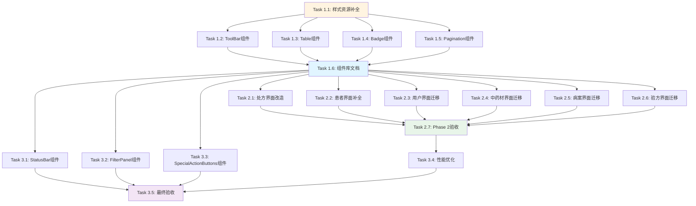

# Desktop端管理界面UI统一化任务分解

**文档类型**: Tasks（任务分解）
**创建时间**: 2025-11-06
**文档版本**: v1.0
**作者**: Claude Code
**关联文档**:
- 需求文档: `docs/explanation/requirements/ui-unification-requirements.md`
- 设计文档: `docs/explanation/design/ui-unification-design.md`
- Epic Issue: 待创建

---

## Epic概述

**Epic标题**: Desktop端管理界面UI统一化

**Epic描述**:
通过组件化和规范化实现6个管理界面（用户、中药材、病案、验方、处方、患者）的UI统一，提升代码复用率40-60%，设计一致性达到95%，针对1920x1080分辨率优化视觉体验。

**Epic目标**:
- 提取8个核心通用组件
- 改造处方管理界面（过时设计）
- 补全患者管理界面（Phase 2未完成功能）
- 迁移其他4个界面至新组件体系
- 制定并应用UI规范（字体、间距、颜色）

**Epic约束**:
- 不引入第三方UI库（Constitution技术黑名单）
- 符合MVP原则（够用即好）
- 所有改动需通过手动测试验证无功能回归

**总工作量估算**: 13-15个工作日

**实施周期**: 3-4周（Phase 1: 1-2周, Phase 2: 2-3周, Phase 3: 3-4周）

---

## Phase 1: 核心组件开发（第1-2周）

### Task 1.1: 样式资源补全

**优先级**: P0 - Critical
**工作量**: 2天
**依赖**: 无
**负责模块**: Infrastructure

**目标**:
补全UnifiedComponents.xaml样式资源，定义Type Ramp、Spacing System和分页样式

**详细描述**:
1. 定义Type Ramp字体大小系统（Caption 12/16, Body 14/20, Subtitle 20/28, Title 28/36 epx）
2. 定义Spacing System间距系统（SpacingXSmall 4, SpacingSmall 8, SpacingMedium 12等）
3. 定义CornerRadius圆角半径（Small 4, Medium 8, Large 12）
4. 补充分页控件样式（PaginationControlButton, PaginationCurrentPage, PaginationPageNumber）
5. 补充DataGrid行/列头样式（BaseDataGridRow, BaseDataGridColumnHeader）
6. 实现必要的转换器（NullToVisibilityConverter, EnumDescriptionConverter）

**影响文件**:
- `src/Client/Desktop/Infrastructure/LYBT.Desktop.Infrastructure/Themes/UnifiedComponents.xaml` (CREATE)
- `src/Client/Desktop/Infrastructure/LYBT.Desktop.Infrastructure/Converters/NullToVisibilityConverter.cs` (CREATE)
- `src/Client/Desktop/Infrastructure/LYBT.Desktop.Infrastructure/Converters/EnumDescriptionConverter.cs` (MODIFY)

**验收标准**:
- [ ] 编译通过，0 errors, 0 warnings
- [ ] 所有间距值符合4 epx规则
- [ ] 字体大小符合Type Ramp标准
- [ ] 转换器单元测试通过
- [ ] 资源键命名符合规范（PascalCase）

**测试清单**:
- [ ] 在Demo界面中引用所有样式资源，无ResourceNotFoundException
- [ ] 验证Spacing资源渲染为正确的Thickness值
- [ ] 验证FontSize资源渲染为正确的Double值
- [ ] NullToVisibilityConverter测试：null→Collapsed, not-null→Visible
- [ ] EnumDescriptionConverter测试：枚举值→描述文本

**相关文档**:
- WPF Typography: https://learn.microsoft.com/en-us/windows/apps/design/style/typography
- WPF Spacing: https://learn.microsoft.com/en-us/windows/apps/design/layout/layout-spacing

---

### Task 1.2: UnifiedManagementToolBar组件

**优先级**: P0 - Critical
**工作量**: 3天
**依赖**: Task 1.1
**负责模块**: Infrastructure

**目标**:
实现统一的工具栏组件，支持搜索、筛选、操作按钮三个区域

**详细描述**:
1. 创建UnifiedManagementToolBar UserControl
2. 定义依赖属性：SearchText, SearchCommand, SearchPlaceholder, SearchTooltip, FilterContent, ActionButtons
3. 实现XAML模板：Grid布局（左侧搜索+筛选，右侧操作按钮）
4. 实现搜索框Enter键触发搜索（使用Interaction.Triggers）
5. 实现筛选区和操作按钮插槽（ContentPresenter）
6. 编写单元测试（覆盖率≥80%）
7. 创建Demo界面（UserManagementToolBarDemo.xaml）

**影响文件**:
- `src/Client/Desktop/Infrastructure/LYBT.Desktop.Infrastructure/Components/Management/UnifiedManagementToolBar.xaml` (CREATE)
- `src/Client/Desktop/Infrastructure/LYBT.Desktop.Infrastructure/Components/Management/UnifiedManagementToolBar.xaml.cs` (CREATE)
- `tests/UnitTests/Client/LYBT.Desktop.Infrastructure.Tests/Components/UnifiedManagementToolBarTests.cs` (CREATE)
- `src/Client/Desktop/Infrastructure/LYBT.Desktop.Infrastructure/Demos/UserManagementToolBarDemo.xaml` (CREATE)

**验收标准**:
- [ ] 编译通过，0 errors, 0 warnings
- [ ] 单元测试通过，覆盖率≥80%
- [ ] Demo界面可正常运行
- [ ] 搜索框支持Enter键触发SearchCommand
- [ ] 搜索框支持按钮点击触发SearchCommand
- [ ] FilterContent插槽可正常显示自定义控件
- [ ] ActionButtons插槽可正常显示按钮集合
- [ ] 应用ToolBarContainer样式

**测试清单**:
- [ ] SearchText双向绑定：设置值后可读取，外部更新后可反映到UI
- [ ] SearchCommand执行：Enter键和按钮点击均可触发
- [ ] SearchPlaceholder显示：搜索框显示占位符文本
- [ ] FilterContent插槽：添加ComboBox后可正常显示和交互
- [ ] ActionButtons插槽：添加多个Button后正确水平排列

**代码示例** (验收参考):
```xaml
<components:UnifiedManagementToolBar
    SearchText="{Binding SearchText, UpdateSourceTrigger=PropertyChanged}"
    SearchCommand="{Binding SearchCommand}"
    SearchPlaceholder="输入用户名搜索...">
    <components:UnifiedManagementToolBar.ActionButtons>
        <StackPanel Orientation="Horizontal">
            <Button Content="➕ 新增" Command="{Binding AddCommand}" Style="{StaticResource PrimaryButton}" />
            <Button Content="🔄 刷新" Command="{Binding RefreshCommand}" Style="{StaticResource SecondaryButton}" />
        </StackPanel>
    </components:UnifiedManagementToolBar.ActionButtons>
</components:UnifiedManagementToolBar>
```

---

### Task 1.3: UnifiedManagementTable组件

**优先级**: P0 - Critical
**工作量**: 4天
**依赖**: Task 1.1
**负责模块**: Infrastructure

**目标**:
实现统一的数据表格组件，支持自定义列和行级操作按钮集合

**详细描述**:
1. 创建UnifiedManagementTable UserControl
2. 定义依赖属性：ItemsSource, SelectedItem, SelectedItems, AutoGenerateColumns, RowActions
3. 创建RowActionDefinition类（Label, CommandBinding, StyleKey, ToolTip, ShowDivider, Width）
4. 实现XAML模板：DataGrid + 操作列模板（ItemsControl动态生成按钮）
5. 实现命令绑定：RelativeSource AncestorType=DataGrid
6. 应用BaseDataGrid, BaseDataGridRow, BaseDataGridColumnHeader样式
7. 编写单元测试（覆盖率≥80%）
8. 创建Demo界面（测试1000行数据性能）

**影响文件**:
- `src/Client/Desktop/Infrastructure/LYBT.Desktop.Infrastructure/Components/Management/UnifiedManagementTable.xaml` (CREATE)
- `src/Client/Desktop/Infrastructure/LYBT.Desktop.Infrastructure/Components/Management/UnifiedManagementTable.xaml.cs` (CREATE)
- `src/Client/Desktop/Infrastructure/LYBT.Desktop.Infrastructure/Models/RowActionDefinition.cs` (CREATE)
- `tests/UnitTests/Client/LYBT.Desktop.Infrastructure.Tests/Components/UnifiedManagementTableTests.cs` (CREATE)
- `src/Client/Desktop/Infrastructure/LYBT.Desktop.Infrastructure/Demos/UserManagementTableDemo.xaml` (CREATE)

**验收标准**:
- [ ] 编译通过，0 errors, 0 warnings
- [ ] 单元测试通过，覆盖率≥80%
- [ ] Demo界面可正常显示1000行数据，帧率≥60fps
- [ ] 行级操作按钮可正确触发ViewModel命令
- [ ] 按钮样式符合设计规范（SuccessButton, DangerButton等）
- [ ] 操作列宽度自适应（MinWidth=200）
- [ ] 支持自定义列定义

**测试清单**:
- [ ] ItemsSource绑定：设置数据源后DataGrid正确显示
- [ ] SelectedItem双向绑定：选中行后ViewModel属性更新
- [ ] RowActions动态生成：设置3个按钮定义后显示3个按钮
- [ ] 命令参数传递：点击按钮后CommandParameter为当前行数据
- [ ] 按钮样式应用：StyleKey="DangerButton"正确应用红色样式
- [ ] 性能测试：加载1000行数据≤2s

**代码示例** (验收参考):
```csharp
public class RowActionDefinition
{
    public string Label { get; set; }
    public string CommandBinding { get; set; }
    public string StyleKey { get; set; } = "SecondaryButton";
    public string ToolTip { get; set; }
    public bool ShowDivider { get; set; }
    public double Width { get; set; } = double.NaN;
}
```

---

### Task 1.4: UnifiedStatusBadge组件

**优先级**: P0 - Critical
**工作量**: 1天
**依赖**: Task 1.1
**负责模块**: Infrastructure

**目标**:
实现统一的状态标签组件，支持枚举值绑定和自定义颜色

**详细描述**:
1. 创建UnifiedStatusBadge UserControl
2. 定义依赖属性：Status, Converter, BackgroundColor, ForegroundColor, CornerRadius
3. 实现XAML模板：Border + TextBlock（圆角、内边距符合规范）
4. 支持枚举描述转换器绑定
5. 编写单元测试（覆盖率≥80%）
6. 创建Demo界面（展示不同状态的Badge）

**影响文件**:
- `src/Client/Desktop/Infrastructure/LYBT.Desktop.Infrastructure/Components/Display/UnifiedStatusBadge.xaml` (CREATE)
- `src/Client/Desktop/Infrastructure/LYBT.Desktop.Infrastructure/Components/Display/UnifiedStatusBadge.xaml.cs` (CREATE)
- `tests/UnitTests/Client/LYBT.Desktop.Infrastructure.Tests/Components/UnifiedStatusBadgeTests.cs` (CREATE)
- `src/Client/Desktop/Infrastructure/LYBT.Desktop.Infrastructure/Demos/StatusBadgeDemo.xaml` (CREATE)

**验收标准**:
- [ ] 编译通过，0 errors, 0 warnings
- [ ] 单元测试通过，覆盖率≥80%
- [ ] Demo界面可正常显示不同状态的Badge
- [ ] 枚举值可正确转换为描述文本
- [ ] 背景色/前景色可自定义
- [ ] 圆角半径默认4 epx
- [ ] 内边距为12,6 epx（水平12，垂直6）

**测试清单**:
- [ ] Status绑定：设置枚举值后TextBlock显示正确文本
- [ ] Converter应用：使用EnumDescriptionConverter后显示枚举Description
- [ ] BackgroundColor自定义：设置#10B981后Border背景为绿色
- [ ] ForegroundColor自定义：设置White后TextBlock前景为白色
- [ ] CornerRadius默认值：未设置时为4 epx

**代码示例** (验收参考):
```xaml
<components:UnifiedStatusBadge
    Status="{Binding CaseStatus}"
    Converter="{StaticResource EnumDescriptionConverter}"
    BackgroundColor="#10B981"
    ForegroundColor="White" />
```

---

### Task 1.5: UnifiedPaginationBar组件

**优先级**: P0 - Critical
**工作量**: 2天
**依赖**: Task 1.1
**负责模块**: Infrastructure

**目标**:
实现统一的分页控件，支持首页、上一页、下一页、末页导航

**详细描述**:
1. 创建UnifiedPaginationBar UserControl
2. 定义依赖属性：CurrentPage, TotalPages, FirstPageCommand, PreviousPageCommand, NextPageCommand, LastPageCommand, ShowFirstLast
3. 实现XAML模板：StackPanel（水平排列）+ 按钮 + 页码显示
4. 实现ShowFirstLast控制首页/末页按钮显示（适配Phase 2）
5. 应用PaginationControlButton, PaginationCurrentPage, PaginationPageNumber样式
6. 编写单元测试（覆盖率≥80%）
7. 创建Demo界面（测试分页交互）

**影响文件**:
- `src/Client/Desktop/Infrastructure/LYBT.Desktop.Infrastructure/Components/Display/UnifiedPaginationBar.xaml` (CREATE)
- `src/Client/Desktop/Infrastructure/LYBT.Desktop.Infrastructure/Components/Display/UnifiedPaginationBar.xaml.cs` (CREATE)
- `tests/UnitTests/Client/LYBT.Desktop.Infrastructure.Tests/Components/UnifiedPaginationBarTests.cs` (CREATE)
- `src/Client/Desktop/Infrastructure/LYBT.Desktop.Infrastructure/Demos/PaginationBarDemo.xaml` (CREATE)

**验收标准**:
- [ ] 编译通过，0 errors, 0 warnings
- [ ] 单元测试通过，覆盖率≥80%
- [ ] Demo界面分页按钮可正常点击
- [ ] CurrentPage/TotalPages双向绑定正确
- [ ] 分页命令可正确触发ViewModel方法
- [ ] ShowFirstLast=False时隐藏首页/末页按钮
- [ ] 页码显示格式："1 / 10"

**测试清单**:
- [ ] CurrentPage双向绑定：外部更新后页码显示更新
- [ ] FirstPageCommand执行：点击"首页"后ViewModel方法被调用
- [ ] PreviousPageCommand执行：点击"上一页"后ViewModel方法被调用
- [ ] NextPageCommand执行：点击"下一页"后ViewModel方法被调用
- [ ] LastPageCommand执行：点击"末页"后ViewModel方法被调用
- [ ] ShowFirstLast切换：设置为False后首页/末页按钮不可见

**代码示例** (验收参考):
```xaml
<!-- 完整分页控件 -->
<components:UnifiedPaginationBar
    CurrentPage="{Binding CurrentPage}"
    TotalPages="{Binding TotalPages}"
    FirstPageCommand="{Binding FirstPageCommand}"
    PreviousPageCommand="{Binding PreviousPageCommand}"
    NextPageCommand="{Binding NextPageCommand}"
    LastPageCommand="{Binding LastPageCommand}"
    ShowFirstLast="True" />

<!-- Phase 2简化版 -->
<components:UnifiedPaginationBar
    CurrentPage="{Binding CurrentPage}"
    TotalPages="{Binding TotalPages}"
    PreviousPageCommand="{Binding PreviousPageCommand}"
    NextPageCommand="{Binding NextPageCommand}"
    ShowFirstLast="False" />
```

---

### Task 1.6: 组件库文档

**优先级**: P1 - Important
**工作量**: 1天
**依赖**: Task 1.2, 1.3, 1.4, 1.5
**负责模块**: Infrastructure

**目标**:
编写组件库使用文档，提供示例和FAQ

**详细描述**:
1. 创建Components/README.md
2. 提供每个组件的功能说明
3. 提供每个组件的使用示例（XAML代码）
4. 说明依赖属性和用法
5. 提供常见问题FAQ（如"如何自定义搜索框占位符？"）
6. 提供组件清单和依赖关系表

**影响文件**:
- `src/Client/Desktop/Infrastructure/LYBT.Desktop.Infrastructure/Components/README.md` (CREATE)

**验收标准**:
- [ ] 文档完整且准确
- [ ] 示例代码可直接复制使用
- [ ] Markdown格式正确（标题、代码块、表格）
- [ ] 包含至少5个FAQ条目

**文档结构**:
```markdown
# LYBT Desktop通用组件库

## 组件清单
- UnifiedManagementToolBar
- UnifiedManagementTable
- UnifiedStatusBadge
- UnifiedPaginationBar

## 快速开始
...

## 组件详细说明
### UnifiedManagementToolBar
...

## FAQ
1. 如何自定义搜索框占位符？
2. 如何隐藏首页/末页按钮？
...
```

---

## Phase 2: 界面改造与迁移（第2-3周）

### Task 2.1: 处方管理界面改造

**优先级**: P0 - Critical
**工作量**: 3天
**依赖**: Phase 1所有任务
**负责模块**: Prescriptions

**目标**:
彻底改造处方管理界面，替换过时的ToolBarTray和MaterialDesignFlatButton

**详细描述**:
1. 替换ToolBarTray + ToolBar为UnifiedManagementToolBar组件
2. 替换MaterialDesignFlatButton为统一样式（PrimaryButton, SuccessButton, DangerButton等）
3. 迁移至UnifiedManagementTable组件
4. 添加UnifiedStatusBar和UnifiedPaginationBar组件
5. 定义RowActions集合（查看、编辑、患者历史、复制、打印、删除）
6. 定义筛选区内容（日期范围筛选）
7. 手动测试所有功能（搜索、筛选、CRUD、导出）

**影响文件**:
- `src/Client/Desktop/Modules/LYBT.Desktop.Prescriptions/Views/PrescriptionManagementView.xaml` (MODIFY)
- `src/Client/Desktop/Modules/LYBT.Desktop.Prescriptions/ViewModels/PrescriptionManagementViewModel.cs` (MODIFY)

**验收标准**:
- [ ] 编译通过，0 errors, 0 warnings
- [ ] 无ToolBarTray或MaterialDesignFlatButton引用
- [ ] 手动测试通过（见测试清单）
- [ ] XAML代码行数减少≥40%
- [ ] UI一致性评分≥90%

**测试清单**:
- [ ] 搜索功能：输入关键字，回车或点击搜索按钮，显示匹配结果
- [ ] 日期筛选：选择开始日期和结束日期，点击搜索，显示筛选结果
- [ ] 新增处方：点击"新增处方"，打开编辑对话框，填写信息，保存成功
- [ ] 查看功能：点击行级"查看"按钮，打开详情对话框，信息显示正确
- [ ] 编辑功能：点击行级"编辑"按钮，打开编辑对话框，修改信息，保存成功
- [ ] 患者历史：点击行级"患者历史"按钮，打开历史记录对话框
- [ ] 复制功能：点击行级"复制"按钮，创建副本成功
- [ ] 打印功能：点击行级"打印"按钮，打印预览正常
- [ ] 删除功能：点击行级"删除"按钮，显示确认对话框，确认后删除成功
- [ ] 导出功能：点击"导出"按钮，导出Excel成功
- [ ] 分页功能：点击首页/上一页/下一页/末页，正确跳转
- [ ] 刷新功能：点击"刷新"按钮，重新加载数据

**改造前后对比**:
```xaml
<!-- 改造前（过时） -->
<ToolBarTray Grid.Row="0">
    <ToolBar>
        <Button Content="查看" Style="{StaticResource MaterialDesignFlatButton}" />
        <Button Content="编辑" Style="{StaticResource MaterialDesignFlatButton}" />
    </ToolBar>
</ToolBarTray>

<!-- 改造后（统一） -->
<components:UnifiedManagementToolBar
    SearchText="{Binding SearchText}"
    SearchCommand="{Binding SearchCommand}">
    <components:UnifiedManagementToolBar.ActionButtons>
        <StackPanel Orientation="Horizontal">
            <Button Content="➕ 新增处方" Command="{Binding AddCommand}" Style="{StaticResource PrimaryButton}" />
            <Button Content="📤 导出" Command="{Binding ExportCommand}" Style="{StaticResource SecondaryButton}" />
        </StackPanel>
    </components:UnifiedManagementToolBar.ActionButtons>
</components:UnifiedManagementToolBar>
```

---

### Task 2.2: 患者管理界面补全

**优先级**: P1 - Important
**工作量**: 2天
**依赖**: Phase 1所有任务
**负责模块**: Patients

**目标**:
补全患者管理界面的Phase 2缺失功能（查看、编辑、首页/末页分页）

**详细描述**:
1. 在PatientManagementViewModel中补全ViewDetailsCommand和EditCommand
2. 在PatientManagementViewModel中补全FirstPageCommand和LastPageCommand
3. 在PrescriptionManagementView.xaml中添加查看、编辑按钮到RowActions
4. 迁移至UnifiedManagementToolBar组件
5. 迁移至UnifiedManagementTable组件
6. 设置UnifiedPaginationBar的ShowFirstLast=True
7. 手动测试所有功能

**影响文件**:
- `src/Client/Desktop/Modules/LYBT.Desktop.Patients/Views/PatientManagementView.xaml` (MODIFY)
- `src/Client/Desktop/Modules/LYBT.Desktop.Patients/ViewModels/PatientManagementViewModel.cs` (MODIFY)

**验收标准**:
- [ ] 编译通过，0 errors, 0 warnings
- [ ] 查看/编辑功能可正常使用
- [ ] 首页/末页分页可正常工作
- [ ] 手动测试通过（见测试清单）
- [ ] XAML代码行数减少≥30%

**测试清单**:
- [ ] 搜索功能：输入姓名或手机号，显示匹配结果
- [ ] 新增患者：点击"新增患者"，打开编辑对话框，填写信息，保存成功
- [ ] 查看功能：点击行级"查看"按钮，打开详情对话框，信息显示正确
- [ ] 编辑功能：点击行级"编辑"按钮，打开编辑对话框，修改信息，保存成功
- [ ] 删除功能：点击行级"删除"按钮，显示确认对话框，确认后删除成功
- [ ] 首页分页：点击"首页"，跳转到第1页
- [ ] 上一页分页：点击"上一页"，页码减1
- [ ] 下一页分页：点击"下一页"，页码加1
- [ ] 末页分页：点击"末页"，跳转到最后一页

**Phase 2注释清理**:
```csharp
// 移除这些Phase 2注释
// Phase 2: 仅保留删除按钮，查看/编辑功能待后续实现
// Phase 2: UnifiedListViewModelBase只提供上一页/下一页，暂不实现首页/末页
```

---

### Task 2.3: 用户管理界面迁移

**优先级**: P1 - Important
**工作量**: 1天
**依赖**: Phase 1所有任务
**负责模块**: Users

**目标**:
迁移用户管理界面至新组件体系

**详细描述**:
1. 替换工具栏为UnifiedManagementToolBar
2. 替换表格为UnifiedManagementTable
3. 替换状态栏为UnifiedStatusBar
4. 定义RowActions集合（查看、编辑、删除）
5. 验证功能无回归

**影响文件**:
- `src/Client/Desktop/Modules/LYBT.Desktop.Users/Views/UserManagementView.xaml` (MODIFY)

**验收标准**:
- [ ] 编译通过，0 errors, 0 warnings
- [ ] 手动测试通过
- [ ] XAML代码行数减少≥30%

---

### Task 2.4: 中药材管理界面迁移

**优先级**: P1 - Important
**工作量**: 1天
**依赖**: Phase 1所有任务
**负责模块**: Herbs

**目标**:
迁移中药材管理界面至新组件体系

**详细描述**:
1. 替换工具栏为UnifiedManagementToolBar
2. 替换表格为UnifiedManagementTable
3. 替换状态栏为UnifiedStatusBar
4. 定义RowActions集合（编辑、状态切换、删除）
5. 定义特殊操作按钮（导入、导出）
6. 验证功能无回归

**影响文件**:
- `src/Client/Desktop/Modules/LYBT.Desktop.Herbs/Views/HerbManagementView.xaml` (MODIFY)

**验收标准**:
- [ ] 编译通过，0 errors, 0 warnings
- [ ] 手动测试通过（包括导入/导出功能）
- [ ] XAML代码行数减少≥30%

---

### Task 2.5: 病案管理界面迁移

**优先级**: P1 - Important
**工作量**: 1天
**依赖**: Phase 1所有任务
**负责模块**: MedicalCase

**目标**:
迁移病案管理界面至新组件体系

**详细描述**:
1. 替换工具栏为UnifiedManagementToolBar
2. 替换表格为UnifiedManagementTable
3. 替换状态栏为UnifiedStatusBar
4. 定义RowActions集合（查看详情、编辑、诊疗记录、开具处方、打印、删除）
5. 定义筛选区内容（状态、日期范围）
6. 验证功能无回归

**影响文件**:
- `src/Client/Desktop/Modules/LYBT.Desktop.MedicalCase/Views/MedicalCaseManagementView.xaml` (MODIFY)

**验收标准**:
- [ ] 编译通过，0 errors, 0 warnings
- [ ] 手动测试通过（包括诊疗记录、开具处方功能）
- [ ] XAML代码行数减少≥30%

---

### Task 2.6: 验方管理界面迁移

**优先级**: P1 - Important
**工作量**: 1天
**依赖**: Phase 1所有任务
**负责模块**: Formula

**目标**:
迁移验方管理界面至新组件体系

**详细描述**:
1. 替换工具栏为UnifiedManagementToolBar
2. 替换表格为UnifiedManagementTable
3. 替换状态栏为UnifiedStatusBar
4. 定义RowActions集合（查看、编辑、复制、删除）
5. 定义特殊操作按钮（导入、导出）
6. 验证功能无回归

**影响文件**:
- `src/Client/Desktop/Modules/LYBT.Desktop.Formula/Views/FormulaManagementView.xaml` (MODIFY)

**验收标准**:
- [ ] 编译通过，0 errors, 0 warnings
- [ ] 手动测试通过（包括复制、导入/导出功能）
- [ ] XAML代码行数减少≥30%

---

### Task 2.7: Phase 2验收

**优先级**: P0 - Critical
**工作量**: 1天
**依赖**: Task 2.1-2.6
**负责模块**: 全部

**目标**:
执行Phase 2完整验收，确保代码复用率≥50%，视觉一致性≥85%

**详细描述**:
1. 运行所有6个管理界面
2. 执行完整的手动测试清单（所有功能）
3. 测量代码复用率（统计XAML行数减少比例）
4. 测量视觉一致性评分（10项检查清单）
5. 创建Phase 2验收报告

**验收标准**:
- [ ] 所有界面编译通过，0 errors, 0 warnings
- [ ] 代码复用率≥50%
- [ ] 视觉一致性评分≥85%
- [ ] 无功能回归

**视觉一致性检查清单**（每项10分，总分100分）:
- [ ] 工具栏结构一致（高度、内边距、布局）
- [ ] 搜索框样式一致（字体、占位符、图标）
- [ ] 操作按钮样式一致（颜色、圆角、间距）
- [ ] DataGrid样式一致（行高、列头、边框）
- [ ] 分页控件样式一致（按钮、页码显示）
- [ ] 状态标签样式一致（背景色、圆角、字体）
- [ ] 间距符合4 epx规则（100%符合）
- [ ] 字体大小符合Type Ramp（100%符合）
- [ ] 1920x1080无滚动条（关键操作可见）
- [ ] 无过时样式引用（MaterialDesignFlatButton等）

**代码复用率计算**:
```
代码复用率 = (改造前总行数 - 改造后总行数) / 改造前总行数 × 100%
改造前总行数 ≈ 350 × 6 = 2100行
改造后总行数 ≈ 120 × 6 = 720行
代码复用率 ≈ (2100 - 720) / 2100 × 100% ≈ 65.7%
```

---

## Phase 3: 高级组件与完整验收（第3-4周）

### Task 3.1: UnifiedStatusBar组件

**优先级**: P1 - Important
**工作量**: 2天
**依赖**: Phase 1所有任务
**负责模块**: Infrastructure

**目标**:
实现统一的底部状态栏组件，管理左侧状态摘要和右侧分页控件

**详细描述**:
1. 创建UnifiedStatusBar UserControl
2. 定义依赖属性：StatusMessage, LeftContent, RightContent
3. 实现XAML模板：Grid布局（左侧状态，右侧分页）
4. 应用StatusBarContainer样式
5. 编写单元测试（覆盖率≥80%）
6. 迁移至6个管理界面

**影响文件**:
- `src/Client/Desktop/Infrastructure/LYBT.Desktop.Infrastructure/Components/Management/UnifiedStatusBar.xaml` (CREATE)
- `src/Client/Desktop/Infrastructure/LYBT.Desktop.Infrastructure/Components/Management/UnifiedStatusBar.xaml.cs` (CREATE)
- `tests/UnitTests/Client/LYBT.Desktop.Infrastructure.Tests/Components/UnifiedStatusBarTests.cs` (CREATE)
- 6个管理界面View文件 (MODIFY)

**验收标准**:
- [ ] 编译通过，单元测试通过
- [ ] 6个界面成功迁移
- [ ] StatusMessage绑定正确显示
- [ ] RightContent插槽可正常放置UnifiedPaginationBar

---

### Task 3.2: FilterPanel组件

**优先级**: P2 - Nice to Have
**工作量**: 3天
**依赖**: Phase 1所有任务
**负责模块**: Infrastructure

**目标**:
实现高级筛选面板组件，支持动态筛选控件集合

**详细描述**:
1. 创建FilterDefinition类（Label, Type, ItemsSource, SelectedValue等）
2. 创建FilterPanel UserControl
3. 支持ComboBox、DatePicker、TextBox等控件
4. 支持筛选条件重置
5. 编写单元测试（覆盖率≥80%）
6. 迁移至MedicalCase和Prescription界面

**影响文件**:
- `src/Client/Desktop/Infrastructure/LYBT.Desktop.Infrastructure/Components/Management/FilterPanel.xaml` (CREATE)
- `src/Client/Desktop/Infrastructure/LYBT.Desktop.Infrastructure/Components/Management/FilterPanel.xaml.cs` (CREATE)
- `src/Client/Desktop/Infrastructure/LYBT.Desktop.Infrastructure/Models/FilterDefinition.cs` (CREATE)
- `tests/UnitTests/Client/LYBT.Desktop.Infrastructure.Tests/Components/FilterPanelTests.cs` (CREATE)
- MedicalCaseManagementView.xaml (MODIFY)
- PrescriptionManagementView.xaml (MODIFY)

**验收标准**:
- [ ] 编译通过，单元测试通过
- [ ] MedicalCase和Prescription界面可正常筛选
- [ ] 支持ComboBox筛选（状态）
- [ ] 支持DatePicker筛选（日期范围）

---

### Task 3.3: SpecialActionButtons组件

**优先级**: P2 - Nice to Have
**工作量**: 2天
**依赖**: Phase 1所有任务
**负责模块**: Infrastructure

**目标**:
实现特殊操作按钮集合组件，支持导入/导出等功能

**详细描述**:
1. 创建ActionButtonDefinition类（Icon, Label, Command, SubActions等）
2. 创建SpecialActionButtons UserControl
3. 支持主按钮和子菜单（MenuItem）
4. 支持分隔符
5. 编写单元测试（覆盖率≥80%）
6. 迁移至Herb和Formula界面

**影响文件**:
- `src/Client/Desktop/Infrastructure/LYBT.Desktop.Infrastructure/Components/Actions/SpecialActionButtons.xaml` (CREATE)
- `src/Client/Desktop/Infrastructure/LYBT.Desktop.Infrastructure/Components/Actions/SpecialActionButtons.xaml.cs` (CREATE)
- `src/Client/Desktop/Infrastructure/LYBT.Desktop.Infrastructure/Models/ActionButtonDefinition.cs` (CREATE)
- `tests/UnitTests/Client/LYBT.Desktop.Infrastructure.Tests/Components/SpecialActionButtonsTests.cs` (CREATE)
- HerbManagementView.xaml (MODIFY)
- FormulaManagementView.xaml (MODIFY)

**验收标准**:
- [ ] 编译通过，单元测试通过
- [ ] Herb和Formula界面导入/导出功能正常
- [ ] 子菜单可正常展开（导出为Excel/CSV/PDF）

---

### Task 3.4: 性能优化

**优先级**: P1 - Important
**工作量**: 2天
**依赖**: Task 2.7
**负责模块**: 全部

**目标**:
优化性能，确保所有性能标准达标

**详细描述**:
1. 优化DataGrid虚拟化配置（EnableRowVirtualization, VirtualizingPanel.IsVirtualizing）
2. 优化搜索防抖（Debounce 300ms）
3. 测量响应时间（搜索、分页、首次加载）
4. 测量资源占用（内存、CPU）
5. 使用WPF Performance Suite或PerfView分析性能瓶颈
6. 创建性能测试报告

**影响文件**:
- 6个管理界面ViewModel文件 (MODIFY)
- UnifiedManagementTable.xaml (MODIFY)

**验收标准**:
- [ ] 搜索响应时间≤500ms
- [ ] 分页响应时间≤300ms
- [ ] 首次加载时间≤2s
- [ ] 单界面内存占用≤50MB
- [ ] DataGrid渲染1000行数据帧率≥60fps

**性能优化示例**:
```csharp
// 搜索防抖
private CancellationTokenSource _searchCts;

public string SearchText
{
    get => _searchText;
    set
    {
        if (SetProperty(ref _searchText, value))
        {
            _searchCts?.Cancel();
            _searchCts = new CancellationTokenSource();
            _ = DebounceSearchAsync(_searchCts.Token);
        }
    }
}

private async Task DebounceSearchAsync(CancellationToken cancellationToken)
{
    await Task.Delay(300, cancellationToken); // 300ms防抖
    if (!cancellationToken.IsCancellationRequested)
    {
        await SearchAsync();
    }
}
```

---

### Task 3.5: 最终验收

**优先级**: P0 - Critical
**工作量**: 1天
**依赖**: Task 3.1-3.4
**负责模块**: 全部

**目标**:
执行最终验收，确保代码复用率≥60%，视觉一致性≥95%

**详细描述**:
1. 运行所有6个管理界面
2. 执行完整的视觉一致性检查（10项检查清单）
3. 测量代码复用率（目标≥60%）
4. 测量视觉一致性评分（目标≥95%）
5. 验证所有性能标准达标
6. 创建最终验收报告

**验收标准**:
- [ ] 代码复用率≥60%
- [ ] 视觉一致性评分≥95%
- [ ] 所有性能标准达标
- [ ] 所有功能测试通过
- [ ] 组件库文档完整

**最终验收报告内容**:
1. **代码复用率分析**：改造前后XAML行数对比
2. **视觉一致性评分**：10项检查清单结果
3. **性能测试结果**：响应时间、资源占用
4. **功能测试结果**：手动测试清单通过率
5. **已知问题清单**：记录遗留问题和后续优化方向
6. **总结与建议**：项目总结、经验教训、未来演进方向

---

## 附录A: 任务依赖图



---

## 附录B: 工作量统计

| Phase | 任务数 | 总工作量 | 关键路径 |
|-------|-------|---------|---------|
| Phase 1 | 6 | 13天 | Task 1.1 → 1.3 → 1.6 |
| Phase 2 | 7 | 10天 | Task 2.1 → 2.7 |
| Phase 3 | 5 | 10天 | Task 3.4 → 3.5 |
| **总计** | **18** | **33天** | **13-15个工作日（并行）** |

**并行度分析**:
- Phase 1任务1.2-1.5可并行（依赖1.1完成后）
- Phase 2任务2.1-2.6可并行（依赖Phase 1完成后）
- Phase 3任务3.1-3.3可并行（依赖Phase 1完成后）

**实际工作日估算**:
- Phase 1: 5-7个工作日（部分任务可并行）
- Phase 2: 5-6个工作日（6个界面可并行改造）
- Phase 3: 3-4个工作日（组件开发可并行）
- **总计**: **13-17个工作日**

---

## 附录C: GitHub Issue模板预览

### Epic Issue模板

```markdown
### Epic: Desktop端管理界面UI统一化

**优先级**: P0 - Critical
**估算工期**: 3-4周（13-15个工作日）
**负责模块**: Infrastructure + 6个业务模块

#### 目标
通过组件化和规范化实现6个管理界面的UI统一，提升代码复用率40-60%，设计一致性达到95%。

#### 成功标准
- [ ] 代码复用率≥60%
- [ ] 视觉一致性评分≥95%
- [ ] 性能标准全部达标
- [ ] 所有功能测试通过

#### 子任务
- [ ] #XXXX Task 1.1: 样式资源补全
- [ ] #XXXX Task 1.2: UnifiedManagementToolBar组件
- [ ] #XXXX Task 1.3: UnifiedManagementTable组件
...

#### 相关文档
- 需求文档: docs/explanation/requirements/ui-unification-requirements.md
- 设计文档: docs/explanation/design/ui-unification-design.md
- 任务分解: docs/explanation/tasks/ui-unification-tasks.md
```

### Task Issue模板

```markdown
### Task 1.2: UnifiedManagementToolBar组件

**Epic**: #XXXX Desktop端管理界面UI统一化
**优先级**: P0 - Critical
**工作量**: 3天
**依赖**: #XXXX Task 1.1
**负责模块**: Infrastructure

#### 目标
实现统一的工具栏组件，支持搜索、筛选、操作按钮三个区域。

#### 验收标准
- [ ] 编译通过，0 errors, 0 warnings
- [ ] 单元测试通过，覆盖率≥80%
- [ ] Demo界面可正常运行
- [ ] 搜索框支持Enter键触发SearchCommand
- [ ] FilterContent插槽可正常显示自定义控件

#### 影响文件
- `src/Client/Desktop/Infrastructure/LYBT.Desktop.Infrastructure/Components/Management/UnifiedManagementToolBar.xaml` (CREATE)
- `src/Client/Desktop/Infrastructure/LYBT.Desktop.Infrastructure/Components/Management/UnifiedManagementToolBar.xaml.cs` (CREATE)
- `tests/UnitTests/Client/LYBT.Desktop.Infrastructure.Tests/Components/UnifiedManagementToolBarTests.cs` (CREATE)

#### 测试清单
- [ ] SearchText双向绑定测试
- [ ] SearchCommand执行测试（Enter键和按钮点击）
- [ ] SearchPlaceholder显示测试
- [ ] FilterContent插槽测试
- [ ] ActionButtons插槽测试

🤖 Generated with [Claude Code](https://claude.com/claude-code)

Co-Authored-By: Claude <noreply@anthropic.com>
```

---

**文档状态**: ✅ 已完成
**下一步**: 生成GitHub Issues（Epic + 18个Task Issues）
**最后更新**: 2025-11-06
