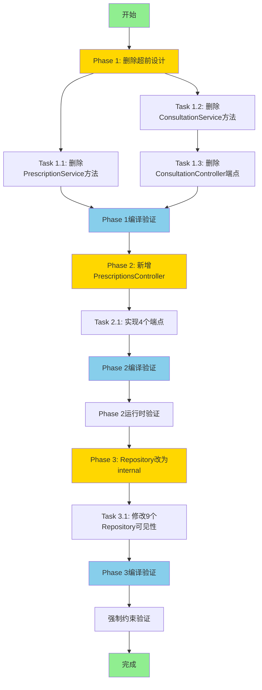

# Server端重构任务分解清单

**创建时间**: 2025-10-27
**版本**: v1.0
**对应设计**: `docs/explanation/design/server-refactor-design.md`
**对应需求**: `docs/explanation/requirements/server-refactor-requirements-v2.md`

---

## 📊 任务统计

| 指标 | 数值 |
|-----|------|
| **总任务数** | 5个任务 |
| **预估总工作量** | 4-6小时 |
| **Phase数量** | 3个阶段 |
| **代码净删除量** | ~350行（删除500行，新增150行） |

### 工作量分布

```
Phase 1（删除）：1-2小时（33%）
Phase 2（新增）：2-3小时（50%）
Phase 3（约束）：0.5小时（17%）
```

---

## Phase 1: 删除超前设计代码

**目标**: 删除所有无需求支撑的超前设计代码
**预估时间**: 1-2小时
**代码删除量**: ~283行

### Task 1.1: 删除PrescriptionService的6个方法

**任务描述**:
删除PrescriptionService和IPrescriptionService中的6个超前设计方法

**删除清单**:
1. `GetPagedAsync` (Line 55-98) - 无分页查询需求
2. `RecalculatePriceAsync` (Line 169-194) - 无价格重算需求
3. `GeneratePrintFormatAsync` (Line 201-217) - 无打印功能需求
4. `GeneratePrescriptionNoAsync` (Line 278-303) - 无处方号生成需求
5. `GetStatisticsAsync` (Line 308-347) - 无统计功能需求
6. `GetRangeStatisticsAsync` (Line 352-397) - 无范围统计需求

**影响文件**:
- `src/Server/Modules/LYBT.Module.Prescriptions/Services/PrescriptionService.cs`
- `src/Server/Interfaces/Services/IPrescriptionService.cs`

**代码量**: ~199行（实现） + ~20行（接口） = ~219行

**预估工作量**: 0.5-1小时

**依赖关系**: 无前置依赖

**验收标准**:
- [ ] PrescriptionService.cs删除6个方法实现
- [ ] IPrescriptionService.cs删除6个接口签名
- [ ] 编译通过（0 errors, 0 warnings）
- [ ] grep验证无遗留调用

**检查命令**:
```bash
# 检查是否有调用
grep -r "GetPagedAsync\|RecalculatePriceAsync\|GeneratePrintFormatAsync\|GeneratePrescriptionNoAsync\|GetStatisticsAsync\|GetRangeStatisticsAsync" src/
```

---

### Task 1.2: 删除ConsultationService的2个方法

**任务描述**:
删除ConsultationService和IConsultationService中的2个超前设计方法

**删除清单**:
1. `GetPagedAsync` (Line 32-62) - 无分页查询需求
2. `SearchAsync` (Line 116-132) - 无搜索功能需求

**影响文件**:
- `src/Server/Modules/LYBT.Module.Consultation/Services/ConsultationService.cs`
- `src/Server/Interfaces/Services/IConsultationService.cs`

**代码量**: ~48行（实现） + ~8行（接口） = ~56行

**预估工作量**: 0.3-0.5小时

**依赖关系**: 无前置依赖（可与Task 1.1并行）

**验收标准**:
- [ ] ConsultationService.cs删除2个方法实现
- [ ] IConsultationService.cs删除2个接口签名
- [ ] 编译通过（0 errors, 0 warnings）

---

### Task 1.3: 删除ConsultationController的2个端点

**任务描述**:
删除ConsultationController中的2个超前设计端点

**删除清单**:
1. `GET /consultations` - GetConsultations方法 (Line 38-54) - 无分页查询需求
2. `GET /consultations/search` - Search方法 (Line 118-136) - 无搜索功能需求

**影响文件**:
- `src/Server/Services/LYBT.WebAPI/Controllers/ConsultationController.cs`

**代码量**: ~36行

**预估工作量**: 0.2-0.5小时

**依赖关系**: 依赖Task 1.2完成（Service方法删除后再删除Controller端点）

**保留的端点**:
- ✅ `GET /consultations/{id}` - GetById
- ✅ `GET /consultations/medicalcase/{medicalCaseId}` - GetByMedicalCaseId

**验收标准**:
- [ ] ConsultationController.cs删除2个端点方法
- [ ] 只保留2个只读端点
- [ ] 编译通过（0 errors, 0 warnings）
- [ ] Swagger文档更新（移除2个端点）

---

### Phase 1汇总验收

**总代码删除量**: ~283行

**编译验证**:
```bash
dotnet build LYBT.All.sln -c Release --no-restore
# 预期：0 errors, 0 warnings
```

**运行时验证**:
- [ ] 启动WebAPI，验证应用正常运行
- [ ] Swagger文档只显示2个Consultation端点

---

## Phase 2: 新增PrescriptionsController端点

**目标**: 补充PrescriptionsController的只读查询端点
**预估时间**: 2-3小时
**代码新增量**: ~150行

### Task 2.1: 实现PrescriptionsController的4个端点

**任务描述**:
在PrescriptionsController中实现4个只读查询端点

**新增端点清单**:

| 端点路径 | HTTP方法 | 功能描述 | 对应需求 |
|---------|---------|---------|---------|
| `/api/v1/prescriptions/{id}` | GET | 获取处方详情（含药材明细） | 隐含需求 |
| `/api/v1/prescriptions/medicalcase/{medicalCaseId}` | GET | 查看病案的处方列表 | 隐含需求 |
| `/api/v1/prescriptions/search` | GET | 按病症/患者搜索处方 | **REQ-2** |
| `/api/v1/prescriptions/patient/{patientId}/recent` | GET | 获取患者最近处方 | **REQ-1** |

**影响文件**:
- `src/Server/Services/LYBT.WebAPI/Controllers/PrescriptionsController.cs`

**代码量**: ~150行（完整实现）

**预估工作量**: 2-3小时

**依赖关系**:
- 无依赖PrescriptionService方法（已存在）
- 可与Phase 1并行或顺序执行

**实现要点**:
1. **端点1 - GetById**:
   - 参数验证：`ValidateGuid<PrescriptionDto>(id, "处方ID")`
   - 调用Service：`_prescriptionService.GetByIdAsync(id)`
   - 错误处理：400（ID错误）、404（不存在）、500（内部错误）

2. **端点2 - GetByMedicalCaseId**:
   - 参数验证：`ValidateGuid<List<PrescriptionDto>>(medicalCaseId, "病案ID")`
   - 调用Service：`_prescriptionService.GetByMedicalCaseIdAsync(medicalCaseId)`

3. **端点3 - Search（REQ-2）**:
   - 参数验证：至少提供一个搜索条件（patientName或symptomKeyword）
   - 调用Service：`_prescriptionService.SearchPrescriptionsAsync(patientName, symptomKeyword)`
   - 支持组合搜索

4. **端点4 - GetRecentByPatient（REQ-1）**:
   - 参数验证：patientId（Guid）+ count范围（1-20）
   - 调用Service：`_prescriptionService.GetPatientRecentPrescriptionsAsync(patientId, count)`
   - 默认count=5

**参考模板**:
- ConsultationController的2个保留端点（GetById、GetByMedicalCaseId）
- 相同的错误处理模式和代码风格

**验收标准**:
- [ ] 创建PrescriptionsController.cs文件
- [ ] 实现4个端点方法（完整代码）
- [ ] 添加XML注释文档
- [ ] 编译通过（0 errors, 0 warnings）
- [ ] 运行时验证（启动WebAPI，测试4个端点）
- [ ] Swagger文档验证（4个端点出现在Swagger UI）

**测试命令**:
```bash
# 启动WebAPI
cd src/Server/Services/LYBT.WebAPI
dotnet run

# 测试端点（需要Bearer Token）
curl -X GET "https://localhost:5001/api/v1/prescriptions/{id}" -H "Authorization: Bearer {token}"
curl -X GET "https://localhost:5001/api/v1/prescriptions/search?symptomKeyword=感冒" -H "Authorization: Bearer {token}"
curl -X GET "https://localhost:5001/api/v1/prescriptions/patient/{patientId}/recent?count=5" -H "Authorization: Bearer {token}"
```

**Swagger验证**:
- [ ] 访问 `https://localhost:5001/swagger`
- [ ] 验证4个新端点出现在Swagger UI中
- [ ] 验证端点文档完整（参数、返回值、错误码）

---

## Phase 3: Repository改为internal

**目标**: 强化聚合根约束，防止Controller直接访问Repository
**预估时间**: 0.5小时
**代码修改量**: 9个文件

### Task 3.1: 修改9个Repository类的可见性

**任务描述**:
将所有Repository类从`public`改为`internal`，强制所有访问通过Service层

**Repository类清单**:

| Repository类 | 文件位置 | 当前可见性 | 修改后 |
|-------------|---------|-----------|--------|
| `ConsultationRepository` | `LYBT.Module.Consultation/Repositories/` | `public` | `internal` |
| `PrescriptionRepository` | `LYBT.Module.Prescriptions/Repositories/` | `public` | `internal` |
| `MedicalCaseRepository` | `LYBT.Module.MedicalCase/Repositories/` | `public` | `internal` |
| `PatientRepository` | `LYBT.Module.Patients/Repositories/` | `public` | `internal` |
| `UserRepository` | `LYBT.Module.Users/Repositories/` | `public` | `internal` |
| `HerbRepository` | `LYBT.Module.Herbs/Repositories/` | `public` | `internal` |
| `FormulaRepository` | `LYBT.Module.Formula/Repositories/` | `public` | `internal` |
| `AuthRepository` | `LYBT.Module.Auth/Repositories/` | `public` | `internal` |
| `PrescriptionItemRepository` | `LYBT.Module.Prescriptions/Repositories/` | `public` | `internal` |

**修改示例**:

**修改前**:
```csharp
namespace LYBT.Module.Consultation.Repositories
{
    public class ConsultationRepository : BaseRepository<ConsultationEntity>, IConsultationRepository
    {
        // ...
    }
}
```

**修改后**:
```csharp
namespace LYBT.Module.Consultation.Repositories
{
    internal class ConsultationRepository : BaseRepository<ConsultationEntity>, IConsultationRepository
    {
        // ...
    }
}
```

**重要约束**:
- ✅ Repository类改为`internal`
- ✅ 接口保持`public`（DI需要）
- ✅ DI注册保持不变（容器可解析internal类）

**预估工作量**: 0.3-0.5小时

**依赖关系**:
- 建议等待Phase 1和Phase 2完成后执行
- 避免修改过程中的编译混淆

**验收标准**:
- [ ] 9个Repository类全部改为internal
- [ ] 所有接口保持public
- [ ] 编译通过（0 errors, 0 warnings）
- [ ] 强制约束验证通过（尝试直接访问Repository应编译失败）

**强制约束验证**:

创建临时测试文件：
```csharp
// TestController.cs（临时）
using LYBT.Module.Consultation.Repositories;

public class TestController
{
    // ❌ 应编译失败
    private readonly ConsultationRepository _repo;

    public TestController(ConsultationRepository repo)
    {
        _repo = repo;
    }
}
```

**预期结果**: 编译错误
```
error CS0122: 'ConsultationRepository' is inaccessible due to its protection level
```

**验证成功后删除TestController**

---

## 📋 依赖关系图



---

## 🔄 执行策略

### 推荐执行顺序

#### 选项A：顺序执行（保守策略）
```
Phase 1 → Phase 2 → Phase 3
```

**优势**:
- 每个Phase完成后立即验证
- 问题隔离清晰
- 适合单人开发

**时间**: 4-6小时（连续）

#### 选项B：并行执行（激进策略）
```
Phase 1 (Task 1.1 + Task 1.2 并行) → Task 1.3 → Phase 2 (与Phase 1并行) → Phase 3
```

**优势**:
- 缩短总时间
- 删除和新增可同时进行

**风险**:
- 需要仔细管理分支
- 可能出现编译冲突

**时间**: 3-4小时（并行）

### 推荐方案：选项A（顺序执行）

**理由**:
1. 单人开发，无并行优势
2. Phase 1删除操作风险低
3. Phase 2新增需要验证完整性
4. Phase 3约束验证需要稳定基础

---

## ✅ 整体验收标准

### 编译验收
```bash
dotnet build LYBT.All.sln -c Release --no-restore
# 预期：0 errors, 0 warnings
```

### 运行时验收
- [ ] 启动应用（Client + Server）
- [ ] 测试REQ-1：查询患者历史处方（调用`/prescriptions/patient/{id}/recent`）
- [ ] 测试REQ-2：按病症关键词搜索处方（调用`/prescriptions/search?symptomKeyword=感冒`）
- [ ] 验证Consultation端点（只保留2个端点）
- [ ] 验证Repository约束（Controller无法直接访问Repository）

### Swagger验收
- [ ] Swagger文档更新
  - [ ] 新增4个Prescription端点
  - [ ] 删除2个Consultation端点
  - [ ] 端点文档完整（参数、返回值、错误码）

### 代码质量验收
- [ ] 代码风格一致（参考ConsultationController）
- [ ] XML注释完整
- [ ] 错误处理规范
- [ ] 参数验证完备

---

## 📝 后续文档更新任务

完成实施后需同步更新以下文档：

1. **架构文档**:
   - [ ] `docs/explanation/architecture/server/README.md` - 更新Consultation/Prescription模块说明
   - [ ] `docs/explanation/architecture/server/module-consultation.md` - 更新端点清单
   - [ ] `docs/explanation/architecture/server/module-prescription.md` - 新增端点清单

2. **API文档**:
   - [ ] `docs/reference/api/prescriptions-api.md` - 新增Prescription API文档（4个端点）
   - [ ] `docs/reference/api/consultation-api.md` - 更新Consultation API（删除2个端点）

3. **导航文档**:
   - [ ] `docs/index.md` - 更新导航链接
   - [ ] `docs/reference/quick-reference/api-reference.md` - 更新API快速参考

4. **开发指南**:
   - [ ] `docs/how-to-guides/server/controller-guidelines.md` - 补充只读Controller模式
   - [ ] `docs/how-to-guides/server/repository-guidelines.md` - 补充internal约束说明

---

## 🎯 关键成功因素

### 技术要点
1. **严格遵循MVP原则**: 有需求才有代码
2. **保持0警告基线**: 编译必须0 warnings
3. **完整运行时验证**: 不能只编译通过
4. **架构合规性**: Repository强制internal

### 风险控制
1. **编译验证**: 每个Task完成后立即编译
2. **运行时验证**: 每个Phase完成后启动应用测试
3. **回滚准备**: 使用git分支隔离变更

### 质量保证
1. **代码审查**: 参考ConsultationController模板
2. **文档同步**: 代码变更后立即更新文档
3. **Issue跟踪**: 所有变更必须关联GitHub Issue

---

**生成者**: Claude Code (lybtzyzs-task-breakdown Skill)
**版本**: v1.0
**下一步**: 使用lybtzyzs-issue-template Skill批量创建GitHub Issues
